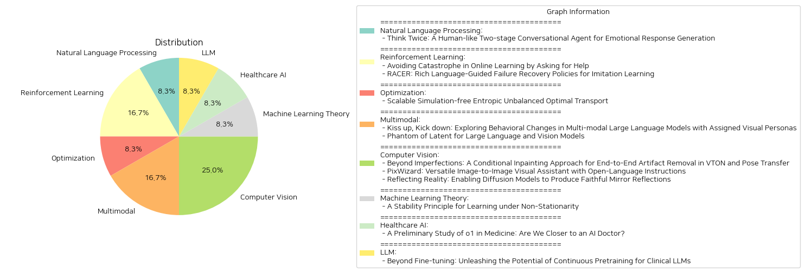

# Daily Artificial Intelligence Insights : Papers

## 🎉 Natural Language Processing

**요약:**

제목: '다시 생각하기: 감정적 응답 생성을 위한 인간과 유사한 2단계 대화 에이전트'

요약: 
현대의 감정 기반 대화 시스템은 감정과 의미를 통합된 신경망으로 모델링하여 인간과 유사한 대화를 목표로 하고 있다. 이러한 접근법은 감정과 의미 간의 상호 제약으로 인해 안전한 응답을 생성하는 경향이 있으며, 드문 감정 주석이 달린 대규모 대화 코퍼스를 필요로 한다. 인간 대화에서의 "다시 생각하기" 행동에 영감을 얻어, 우리는 감정적 대화를 생성하기 위한 2단계 대화 에이전트를 제안한다. 첫째, 감정 주석이 없는 대화 코퍼스로 훈련된 대화 모델이 맥락적 의미를 만족시키는 프로토타입 응답을 생성한다. 둘째, 첫 번째 단계의 프로토타입은 감정 정제기를 통해 공감 가설에 따라 수정된다. DailyDialog 및 EmpatheticDialogues 데이터 세트에 대한 실험 결과, 제안된 대화 에이전트가 감정 생성에 있어 비교 모델을 능가하며, 자동 및 인간 평가에서 의미적 성능을 유지함을 보여준다.

주요 주제 및 동향:
1. 감정과 의미의 통합 모델링
2. 두 단계로 나누어진 대화 시스템
3. 감정 주석 없는 코퍼스를 활용한 초반 응답 생성
4. 공감 가설에 기반한 감정 정제기

주요 사건 및 비판적 정보:
- 두 단계 대화 모델 제안: 기본적인 의미 충족 후 감정 정제기를 통해 공감과 정서를 강화.
- 실험적 결과: 새로운 시스템이 대화의 감정 생성 능력에서 우위를 차지하며, 기존 의미적 성능을 유지.
  
이벤트가 미친 영향:
- 감정 기반 대화 시스템 개선: 정해진 데이터에 불과했던 감정적 응답을 보다 인간적이고 상황에 맞게 생성.
- 감정 인식과 관련된 응용 분야에 큰 가능성: 예를 들어 고객 서비스, 상담 로봇 등에 활용 가능성이 있음.

종합 요약 및 결론:
이 연구는 인간과 유사한 감정적 대화 생성의 새로운 가능성을 제시한다. 감정과 의미를 별도의 단계로 나누어 처리함으로써 감정적 응답의 제작을 개선하고, 제한된 감정 주석 데이터에 의존하지 않는 대화 시스템을 개발하였다. 향후 이러한 2단계 시스템을 개선하여 더욱 풍부하고 맥락에 맞는 대화 에이전트의 개발이 기대된다.

**출처:**

 - Think Twice: A Human-like Two-stage Conversational Agent for Emotional Response Generation (https://deeplearn.org/arxiv/532279/think-twice:-a-human-like-two-stage-conversational-agent-for-emotional-response-generation)

## 🎇 Reinforcement Learning

**요약:**

보고서 요약:

1. 핵심 주제와 테마 추출:
   - 첫 번째 논문은 온라인 학습 환경에서 돌이킬 수 없는 실수를 피하기 위한 방법을 탐구하며, 멘토의 도움을 받아 카타스트로피(재앙)를 피하는 전략을 제안하고 있습니다.
   - 두 번째 논문은 로봇 조작에서 실패 회복 메커니즘의 부족 문제를 다루며 일반적인 언어 명령의 한계를 극복하기 위해 풍부한 언어 지침을 사용하는 RACER라는 정책을 소개합니다.

2. 공통된 키워드, 트렌드 및 패턴:
   - 두 논문에서 '실수 회복'과 관련된 키워드가 공통적으로 언급됩니다.
   - 학습 및 실행 중 '도움 요청'과 '지침 제공'이 중요한 트렌드로 나타납니다.
   - '성능 향상' 및 '실시간 적용'이 두 연구의 목표 중 하나로 파악됩니다.

3. 주요 사건 및 중요 정보 요약:
   - 첫 번째 논문에서는 카타스트로피를 피하기 위한 방법으로 멘토의 도움을 제한적으로 허용하는 알고리즘을 제시합니다. 이는 특정 환경에서 시간 경과에 따라 후회의 값과 멘토의 요청 비율이 0에 근접할 수 있음을 보여줍니다.
   - 두 번째 논문은 로봇의 시각-언어 모델을 활용한 풍부한 언어 지침을 통해 실수 시 정밀한 오류 수정을 수행하며, 이는 기존의 기법보다 뛰어난 성능을 실현합니다.

4. 이러한 사건이 다양한 분야에 미치는 영향 분석:
   - 첫 번째 연구는 온라인 학습 알고리즘의 실패 회복력 향상에 기여하며, 교육 및 데이터 기반 의사 결정 분야에서 활용 가능성을 높입니다.
   - 두 번째 연구는 로봇 공학 분야에서의 오류 회복 및 작업 수행 능력을 강화하여, 특히 로봇 조작의 정확도를 개선하고 적응성을 증가시킬 수 있습니다.

5. 최종 종합 요약 및 미래 개발 동향:
   - 두 논문 모두 학습 및 실행 환경에서의 실패 회복과 오류 최소화를 중점적으로 다루며, 이러한 접근은 다양한 산업 및 연구 분야에서 적응적이고, 안정적인 시스템 개발에 도움이 될 것입니다.
   - 미래에는 다양한 시나리오에서 이러한 기법들의 실시간 적용 확대 및 AI 시스템의 전반적인 안정성 향상을 기대할 수 있습니다. 또한, 멘토링 및 언어 지침과 같은 인간 요소의 효율적인 통합이 주요 개발 동향으로 주목받을 것입니다.

**출처:**

 - Avoiding Catastrophe in Online Learning by Asking for Help (https://deeplearn.org/arxiv/533114/avoiding-catastrophe-in-online-learning-by-asking-for-help)
 - RACER: Rich Language-Guided Failure Recovery Policies for Imitation Learning (http://arxiv.org/abs/2409.14674v1)

## 🚀 Optimization

**요약:**

1단계: 각 논문의 제목과 요약에서 핵심 주제와 테마를 추출합니다.
- 주제: 확장 가능한 시뮬레이션 없는 엔트로피 불균형 최적 수송
- 테마: 최적 수송 문제, 머신러닝에서의 응용, 시뮬레이션 없는 접근 방식, 슈뢰딩거 브리지 문제 일반화

2단계: 논문 전반에 걸쳐 공통 키워드, 트렌드, 패턴을 식별합니다.
- 최적 수송 (Optimal Transport)
- 엔트로피 (Entropic)
- 시뮬레이션 없는 알고리즘 (Simulation-free algorithm)
- 생성적 모델링, 이미지 변환 (Generative modeling, Image-to-image translation)
- 슈뢰딩거 브리지 모델 (Schrödinger Bridges, SB)

3단계: 각 논문에서 주요 사건과 주요 정보를 요약합니다.
- 본 논문에서는 엔트로피 불균형 최적 수송(EUOT) 문제를 확장 가능하고 시뮬레이션 없는 방법으로 해결하는 알고리즘을 제안
- EUOT 문제의 동적 형식을 도출하고 슈뢰딩거 브리지 문제의 일반화
- 확률적 최적 제어 해석으로부터 EUOT 문제의 이중 형식 및 최적 조건을 도출
- 시뮬레이션 비용 없이 훈련 및 단일 단계 생성이 가능한 모델 제안
- 기존 슈뢰딩거 브리지(SB) 방법론에 비해 생성적 모델링 및 이미지 변환 작업에서 획기적인 확장성 개선

4단계: 이러한 사건이 다양한 부문에 미치는 영향을 분석합니다.
- 머신러닝 분야에서 시뮬레이션 비용 감소로 인해 보다 효율적인 학습 및 모델 생성 가능
- 이미지 전환 및 생성적 모델링에서 실용성이 높아짐으로써 그래픽 디자인, 엔터테인먼트, 그리고 과학 연구 분야에 긍정적인 파급효과 예상
- 데이터의 불균형 문제와 관련된 다양한 응용 분야에서 개선된 솔루션 제공

5단계: 결론 및 향후 주목해야 할 잠재적 발전을 포함하는 최종 요약을 제공합니다.
- 본 논문은 최적 수송 문제를 해결하는 새로운 방향성을 제시하며, 기존의 두꺼운 시뮬레이션 비용을 극복할 수 있는 혁신적 방법을 소개
- 주로 머신러닝의 생성적 모델링 및 이미지 변환에 직접적인 영향을 미치며, 이는 관련 애플리케이션을 새롭게 정의할 가능성이 있음
- 미래에는 더욱 많은 연구가 최적 수송 테크닉과 다른 문제들에 적용되면서 유사한 시뮬레이션 비용 절감 및 확장성 강화 방안이 계속해서 개발될 것으로 예측
- 본 논문에서 제안한 방법론은 최적 수송의 다양한 분야에 걸쳐 보다 광범위하게 사용될 가능성을 내포하고 있음

**출처:**

 - Scalable Simulation-free Entropic Unbalanced Optimal Transport (https://deeplearn.org/arxiv/532714/scalable-simulation-free-entropic-unbalanced-optimal-transport)

## 🌅 Multimodal

**요약:**

보고서 요약:

1. **주요 주제와 테마 추출**:
   - 첫 번째 논문은 멀티모달 대형 언어 모델(LLMs)이 시각적 페르소나에 따라 행동을 조정할 수 있는지 탐구하며, 시각적 페르소나와 행동 변화의 상관관계 연구에 중점을 두고 있습니다. 
   - 두 번째 논문은 대규모 언어 및 비전 모델(LLVMs)의 효율성을 개선하기 위한 접근 방식으로 '팬텀' 모델을 소개하고, 성능을 극대화하면서 모델 크기를 줄이는 목표를 제시하고 있습니다.

2. **공통 키워드, 트렌드, 패턴 식별**:
   - 대규모 모델, 시각적 페르소나, 효율성 향상, 모델 최적화, 성능 향상, 멀티모달 접근법 등은 두 논문 모두에서 공통적으로 나타나는 키워드입니다.
   - 모델의 크기와 성능 간의 상관관계 및 최적화의 중요성이 강조되고 있습니다.

3. **주요 사건 및 핵심 정보 요약**:
   - 첫 번째 논문에서는 5천 개의 가상 아바타 이미지를 활용하여, 시각적 특성에 따른 협상 행동의 변화를 분석하였고, 공격적인 시각적 페르소나가 공격적인 협상 행동을 유도한다는 결론을 도출했습니다.
   - 두 번째 논문에서는 '팬텀' 모델로 불리는 새로운 LLVM 계열을 제안하며, 높은 성능을 유지하면서도 효율성을 높이기 위한 구조적 최적화를 도모했습니다.

4. **이러한 사건들이 다양한 분야에 미치는 영향 분석**:
   - 멀티모달 LLM 연구는 인공지능의 인식과 반응 능력을 인간의 시각적 판단과 더욱 유사하게 만들어 다양한 응용 분야에서 상호작용의 정교함을 향상시킬 수 있습니다.
   - 팬텀 모델은 대규모 모델의 비용 문제를 해결하면서도 높은 성능을 제공해, 학문적 연구뿐만 아니라 실용적 애플리케이션 개발에 있어 중요한 발전을 제공합니다.

5. **최종 요약 및 미래 발전 가능성**:
   - 시각적 페르소나를 활용한 LLM의 행동 변화 연구는 향후 인공지능의 다양한 상호작용 시나리오 개발에 기여할 가능성이 큽니다.
   - 팬텀 모델의 효율성은 앞으로 다양한 호출 환경에서 대규모 모델의 운용이 보다 경제적이고 실용적일 수 있게 하며, 지속적인 최적화 연구가 요구될 것입니다.
   - 이러한 연구들은 인공지능의 인식 및 의사결정 능력을 실질적으로 강화하며, 미래의 AI 기술 발전에 중요한 초석이 될 것입니다.

**출처:**

 - Kiss up, Kick down: Exploring Behavioral Changes in Multi-modal Large Language Models with Assigned Visual Personas (https://deeplearn.org/arxiv/533364/kiss-up,-kick-down:-exploring-behavioral-changes-in-multi-modal-large-language-models-with-assigned-visual-personas)
 - Phantom of Latent for Large Language and Vision Models (http://arxiv.org/abs/2409.14713v1)

## 💙 Computer Vision

**요약:**

### 종합 요약 보고서

1. **주요 주제 및 테마 추출**
   - `Beyond Imperfections`: VTON(가상 착용)과 포즈 전이 응용 프로그램의 인공지 제거를 위한 조건부 인페인팅 기술.
   - `PixWizard`: 다양한 이미지 처리 작업을 수행하는 만능 이미지 간 시각 보조 도구.
   - `Reflecting Reality`: 디퓨전 모델을 통한 사실적인 거울 반사 생성.

2. **공통 키워드, 트렌드 및 패턴**
   - 인공지 제거 및 개선된 이미지 품질.
   - 자연어를 통한 이미지 generation 및 manipulation.
   - 디퓨전 모델과 인페인팅을 통한 사실적 이미지 생성.
   - 데이터셋 구축을 통한 모델 훈련 강화.
   - 이미지 처리에서 사용자 제어 및 커스터마이징 기능 강화.

3. **각 논문의 주요 사건 및 중요 정보 요약**
   - 첫 번째 논문은 가상 착용 및 포즈 전이 응용 프로그램에서 발생하는 인공지를 제거하고 이미지의 시각적미를 향상시키는 조건부 인페인팅 기술을 소개함. 데이터셋과 마스크를 활용하여 인공지 제거를 업계 표준으로 설정함.
   - PixWizard는 이미지 생성, 번역 및 수정 등 다양한 시각 작업을 언어 지시를 통해 수행하는 도구로, DiT 모델을 통해 다양한 해상도를 처리하여 강력한 일반화 능력을 보임.
   - 세 번째 논문은 거울 반사 이미지를 생생하게 재현하는 기술을 제시하며, SynMirror라는 대규모 데이터셋을 구축하여 고품질의 거울 반사를 생성하는 새로운 심도 기반 인페인팅 방법을 개발함.

4. **이벤트의 영향 분석**
   - **컴퓨터 비전 및 이미지 처리**: 인공지 제거 및 시각적 미 개선 기술은 이미지 처리 응용 분야 전반에서 품질 향상을 불러올 가능성이 있음.
   - **사용자 경험**: 자유로운 이미지 생성과 수정 기능은 사용자 경험을 크게 향상시킬 수 있으며, 이는 상업적 응용에서의 경쟁력을 강화할 수 있음.
   - **증강 현실**: 사실적이고 제어 가능한 거울 반사 생성 기술은 현실감 있는 증강 현실 경험을 제공하며, 새로운 응용 프레임워크 구축에 기여할 수 있음.

5. **최종 요약 및 미래 발전 방향**
   - **요약**: 최근의 연구들은 컴퓨터 비전 분야에서 인공지 제거, 자연어 기반 이미지 생성, 현실적인 이미지 반사 생성 등에서 주목할 만한 진전을 이루고 있음. 이는 각종 응용 프로그램의 품질을 높이고 사용자 경험을 개선하는 데 기여함.
   - **미래 발전 방향**: 앞으로는 인공지 제거 및 통합 처리 기술이 더욱 발전하여 보다 자연스러운 이미지 생성이 가능하게 될 것이며, 사용자 제어가 강화된 패치 기반 모델에 대한 연구가 더욱 활발해질 가능성이 있음. 또한, 현실감 넘치는 증강 현실 응용을 위한 연구와 데이터셋 구축이 계속해서 주요 주제가 될 것으로 보임.

**출처:**

 - Beyond Imperfections: A Conditional Inpainting Approach for End-to-End Artifact Removal in VTON and Pose Transfer (https://deeplearn.org/arxiv/534386/beyond-imperfections:-a-conditional-inpainting-approach-for-end-to-end-artifact-removal-in-vton-and-pose-transfer)
 - PixWizard: Versatile Image-to-Image Visual Assistant with Open-Language Instructions (http://arxiv.org/abs/2409.15278v2)
 - Reflecting Reality: Enabling Diffusion Models to Produce Faithful Mirror Reflections (http://arxiv.org/abs/2409.14677v1)

## 💙 Machine Learning Theory

**요약:**

보고서 요약:

1. 주요 주제 및 테마:
   - 비정상성하에서의 학습안정성 원칙
   - 통계적 학습에 대한 다양한 프레임워크 개발
   - 이전 기간 정보를 최대한 활용하는 창의 선택
   - 누적 편향을 허용 가능한 범위 내로 유지
   - 함수 간 유사성 측정과 비정상 데이터를 준정상 조각으로 나누는 분할 기법

2. 공통 키워드, 트렌드 및 패턴:
   - 비정상 환경, 통계적 학습, 안정성, 적응성
   - 누적 편향과 확률적 오류, 강한 볼록성과 리프시츠 조건
   - 과거 데이터의 활용 극대화, 학습 최적화

3. 주요 사건 및 핵심 정보:
   - 비정상 환경에서 통계적 학습을 위한 안정성 원칙 적용
   - 안정성 원칙을 기반으로 한 창의 선택 방법론 개발
   - 강한 볼록성과 리프시츠 조건을 만족하는 경우의 유의한 후회 경계 증명

4. 이러한 사건이 다양한 분야에 미친 영향:
   - 데이터 과학 및 머신러닝 분야에서 비정상 환경 극복 가능성 확대
   - 비정상적 데이터 처리를 위한 새로운 도구와 방법론 제공
   - 적응형 알고리즘의 발전으로 데이터 활용 효율성 증대

5. 결론 및 잠재적 미래 발전:
   - 비정상 환경에서 효과적으로 학습할 수 있는 안정성 준칙의 중요성 확인
   - 통계적 학습의 정확성과 효율성을 동시에 향상시키는 방향으로 연구 지속 필요
   - 비정상성 데이터 처리에 대한 응용 분야 확장 가능성 모색. 
   - 추가 연구 통해 이러한 프레임워크의 적용 가능성을 다양한 시나리오에서 검토할 필요가 있음. 

이 보고서는 비정상성 환경에서도 학습의 효과성을 높일 수 있는 잠재력을 지닌 방법론들을 제시하고, 미래의 연구 방향성을 제시하고 있다.

**출처:**

 - A Stability Principle for Learning under Non-Stationarity (https://deeplearn.org/arxiv/534502/a-stability-principle-for-learning-under-non-stationarity)

## 🌿 Healthcare AI

**요약:**

제목: '의료 분야에서 o1의 예비 연구: AI 의사에게 더 가까이 다가갔는가?'

요약: 대형 언어 모델(LLM)은 다양한 분야와 과제에서 뛰어난 능력을 보여주며 학습과 인지의 경계를 확장하고 있습니다. 최신 모델인 OpenAI의 o1은 강화 학습 전략을 사용한 내재적인 사고 체인 기술을 갖춘 첫 번째 LLM으로 주목받고 있습니다. 일반적인 언어 작업에서 강력한 능력을 보여주었지만, 의료와 같은 전문 분야에서의 성능은 아직 알려지지 않았습니다. 이를 위해 본 보고서는 o1이 다양한 의료 시나리오에서의 이해, 추론, 다국어성을 기본으로 3가지 주요 측면을 평가합니다. 특히, New England Journal of Medicine(NEJM)과 The Lancet의 전문 의료 퀴즈를 기반으로 한 새로운 복잡한 질문-답변(QA) 작업 2가지를 포함한 37개의 의료 데이터 세트에서 데이터로 6가지 작업을 평가합니다. 이러한 데이터 세트는 표준 의료 QA 벤치마크보다 더 큰 임상적인 관련성을 제공하여 실제 임상 활용도로 더 효과적으로 전환됩니다. o1에 대한 분석은 LLM의 향상된 추론 능력이 다양한 의료 지침을 이해하고 복잡한 임상 시나리오를 통한 추론 능력에 (상당히) 도움이 될 수 있음을 시사합니다. 특히, o1은 정확성 면에서 이전의 GPT-4보다 평균 6.2% 및 6.6% 더 우수한 결과를 19개의 데이터 세트와 두 가지 새로운 복잡한 QA 시나리오에서 보여주었습니다. 하지만 모델의 강점과 기존 평가 프로토콜에서 환각, 일관되지 않은 다국어 능력, 평가의 불일치한 메트릭 등 몇 가지 약점을 확인했습니다. 향후 연구를 위해 우리의 원시 데이터와 모델 출력을 https://ucsc-vlaa.github.io/o1_medicine/에 공개했습니다.

일련의 연구를 통해 AI가 의료 분야에서 잠재적으로 어떻게 활용될 수 있는지를 심층 분석하고 o1의 장점과 단점을 밝혀냄으로써 AI 모델의 미래 발전 방향을 제시하고 있습니다. AI 의사의 실현 가능성에 한 걸음 더 다가갔다는 결론을 지을 수 있으며, 추가 개발과 개선 필요성이 함께 강조됩니다.

**출처:**

 - A Preliminary Study of o1 in Medicine: Are We Closer to an AI Doctor? (http://arxiv.org/abs/2409.15277v1)

## 💚 LLM

**요약:**

**종합 요약 보고서**

1. **주요 주제 및 테마 추출**
   - 논문의 주요 주제는 대규모 언어 모델(LLMs)을 임상 응용 분야에 적합하게 변형하기 위한 다양한 기술의 효과를 조사하는 것입니다.
   - 연속적인 사전 학습, 지시 기반 미세 조정(instruct fine-tuning), NEFTune, 프롬프트 엔지니어링이 사용된 기법입니다.
   - Mistral 7B 및 Mixtral 8x7B 모델이 대규모 임상 사전 학습 데이터 세트와 지시 기반 미세 조정 데이터 세트로 평가되었습니다.

2. **공통 키워드, 트렌드 및 패턴 식별**
   - 연속적인 사전 학습의 한계와 NEFTune의 예상 외로 긍정적인 결과는 현대 AI 연구에서 중요합니다.
   - 복잡한 프롬프트 엔지니어링이 성능을 크게 향상시킨다는 점이 공통으로 나타났습니다.
   - 임상적 응용에 특화된 미세 조정 전략의 중요성이 강조됩니다.

3. **주요 사건 및 중요한 정보 요약**
   - 250억 토큰을 초과하는 연속적인 사전 훈련은 자체적으로는 미미한 개선을 제공하지만, 지시 기반 미세 조정에 강력한 기초를 제공합니다.
   - NEFTune은 주로 생성 품질을 높이기 위해 설계되었지만, 벤치마크에서 추가적인 성과를 보여 주었습니다.
   - 복잡한 프롬프트 엔지니어링 방법은 LLM의 클리닉 도메인 최적화에 필수적인 성과를 가져왔습니다.

4. **이벤트의 영향 분석**
   - 이 연구는 임상 분야에서 LLM의 성능을 극대화하기 위한 맞춤형 미세 조정 전략과 혁신적인 기술 탐색의 중요성을 강조합니다.
   - 임상 응용 프로그램의 지원 향상을 통해 의료 산업에 변화시키는 잠재력을 가지고 있습니다.

5. **최종 종합 요약 및 미래 발전 가능성**
   - 이 연구는 LLM의 임상적 맞춤화를 위한 다양한 기술의 잠재력과 한계를 탐구하는 데 기여했습니다.
   - 향후에는 NEFTune과 같은 방법론의 발전과 복잡한 프롬프트 엔지니어링의 지속적 연구가 미래 개발에 중요한 초점이 될 것입니다.
   - 임상 LLM의 최적화를 위한 지속적인 연구는 의료 혁신과 환자 돌봄 개선에 중요한 역할을 할 것으로 기대됩니다.

**출처:**

 - Beyond Fine-tuning: Unleashing the Potential of Continuous Pretraining for Clinical LLMs (http://arxiv.org/abs/2409.14988v1)

