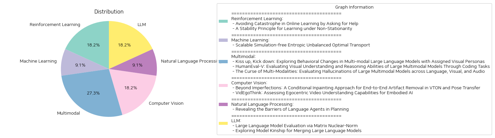

# Daily Artificial Intelligence Insights : Papers

## 🥳 Reinforcement Learning

**요약:**

### 종합 요약 보고서

1. **주요 주제 및 테마 추출:**
   - **온라인 학습에서 회피해야 할 실수:** 온라인 학습 알고리즘에서 돌이킬 수 없는 실수(카타스트로피)를 피하기 위한 학습 방법론을 탐구.
   - **비정상 환경에서의 안정성 원칙:** 비정상 환경에서의 통계적 학습 프레임워크로 안정성 원칙을 사용하여 이력 데이터를 효과적으로 활용하는 방법.

2. **공통 키워드, 트렌드 및 패턴 식별:**
   - **카타스트로피 회피:** 학습 알고리즘에서 돌이킬 수 없는 실수를 피하기 위한 전략 및 안정성 확보.
   - **적응성:** 학습 알고리즘의 비정상성을 다루는 방안과 그에 따른 적응적인 접근법.
   - **안정성:** 비정상 환경에서 학습 모델의 안정성을 유지하는 방법론.

3. **각 논문의 주요 사건 및 중요 정보 요약:**
   - 'Avoiding Catastrophe in Online Learning by Asking for Help': 돌이킬 수 없는 실수의 위험성을 감수하지 않으면서 멘토에게 조언을 얻는 제한적 기회를 활용해 카타스트로피를 피하는 온라인 학습 문제 제시.
   - 'A Stability Principle for Learning under Non-Stationarity': 비정상 환경에서 가장 효과적으로 데이터를 활용하기 위한 안정성 원칙 개발 및 해당 프레임워크의 이론적 유효성 입증.

4. **이벤트가 다양한 분야에 미친 영향 분석:**
   - **온라인 학습:** 알고리즘의 실수를 피하면서 안전성을 보장할 수 있는 새로운 학습 모델 개발 및 적용 가능성 확대.
   - **통계 학습:** 비정상 데이터를 다루는 안정성 기준 적용으로 다양한 데이터 환경에 유연하게 대응할 수 있는 모델 구축.

5. **통합 요약 및 결론:**
   두 논문 모두 학습 환경에서의 불확실성을 다루는 문제에 집중하여 카타스트로피를 피하거나 비정상 상황에서의 학습 모델의 적응성을 높이는 방법론을 제시하고 있음. 이러한 연구는 온라인 학습의 안전성을 높이고 비정상 데이터에 효과적으로 대응할 수 있는 통계적 모델을 제공하여, 미래에는 보다 다양한 데이터 환경에서 실질적인 응용 가능성을 가지며 더욱 유비쿼터스한 학습 시스템의 발전을 기대할 수 있음.

**미래 개발 지향점:**
- **안전한 온라인 학습 모델:** 카타스트로피를 사전에 방지하고, 실수를 최소화할 수 있는 모델 개발 촉구.
- **다양한 데이터 환경에 대한 적응성 향상:** 다양한 비정상 조건에서도 효과적으로 적용될 수 있는 안정적인 학습 프레임워크의 지속적인 발전 필요.

**출처:**

 - Avoiding Catastrophe in Online Learning by Asking for Help (https://deeplearn.org/arxiv/533114/avoiding-catastrophe-in-online-learning-by-asking-for-help)
 - A Stability Principle for Learning under Non-Stationarity (https://deeplearn.org/arxiv/534502/a-stability-principle-for-learning-under-non-stationarity)

## 🌿 Machine Learning

**요약:**

제목: 'Scalable Simulation-free Entropic Unbalanced Optimal Transport'

내용 요약: 이 논문에서는 최적 수송(Optimal Transport, OT) 문제를 다루며, 이는 두 분포를 연결하고 주어진 비용 함수의 최소화를 목표로 하는 수송 맵을 찾는 문제입니다. 기계 학습의 생성 모델링이나 이미지 간 변환 등 다양한 응용 분야가 있습니다. 본 논문에서는 엔트로피적 불균형 최적 수송(Entropic Unbalanced Optimal Transport, EUOT) 문제에 대한 확장 가능하고 시뮬레이션이 필요 없는 접근 방식을 소개합니다. EUOT 문제의 동적 형태를 도출했으며, 이는 슈뢰딩거 브리지(Schrödinger bridges, SB) 문제의 일반화입니다. 이 기반으로 확률적 최적 제어 해석에서 EUOT 문제의 이중 형식과 최적 조건을 유도했습니다. 이러한 특성을 활용하여 시뮬레이션이 필요 없는 알고리즘인 Simulation-free EUOT (SF-EUOT)을 제안합니다. 기존 SB 모델은 학습과 평가에서 높은 시뮬레이션 비용이 필요하지만, 우리의 모델은 상호적 특성을 활용하여 시뮬레이션 없이 학습하고 단계를 간소화한 생성 과정을 달성합니다. 제안된 모델은 기존 SB 방법에 비해 생성 모델링과 이미지 간 변환 과제에서 현저히 향상된 확장성을 보여줍니다.

주요 주제 및 테마:
- 최적 수송 이론 및 적용
- 생성 모델링 및 이미지 간 변환
- 시뮬레이션 없는 학습 방법론 도입

중요 사건 및 핵심 정보:
- EUOT 문제의 동적 형태 도출 및 슈뢰딩거 브리지 문제 일반화
- SF-EUOT 알고리즘 제안 및 시뮬레이션 없는 학습 체계 구축

영향 분석:
- 기계 학습 분야에서의 생성 모델과 이미지 변환 기술에 대한 영향력이 증가
- 시뮬레이션 비용 절감으로 인해 보다 효율적인 데이터 처리 가능

결론 및 미래 개발 전망:
이 논문에서 제공되는 시뮬레이션이 필요 없는 방법론은 기계 학습 분야의 여러 가지 활용 가능성을 제시합니다. 이를 통해 생성 모델링 및 이미지 변환뿐 아니라, 다른 데이터 분석 분야에도 적용될 가능성이 있으며, 특히 계산 비용의 절감으로 인해 더욱 넓은 분야에서 이점을 활용할 수 있을 것으로 기대됩니다. 앞으로 이런 방법론의 구체화와 다양한 응용 가능성에 주목할 필요가 있습니다.

**출처:**

 - Scalable Simulation-free Entropic Unbalanced Optimal Transport (https://deeplearn.org/arxiv/532714/scalable-simulation-free-entropic-unbalanced-optimal-transport)

## 🫧 Multimodal

**요약:**

### 종합 요약 보고서

#### 1. 주요 주제 및 테마 추출

- **멀티모달 대형 언어 모델(LLMs)의 시각적 이해 및 행동**: LLMs가 시각적 페르소나와 행동을 조정할 수 있는지에 대한 탐구.
- **코딩 작업을 통한 시각적 추론 평가**: LMMs의 시각적 이해 및 추론 능력을 평가하는 HumanEval-V 벤치마크 도입.
- **멀티모달 LMMs의 환각 문제**: 언어, 시각, 오디오 모달리티 간의 환각 문제 및 그 원인 분석.

#### 2. 공통 키워드, 트렌드 및 패턴

- **시각적 입력과 행동 변화**: LLMs가 시각적 입력을 통해 행동을 변화시킬 수 있음을 보여줌.
- **시각적 추론 및 코딩 평가의 중요성**: LMMs가 시각적 정보를 코드로 변환하는 능력이 여전히 개선이 필요함을 강조.
- **환각 현상의 분석**: 언어, 시각, 오디오 모달리티 간의 상호작용에서 발생하는 환각 문제에 대한 포괄적인 분석 필요.

#### 3. 주요 이벤트 및 핵심 정보 요약

- **시각적 페르소나에 따른 행동 변화**: 시각적 이미지의 공격성 판단과 관련된 LLMs의 행동 변화를 분석.
- **HumanEval-V 도입**: LMMs의 시각적 추론 및 코드 생성 능력을 평가하기 위한 새로운 벤치마크 출시. 
- **환각 문제의 체계적 연구**: LMMs의 다양한 모달리티에서 발생하는 환각 현상을 분석하기 위한 첫 번째 체계적인 연구를 수행.

#### 4. 다양한 부문에 대한 영향 분석

- **인공지능 및 로봇 공학**: LLMs가 멀티모달 입력에서 시각적 정보로부터 유의미한 행동 변화를 보일 수 있음을 제시, 로봇 공학 및 AI에서의 인간과의 상호작용 품질 향상 가능성 시사.
- **소프트웨어 개발 및 교육**: HumanEval-V 벤치마크는 교육 및 평가 시스템에서 LMMs의 실질적 성능을 높이고, 강력한 시각적 코딩 평가 도구로 활용될 수 있음.
- **신뢰성 및 윤리적 AI 연구**: 환각 현상에 대한 연구 결과는 AI 시스템의 신뢰성 및 윤리적 사용에 대한 중요성을 부각시킴.

#### 5. 결론 및 미래 발전 방향

이번 연구들을 통해, 시각적 페르소나, 시각적 추론 코드 생성, 멀티모달 환각 문제와 관련된 LLMs의 현재 상태와 도전을 명확히 이해할 수 있었습니다. 이러한 연구는 더 균형 잡힌 크로스 모달 학습과 향상된 환각 완화 전략을 개발하는 데 기여할 것으로 기대됩니다. 향후 연구 방향으로는 LLMs의 정확성 및 적응성을 개선하는 데 초점을 맞춘 추가적인 연구와 개발이 필요하며, 특히 기존의 편견을 제거하고 더 신뢰성 있는 AI 시스템을 구축하기 위한 전략이 채택되어야 합니다.

**출처:**

 - Kiss up, Kick down: Exploring Behavioral Changes in Multi-modal Large Language Models with Assigned Visual Personas (https://deeplearn.org/arxiv/533364/kiss-up,-kick-down:-exploring-behavioral-changes-in-multi-modal-large-language-models-with-assigned-visual-personas)
 - HumanEval-V: Evaluating Visual Understanding and Reasoning Abilities of Large Multimodal Models Through Coding Tasks (http://arxiv.org/abs/2410.12381v1)
 - The Curse of Multi-Modalities: Evaluating Hallucinations of Large Multimodal Models across Language, Visual, and Audio (http://arxiv.org/abs/2410.12787v1)

## ❄️ Computer Vision

**요약:**

**요약 보고서**

1. **주요 주제 및 테마 추출**

   - 첫 번째 논문: 'Beyond Imperfections: A Conditional Inpainting Approach for End-to-End Artifact Removal in VTON and Pose Transfer'
     - 가상 착의(VTON)와 자세 전환 애플리케이션에서의 왜곡 제거 및 이미지 품질 향상.
     - 조건부 인페인팅 기법을 도입하여 아티팩트를 감지하고 제거함으로써 이미지 미학 간섭을 개선.
     - 새로운 엔드 투 엔드 프레임워크 제안 및 관련 데이터셋 개발.

   - 두 번째 논문: 'VidEgoThink: Assessing Egocentric Video Understanding Capabilities for Embodied AI'
     - 다중 모드 대형 언어 모델(MLLMs)을 활용한 체화된 AI에서의 자아 중심 비디오 이해 능력 평가.
     - 새로운 벤치마크 VidEgoThink를 소개: 비디오 질의응답, 계층 계획, 시각적 연결 고리 설정 및 보상 모델링 포함.
     - 데이터 생성 파이프라인과 인간 주석자들의 협업을 통해 다양한 데이터 보장을 위한 절차.

2. **공통 키워드, 트렌드 및 패턴 식별**

   - 두 논문 모두 이미지 및 비디오 이해에서의 인공지능 향상에 초점.
   - 인공지능 기법을 활용하여 현실 세계 시나리오의 성능 개선 도모.
   - 가상 시각적 체험의 질적 향상 추구.
   - 데이터 세트를 통해 모델들의 성능 및 정확도 평가 및 개선.

3. **주요 사건 및 핵심 정보 요약**

   - 첫 번째 논문은 아티팩트 문제를 다루는 새로운 기술적 접근 방식을 소개하고, 이미지 처리의 새로운 기준을 제시함으로써 사용자 경험을 향상시킴.
   - 두 번째 논문은 MLLMs을 활용하여 체화된 AI의 자아 중심 비디오 분석 및 이해의 성능을 평가하며, 향후 연구의 방향성을 제시함.

4. **이벤트들의 영향 분석**

   - **이미지 및 비디오 이해 분야**: 아티팩트 제거 및 비디오 이해 능력 향상 기술은 이미지를 생성하는 다양한 애플리케이션에서 향상된 사용자 경험을 제공하며, 연구의 새로운 기준을 세울 수 있음.
   - **AI 연구 커뮤니티**: MLLMs의 사용 및 성능 향상을 위한 벤치마크는 AI 연구의 지속적인 발전을 도모하며, 새로운 기준점을 제시.

5. **최종 통합 요약 및 미래 발전 가능성**

   - 두 논문은 향상된 인공지능 기술을 통해 이미지를 분석하고 처리하는 데 중요한 발전을 이루었습니다. 조건부 인페인팅과 VidEgoThink 벤치마크를 통한 연구는 다양한 현실 세계 환경에 AI를 적용할 수 있는 가능성을 열어줍니다. 향후 연구는 이러한 기술을 더욱 발전시키고, 이를 통해 보다 정교한 사용자 중심 애플리케이션을 만들어 나갈 수 있는 기회를 제공할 것입니다. 이러한 발전은 AI의 실제 적용 가능성을 더욱 확장할 것이며, 다양하고 복잡한 시나리오에서의 인간과 유사한 지각 능력을 목표로 할 것입니다.

**출처:**

 - Beyond Imperfections: A Conditional Inpainting Approach for End-to-End Artifact Removal in VTON and Pose Transfer (https://deeplearn.org/arxiv/534386/beyond-imperfections:-a-conditional-inpainting-approach-for-end-to-end-artifact-removal-in-vton-and-pose-transfer)
 - VidEgoThink: Assessing Egocentric Video Understanding Capabilities for Embodied AI (http://arxiv.org/abs/2410.11623v1)

## 🎉 Natural Language Processing

**요약:**

- 요약 보고서:

1. 핵심 주제 및 테마 추출:
   - 인공지능을 이용한 자율 계획
   - 대형 언어 모델(LLM)의 발전과 합리적 솔루션 생성
   - 언어 에이전트의 인간 수준 계획 능력 부족

2. 공통 키워드, 트렌드 및 패턴 식별:
   - 자율 계획
   - 제한사항의 한계
   - 질문의 감소된 영향력
   - 인간 수준 지능 도달에 대한 도전

3. 주요 사건 및 중요한 정보 요약:
   - 초기 계획 에이전트는 특정 작업에 대해 정확한 솔루션을 제공할 수 있었으나 일반화 능력이 부족했다.
   - LLM의 출현으로 자율 계획에 대한 관심이 재점화되었다.
   - 최신 이성 모델(OpenAI o1)은 복잡한 계획 벤치마크에서 15.6%의 성과를 보여, 인간 수준에 도달하기에 미흡하다.
   - 제한의 역할과 질문의 영향력 감소라는 두 가지 중요한 요인이 에이전트 계획을 저해함이 밝혀졌다.

4. 이러한 이벤트의 다양한 분야에 미치는 영향 분석:
   - 인공지능 분야에서는 인간 수준의 계획 능력을 향한 지속적인 발전 필요성이 강조된다.
   - 현재 전략도 제약사항과 질문의 영향력 문제를 완전히 해결하지 못하고 있으며, 에이전트 설계에 있어 추가 연구와 개선이 필요하다.

5. 결론 및 미래 개발 예측:
   - 언어 에이전트는 인간 수준의 지능을 달성하기 위해 아직 많은 발전이 필요하다.
   - 제한사항과 질문의 근본적인 문제를 해결하는 새로운 전략 개발이 필요하다.
   - 향후 자율 계획 시스템의 개선 및 실질적 적용을 위한 연구가 계속될 것이다. 이러한 연구는 인공지능 개발의 중대한 발전을 가져올 것으로 보인다.

**출처:**

 - Revealing the Barriers of Language Agents in Planning (http://arxiv.org/abs/2410.12409v1)

## 🎈 LLM

**요약:**

1. **주요 주제 및 테마 추출:**
   - 첫 번째 논문은 대형 언어 모델(LLM)의 평가 효율성을 높이기 위한 "Matrix Nuclear-Norm"이라는 새로운 메트릭을 소개합니다. 이 메트릭은 정보 압축 능력을 더욱 효율적으로 평가하는 방법을 제공하여, 기존의 복잡한 계산 과정을 단축할 수 있습니다.
   - 두 번째 논문은 "모델 통합" 기술을 탐구합니다. 특히, 모델들 간의 유사성을 이해하고 이를 활용하여 성능을 향상시키는 "Model Kinship" 개념을 제안합니다.

2. **공통 키워드, 트렌드 및 패턴 식별:**
   - 두 논문 모두 대형 언어 모델의 성능 평가와 개선을 목표로 합니다.
   - 효율성 개선과 계산 시간 단축을 추구합니다.
   - 새로운 모델 평가 및 통합 방법론을 제시함으로써, 더 나은 성능을 위한 전략을 제안하고 있습니다.

3. **주요 사건 및 중요한 정보 요약:**
   - "Matrix Nuclear-Norm"은 대형 언어 모델의 정보 압축 능력을 검토하는 데 있어, 대규모 모델에서도 더 빠르고 효율적인 평가를 가능케 합니다.
   - "Model Kinship" 개념을 활용한 모델 통합은, 모델 간 유사성을 기반으로 한 "탑-k 탐욕적 통합" 전략을 통해 더 효과적인 성능 향상을 가능하게 합니다.

4. **이들 사건의 여러 부문에 대한 영향 분석:**
   - "Matrix Nuclear-Norm"은 대형 언어 모델의 평가 효율성을 크게 높여, 다양한 산업 분야에서 비용 및 리소스를 절감할 수 있는 기회를 제공합니다.
   - "Model Kinship" 기반의 모델 통합 전략은 새로운 모델 개발에 있어 더 나은 출발점과 성능 개선을 이끌 수 있어, 연구 및 개발 분야에 혁신을 더할 가능성이 큽니다.

5. **최종 종합 요약 및 결론, 미래 발전 방향:**
   - 두 논문 모두 대형 언어 모델의 효율성과 성능을 향상시키는 데 기여하고 있으며, 학계와 산업계에서 중요한 영향을 미칠 것입니다.
   - 미래에는 더욱 정교한 평가 메트릭과 통합 전략이 개발될 것이며, 이는 보다 강력하고 일관된 AI 시스템을 창출할 수 있는 잠재력을 갖고 있습니다.
   - 이러한 연구의 진전은 향후 다양한 분야에서 AI 기술의 도입과 활용을 가속화할 수 있는 가능성을 시사합니다.

**출처:**

 - Large Language Model Evaluation via Matrix Nuclear-Norm (http://arxiv.org/abs/2410.10672v1)
 - Exploring Model Kinship for Merging Large Language Models (http://arxiv.org/abs/2410.12613v1)

