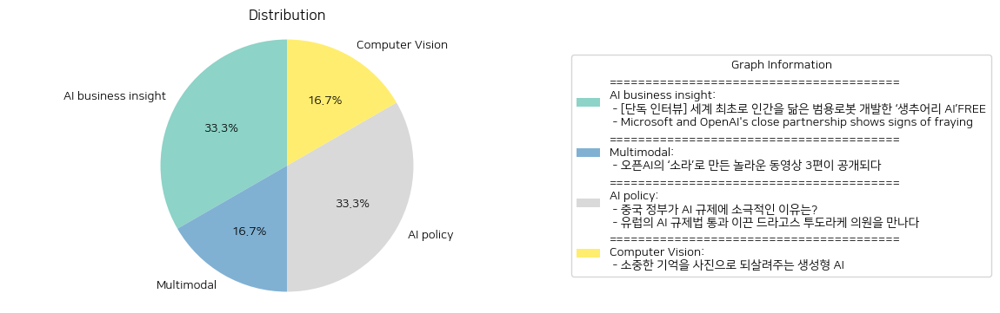

# Daily Artificial Intelligence Insights : News

## 🎉 AI business insight

**요약:**

1. **주요 주제**:
    - 인공지능(AI)과 로봇 개발: 인간을 닮은 범용 로봇 개발 추구.
    - 기술 협력과 기업 파트너십: Microsoft와 OpenAI의 협력 관계 변동.

2. **주요 사건**:
    - **범용 로봇 개발**: 캐나다의 생추어리 AI가 일상 속 복잡한 상황에 대응하는 범용 로봇을 개발.
    - **기술 파트너십의 변화**: Microsoft와 OpenAI의 긴밀한 협력 관계가 약화되기 시작.

3. **영향 분석**:
    - **경제적 영향**: 로봇과 AI 기술 발전은 산업 자동화와 혁신을 촉진하여 경제 전반에 긍정적인 영향을 미칠 수 있음.
    - **사회적 영향**: 범용 로봇의 개발은 사회의 자동화 추세 가속과 일상 생활의 변화 가능성을 시사.
    - **기업 협력 변화 영향**: Microsoft와 OpenAI의 관계 변화는 기술 개발 및 시장 확장 전략에 영향을 미칠 수 있음.

4. **최종 요약**:
    - 최근 AI와 로봇 공학의 발전은 인간 생활 및 경제 구조에 상당한 변화를 예고하고 있으며, 특히 범용 로봇의 등장은 새로운 기술적 도전과 기회 요인을 제공할 것으로 보임.
    - Microsoft와 OpenAI의 협력 관계 변동은 기술 산업 내 다양한 협력 모델의 중요성을 강조하고 있으며, 이는 향후 기술 파트너십의 새로운 패러다임을 마련할 가능성이 있음.
    - 앞으로도 AI와 로봇 분야의 지속적인 발전과 기업 간의 협력 관계 변화가 미치는 영향을 주목해야 할 것이다.

**출처:**

 - [단독 인터뷰] 세계 최초로 인간을 닮은 범용로봇 개발한 ‘생추어리 AI’FREE (https://www.technologyreview.kr/%ec%9d%b8%ed%84%b0%eb%b7%b0-%ec%83%9d%ec%b6%94%ec%96%b4%eb%a6%ac-ai%ea%b0%80-%ea%b7%b8%eb%a6%ac%eb%8a%94-%eb%af%b8%eb%9e%98%ec%9d%98-%eb%a1%9c%eb%b4%87%ec%9d%80-%ec%8b%a4%ec%b2%b4%ed%99%94/)
 - Microsoft and OpenAI's close partnership shows signs of fraying (https://www.nytimes.com/2024/10/17/technology/microsoft-openai-partnership-deal.html)

## 🎠 Multimodal

**요약:**

1. **주요 주제**:
   뉴스 기사에서 반복되는 주요 주제로는 '인공지능 기술의 발전'과 '미디어 제작 방식의 혁신'을 들 수 있습니다. 오픈AI의 새로운 동영상 생성 모델인 '소라'의 공개가 인공지능의 응용 범위를 확장시키고, 영상 크리에이터의 제작 방식을 변화시키고 있는 점이 주목됩니다.

2. **주요 사건**:
   오픈AI가 2월 중순에 새로운 동영상 생성 모델 '소라'를 공개하여 큰 화제를 모았습니다. 이 모델을 이용하여 제작된 세 개의 동영상이 공개되었으며, 다양한 크리에이터들이 제작에 참여하였습니다. 이들은 제작의 목적과 기법에 대해 설명하였습니다.

3. **영향 분석**:
   - **경제**: 소라는 콘텐츠 제작 비용을 절감하고, 빠르고 다양한 콘텐츠 개발을 가능하게 하여 미디어 산업에 큰 변화를 줄 수 있습니다.
   - **사회**: 인공지능 기반 동영상 제작이 일반화되면 개인 크리에이터나 소규모 미디어 기업들이 경쟁력을 갖출 수 있습니다.
   - **정치**: 인공지능 콘텐츠의 확산은 정보의 신뢰성에 대한 새로운 논의를 촉발할 수 있습니다.
   - **환경**: 디지털 콘텐츠 생산이 증가하면서 데이터 센터의 에너지 소비 역시 이슈로 부각될 수 있습니다.

4. **최종 요약**:
   오픈AI의 '소라' 모델은 인공지능이 미디어와 콘텐츠 제작에 미칠 수 있는 잠재력을 잘 보여주고 있으며, 이를 통해 다양한 산업에서 창의적이고 혁신적인 변화를 기대할 수 있습니다. 앞으로 인공지능에 기반한 콘텐츠의 사회적 수용과 이에 따른 윤리적 이슈를 주의 깊게 관찰할 필요가 있습니다. 계속해서 인공지능의 기술 발전이 미디어와 사회에 어떤 영향을 미칠지 주목해야 할 것입니다.

**출처:**

 - 오픈AI의 ‘소라’로 만든 놀라운 동영상 3편이 공개되다 (https://www.technologyreview.kr/%ec%98%81%ec%83%81-%ec%83%9d%ec%84%b1-%eb%aa%a8%eb%8d%b8-%ec%86%8c%eb%9d%bc%eb%a1%9c-%eb%a7%8c%eb%93%a0-%eb%86%80%eb%9d%bc%ec%9a%b4-%ec%98%81%ed%99%94-3%ed%8e%b8%ec%9d%b4-%ea%b3%b5%ea%b0%9c%eb%90%98/)

## 💚 AI policy

**요약:**

1. **주요 주제**:
   이번 뉴스 기사들의 주요 주제는 인공지능(AI) 규제와 관련된 각국 정부의 태도와 법적 조치입니다. 중국과 유럽연합(EU) 두 지역의 AI 규제 접근 방식에 대한 대조적인 자세가 드러납니다. 공통적으로 AI 기술 발전과 산업 성장을 고려한 규제 필요성이 부각되고 있습니다.

2. **주요 사건**:
   - **중국 정부의 AI 규제**: 중국 정부는 AI 산업 성장 촉진을 위해 소비자 기술 플랫폼에 대한 강경한 규제와는 달리 AI 규제에 있어 느슨한 태도를 취하고 있습니다. 이는 자국 AI 산업의 경쟁력을 강화하려는 전략으로 보입니다.
   - **유럽의 AI 규제법**: 드라고스 투도라케 의원이 유럽의회에서 AI 규제법 통과를 주도한 주요 인물로 등장합니다. 그는 이 법이 AI 산업을 보다 안전하고 효율적으로 만들어줄 것이라는 입장을 취하고 있습니다. 이는 유럽이 AI 및 디지털 기술 분야에서 규제를 강화하려는 움직임으로 평가됩니다.

3. **영향 분석**:
   - **경제적 영향**: 중국의 느슨한 AI 규제는 자국의 AI 산업 발전을 가속화시켜 경제적 이점을 누릴 가능성이 큽니다. 반면, 유럽의 AI 규제법은 초기에는 산업에 제약을 가할 수 있지만, 장기적으로는 안전성과 혁신을 동시에 추구할 기반을 마련할 가능성이 있습니다.
   - **정치적 영향**: 두 지역의 상반된 규제 접근은 각국 정부의 과학 기술 정책과 전략적 우선순위에 차이를 나타냅니다. 이는 국제적인 AI 기술 경쟁에서도 중요한 요소로 작용할 것입니다.
   - **사회적 영향**: AI 기술 사용에 대한 규제는 소비자 안전과 데이터 보호 측면에서 시민들에게 직접적인 영향을 미칠 수 있습니다. 유럽의 법적 조치 강화는 개인정보 보호 등 사회적 신뢰를 증진시킬 수 있는 반면, 중국의 느슨한 규제는 데이터 활용과 관련된 윤리적 논란을 야기할 수 있습니다.

4. **최종 요약**:
   이번 기사들에서 드러난 주요한 결론은 전 세계가 AI 기술 발전을 규제하는 데 있어 다양한 접근을 시도하고 있다는 것입니다. 각국의 규제 방침은 그들이 추구하는 경제적 이익과 사회적 가치, 정치적 목표를 반영하고 있으며, 이는 향후 글로벌 기술 경쟁에 결정적인 영향을 미칠 것으로 보입니다. 특히 유럽과 중국의 상반된 규제 접근은 국제 사회에 어떤 결과를 초래할지 계속 주목해야 할 필요가 있습니다. 앞으로 AI 규제 및 정책의 변화는 지속적으로 모니터링 할 가치가 있습니다.

**출처:**

 - 중국 정부가 AI 규제에 소극적인 이유는? (https://www.technologyreview.kr/%ec%a4%91%ea%b5%ad-%ec%a0%95%eb%b6%80%ea%b0%80-%ed%98%84%ec%9e%ac%eb%a1%9c%ec%84%9c%eb%8a%94-ai-%eb%b6%84%ec%95%bc%eb%a5%bc-%ea%b0%80%ed%98%b9%ed%95%98%ea%b2%8c-%ea%b7%9c%ec%a0%9c%ed%95%98%ec%a7%80/)
 - 유럽의 AI 규제법 통과 이끈 드라고스 투도라케 의원을 만나다 (https://www.technologyreview.kr/ai-%ea%b7%9c%ec%a0%9c%eb%b2%95-%ed%86%b5%ea%b3%bc-%ec%9d%b4%eb%81%88-%eb%93%9c%eb%9d%bc%ea%b3%a0%ec%8a%a4-%ed%88%ac%eb%8f%84%eb%9d%bc%ec%bc%80-%ec%9d%98%ec%9b%90%ec%9d%84-%eb%a7%8c%eb%82%98%eb%8b%a4/)

## 🌅 Computer Vision

**요약:**

1. **주요 주제**:
   - 생성형 AI의 발전과 활용: 최신 기술인 생성형 AI가 과거의 추억을 이미지로 구현하는 등의 새로운 프로젝트에 활용되고 있음.
   - 디지털 시대의 개인화된 경험: 디지털 기술을 통해 이전에 저장되지 않았던 개인의 소중한 경험을 보존하고 재현할 수 있는 새로운 가능성.

2. **주요 사건**:
   - '합성 기억' 프로젝트: 생성형 AI를 활용하여 전 세계의 다양한 가족에게 카메라에 담지 못했던 과거의 추억을 이미지로 되살리는 프로젝트가 진행 중임. 이는 기술적 혁신과 문화적 보전을 동시에 추구하는 사례로 주목받고 있음.

3. **영향 분석**:
   - 사회적 영향: 가족과 개인의 기억을 재현함으로써 개인화된 경험의 중요성이 증가하고, 과거의 추억을 다양한 형태로 저장하고 공유할 수 있는 방법들이 증가할 것으로 예상됨.
   - 경제적 영향: 생성형 AI 기술의 발전은 IT 산업에서의 혁신적 제품 개발로 이어질 수 있으며, 관련 소프트웨어와 서비스 시장의 성장을 촉진할 것으로 보임.
   - 문화적 영향: 기억 보존 방식의 변화로 인해 전통적 사진의 필요성이 감소할 수 있으며, 기술을 통해 새롭게 창조된 이미지들이 새로운 문화적 가치로 자리잡을 가능성이 있음.

4. **최종 요약**:
   - 최근 생성형 AI 기술을 활용한 '합성 기억' 프로젝트가 기술과 개인사적 보존의 선두에서 주목받고 있음. 이 프로젝트는 가족과 개인의 못다한 추억을 이미지로 구현하여 디지털 시대의 새로운 개인화를 촉진하고 있음. 이러한 발전은 사회적, 경제적, 문화적으로 다양하게 영향을 미칠 것으로 예상되며, 이어지는 발전을 통해 관련 시장의 성장과 새로운 문화 창조의 가능성을 모니터링하는 것이 중요함.

**출처:**

 - 소중한 기억을 사진으로 되살려주는 생성형 AI (https://www.technologyreview.kr/%ec%83%9d%ec%84%b1%ed%98%95-ai%eb%a1%9c-%ea%b0%80%ec%9e%a5-%ec%86%8c%ec%a4%91%ed%95%9c-%ea%b8%b0%ec%96%b5%ec%9d%84-%ec%82%ac%ec%a7%84%ec%9c%bc%eb%a1%9c-%eb%a7%8c%eb%93%a0%eb%8b%a4/)

