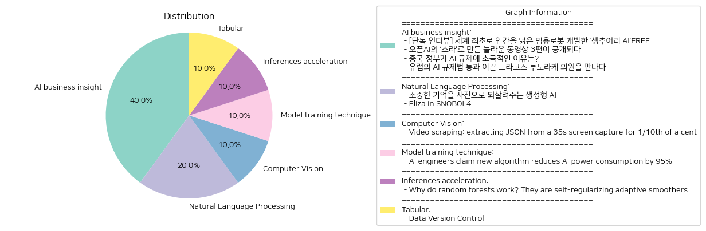

# Daily Artificial Intelligence Insights : News

## ❄️ AI business insight

**요약:**

**주요 테마**:
- 이번 뉴스 기사들에서 주요 테마는 인공지능(AI) 기술의 발전과 이에 대한 규제 및 윤리에 대한 논의입니다. AI 기술을 활용한 로봇 개발, 창의적 콘텐츠 제작, 국가별 AI 규제 접근 방식 등이 공통적으로 다루어졌습니다.

**주요 사건**:
1. **생추어리 AI의 로봇 개발**: 캐나다의 생추어리 AI가 인간을 닮은 범용 로봇을 개발하며, 이를 통해 다양한 환경에 유연하게 대응하는 로봇 기술을 선보였습니다.
2. **오픈AI의 영상 모델 소라**: 오픈AI는 새로운 영상 생성 모델 '소라'를 이용하여 3편의 창의적인 동영상을 공개하였으며, 이는 많은 놀라움을 자아내고 있습니다.
3. **중국의 AI 규제**: 중국 정부는 AI 산업 발전을 위해 규제에 대해 느슨한 태도를 유지하고 있으며, 이는 자국 중심적인 산업 성장을 고려한 것입니다.
4. **유럽 AI 규제법 통과**: 유럽의회의 드라고스 투도라케 의원은 AI 산업의 발전을 위한 규제법이 통과되도록 주요 역할을 했습니다. 이는 AI 기술이 사회에 안전하게 활용되도록 하기 위함입니다.

**영향 분석**:
- **경제적 영향**: AI 기술의 발전은 다양한 산업에서 새로운 시장과 일자리를 창출하는 잠재력을 가지고 있습니다. 생추어리 AI의 로봇이나 오픈AI의 소라 모델은 기술과 콘텐츠 산업에 큰 변화를 가져올 수 있습니다.
- **정치적 영향**: 각국의 AI 규제 정책은 기술 발전의 방향을 크게 좌우합니다. 중국의 전략적 접근과 유럽의 규제 강화는 글로벌 AI 경쟁에서의 각국의 입장을 보여줍니다.
- **사회적 영향**: 범용 로봇의 개발은 일상 생활에 직접적인 영향을 미칠 수 있으며, 이는 미래 사회 전반에 걸친 생산성과 생활의 질을 향상시킬 수 있습니다.

**최종 요약**:
이번 뉴스 기사들을 통해 AI 기술의 빠른 발전과 그에 대한 각국의 다양한 정책 접근 방식을 확인할 수 있었습니다. 기술의 발전은 경제와 사회에 긍정적인 영향을 미칠 수 있는 가능성을 가지고 있지만, 윤리적이고 안전한 사용을 위한 적절한 규제와 관리 또한 중요합니다. 앞으로의 변화에 주목하여 새로운 기술의 책임 있는 활용과 지속 가능한 발전을 유도하는 정책 마련이 필요할 것입니다. AI 기술의 미래 트렌드를 지속적으로 모니터링하며, 각국의 정책 변화가 나타날 수 있으니 이에 대한 주의를 기울일 필요가 있습니다.

**출처:**

 - [단독 인터뷰] 세계 최초로 인간을 닮은 범용로봇 개발한 ‘생추어리 AI’FREE (https://www.technologyreview.kr/%ec%9d%b8%ed%84%b0%eb%b7%b0-%ec%83%9d%ec%b6%94%ec%96%b4%eb%a6%ac-ai%ea%b0%80-%ea%b7%b8%eb%a6%ac%eb%8a%94-%eb%af%b8%eb%9e%98%ec%9d%98-%eb%a1%9c%eb%b4%87%ec%9d%80-%ec%8b%a4%ec%b2%b4%ed%99%94/)
 - 오픈AI의 ‘소라’로 만든 놀라운 동영상 3편이 공개되다 (https://www.technologyreview.kr/%ec%98%81%ec%83%81-%ec%83%9d%ec%84%b1-%eb%aa%a8%eb%8d%b8-%ec%86%8c%eb%9d%bc%eb%a1%9c-%eb%a7%8c%eb%93%a0-%eb%86%80%eb%9d%bc%ec%9a%b4-%ec%98%81%ed%99%94-3%ed%8e%b8%ec%9d%b4-%ea%b3%b5%ea%b0%9c%eb%90%98/)
 - 중국 정부가 AI 규제에 소극적인 이유는? (https://www.technologyreview.kr/%ec%a4%91%ea%b5%ad-%ec%a0%95%eb%b6%80%ea%b0%80-%ed%98%84%ec%9e%ac%eb%a1%9c%ec%84%9c%eb%8a%94-ai-%eb%b6%84%ec%95%bc%eb%a5%bc-%ea%b0%80%ed%98%b9%ed%95%98%ea%b2%8c-%ea%b7%9c%ec%a0%9c%ed%95%98%ec%a7%80/)
 - 유럽의 AI 규제법 통과 이끈 드라고스 투도라케 의원을 만나다 (https://www.technologyreview.kr/ai-%ea%b7%9c%ec%a0%9c%eb%b2%95-%ed%86%b5%ea%b3%bc-%ec%9d%b4%eb%81%88-%eb%93%9c%eb%9d%bc%ea%b3%a0%ec%8a%a4-%ed%88%ac%eb%8f%84%eb%9d%bc%ec%bc%80-%ec%9d%98%ec%9b%90%ec%9d%84-%eb%a7%8c%eb%82%98%eb%8b%a4/)

## 🌿 Natural Language Processing

**요약:**

1. **핵심 주제**:
   전체 기사에서 주요 주제는 기술의 발전과 그 활용에 관한 것임을 알 수 있다. 첫 번째 기사는 생성형 AI의 새로운 응용 프로그램에 초점을 맞추고 있고, 두 번째 기사는 프로그래밍 언어 Snobol4를 사용하여 Eliza 프로그램을 단순화한 작업에 초점을 맞추고 있다.

2. **주요 사건**:
   - '생성형 AI를 통한 합성 기억 프로젝트': 이 프로젝트는 생성형 AI를 이용해 잊혀진 기억을 이미지로 재생성하여 사용자들이 과거의 소중한 추억을 되찾을 수 있도록 도와준다. 이는 특히 카메라에 담지 못했던 과거의 순간들을 되살리는 데 중점을 둔다.
   - 'Eliza의 Snobol4로의 재프로그래밍': Eliza 프로그램이 Snobol4 언어로 재프로그래밍됨으로써 더 이해하기 쉽고 간소화되었음을 보여준다. 이로 인해 알고리즘을 보다 명확하게 이해할 수 있게 되었다.

3. **영향 분석**:
   - 기술 사용이 확대되면서 AI와 프로그래밍 언어의 발전은 다양한 사회 영역에 영향을 줄 수 있다. '합성 기억 프로젝트'는 개인의 추억을 되살리는 감정적 영향뿐만 아니라, AI 기술의 지속적인 발전을 통해 문화와 사회적 회상을 새롭게 살릴 수 있는 가능성을 제시한다.
   - Eliza의 Snobol4로의 재프로그래밍은 데이터 처리와 언어 개발의 효율성을 높일 수 있으며, 알기 쉬운 프로그래밍 언어의 사용이 확산되면서 교육 분야에서의 활용 가능성이 증가할 수 있다.

4. **최종 요약**:
   전체 기사에서 두드러진 점은 기술의 발전이 일상생활의 다양한 측면에 미치는 긍정적인 영향이다. 생성형 AI는 사람들의 개인적인 기억을 시각적으로 부활시킴으로써 사용자 경험을 향상시키고, Eliza의 Snobol4 재프로그래밍은 프로그래밍 언어의 효율성과 교육적 사용을 확대할 가능성을 보여준다. 앞으로 이러한 기술의 진전이 어떤 혁신을 가져올지 주목할 필요가 있다. AI와 단순한 프로그래밍 언어의 결합이 사회적, 교육적 사용 사례를 어떻게 변화시킬지에 주목할 만하다.

**출처:**

 - 소중한 기억을 사진으로 되살려주는 생성형 AI (https://www.technologyreview.kr/%ec%83%9d%ec%84%b1%ed%98%95-ai%eb%a1%9c-%ea%b0%80%ec%9e%a5-%ec%86%8c%ec%a4%91%ed%95%9c-%ea%b8%b0%ec%96%b5%ec%9d%84-%ec%82%ac%ec%a7%84%ec%9c%bc%eb%a1%9c-%eb%a7%8c%eb%93%a0%eb%8b%a4/)
 - Eliza in SNOBOL4 (https://dl.acm.org/doi/pdf/10.1145/987452.987458)

## 🥳 Computer Vision

**요약:**

**1. 주요 주제**:  
이 뉴스 기사의 주요 주제는 비디오 스크래핑과 AI 도구를 활용한 데이터 추출 방법입니다. 주요 트렌드로는 기술의 발전을 통해 효율성을 높이고 비용을 절감하는 방법이 포함됩니다.  

**2. 주요 사건**:  
이 기사는 사용자가 비디오 녹화 및 AI 도구를 사용하여 12개의 이메일에서 데이터를 추출한 사건을 다루고 있습니다. 이 과정에서 비용은 매우 적었으며, 기존의 공식 API 사용이나 브라우저 자동화와 같은 방식보다 비용 효율적이라고 설명됩니다.  

**3. 영향 분석**:  
- **경제**: 이러한 기술적 방법은 기업과 개인이 데이터 추출의 비용을 절감할 수 있도록 도와 경제적으로 긍정적인 영향을 미칠 수 있습니다. 저비용 고효율의 도구 사용은 예산 절감에 기여할 수 있습니다.
- **기술**: 기술의 발전에 따라 사용자들이 비즈니스 작업을 보다 빠르고 저렴하게 수행할 수 있는 길을 열어 줍니다. 이는 IT 부문에서의 혁신을 가속화할 수 있습니다.
- **사회**: AI 및 새로운 기술의 보급이 사회 전반에 걸쳐 증가함에 따라 비전문가들도 복잡한 작업을 수행할 수 있게 되어 기술 접근성이 높아질 수 있습니다.

**4. 최종 요약**:  
이번 기사는 AI와 비디오 기술을 결합하여 비용 효율적으로 데이터를 추출하는 방법을 설명합니다. 이러한 기술 발전은 경제적 비용 절감과 기술 혁신을 불러일으킬 가능성이 있으며, 이는 다양한 분야에서 유사한 방법의 확산을 촉진할 수 있습니다. 앞으로는 더 많은 사람들이 이러한 기술을 활용하여 효율성을 높일 것이라는 점에 주목할 필요가 있습니다.

**출처:**

 - Video scraping: extracting JSON from a 35s screen capture for 1/10th of a cent (https://simonwillison.net/2024/Oct/17/video-scraping/)

## 🍋 Model training technique

**요약:**

### 종합 요약 보고서

1. **주요 주제**:
   - AI 기술 발전 및 지속 가능성 강화
   - AI 시스템의 에너지 효율성 개선
   - 첨단 알고리즘 개발 및 혁신

2. **주요 사건**:
   - BitEnergy AI의 엔지니어들이 개발한 선형 복잡도 곱셈(L-Mul) 기법은 AI 시스템에서의 부동 소수점 곱셈을 정수 덧셈으로 대체하여 전력 소모를 최대 95%까지 줄입니다. 이는 AI의 성능 저하 없이 지속 가능성을 높일 수 있는 큰 발전으로 평가됩니다.

3. **영향 분석**:
   - **경제적 영향**: AI 시스템의 전력 소모 감소는 운영 비용 절감을 가져와 기업의 재정적인 부담을 줄일 수 있습니다. 또한, 더 많은 산업 분야에서 AI 활용이 가능해지면서 경쟁이 치열해질 수도 있습니다.
   - **환경적 영향**: AI의 전력 소비가 크게 줄어들면서 탄소 배출량이 감소하고, 친환경 기술 발전에도 기여할 것으로 보입니다.
   - **사회적 영향**: 에너지 효율성이 높은 AI 기술의 발전은 더 많은 사람들이 접근할 수 있도록 하여 AI 기술의 확산을 가속화할 수 있습니다. 이는 직간접적으로 AI 기술에 대한 사회적 수용성을 높일 수 있습니다.

4. **최종 요약**:
   - 현재 AI 기술의 발전은 효율성 및 지속 가능성이라는 큰 도전 과제를 해결하기 위해 끊임없이 진화하고 있습니다. BitEnergy AI의 L-Mul 알고리즘은 그러한 혁신의 한 예로, AI 시스템의 전력 소비를 큰 폭으로 개선함으로써 경제적, 환경적, 그리고 사회적으로 긍정적인 영향을 미칠 수 있을 것입니다. 이러한 기술적 발전은 앞으로도 이어질 것이며, 에너지 효율성 향상과 지속 가능한 기술 개발이 중요한 방향으로 자리 잡을 것입니다. 향후 AI 기술의 에너지 효율성에 관한 연구와 그 적용 범위 확대에 주목할 필요가 있습니다.

**출처:**

 - AI engineers claim new algorithm reduces AI power consumption by 95% (https://www.tomshardware.com/tech-industry/artificial-intelligence/ai-engineers-build-new-algorithm-for-ai-processing-replace-complex-floating-point-multiplication-with-integer-addition)

## 💚 Inferences acceleration

**요약:**

**요약 보고서**

1. **핵심 주제**:
   해당 기사에서 주된 주제는 무작위 숲 알고리즘(Random Forests)이 어떻게 작동하는가에 대한 설명입니다. 특히, 이 알고리즘이 자기 정규화(self-regularization) 및 적응형 평활화(adaptive smoothing)를 통해 예측 성능을 향상시키는 방법에 대해 논의하고 있습니다. 이러한 점에서 무작위 숲이 편향(bias)과 분산(variance)을 줄여 예측의 정확성을 높이는 역할을 강조하고 있습니다.

2. **주요 사건**:
   본 기사에서 가장 중요한 내용은 트리 앙상블(tree ensemble)이 예측 성능을 개선하는 방법을 설명한 것으로, 그 방식은 가설 공간(hypothesis space)을 풍부하게 하여 편향과 분산, 변동성(variability)을 감소시키는 데 있습니다. 이러한 방식은 데이터 분석과 머신러닝 분야에서 중요한 알고리즘의 특성을 설명합니다.

3. **영향 분석**:
   이 연구는 주로 머신러닝 및 데이터 과학 분야에 큰 영향을 미칠 수 있으며, 특히 알고리즘을 통해 더 정확하고 안정적인 모델링을 가능하게 한다는 점에서 중요한 역할을 할 수 있습니다. 기술 발전이 사회 및 경제에 미치는 영향은 정확한 데이터 분석을 통해 정책 결정, 비즈니스 전략 수립 등에 기여할 수 있습니다.

4. **최종 요약**:
   본 기사는 무작위 숲 알고리즘의 내재된 규칙성과 적응력을 강조하며, 이를 통해 데이터 분석의 정확성을 높일 수 있음을 보여줍니다. 차후 이러한 알고리즘의 발전과 응용이 더 많은 데이터 기반 의사결정을 강화할 것으로 예상됩니다. 특히, 편향과 분산 감소라는 측면에서 기타 예측 모델에도 긍정적인 영향을 끼칠 수 있을 것으로 보이며, 지속적인 연구와 개발이 필요할 것입니다.

**출처:**

 - Why do random forests work? They are self-regularizing adaptive smoothers (https://arxiv.org/abs/2402.01502)

## 🍊 Tabular

**요약:**

**요약 보고서**

1. **주요 주제**:
   '데이터 버전 관리' 기사의 주요 주제는 확장 가능한 데이터 관리, 머신러닝 모델링 워크플로우, 벡터 임베딩 및 재현 가능한 파이프라인입니다. 이러한 주제는 현대 데이터 과학 및 머신러닝 분야에서 정보 추출과 효율적인 데이터 처리에 관한 트렌드를 반영하고 있습니다.

2. **주요 사건**:
   이 기사에서 다루는 중요한 내용은 데이터 관리의 효율성을 증가시키고, 확장 가능한 방식으로 머신러닝 워크플로우를 구축하는 방법론입니다. 특히 벡터 임베딩의 활용과 데이터 파이프라인의 재현 가능성을 강조하여, 복잡한 데이터 처리 과정에서의 문제 해결을 위한 혁신적인 접근법을 제시하고 있습니다.

3. **영향 분석**:
   이러한 데이터 관리와 모델링 방식의 발전은 데이터 과학 및 기술 분야에 상당한 영향을 미칠 수 있습니다. 경제 분야에서는 효율적인 데이터 활용이 기업의 경쟁력을 높이는 데 기여할 수 있으며, 이는 궁극적으로 생산성 향상과 비용 절감으로 이어질 수 있습니다. 또한, 정책 및 사회적 측면에서는 데이터 처리의 투명성과 신뢰성을 향상시킴으로써 더 정확한 의사 결정 및 정책 수립이 가능해질 수 있습니다.

4. **최종 요약**:
   요약하면, '데이터 버전 관리'와 관련된 최신 기사는 머신러닝과 데이터 과학의 효율성을 증대시키기 위한 혁신적인 접근법을 소개합니다. 이는 다양한 분야에 걸쳐 디지털 변화와 효율성 향상을 촉진할 것으로 예상되며, 특히 데이터 기술의 발전 방향성과 관련하여 중요한 지표가 될 수 있습니다. 미래에는 이러한 기술이 더욱 발전하여 기업과 사회가 데이터로부터 최대의 가치를 끌어낼 수 있는 다양한 응용 프로그램과 시스템의 발전으로 이어질 가능성이 높습니다. 데이터 관리와 머신러닝의 교차점에서 어떤 새로운 기술 발전이 있을지를 주목할 필요가 있습니다.

**출처:**

 - Data Version Control (https://dvc.org/)

