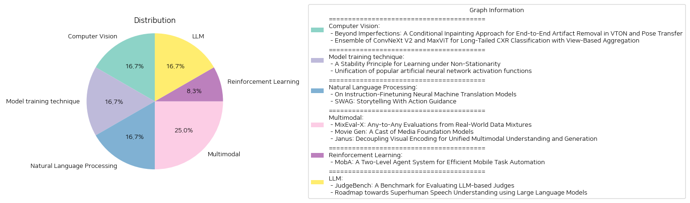

# Daily Artificial Intelligence Insights : Papers

## 🪐 Computer Vision

**요약:**

요약 보고서:

1. 주요 주제 및 테마 추출:
   - 'Beyond Imperfections: A Conditional Inpainting Approach for End-to-End Artifact Removal in VTON and Pose Transfer' 논문에서는 가상 착용 시뮬레이션(VTON) 및 자세 전환 애플리케이션에서 발생하는 시각적 결함(아티팩트)을 제거하기 위한 조건부 인페인팅 기법을 소개합니다. 이 방법은 이미지의 미학을 개선하는 목적이며, VTON 및 자세 전환 작업에 관련된 아티팩트와 영향을 받는 영역을 강조하는 마스크가 포함된 데이터셋도 개발되었습니다.
   - 'Ensemble of ConvNeXt V2 and MaxViT for Long-Tailed CXR Classification with View-Based Aggregation' 논문에서는 MICCAI 2024 CXR-LT 챌린지를 위한 솔루션을 소개합니다. ConvNeXt V2와 MaxViT 모델의 앙상블을 사용하여 불균형한 클래스 분포를 처리하며, 시점 기반 예측 집계를 통해 CXR 검출 정확도를 향상시킵니다.

2. 공통 키워드, 트렌드 및 패턴 분석:
   - 이미지 처리와 시각적 품질 향상: 두 논문 모두 이미지의 시각적 품질을 향상시키기 위한 고급 기법(조건부 인페인팅, 앙상블 모델링)을 사용하고 있습니다.
   - 데이터 불균형 처리: 두 번째 논문에서는 데이터 불균형(class imbalance) 문제 해결을 위한 비대칭 손실(asymmetric loss) 기법을 활용하고 있습니다.

3. 주요 사건 및 중요한 정보 요약:
   - 첫 번째 논문은 VTON과 자세 전환에서의 아티팩트 문제를 해결하기 위한 최초의 엔드 투 엔드 프레임워크를 제시하였으며, 특별히 제작된 데이터셋을 통해 효과적인 문제 해결을 보장합니다.
   - 두 번째 논문은 MICCAI 2024 챌린지에서 효과적인 CXR 검출을 위해 다양한 첨단 기법을 통합한 모델을 발표하여 좋은 성과를 거두었습니다.

4. 해당 사건이 다양한 분야에 미치는 영향 분석:
   - 가상 착용 및 자세 전환 애플리케이션: 첫 번째 연구의 인페인팅 기법은 이러한 애플리케이션의 사용자 경험을 크게 향상시킬 수 있습니다.
   - 의료 영상 처리: 두 번째 연구의 방법론은 의료 영상에서의 진단 정확성을 높이고, 불균형한 데이터 분포 문제를 해결함으로써 의료 AI 모델의 신뢰성을 높이는 데 기여할 수 있습니다.

5. 결론 및 앞으로 주목할 만한 발전:
   - 이미지 처리 분야에서의 시각적 개선 기술은 다양한 애플리케이션의 질을 높이는 데 중요한 역할을 할 것입니다.
   - 데이터 불균형 문제를 해결하기 위한 다양한 모델 접근 방식은 앞으로도 계속 발전하여 다른 분야에도 응용될 수 있을 것입니다.

**출처:**

 - Beyond Imperfections: A Conditional Inpainting Approach for End-to-End Artifact Removal in VTON and Pose Transfer (https://deeplearn.org/arxiv/534386/beyond-imperfections:-a-conditional-inpainting-approach-for-end-to-end-artifact-removal-in-vton-and-pose-transfer)
 - Ensemble of ConvNeXt V2 and MaxViT for Long-Tailed CXR Classification with View-Based Aggregation (https://deeplearn.org/arxiv/536961/ensemble-of-convnext-v2-and-maxvit-for-long-tailed-cxr-classification-with-view-based-aggregation)

## 🌿 Model training technique

**요약:**

보고서 요약:

1. 주요 주제 및 테마 추출:
   - 첫 번째 논문: "비정상성 환경에서의 학습을 위한 안정성 원리"
     - 비정상성 환경에서의 통계적 학습을 위한 안정성 원리 프레임워크 개발
     - 역사적 데이터를 활용하면서 누적 편향을 수용 가능한 범위 내에서 유지하는 방법
     - 유사성 측정 및 비정상적 데이터 순서를 준정상적 단위로 분할하는 기법 소개
   
   - 두 번째 논문: "인기 있는 인공 신경망 활성화 함수의 통합"
     - 인공 신경망의 다양한 활성화 함수를 통합한 표현 방식 제안
     - Fractional calculus의 Mittag-Leffler 함수를 채택하여 다양한 활성화 함수 간의 보간 가능
     - 소멸 및 폭주하는 그래디언트 문제를 완화하고 데이터로부터 활성화 함수의 형태를 학습할 수 있는 기능적 형태 제공

2. 공통 키워드, 트렌드 및 패턴 식별:
   - 비정상성, 유연성, 통합, 학습 데이터 활용, 최적화된 학습 형태

3. 각 논문의 주요 이벤트 및 핵심 정보 요약:
   - 첫 번째 논문은 비정상 환경에서도 효과적인 데이터 학습을 가능하게 하는 프레임워크 제안을 다룬다. 이 접근법은 역사적 데이터의 활용도를 극대화하면서도 편향을 최소화하여 안정적이고 유연한 학습을 보장한다.
   - 두 번째 논문은 인공 신경망 활성화 함수의 다양한 존재 범주를 통일된 형태로 표현함으로써, 그래디언트 문제 해결 및 학습의 유연성을 높이는 것을 목표로 한다.

4. 이러한 사건의 다양한 부문에 대한 영향 분석:
   - 데이터 과학 및 인공지능 분야에서의 학습 모델의 적응성과 안정성 향상
   - 복잡한 환경에서의 학습 효율성을 높임으로써 다양한 산업 분야에서 활용 가능성 증가
   - 신경망 구조 및 활성화 함수의 유연한 조정 가능성을 통해 학습 정확도 및 훈련 효율 증가

5. 최종 통합 요약 및 앞으로 주목해야 할 잠재적 발전:
   - 두 논문의 제안은 비정상적인 데이터 환경과 인공 신경망의 활성화 함수 처리에 있어 기존 방식을 뛰어넘는 혁신적인 접근법을 공통적으로 보여준다. 이러한 프레임워크는 다양한 학습 환경에서 적응성을 제고하며, 향후 데이터 활용 및 인공지능 모델 개발에 중요한 기여를 할 것으로 예상된다. 앞으로 이들 연구는 다양한 환경에서의 실질적인 응용과 추가적인 연구 개발을 통해 그 효용성을 증명할 가능성이 크다.

**출처:**

 - A Stability Principle for Learning under Non-Stationarity (https://deeplearn.org/arxiv/534502/a-stability-principle-for-learning-under-non-stationarity)
 - Unification of popular artificial neural network activation functions (https://deeplearn.org/arxiv/535529/unification-of-popular-artificial-neural-network-activation-functions)

## 🪄 Natural Language Processing

**요약:**

다음은 주어진 논문들의 제목과 요약을 바탕으로 작성된 요약 보고서입니다.

1단계: 각 논문의 주요 주제와 테마를 추출합니다.

- 논문 1: 'On Instruction-Finetuning Neural Machine Translation Models'
  - 주요 주제: 뉴럴 머신 번역(NMT) 모델의 인스트럭션 파인튜닝, 대규모 언어 모델(LLMs)로부터 작은 NMT 모델로의 지시 능력 전이, 번역의 사용자 맞춤화, 여러 번역 작업 및 영역의 통합.

- 논문 2: 'SWAG: Storytelling With Action Guidance'
  - 주요 주제: 자동 스토리 생성, 행동 지침에 의한 이야기 생성(SWAG), LLM을 사용한 이야기 작성, 이야기의 방향성을 조정하는 피드백 루프 시스템.

2단계: 논문들 간의 공통 키워드, 트렌드, 패턴 식별

- 공통 키워드: 대규모 언어 모델(LLMs), 사용자 맞춤화, 작은 모델의 효율성, 자동화된 생성(번역, 이야기).
- 트렌드: LLM의 능력을 작은 모델로 전이하여 효율성과 성능을 유지하면서도 비용을 절감하는 방식, 다양한 작업을 단일 모델로 통합.

3단계: 각 논문의 주요 이벤트와 중요한 정보를 요약합니다.

- 논문 1: NMT 모델의 인스트럭션 파인튜닝은 전통적으로 서로 다른 형식이나 도메인의 번역 작업을 단일 모델을 통해 수행할 수 있습니다. 이 과정에서 모델은 다양한 '지시'를 따르는 능력을 지니게 되며, 특히 격식 제어 번역과 같은 특수 작업도 수행 가능해집니다. 이는 GPT-3.5-Turbo와 유사한 수준의 성능을 제공할 수 있습니다.

- 논문 2: SWAG는 이야기 생성을 '탐색 문제'로 설정하여, 첫 번째 LLM이 내용을 생성하고, 보조 LLM이 이후의 행동을 선택하여 이야기를 이끄는 시스템입니다. 이 방법은 스토리 생성 성능에서 GPT-3.5-Turbo를 능가하며, 작고 열린 소스 모델만 사용하여도 매우 효과적입니다.

4단계: 이러한 이벤트가 다양한 부문에 미친 영향을 분석합니다.

- 번역 및 언어 처리 분야: 인스트럭션 파인튜닝을 통해 번역 모델은 더 빠르게 맞춤형 번역 서비스를 제공할 수 있으며, LLM의 능력을 소형 모델로 전이하여 비용 효율성을 높입니다.
- 창작 및 스토리텔링 분야: SWAG는 자동화된 스토리 생성의 새로운 가능성을 제시하면서 사용자 맞춤형 이야기 생성의 길을 엽니다.

5단계: 최종 통합 요약 및 결론, 미래 개발 전망 제시

이 논문들은 소형 모델이 대규모 언어 모델의 능력을 효율적으로 전이받아 다양한 작업을 수행할 수 있음을 보여줍니다. 이는 기술의 민주화와 자동화의 발전을 가속화할 것으로 보입니다. 특히 번역과 스토리텔링 분야에서 이러한 기술들은 사용자 맞춤형 서비스와 창작 지원 시스템의 발전을 예고합니다. 앞으로 더 많은 분야에서 소형 모델의 활용이 증대될 것으로 예상됩니다.

**출처:**

 - On Instruction-Finetuning Neural Machine Translation Models (https://deeplearn.org/arxiv/535484/on-instruction-finetuning-neural-machine-translation-models)
 - SWAG: Storytelling With Action Guidance (https://deeplearn.org/arxiv/535495/swag:-storytelling-with-action-guidance)

## 🚀 Multimodal

**요약:**

### 종합 요약 보고서

1. **핵심 주제 및 테마 추출**

    a. **'MixEval-X: Any-to-Any Evaluations from Real-World Data Mixtures'**:
        - AI 모델의 다중 모달 학습 및 상호작용을 위한 평가의 최적화와 표준화.
        - 현재 평가의 문제점으로는 일관성 없는 표준과 일반화 편향이 있음.
        - MixEval-X를 통한 다중 모달 평가의 표준화 및 효과적인 일반화 방식 제안.

    b. **'Movie Gen: A Cast of Media Foundation Models'**:
        - 고화질 비디오 생성 및 개인화, 비디오 편집 및 오디오 생성의 새로운 표준 제시.
        - 30B 매개변수의 트랜스포머 모델을 통한 고화질 미디어 생성 능력.
        - 기술 혁신 및 최적화로 대규모 미디어 생성 모델의 도약을 위한 연구.

    c. **'Janus: Decoupling Visual Encoding for Unified Multimodal Understanding and Generation'**:
        - 이해와 생성을 위한 통합된 멀티모달 프레임워크 Janus 소개.
        - 멀티모달 이해와 생성을 위한 시각 인코딩 경로의 분리.
        - 단일 트랜스포머 구조를 활용하되 경로 분리를 통해 유연성과 성능 향상.

2. **공통 키워드, 트렌드, 패턴 식별**

    - **다중 모달 이해 및 생성**: 모든 논문이 멀티모달 접근법에 중점을 두고 있으며, 이를 통해 더 효과적인 학습과 상호작용을 도모함.
    - **표준화 및 최적화**: 연구들은 평가 표준화와 최적화를 통해 더 광범위한 적용을 목표로 함.
    - **모델 유연성 및 성능 증대**: 모델의 적응성과 성능을 높이기 위해 다양한 기술적 접근을 시도함.
    - **기술 혁신**: 대규모 데이터와 컴퓨팅 파워를 활용한 기술 혁신이 두드러짐.

3. **각 논문에서의 주요 이벤트 및 중요 정보 요약**

    - **MixEval-X**:
        - 표준화 및 일반화 문제 해결을 위한 새로운 벤치마크 제안.
        - 현실 세계의 과제 분포를 재구성하여 실제 사용 사례에 맞춤 평가를 보장.

    - **Movie Gen**:
        - 비디오 생성과 편집, 개인화 비디오 생성의 새로운 상태 기술 설정.
        - 대규모 매개변수 모델로 텍스트-비디오 및 비디오-오디오 전환 성공.

    - **Janus**:
        - 통합 모델의 새로운 세대 제안으로, 분리된 경로를 사용해 멀티모달 이해와 생성 간의 충돌 검증.
        - 유연성과 성능의 이점을 최대로 활용.

4. **이벤트의 각 부문에 대한 영향 분석**

    - **기술 발전**: 이러한 연구들을 통해 AI의 다중 모달 기능이 향상되고, 다양한 분야에서의 응용이 확대될 수 있음.
    - **미디어 제작**: 비디오 생성 기술의 발전으로 맞춤형 콘텐츠 제작 가능성이 증가.
    - **통합 인공지능 모델**: 이해와 생성의 통합된 접근이 다양한 분야에 효율적 적용 가능성을 시사.

5. **최종 결론 및 향후 개발 방향**

    - **통합 및 표준화의 중요성**: 기술 발전의 가속화를 위해 다중 모달 평가와 생성의 표준화가 필수적임을 강조.
    - **모델의 유연성과 확장성**: Janus와 같은 접근법은 적응성과 성능을 고려한 구현에서 중요함을 입증.
    - **미래 지향적 연구 필요성**: 혁신적 기술 발전을 위한 지속적인 연구와 실험이 중요하며, 이러한 연구들은 다양한 응용을 통해 AI 발전을 가속화할 수 있음.

**출처:**

 - MixEval-X: Any-to-Any Evaluations from Real-World Data Mixtures (http://arxiv.org/abs/2410.13754v1)
 - Movie Gen: A Cast of Media Foundation Models (http://arxiv.org/abs/2410.13720v1)
 - Janus: Decoupling Visual Encoding for Unified Multimodal Understanding and Generation (http://arxiv.org/abs/2410.13848v1)

## 💚 Reinforcement Learning

**요약:**

보고서 요약:

1. 핵심 주제 및 테마:
   - 'MobA: A Two-Level Agent System for Efficient Mobile Task Automation' 논문은 기존의 모바일 어시스턴트가 시스템 API에 의존하거나 복잡한 사용자 명령어 및 다양한 인터페이스를 처리하는 데 어려움을 겪고 있다는 문제를 다루고 있습니다.
   - 논문은 이러한 제한사항을 극복하기 위해 모바(MobA)라는 새로운 모바일 에이전트를 제안합니다. 이는 다중 양식 대형 언어 모델을 활용하여 이해력 및 계획 능력을 향상시키고자 하는 점이 핵심입니다.

2. 공통 키워드, 트렌드 및 패턴:
   - '모바일 어시스턴트', '복잡한 사용자 명령어', '다중 양식 대형 언어 모델(MLLM)', '이해력', '계획 능력', '이중 레벨 에이전트 구조', '태스크 수행 효율성', '두 레벨 에이전트 아키텍처' 등의 키워드가 바탕이 됩니다.
   - 현대 모바일 기술에서 효율성 향상 및 복잡한 작업 처리를 위한 대형 언어 모델의 활용이 점차적으로 강조되고 있습니다.

3. 주요 사건 및 중요 정보:
   - 모바(MobA)는 사용자의 명령어 이해와 기억 추적 및 태스크 계획을 담당하는 고수준의 글로벌 에이전트(GA)와 함수 호출 형태로 세부 행동을 예측하는 저수준의 로컬 에이전트(LA)로 구성되어 있습니다.
   - 반영 모듈을 통합하여 이전에 보지 못한 복잡한 태스크를 다룰 수 있게 함으로써 태스크 완료 효율성과 수행 속도에서 유의미한 개선을 보여준다고 평가됩니다.

4. 다양한 분야에 대한 이러한 사건의 영향 분석:
   - 모바일 어시스턴트 기술의 발전은 개인 사용자 및 기업이 더욱 정확하고 신속한 작업 처리를 가능케 하여 생산성 및 사용자 경험을 향상시킬 것으로 기대됩니다.
   - 특히 MLLM의 활용은 다양한 인터페이스 및 복잡한 명령어를 처리하는 데 중요한 허브가 될 수 있습니다.

5. 결론 및 향후 발전 가능성:
   - MobA는 현대 모바일 시스템의 단점을 보완하고, MLLM의 강점을 효과적으로 활용하여 모바일 태스크의 자동화를 진전시키는 잠재력을 가지고 있습니다.
   - 향후에는 MLLM의 지속적인 발전과 함께 모바일 어시스턴트 기술이 더욱 정교해져 다양한 복잡한 작업을 처리할 수 있을 것으로 전망됩니다.

결론적으로, 'MobA'는 모바일 기기에서의 작업 자동화의 새로운 가능성을 열었으며, 향후 지속적인 연구 개발과 함께 우리 일상생활의 기술 의존도가 더욱 확대될 것으로 보입니다.

**출처:**

 - MobA: A Two-Level Agent System for Efficient Mobile Task Automation (http://arxiv.org/abs/2410.13757v1)

## 🎠 LLM

**요약:**

**종합 요약 보고서**

1. **주요 주제 및 테마 추출**
   - 두 논문의 핵심 주제는 대규모 언어 모델(LLM)의 평가 및 발전과 관련이 있습니다.
   - 'JudgeBench' 논문은 LLM 기반 판사의 평가를 위한 새로운 벤치마크 'JudgeBench'를 제안하고, 특히 LLM 기반 판사의 신뢰성을 객관적으로 평가하는 방법에 중점을 둡니다.
   - 'Roadmap towards Superhuman Speech Understanding using Large Language Models' 논문은 대규모 언어 모델을 통한 음성 이해의 발전을 위한 로드맵을 제시하며, 음성 및 오디오 데이터를 통합하여 텍스트와 비텍스트 입력 모두를 처리할 수 있는 일반적인 기본 모델 개발의 가능성을 탐구합니다.

2. **공통 키워드, 트렌드 및 패턴 식별**
   - 공통적으로 두 논문 모두 LLM의 평가와 발전을 다루며, 기술의 신뢰성과 정확성 그리고 발전의 방향을 제시합니다.
   - 두 논문에서 공통적으로 나타나는 키워드로는 'LLM', '판사 평가', '벤치마크', 및 '음성 이해'가 있습니다.

3. **각 논문의 주요 이벤트 및 중요 정보 요약**
   - 'JudgeBench' 논문에서는 기존의 평가 기준이 복합적인 과제를 충분히 반영하지 못한다는 점을 지적하며, JudgeBench라는 새로운 평가 프레임워크를 통해 더 정교하고 객관적인 평가 방법을 제시합니다.
   - 'Roadmap' 논문에서는 LLM의 성공을 바탕으로 음성과 비음성 데이터 처리 모델 구축을 위한 다섯 단계의 로드맵을 제안하고, SAGI Benchmark로 다양한 과제를 표준화하여 현재의 한계점과 향후 방향성을 제공합니다.

4. **이벤트가 다양한 부문에 미치는 영향 분석**
   - 두 가지 논문 모두 LLM의 발전이 AI의 다른 부문에 미치는 중요한 영향을 강조합니다. JudgeBench를 통해 평가의 객관성을 강화하고, 기술적 진보를 위한 견고한 기반을 제공합니다.
   - 음성 이해 발전 로드맵은 AI 기반 음성 인식 기술 및 비언어적 정보 통합 능력을 향상시켜 향후 AI 애플리케이션의 발전을 도모할 것입니다.

5. **최종 종합 요약 및 향후 발전 방향**
   - 결론적으로, 두 논문은 LLM의 평가 기준을 강화하고 음성 이해를 넘어선 LLM의 잠재력을 강조합니다.
   - 향후 발전 방향으로는 JudgeBench를 활용한 LLM 판사 평가의 표준화 및 개선, 초인간적 음성 이해 모델로의 발전을 제안합니다. 향후, 보다 일관되고 정확하며 다재다능한 AI 기술로의 발전이 기대됩니다.

**출처:**

 - JudgeBench: A Benchmark for Evaluating LLM-based Judges (http://arxiv.org/abs/2410.12784v1)
 - Roadmap towards Superhuman Speech Understanding using Large Language Models (http://arxiv.org/abs/2410.13268v1)

