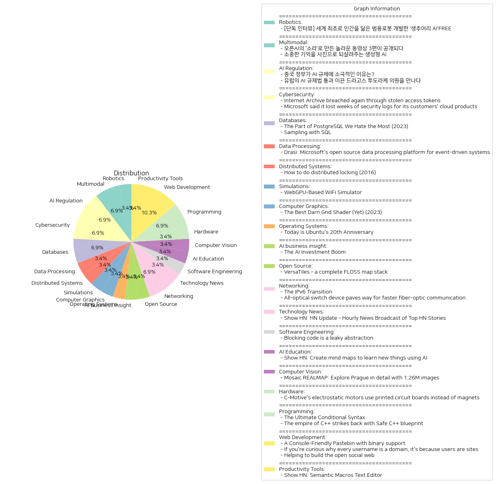

# Daily Artificial Intelligence Insights : News

## 🎇 Robotics

**요약:**

**요약 보고서:**

1. **주요 주제**:
   - 인간을 닮은 범용 로봇 개발
   - 인공지능(AI)의 일상 적용 및 유연한 대응 능력
   - 로봇과 AI의 미래 발전 방향 및 잠재성

2. **주요 사건**:
   - 캐나다의 AI 로봇 전문기업 '생추어리 AI'는 인간을 닮은 범용 로봇을 개발하는 데 성공했다. 이 로봇은 AI를 활용하여 일상 속에서 복잡하고 변화무쌍한 상황을 유연하게 대처할 수 있다. 생추어리 AI의 CEO 조르디 로즈는 미래 기술의 발전가능성을 언급하며 로봇의 역할 확대를 예고했다.

3. **영향 분석**:
   - **경제**: 범용 로봇의 개발은 로봇 산업뿐만 아니라 다양한 산업 전반에 걸쳐 생산성 향상을 가져오며, 새로운 시장과 고용 창출을 유도할 가능성이 높다.
   - **사회**: 인간을 닮은 로봇은 사회적 상호작용의 새로운 형태를 창출할 수 있으며, 인구 고령화 및 노동력 부족 문제 해결에도 기여할 수 있다.
   - **정치**: AI와 로봇 사용이 증가함에 따라 관련 법률 및 규제의 필요성 증가로 이어질 수 있다.

4. **최종 요약**:
   - 생추어리 AI의 범용 로봇 개발은 로봇과 AI의 결합을 통한 현대 기술의 새로운 정점을 예고하며, 경제적, 사회적, 기술적 측면에서 다양한 변화를 가져올 수 있다. 향후 로봇과 AI 기술의 발전은 더욱 가속화될 것으로 보이며, 이에 따른 사회적 적응과 정책적 대응이 요구된다. 향후 로봇 기술의 발전과 그에 따른 사회적 영향에 대한 지속적인 관찰과 분석이 필요하다.

**출처:**

 - [단독 인터뷰] 세계 최초로 인간을 닮은 범용로봇 개발한 ‘생추어리 AI’FREE (https://www.technologyreview.kr/%ec%9d%b8%ed%84%b0%eb%b7%b0-%ec%83%9d%ec%b6%94%ec%96%b4%eb%a6%ac-ai%ea%b0%80-%ea%b7%b8%eb%a6%ac%eb%8a%94-%eb%af%b8%eb%9e%98%ec%9d%98-%eb%a1%9c%eb%b4%87%ec%9d%80-%ec%8b%a4%ec%b2%b4%ed%99%94/)

## 🍋 Multimodal

**요약:**

1. **주요 테마**:
   - 생성형 AI 기술의 발전과 그 활용
   - AI를 이용한 창의적 콘텐츠 제작과 개인의 경험 복원
   - 오픈AI와 같은 선도적 AI 기관의 혁신적 기술 공개

2. **중요 사건 요약**:
   - 오픈AI는 새로운 동영상 생성 모델인 '소라'로 세상을 놀라게 했습니다. 소라를 활용하여 영상 크리에이터들이 제작한 3편의 놀라운 영상이 공개되었습니다. 해당 영상을 제작한 크리에이터들과의 인터뷰를 통해 제작 목적과 기법을 알 수 있었습니다.
   - '합성 기억' 프로젝트는 생성형 AI를 활용하여 소중한 기억을 사진으로 되살리는 프로젝트로, 전 세계 가족들이 과거의 추억을 다시 볼 수 있도록 도와주고 있습니다.

3. **영향 분석**:
   - **경제**: AI 기반 콘텐츠 제작 기술의 발전은 미디어 및 크리에이티브 산업의 새로운 시장 창출과 경쟁 심화를 유도할 수 있습니다.
   - **사회**: 기술을 통한 개인의 기억 복원은 개인적 감정 및 추억의 가치 증진과 함께, 문화적 다양성의 보존에 기여할 수 있습니다.
   - **기술**: 오픈AI와 같은 기술 혁신은 AI 기술 인프라 및 교육 분야에 대한 불균형 해소를 위한 노력을 촉발할 수 있습니다.

4. **최종 요약**:
   최근 오픈AI의 '소라' 및 '합성 기억' 프로젝트는 생성형 AI의 잠재력을 잘 보여주고 있습니다. 이러한 기술은 창의적 콘텐츠의 새로운 시대를 열고 있으며, 개인의 기억을 복원함으로써 정서적 연결을 강화하고 있습니다. 앞으로 이러한 AI 기술은 미디어, 문화, 교육 분야에서 더욱 광범위한 응용을 보일 것으로 예상되며, 그 발전을 주목해야 할 것입니다. 기술의 발전과 사회적 영향 사이의 균형잡힌 접근이 필요합니다.

**출처:**

 - 오픈AI의 ‘소라’로 만든 놀라운 동영상 3편이 공개되다 (https://www.technologyreview.kr/%ec%98%81%ec%83%81-%ec%83%9d%ec%84%b1-%eb%aa%a8%eb%8d%b8-%ec%86%8c%eb%9d%bc%eb%a1%9c-%eb%a7%8c%eb%93%a0-%eb%86%80%eb%9d%bc%ec%9a%b4-%ec%98%81%ed%99%94-3%ed%8e%b8%ec%9d%b4-%ea%b3%b5%ea%b0%9c%eb%90%98/)
 - 소중한 기억을 사진으로 되살려주는 생성형 AI (https://www.technologyreview.kr/%ec%83%9d%ec%84%b1%ed%98%95-ai%eb%a1%9c-%ea%b0%80%ec%9e%a5-%ec%86%8c%ec%a4%91%ed%95%9c-%ea%b8%b0%ec%96%b5%ec%9d%84-%ec%82%ac%ec%a7%84%ec%9c%bc%eb%a1%9c-%eb%a7%8c%eb%93%a0%eb%8b%a4/)

## 🚀 AI Regulation

**요약:**

1. **주요 주제**:
   - 인공지능(AI) 규제 관련 주제가 두드러진다. 각각의 기사가 AI 규제에 대한 국가적 대응과 입장을 다루고 있다.
   - 중국과 유럽의 AI 규제 접근 방식의 차이가 부각되며, 양대 경제권의 정책적 차이에 대한 논의가 공통적으로 나타난다.

2. **주요 사건**:
   - 중국 정부는 AI 규제에 있어 느슨한 접근을 유지하고 있는데, 이는 자국의 AI 산업 발전을 도모하기 위한 전략적 선택이다.
   - 드라고스 투도라케 의원은 유럽의 AI 규제법 통과의 주역으로, 이러한 규제가 AI 산업을 개선할 수 있다고 확신하며 법안을 추진했다.

3. **영향 분석**:
   - **경제적 측면**: 중국의 AI 규제 정책은 국내 AI 기업의 경쟁력을 강화할 가능성이 크며, 시장에서의 혁신을 촉진할 것으로 보인다. 반면, 유럽의 규제는 AI 기술의 윤리적 문제를 해결하여 소비자 신뢰를 높이는 데 기여할 것이다.
   - **정치적 측면**: 두 지역의 정책은 국제 규제 표준 설정에 각자의 영향력을 미치며, 각국의 디지털 주권과 기술 패권에 대한 정치적 의미를 갖는다.
   - **사회적 측면**: 유럽의 규제법은 AI의 윤리적 사용과 프라이버시 보호를 강조함으로써 사회적 책임과 윤리적 기준을 강화할 것이다.

4. **최종 요약**:
   - 중국과 유럽은 AI 규제에 있어 상반된 접근 방식을 취하고 있으며, 이는 그들의 산업 발전 전략과 기술 정책의 방향성을 보여준다.
   - 중국의 느슨한 규제는 빠른 기술 발전과 시장 점유율 확대를 노리며, 유럽의 강력한 규제는 기술 사용의 안전성과 윤리성을 보장하려는 의도가 있다.
   - 향후 AI 산업에 있어 각국의 정책 변화와 국제적 논의가 어떻게 전개될지 주목할 필요가 있다. 이는 글로벌 AI 산업의 발전 방향을 좌우할 중요한 요소로 작용할 것이다.

**출처:**

 - 중국 정부가 AI 규제에 소극적인 이유는? (https://www.technologyreview.kr/%ec%a4%91%ea%b5%ad-%ec%a0%95%eb%b6%80%ea%b0%80-%ed%98%84%ec%9e%ac%eb%a1%9c%ec%84%9c%eb%8a%94-ai-%eb%b6%84%ec%95%bc%eb%a5%bc-%ea%b0%80%ed%98%b9%ed%95%98%ea%b2%8c-%ea%b7%9c%ec%a0%9c%ed%95%98%ec%a7%80/)
 - 유럽의 AI 규제법 통과 이끈 드라고스 투도라케 의원을 만나다 (https://www.technologyreview.kr/ai-%ea%b7%9c%ec%a0%9c%eb%b2%95-%ed%86%b5%ea%b3%bc-%ec%9d%b4%eb%81%88-%eb%93%9c%eb%9d%bc%ea%b3%a0%ec%8a%a4-%ed%88%ac%eb%8f%84%eb%9d%bc%ec%bc%80-%ec%9d%98%ec%9b%90%ec%9d%84-%eb%a7%8c%eb%82%98%eb%8b%a4/)

## 🪸 Cybersecurity

**요약:**

1. **핵심 주제**:
   - 이번 뉴스 기사들의 주요 주제는 보안 위협과 정보 유출입니다. 인터넷 아카이브와 마이크로소프트 모두 최근 보안 침해 및 로그 손실로 인해 사용자 데이터와 보안 위협 식별의 어려움을 겪었습니다.

2. **주요 사건**:
   - 첫 번째 기사에서는 인터넷 아카이브가 다시 한번 침해를 당했다고 보고되며, 이번에는 Zendesk 이메일 지원 플랫폼을 통해 발생했습니다. 위협 행위자가 노출된 GitLab 인증 토큰을 도용하면서 80만 개 이상의 지원 티켓과 사용자 데이터가 유출되었습니다.
   - 두 번째 기사에서는 마이크로소프트가 9월 2일부터 19일까지 약 2주 동안 내부 모니터링 에이전트 버그로 인해 고객 클라우드 제품에 대한 보안 로그를 손실했다고 보도되었습니다. 이로 인해 Microsoft Entra, Sentinel, Defender for Cloud, Purview와 같은 서비스에서 보안 위협을 식별하는 데 어려움이 있었습니다.

3. **영향 분석**:
   - **경제적 영향**: 이런 데이터 유출은 기업의 신뢰도를 저하시키고 잠재적인 경제적 손실을 초래할 수 있습니다. 데이터 침해는 고객 및 파트너 관계에 부정적인 영향을 미치며, 보안 강화를 위한 추가 비용이 필요할 수 있습니다.
   - **사회적 영향**: 사용자들의 개인정보 유출은 개인 정보 보호에 대한 걱정을 증가시킵니다. 이는 기업에 대한 신뢰를 떨어뜨리고, 사용자들의 불안감을 조성할 수 있습니다.
   - **기술적 영향**: 보안 침해 사건은 기술적 인프라 강화와 보안 시스템 개선의 필요성을 강조합니다. 기업들은 이러한 사건을 통해 보안 프로토콜 및 절차를 재평가할 필요가 있습니다.

4. **최종 요약**:
   - 이번 뉴스 기사들은 대규모 데이터 침해와 보안 로그 손실이 오늘날의 디지털 사회에서 얼마나 큰 문제인지를 잘 보여주고 있습니다. 기업들은 이러한 문제를 해결하기 위해 보안 인프라를 강화하고, 사용자 데이터 보호에 대한 노력을 배가해야 합니다. 앞으로 이러한 보안 침해를 막기 위한 규제 강화 및 기술 혁신을 주의 깊게 지켜볼 필요가 있습니다. 또한, 사용자들은 개인정보 보호에 대한 인식을 높이고 자신들의 데이터를 보호하는 데에 더욱 신경을 써야 합니다.

**출처:**

 - Internet Archive breached again through stolen access tokens (https://www.bleepingcomputer.com/news/security/internet-archive-breached-again-through-stolen-access-tokens/)
 - Microsoft said it lost weeks of security logs for its customers' cloud products (https://techcrunch.com/2024/10/17/microsoft-said-it-lost-weeks-of-security-logs-for-its-customers-cloud-products/)

## 🍊 Databases

**요약:**

1. **주요 주제**:
   두 뉴스 기사에서 다루고 있는 주요 주제로는 데이터베이스 관리, 특히 PostgreSQL에 관한 기술적 도전과 해결책이 있습니다. 첫 번째 기사는 PostgreSQL의 MVCC 구현에서의 문제점을 언급하고 있으며, 두 번째 기사는 대규모 데이터셋에서 효율적 샘플링을 위한 SQL 알고리즘에 대해 다루고 있습니다. 

2. **주요 사건**:
   - 첫 번째 기사에서는 PostgreSQL의 MVCC(다중 버전 동시성 제어) 구현의 한계점에 대해 설명하면서, 첨부 전용 저장 방식과 자동 청소 기능의 문제로 인해 데이터 중복이 증가하고 저장 요구사항이 커지며 쿼리 속도가 느려진다고 합니다.
   - 두 번째 기사에서는 대규모 데이터셋에서 샘플링을 위한 A-ES라는 가중 랜덤 샘플링 알고리즘을 소개하며, SQL에서 효율적으로 구현할 수 있는 방법을 설명하고 있습니다. 이 알고리즘은 데이터를 대체 없이 또는 대체하여 샘플링할 수 있으며, 더 최적화될 수 있습니다.

3. **영향 분석**:
   - 첫 번째 기사에서 언급된 PostgreSQL의 MVCC 구현 문제는 데이터베이스 성능에 직접적인 영향을 미칠 수 있으며, 이는 기업의 데이터 관리 비용 증가를 유발할 수 있습니다. 또한 느린 쿼리는 실시간 데이터 분석을 필요로 하는 산업에서 비즈니스 기회를 놓치게 할 수 있습니다.
   - 두 번째 기사에서 논의된 SQL 샘플링 알고리즘은 대규모 데이터 분석을 더욱 효율적이고 경제적으로 수행할 수 있게 하며, 이는 데이터 처리 및 분석 비용 절감에 기여할 수 있습니다. 이는 또한 보다 정확한 데이터 기반 의사결정을 가능케 합니다.

4. **최종 요약**:
   이 두 기사에서 강조된 내용은 현대 데이터베이스 시스템 관리에 있어서의 기술적 어려움과 그 해결책의 중요성입니다. PostgreSQL의 문제점은 데이터베이스 설계 및 유지보수의 중요성을 다시 한 번 강조하며, 반면 효율적인 SQL 샘플링 알고리즘의 개발은 데이터 처리의 효율성을 크게 향상시킬 수 있는 가능성을 보여줍니다. 향후에는 이러한 기술적 발전들이 기업 운영에 어떻게 적용되고 발전해 나가는지를 지켜보는 것이 중요할 것입니다. 데이터베이스의 성능 개선과 효율적인 데이터 관리 기술의 발전은 데이터 주도 사회로의 전환을 한층 가속화할 수 있습니다.

**출처:**

 - The Part of PostgreSQL We Hate the Most (2023) (https://www.cs.cmu.edu/~pavlo/blog/2023/04/the-part-of-postgresql-we-hate-the-most.html)
 - Sampling with SQL (https://blog.moertel.com/posts/2024-08-23-sampling-with-sql.html)

## 🩵 Data Processing

**요약:**

1. **주요 주제**:
   - 데이터 처리 플랫폼의 혁신과 자동화
   - 오픈 소스 소프트웨어의 중요성 및 이벤트 중심 시스템을 위한 기술 발전
   - 실시간 데이터 인사이트 및 연속 쿼리를 통한 변화 감지

2. **주요 사건**:
   - Microsoft의 새로운 오픈 소스 데이터 처리 플랫폼 Drasi의 출시에 대한 소식
   - Drasi의 기능: 실시간 인사이트 제공, 연속 쿼리 사용, 특정 이벤트에 대한 자동화된 반응

3. **영향 분석**:
   - **경제**: Drasi와 같은 데이터 처리 플랫폼은 기업들이 데이터 기반의 효율성을 높여, 운영 비용 절감과 경쟁력 강화를 도울 수 있습니다.
   - **정치**: 오픈 소스 기술의 발전은 국가 간 기술 의존도의 변화와 관련된 정치적 논의에 영향을 미칠 수 있습니다.
   - **사회**: 데이터 자동화는 노동 시장에 영향을 미쳐, 데이터 과학 및 IT 관련 직업에 새로운 기회를 제공할 수 있습니다.

4. **최종 요약**:
   Microsoft의 Drasi는 데이터 처리와 이벤트 반응 시스템에서 혁신을 가져올 것으로 기대됩니다. 이는 특히 기업들이 실시간으로 변화에 대응하는 능력을 강화하여 경제적 이점을 얻을 수 있게 합니다. 오픈 소스 기술의 사용은 또한 기술 발전과 자원의 확장을 촉진하게 되어 여러 사회적 및 산업적 변화를 가져올 수 있습니다. 앞으로 Drasi가 데이터 관리 분야에서 어떠한 변화를 만들어 나갈지 주목할 필요가 있습니다.

**출처:**

 - Drasi: Microsoft's open source data processing platform for event-driven systems (https://github.com/drasi-project/drasi-platform)

## 🍊 Distributed Systems

**요약:**

1. **주요 주제**:
   이 기사에서는 분산 잠금(Distributed Locking) 기법에 대한 논의가 주요 주제입니다. 특히 Redis의 Redlock 알고리즘이 비판의 중심에 있습니다. 이에 관한 주제는 분산 시스템에서의 정확성, 동기화 문제, 데이터 일관성과 관련된 토론을 포함합니다.

2. **주요 사건**:
   기사는 Redis에서 사용되는 Redlock 알고리즘이 정확성에 중대한 영향을 미치는 코어 애플리케이션에서는 적절하지 않을 수 있다고 주장합니다. 이 알고리즘은 주로 시간 기반 가정에 의존하며, 임계 구역 진입 관리를 위한 필수적인 '펜싱 토큰'이 없기 때문에 비판을 받고 있습니다.

3. **영향 분석**:
   이 논의는 특히 정보기술 및 소프트웨어 개발 분야에 영향을 미칠 수 있습니다. 개발자와 시스템 설계자는 안정적인 시스템 동작을 보장하기 위한 분산 잠금 메커니즘을 선택하는 데 신중을 기할 필요가 있습니다. 이러한 문제는 기업의 데이터 무결성과 서비스의 안정성에 직접적인 영향을 미칠 수 있습니다.

4. **최종 요약**:
   Redis의 Redlock 알고리즘의 한계가 강조되면서 분산 시스템 설계 시 시간 가정과 펜싱 토큰의 필요성에 관한 논의가 강화되고 있습니다. 이는 데이터 일관성과 시스템 안정성을 진지하게 고려해야 하는 필요성을 부각시킵니다. 향후 개발자와 연구자들은 분산 잠금 솔루션의 설계와 검토 시 이 문제에 대한 보다 깊이 있는 이해와 기술적 개선 방안을 모색해야 할 것입니다.

**출처:**

 - How to do distributed locking (2016) (https://martin.kleppmann.com/2016/02/08/how-to-do-distributed-locking.html)

## ✈️ Simulations

**요약:**

**주요 주제**:
- 기술 발전 및 혁신: WiFi 신호 강도를 모델링하기 위한 물리학 방정식을 사용하는 시뮬레이션 엔진의 개발과 WebGPU를 활용한 빠른 시뮬레이션이 주요 주제로 등장합니다.
- 사용자 맞춤화 및 확장성: 사용자가 소스를 추가하거나 설정을 변경할 수 있는 기능이 강조되어, 기술이 다양한 개인 및 비즈니스 필요를 충족하도록 진화하는 경향이 보입니다.

**주요 사건**:
- WiFi Solver의 도입: 고속 시뮬레이션을 위해 WebGPU 기술을 사용하는 WiFi 시뮬레이터가 소개되었습니다. 이는 WiFi 신호 강도를 물리학 기반으로 정확하게 모델링할 수 있는 툴로, 사용자 친화적인 커스터마이즈 기능을 제공합니다.

**영향 분석**:
- 경제적 영향: WiFi Solver와 같은 기술은 네트워크 설계 및 최적화 비용을 줄여서 기업들이 더 경제적으로 네트워크 인프라를 구축할 수 있도록 돕습니다.
- 사회적 영향: 사용자들이 더 나은 WiFi 설정을 통해 원활한 연결성을 경험할 수 있으며, 이는 원격 근무 환경의 개선에 기여할 수 있습니다.
- 기술 혁신: WebGPU 기술의 사용은 컴퓨팅 능력의 혁신적 활용 및 개발에 대한 새로운 가능성을 열어줍니다.

**최종 요약**:
WiFi Solver의 도입은 빠른 시뮬레이션을 가능케 하는 WebGPU의 활용과 사용자가 손쉽게 커스터마이즈할 수 있는 기능이 결합된 기술 혁신을 활용합니다. 이는 최적화된 WiFi 신호 모델링 및 네트워크 설계의 효율성을 높여 경제적 이익을 제공하고, 더 나은 연결성을 통한 사회적 혜택을 제공합니다. 앞으로 WebGPU 기술의 활용이 더 광범위한 영역에서 확산될 가능성이 크며, 이와 같은 혁신은 기술적 발전을 주도할 것으로 예상됩니다.

**출처:**

 - WebGPU-Based WiFi Simulator (https://wifi-solver.com)

## 🎈 Computer Graphics

**요약:**

**요약 보고서:**

**1. 주요 주제 및 동향:**

- 기술 혁신: 'The Best Darn Grid Shader (Yet) (2023)' 기사에서는 컴퓨터 그래픽스 및 셰이더 프로그램의 발전을 다루고 있으며, 이는 지속적인 기술 혁신과 연구 개발에 대한 강력한 추세를 보여줍니다.
- 컴퓨터 그래픽스 최적화: 셰이더 효율성을 향상시키기 위한 다양한 기법의 활용과 알고리즘의 최적화가 중요한 주제로 제시됩니다. 이 기사에서는 사용자의 연구와 실험을 통한 그래픽스 품질 개선 노력이 두드러집니다.

**2. 주요 이벤트:**

- 사용자 경험과 시각적 퀄리티 개선을 위한 '그리드 셰이더' 개발: 사용자는 기존의 텍스처 기반 그리드를 개선하고 안정적인 비주얼을 제공하기 위해 화면 공간의 미분기법, 스무스스텝, 그리고 선형 보간 함수(l) 등의 결합을 통해 높은 품질의 셰이더를 개발했습니다. 이 개발은 관측선, 앨리어싱 감소, 미니멀 무아레 패턴을 실현하였습니다.

**3. 영향 분석:**

- **경제적 효과**: 그래픽스와 비주얼 컴퓨팅 분야의 발전은 관련 산업의 성장을 촉진할 수 있으며, 특히 컴퓨터 그래픽 관련 기술의 발전은 게임 및 영화 산업에서 탁월한 시각적 경험을 제공하여 수익 증대의 가능성을 열어줍니다.
- **사회적 영향**: 시각적 기술의 발전은 예술과 디자인 산출물의 품질을 높여 시청자에게 향상된 미적 경험을 제공할 수 있습니다. 이는 교육, 엔터테인먼트 등의 다양한 영역에 긍정적인 영향을 미칠 수 있습니다.

**4. 최종 결론:**

- **기술 혁신의 가속화**: '그리드 셰이더'와 같은 혁신적인 기술 개발은 컴퓨터 그래픽스 품질을 획기적으로 향상시키고 있으며, 이는 향후 더욱 다양한 분야에서 활용될 가능성이 높습니다.
- **미래의 주목**: 그래픽스 렌더링과 셰이더 기술의 첨단 기술 개발은 계속해서 주목해야 할 분야로, 더 정교한 시각적 표현과 효율적인 그래픽 처리 기술이 기대됩니다.

이번 보고서는 컴퓨터 그래픽스 기술의 발전과 최적화에 관한 최신 흐름을 조망하며, 기술적 혁신이 경제 및 사회에 미칠 수 있는 다양한 영향을 분석하였습니다.

**출처:**

 - The Best Darn Grid Shader (Yet) (2023) (https://bgolus.medium.com/the-best-darn-grid-shader-yet-727f9278b9d8)

## 🫧 Operating Systems

**요약:**

**1. 주요 주제:**

'오늘은 우분투의 20주년 기념일'이라는 제목의 기사에서 주요 주제로는 리눅스 배포판의 발전, 오픈 소스 소프트웨어의 성장, 그리고 기술 발전의 지속적인 개선이 포함됩니다. 리눅스의 하나의 배포판인 우분투는 낮은 진입 장벽과 사용자의 편의성을 강조하여 기술 민주화에 기여했다는 점이 크리적인 테마입니다. 

**2. 주요 사건:**

우분투 4.10의 발표가 가장 중요한 사건으로, 우분투는 현재 무료 리눅스 배포판으로 정기 업데이트 및 보안 지원을 제공하고 있습니다. 초기 버전에서 설치가 간단하고, GNOME 2.8, Firefox 0.9, 고급 생산성 소프트웨어 등을 포함한 구성으로 시작되었습니다. 이는 시간이 지나면서 많은 버전업을 겪으며 발전해 왔습니다.

**3. 영향 분석:**

- **경제적 영향:** 리눅스 기반의 무료 운영체제 우분투는 기업과 개인이 비교적 저렴한 비용으로 IT 인프라를 구축할 수 있는 기회를 제공했습니다. 이는 관련 산업의 비용 절감과 더불어, 다른 오픈 소스 프로젝트로 확장되는 효과를 가져왔습니다.

- **사회적 영향:** 우분투와 같은 오픈 소스 소프트웨어는 사용자의 기술적 이해를 넓히고, 기술 격차를 줄이는 역할을 했습니다. 쉬운 접근성과 사용자 중심의 설계는 오픈 소스 커뮤니티의 확장을 촉진했습니다. 

- **기술적 영향:** 우분투의 발전은 많은 개발자와 프로그래머들이 리눅스로의 전환을 시도하도록 이끌었으며, 이는 기술 혁신을 가속화하고 다른 리눅스 배포판의 개발에도 영향을 미쳤습니다.

**4. 최종 요약:**

우분투의 등장과 20년간의 발전은 리눅스 생태계에 큰 영향을 주었습니다. 오픈 소스 소프트웨어의 가치가 재평가되고, 많은 기업들이 이를 활용한 경쟁력을 강화해왔습니다. 앞으로도 오픈 소스 소프트웨어는 계속해서 혁신의 중심에 있을 가능성이 높으며, 기술적 발전이 지속적으로 이루어질 것입니다. 우분투와 같은 프로젝트의 발전을 통해 확장될 수 있는 새로운 시장들과 비즈니스 기회들에 주목할 필요가 있습니다.

**출처:**

 - Today is Ubuntu's 20th Anniversary (https://lists.ubuntu.com/archives/ubuntu-announce/2004-October/000003.html)

## 🎠 AI business insight

**요약:**

1. **주요 테마**:
   - 인공지능(AI) 붐 및 관련 투자 증가
   - 데이터 센터의 에너지 수요 증가
   - 기존의 원자력 시설을 활용한 새로운 에너지 전략
   - 미국 내 고정투자와 경제적 변화

2. **주요 사건**:
   - Microsoft가 Three Mile Island 핵발전소에 투자하여 증가하는 데이터 센터 전력 수요를 충족하려 하고 있으며, 이는 Amazon이 원자력 시설을 에너지원으로 활용하는 것과 유사한 움직임이다.
   - AI 붐으로 인해 미국 내 고정투자가 급격히 증가하고 있으며, 수조 달러가 고급 컴퓨터, 데이터 센터, 발전소에 투자되고 있다.

3. **영향 분석**:
   - **경제**: AI를 중심으로 한 높은 투자 증가가 미국 경제의 특정 기술 및 인프라에 대한 강력한 지원으로 작용하고 있다. 이러한 투자는 장기적으로 경제 성장을 촉진할 수 있다.
   - **정치**: 정부와 민간 기업 간에 수반되는 전략적 파트너십과 규제 문제에 대한 논의가 증가할 가능성이 있다.
   - **환경**: 기존의 원자력 시설 활용은 탄소중립 목표 달성에 긍정적인 영향을 미칠 수 있다.
   - **사회**: AI 발전과 관련된 기술 의존성 및 고용 변화 부분에서 사회적 논의가 필요하다.

4. **최종 요약**:
   인공지능 기술의 급격한 성장은 관련 인프라와 에너지 수요 증가로 이어지고 있으며, 이를 충족하기 위한 대규모 경제적 투자가 이루어지고 있다. Microsoft와 Amazon과 같은 대기업들은 지속적인 발전을 위해 기존의 핵 에너지 자원을 활용하는 전략을 채택하고 있다. 이러한 움직임은 경제 성장과 환경적 지속 가능성을 함께 고려하는 방향으로 나아가고 있다. 향후 AI 기술 발전과 투자에 따른 경제적, 사회적 변화가 지속적으로 주목되어야 하며, 새로운 에너지 활용 방법과 관련된 정책 및 기술 혁신에 대한 논의가 계속될 것으로 보인다.

**출처:**

 - The AI Investment Boom (https://www.apricitas.io/p/the-ai-investment-boom)

## 🧸 Open Source

**요약:**

### 종합 요약 보고서

1. **주요 테마**:
   - 오픈 소스 소프트웨어(FLOSS) 기술의 발전 및 활용
   - OpenStreetMap 데이터를 기반으로 한 지도 타일 관리 및 배포
   - 저널리즘 및 뉴스룸에서의 기술 응용

2. **주요 사건**:
   - VersaTiles는 OpenStreetMap 데이터를 기반으로 지도를 생성하고 배포하는 완전한 FLOSS 스택으로, 상업적 이해관계 없이 개발되었다는 점이 핵심이다.
   - MIZ-Babelsberg는 지도 타일의 편집 도구인 "VersaTiles Editorial Tools"의 개발을 지원하고 있으며, 이는 저널리즘 뉴스룸에서 활용할 수 있도록 특화된 도구이다.

3. **영향 분석**:
   - **경제**: FLOSS 기술을 통한 지도 데이터 사용이 상업적인 지도 서비스에 대한 의존도를 줄일 가능성을 제공하며, 유연한 비용 구조로 경제적 부담을 줄일 수 있음.
   - **정치**: FLOSS를 지원하는 정책이 강화될 경우, 공공 기술 사용의 투명성을 높이고, 비상업적, 비독점적 데이터 활용이 촉진될 수 있음.
   - **사회**: 저널리즘 뉴스룸에서 FLOSS 기반 도구의 도입은 디지털 정보의 접근성을 넓히고, 보다 공정한 정보 보도를 가능하게 할 수 있음.

4. **최종 요약**:
   - VersaTiles 프로젝트는 FLOSS를 활용한 지도 데이터 관리 및 사용할 수 있는 기술 혁신의 사례로 주목할 만하며, 특히 정치적·사회적 측면에서 큰 영향을 미칠 수 있다. 그 결과, FLOSS 기술이 저널리즘 분야에 미치는 긍정적인 영향을 계속 모니터링할 필요가 있다. 향후 FLOSS 기반의 기술 도입이 확산됨에 따라 장기적으로 상업적 지도 서비스 시장에 변화를 가져올 가능성이 있어, 개발 및 정책 변화 추이를 주시할 필요가 있다.

**출처:**

 - VersaTiles – a complete FLOSS map stack (https://versatiles.org/)

## 🎇 Networking

**요약:**

**요약 보고서**

1. **주요 주제**:
   - IPv6 전환의 지연: IPv4에서 IPv6로의 전환이 25년 간 지속되고 있지만, 긴급성과 동기의 부족으로 진행이 느리다는 점이 강조됩니다.
   - 광학 기술 발전: 미시간 대학교의 연구진이 초고속 전광 스위치를 개발하여, 광섬유 통신의 속도 향상과 전(全)광 컴퓨팅을 향한 중요한 진전이 있었습니다.

2. **주요 사건**:
   - 첫 번째 기사에서는 인터넷 아키텍처의 변화와 IPv6 전환의 지연을 다룹니다. 특히 CDN을 통한 서비스 전달 네트워크 구조와 더 나아진 처리 및 저장, 전송 용량이 중요한 맥락으로 작용하고 있습니다.
   - 두 번째 기사에서는 연구진이 원형 편광과 초박막 반도체를 사용하여 만든 초고속 전광 스위치의 개발 소식이 주요 내용입니다. 이 기술은 광섬유 통신의 속도를 높일 수 있는 중요한 발걸음이다고 평가받고 있습니다.

3. **영향 분석**:
   - **경제적 영향**: IPv6로의 전환이 지연되면서, 기업들은 기존 인프라 유지 비용을 계속해서 부담하고 있습니다. 반면, 새로운 광학 기술의 발달은 통신 산업의 혁신을 촉진할 것이며, 장기적으로 높은 경제적 가치를 유발할 수 있습니다.
   - **사회적 영향**: 인터넷 아키텍처의 변화는 정보 접근성과 네트워크 효율성에 영향을 미치며, 결과적으로 이용자 경험에 변화가 있을 것으로 예상됩니다. 초고속 전광 스위치의 도입은 고속 데이터 처리를 가능하게 하여, 혁신적인 서비스 제공을 기대할 수 있습니다.

4. **최종 요약**:
   최근 기술 발전은 인터넷 및 통신 분야에서 중요한 변화를 예고하고 있습니다. IPv6 전환의 지연은 장기적 관점에서 기술적, 사회적 문제를 야기할 수 있는 반면, 광학 기술의 혁신적 발전은 긍정적인 영향을 미칠 것으로 보입니다. 향후 IPv6 도입 전략 및 광섬유 통신 기술의 진보 방향을 주시할 필요가 있습니다. 이러한 기술 발전이 경제와 사회 전반에 미칠 영향에 대한 지속적인 관찰이 요구됩니다.

**출처:**

 - The IPv6 Transition (https://www.potaroo.net/ispcol/2024-10/ipv6-transition.html)
 - All-optical switch device paves way for faster fiber-optic communication (https://phys.org/news/2024-10-optical-device-paves-faster-fiber.html)

## 🪄 Technology News

**요약:**

**1. 주요 주제**:
이번 뉴스 제목과 요약문에서는 'Hacker News', 'AI 생성 뉴스', '비공식 방송'과 같은 주제들이 주요하게 다루어졌습니다. 특히, 인공지능(AI)을 활용하여 최신 소식을 전한다는 점에서 '인공지능 기술의 발전'이라는 큰 흐름이 확인됩니다. 이는 미디어 산업에서 AI의 활용이 점차 확대되고 있음을 보여주고 있으며, 기술 발전이 정보 전달 방식에 미치는 영향을 강조합니다.

**2. 주요 사건**:
이번 기사에서는 'Hacker News의 상위 이야기들을 시간 단위로 방송하는 서비스의 론칭'이 주요 사건으로 등장합니다. 이는 비록 Hacker News나 Y Combinator와 공식적인 제휴는 없지만, 현재 인기 있는 뉴스 및 기술 관련 담론을 즉각적으로 접할 수 있도록 하는 새로운 미디어 서비스의 출현을 뜻합니다.

**3. 영향 분석**:
경제적인 측면에서는 AI 기술의 활용이 미디어 및 정보 서비스 산업에서 새로운 시장 기회를 창출할 것으로 예상됩니다. 이를 통해 빠르고 효율적인 정보 제공이 가능해지면서, 기존 전통 미디어의 역할이 변화할 수 있습니다. 사회적인 측면에서는 사용자가 관심 있는 분야의 정보를 적시에 접하기 쉬워짐에 따라 정보 소비 패턴이 변화하고, IT 및 기술 중심 담론의 확산이 가속화될 수 있습니다. 정치적 관점에서 이러한 기술은 정보 제공의 투명성과 즉시성을 높이는데 기여할 수 있을 것입니다.

**4. 최종 요약**:
현재 AI 기술이 미디어 산업에 미치는 영향을 잘 보여주는 사례입니다. AI를 이용한 즉시적인 뉴스 제공은 정보의 전달 속도를 높이고, 사용자 맞춤형 정보 소비를 가능하게 합니다. 향후 이러한 서비스는 더 많은 분야에서 정보 전달 방법에 변화를 가져올 가능성이 높으며, 이러한 변화는 전체적으로 미디어 생태계에 큰 영향을 미칠 것으로 보입니다. 특히, AI 기술의 발전과 그 활용 범위의 확장은 지속적인 관심과 연구가 필요할 것입니다. 앞으로 AI를 활용한 다양한 혁신적인 서비스가 나타날 가능성이 높기 때문에, 관련 동향에 대한 지속적인 모니터링이 필요합니다.

**출처:**

 - Show HN: HN Update – Hourly News Broadcast of Top HN Stories (https://hnup.date/)

## 🎠 Software Engineering

**요약:**

**1. 주요 테마**:  
논의된 주요 테마는 비동기 코드(Async code)와 차단 코드(Blocking code) 사이의 대조입니다. 특히, 비동기 코드를 더 예측 가능하고 작업하기 쉬운 코드로 보는 반면, 차단 코드는 비동기 코드에 통합하기 어렵고 복잡한 우회 방법이 필요하다는 점이 강조됩니다.

**2. 주요 사건**:
비동기 코드를 활용하는 데 있어서의 난관은 주로 라이브러리 문제에서 비롯된다는 주장입니다. 즉, 비동기 모델 자체보다는 그 주변의 지원 시스템에서 문제가 발생한다는 것입니다.

**3. 영향 분석**:
소프트웨어 개발 분야에 대한 영향을 살펴보면, 이 논의는 개발자가 차단 코드보다 비동기 코드를 채택하도록 촉진할 수 있습니다. 결과적으로 소프트웨어의 효율성과 예측 가능성이 향상될 수 있으며, 장기적으로 소프트웨어 엔지니어링 분야의 표준 관행을 변화시킬 수 있습니다.

**4. 최종 요약**:
차단 코드는 비동기 환경에서 '누수된 추상화'로 인식되며, 비동기 코드는 보다 예측 가능하고 효율적으로 다룰 수 있는 방법으로 평가됩니다. 이러한 관점은 소프트웨어 개발에서 비동기 코드 사용의 필요성을 강조합니다. 향후, 더욱 효율적인 비동기 라이브러리가 개발됨에 따라, 이러한 추세는 비동기 코드를 주류로 만드는 방향으로 발전할 수 있습니다. 따라서 비동기 프로그래밍을 이해하고 활용하는 능력이 소프트웨어 엔지니어들에게 점점 더 중요해질 것으로 보입니다.

**출처:**

 - Blocking code is a leaky abstraction (https://notgull.net/blocking-leaky/)

## 🐱 AI Education

**요약:**

**1. 주요 테마:**
이번 기사에서는 AI를 활용한 교육 및 학습 도구의 발전을 다루고 있습니다. 특히 인간의 학습 방식과 두뇌 활동을 돕기 위해 AI 기술이 어떻게 활용될 수 있는지에 대해서 초점을 맞추고 있습니다. 이를 통해 자기 주도 학습을 지원하고 효율성을 높이며, 혁신적인 교육 방식과 도구가 새롭게 등장하고 있다는 점이 주요 테마로 나타났습니다.

**2. 주요 사건:**
이 기사는 Next.js 프로젝트를 통해 사용자들이 AI 기반의 마인드 맵을 생성하고 시각화할 수 있는 새롭고 인터랙티브한 도구에 대해 이야기하고 있습니다. 이 프로젝트는 React Flow를 사용하여 사용자들이 마인드 맵을 시각화하고 데이터를 마크다운 형식으로 다운로드할 수 있게 합니다. 또한 Ollama나 OpenAI의 AI 모델을 활용하여 로컬 또는 외부 모델을 선택하고, prompts.ts 파일에서 맞춤형 프롬프트를 설정할 수 있는 기능을 제공합니다.

**3. 영향 분석:**
- **경제:** 교육 및 학습 영역에서 AI 기술의 도입은 새로운 비즈니스 모델과 시장을 창출할 가능성이 높습니다. 이러한 기술이 본격적으로 도입되면, 관련 소프트웨어 및 하드웨어 산업에 긍정적인 경제적 영향을 미칠 것으로 예상됩니다.
- **사회:** 교육 방식이 변화함에 따라 학습의 접근성과 효율성이 모두 향상될 것이며, 이로 인해 교육의 민주화가 촉진될 수 있습니다. 자기 주도적 학습을 통해 지속 가능한 학습 환경을 구축할 수 있습니다.

**4. 최종 요약:**
이 기사는 AI 기술이 어떻게 교육 및 학습 도구에서 혁신을 이룰 수 있는지를 보여주고 있습니다. AI 기반 마인드 맵은 개인화된 학습 경험을 제공하는데 중점을 두고 있으며, 이는 기술 진보가 교육 방식에 미칠 수 있는 큰 잠재력을 상징합니다. 향후에는 AI 도입이 더욱 확대되어 더욱 다양한 분야에서 교육 혁신을 가져올 가능성이 높습니다. 이러한 기술의 발전을 지속적으로 주목할 필요가 있습니다.

**출처:**

 - Show HN: Create mind maps to learn new things using AI (https://github.com/aotakeda/learn-thing)

## 👽 Computer Vision

**요약:**

**1. 주요 테마**:
   - 첨단 기술 활용: 프라하의 상세한 이미지 데이터를 통한 컴퓨터 비전 연구 촉진 및 포토그래메트리 발전.
   - 오픈 데이터: CC BY-NC 4.0 라이센스에 따른 비상업적 용도의 고품질 이미지 데이터 제공.

**2. 주요 이벤트**:
   - 모자이크 REALMAP 프로젝트에서 126만 장의 고해상도 프라하 이미지 데이터를 출범.
   - 이 데이터는 비상업적 사용을 위해 공개되어 컴퓨터 비전 및 포토그래메트리 연구에 활용될 수 있음.

**3. 영향 분석**:
   - 경제적 측면: 비상업적 목적으로 공개된 데이터는 혁신적인 기술 개발을 촉진시켜 관련 산업에 간접적 경제적 이익을 줄 수 있음.
   - 사회적 측면: 연구 커뮤니티에 큰 도움을 주어 지식 공유 및 교육 강화에 기여할 것임.
   - 환경적 측면: 대규모 데이터셋을 활용하여 도시 계획 및 환경 모니터링을 더 효율적으로 수행할 수 있음.

**4. 최종 요약**:
   - Mosaic REALMAP의 데이터 출시는 컴퓨터 비전과 포토그래메트리 분야의 발전을 가속화할 기회를 제공하며, 비상업적 사용 조건 덕분에 연구자들이 자유롭게 사용할 수 있다. 
   - 이것은 기술적 혁신과 학문적 연구의 확대를 가져올 수 있으며, 도시 환경 분석 및 효율적인 자원 관리에 기여할 가능성이 크다.
   - 향후 이러한 공개 데이터가 다른 도시에도 확대 적용될 가능성을 주시할 필요가 있다.

**출처:**

 - Mosaic REALMAP: Explore Prague in detail with 1.26M images (https://www.mosaic51.com/featured/mosaic-realmap-explore-prague-in-unprecedented-detail-with-1-26-million-images/)

## 🎈 Hardware

**요약:**

**종합 요약 보고서**

1. **주요 주제**:
   - 전통적인 전자 기계와 비교한 새로운 기술 개발
   - 효율성 향상과 손실 감소를 위한 최적화된 기술 채택
   - 전기와 전자 부문의 혁신

2. **주요 사건**:
   - C-Motive는 기존의 전통적인 전자기 대신 인쇄 회로 기판과 첨단 전력 전자 기술을 이용한 정전식 모터를 개발하였습니다.
   - 이 모터는 기존의 전자기 기계보다 더 높은 효율성과 적은 손실을 제공하며, 특허받은 유전체 액체를 사용하여 높은 토크 출력을 가능하게 합니다.

3. **영향 분석**:
   - **경제**: 이러한 기술 혁신은 전기 기계 분야의 제조 비용을 절감하고 에너지 효율성을 증가시킬 수 있어 경제적 효율성을 강화할 가능성이 있습니다.
   - **환경**: 효율적인 에너지 사용 덕분에 전반적인 에너지 소비를 줄일 수 있어 환경 보호 측면에서 긍정적인 영향을 미칠 수 있습니다.
   - **사회**: 더 나은 전기적 기기와 전자제품의 개발을 촉진함으로써 소비자들에게 더 높은 품질의 제품을 제공할 수 있습니다.

4. **최종 요약**:
   - C-Motive의 정전식 모터는 인쇄 회로 기판과 첨단 전력 전자 기술에 기반한 혁신적인 기술로, 기존 기술의 한계를 극복하여 더 높은 효율성과 적은 손실을 실현했습니다. 이러한 발전은 경제적 효율성과 환경적 책임을 동시에 강화할 수 있으며, 전기 및 전자 분야에서의 지속적인 혁신을 촉진할 것입니다. 앞으로 이 기술이 어떤 방식으로 확장될지, 그리고 다른 산업 부문에 어떻게 적용될지 주목할 만합니다.

**출처:**

 - C-Motive's electrostatic motors use printed circuit boards instead of magnets (https://www.c-motive.com/technology/)

## 🌅 Programming

**요약:**

1. **주요 주제**:
   - 새로운 프로그래밍 언어 문법의 개발 및 제안
   - 프로그래밍 언어의 안전성 및 성능 향상
   - 기능적 프로그래밍의 향상된 표현성 및 단순성
   - C++ 언어의 메모리 안전성을 위한 개선 노력

2. **주요 사건**:
   - 연구자들이 기능적 프로그래밍 언어에 대한 새로운 패턴 매칭 문법을 제안했다. 이 문법은 병렬 및 중첩 매칭을 지원하며, 중첩된 다중 if-표현식을 통해 간결함을 꾀하였다.
   - C++ 커뮤니티는 'Safe C++ Extensions'를 통해 메모리 안전성 버그를 해결할 새로운 방안을 제안했다. 이 제안은 개발자들이 기존의 코드를 다른 언어로 다시 작성할 필요 없이 C++에 메모리 안전성 기능을 추가하는 것을 목표로 한다.

3. **영향 분석**:
   - **경제**: 새로운 문법 및 안전성 기능은 소프트웨어 개발의 효율성을 높여, 더 안정적이고 효율적인 소프트웨어 제품을 만들어 경제에 긍정적인 영향을 미칠 수 있다.
   - **사회**: 프로그래밍 언어의 발전은 교육 기관과 개인 개발자에게 직간접적인 학습 기회를 제공하며, IT 교육의 질을 향상시키고, 개발자들의 작업 부담을 줄일 수 있다.
   - **기술**: 기능적 프로그래밍 언어와 C++의 발전은 소프트웨어 개발 전반에 걸쳐 새로운 표준과 관행을 정립하는 데 기여할 것이다.

4. **최종 요약**:
   최근 연구자들과 커뮤니티가 제안한 새로운 프로그래밍 문법과 기능들은 기능적 프로그래밍 언어와 C++의 표현성과 안전성을 높이기 위한 중요한 변화를 가져올 것으로 보인다. 이는 소프트웨어 개발 산업 전반에 걸쳐 효율성과 안정성을 증대시키는 데 중요한 역할을 할 것이며, 이러한 발전은 경제와 기술에 긍정적인 파급 효과를 미칠 것으로 기대된다. 향후 각 프로그래밍 언어의 커뮤니티가 이러한 제안을 얼마나 빠르게 채택하고 발전시키는지가 성공의 관건이 될 것이다.

**출처:**

 - The Ultimate Conditional Syntax (https://dl.acm.org/doi/10.1145/3689746)
 - The empire of C++ strikes back with Safe C++ blueprint (https://www.theregister.com/2024/09/16/safe_c_plusplus/)

## 🪐 Web Development

**요약:**

**주요 주제**:

1. **컨솔 친화 및 이진 파일 지원**: 첫 번째 기사에서는 이진 파일을 지원하는 컨솔 친화적인 페이스트빈의 중요성을 강조합니다. 사용자가 쉽게 기억할 수 있는 URL과 180일 후에 만료되는 시스템을 특징으로 합니다.

2. **사용자가 사이트가 되는 탈중앙화 소셜 네트워크**: 두 번째 기사는 사용자가 자신의 사이트에서 JSON 데이터를 게시하고 이벤트 스트림을 통해 동기화함으로써 사실상 웹사이트가 되는 방식을 설명합니다. 이는 Bluesky와 같은 애플리케이션이 사용자 데이터를 수집하여 탈중앙화된 소셜 네트워킹을 가능하게 합니다.

3. **열린 소셜 웹의 발전**: 세 번째 기사는 상호운용 가능한 소셜 플랫폼으로 이루어진 분산 네트워크인 열린 소셜 웹의 성장을 지원하려는 의도를 다룹니다. 뉴스 퍼블리셔와 개발자들의 참여를 독려하기 위해 분석 도구, 스팸 방지 서비스, 페디버스 API와 같은 다양한 아이디어가 제안됩니다.

**주요 사건**:

1. 첫 번째 기사에서는 대용량 이진 파일 저장을 지원하며 180일의 만료 기간을 가진 페이스트빈 서비스가 소개됩니다.
2. 두 번째 기사는 사용자가 자신의 사이트에서 소셜 데이터를 직접 관리하고 공유할 수 있는 새로운 시스템을 소개합니다.
3. 세 번째 기사는 개방형 소셜 웹의 발전을 위한 도구와 아이디어를 제안하여 이 네트워크의 성장을 촉진하려는 노력을 설명합니다.

**영향 분석**:

1. **경제**: 첫 번째 기사에서 소개된 새로운 페이스트빈 서비스는 데이터 저장 및 관리의 효율성을 높여 디지털 업무 환경을 개선할 수 있습니다.
2. **정치/사회**: 두 번째 기사에서 언급한 사용자 중심의 소셜 네트워크는 프라이버시를 증대시키고, 중앙집중식 플랫폼을 대체할 가능성을 제시합니다.
3. **기술적 발전**: 세 번째 기사는 새로운 기술 개발과 오픈 소셜 웹을 통한 혁신적 연결성 향상에 기여합니다.

**최종 요약**:

이 기사들은 이진 데이터 관리, 사용자 중심의 탈중앙화 네트워킹 및 열린 소셜 웹의 발전을 공통 테마로 다루고 있습니다. 이러한 발전은 데이터 관리 방식의 혁신과 소셜 네트워크 구조의 변화 가능성을 보여줍니다. 특히, 개인 사용자가 자신의 데이터와 네트워크를 관리하는 새로운 경향이 부각되며, 이는 프라이버시와 데이터 통제력을 증대시킬 수 있습니다. 미래에는 기술 및 플랫폼의 상호운용성 및 데이터 보호에 대한 논의가 계속될 가능성이 높습니다.

**출처:**

 - A Console-Friendly Pastebin with binary support (https://paste.c-net.org/)
 - If you're curious why every username is a domain, it's because users are sites (https://bsky.app/profile/pfrazee.com/post/3l6xwi52zti2y)
 - Helping to build the open social web (https://werd.io/2024/helping-to-build-the-open-social-web)

## ☀️ Productivity Tools

**요약:**

**요약 보고서**

1. **주요 주제**:
   - 'Show HN: Semantic Macros Text Editor' 뉴스 기사는 기술 혁신, 특히 텍스트 편집기 분야에서 사용자 경험을 향상시키는 기능을 중심으로 합니다. 맞춤형 버튼을 통해 보다 효율적인 작업 환경을 제공하려는 트렌드를 보여줍니다. 이는 사용자의 필요와 편의성을 최우선으로 고려하는 최신 소프트웨어 개발 관행을 반영합니다.

2. **주요 사건**:
   - 기사에서 다룬 주된 사건은 새로운 텍스트 편집기의 등장으로, 사용자가 한 번의 실행만으로 맞춤형 버튼을 설정할 수 있게 되었다는 점입니다. 이는 사용자가 자신의 작업 스타일에 맞는 작업 환경을 직접 구성할 수 있도록 지원합니다.

3. **영향 분석**:
   - **경제**: 소프트웨어 개발 시장에서 혁신적인 기능을 제공하는 제품들은 경쟁력을 높일 수 있어 경제적 파급 효과가 예상됩니다. 기업은 생산성 도구의 개선을 통해 비용 절감 및 효율성 증대 효과를 누릴 수 있습니다.
   - **사회**: 사용자 중심의 기술 발전은 노동자의 생산성을 높이고 업무 스트레스를 줄이는 데 기여할 수 있습니다. 맞춤형 도구의 사용은 개인화된 사용자 경험을 중시하는 사회적 흐름과 맞물려 있습니다.
   - **기술**: 기술 분야에서는 사용자 인터페이스 및 경험(UI/UX)의 개선을 통해 가장 최신의 트렌드를 반영하고 있음을 보여줍니다.

4. **최종 요약**:
   - 본 뉴스는 테크놀로지 분야에서의 현대적이고 사용자 친화적인 발전을 강조합니다. 이러한 발전은 사용자 경험을 중심으로 하여 기술 혁신을 추구하는 경향을 나타냅니다. 맞춤형 기능은 다양한 분야에서 능률을 증대할 수 있는 잠재력을 지니고 있습니다. 향후 개발자와 기업들이 이러한 트렌드를 어떻게 발전시켜 나갈 것인지가 중요한 관찰 포인트가 될 것입니다. 이 테크놀로지의 발전은 여러 산업에서 도입 가능성이 있으며, 변화하는 사용자 요구에 대응하는 기술 개발의 미래를 주목할 필요가 있습니다.

**출처:**

 - Show HN: Semantic Macros Text Editor (https://samtxt.samrawal.com/)

