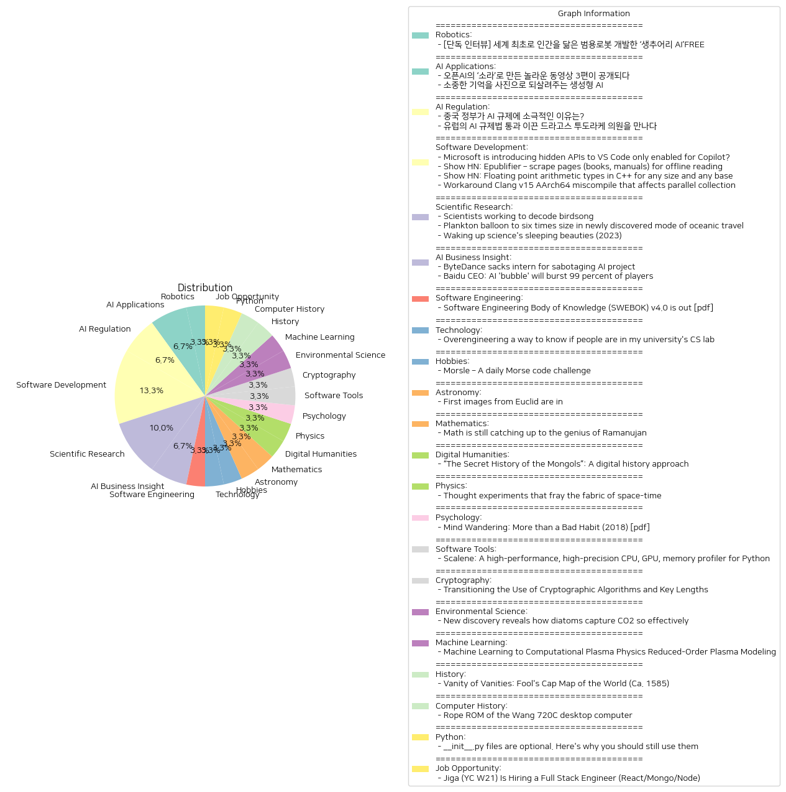

# Daily Artificial Intelligence Insights : News

## 🩵 Robotics

**요약:**

1. **주요 테마**:
   최근 뉴스에서 반복적으로 언급되는 주요 주제는 인공지능과 로봇 공학이며, 특히 인간을 닮은 범용 로봇 개발입니다. 이는 산업 및 일상 생활에서 인공지능의 역할을 확대하려는 경향과 관련이 있습니다.

2. **주요 사건**:
   캐나다의 AI 로봇 전문기업 '생추어리 AI'는 조르디 로즈 CEO의 주도로, 복잡한 일상 속 상황에 유연하게 대응할 수 있는 범용 로봇을 개발하고 있습니다. 이는 세계 최초로 인간을 닮은 형태의 로봇 개발을 목표로 하고 있는 점에서 주목받고 있습니다.

3. **영향 분석**:
   이러한 발전은 경제와 사회에 다양한 영향을 미칠 수 있습니다. 경제적으로는 로봇 공학 산업의 성장을 가속화하고, 새로운 일자리 창출 및 기존 일자리의 변화에 따라 노동 시장에도 변화가 예상됩니다. 사회적으로는 인간과 로봇 간 상호 작용의 범위가 확장됨으로써 스마트 홈, 의료, 서비스 분야 등에서 더욱 편리한 삶을 제공할 가능성이 큽니다.

4. **최종 요약**:
   최근의 뉴스는 인공지능과 로봇 공학이 본격적으로 현실 세계에 통합되고 있음을 보여주고 있습니다. 범용 로봇 개발을 통해 다양한 분야에서 인공지능의 활용 가능성이 높아지고 있으며, 이는 곧 사회 전반에 걸쳐 상당한 변화를 유발할 것으로 예상됩니다. 앞으로 이러한 기술의 발전과 그에 따른 규제 및 윤리적 논의에 주목할 필요가 있습니다.

**출처:**

 - [단독 인터뷰] 세계 최초로 인간을 닮은 범용로봇 개발한 ‘생추어리 AI’FREE (https://www.technologyreview.kr/%ec%9d%b8%ed%84%b0%eb%b7%b0-%ec%83%9d%ec%b6%94%ec%96%b4%eb%a6%ac-ai%ea%b0%80-%ea%b7%b8%eb%a6%ac%eb%8a%94-%eb%af%b8%eb%9e%98%ec%9d%98-%eb%a1%9c%eb%b4%87%ec%9d%80-%ec%8b%a4%ec%b2%b4%ed%99%94/)

## 🌞 AI Applications

**요약:**

**1. 주요 테마**:  
- 인공지능(AI) 기술의 발전과 그 활용
- 창의적 콘텐츠 제작 및 기억 보존을 위한 AI의 역할

**2. 주요 사건**:  
- 오픈AI의 새로운 동영상 생성 모델 '소라'가 공개되었으며, 이를 이용해 영상 크리에이터들이 3편의 놀라운 동영상을 제작함. 이 동영상은 소라의 혁신적인 기술을 기반으로 크리에이티브 제작 기법을 활용하여 만들어짐.
- 생성형 AI를 활용하여 과거의 기억을 사진으로 되살리는 '합성 기억' 프로젝트 추진. 이 프로젝트는 이미지 생성 기술을 통해 가족들이 이전에 담지 못했던 추억을 되살릴 수 있는 기회를 제공함.

**3. 영향 분석**:  
- **경제**: AI 기술의 발전은 콘텐츠 제작 분야와 미디어 산업에 큰 변화를 가져오고 있으며, 특히 창작자들이 새로운 작품을 제작하는데 주요한 도구로 활용됨. 이는 관련 산업에 투자와 발전을 도모할 가능성을 높임.
- **사회**: 기억과 관련된 AI 프로젝트는 가족들에게 잃어버린 추억을 회복할 수 있는 기회를 제공하여, 인간의 정서적 요소와 기술의 융합을 보여줌. 이는 사회 전반에 걸쳐 기술에 대한 긍정적인 인식을 증진시킬 수 있음.

**4. 최종 요약**:  
오픈AI의 '소라'와 같은 혁신적인 AI 모델의 등장은 콘텐츠 창작의 한계를 확장시키며, 영상 제작자들에게 새로운 창의적 도구를 제공하고 있음. 또한, '합성 기억' 프로젝트와 같은 AI 응용은 개인에게 특별한 의미를 담은 추억을 재현할 수 있는 기회를 주며, 감성적인 측면에서 사회적 가치를 창출하고 있음. 앞으로 AI 기술은 콘텐츠 제작뿐만 아니라, 개인의 경험 보존 등 다양한 분야에서 더욱 활발히 적용될 것으로 전망됨. 기술의 발전이 사회 및 경제 전반에 걸쳐 포용적이고 긍정적인 변화를 가져올 수 있도록 지속적인 관심과 연구가 필요할 것으로 보임.

**출처:**

 - 오픈AI의 ‘소라’로 만든 놀라운 동영상 3편이 공개되다 (https://www.technologyreview.kr/%ec%98%81%ec%83%81-%ec%83%9d%ec%84%b1-%eb%aa%a8%eb%8d%b8-%ec%86%8c%eb%9d%bc%eb%a1%9c-%eb%a7%8c%eb%93%a0-%eb%86%80%eb%9d%bc%ec%9a%b4-%ec%98%81%ed%99%94-3%ed%8e%b8%ec%9d%b4-%ea%b3%b5%ea%b0%9c%eb%90%98/)
 - 소중한 기억을 사진으로 되살려주는 생성형 AI (https://www.technologyreview.kr/%ec%83%9d%ec%84%b1%ed%98%95-ai%eb%a1%9c-%ea%b0%80%ec%9e%a5-%ec%86%8c%ec%a4%91%ed%95%9c-%ea%b8%b0%ec%96%b5%ec%9d%84-%ec%82%ac%ec%a7%84%ec%9c%bc%eb%a1%9c-%eb%a7%8c%eb%93%a0%eb%8b%a4/)

## 🌅 AI Regulation

**요약:**

1. **주요 주제**:
   - AI(인공지능) 규제와 관련된 정부의 입장과 정책이 주요 주제로 나타납니다. 
   - 중국과 유럽의 AI 규제 접근 방식의 차이가 강조되고 있습니다.
   - 각 지역의 AI 규제가 산업에 미치는 영향과 이러한 규제가 산업을 개선하거나 성장시키는 방법에 대한 논의가 존재합니다.

2. **주요 사건**:
   - 첫 번째 기사에서는 중국 정부가 AI 규제에 대해 느슨한 태도를 유지하고 있다는 점이 강조됩니다. 이는 중국의 기술 산업 성장 전략의 일환으로 해석됩니다.
   - 두 번째 기사에서는 드라고스 투도라케 의원이 유럽의회에서 AI 규제법 통과를 주도한 사건이 소개됩니다. 그는 이 법이 AI 산업의 개선에 기여할 것이라고 믿고 있습니다.

3. **영향 분석**:
   - 정치: 중국의 느슨한 AI 규제는 글로벌 기술 경쟁력 강화를 위한 전략으로 보이며, 유럽의 강력한 규제는 기술 표준과 윤리적 기준 설정을 통해 AI의 안전성과 책임성을 강조합니다.
   - 경제: AI 규제의 강도는 각 지역의 AI 산업 성장 속도와 혁신 능력에 직접적인 영향을 미칠 가능성이 큽니다. 중국은 성장을 촉진하고자 하는 반면, 유럽은 규제를 통해 산업의 방향성을 제어하려는 모습입니다.
   - 사회: 규제의 차이는 기술 채택과 활용에 대한 사회적 신뢰 및 수용도에 영향을 줄 수 있습니다. 느슨한 규제는 혁신을 촉진하지만, 윤리적 문제의 발생 가능성이 높을 수 있습니다.

4. **최종 요약**:
   - 이번 뉴스들은 AI 규제가 각 지역에서 어떻게 다른 접근을 보이는지를 잘 보여줍니다. 중국은 AI 산업의 급속한 성장을 지원하고자 규제를 느슨하게 유지하는 반면, 유럽은 규제를 강화하여 산업의 질적 성장을 유도하려 하고 있습니다. 
   - 앞으로 주목해야 할 점은 이러한 규제의 차이가 글로벌 AI 산업의 표준과 정책에 어떤 영향을 미칠 것이며, 각 지역의 AI 관련 기업과 소비자들이 이에 어떻게 적응할 것인지입니다. 각국이 규제를 통해 기술 혁신과 윤리적 기준 사이에서 균형을 찾는 과정이 계속 중요할 것으로 보입니다.

**출처:**

 - 중국 정부가 AI 규제에 소극적인 이유는? (https://www.technologyreview.kr/%ec%a4%91%ea%b5%ad-%ec%a0%95%eb%b6%80%ea%b0%80-%ed%98%84%ec%9e%ac%eb%a1%9c%ec%84%9c%eb%8a%94-ai-%eb%b6%84%ec%95%bc%eb%a5%bc-%ea%b0%80%ed%98%b9%ed%95%98%ea%b2%8c-%ea%b7%9c%ec%a0%9c%ed%95%98%ec%a7%80/)
 - 유럽의 AI 규제법 통과 이끈 드라고스 투도라케 의원을 만나다 (https://www.technologyreview.kr/ai-%ea%b7%9c%ec%a0%9c%eb%b2%95-%ed%86%b5%ea%b3%bc-%ec%9d%b4%eb%81%88-%eb%93%9c%eb%9d%bc%ea%b3%a0%ec%8a%a4-%ed%88%ac%eb%8f%84%eb%9d%bc%ec%bc%80-%ec%9d%98%ec%9b%90%ec%9d%84-%eb%a7%8c%eb%82%98%eb%8b%a4/)

## ✈️ Software Development

**요약:**

1. **주요 주제**:
   - 소프트웨어 및 기술 도구의 발전: 기사들은 주로 개발자 도구와 관련된 다양한 기술적 발전을 다루고 있습니다.
   - 개발자 및 사용자 맞춤형 도구: 코딩 관행의 개선과 특정 사용자 요구에 맞춘 솔루션이 두드러집니다.
   - 프로그래밍 언어 및 컴파일러 문제: C++와 관련된 부동 소수점 산술, Clang 컴파일러의 문제 해결 등이 있습니다.

2. **주요 사건**:
   - Microsoft의 VS Code용 숨겨진 API 도입: 개발자 자격 증명을 통해 Copilot 관련 기능 사용 가능.
   - Epublifier 소개: 웹페이지를 ePub 형식으로 변환하여 오프라인에서 읽기 기능 지원.
   - C++의 임의 부동 소수점 산술 라이브러리 'fas': 다양한 크기와 베이스의 부동 소수점 산술 지원.
   - Clang의 AArch64 컴파일 문제 해결: 병렬 수집에 영향을 미치는 컴파일 문제의 조치 방안 제안.

3. **영향 분석**:
   - 경제 및 기술: 최신 개발 도구와 라이브러리는 개발자들의 생산성을 높이고, 새로운 혁신을 촉진할 수 있습니다. 이는 기업의 기술 경쟁력을 강화하는 데에도 기여할 수 있습니다.
   - 사회 및 교육: 사용자 맞춤형 도구와 프로그래밍 개선은 교육 및 학습 환경을 고도화하고, 새로운 기술 습득에 도움을 줄 가능성이 큽니다.
   - 기술적 문제 해결: Clang 컴파일러의 문제 해결은 개발자들이 보다 안정적인 환경에서 작업할 수 있도록 하여 장기적으로 기술 생태계의 발전을 지원합니다.

4. **최종 요약**:
   - 이번 기사는 기술 도구의 발전과 맞춤화, 그리고 프로그래밍 환경 개선에 대한 현재의 관심을 반영하고 있습니다. 지속적인 혁신과 문제 해결은 기술 발전을 가속화하고, 이는 경제와 사회 다양한 영역에 긍정적인 변화를 가져올 수 있습니다. 앞으로 개발자 도구와 장애 해결에 대한 지속적인 연구를 주목해야 합니다. 이는 미래의 기술 발전과 디지털 혁신을 예견할 수 있는 지표가 될 것입니다.

**출처:**

 - Microsoft is introducing hidden APIs to VS Code only enabled for Copilot? (https://old.reddit.com/r/ChatGPTCoding/comments/1g8xrub/microsoft_is_introducing_hidden_apis_to_vs_code/)
 - Show HN: Epublifier – scrape pages (books, manuals) for offline reading (https://github.com/maoserr/epublifier)
 - Show HN: Floating point arithmetic types in C++ for any size and any base (https://github.com/clemensmanert/fas)
 - Workaround Clang v15 AArch64 miscompile that affects parallel collection (https://github.com/cisco/ChezScheme/pull/879)

## 💚 Scientific Research

**요약:**

1. **주요 주제**:
   - 과학적 발견과 커뮤니케이션: 조류의 노래와 사회 구조 분석, 과학적 발견의 재발견.
   - 기술과 자연의 조화: 생체발광 식물 플랑크톤의 독특한 이동 방식 및 이에 대한 연구.
   - 인공지능(AI) 활용: 숨겨진 과학적 발견을 AI를 통해 재조명하고 연구 가속화를 가능하게 함.

2. **주요 사건**:
   - 조류의 복잡한 보컬과 사회 구조를 해석하기 위한 과학자들의 연구. 기계 학습과 오디오 분석을 통해 조류의 커뮤니케이션을 연구하고 있으며, 이로 인해 조류의 놀라운 인지 능력과 지적 역량이 밝혀졌다.
   - 해양 여행에서 새로운 방식으로 발견된 식물성 플랑크톤의 독특한 이동 전략. 이 플랑크톤은 자기 부피를 여섯 배로 늘려 위로 이동하며 중력에서 벗어나기 위한 전략을 활용한다.
   - 과거에 숨겨져 있던 과학적 발견('잠자는 미녀')을 되살리기 위한 AI 기술의 사용. AI를 통한 연구로 인해, 독립적인 자료들이 결합하여 새로운 과학적 진보 기회가 생기고 있다.

3. **영향 분석**:
   - **환경**: 조류와 플랑크톤에 대한 새로운 발견은 생태계의 복잡성과 이에 따른 환경 보호 노력에 대한 이해를 돕는다.
   - **과학 기술**: AI와 기계 학습의 발전은 과학 탐구의 새로운 문을 열어, 지나치기 쉬운 발견들의 재조명을 가능하게 한다.
   - **사회 문화**: 조류의 인지 능력 및 커뮤니케이션 연구는 생물다양성에 대한 인식을 높일 수 있다. 또한 과학적 발견의 국제적 공유 및 협력의 중요성을 강조한다.

4. **최종 요약**:
   세 가지 뉴스 기사는 자연 및 과학 연구에서의 최신 개발을 다루고 있다. 조류와 플랑크톤에 대한 연구는 자연의 복잡성과 생태계 내 상호작용에 대한 깊이 있는 이해를 제공하며, AI 기술의 활용은 과거에 알려지지 않았던 과학적 지식을 활성화하는 가능성을 보여주고 있다. 이들 발견은 환경보존, 과학적 발전, 국제협력 등의 분야에 중요한 영향을 미칠 것이며, 이러한 기술과 발견의 진보는 지속 가능한 발전과 학문적 혁신을 위한 중요한 기회로 작용할 수 있다. 앞으로도 기술과 자연을 결합한 연구의 흐름을 주목할 필요가 있다.

**출처:**

 - Scientists working to decode birdsong (https://www.newyorker.com/magazine/2024/10/21/how-scientists-started-to-decode-birdsong)
 - Plankton balloon to six times size in newly discovered mode of oceanic travel (https://phys.org/news/2024-10-plankton-balloon-size-newly-mode.html)
 - Waking up science's sleeping beauties (2023) (https://worksinprogress.co/issue/waking-up-sciences-sleeping-beauties/)

## 🫧 AI Business Insight

**요약:**

**1. 주요 테마**:
   - 주요 테마는 AI(인공지능) 관련 문제와 그 경제적, 사회적 영향입니다. 특히, AI 프로젝트에 대한 내부 방해 및 AI 산업 내 경쟁 압력과 같은 이슈가 주로 다루어집니다.
   - AI 모델의 오류(환각)에 대한 해결 및 AI 산업의 과열로 인한 거품 발생 예측이 논의됩니다.

**2. 주요 사건**:
   - ByteDance는 AI 모델 훈련을 방해한 인턴을 해고하였으며, 이 사건이 상업 운영에 영향을 미치지 않았다고 주장했습니다.
   - Baidu의 CEO, Robin Li는 AI의 환각 문제 해결을 언급하면서, AI 산업의 과열로 인해 많은 스타트업이 사라질 거품이 발생할 것이라고 예측하였습니다. 

**3. 영향 분석**:
   - **경제적 영향**: ByteDance의 사건은 내부 보안 및 데이터 보호의 중요성을 다시 한번 강조하게 되었으며, 이는 기업들이 AI 모델 개발 과정에서 보안을 강화하는 계기가 될 수 있습니다. Baidu의 예측이 현실화된다면, AI 스타트업은 큰 위기에 직면할 수 있으며, 이는 AI 분야 내에서 대기업의 지배력이 더욱 커질 가능성이 있음을 시사합니다.
   - **사회적 영향**: AI의 발전이 가져올 기술적 변화는 장기적으로 인력이 대체되는 사회적 문제로까지 확대될 수 있음을 Baidu CEO의 예측을 통해 확인할 수 있습니다.

**4. 최종 요약**:
   ByteDance와 Baidu의 뉴스 기사에서 언급된 사건과 예측들은 AI 산업 내 보안과 지속 가능성에 대한 중대한 질문을 던지고 있습니다. ByteDance의 사건은 AI 프로젝트에 있어 건전한 내부 관리의 중요성을 강조하며, Baidu CEO의 발언은 산업의 급격한 발전이 가져올 수 있는 과열 현상과 그로 인한 리스크를 경고하고 있습니다. 앞으로 AI 기술의 발전은 필연적으로 경제와 사회에 다양한 방식으로 영향을 미칠 것이며, 이러한 문제를 해결하기 위한 노력이 지속적으로 필요할 것입니다. AI 기술의 발전 방향과 그로 인한 산업 변화 및 사회적 문제를 주의 깊게 모니터링할 필요가 있습니다.

**출처:**

 - ByteDance sacks intern for sabotaging AI project (https://www.bbc.com/news/articles/c7v62gg49zro)
 - Baidu CEO: AI 'bubble' will burst 99 percent of players (https://www.theregister.com/2024/10/20/asia_tech_news_roundup/)

## 🌿 Software Engineering

**요약:**

1. **주요 주제**:
   소프트웨어 공학 지식체계(SWEBOK) v4.0 발행은 소프트웨어 공학 분야에서 지속적인 발전과 현대 개발 관행의 반영을 목표로 한다. 소프트웨어 공학의 기초를 설정하고 최신 기술 및 새로운 기법을 포함한 18개의 지식 영역으로 구성된 포괄적인 안내서가 주된 주제다.

2. **주요 사건**:
   IEEE 컴퓨터 학회가 최신 SWEBOK 가이드를 발행했다는 것이 가장 중요한 사건으로, 이는 소프트웨어 공학 분야에서 지식의 표준을 구축하고 그 발전을 촉진하기 위해 설계된 것이다.

3. **영향 분석**:
   - **경제**: SWEBOK 가이드의 업데이트는 소프트웨어 산업의 표준화를 통해 개발 효율성을 높이고, 인력 교육 및 훈련의 질을 향상시킬 수 있다.
   - **정치**: IT 정책 및 규제에 있어서는 SWEBOK에 기반한 지식 수준을 높임으로서 더 나은 법과 지침을 마련할 수 있을 가능성이 있다.
   - **사회**: 소프트웨어 공학의 표준화는 개발자 및 교육자들이 새로운 기술과 동향을 더욱 빠르게 습득할 수 있게 해주어 기술 격차를 줄일 수 있다.

4. **최종 요약**:
   SWEBOK v4.0의 발행은 소프트웨어 개발 전반에 걸쳐 지식 표준을 확립함으로써 해당 분야의 지속적인 발전을 지원한다. 이를 통해 소프트웨어 산업의 경쟁력을 강화하고, 균일한 교육 기준을 제공하여 시장의 수요에 보다 신속하게 대응할 수 있는 능력을 증진시킬 것이다. 미래에는 이러한 가이드의 지속적인 업데이트를 통해 디지털 혁신을 선도하는 새로운 기술과 관행에 대한 방향성을 제공할 가능성이 높다.

**출처:**

 - Software Engineering Body of Knowledge (SWEBOK) v4.0 is out [pdf] (https://ieeecs-media.computer.org/media/education/swebok/swebok-v4.pdf)

## 🫧 Technology

**요약:**

**1. 주요 주제:**
   - 기술의 발전과 간소화: 기술이 어떻게 더 간단하고 경제적으로 대체되는지에 대한 이야기.
   - 귀속 비용 절감: 비싼 장비에서 저렴한 장비의 대체와 그에 따른 비용 절감 가능성.

**2. 주요 사건:**
   - 위스콘신 대학교의 학부 프로젝트 실험실에서 기존의 카메라 시스템을 저렴한 웹캠과 Raspberry Pi로 교체한 사례.

**3. 영향 분석:**
   - 사회: 기술의 단순화는 더 많은 사람들이 기술에 접근할 수 있게 하고, 이는 창의성과 혁신을 장려할 수 있음.
   - 경제: 고비용 장비를 저비용 장비로 대체함으로써 학교와 연구 기관은 재정적으로 더 효율적일 수 있고, 그 예산은 다른 프로젝트나 인프라 개선에 사용할 수 있음.

**4. 최종 요약:**
   이번 사례는 과거의 복잡하고 비싼 시스템을 간소하고 저렴한 기기로 대체함으로써 기술력이 발전하면서 얻을 수 있는 실질적인 혜택을 보여줍니다. 이는 교육 기관과 연구 시설뿐만 아니라 다른 분야에도 영향을 줄 수 있으며, 가성비 높은 기술 솔루션을 찾는 경향이 계속될 가능성이 높습니다. 향후 변화는 더 많은 기술적 혁신을 가져와 다양한 산업 부문에 효율성과 창의성을 증대시킬 수 있습니다. 기술의 발전을 활용하여 사회적, 경제적 이익을 극대화하는 방향을 주목할 필요가 있습니다.

**출처:**

 - Overengineering a way to know if people are in my university's CS lab (https://www.amoses.dev/blog/upl-people-counter/)

## 👽 Hobbies

**요약:**

**종합 요약 보고서**

1. **주요 테마**:
   뉴스 기사 제목 'Morsle – A daily Morse code challenge'에서 강조된 주요 테마는 디지털 엔터테인먼트와 교육이다. 이 주제는 Morse 코드에 대한 일일 도전 과제를 통해 사람들에게 학습과 오락의 기회를 제공하는 것이 핵심이다.

2. **주요 사건**:
   제목과 함께 제공된 정보에서 가장 두드러진 사건은 Morsle이라는 프로그램이 Morse 코드 학습을 재미있는 도전으로 전환했다는 점이다. 이는 학습자에게 일일 챌린지를 통해 Morse 코드를 익히고 숙달할 수 있는 기회를 제공하는 프로그램이다.

3. **영향 분석**:
   - **경제**: 새로운 프로그램은 관련 애플리케이션 및 소프트웨어 산업에 긍정적인 영향을 미칠 수 있다. Morse 코드의 새로운 학습 툴은 사용자의 흥미를 유발하고 관련 기술 제품의 판매를 촉진할 수 있다.
   - **사회**: 이 프로그램은 다양한 연령대의 사람들이 새로운 형태의 커뮤니케이션 기술을 배우고 활용하는 기회를 제공함으로써 사회적 참여를 증진시킬 수 있다. 또한, Morse 코드에 대한 인식 제고와 문화적 재발견을 지원할 수 있다.

4. **최종 요약**:
   전반적으로 Morsle이라는 프로그램은 Morse 코드 학습을 새롭고 창의적인 방법으로 제공함으로써 학습과 오락을 결합한 것은 긍정적인 발전이다. 이것은 특히 교육기술 시장에서 사용자가 참여할 수 있는 새로운 길을 열어줄 수 있으며, 향후 Morse 코드의 활용 및 관련 문화의 지속적인 발달에 기여할 가능성이 있다. 향후 이와 유사한 학습 툴의 개발과 시장 확대를 주목할 필요가 있다.

**출처:**

 - Morsle – A daily Morse code challenge (https://morsle.fun)

## 🫧 Astronomy

**요약:**

1. **주요 테마**:
   - '유클리드' 프로젝트의 처음 이미지 공개가 과학 및 천문학 분야에 큰 주목을 받고 있습니다. 이러한 주제는 기술 발전 및 우주 탐사에 대한 관심을 잘 나타냅니다.

2. **주요 이벤트**:
   - 유럽우주국(ESA)의 새로운 우주망원경 '유클리드'가 전송한 첫 이미지가 공개되었습니다. 이는 유클리드 미션의 중요한 첫 성과로, 우주의 비밀을 밝히기 위한 첫걸음을 내딛은 것입니다.

3. **영향 분석**:
   - **과학 및 기술**: '유클리드'의 이미지 공개는 우주 탐사 및 연구의 새 장을 열었습니다. 이는 천문학자 및 과학자들에게 중요한 데이터와 분석 기회를 제공하여, 우주의 진화를 이해하는 데 기여할 것입니다.
   - **경제**: '유클리드' 프로젝트와 같은 기술적 성과는 연구 및 개발(R&D) 투자에 긍정적인 영향을 미치며, 관련 산업 부문에 혁신적 발전을 촉진할 것으로 예상됩니다.
   - **사회**: 우주 탐사에 대한 대중의 관심이 증가하여, STEM(과학, 기술, 공학, 수학) 분야의 교육적 관심과 지원이 더욱 강조될 것입니다.

4. **최종 요약**:
   - '유클리드'의 첫 이미지는 천문학 및 우주 탐사 분야의 획기적인 사건으로 자리 잡았습니다. 이러한 발전은 미래에 더 많은 우주 탐사 프로젝트를 가능하게 할 것이며, 기술 혁신과 과학적 발견을 통한 작은 한 걸음을 나타냅니다. 앞으로, 우주에 대한 이해가 더욱 깊어질 것이며, 이는 여러 분야에 긍정적인 여파를 미칠 것으로 기대됩니다. 과학의 진보와 인류의 호기심을 충족시키는 새로운 기회들이 끊임없이 등장할 가능성이 있으므로, 이러한 발전을 주목할 필요가 있습니다.

**출처:**

 - First images from Euclid are in (https://dlmultimedia.esa.int/download/public/videos/2024/10/023/orig-2410_023_AR_EN.mp4)

## 🎠 Mathematics

**요약:**

**1. 주요 주제:**

    - 수학적 천재 라마누잔의 업적과 그의 학문이 현대 수학에 미치는 영향
    - 라마누잔의 분할 항등식과 곡선 및 곡면의 특이점 간의 연결

**2. 주요 사건:**

    - 후세인 모르타다는 곡선과 곡면의 특이점의 깊은 기본 구조를 확인하여, 해당 구조가 라마누잔의 분할 항등식과 연결된다는 것을 밝혔다.
    - 라마누잔의 업적은 비전에서 영감을 받아 개발된 것으로, 다양한 수학 분야, 특히 대수기하학에서 장기적인 영향을 미쳤다.

**3. 영향 분석:**

    - **경제**: 직접적인 경제적 영향은 논의되지 않았지만, 수학 연구의 발전이 결국 기술 혁신과 경제 발전에 기여할 가능성을 열어준다.
    - **정치**: 정치 영역에서 직접적으로 언급되지 않았으나, 과학 및 수학 발전에 대한 투자가 국가 경쟁력에 긍정적 영향을 미칠 수 있다.
    - **사회**: 수학적 발견은 교육 및 연구 분야에서 학생 및 학자들에게 영감을 주며, 학문적 호기심을 불러일으킨다.
    
**4. 최종 요약:**

    수학계의 천재 라마누잔의 업적은 그의 시대를 넘어 현재까지도 막대한 영향을 미치고 있다. 후세인 모르타다는 라마누잔의 분할 항등식과 대수기하학 내 특이점 간의 연결성을 밝혀내며, 이러한 연구가 현대 수학 연구의 기초가 됨을 입증하였다. 라마누잔의 연구는 수학의 여러 분야에서 발견되고 있으며, 이는 기술 및 과학 발전에 기초가 되는 중요한 요소로 자리 잡고 있다. 앞으로도 그의 연구가 다양한 방식으로 수학과 과학의 발전 방향에 영향을 미칠 것으로 예상된다. 학문적 연구의 투자와 발전이 사회 전반에 긍정적인 여파를 가져올 가능성을 주목할 필요가 있다.

**출처:**

 - Math is still catching up to the genius of Ramanujan (https://www.quantamagazine.org/srinivasa-ramanujan-was-a-genius-math-is-still-catching-up-20241021/)

## 🫧 Digital Humanities

**요약:**

### 요약 보고서

1. **주요 테마**:
   "몽골비사"는 13세기 몽골의 역사 기록물로, 칭기즈 칸의 권력 상승과 몽골 제국의 확장을 다루고 있습니다. 이는 몽골의 역사서술, 문화, 생활, 언어에 대한 풍부한 통찰을 제공합니다. 이를 통해 이를 기반으로 한 수많은 디지털 역사 연구가 진행되고 있음을 알 수 있습니다.

2. **주요 사건**:
   - **칭기즈 칸의 등극과 몽골의 확장**: 몽골 제국의 기원과 칭기즈 칸의 세력이 어떻게 형성되고 확장되었는지를 기록한 것은 역사적으로 중요합니다.
   - **디지털 역사 접근**: 전통적인 기록물이 디지털화되어 몽골 역사에 대한 이해가 어떻게 확장되고 있는지를 담고 있습니다.

3. **영향 분석**:
   - **정치적 영향**: 과거의 제국이 어떻게 형성되고 유지되었는지를 통해 현대 정치 체제에도 여러 중요한 통찰을 제공합니다.
   - **사회 및 문화적 영향**: 몽골의 문화적 유산과 언어, 생활 방식을 이해하는 데 큰 기여를 하며, 이는 현대 몽골 사회의 정체성 형성에도 기여합니다.
   - **교육적 및 학문적 영향**: "몽골비사"의 디지털화는 학문적 연구와 교육에 큰 가치를 제공하며, 이 기록물을 통해 전세계적으로 어떤 역사적 통찰을 끌어낼 수 있는지를 보여줍니다.

4. **최종 요약**:
   "몽골비사"의 디지털 역사 접근은, 고대 몽골의 역사와 문화를 보다 깊이 이해할 수 있는 기회를 제공하며, 이러한 디지털화 과정은 과거의 기록물을 현대의 연구에 통합하는 중요한 발전을 보여줍니다. 이러한 작업은 향후 다른 역사적 문서의 디지털화에 대한 모범 사례로 자리 잡을 가능성이 크며, 역사 연구 분야의 발전에 크게 기여할 것으로 기대됩니다. 또한, 이러한 역사가 현재와 미래 사회의 정치, 문화, 교육에 계속해서 영향을 미칠 수 있는지를 주목할 필요가 있습니다.

**출처:**

 - “The Secret History of the Mongols”: A digital history approach (https://journalofdigitalhistory.org/en/article/Gqh2Bf5W4TdK)

## 🎉 Physics

**요약:**

입력:

                - 제목: '공간-시간의 구조를 뒤흔드는 사고 실험들'
                - 요약/추출: '우리는 당신의 데이터를 소중히 여깁니다. 원활한 웹사이트 방문을 위해 쿠키 사용에 동의해 주세요. 우리의 개인정보 보호정책에 대해 더 읽어보시기 바랍니다.'

출력:

1. **주요 주제**:
   - 사고 실험과 과학적 탐구
   - 프라이버시 및 데이터 보호

2. **주요 사건**:
   - 공간-시간의 구조를 다루는 사고 실험에 대한 논의가 있었다. 이러한 실험들은 과학계와 철학계에서 중요한 주제를 이루고 있으며, 현실과 이론의 경계를 확장시키고 있다.
   - 개인정보 보호와 관련하여 데이터 사용 정책에 대한 논의가 있었다. 이는 웹사이트 사용자들에게 더 나은 경험을 제공하기 위한 조치로, 데이터 보호에 대한 인식이 증가하고 있음을 반영한다.

3. **영향 분석**:
   - 경제: 데이터 보호에 대한 인식이 높아짐에 따라 기업들은 개인정보 보호 정책을 강화하고, 이에 따른 비용이 증가할 수 있다.
   - 정치: 프라이버시 관련 규제가 강화되면서 정책 입안자들 사이에서 데이터 보호와 관련된 법률 강화의 필요성이 대두되고 있다.
   - 사회: 개인 프라이버시에 대한 관심이 증가하여, 사용자들의 의식적인 동의와 투명성에 대한 요구가 커지고 있다.

4. **최종 요약**:
   - 사고 실험이 학문과 과학적 탐구의 경계를 확장시키는 중요한 도구로서 주목받고 있다. 이는 새로운 과학적 이론 개발과 이해에 기여할 수 있다.
   - 데이터 보호와 프라이버시 관련 정책은 계속해서 강화되고 있으며, 이는 사용자에게 더 나은 정보 제어와 보안을 제공할 수 있다. 개인정보 보호에 대한 인식 증가와 함께 기업과 정책 입안자들은 이에 상응하는 조치를 준비해야 한다.
   - 앞으로 데이터 보호와 관련된 규제와 기술적인 발전을 주시할 필요가 있으며, 이는 경제 및 사회 전반에 걸쳐 중요한 영향을 미칠 것이다.

**출처:**

 - Thought experiments that fray the fabric of space-time (https://www.quantamagazine.org/the-thought-experiments-that-fray-the-fabric-of-space-time-20240925/)

## 🎠 Psychology

**요약:**

1. **주요 주제**:
   기사에서는 마인드 워터링(생각 방황)이 개인의 목표와 걱정과 관련된 신호에 의해 촉발되는 복잡하고 자동적인 정신 과정이라는 주제를 다루고 있습니다. 또한, 이는 의식과 의도 없이 자동으로 펼쳐지는 습관으로 간주될 수 있으며, 동시에 의도적이고 창의적인 과정이기도 합니다. 이처럼, 마인드 워터링의 습관적 사고 패턴을 이해하고 변화시키는 것이 유익할 수 있는 가능성을 제시하고 있습니다.

2. **주요 사건**:
   'Mind Wandering: More than a Bad Habit'라는 기사에서는 마인드 워터링이 어떤 경우에는 단순한 나쁜 습관 이상의 의미를 지닌다는 점을 강조하고 있습니다. 마인드 워터링은 자기도 모르게 생겨나는 자동적인 정신 활동으로 볼 수 있으나, 목적을 가지고 창의적으로 활용될 수 있는 가능성도 있으며, 이는 개인의 목표와 관심으로 인해 촉발될 수 있습니다. 

3. **영향 분석**:
   마인드 워터링에 대한 이해는 개인의 정신 건강과 개인 개발에 긍정적인 영향을 줄 수 있습니다. 만약 사람들이 마인드 워터링을 의식적으로 인식하고 이를 활용하는 방법을 배운다면, 창의성 증진과 문제 해결 능력 향상에 기여할 수 있을 것입니다. 이는 궁극적으로 사회 전반에 걸쳐 보다 나은 정신 건강과 혁신을 촉진할 가능성이 있습니다.

4. **종합 요약**:
   전체적으로, 마인드 워터링은 단순한 나쁜 습관이 아니며, 개인의 삶에 긍정적인 영향을 미칠 수 있는 잠재력을 가지고 있습니다. 이러한 자동적이고도 창의적인 마음의 방황을 이해하고 이를 개선할 수 있는 방법을 연구하는 것은, 개인 개발뿐만 아니라 사회 전체의 정신적 복지에도 큰 기여를 할 수 있습니다. 향후 연구는 이러한 마인드 워터링을 어떻게 활용할 수 있는지에 초점을 맞추어, 사람들이 이러한 정신 활동을 보다 생산적이고 유익한 방향으로 유도할 수 있는 방법을 탐구해야 합니다.

**출처:**

 - Mind Wandering: More than a Bad Habit (2018) [pdf] (https://labs.psych.ucsb.edu/schooler/jonathan/sites/labs.psych.ucsb.edu.schooler.jonathan/files/pubs/202._mind_wandering.pdf)

## 🐱 Software Tools

**요약:**

1. **주요 테마**:
   - 기술 혁신과 최적화: Python 프로파일러인 Scalene의 성능 및 정밀도가 높은 기능을 통한 코드 최적화.
   - 인공지능의 활용: AI를 통한 최적화 제안 기능이 통합된 기술.

2. **주요 사건**:
   - Scalene, 고성능의 Python 프로파일러 출범: CPU, GPU, 메모리 프로파일링 지원.
   - 기존 프로파일러보다 빠르고 세세한 정보 제공: 코드 최적화를 위한 인공지능 지원 기능 포함.

3. **영향 분석**:
   - 경제적 영향: 프로그래밍 및 개발 효율성 향상으로 인해 기술업계의 생산성과 혁신성 제고에 기여할 수 있음.
   - 사회적 영향: 인공지능 기술의 발전과 활용이 프로그래밍 패러다임의 변화를 유도하며, 기술자들에게 새로운 학습 기회 제공.
   - 기술적 영향: 고성능 프로파일링 도구의 도입은 소프트웨어 개발 과정의 효율성과 정확성을 증가시킬 potential 있는 혁신을 나타냄.

4. **최종 요약**:
   Scalene은 Python 프로그래밍 언어의 성능 최적화에 새로운 장을 열었습니다. 이 프로파일러는 기존 도구보다 빠르고 더 정확한 정보를 제공함으로써 기술자들이 코드의 성능을 효과적으로 개선할 수 있도록 지원합니다. AI를 통해 제공되는 최적화 제안은 코딩 및 개발의 자동화 및 효율성을 높이는 데 기여할 것입니다. 앞으로 이러한 기술 혁신은 소프트웨어 산업 전반에 긍정적인 영향을 미칠 것으로 예상되며, 기술 발전에 따른 새로운 업무 방식과 학습 필요성이 커질 것입니다.

**출처:**

 - Scalene: A high-performance, high-precision CPU, GPU, memory profiler for Python (https://github.com/plasma-umass/scalene)

## 🤩 Cryptography

**요약:**

**1. 주요 주제:**
- 뉴스 기사에서 강조된 주요 주제는 강력한 암호화 알고리즘 및 키 길이로의 전환입니다.
- NIST의 암호화 키 관리 지침과 더 강력하고 양자 내성이 있는 알고리즘으로의 전환이 중요한 테마입니다.
- 구식 알고리즘의 퇴출과 새로운 보안 기준 설정이 반복적으로 등장하는 주제입니다.

**2. 주요 사건:**
- NIST는 암호화 키 관리와 알고리즘 전환에 관한 지침을 제공했습니다.
- 이 지침은 오래된 알고리즘의 활용을 중단하고 더 강력한 키와 내구력 있는 알고리즘으로 전환할 것을 권고하고 있습니다.
- 특히, 양자 컴퓨터 시대에 대비한 양자 내성 알고리즘으로의 전환이 주목받고 있습니다.

**3. 영향 분석:**
- **경제적 영향**: 새로운 암호화 표준의 도입은 보안 회사와 관련 산업에 긍정적인 경제적 영향을 미칠 수 있으며, 보안 기술에 대한 수요가 증가할 가능성이 큽니다.
- **정치적 영향**: 각국 정부가 국가 보안을 위해 이러한 강력한 암호화 기준을 채택할 가능성이 있으며, 정책적 변화가 예상됩니다.
- **사회적 영향**: 데이터 보안에 대한 인식이 높아지면서 개인 및 조직의 보안 수준이 강화될 것입니다.

**4. 최종 요약:**
- NIST의 암호화 지침은 기술 발전에 따른 새로운 보안 요구에 대응하기 위해 구식 알고리즘을 퇴출시키고 강력하고 내구성 있는 양자 저항성 알고리즘으로의 전환을 촉발시킵니다.
- 이는 보안 산업의 발전을 가속화할 것으로 예상되며, 각각의 정치, 사회 및 경제적 영역에서 신규 표준의 채택이 이루어질 것입니다.
- 향후 이러한 변화가 어떻게 구체화되는지 지속적인 모니터링이 필요하며, 특히 양자 컴퓨팅 기술의 발전과 관련하여 어떠한 추가적인 보안 조치가 이루어질지 주목해야 합니다.

**출처:**

 - Transitioning the Use of Cryptographic Algorithms and Key Lengths (https://csrc.nist.gov/pubs/sp/800/131/a/r3/ipd)

## 🪐 Environmental Science

**요약:**

1. **주요 주제**:
   - 이산화탄소(CO2) 고정화 기술
   - 생물학적 CO2 감축 및 관련된 생명공학 응용

2. **주요 사건**:
   - 바젤 대학 연구진이 규조류에서 효율적인 CO2 고정화를 가능하게 하는 단백질 껍데기를 발견함.
   - 이 발견은 대기 중 CO2를 줄일 수 있는 새로운 생물 공학적 응용 가능성을 열어줄 수 있음.

3. **영향 분석**:
   - 환경: 이 발견은 대기 중 CO2 농도를 낮추어 지구온난화 및 기후변화 완화에 기여할 수 있는 가능성을 제시함.
   - 경제: 기술적 혁신을 통해 CO2 배출 감소를 위한 새로운 산업이 탄생할 수 있으며, 관련 생명공학 분야에서 새로운 시장 기회가 창출될 수 있음.
   - 사회: 깨끗한 환경을 보장하여 공공 건강에 긍정적인 영향을 미칠 수 있으며, 장기적인 기후 변화에 대한 대응을 강화할 가능성이 있음.

4. **최종 요약**:
   바젤 대학의 연구진에 의해 규조류의 독특한 단백질 껍데기를 통한 CO2 고정화 메커니즘이 밝혀짐으로써, 이는 생물학적 CO2 감축의 혁신적인 접근 방안을 가능케 했습니다. 이로 인해 우리는 새로운 생명공학적 활용을 통해 더 나은 지구 환경을 만들 기회를 얻게 되었으며, 앞으로 생명공학 및 환경산업의 발전이 기대됩니다. 이러한 기술 개발은 기후 변화에 대한 효과적인 대응 전략으로 자리매김할 가능성이 높으며, 관련 산업에 새로운 투자와 연구를 촉진할 것입니다. 미래에는 이 발견에 기반한 다양한 응용 기술의 발전과 상용화 단계에 주목할 필요가 있습니다.

**출처:**

 - New discovery reveals how diatoms capture CO2 so effectively (https://www.unibas.ch/en/News-Events/News/Uni-Research/New-discovery-reveals-how-diatoms-capture-CO2-so-effectively-.html)

## ☀️ Machine Learning

**요약:**

1. **주요 주제**:
   - 기계 학습 및 수치 모델링
   - 플라즈마 물리와 유체 역학의 융합
   - ML의 플라즈마 물리 응용 강화

2. **주요 사건**:
   - 기계 학습을 활용한 플라즈마 물리 수치 모델링 향상 발표
   - 유체 역학의 발전을 플라즈마 물리 계산에 이식하기 위한 로드맵 제안

3. **영향 분석**:
   - **과학기술**: 기계 학습 기술이 플라즈마 물리에 적용됨으로 인해, 보다 정교하고 효율적인 수치 모델링이 가능해져 연구와 실험의 정확성이 향상될 것으로 기대됩니다.
   - **경제**: 플라즈마 물리 연구의 향상은 에너지 및 반도체 산업 등과 같은 첨단 산업의 발전에 기여할 수 있습니다.
   - **환경**: 수치 모델링의 개선은 기후 모델링 및 에너지 생성의 효율성 증대에 기여할 수 있습니다.

4. **최종 요약**:
   - 기계 학습의 플라즈마 물리 응용이 향상되면서, 기존의 수치 모델링 한계를 극복하고 보다 정밀한 분석과 실험이 가능해질 전망입니다. 플라즈마 물리와 유체 역학의 융합이 다양한 첨단 산업에 혁신을 가져올 수 있으며, 향후 이러한 기술의 발전은 여러 분야에 대한 응용과 연구를 촉진할 것입니다. 이에 따라 관련 분야의 연구진들은 기계 학습과 물리 모델링의 융합 경로를 주의 깊게 관찰할 필요가 있습니다. 향후 플라즈마 물리 계산의 효율성과 정확성 개선에 대한 지속적인 발전이 기대됩니다.

**출처:**

 - Machine Learning to Computational Plasma Physics Reduced-Order Plasma Modeling (https://arxiv.org/abs/2409.02349)

## 💚 History

**요약:**

1. **주요 주제**:
   - 이 기사는 역사적 지도 제작, 특히 아브라함 오르텔리우스의 글로벌 아틀라스와 풍자적인 지도에 대한 논의가 주요 주제를 이루고 있습니다.
   - 지도 제작과 세속적 지식의 비판적 관점이 강조됩니다.

2. **주요 사건**:
   - 1570년에 아브라함 오르텔리우스가 첫 번째 글로벌 아틀라스 "세계의 극장"을 제작했습니다.
   - 1585년 경에 그의 작품으로 간주되는 "바보의 모자 세계지도"는 지도 제작과 세상의 지식에 대한 풍자를 표현했습니다.

3. **영향 분석**:
   - **정치적**: 아틀라스와 이러한 지도는 16세기 사람들에게 세계에 대한 인식을 제공하고, 그 당시의 정치적 경계를 시각적으로 전달하였습니다.
   - **사회적**: 비판적이고 풍자적인 요소는 사회에 대해 고찰하고 반성하는 계기를 제공하였으며, 지도 제작에서 창의성과 유머 감각의 중요성을 일깨웠습니다.

4. **최종 요약**:
   - 이 기사는 역사적인 지도 제작의 발전을 조명하며, 그 예로 오르텔리우스의 아틀라스와 풍자 지도를 통해 당시의 지식과 사회 비판을 드러냅니다. 이러한 지도들은 단순한 지리적 데이터를 넘어 사회, 정치적 반영과 비판의 도구로 작용하였습니다. 앞으로도 이러한 역사적 자료에 대한 분석은 과거와 현재의 사회를 이해하는 데 중요한 정보로 남을 것입니다. 이는 현대 사회에서도 지도 및 정보의 표현 방식이 어떻게 발전하고 있는지, 그리고 그것이 사회에 어떤 영향을 미치는지를 지속적으로 관찰하는 중요한 인사이트를 제공합니다.

**출처:**

 - Vanity of Vanities: Fool's Cap Map of the World (Ca. 1585) (https://publicdomainreview.org/collection/fools-cap-map-of-the-world/)

## 🫧 Computer History

**요약:**

**최종 요약 보고서**

1. **주요 주제**:
   - 기술 발전: 기사에서는 프로그래머블 탁상 컴퓨터인 'WANG 720C'에 대해 다루고 있으며, 이는 초기에 사용되었던 DTL/TTL 논리, Nixie 튜브 디스플레이, 코어 메모리, 수공예된 마이크로코드 ROM 등을 기반으로 하는 옛날 컴퓨팅 기술을 소개하고 있다. 
   - 레트로 컴퓨팅: WANG 720C와 관련한 기사는 레트로 및 구형 컴퓨팅 기기에 대한 관심을 보여주며, 이러한 구형 기술이 현재에 미치는 영향을 설명하고 있다.

2. **주요 사건**:
   - WANG 720C 컴퓨터의 입수 및 분석: 기사는 과거의 컴퓨팅 기술을 연구하고 이해하려는 노력의 일환으로 WANG 720C 모델 컴퓨터를 입수했음을 강조하고 있다.

3. **영향 분석**:
   - 기술 및 사회: 이러한 구형 기술을 분석함으로써 현재의 컴퓨팅 기술의 발전 과정을 이해하고, 과거와 현재의 기술이 어떻게 연결되어 있는지를 알 수 있게 한다. 이는 기술 발전의 방향성을 제시하는 데 기여할 수 있으며 역사적 맥락에서 오늘날의 기술을 재평가하는 데 도움을 준다.
   - 교육 분야: 레트로 컴퓨터 연구는 컴퓨팅 역사 교육 자료로 활용되며 과학 기술 교육에 기여할 수 있다.

4. **최종 요약**:
   - 결론적으로, WANG 720C와 같은 레트로 컴퓨터에 대한 연구는 기술 발전의 역사를 이해하고, 과거와 현재의 연결 고리를 발견함으로써 기술적 통찰력을 제공한다. 앞으로의 기술 발전에서 이러한 역사적 이해가 어떻게 반영될지 주목할 만하다. 미래에 유사한 구형 기술의 재발견이 이루어질 수 있으며, 이는 기술 발전과 교육적 목적에서 중요한 역할을 할 수 있다.

**출처:**

 - Rope ROM of the Wang 720C desktop computer (https://forum.classic-computing.de/forum/index.php?thread/24293-vorstellung-f%C3%A4del-rom-des-wang-720c-tischrechners/)

## 🪐 Python

**요약:**

1. **주요 테마**: 
   - Python 프로그래밍의 구조 관련 개념
   - Python 패키지 내 __init__.py 파일의 역할과 중요성

2. **주요 사건**:
   - 많은 사람들이 __init__.py 파일이 필요한 것으로 알고 있었으나, 실제로는 Python 3.3 이후부터 선택 사항임.
   - 그럼에도 불구하고 대부분의 Python 프로젝트에서 여전히 __init__.py 파일을 사용하는 이유를 설명.

3. **영향 분석**:
   - **기술적 영향**: __init__.py 파일의 존재 유무에 따라 Python 패키지 관리 및 구조 이해에 대한 영향이 있을 수 있음. 이로 인해 초보 개발자들이 프로젝트 구조를 설계하거나 유지보수하는 데 있어 혼동의 여지를 줄일 수 있음.
   - **사회적 영향**: 개발자 커뮤니티 내에서는 프로젝트 표준화를 통해 코드베이스의 일관성을 유지하고 다른 개발자들이 쉽게 이해할 수 있도록 하는 것이 중요한 주제로 떠오르고 있음.

4. **최종 요약**:
   - __init__.py 파일의 사용이 선택 사항임에도 불구하고 여전히 많이 사용되는 이유는 파일이 패키지로서의 디렉토리를 명확히 표시하는 역할을 해주기 때문임. 
   - 이는 협업 프로젝트나 공유 코드 환경에서 중요하며, 프로젝트의 구조적 명확성 및 사용상의 편리함을 추구하는 개발자들에게 특히 유용함.
   - 향후 개발자들이 더 나은 코드베이스 관리를 위해 이러한 관행을 지속할 가능성이 높으며, 이는 Python의 발전과 더불어 프로그래밍 문화에 지속적인 영향을 미칠 것으로 예상됨.

**출처:**

 - __init__.py files are optional. Here's why you should still use them (https://dev.arie.bovenberg.net/blog/still-use-init-py/)

## 💙 Job Opportunity

**요약:**

1. **주요 테마**:
   - 원격 근무 및 유연한 근무 환경의 중요성
   - 기술 분야에서의 인재 채용 경향
   - React, NodeJS, MongoDB와 같은 기술 스택의 수요

2. **주요 이벤트**:
   - Jiga라는 회사가 전면 원격으로 운영되는 근무 환경을 제공하고 있으며, 물리적 제품을 빠르게 개발할 수 있게 도와주는 방식을 채택하고 있음.
   - 이 회사는 React, NodeJS, MongoDB에 3년 이상의 경험을 가진 풀 스택 개발자를 모집 중임.

3. **영향 분석**:
   - **경제**: 기술 기반 스타트업에서의 고용은 해당 기술을 가진 개발자들의 수요를 증가시키고, 관련 분야의 경제 활성화에 기여할 수 있음. 또한, 원격 근무 확산으로 인한 비용 절감 효과가 예상됨.
   - **사회**: 원격 근무 방식은 다양한 지역에 있는 인재가 능력에 기반해 채용될 수 있는 기회를 확대하며, 일과 삶의 균형을 중시하는 사회적 흐름에 부합함.

4. **최종 요약**:
   - 기술 스타트업인 Jiga의 최신 채용 공고는 기술 분야에서의 원격 근무 문화와 개발자들에 대한 수요 증가를 보여줍니다. 이런 채용 경향은 기술 산업에서 원격 근무가 점점 더 일반화되는 것을 반영하며, 개발자들이 특정 기술 스택(React, NodeJS, MongoDB)에 대한 숙련도를 보유하는 것이 중요하다는 점을 강조하고 있습니다. 앞으로 이러한 행동들은 고용시장의 유동성을 더 높이고, 특정 기술에 대한 밀도가 증가함에 따라 해당 분야의 혁신적인 발전이 기대됩니다.

**출처:**

 - Jiga (YC W21) Is Hiring a Full Stack Engineer (React/Mongo/Node) (https://www.ycombinator.com/companies/jiga/jobs/KMtdgpo-remote-full-stack-engineer-react-node-mongo)

