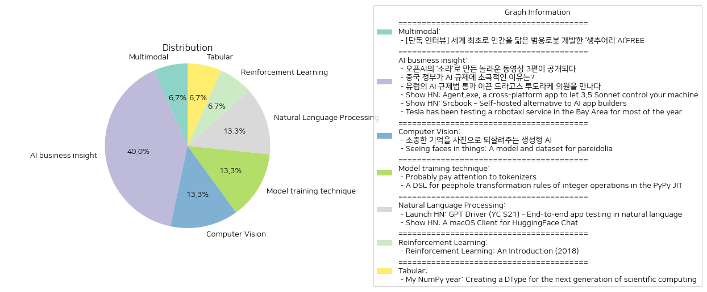

# Daily Artificial Intelligence Insights : News

## 🍊 Multimodal

**요약:**

1. **핵심 주제**:
   대부분의 기사에서 공통적으로 등장하는 주요 주제는 AI와 로봇 기술의 발전, 특히 인간과 유사한 범용 로봇 개발입니다. AI 기술의 일상 적용 가능성과 현실 세계에서의 활용 사례가 강조되고 있습니다.

2. **주요 사건**:
   이번 뉴스에서는 캐나다의 AI 로봇 전문기업인 생추어리 AI(Sanctuary AI)가 미래 로봇 기술에 대해 탐구하고 있으며, 그 일환으로 일상생활 속 복잡하고 변화무쌍한 상황에 유연하게 대응할 수 있는 범용 로봇을 개발 중이라는 이야기가 소개되었습니다. 특히, 조르디 로즈 CEO의 인터뷰를 통해 생추어리 AI의 현재 목표와 연구 방향에 대한 정보를 얻을 수 있습니다.

3. **영향 분석**:
   이러한 AI 및 로봇 기술의 발전은 다양한 분야에 영향을 미칠 것으로 보입니다. 경제적으로는 로봇 자동화의 가속화가 생산성을 향상시키고 새로운 산업과 일자리를 창출할 가능성이 있습니다. 정치적으로는 AI 윤리 및 규제에 대한 논의가 활발해질 수 있으며, 사회적으로는 인간과 로봇의 상호작용이 증가하며 문화적 변화가 예상됩니다. 또한, 새로운 기술의 빠른 도입은 기존 산업에 대한 재교육과 인력 재배치를 요구할 수도 있습니다.

4. **최종 요약**:
   전반적으로 AI와 로봇 기술이 빠르게 발전하고 있으며, 특히 인간과 구별이 어려운 범용 로봇의 출현이 큰 주목을 받고 있습니다. 이러한 발전은 우리의 일상생활과 경제, 사회 구조에 큰 변화를 가져올 수 있으며, 미래에는 더 많은 윤리적, 법적, 사회적 논의가 필요할 것입니다. 앞으로 주목할 점으로는 AI 로봇의 실질적 응용 확대, 규제 체계의 정립, 그리고 인력 교육과 전환 프로그램의 필요성이 있습니다. AI 기술이 사회 전반에 긍정적인 영향을 미치기 위해서는 지속적인 논의와 공동의 노력이 필요합니다.

**출처:**

 - [단독 인터뷰] 세계 최초로 인간을 닮은 범용로봇 개발한 ‘생추어리 AI’FREE (https://www.technologyreview.kr/%ec%9d%b8%ed%84%b0%eb%b7%b0-%ec%83%9d%ec%b6%94%ec%96%b4%eb%a6%ac-ai%ea%b0%80-%ea%b7%b8%eb%a6%ac%eb%8a%94-%eb%af%b8%eb%9e%98%ec%9d%98-%eb%a1%9c%eb%b4%87%ec%9d%80-%ec%8b%a4%ec%b2%b4%ed%99%94/)

## 🩵 AI business insight

**요약:**

1. **주요 주제**:
    - **인공지능(AI) 발전과 규제**: 여러 기사에서 AI 모델과 관련 기술, 규제에 대한 대응이 주로 다루어짐. 특히, AI 기술의 혁신과 이를 둘러싼 규제 및 산업적 영향이 부각되고 있음.
    - **AI 애플리케이션 및 플랫폼 발전**: AI를 활용한 새로운 애플리케이션과 플랫폼의 발전이 다수 기사에서 소개됨. AI를 통한 자율주행 및 앱 개발 플랫폼의 혁신이 주목받고 있음.
    - **자율주행차**: 자율주행차 서비스 구축과 테스트, 특히 테슬라의 로보택시 서비스 시범 운영이 주요 이슈로 나타남.

2. **주요 사건 요약**:
    - **오픈AI의 ‘소라’로 제작된 영상 공개**: 오픈AI가 새로운 동영상 생성 모델인 소라를 이용해 제작된 3편의 영상을 공개, 크리에이터들의 제작 의도와 기법이 주목받음.
    - **중국의 AI 규제 입장**: 중국 정부가 자국 AI 산업의 성장을 위해 의도적으로 느슨한 규제를 택하고 있음.
    - **유럽의 AI 규제법 통과**: 드라고스 투도라케 의원이 추진해 유럽에서 역사적인 AI 규제법이 통과되었음.
    - **Agent.exe 소개**: AI 모델 클로드를 사용하는 크로스 플랫폼 컴퓨터 제어 앱이 발표됨.
    - **Srcbook 플랫폼**: AI 앱 개발을 위한 오픈소스 플랫폼 Srcbook의 출시.
    - **테슬라의 로보택시 서비스 테스트**: 캘리포니아 및 텍사스에서 로보택시 서비스 확대 계획, 규제 승인 대기.

3. **영향 분석**:
    - **경제 및 산업**: AI 기술의 발전은 다양한 산업에 혁신을 가져올 것으로 예상됨. 특히, AI 모델과 플랫폼이 앱 및 소프트웨어 개발에 미치는 영향이 클 것으로 보임.
    - **정치 및 규제**: AI 규제를 둘러싼 세계 각국의 정책이 산업 및 기술 발전에 중요한 영향을 미치고 있음. 유럽과 중국의 상반된 규제 태도가 주목됨.
    - **사회적 영향**: AI 기술의 발전은 일상 생활에 큰 변화를 가져올 수 있음. 특히, 자율주행차 서비스는 교통 패턴 및 도시 계획에 영향을 미칠 수 있음.

4. **최종 요약**:
    최근 발표된 뉴스에서 볼 수 있듯이, AI 기술의 급속한 발전은 산업 전반에 걸쳐 혁신을 불러일으키고 있으며, 이에 대한 규제의 필요성도 대두되고 있음. 유럽의 적극적인 규제 태도와 중국의 완화된 규제 정책은 AI 산업에 상이한 발전 경로를 제공할 것으로 기대됨. 또한, AI를 활용한 애플리케이션의 증가와 자율주행차 서비스의 확대가 사회적 변화를 가속화하고 있음. 이와 같은 변화는 장기적으로 경제 및 사회에 큰 영향을 미칠 것으로 보이며, 향후 규제 및 기술 발전 추이를 주의 깊게 살펴볼 필요가 있음.

**출처:**

 - 오픈AI의 ‘소라’로 만든 놀라운 동영상 3편이 공개되다 (https://www.technologyreview.kr/%ec%98%81%ec%83%81-%ec%83%9d%ec%84%b1-%eb%aa%a8%eb%8d%b8-%ec%86%8c%eb%9d%bc%eb%a1%9c-%eb%a7%8c%eb%93%a0-%eb%86%80%eb%9d%bc%ec%9a%b4-%ec%98%81%ed%99%94-3%ed%8e%b8%ec%9d%b4-%ea%b3%b5%ea%b0%9c%eb%90%98/)
 - 중국 정부가 AI 규제에 소극적인 이유는? (https://www.technologyreview.kr/%ec%a4%91%ea%b5%ad-%ec%a0%95%eb%b6%80%ea%b0%80-%ed%98%84%ec%9e%ac%eb%a1%9c%ec%84%9c%eb%8a%94-ai-%eb%b6%84%ec%95%bc%eb%a5%bc-%ea%b0%80%ed%98%b9%ed%95%98%ea%b2%8c-%ea%b7%9c%ec%a0%9c%ed%95%98%ec%a7%80/)
 - 유럽의 AI 규제법 통과 이끈 드라고스 투도라케 의원을 만나다 (https://www.technologyreview.kr/ai-%ea%b7%9c%ec%a0%9c%eb%b2%95-%ed%86%b5%ea%b3%bc-%ec%9d%b4%eb%81%88-%eb%93%9c%eb%9d%bc%ea%b3%a0%ec%8a%a4-%ed%88%ac%eb%8f%84%eb%9d%bc%ec%bc%80-%ec%9d%98%ec%9b%90%ec%9d%84-%eb%a7%8c%eb%82%98%eb%8b%a4/)
 - Show HN: Agent.exe, a cross-platform app to let 3.5 Sonnet control your machine (https://github.com/corbt/agent.exe)
 - Show HN: Srcbook – Self-hosted alternative to AI app builders (https://github.com/srcbookdev/srcbook/blob/main/README.md)
 - Tesla has been testing a robotaxi service in the Bay Area for most of the year (https://www.theverge.com/2024/10/23/24278056/tesla-robotaxi-ride-hailing-test-employees)

## 🪐 Computer Vision

**요약:**

**주요 주제**:
- 첫 번째 기사는 생성형 AI가 기억을 이미지로 변환하는 기술에 관한 내용을 다루고 있으며, 이는 과거의 소중한 추억을 사진으로 복원하는 데 중점을 둡니다.
- 두 번째 기사는 무작위 자극에서 얼굴을 인식하는 '파레이돌리아' 현상에 관한 연구로, 이를 설명하기 위한 통계 모델 개발과 데이터셋 구축에 초점을 맞추고 있습니다.
- 공통적으로 인공지능 관련 기술 발전과 인간 인식에 대한 연구가 주된 주제로 나타납니다.

**주요 사건**:
- '합성 기억' 프로젝트는 전 세계의 여러 가족들에게 카메라에 담기지 않았지만 중요한 과거의 기억을 되살려주는 서비스로, 생성형 AI를 활용하여 과거의 추억을 디지털 이미지로 재현합니다.
- 파레이돌리아 연구는 인간과 기계 얼굴 인식 간의 차이를 조사하여, 이를 설명할 수 있는 통계 모델과 5,000개의 이미지 데이터셋을 기반으로 한 실험을 진행했습니다.

**영향 분석**:
- **사회적 영향**: '합성 기억' 프로젝트는 개인과 가족의 정서적 안정을 도모하고, 잃어버린 추억에 대한 접근성을 높임으로써 사회적 의미를 부각합니다.
- **기술 및 과학적 영향**: 파레이돌리아 연구는 인간 인지 능력과 AI의 한계를 이해하는 데 도움이 되며, 향후 더 정교한 얼굴 인식 기술 개발에 기여할 수 있습니다.

**최종 요약**:
- 최근 인공지능 기술은 우리 삶의 여러 측면에 큰 변화를 가져오고 있습니다. 생성형 AI를 이용한 '합성 기억' 프로젝트는 잃어버린 추억을 상기시킬 수 있는 방법을 제공하였고, 파레이돌리아 연구는 인간과 AI 인식의 차이를 보다 깊이 이해할 수 있게 합니다. 이러한 기술은 사회적, 과학적으로 유익하며, 향후 더 많은 분야에 걸쳐 인공지능의 활용 가능성을 제고할 것입니다. 앞으로 추가적인 기술 발전과 함께 각 분야에서의 인공지능 적용이 확대될 가능성이 높습니다.

**출처:**

 - 소중한 기억을 사진으로 되살려주는 생성형 AI (https://www.technologyreview.kr/%ec%83%9d%ec%84%b1%ed%98%95-ai%eb%a1%9c-%ea%b0%80%ec%9e%a5-%ec%86%8c%ec%a4%91%ed%95%9c-%ea%b8%b0%ec%96%b5%ec%9d%84-%ec%82%ac%ec%a7%84%ec%9c%bc%eb%a1%9c-%eb%a7%8c%eb%93%a0%eb%8b%a4/)
 - Seeing faces in things: A model and dataset for pareidolia (https://mhamilton.net/facesinthings)

## 🎠 Model training technique

**요약:**

1. **주요 주제**:
   - 두 기사 모두 기술 발전과 관련된 주제를 다루고 있습니다. 
   - 첫 번째 기사는 인공지능 애플리케이션의 성능을 좌우할 수 있는 중요한 요소인 토크나이저(tokenizer)의 중요성을 강조하고 있습니다.
   - 두 번째 기사는 PyPy JIT 컴파일러의 정수 연산 최적화를 위한 도메인 특정 언어(DSL)의 도입을 다루고 있습니다.

2. **주요 사건**:
   - 첫 번째 기사에서는 친구의 AI 앱에서 RAG(Random Association Generation) 기법을 사용하는 동안 토크나이저의 품질이 결과에 결정적 영향을 미칠 수 있다는 점을 지적하고, 이를 개선하는 방법을 모색해야 한다고 제안합니다.
   - 두 번째 기사에서는 PyPy JIT 컴파일러에서 정수 연산을 최적화하기 위해 새로운 DSL이 구현되었고, Z3를 사용해 이러한 최적화가 올바르게 작동함을 입증한 후, PyPy의 메인 브랜치에 병합되었음을 설명합니다.

3. **영향 분석**:
   - **경제적 영향**: 기술 최적화 및 개선은 AI 기술 활용을 통한 더 나은 생산성을 기대할 수 있으며, 이는 장기적으로 경제 성장에 긍정적인 영향을 미칠 수 있습니다.
   - **기술적 영향**: 토크나이저와 JIT 컴파일러가 개선되면 소프트웨어 개발 효율성이 증가하고, 더 나은 성능의 애플리케이션을 구축하는 것이 가능해질 것입니다.

4. **최종 요약**:
   이번 뉴스들은 인공지능 및 컴파일러 기술의 발전이 어떻게 이루어지고 있는지를 보여줍니다. 특히, 토크나이저와 같은 세부적인 요소의 중요성을 강조하며, 이런 작은 부분의 개선이 전체 시스템의 성능을 크게 향상시킬 수 있음을 시사합니다. 이것은 더 나은 알고리즘과 최적화 도구의 지속적인 개발이 미래의 소프트웨어와 AI 개발에 중대한 영향을 미칠 수 있음을 제시합니다. 향후, 이러한 기술들이 실제 산업에 어떻게 적용되고, 그로 인한 효과가 어떻게 나타나는지를 주의 깊게 관찰하는 것이 중요합니다.

**출처:**

 - Probably pay attention to tokenizers (https://cybernetist.com/2024/10/21/you-should-probably-pay-attention-to-tokenizers/)
 - A DSL for peephole transformation rules of integer operations in the PyPy JIT (https://pypy.org/posts/2024/10/jit-peephole-dsl.html)

## 🫧 Natural Language Processing

**요약:**

1. **주요 테마**:
   이번 뉴스 기사들에서 공통적으로 나타나는 주요 테마는 인공지능(AI) 기술의 발전과 이를 활용한 새로운 애플리케이션 개발입니다. 두 기사 모두 AI 기반의 솔루션 및 애플리케이션을 다루고 있어 기술 혁신과 사용자 경험의 개선이 주된 관심사로 나타납니다.

2. **주요 이벤트**:
   - `GPT Driver`: 크리스와 크리스는 MobileBoost를 통해 모바일 앱을 위한 AI 네이티브 엔드 투 엔드(E2E) 테스트 솔루션인 GPT Driver를 개발하고 있습니다. 이 솔루션은 비주얼 기반 접근 방식 및 대형 언어 모델(LLM)의 추론 기능을 사용하여 테스트의 불안정성을 줄이고 유지보수 노력을 절감할 수 있도록 합니다.
   - `HuggingChat macOS`: HuggingFace Chat의 macOS 클라이언트가 새롭게 출시되었습니다. 이 클라이언트는 macOS 사용자에게 고급 AI 기능을 제공하며 응용 프로그램 폴더에서 실행하거나 단축키(⌘ + Shift + Return)를 통해 빠르게 접근할 수 있습니다.

3. **영향 분석**:
   - **경제**: AI 기반 솔루션의 발전은 기술 산업에 새로운 기회를 제공하고, 업무 효율성을 높여 인건비 절감을 촉진할 수 있습니다. 따라서 관련 분야의 경제적 성장이 기대됩니다.
   - **사회**: AI 기술의 증가는 사용자 경험을 개선하고, 더욱 직관적이고 접근하기 쉬운 기술 도구를 제공하여 개인 사용자 및 기업 모두에게 긍정적인 영향을 미칠 수 있습니다.

4. **최종 요약**:
   본래 AI 기술의 발전은 다양한 전문 분야에서 혁신적인 해결책을 제공하며, 특히 모바일 및 소프트웨어 개발 분야에서 유용하게 활용되고 있습니다. GPT Driver는 테스트 프로세스를 효율화하고 안정성을 높이는 솔루션으로 전망되고 있으며, HuggingChat macOS는 사용자에게 편리함과 고급 기능을 늘려주는 요소로 자리 잡을 것입니다. 앞으로 이러한 기술의 발전이 가져올 더 많은 변화와 혁신을 주목할 필요가 있습니다.

**출처:**

 - Launch HN: GPT Driver (YC S21) – End-to-end app testing in natural language (https://news.ycombinator.com/item?id=41924787)
 - Show HN: A macOS Client for HuggingFace Chat (https://github.com/huggingface/chat-macOS)

## 🥳 Reinforcement Learning

**요약:**

**요약 보고서**

1. **주요 주제**:
   뉴스 기사 전반에서 나타나는 주요 주제는 '강화 학습'입니다. 특히, 독자들이 'Reinforcement Learning: An Introduction (2018)' 책에 관한 수정 사항 및 노트를 찾고자 하며, 아마존에서 제공하는 PDF 형식의 자료와 코드 솔루션을 구하고자 한다는 점이 두드러집니다.

2. **주요 사건**:
   이 기사에서는 특정 책 'Reinforcement Learning: An Introduction (2018)'에 대한 독자의 관심이 집중되어 있습니다. 독자들은 이 책의 보충 자료로써 수정 및 노트, 그리고 완전한 형태의 PDF, 그리고 코드 솔루션을 필요로 하고 있습니다. 이러한 요구는 이 책이 강화 학습 분야에서 중요한 자료라는 것을 시사합니다.

3. **영향 분석**:
   이러한 사건은 학계 및 연구 커뮤니티에 중요한 영향을 미칠 수 있습니다. 강화 학습은 인공지능 및 데이터 분석 분야에서 중요한 역할을 하고 있으며, 이에 대한 체계적인 이해 및 실습 자료에 대한 수요는 꾸준히 증가하고 있습니다. 이러한 요구는 이 분야의 교육 및 연구를 촉진하고, 관련된 산업 분야의 발전에도 긍정적인 영향을 미칠 것입니다.

4. **최종 요약**:
   종합적으로 볼 때, 'Reinforcement Learning: An Introduction (2018)'에 대한 독자의 보충 자료 요구는 기술과 학문 분야에서 강화 학습의 중요성을 확인시켜 줍니다. 앞으로도 이러한 자료에 대한 접근성과 품질 개선을 통해 학계, 교육계, 산업 분야의 발전을 지속적으로 모니터링할 필요가 있습니다. 특히, 온라인 플랫폼을 통한 자료의 보급은 디지털 교육의 중요한 요소로 작용할 것으로 기대됩니다.

**출처:**

 - Reinforcement Learning: An Introduction (2018) (http://incompleteideas.net/book/the-book-2nd.html)

## 🚀 Tabular

**요약:**

1. **주요 주제**:
   - "My NumPy year" 기사는 과학적 컴퓨팅의 차세대 기술 발전을 주제로 다루고 있음.
   - 주요 트렌드는 NumPy 2.0의 새로운 문자열 DType 도입 및 교체 작업이며, 이는 기술적인 발전과 함께 개발자 경험 및 문제 해결 방안을 공유하는 것에 중점을 둠.
   - 이와 함께, 소프트웨어의 효율성 및 기능 개선에 대한 지속적인 노력이 강조됨.

2. **주요 사건**:
   - NumPy 2.0에서 UTF-8 인코딩 가변 폭 문자열을 지원하는 새로운 문자열 DType이 도입됨.
   - 문자열 DType은 결측 데이터 처리를 직접적으로 처리하며, 짧은 문자열 최적화 및 메모리 할당기를 포함한 개선사항을 소개함.
   - 사용자 경험을 바탕으로 유지 보수가 어떻게 이루어질 수 있는지에 대한 인사이트가 제공됨.

3. **영향 분석**:
   - **경제**: 과학적 컴퓨팅의 효율성이 향상됨으로써 데이터 처리 속도가 빨라지고, 이로 인해 대규모 데이터 분석에 있어 시간과 비용 절감 효과가 기대됨.
   - **사회**: 새로운 기술 도입으로 인한 개발자 커뮤니티의 활성화, 기술 공유 및 협업이 증대됨.
   - **정치/규제**: 데이터 관리 관련 규제가 더욱 중요해질 가능성이 있으며, 기술 발전에 맞추어 규제 조정 필요성이 대두됨.

4. **최종 요약**:
   - NumPy 2.0의 새로운 문자열 DType 도입은 과학적 컴퓨팅을 진화시키는 주요 기술 발전이며, 이는 데이터 처리 및 분석의 효율성을 크게 향상시킬 것으로 기대됨.
   - 이 기술의 도입은 기술 커뮤니티에 긍정적인 영향을 미치고 있으며, 향후 더 많은 협업과 발전이 있을 것으로 예상됨. 또한, 데이터 관리 및 규제에 대한 논의도 활성화될 가능성이 있음.
   - 향후 개발자 커뮤니티 내에서의 반응 및 이 기술의 실질적 응용에 주목할 필요가 있음.

**출처:**

 - My NumPy year: Creating a DType for the next generation of scientific computing (https://quansight.com/post/my-numpy-year-creating-a-dtype-for-the-next-generation-of-scientific-computing/)

