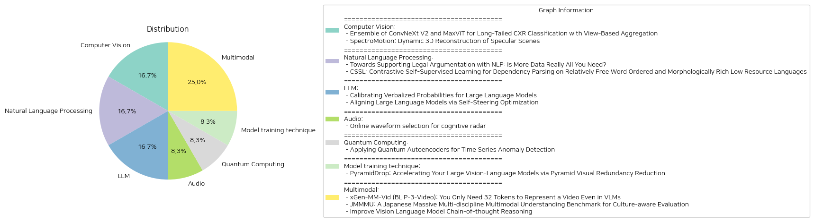

# Daily Artificial Intelligence Insights : Papers

## 🪸 Computer Vision

**요약:**

요약 보고서:

1. 주요 주제 및 테마 추출:
   - 첫 번째 논문은 빈도 불균형(lont-tailed distribution)을 해결하기 위한 흉부 X선 이미지 분류(CXR) 기술에 관한 연구로, ConvNeXt V2와 MaxViT 모델을 사용하여 향상된 결과를 얻었습니다. 
   - 두 번째 논문은 광택이 있는 동적인 장면을 3D로 재구성하기 위한 새로운 접근 방식인 SpectroMotion에 초점을 두고 있습니다. 이 방법은 3D Gaussian Splatting(3DGS)와 물리 기반 렌더링을 조합하여 복잡한 반사면을 실감 나게 재현합니다.

2. 공통 키워드, 트렌드 및 패턴:
   - 두 논문 모두 최신 기계 학습 모델과 향상된 데이터 처리 기술을 사용하여 기존 기술의 한계를 극복하려고 한다는 점이 공통적으로 드러납니다.
   - 높은 정확도의 이미지 분류 및 렌더링을 위한 데이터 처리 및 모델의 효율적인 사용이 중심입니다.

3. 주요 사건 및 주요 정보 요약:
   - 흉부 X선 이미지 분류 논문에서는 외부 데이터셋에 미리 학습된 모델인 ConvNeXt V2와 MaxViT의 앙상블을 활용하여 의료 이미지의 불균형 문제를 해결하며, 결과적으로 높은 정확도를 달성했습니다.
   - 동적 반사 장면 재구성 논문에서는 새로운 3DGS 모델을 통해 복잡하고 동적인 반사 장면을 높은 품질로 재구성함으로써 기존 방법들을 능가하는 성과를 입증했습니다.

4. 이러한 사건이 다양한 부문에 미치는 영향 분석:
   - 첫 번째 연구는 의료 영상 분석의 정확성을 높이는 데 기여하며, 결과적으로 의료진의 정확한 진단을 도울 수 있습니다.
   - 두 번째 연구는 현실적인 시각 경험을 제공함으로써 영화, 게임 및 가상 현실 산업에 혁신적인 발전을 가져올 수 있는 가능성을 열어줍니다.

5. 결론 및 향후 주목할 발전:
   - 두 논문 모두 특정 분야에서의 문제 해결을 위한 모델 및 기법의 효율성을 입증하였으며, 향후 이러한 기술들은 다양한 실세계 응용 분야로 확장될 가능성이 있습니다.
   - 특히, 인공지능 및 머신러닝 분야에서의 고급 이미지 처리 및 재구성 기법은 점점 더 다양한 데이터셋과 응용 분야에서 기회를 창출할 것입니다. 추가로, 계속해서 발전하는 모델과 알고리즘이 이끌 새로운 연구 및 기술 발전에 주목할 필요가 있습니다.

**출처:**

 - Ensemble of ConvNeXt V2 and MaxViT for Long-Tailed CXR Classification with View-Based Aggregation (https://deeplearn.org/arxiv/536961/ensemble-of-convnext-v2-and-maxvit-for-long-tailed-cxr-classification-with-view-based-aggregation)
 - SpectroMotion: Dynamic 3D Reconstruction of Specular Scenes (http://arxiv.org/abs/2410.17249v1)

## 🥳 Natural Language Processing

**요약:**

### 요약 보고서

1. **주요 주제 및 테마 추출**:
   - 첫 번째 논문에서는 법률 추론 및 논증을 도울 수 있는 자연어 처리(NLP)의 역할을 탐구하며, 확장성과 설명 가능성을 동시에 충족시키기 위한 전통적인 상징적 접근법과 데이터 중심 접근법의 통합 가능성을 논의합니다.
   - 두 번째 논문에서는 형태적으로 풍부하고 단어 순서가 비교적 자유로운 저자원 언어에서의 종속 구문 분석의 성능 향상을 목표로 한 대조적 자기 지도 학습 방법을 제안합니다.

2. **공통 키워드, 트렌드 및 패턴 식별**:
   - 두 논문 모두 '데이터' 및 '학습'을 중심으로 하여, 더 나은 이해와 결과를 위해 전통적 방법과 현대적 방법의 균형을 추구하는 경향을 보입니다.
   - 또한 두 논문 모두 다양한 언어적 특성 및 구문 변동성을 처리하기 위한 기법을 강조하고 있습니다.

3. **주요 이벤트 및 중요한 정보 요약**:
   - 첫 번째 논문은 현대 법률 NLP가 법적 결론의 분류에 집중하면서 설명 가능성에서 부족한 점을 보완하기 위해, 전통적인 AI 및 법률 상징 작업과 최신 기술을 결합하려는 시도를 하고 있습니다.
   - 두 번째 논문은 형태적으로 풍부한 언어의 자유로운 단어 순서에 강인한 구문 분석 모델을 개발하여 기존의 성능을 능가하는 점수를 획득한 것을 보고하고 있습니다.

4. **이벤트의 다양한 부문에 미치는 영향 분석**:
   - 법률 분야의 경우, 법적 추론 및 논증 지원을 강화하면 법적 결정을 내리는 데 있어 더 큰 신뢰성과 효율성을 제공합니다.
   - 형태적으로 풍부한 언어를 처리하는 구문 분석 모델의 개선은 다국어 시스템에서 더 나은 언어 처리를 가능하게 하여, 글로벌 언어 처리 응용 프로그램의 가치와 범위를 확장할 수 있습니다.

5. **최종 통합 요약, 결론 및 잠재적 미래 개발**:
   - 두 논문 모두 설명 가능성과 확장성을 동시에 달성하는 것을 목표로 하며, 이는 AI 및 법률, 데이터 중심 구문 분석 등 다양한 분야에 걸쳐 중요한 동향으로 자리잡고 있습니다. 
   - 향후 개발로는 형식적 언어 특성에 대한 보다 깊이 있는 이해와 데이터 중심 접근법과의 균형을 통한 언어 모델의 발전이 기대됩니다. 데이터의 양뿐만 아니라 데이터의 질 역시 지속적인 연구의 초점이 되어야 할 것입니다.

**출처:**

 - Towards Supporting Legal Argumentation with NLP: Is More Data Really All You Need? (https://deeplearn.org/arxiv/537100/towards-supporting-legal-argumentation-with-nlp:-is-more-data-really-all-you-need?)
 - CSSL: Contrastive Self-Supervised Learning for Dependency Parsing on Relatively Free Word Ordered and Morphologically Rich Low Resource Languages (https://deeplearn.org/arxiv/534508/cssl:-contrastive-self-supervised-learning-for-dependency-parsing-on-relatively-free-word-ordered-and-morphologically-rich-low-resource-languages)

## 🪄 LLM

**요약:**

### 논문 요약 보고서

1. **주요 주제 및 테마**

   - 첫 번째 논문은 "대규모 언어 모델(LLMs)의 언어화된 확률 보정"에 대한 연구로, LLMs의 출력에 대한 신뢰성을 향상시키기 위한 접근법을 제시합니다. Platt scaling이나 temperature scaling 기술을 사용하여 확률 분포를 보정하는 방법을 탐구합니다.
   - 두 번째 논문은 "자기조정 최적화를 통한 대규모 언어 모델의 정렬"에 중점을 두며, 최소한의 인간 개입으로 자동 정렬 시스템을 개발하여 선호 신호를 생성하는 방법을 제안합니다.

2. **공통 키워드, 트렌드 및 패턴**

   - 두 논문 모두 대규모 언어 모델의 출력을 향상시키는 방법론에 초점을 두고 있습니다.
   - "보정", "정렬", "확률 분포", "선호 신호" 등이 중요한 키워드로 나타나고 있으며, 기계 학습의 정확성을 높이기 위한 방법론적 향상이 트렌드로 보입니다.

3. **주요 사건 및 중요 정보**

   - 첫 번째 논문은 LLMs가 범주적 라벨에 대한 확률 분포를 생성하는 능력을 이론적 및 실증적으로 확인하고, 언어화된 확률을 반전시키기 위한 'invert softmax trick'을 제안하여 로짓을 추정하는 것이 보정 후 조절에 도움이 됨을 입증합니다.
   - 두 번째 논문에서는 Self-Steering Optimization(SSO)이라는 알고리즘을 도입하여 인간 주석 없이 높은 품질의 선호 신호를 자동 생성하고, 여러 기준에서의 성능 개선을 입증했습니다.

4. **이벤트의 영향 분석**

   - 대규모 언어 모델의 신뢰성과 정확성을 높이는 이러한 방법들은 자연어 처리(NLP) 및 머신러닝 분야의 다양한 애플리케이션에 긍정적 영향을 미칠 것입니다.
   - 특히, 자동 정렬 시스템의 발전은 인공지능(AI) 모델의 효율적인 학습 및 적용을 촉진할 수 있으며, 이는 정책 모델 및 보상 모델의 개선으로 이어질 수 있습니다.

5. **최종 요약 및 결론**

   - 두 연구 모두 대규모 언어 모델의 출력을 보다 정확하고 신뢰성 있게 만들기 위한 기술적 진전을 보여줍니다.
   - 이러한 연구는 미래의 NLP 모델 개발 및 적용에 중요한 기여를 할 것이며, 향후 자동화된 학습 및 신호 생성 알고리즘의 발전 가능성을 시사합니다.
   - 앞으로의 개발에서 머신러닝 시스템의 보정 및 정렬 기술은 더 많은 자동화를 통해 더욱 혁신적이고 효율적인 AI 솔루션을 제공할 수 있게 될 것입니다.

**출처:**

 - Calibrating Verbalized Probabilities for Large Language Models (https://deeplearn.org/arxiv/534643/calibrating-verbalized-probabilities-for-large-language-models)
 - Aligning Large Language Models via Self-Steering Optimization (http://arxiv.org/abs/2410.17131v1)

## 🪐 Audio

**요약:**

제목: '인지 레이더를 위한 온라인 파형 선택'

1. 주요 주제와 테마:
   - 인지 레이더 시스템 설계
   - 파형 파라미터의 온라인 적응 선택
   - 탄도 미사일 추적

2. 공통 키워드, 트렌드, 패턴:
   - 인지 레이더
   - 강화 학습 알고리즘
   - 밴드폭 스케일링, 큐 러닝(Q-learning), 큐 러닝 룩어헤드(Q-learning lookahead)
   - 범위 오류 최소화
   - 지속적 추적 유지

3. 주요 사건 및 중요 정보 요약:
   - 인지 레이더 시스템이 파라미터를 적응적으로 조정하여 탄도 미사일의 전 비행을 추적하는 문제를 다룸
   - 도메인 지식에 기반한 학습 문제를 설계
   - 세 가지 강화 학습 알고리즘 개발: 밴드폭 스케일링, Q-learning, Q-learning lookahead
   - 실험 결과, 제안된 알고리즘이 범위 오류를 최소화하고 대상 추적의 연속성을 유지함을 입증

4. 이러한 사건이 다양한 분야에 미치는 영향 분석:
   - 국방 및 보안 분야에서의 탄도 미사일 추적 효율성 증가
   - 인공지능 및 기계 학습의 항공 및 우주 응용프로그램 확대
   - 인지 레이더의 파라미터 적응이 다른 다양한 레이더 시스템에 적용 가능성

5. 결론 및 미래 개발 방향:
   - 인지 레이더에서의 파형 선택은 방어 시스템의 전략적 이점을 제공할 수 있음
   - 강화 학습 알고리즘의 발전이 레이더 추적 시스템의 효율성에 큰 기여
   - 미래에는 레이더 시스템의 다른 변수들에 대한 적응적 접근이 연구될 가능성 있음

이 요약에서는 인지 레이더와 관련된 주제가 주로 나타나며, 탄도 미사일의 추적을 위한 강화 학습 알고리즘을 중심으로 다루고 있습니다. 이는 국방 및 첨단 기술 분야에서 특히 중요한 발전 가능성을 지니고 있습니다.

**출처:**

 - Online waveform selection for cognitive radar (https://deeplearn.org/arxiv/536265/online-waveform-selection-for-cognitive-radar)

## 🍊 Quantum Computing

**요약:**

1. 주요 주제 및 테마:
   - 양자 오토인코더를 활용한 시계열 데이터 이상 탐지
   - 이상 탐지는 사기 탐지, 패턴 인식, 의료 진단 등 다양한 분야에 적용 가능
   - 기존의 고전 컴퓨팅 접근법 이외에 양자 컴퓨팅을 활용한 연구
   - 양자 오토인코더로 재구성 오차 분석 및 잠재 표현 분석을 통해 이상 탐지를 수행

2. 공통 키워드, 트렌드 및 패턴:
   - 양자 컴퓨팅
   - 오토인코더
   - 이상 탐지
   - 시계열 데이터
   - 고전적 딥러닝 대비 성능 우위

3. 주요 이벤트 및 핵심 정보 요약:
   - 양자 오토인코더는 이상 탐지를 위해 두 가지 기술을 사용: 재구성 오차 분석, 잠재 표현 분석
   - 모의 실험 결과에서 양자 오토인코더는 고전적 딥러닝 기반 오토인코더보다 적은 매개변수와 훈련 반복 횟수를 사용하여 우수한 성능을 발휘
   - 실제 양자 하드웨어 위에 양자 인코더를 구현하여 실험한 결과, 모의실험과 동등한 성능을 달성

4. 이러한 이벤트의 다양한 분야에 대한 영향 분석:
   - 양자 컴퓨팅의 시계열 데이터 이상 탐지에 대한 적용 가능성을 높임
   - 고전적 접근법에 비해 자원 효율성이 뛰어난 솔루션 제공
   - 다양한 산업 분야의 이상 탐지 시스템 최적화 가능성 제고

5. 종합 요약 및 미래 발전 방향:
   이 연구는 양자 오토인코더의 잠재성을 입증하며, 시계열 데이터 이상 탐지 분야에서 양자 컴퓨팅의 활용도를 높이는 데 기여한다. 양자 오토인코더는 고전적 방법보다 효율적으로 작동하며, 이는 제한된 자원을 보유한 시스템에 특히 유리하다. 앞으로 양자 컴퓨팅의 발전과 함께 이 기술은 더 많은 분야에 적용되어 고성능의 데이터 분석 및 이상 탐지 솔루션을 제공할 수 있을 것으로 기대된다. 지속적인 연구와 실험을 통해 현실 세계의 복잡한 문제 해결에 기여할 수 있을 것이다.

**출처:**

 - Applying Quantum Autoencoders for Time Series Anomaly Detection (https://deeplearn.org/arxiv/534533/applying-quantum-autoencoders-for-time-series-anomaly-detection)

## 🪄 Model training technique

**요약:**

**종합 요약 보고서**

1. **핵심 주제 및 테마 추출**
   - 큰 규모의 비전-언어 모델(LVLMs)에서 이미지 토큰의 영향을 줄여 모델의 효율성을 향상시키는 방법론 연구.
   - 'PyramidDrop'이라는 시각적 중복 감소 전략 제안.

2. **공통 키워드, 트렌드 및 패턴 식별**
   - 이미지 토큰의 감소와 관련된 성능 손실 문제.
   - 훈련 및 추론 효율성을 높이는 시각적 중복 감소 전략.
   - 토큰 중복이 모델의 깊은 층에서 증가함에 따라 일부 토큰을 제거하는 피라미드 구조 제안.

3. **주요 사건 및 중요한 정보 요약**
   - 이미지 자체가 대규모 정보의 원천이며, 모델의 입력 토큰 수에 직접적으로 영향을 미쳐 높은 연산 비용 발생.
   - 기존의 이미지 토큰 감소 방법들이 중요한 이미지 정보를 잃게 하여 모델 성능 감소 문제.
   - PyramidDrop은 모델의 각 층에서 사전 정의된 비율로 일부 이미지 토큰을 제거하여 시각적 토큰을 피라미드 형태로 배치.

4. **이벤트가 다양한 부문에 미친 영향 분석**
   - LVLM의 훈련 및 추론 비용 절감에 큰 영향을 미침.
   - 'PyramidDrop'의 사용을 통해 LLaVA-NeXT 모델의 훈련 시간 40% 단축, 추론 FLOPs 55% 가속 성과.
   - 플러그 앤 플레이 방식의 추론 가속화 전략으로 다른 방법들보다 낮은 비용 및 높은 성능 제공.

5. **최종 요약 및 결론, 향후 발전 전망**
   - 시각적 중복 감소로 LVLM의 효율성을 크게 높일 수 있는 가능성을 제시.
   - PyramidDrop의 성공적인 결과가 LVLMs의 이미지 토큰 역할에 대한 추가 연구를 장려할 것으로 기대.
   - 향후 LVLM의 성능 및 효율성 개선 분야에서 PyramidDrop과 유사한 전략들이 활발히 연구될 가능성 크다.

이 보고서는 대규모 비전-언어 모델에서의 효율성을 향상시키기 위한 최첨단 전략을 소개하며, 향후 관련 기술 발전에 기여할 수 있는 방안을 제시한다.

**출처:**

 - PyramidDrop: Accelerating Your Large Vision-Language Models via Pyramid Visual Redundancy Reduction (http://arxiv.org/abs/2410.17247v1)

## 🤩 Multimodal

**요약:**

종합 요약 보고서:

1. 주요 주제 및 테마:
   - xGen-MM-Vid (BLIP-3-Video)는 비디오를 위한 다중 모달 언어 모델로서, 여러 프레임의 시계열 정보를 효율적으로 포착하기 위해 설계되었습니다. '시간적 인코더'를 활용하여 시각적 토큰 수를 크게 줄이는 것이 특징입니다.
   - JMMMU는 일본어 문화적 평가를 위한 거대 다중 모달 이해 벤치마크로, 일본 문화맥락에서 전문가 수준의 과제를 평가하기 위해 설계되었습니다.
   - Vision Language Model의 Chain-of-thought Reasoning(사고 사슬 추론)을 개선하기 위한 연구가 진행되고 있으며, 이는 해석 가능성과 신뢰성을 높이는 데 중요한 역할을 합니다.

2. 공통 키워드, 트렌드 및 패턴:
   - 비디오 및 다중 모달 모델: xGen-MM-Vid에서 보듯이, 다중 모달 모델이 짧고 효율적인 시각적 토큰으로 변환하여 성능을 향상시키는 데 집중하고 있습니다.
   - 문화적 맥락 이해: JMMMU는 일본 문화에 기반한 이해를 높이기 위해 문화적 인식을 강조하고 있습니다.
   - 사고 사슬 추론 강화: CoT 추론을 통한 VLM의 해석 가능성 개선이 강조되고 있습니다.

3. 주요 사건 및 주요 정보 요약:
   - xGen-MM-Vid 모델은 기존 경쟁 모델 대비 적은 수의 시각적 토큰(32 vs. 4608)을 사용하여 비디오 질문-응답 정확도를 유지하면서도 더 작은 크기로 모델 설계를 최적화했습니다.
   - JMMMU는 일본어 LMM 성능을 개선하기 위한 벤치마크로, 문화 비특이성과 문화 특수성 компонент에서 LMM의 성능 차이를 분석했습니다.
   - CoT 추론 개선 연구에서, GPT-4o 모델로부터 이유를 증류하고 VLM을 강화 학습으로 세밀하게 조정하여 성능을 개선했습니다.

4. 이러한 사건들이 여러 분야에 미치는 영향 분석:
   - xGen-MM-Vid의 효율성 증가는 비디오 데이터 처리를 보다 저비용으로 수행할 수 있게 하여, 미디어 및 엔터테인먼트 산업에서 큰 영향을 줄 것입니다.
   - JMMMU의 결과는 일본어에 특화된 LMM 개발을 촉진하며, 교육 및 문화 관련 산업에 유용한 통찰을 제공할 것입니다.
   - CoT 추론 개선은 VLM의 신뢰성을 높이며, 기술 및 의사결정 분야에서 보다 효과적인 AI 응용 프로그램 개발을 가능하게 합니다.

5. 결론 및 향후 발전 사항:
   - 이러한 연구들은 비디오 및 다중 모달 AI 모델의 효율성과 문화적 이해의 필요성을 강조하며, 향후 멀티모달 및 다언어 LLM 개발에 중요한 기준점을 제공합니다.
   - 특히, 비디오, 문화, 논리 추론 등에서 효율성을 높이는 방향으로 기술 개선이 이루어질 것으로 기대되며, 이는 다양한 산업계에 광범위한 적용이 가능할 것입니다.

**출처:**

 - xGen-MM-Vid (BLIP-3-Video): You Only Need 32 Tokens to Represent a Video Even in VLMs (http://arxiv.org/abs/2410.16267v1)
 - JMMMU: A Japanese Massive Multi-discipline Multimodal Understanding Benchmark for Culture-aware Evaluation (http://arxiv.org/abs/2410.17250v1)
 - Improve Vision Language Model Chain-of-thought Reasoning (http://arxiv.org/abs/2410.16198v1)

