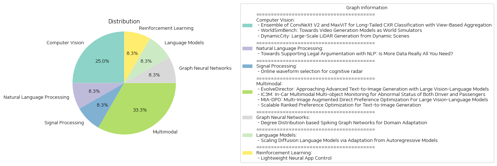

# Daily Artificial Intelligence Insights : Papers

## 🩵 Computer Vision

**요약:**

**종합 요약 보고서**

1. **키 주제와 테마 추출:**
   - 첫 번째 논문은 "긴 꼬리 CXR 분류를 위한 ConvNeXt V2와 MaxViT의 앙상블"로, 긴 꼬리 분포의 흉부 사진에서의 분류 성능 향상을 목표로 하는 방법론에 관한 것이다.
   - 두 번째 논문 "모델을 통한 세계 시뮬레이터로서의 비디오 발생"은 영상 생성 모델의 실행 가능성을 평가하기 위한 프레임워크 제안을 다룬다.
   - 세 번째 논문 "동적 장면에서의 대규모 LiDAR 생성"은 4D LiDAR 장면 생성을 효율적으로 다루고 있으며, 동적 환경의 시간적 변화를 포착하는 플랫폼 소개에 관한 것이다.

2. **공통 키워드, 트렌드 및 패턴 식별:**
   - 세 논문 모두 최신 기술을 활용하여 모형의 발전 또는 성능 향상을 목표로 하고 있다.
   - '앙상블', '4D', '성능 향상', '동적 환경' 등의 키워드가 공통적으로 등장한다.
   - 새로운 평가 프레임워크와 모델의 제안 및 이를 통한 성능 평가가 주된 트렌드로 나타난다.

3. **각 논문의 주요 사건 및 핵심 정보 요약:**
   - 첫 번째 논문은 ConvNeXt V2와 MaxViT 모델의 앙상블을 통해 긴 꼬리 분포의 흉부 X선 사진을 더 정확히 분류하기 위한 방법론을 제시하며 MICCAI 2024 CXR-LT 챌린지에서 상위 성과를 달성했다.
   - 두 번째 논문은 WorldSimBench라는 평가 프레임워크를 제안하여 비디오 생성 모델이 인간의 인지와 행동적 작업을 얼마나 잘 따라할 수 있는지를 평가한다.
   - 세 번째 논문은 DynamicCity라는 시스템을 통해 대규모 LiDAR 장면을 생성하여 동적 장면에서의 시간적 변화를 효과적으로 포착하고 있으며, 기존의 방법들보다 더 나은 성과를 보여준다.

4. **이벤트의 영향 분석:**
   - 첫 번째 논문은 의료 영상 분석 분야에서 모델의 정확성 향상에 기여하며, 특히 긴 꼬리 분포의 데이터 처리에 새로운 전략을 제시하였다.
   - 두 번째 논문은 AI 연구에서 비디오 생성 모델의 평가 방식을 혁신하여, 향후 몰입형 AI 개발에 중요한 발판이 될 수 있다.
   - 세 번째 논문은 자율 주행 및 로봇 산업에서 LiDAR 데이터를 활용한 더욱 정교한 분석 및 계획 수립에 크게 기여할 잠재성을 지니고 있다.

5. **최종 결론 및 잠재적인 미래 발전 방향:**
   - 첫 번째 논문은 앞으로 더 복잡한 의료 이미지 처리를 위한 앙상블 모델의 사용 확대를 예고한다.
   - 두 번째 논문의 WorldSimBench는 비디오 생성 모델의 평가를 새로운 차원으로 이끌어, 몰입형 인공지능의 발전에 기여할 것이다.
   - 세 번째 논문에 소개된 DynamicCity는 실제 운전 시나리오에서의 시간적 변화를 보다 정밀하게 재현할 수 있는 방법론으로 발전할 가능성이 크다.

이러한 연구들은 각 분야에서의 기술 혁신을 통해 실질적인 성과를 향상시키며, 미래 AI 및 데이터 활용 기술의 발전 방향을 제시하고 있다.

**출처:**

 - Ensemble of ConvNeXt V2 and MaxViT for Long-Tailed CXR Classification with View-Based Aggregation (https://deeplearn.org/arxiv/536961/ensemble-of-convnext-v2-and-maxvit-for-long-tailed-cxr-classification-with-view-based-aggregation)
 - WorldSimBench: Towards Video Generation Models as World Simulators (http://arxiv.org/abs/2410.18072v1)
 - DynamicCity: Large-Scale LiDAR Generation from Dynamic Scenes (http://arxiv.org/abs/2410.18084v1)

## 🌞 Natural Language Processing

**요약:**

종합 보고서: 인공지능과 법률 논증 지원을 위한 자연어 처리

1. 주요 주제 및 테마:
- 법률 추론과 논증을 모델링하기 위한 AI & 법의 중심 역할
- 텍스트에서 법적 결론을 통계적으로 분류하는 현대적 법률 NLP 개발
- 적절한 법적 개념과 결합된 사용 가능한 정당성의 결여
- 전통적인 상징적 접근법과 최신 법률 NLP의 발전
- 전문 지식을 통합하여 확장성과 설명 간의 균형을 맞추려는 시도

2. 공통 키워드, 트렌드 및 패턴:
- 법률 논증과 NLP 모델링
- 데이터 기반 접근 방식의 한계와 상징적 접근의 균형
- 전문가 지식 통합의 중요성

3. 주요 이벤트 및 중요 정보 요약:
- NLP 분야에서 법적 결론을 추론하는 방법의 발전
- 데이터 드리븐 접근 방식의 확장성의 장점과 설명의 부족함을 극복하기 위한 노력
- 전문가 지식을 통합하여 AI가 법적 판단을 지원할 수 있는 방법의 연구

4. 이러한 이벤트가 다양한 분야에 미치는 영향 분석:
- 법률 분야: 보다 효율적인 법적 자료 처리와 분석 가능성 증가
- AI 분야: 지식 통합을 통해 AI 모델의 정당성과 신뢰성에 기여
- NLP 연구: 법적 이해에 기반을 둔 새로운 연구 가능성 열림

5. 최종 종합 요약 및 미래 발전 방향:
이 논문은 법률 논증을 보다 효과적으로 지원하는 자연어 처리 모델의 필요성을 강조하며, 순수 데이터 기반 접근법의 한계를 극복하고자 한다. 데이터 드리븐 접근 방식의 확장성과 전통적 설명 제공의 균형을 맞추기 위해, 전문가 주도의 지식 통합이 주요 키 요소로 지적된다. 향후 연구는 법적 데이터와 전문지식을 활용해 보다 깊이 있는 법률 이해와 논증 지원의 발전이 예상된다. 이는 법률 분야와 AI 연구 모두에 중요한 발전 가능성을 시사한다.

**출처:**

 - Towards Supporting Legal Argumentation with NLP: Is More Data Really All You Need? (https://deeplearn.org/arxiv/537100/towards-supporting-legal-argumentation-with-nlp:-is-more-data-really-all-you-need?)

## 💙 Signal Processing

**요약:**

제목: '인지 레이더를 위한 온라인 파형 선택'

요약: 인지 레이더 시스템 설계는 특히 탄도 미사일이 비행하는 동안 지속적인 추적을 수행하기 위해 그 매개변수를 적응시키는 것이 도전적입니다. 이 연구에서는 온라인 방식으로 파형 매개변수를 선택하는 적응 알고리즘을 제안하는 데 초점을 맞추었습니다. 우리의 혁신은 탄도 궤적의 특성에서 도출된 도메인 지식을 사용하여 학습 문제를 공식화하는 데 있습니다. 우리는 대역폭 조정, Q-학습, Q-학습 전망이라는 세 가지 강화 학습 알고리즘을 제안합니다. 이러한 알고리즘은 수신된 피드백에 따라 각각의 전송에 필요한 대역폭을 동적으로 선택합니다. 합성된 탄도 궤적 실험을 통해 제안된 알고리즘이 목표를 놓치지 않고 범위 오류를 최소화하며 지속적인 추적을 유지하는 이중 목표를 달성함을 입증했습니다.

키 주제 및 테마: 인지 레이더, 적응 알고리즘, 탄도 미사일 추적, 강화 학습, 온라인 파형 선택

공통 키워드, 경향 및 패턴: 적응적 매개변수 조정, 지속적 추적, 학습 알고리즘, reinforcing methodologies

주요 사건 및 중요한 정보 요약: 인지 레이더 시스템의 구축에서 파형 매개변수를 실시간으로 적응시키기 위한 알고리즘 개발이 이루어졌으며, 이는 탄도 미사일의 지속적인 추적 가능성을 향상했습니다. 실험을 통해 두 가지 중요한 목표인 범위 오류 최소화와 지속적 추적 유지가 성공적으로 달성되었음을 확인했습니다.

이벤트들의 영향 분석: 이런 발전은 주로 국방 및 보안 분야에서의 혁신으로 이어질 수 있으며, 탄도 미사일 추적의 효율성을 크게 향상시킬 가능성을 열어줍니다. 이로 인해 실시간 반응성이 더욱 강조되는 각종 레이더 기술 응용 분야의 발전이 기대됩니다.

최종 통합 요약 및 결론: 이 연구는 인지 레이더 시스템에서의 실시간 파형 선택을 위한 새로운 알고리즘의 설계 및 구현을 통해 지속적인 추적을 가능케 하는 방안을 제시합니다. 향후 연구는 더 복잡한 추적 시나리오와 환경에서의 알고리즘 성능 개선 및 실시간 데이터에 대한 적응력 향상에 초점을 맞출 것으로 예상됩니다.

**출처:**

 - Online waveform selection for cognitive radar (https://deeplearn.org/arxiv/536265/online-waveform-selection-for-cognitive-radar)

## ✈️ Multimodal

**요약:**

### 요약 보고서

1. **주요 주제와 테마 추출**

   - EvolveDirector: Public APIs를 사용하여 고급 텍스트-이미지 생성 모델과 경쟁할 수 있는 모델을 훈련하는 방법.
   - IC3M: 차량 내 다중 모달 데이터 기반으로 운전자와 승객의 비정상 상태 감지를 위한 감시 시스템.
   - MIA-DPO: 다중 이미지 시나리오에서 인간의 시각적 선호도를 예측하는 대형 비전-언어 모델의 성능 최적화.
   - Scalable Ranked Preference Optimization: 인간 피드백과 일치하도록 텍스트-이미지 모델을 개선하기 위한 대규모 합성 데이터셋 활용.

2. **공통 키워드, 트렌드, 패턴 식별**

   - 모델 훈련에 있어 대규모 데이터의 필요성과 효율적 데이터 처리법.
   - 인간 피드백 없이 데이터셋을 구축하고 최적화하는 방법.
   - 다중 모달 및 다중 이미지 데이터의 활용과 그에 따른 성능 향상.
   - 기술의 상업적 응용을 제한하는 요소 해결 방법.

3. **주요 사건 및 중요한 정보 요약**

   - EvolveDirector는 고급 텍스트-이미지 생성 모델의 데이터와 상호 작용하여 대규모 데이터셋을 구축하고 훈련을 통해 성능을 향상시킴.
   - IC3M은 데이터 라벨링 부족과 모달리티 누락 문제를 해결하기 위해 적응형 임계값 및 데이터 복원 방법을 도입.
   - MIA-DPO는 다중 이미지 입력의 시각적 선호도 정렬을 개선하여 주목할 만한 성능 향상을 달성.
   - Scalable Ranked Preference Optimization은 합성 데이터셋 및 랭킹 피드백을 통해 텍스트-이미지 모델을 효과적으로 개선.

4. **이벤트가 다양한 분야에 미치는 영향 분석**

   - EvolveDirector는 AI 생성 모델 트레이닝 비용과 효율성을 향상시켜 관련 산업에 긍정적 영향을 미침.
   - IC3M은 안전한 차량 환경 조성 및 고령자 모니터링에 유용한 기술적 이점을 제공함.
   - MIA-DPO는 이미지 기반 추천 시스템 및 테크놀로지적 이해도 향상에 기여할 수 있음.
   - Scalable Ranked Preference Optimization은 텍스트-이미지 생성의 효율성을 높이고 이를 통해 상업적 응용이 증가할 가능성 있음.

5. **결론 및 미래 발전 전망**

   이 연구들은 대규모 데이터를 활용한 AI 모델의 성능 개선 및 실용성 증대에 중점을 두고 있습니다. 특히, 인간 피드백의 의존도를 줄이고 대체 데이터셋을 통한 효율적 트레이닝 방법을 모색하는 점이 눈에 띕니다. 앞으로 이러한 기술들이 고도화되면서 더욱 다양한 응용 분야에서 사용될 것으로 기대되며, 특히 인공지능의 상업적 활용 가능성이 확대될 것입니다. 또한, 이러한 발전이 실제 환경에서의 안전성을 높이고 사용자 경험을 개선하는 방향으로 나아갈 것으로 예상됩니다.

**출처:**

 - EvolveDirector: Approaching Advanced Text-to-Image Generation with Large Vision-Language Models (https://deeplearn.org/arxiv/534833/evolvedirector:-approaching-advanced-text-to-image-generation-with-large-vision-language-models)
 - IC3M: In-Car Multimodal Multi-object Monitoring for Abnormal Status of Both Driver and Passengers (https://deeplearn.org/arxiv/534835/ic3m:-in-car-multimodal-multi-object-monitoring-for-abnormal-status-of-both-driver-and-passengers)
 - MIA-DPO: Multi-Image Augmented Direct Preference Optimization For Large Vision-Language Models (http://arxiv.org/abs/2410.17637v1)
 - Scalable Ranked Preference Optimization for Text-to-Image Generation (http://arxiv.org/abs/2410.18013v1)

## 🪄 Graph Neural Networks

**요약:**

1. 주요 주제 및 테마 추출:
   - 스파이킹 그래프 네트워크(SGN)의 에너지 소비 문제 해결
   - 도메인 적응(domain adaptation) 문제 제안
   - 노드 차수에 따른 개인화된 스파이킹 표현 방식
   - 적대적 특성 분포 정렬
   - 가짜 레이블 증류 기법

2. 공통 키워드, 트렌드, 패턴 식별:
   - 그래프 네트워크
   - 도메인 적응
   - 에너지 소비 절감
   - 개인화된 표현 방식
   - 적대적 학습

3. 주요 사건 및 중요한 정보 요약:
   - SGN은 그래프 분류에서 에너지 소비 문제를 해결하지만, 인-디스트리뷰션 데이터에만 효과적이며 아웃-디스트리뷰션 데이터는 처리하지 못한다는 점을 지적함.
   - 이 논문에서는 SGN의 도메인 적응 문제를 처음으로 제안하며, 새로운 프레임워크(Degree-aware Spiking Graph Domain Adaptation, DeSGDA)를 소개함.
   - DeSGDA는 세 가지 요소로 문제를 해결: 노드 차수 기반의 개인화된 스파이킹 표현, 그래프 특성 분포의 적대적 정렬, 가짜 레이블 증류.
   - 노드 차수를 이용해 스파이크 발생 기준을 결정, 개인화된 방법으로 보다 표현력 있는 정보를 분류에 캡쳐함.
   - 그래프 특성 분포 정렬 모듈은 도메인 판별자에 적대적으로 훈련되어, 비일관적인 분포 상황에서도 높은 성능과 낮은 에너지 소비를 유지함.
   - 두 공간에서 일관된 예측을 도출하여 신뢰성 있는 가짜 레이블을 생성, 미레이블된 데이터를 활용해 그래프 분류 성능을 높임.
   - 벤치마크 데이터 세트에서의 광범위한 실험 결과, 제안된 DeSGDA는 경쟁 기준선을 초과하는 우수성을 입증함.

4. 이러한 사건이 다양한 부문에 미친 영향 분석:
   - 그래프 네트워크 및 머신러닝 분야에서의 에너지 효율성 개선
   - 도메인 적응의 발전을 통해 다양한 데이터 분포에서 더 효과적인 모델 운영 가능
   - 머신러닝 애플리케이션에서 더 개인화된 데이터 처리 방법의 중요성 대두

5. 최종 요약 및 결론, 주목할 만한 향후 발전:
   이 연구는 SGN의 도메인 적응 문제 해결을 위한 새로운 방법론을 제시하며, 그래프 분류의 효과성과 에너지 효율성에서 중요한 발전을 이루었다. 노드 차수에 따라 개인화된 접근 방식을 적용하여 다양한 데이터 상황에서도 우수한 성능을 유지할 수 있도록 도왔으며, 이는 향후 머신러닝 분야에서 더 넓은 범위의 데이터 적응을 위한 중요한 기초가 될 것이다. 에너지 소비를 줄이는 동시에 성능을 극대화할 수 있는 솔루션이 계속해서 주목받을 것이며, 다른 AI 및 데이터를 활용하는 분야에서도 도메인 적응을 위한 다양한 적용 가능성을 엿볼 수 있다.

**출처:**

 - Degree Distribution based Spiking Graph Networks for Domain Adaptation (https://deeplearn.org/arxiv/534834/degree-distribution-based-spiking-graph-networks-for-domain-adaptation)

## 🥳 Language Models

**요약:**

제목: 'Scaling Diffusion Language Models via Adaptation from Autoregressive Models'

1. 주요 주제 및 테마:
   - 확산 언어 모델 (Diffusion Language Models, DLMs)의 발전 가능성과 자가회귀 모델(Autoregressive Models, AR)의 한계 극복
   - DLM과 AR 모델 간의 비교 및 평가
   - 자가회귀 모델을 기반으로 DLM 구축 및 학습 방법 제시

2. 공통 키워드, 트렌드, 패턴:
   - DLM 및 AR 모델
   - 언어 모델링 및 합성 기능
   - 지속적 사전 학습 방법
   - 초대규모 데이터 및 파라미터(127M ~ 7B)

3. 각 논문 요약:
   - 본 연구에서는 기존의 자가회귀 모델을 활용하여 확산 언어 모델을 개발하는 방법을 제안합니다. 자가회귀 모델과 확산 모델의 목표 간의 연관성을 분석하고, 지속적 사전 학습 방식으로 DLM을 학습시키는 방법을 소개합니다. 실험 결과, 제안한 모델은 기존의 DLM보다 우수한 성능을 발휘하며, 자가회귀 모델과의 경쟁적 성능을 보여줍니다.

4. 이러한 사건들의 영향 분석:
   - 자연어 처리 분야에서의 언어 모델링 기술 발전
   - 오픈소스 자가회귀 언어 모델을 활용하여 데이터 및 리소스를 효율적으로 사용할 수 있는 가능성 확대
   - 기술 발전을 통해 다양한 자연어 처리 태스크에서의 모델 성능 개선

5. 결론 및 미래 발전 방향:
   - 본 연구는 자가회귀 모델을 DLM으로 전환함으로써 한계를 극복하고, 새로운 모델링 패러다임을 제시합니다. 지속적으로 진화하는 언어 모델링 분야에서 DLM의 역할이 커질 것으로 예상되며, 앞으로 더 큰 데이터 및 다양한 태스크에 대한 적용을 통해 그 가능성을 검증해야 할 것입니다. 오픈소스 커뮤니티에서 모델의 접근성을 높여 더 많은 연구 및 발전이 이루어질 것으로 기대됩니다.

**출처:**

 - Scaling Diffusion Language Models via Adaptation from Autoregressive Models (http://arxiv.org/abs/2410.17891v1)

## 🌅 Reinforcement Learning

**요약:**

1. 주요 주제 및 테마 추출:
   - 모바일 앱 제어 아키텍처
   - 효율적인 상호작용 및 제어
   - 경량화된 다중 모달 앱 컨트롤 (LiMAC)
   - 텍스트 목표 및 과거 모바일 관찰을 통해 정확한 액션 생성
   - 스마트폰의 연산 제약 해결
   - 액션 트랜스포머 (AcT) 및 비전-언어 모델 (VLM) 통합
   - 실시간 의사 결정 및 작업 실행
   - 성능 평가 및 데이터셋 테스트
   - 높아진 액션 정확도

2. 공통 키워드, 트렌드 및 패턴:
   - 모바일 제어
   - 경량화 및 효율성
   - 다중 모달 입력
   - VLM 통합 및 향상된 정확도
   - 오픈소스 데이터셋 및 모델 비교
   - 실시간 처리

3. 각 논문의 주요 이벤트 및 중요한 정보 정리:
   - LiMAC는 텍스트 목표와 UI 관찰 데이터를 사용하여 다양한 안드로이드 앱 내에서 정확한 제어를 수행하는 경량형 모바일 제어 시스템이다.
   - 액션 트랜스포머(AcT)를 활용하여 실시간의 효율적인 의사 결정과 과제를 수행한다.
   - 오픈소스 모바일 컨트롤 데이터셋에서 LiMAC는 다른 VLM 및 기반 모델 대비 우월한 성능을 보인다.
   - 최고 19% 정확도 향상 및 프롬프트 엔지니어링 대비 42% 성능 개선이 있었다.

4. 이러한 사건의 다양한 분야에 대한 영향 분석:
   - 모바일 앱 제어 분야에서 전반적인 사용자 경험 개선 가능
   - AI 및 스마트폰 기술의 발전에 따른 모바일 상호작용 개발 촉진
   - 경량형 모델의 도입으로 실시간 제어와 효율성 증대
   - VLM 및 텍스트 기반 제어 시스템의 효율적 활용 가능성

5. 최종 종합 요약 및 향후 발전 가능성:
   - LiMAC는 경량형 모바일 제어 시스템으로, 스마트폰의 연산 제약을 극복하며 실시간의 정확한 앱 제어를 가능하게 한다.
   - 향후 모바일 UI 및 AI 통합 시스템 개발에 있어 중요한 역할을 할 것으로 예상되며, 이러한 기술 발전은 사용자 맞춤형 솔루션을 개선하고 새로운 응용 영역을 창출할 가능성을 내포하고 있다.

**출처:**

 - Lightweight Neural App Control (http://arxiv.org/abs/2410.17883v1)

