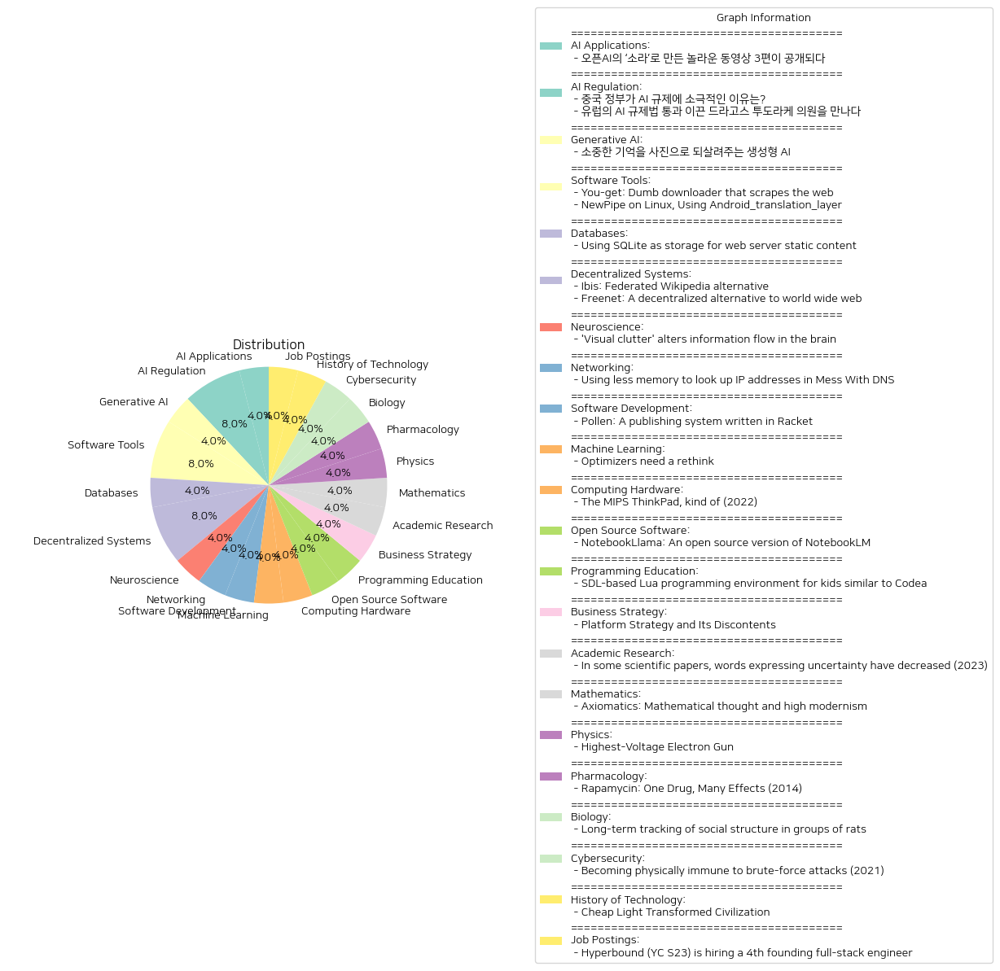

# Daily Artificial Intelligence Insights : News

## 🚀 AI Applications

**요약:**

**요약 보고서**

1. **주요 주제**:
   - 인공지능 혁신: 오픈AI의 '소라'와 같은 새로운 AI 기술 개발이 지속적으로 주목받고 있습니다.
   - 창작과 기술 융합: AI 기술을 활용한 새로운 콘텐츠 제작이 증가하고 있으며, 이는 영상 크리에이터들이 새로운 제작 기법을 도입하는 데 큰 영향을 미치고 있습니다.

2. **주요 사건**:
   - 오픈AI는 '소라'라는 새로운 동영상 생성 모델을 통해 기술 혁신을 선보였습니다. 특히, 이 모델을 활용한 3편의 동영상이 공개되어 큰 화제를 모으고 있습니다.
   - 이 동영상들은 새로운 제작 기법을 시험하는 창작자들의 실험적이고 창의적인 시도가 돋보이며, AI를 활용하여 창작의 범위를 확장한 사례로 평가됩니다.

3. **영향 분석**:
   - 경제적 영향: 새로운 AI 동영상 생성 모델의 등장은 영상 산업 및 관련 기술 분야에 대한 투자와 관심을 증가시킬 가능성이 큽니다. 이는 관련 산업의 성장 촉진과 새로운 비즈니스 모델의 출현을 촉발할 수 있습니다.
   - 사회적 영향: 창작의 자동화되면서, 콘텐츠 소비자의 취향 변화 및 크리에이터들의 일자리 변화 등이 따를 수 있습니다. 기술 발전에 따른 새로운 윤리적, 사회적 논의 필요성이 대두될 것입니다.

4. **최종 요약**:
   - 오픈AI의 '소라' 모델은 AI 기술이 창작 분야에 어떻게 응용될 수 있는지를 실질적으로 보여주는 사례입니다. 이러한 동향은 AI 발전이 지속됨에 따라 콘텐츠 산업의 혁신적인 변화를 이끌 것입니다.
   - 향후 주목해야 할 발전은 AI와 인간의 공동 창작을 통해 콘텐츠 산업이 어떻게 변화할지, 그리고 이러한 기술이 사회적·윤리적 측면에서 어떤 영향을 미칠지에 대한 것입니다. 특히, 윤리적 책임성 및 저작권 문제에 대한 논의가 더욱 활발히 진행될 것으로 보입니다.

**출처:**

 - 오픈AI의 ‘소라’로 만든 놀라운 동영상 3편이 공개되다 (https://www.technologyreview.kr/%ec%98%81%ec%83%81-%ec%83%9d%ec%84%b1-%eb%aa%a8%eb%8d%b8-%ec%86%8c%eb%9d%bc%eb%a1%9c-%eb%a7%8c%eb%93%a0-%eb%86%80%eb%9d%bc%ec%9a%b4-%ec%98%81%ed%99%94-3%ed%8e%b8%ec%9d%b4-%ea%b3%b5%ea%b0%9c%eb%90%98/)

## 🎇 AI Regulation

**요약:**

1. **주요 테마**:
   - AI 규제와 관련한 정부의 태도와 정책
   - 유럽과 중국의 AI 산업의 접근 방식 차이

2. **주요 사건**:
   - 중국 정부는 자국의 AI 산업 성장을 위해 AI 규제에 대해 느슨한 접근을 유지하고 있음.
   - 유럽의회는 드라고스 투도라케 의원의 주도로 AI 규제법을 통과시켰으며, 이는 유럽의 AI 산업 개선을 목표로 하고 있음.

3. **영향 분석**:
   - **경제**: 중국의 느슨한 AI 규제는 자국 AI 기술 및 산업 성장에 긍정적인 영향을 미칠 수 있으며, 글로벌 시장에서 더 큰 경쟁력을 가질 가능성이 있음. 반면 유럽의 규제법은 AI 산업의 책임성을 높이지만 초기에는 산업 성장을 제한할 우려가 있음.
   - **정치**: 두 지역 모두 AI 규제를 통해 기술 발전과 사회적 영향력 사이의 균형을 맞추려고 하며, 이는 국제 정치 무대에서 AI 기술 개발 및 사용에 대한 전반적인 논의를 자극할 수 있음.
   - **사회**: AI 규제 강화 혹은 완화는 각국 시민들의 생활과 개인 정보 보호에 직간접적인 영향을 미칠 수 있어, 사회적 이해와 공감대 형성이 필요함.

4. **최종 요약**:
   - 최근의 뉴스는 중국과 유럽이 AI 규제와 관련하여 서로 다른 접근 방식을 취하고 있음을 보여준다. 중국은 산업적 이익을 우선시하며 규제를 느슨하게 유지하는 반면, 유럽은 책임성과 혁신을 동시에 강조하는 규제를 추진하고 있다. 앞으로의 주요 발전은 이러한 상반된 정책이 실제로 각 지역의 AI 산업에 미치는 장단기적 영향을 보는 것이며, 국제 사회에서 AI 규제를 둘러싼 논의가 계속해서 진행될 가능성이 크다.

**출처:**

 - 중국 정부가 AI 규제에 소극적인 이유는? (https://www.technologyreview.kr/%ec%a4%91%ea%b5%ad-%ec%a0%95%eb%b6%80%ea%b0%80-%ed%98%84%ec%9e%ac%eb%a1%9c%ec%84%9c%eb%8a%94-ai-%eb%b6%84%ec%95%bc%eb%a5%bc-%ea%b0%80%ed%98%b9%ed%95%98%ea%b2%8c-%ea%b7%9c%ec%a0%9c%ed%95%98%ec%a7%80/)
 - 유럽의 AI 규제법 통과 이끈 드라고스 투도라케 의원을 만나다 (https://www.technologyreview.kr/ai-%ea%b7%9c%ec%a0%9c%eb%b2%95-%ed%86%b5%ea%b3%bc-%ec%9d%b4%eb%81%88-%eb%93%9c%eb%9d%bc%ea%b3%a0%ec%8a%a4-%ed%88%ac%eb%8f%84%eb%9d%bc%ec%bc%80-%ec%9d%98%ec%9b%90%ec%9d%84-%eb%a7%8c%eb%82%98%eb%8b%a4/)

## 🌞 Generative AI

**요약:**

1. **주요 테마**:
   - 뉴스 기사에서 다루는 주요 테마는 '생성형 AI'와 '기억의 회복'입니다. 기술의 발전을 통해 개인과 가족이 과거를 회상할 수 있게 하는 프로젝트가 트렌드로 부각되고 있습니다.

2. **주요 사건**:
   - '생성형 AI를 이용해 기억을 이미지로 전환해주는 ‘합성 기억’ 프로젝트'가 추진되고 있다는 소식이 주요 사건으로 나타납니다. 이 프로젝트는 전 세계적으로 다양한 가족들이 과거의 소중한 추억을 시각적으로 되찾을 수 있도록 돕고 있습니다.

3. **영향 분석**:
   - **경제적 영향**: 생성형 AI의 활용은 기술 시장에서의 새로운 비즈니스 모델의 창출을 가능하게 하고, 관련 기술 기업과 스타트업들에게 성장 기회를 제공합니다.
   - **사회적 영향**: 과거의 소중한 경험과 기억을 회복하는 이러한 기술은 개인과 가족 간의 유대감을 강화하고, 정신 건강 향상에 긍정적인 영향을 미칠 수 있습니다.

4. **최종 요약 및 결론**:
   - 생성형 AI 기술을 통해 사람들이 소중한 기억을 회복할 수 있게 도와주는 '합성 기억' 프로젝트는 기술과 인간 경험의 통합을 강조하는 중요한 발전을 나타냅니다. 이는 사회적 유대감을 증진시키고 기술적 진보를 이루는 동시에, 기업들에게 새로운 시장 기회를 제공합니다. 앞으로 이러한 기술의 발전과 그 응용 범위가 어떻게 확대될지 주목할 필요가 있습니다.

**출처:**

 - 소중한 기억을 사진으로 되살려주는 생성형 AI (https://www.technologyreview.kr/%ec%83%9d%ec%84%b1%ed%98%95-ai%eb%a1%9c-%ea%b0%80%ec%9e%a5-%ec%86%8c%ec%a4%91%ed%95%9c-%ea%b8%b0%ec%96%b5%ec%9d%84-%ec%82%ac%ec%a7%84%ec%9c%bc%eb%a1%9c-%eb%a7%8c%eb%93%a0%eb%8b%a4/)

## 🧸 Software Tools

**요약:**

1. **주요 테마**:
   - 웹에서 미디어 다운로드와 관련된 도구 및 소프트웨어 활용
   - 개인정보 보호를 강조한 소프트웨어 활용 및 오픈 소스 소프트웨어(FLOSS)의 중요성

2. **주요 사건 요약**:
   - 'You-get'은 다양한 웹사이트와 형식을 지원하는 명령줄 유틸리티로, 인터넷에서 미디어를 다운로드할 수 있도록 한다. 이는 pip를 통해 설치 가능하다.
   - 'NewPipe'는 유튜브 웹사이트를 분석하여 개인정보를 보호하는 유튜브 프론트엔드로, FLOSS로 개발되었으며, 구글 서비스를 사용하지 않는 기기에서도 사용 가능하다.

3. **영향 분석**:
   - 경제적 측면: 두 도구 모두 FLOSS(자유 및 오픈 소스 소프트웨어)로 개발되어 사용자는 소프트웨어를 무료로 이용할 수 있다. 이는 별도의 경제적 부담 없이 다양한 미디어 콘텐츠를 확보할 수 있는 기회를 제공한다.
   - 사회적 측면: 개인 사용자의 개인정보 보호에 대한 관심이 높아지면서, NewPipe와 같은 도구는 개인 정보 보호를 중시하는 사용자에게 대안적인 솔루션을 제공한다.
   - 기술적 측면: FLOSS의 사용 확대는 기술 커뮤니티와 개발자들에게 협업과 혁신의 기회를 제공하며, 사용자 맞춤형 솔루션을 접할 수 있게 한다.

4. **최종 요약**:
   두 뉴스 기사에서는 웹 기반 미디어 다운로드 및 개인정보 보호와 관련된 도구가 점점 관심을 받고 있음을 보여준다. You-get과 NewPipe는 각각 사용자의 요구에 맞춘 솔루션으로, 특히 FLOSS의 이점을 잘 활용하고 있다. 향후 이러한 도구들은 사용자의 미디어 소비 방식과 개인정보 보호에 대한 인식을 더욱 변화시킬 가능성이 있다. FLOSS의 발전은 기술 산업과 사용자 경험을 보다 다채롭게 만들 것이며, 지속적인 기술적 혁신을 촉진할 것으로 보인다.

**출처:**

 - You-get: Dumb downloader that scrapes the web (https://github.com/soimort/you-get)
 - NewPipe on Linux, Using Android_translation_layer (https://flathub.org/apps/net.newpipe.NewPipe)

## 🌅 Databases

**요약:**

**1. 주요 테마**:
SQLite를 웹 서버의 정적 콘텐츠 저장소로 활용하는 테마가 나타남. Clace라는 오픈 소스 프로젝트는 내부 도구를 개발하고 배포하는 데에 안전한 플랫폼을 제공하며 SQLite를 활용하여 앱 파일 및 메타데이터를 저장, 변화의 아토믹 버전 관리 등을 가능하게 하는 점이 주목할 만함.

**2. 주요 이벤트**:
Clace 프로젝트가 SQLite를 도입하여 내부 도구의 개발 및 배포 과정을 어떻게 개선하고 있는지에 대한 사례를 다룸. 특히, SQLite를 사용함으로써 얻을 수 있는 다양한 이점, 예를 들어, 앱 파일의 안전한 저장 및 버전 관리 강화에 중점을 둠.

**3. 영향 분석**:
기술적 측면에서는 SQLite의 유연성 및 안정성이 강조되며, 오픈 소스 프로젝트에 신뢰성과 보안을 더하는 역할을 함. 정치적으로는 크게 두드러진 영향은 없으나, 오픈 소스 프로젝트의 경우 산업 전반의 혁신을 촉진할 수 있는 기반이 됨. 경제적으로는 내부 도구 및 플랫폼을 보다 경제적으로 운영할 수 있는 가능성이 제시되며, 기업들이 비용을 절감하고 운영 효율성을 높이는 데 기여할 수 있음.

**4. 최종 요약**:
SQLite를 웹 서버의 정적 콘텐츠 저장소로 활용하는 사례는 오픈 소스 프로젝트의 기술적 진보를 보여줌. Clace 프로젝트의 안전한 플랫폼 개발은 이러한 기술을 효과적으로 활용하고 있음을 입증하며, 이러한 트렌드는 앞으로 더 많은 기업들이 내부 도구 개발을 최적화하기 위해 유사한 방식을 채택할 수 있다는 가능성을 제시함. 미래적으로는 SQLite의 활용 범위 확대와 관련 기술의 발전이 예상되며, 이에 따른 오픈 소스 커뮤니티의 활성화와 기업 운영 최적화의 관점에서의 발전을 주시할 필요가 있음.

**출처:**

 - Using SQLite as storage for web server static content (https://clace.io/blog/sqlite/)

## 🪐 Decentralized Systems

**요약:**

**주요 주제**:
최근 뉴스 기사에서 반복적으로 나타나는 주요 주제는 분산형 플랫폼 및 탈중앙화 시스템입니다. 두 뉴스 제목 모두 기존의 중앙화된 인터넷 서비스를 대체하거나 보완하는 대안을 제시하고 있습니다. 이러한 탈중앙화 시스템은 사용자에게 더 많은 보안, 프라이버시, 그리고 통제권을 제공합니다.

**주요 사건**:
1. 'Ibis': 분산형 위키피디아 대안으로 소개되며 구체적인 내용은 불분명하지만, 새로운 지식 공유 플랫폼을 목표로 하는 것으로 추정됩니다.
2. 'Freenet': 기존의 월드 와이드 웹을 대체할 수 있는 탈중앙화 플랫폼으로, 안전하고 프라이버시를 보장하는 서비스를 제공합니다. 이는 메시징, 소셜 미디어, 이메일, 전자상거래 등의 분야에서 상호운용적이고 사용자 중심의 솔루션을 제시합니다.

**영향 분석**:
- 경제 분야에서 이러한 탈중앙화 플랫폼은 새로운 비즈니스 모델을 촉진하고 기존 인터넷 기반 비즈니스에 도전할 가능성이 있습니다.
- 정치적으로는 프라이버시와 데이터 보호 강화에 대한 관심이 증가할 수 있으며, 중앙화된 검열 및 통제에 대한 대응책으로 작용할 수 있습니다.
- 사회적으로는 개인의 프라이버시와 정보 통제에 대한 요구가 증가하고, 디지털 환경에서의 개인 권리 보호가 강화될 것입니다.

**최종 요약**:
이 두 뉴스는 디지털 시대에서 탈중앙화 플랫폼의 중요성이 증가하고 있음을 보여줍니다. Ibis와 Freenet과 같은 대안은 개인의 권리와 프라이버시를 보호하고, 중앙화된 정보 통제에 대한 새로운 해결책을 제공합니다. 미래에는 이러한 분산형 시스템이 더욱 발전하여 경제, 정치, 사회 전반에 걸쳐 상당한 영향을 미칠 가능성이 높습니다. 특히 개인정보 보호 및 보안에 관련된 기술 개발에 대한 관심이 지속적으로 증가할 것으로 보입니다.

**출처:**

 - Ibis: Federated Wikipedia alternative (https://ibis.wiki/article/Announcing_Ibis,_the_federated_Wikipedia_Alternative)
 - Freenet: A decentralized alternative to world wide web (https://freenet.org/)

## ☀️ Neuroscience

**요약:**

1. **주요 테마**:
   여러 뉴스 기사에서 반복되는 주요 테마를 식별하는 것은 중요합니다. 이번 기사에서 두드러지는 테마는 '시각적 혼잡'과 '뇌의 정보 처리'입니다. 이는 뇌 과학 및 신경과학 분야와 관련이 있으며, 특히 시각적 정보가 뇌에서 처리되는 방식을 탐구하는 연구의 중요성을 시사합니다.

2. **주요 사건**:
   해당 기사는 예일대 연구자들이 시각적 혼잡이 뇌의 시각 정보 처리에 미치는 영향을 조사한 내용을 다룹니다. 연구 결과에 따르면, 시각적 혼잡은 정보가 뇌에서 흐르는 방식을 변형시키지만 정보 처리의 순서를 바꾸지는 않으며, 뉴런 간 정보 전달의 효율성에 영향을 미칩니다.

3. **영향 분석**:
   이 연구는 신경과학 분야에서 시각적 정보를 처리하는 뇌의 방식에 대한 새로운 이해를 제공합니다. 이는 교육 분야, 특히 시각적 학습 자료의 디자인 및 배치에 영향을 미칠 수 있으며, 시각적 정보를 통해 뇌의 반응을 최적화하는 방법을 진전시킬 수 있습니다. 또한, 광고 및 마케팅과 같은 시각적 요소가 강한 분야에도 영향을 미쳐, 소비자의 시각적 정보 처리 방식을 기반으로 한 전략 개발에 기여할 수 있습니다.

4. **최종 요약**:
   시각적 혼잡이 뇌의 정보 처리에 미치는 영향을 연구한 결과는 다양한 분야에서의 시각적 정보 활용에 중요한 시사점을 제공합니다. 시각적으로 복잡한 환경이 뇌의 정보 흐름을 어떻게 변화시키는지 이해하는 것은 미래의 시각적 도구 개발과 교육, 마케팅 전략 수립에 있어 중요한 요소가 될 것입니다. 앞으로 추가 연구를 통해 시각적 혼잡이 인지와 행동에 미치는 보다 구체적인 영향을 밝혀내고, 이를 바탕으로 최적의 시각적 환경을 구축하는 방법을 모색해야 할 것입니다.

**출처:**

 - 'Visual clutter' alters information flow in the brain (https://news.yale.edu/2024/10/22/visual-clutter-alters-information-flow-brain)

## ⭐ Networking

**요약:**

1. **주요 주제**:
   이번 뉴스 기사의 주요 주제는 기술 효율성, 메모리 관리, 데이터 저장 솔루션입니다. 특히 제한된 메모리 자원을 효율적으로 활용하는 방법에 대한 논의가 중심이 되고 있습니다.

2. **주요 사건**:
   특정 사용자가 'Mess With DNS' 서비스를 사용하다가 메모리 부족 문제에 직면했습니다. 이로 인해 서비스가 메모리 초과(OOM, Out-Of-Memory)로 강제 종료되었습니다. 이러한 문제를 해결하기 위해 사용자는 여러 해결책을 시도했으며, 특히 IP 주소 데이터를 디스크에 저장하기 위해 SQLite를 활용하려 했지만 성능 저하 문제로 성공적이지 않았습니다.

3. **영향 분석**:
   이 사건은 주로 기술 분야에 영향을 미칩니다. 메모리 관리 문제는 IT 서비스의 안정성과 사용자 경험에 직접적인 영향을 미칠 수 있습니다. 효율적인 자원 관리를 통해 서비스 안정성을 높이는 것이 중요하며, 이는 기술 산업의 발전에 긍정적인 영향을 미칠 수 있습니다. 또한, 불충분한 솔루션은 사용자 불만을 초래할 수 있으며, 이는 서비스 제공업체의 평판에도 영향을 줄 수 있습니다.

4. **최종 요약**:
   이번 사건은 기술 서비스에서의 자원 관리 중요성을 강조하며, 효율적인 메모리 사용을 위한 적절한 솔루션 개발의 필요성을 보여줍니다. 성능과 자원 관리의 균형을 맞추는 것이 중요하며, 이러한 문제에 대한 지속적인 연구와 개발이 필요합니다. 향후에는 더 나은 데이터 관리 및 저장 솔루션이 개발될 가능성이 있으며, 이는 사용자 경험과 서비스 안정성을 동시에 향상시킬 수 있을 것입니다. 이를 주시하는 것은 기술 산업에서 중요한 역할을 할 것입니다.

**출처:**

 - Using less memory to look up IP addresses in Mess With DNS (https://jvns.ca/blog/2024/10/27/asn-ip-address-memory/)

## 🚀 Software Development

**요약:**

1. **주요 주제**:
   본 기사에서의 주요 주제는 웹 기반 출판 시스템과 기술 통합입니다. 특히, 웹 기반 책 제작을 위한 자동화와 데이터 통합의 중요성이 강조되며, 프로그래밍 언어인 Racket을 활용한 마크업 기반 언어의 활용이 주요 테마로 등장합니다.

2. **주요 사건**:
   이 기사는 Pollen이라는 출판 시스템 개발에 관한 것으로, 이를 통해 웹기반의 서적을 제작하는 과정에서 자동화 및 데이터 통합 기능을 구현하고자 한 저자의 노력이 중점적으로 다뤄집니다. Racket을 통한 고급 작업이 가능하다는 점이 핵심으로 언급되고 있습니다.

3. **영향 분석**:
   이러한 개발은 출판 업계, 특히 웹 기반 콘텐츠 제작 분야에 적지 않은 영향을 미칠 수 있습니다. 데이터 통합과 자동화 기능을 통해 출판의 효율성을 높이고, 프로그래밍 기술을 접목함으로써 더욱 혁신적인 콘텐츠 제작이 가능할 것으로 보입니다. 이는 출판업뿐만 아니라 교육 및 정보기술(IT) 분야에도 긍정적인 파급 효과를 미칠 수 있습니다.

4. **최종 요약**:
   Pollen의 개발은 웹 기반 출판의 혁신을 가속화할 수 있는 중요한 발전으로 평가됩니다. 저자는 Racket을 활용하여 마크업 기반 언어에 프로그래밍의 유연성을 더하면서, 웹 기반 서적 제작의 효율성을 제고하는 데 중점을 두었습니다. 미래에는 이러한 기술적 진보가 출판업 전체에 널리 채택되어 콘텐츠 제작 방식에 큰 변화를 가져올 가능성이 큽니다. 앞으로 관련 기술이 어떻게 발전해 나가는지를 주시할 필요가 있습니다.

**출처:**

 - Pollen: A publishing system written in Racket (https://docs.racket-lang.org/pollen/)

## ☀️ Machine Learning

**요약:**

**종합 요약 보고서**

1. **주요 주제**:
   전체 뉴스 기사에서 나타난 주요 주제는 최적화기의 재구상이 필요하다는 것입니다. 특히, 컴파일러 및 데이터베이스에서의 최적화기들이 가지는 복잡성과 한계를 개선하기 위한 방향이 중심에 놓여 있습니다. 이러한 문제에는 조건부 중요성, 제한된 테스트 가능성, 그리고 제한된 가시성이 포함됩니다.

2. **주요 사건**:
   기사에서는 최적화기들이 업무 수행 중 겪는 다양한 문제들을 설명합니다. 이런 문제들 중 하나는 최적화 버그를 발견하지 못하거나 성능 문제가 발생할 수 있는 점입니다. 이를 해결하기 위해 최적화기들이 더 나은 문서화, 테스트, 및 디버깅을 지원하는 방향으로 발전할 필요가 있다고 언급합니다.

3. **영향 분석**:
   이러한 발전은 기술 산업, 특히 프로그램 개발 및 데이터베이스 관리 분야에 큰 영향을 미칠 수 있습니다. 최적화기의 개선은 성능 저하를 방지하고 오류를 줄임으로써 전체 시스템의 안정성과 효율성을 향상시킬 것입니다. 이는 결과적으로 산업 전반에 걸쳐 생산성 증가로 이어질 수 있습니다.

4. **최종 요약**:
   뉴스에서 강조한 핵심은 최적화기들이 현대의 복잡한 시스템에서 효율적으로 작동할 수 있도록 변화해야 한다는 것입니다. 문서화, 테스트 및 디버깅 기능의 향상은 이러한 목표를 달성하기 위한 필수 요소로 부각됩니다. 향후 이러한 발전이 어떻게 이뤄질 것인지, 특히 인공지능과 같은 신기술들과의 조화를 통해 어떤 변화를 가져올지 주목할 필요가 있습니다.

**출처:**

 - Optimizers need a rethink (https://typesanitizer.com/blog/rethink-optimizers.html)

## 🩵 Computing Hardware

**요약:**

**요약 보고서**

1. **주요 주제**:
   - MIPS 프로세서를 탑재한 RISC 노트북의 역사적 의미와 기술적 특징.
   - 레거시 시스템과 현대 소프트웨어 및 하드웨어 간의 호환성 문제.

2. **주요 사건**:
   - IBM의 1999년 제품인 WorkPad z50는 ThinkPad를 연상시키는 디자인을 갖추고 있으며, 주요 특성으로는 MIPS 프로세서, 8.2인치 DSTN 디스플레이, 95% 키보드를 포함하고 있음.
   - Windows CE 2.11 운영체제에서 구동되며, Pocket Office 애플리케이션 제품군을 제공하지만 현대의 소프트웨어 및 하드웨어와의 호환성에 제약이 있음.

3. **영향 분석**:
   - **경제적 영향**: MIPS 기반의 구형 시스템은 오늘날의 컴퓨팅 환경에서는 경제적으로 큰 의미가 없으나, 복고풍 컴퓨팅의 추세가 있다면 특정 시장에서 수집품으로 가치를 지닐 수 있음.
   - **정치적 영향**: 기술적으로 큰 변화나 발전이 아닌 역사적 추억으로 여겨지면서 직접적인 정치적 영향은 미미함.
   - **사회적 영향**: 레거시 시스템의 부활은 개발자와 기술 애호가들 사이에서 과거 기술에 대한 향수를 자극하고, 교육적인 자산으로도 활용될 수 있음. 특히 기술 발전사와 구형 시스템의 작동 방식을 이해하는데 도움이 될 수 있음.

4. **최종 요약**:
   - IBM WorkPad z50는 1999년에 MIPS 프로세서를 기반으로 발매된 역사적 의미를 가진 제품으로, 현대의 기술 진보와 다소 거리가 있으며, 레거시 시스템으로 남아 있음. 이러한 구형 시스템에 대한 흥미와 수집적 가치, 교육적 사용 가능성 등은 기술 향수로서 여전히 중요할 수 있으며, 이는 사회적, 문화적 트렌드로 파악될 수 있음. 앞으로도 이러한 역사적 기술 제품에 대한 관심과 연구가 지속될 가능성이 있으며, 복고풍 기술의 재조명과 활용은 향후 개발 커뮤니티에서 계속해서 주목할 만한 요소가 될 수 있음.

**출처:**

 - The MIPS ThinkPad, kind of (2022) (https://oldvcr.blogspot.com/2022/09/the-mips-thinkpad-kind-of.html)

## 🐱 Open Source Software

**요약:**

**종합 요약 보고서**

1. **주요 테마**:
   - 기술 혁신: 공개 소스 소프트웨어 개발 및 창의적 활용법
   - 오픈 소스: 오픈 소스 버전의 NotebookLM 개발
   - 협업: LLM(대형 언어 모델) 및 오디오 모델의 통합 사용
   - 학습 및 교육: PDF 파일을 팟캐스트로 변환하는 학습과정

2. **주요 사건**:
   - NotebookLlama라는 새로운 오픈 소스 소프트웨어가 소개되었습니다. 이 소프트웨어는 NotebookLM의 공개 소스 버전으로, 사용자가 PDF에서 팟캐스트로 변환하는 워크플로우를 구축하는 방법을 안내하는 일련의 튜토리얼을 제공한다는 점에서 주목받고 있습니다.

3. **영향 분석**:
   - **기술 분야**: 오픈 소스 소프트웨어의 등장은 개발자와 연구자들에게 새로운 기회를 제공합니다. 이는 특히 LLM 및 오디오 모델을 활용한 기술 혁신을 자극하고, 학습 자료의 접근성을 높이는 데 기여할 것으로 보입니다.
   - **경제 분야**: 오픈 소스 모델은 비용 효율적인 솔루션을 제공할 수 있어, 스타트업이나 중소기업이 첨단 기술을 저비용으로 도입할 수 있는 기회를 제공합니다.
   - **사회 및 교육**: 이러한 기술 통합은 교육에 혁신적인 변화를 가져올 수 있으며, 학습자들이 좀 더 다양한 방식으로 정보를 소비할 수 있도록 지원합니다.

4. **최종 요약**:
   - 이번 뉴스에서 소개된 NotebookLlama 프로젝트는 기술적 혁신과 더불어 교육과 학습 방식에 중요한 변화를 가져올 가능성을 보여주고 있습니다. 특히, PDF 파일을 더욱 접근성 높고 이해하기 쉬운 팟캐스트로 변환하는 기능은 학습 환경을 크게 변화시킬 수 있습니다. 앞으로 유사한 오픈 소스 프로젝트가 더욱 다양하게 확산될 것으로 예상되며, 기술 발전과 함께 사용자의 창의적인 활용 방안을 지속적으로 관찰할 필요가 있습니다.

**출처:**

 - NotebookLlama: An open source version of NotebookLM (https://github.com/meta-llama/llama-recipes/tree/main/recipes/quickstart/NotebookLlama)

## 💚 Programming Education

**요약:**

**1. 주요 주제:**
이 기사에서 중심이 되는 주제는 아이들을 위한 프로그래밍 교육 및 학습과 관련된 기술 발전입니다. 특히 Lua 프로그래밍 언어와 Codea API를 기반으로 한 SDL 사용 환경이 강조되고 있습니다. 이러한 기술은 청소년과 어린이들이 직접 프로그래밍을 경험할 수 있는 기회를 제공하는 도구로 기술되고 있습니다.

**2. 주요 사건:**
- Load81이라는 새로운 Lua 프로그래밍 환경이 소개되었습니다. 이 환경은 Commodore-64 스타일의 편집기와 그래픽 인터페이스를 제공하여 아이들이 쉽게 프로그래밍을 배울 수 있도록 설계되었습니다.
- 이 툴은 ANSI C로 작성되었으며 SDL(Simple DirectMedia Layer)을 사용하여 다양한 플랫폼에서 활용 가능하게 개발되었습니다.

**3. 영향 분석:**
- **교육 분야**: Load81의 출시는 어린이들에게 프로그래밍을 더 쉽게 경험할 수 있는 방법을 제공함으로써 어린이 프로그래밍 교육에 긍정적인 영향을 미칠 것으로 예상됩니다. 이로 인해 앞으로 창의 때인 세대들이 기술에 더 빠르게 접근할 수 있을 것으로 기대됩니다.
- **사회적 측면**: 기술에 대한 접근성 증가 및 코딩 능력 증진은 미래 사회에서 중요한 경쟁력을 제공할 수 있습니다. 청소년들이 이러한 기술을 어릴 때부터 접하므로써 새로운 인재 양성이 더 크게 이루어질 가능성이 있습니다.

**4. 최종 요약:**
최근 Load81의 출시는 기술 교육의 접근성을 높이고 코딩에 대한 관심을 어린 세대에 확산시키는 중요한 계기가 되고 있습니다. 이러한 움직임은 미래의 기술 인재 육성을 위한 기반을 탄탄하게 다질 것으로 전망됩니다. 앞으로 이러한 프로그래밍 환경들이 더욱 개선되고 발전할 가능성이 있으며, 이에 따라 더 많은 어린이들이 쉽게 기술에 접근할 수 있는 환경이 조성되기를 기대할 수 있습니다. 중요한 개발 방향으로 플랫폼 호환성 강화 및 사용자 친화적 인터페이스 추가 등이 있을 것입니다.

**출처:**

 - SDL-based Lua programming environment for kids similar to Codea (https://github.com/antirez/load81)

## 👽 Business Strategy

**요약:**

**Key Themes**:
최근 뉴스 기사에서 두드러진 주제는 '플랫폼 전략의 한계' 및 '웹 기술의 모바일 적합성 부족'입니다. 특히, 모바일에서의 성능 저하와 웹 개발 문화, 브라우저 지원의 변화를 통한 개선 요구가 주요 테마로 등장하고 있습니다. 이러한 주제는 모바일 경험의 개선을 위한 성능 향상과 개발자 및 기술의 혁신 필요성에 집중되고 있습니다.

**Major Events**:
주요 사건으로는 JavaScript를 다량 사용한 웹 개발이 모바일에서 성능 저하를 초래하고 있다는 점입니다. 또한, 브라우저가 모바일의 주요 경험을 제공하지 못하고 있는 현상을 지적하며, 이를 극복하기 위한 웹 성능 개선과 개발 문화의 변화가 필요하다는 이슈가 제기되었습니다. 이는 웹이 모바일 환경에서 생존하기 위해 필수적인 변화라고 보고 있습니다.

**Impact Analysis**:
이 사건들로 인한 영향으로는 기술 업계 전반에 걸친 변화를 꼽을 수 있습니다. 특히, 웹 개발자들의 사고방식 변화와 브라우저 제공자들의 기술 지원 강조가 필요하게 될 것입니다. 이러한 변화는 궁극적으로 기업들의 모바일 전략에 영향을 미쳐 사용자 경험을 개선하고 나아가 모바일 경제의 활력을 불어넣을 가능성이 있습니다. 또한 이는 교육 투자와 더불어 관련 기술 발전을 촉진할 수 있습니다.

**Final Summary**:
결론적으로, 현재의 웹 기술과 개발 문화가 모바일 환경에서의 성능과 사용자 경험을 뒷받침하기에 부족하다는 것이 드러나고 있습니다. 이에 따라 웹과 모바일 경험 간의 격차를 줄이기 위해 기술적 개선과 혁신이 요구됩니다. 앞으로 주의 깊게 관찰해야 할 개발은 웹 성능 향상, 브라우저 기술 지원 확대, 그리고 모바일 중심의 개발 문화 정착입니다. 이러한 변화를 통해 웹은 모바일 시대에 맞는 신뢰할 수 있는 플랫폼으로 재도약할 수 있을 것입니다.

**출처:**

 - Platform Strategy and Its Discontents (https://infrequently.org/2024/10/platforms-are-competitions/)

## 💙 Academic Research

**요약:**

**Key Themes**:

1. 과학적 논문에서 불확실성을 표현하는 단어의 감소.
   
**Major Events**:

- 2023년에 발표된 보고서에 따르면 과학 논문에서 불확실성을 나타내는 단어가 줄어들고 있다는 관찰이 이루어졌다. 이는 과학 연구의 발표 방식에 변화가 있음을 시사한다.

**Impact Analysis**:

- **과학 및 학술 연구**: 불확실성을 표현하는 단어의 감소는 과학 연구의 발표 방식이 더 확정적으로 변하고 있음을 나타낼 수 있다. 이는 연구자들이 결과에 대해 더욱 자신감을 갖게 되었다는 신호일 수도 있고, 혹은 독자들에게 보다 명확한 결론을 전달하려는 경향이 강해지고 있음을 의미할 수도 있다.
- **사회 및 학계**: 일반 대중이나 학계에서는 이러한 변화가 과학적 연구의 신뢰도나 객관성에 어떠한 영향을 미칠지에 대한 논의가 있을 수 있다. 결과에 대한 과도한 확신은 오히려 잘못된 정보를 확산시킬 위험이 있을 수 있기 때문이다.

**Final Summary**:

과학 논문에서 불확실성을 표현하는 단어가 감소하는 경향이 관찰됨에 따라, 이는 과학 커뮤니케이션의 본질적 변화로 해석될 수 있다. 이러한 변화가 실제 연구의 신뢰성이나 객관성을 높이는 방향으로 작용할지, 아니면 오히려 부정적인 영향을 미칠지는 계속 지켜보아야 할 부분이다. 또한, 이러한 경향이 학계와 사회 전반에 미치는 영향에 대한 깊이 있는 분석과 논의가 필요하다. 앞으로 과학적 연구 발표의 방식이 어떻게 진화할지, 그리고 이로 인해 대중과의 과학적 소통이 어떻게 변할지를 모니터링하는 것이 중요하다.

**출처:**

 - In some scientific papers, words expressing uncertainty have decreased (2023) (https://www.science.org/content/article/some-scientific-papers-words-expressing-uncertainty-have-decreased)

## 🐱 Mathematics

**요약:**

1. **주요 주제**:
   - 수학적 사상의 발달: 19세기 말부터 1980년까지의 수학적 사상의 역사를 다루며, 수학을 형성한 지적 흐름과 아이디어에 중점을 둡니다.
   - 순수 수학과 응용 수학의 갈등: 수학 내에서 추상화와 실제 적용의 영역에 대한 충돌과 논의를 다룹니다.
   - 예술이 수학적 접근에 미친 영향: 예술이 수학적 사고와 방법론에 어떻게 영향을 미쳤는지에 대한 탐구를 포함합니다.

2. **주요 사건**:
   - 수학 사상의 여러 지적 흐름과 아이디어가 19세기 말부터 1980년까지 어떤 방식으로 형성되었는지 서술한 책이 출간되었습니다.
   - 이 책은 수학의 순수성과 적용 가능성 사이의 긴장을 탐구하며, 예술적 요소가 수학적 접근에 미친 영향을 분석합니다.

3. **영향 분석**:
   - **경제적 영향**: 직접적인 경제적 영향을 다루고 있지는 않지만, 수학적 사상의 발전은 기술의 혁신과 발전에 기여할 수 있는 토대를 제공합니다.
   - **정치적 영향**: 특정 정치적 사건이나 정책과 직접적으로 연결되지는 않지만, 과학과 수학의 발전은 국가 정책 결정에 장기적인 영향을 미칠 수 있습니다.
   - **사회적 영향**: 수학의 추상화와 예술적 관점은 학문적 논의와 교육 방법에 변화를 가져와 학계에 새로운 시각을 제공할 수 있습니다.

4. **최종 요약**:
   - "Axiomatics: Mathematical thought and high modernism"은 수학적 사상의 발전사를 깊이 있게 탐구하며, 순수 수학과 응용 수학 사이의 긴장과 예술이 수학에 미친 영향을 중점적으로 다루고 있습니다. 이러한 연구는 학문적 관점뿐 아니라 교육적 방법론에도 변화를 줄 수 있으며, 장기적으로 기술 혁신에도 기여할 가능성이 있습니다. 앞으로 수학적 사상과 다른 분야와의 융합이 가져올 변화를 주의 깊게 관찰하는 것이 중요합니다.

**출처:**

 - Axiomatics: Mathematical thought and high modernism (https://old.maa.org/press/maa-reviews/axiomatics-mathematical-thought-and-high-modernism)

## 🎠 Physics

**요약:**

**주요 주제**

브룩헤이븐 국립연구소는 세계 최고 전압과 최고 강도의 편광된 광전자총을 개발했다. 이 기술적 혁신은 미래의 전자-이온 충돌기에서 편광 전자를 프로톤 및 이온과 충돌시키고 가속하는 데 중요한 역할을 할 것이다. 전체적인 주제로는 과학 기술의 진보, 특히 고에너지 물리학 및 가속기 기술의 발전이 두드러진다.

**주요 사건**

브룩헤이븐 국립연구소에서 세계 최고 전압의 편광된 광전자총을 개발하였다. 이 장치는 향후 전자-이온 충돌기에서 사용되어 편광 전자를 가속하고 프로톤 및 이온과 충돌시키는 데 핵심적인 구성 요소가 될 것이다. 

**영향 분석**

이 기술은 과학 분야, 특히 고에너지 물리학과 가속기 과학에서 큰 영향을 미칠 것으로 예상된다. 과학자들은 이를 통해 물질의 기본 구조와 우주의 기원에 관한 새로운 통찰을 얻을 수 있을 것이다. 경제적으로는 첨단 기술 개발로 인한 산업 활성화가 기대되며, 사회적으로는 과학 기술의 발전이 인류의 지식 기반을 넓히는 데 기여할 것이다.

**최종 요약**

이번에 개발된 편광된 광전자총은 고에너지 물리학의 분야에 새로운 이정표가 될 것이며, 이는 전자-이온 충돌기를 통해 입자의 상호작용을 보다 깊이 이해하는 데 기여할 것이다. 앞으로 이 기술의 발전을 통해 과학적 발견과 이를 통한 응용 가능성을 주목할 필요가 있다. 과학계의 지속적인 발전과 이를 통해 파생되는 사회 및 경제적 이익이 기대되며, 이는 장기적으로 인류에 긍정적인 영향을 미칠 것이다.

**출처:**

 - Highest-Voltage Electron Gun (https://www.bnl.gov/newsroom/news.php?a=222117)

## 🍋 Pharmacology

**요약:**

# 종합 요약 보고서

## 1. 주요 주제
모든 뉴스 기사에서 식별된 주요 주제는 약물 '라파마이신'과 관련된 다양한 효과에 대한 것입니다. 반복적으로 언급되는 주제는 '라파마이신'의 다방면에서의 활용 가능성과 그로 인한 다양한 결과입니다. 연구에 대한 보안 점검의 중요성도 부각되었습니다.

## 2. 주요 이벤트
각 기사에서 다루는 주요 이벤트는 다음과 같습니다:
- **라파마이신의 다양한 효과 탐구**: 이 약물은 여러 가지 효과를 지니고 있으며, 그 효과에 대한 연구가 진행 중입니다. 이 약물의 다양한 작용 메커니즘이 과학계에서 주목받고 있습니다.
- **보안 점검의 중요성 강조**: 특정 웹사이트에서 연구 자료 접근 전 보안 확인 절차의 중요성을 언급하며, 정보 보안을 강화하는 움직임이 강조되었습니다.

## 3. 영향 분석
- **경제적 영향**: 라파마이신과 같은 약물의 연구는 생명공학 및 제약 산업에 큰 경제적 파급 효과를 가지고 있습니다. 새로운 약물 개발과 치료법 혁신은 산업의 성장을 견인할 수 있습니다.
- **정치적 영향**: 현재로서는 라파마이신 관련해 직접적인 정치적 영향을 논하기는 어렵지만, 의료 연구와 생명 윤리에 관한 정책이 강화될 여지가 있습니다.
- **사회적 영향**: 약물의 다양한 효과에 대한 연구는 치료 가능한 질병의 범위를 넓힐 수 있으며, 이는 사회적 건강 개선에 기여할 수 있습니다. 그러나 보안 문제는 개인정보와 연구 데이터의 보호 필요성을 알립니다.
- **환경적 영향**: 연구 과정에서 환경 영향은 직접적으로 언급되지는 않았지만, 새로운 약물 개발이 환경에 미치는 영향을 최소화하기 위한 지속 가능한 접근이 필요합니다.

## 4. 최종 요약
라파마이신과 관련된 연구는 잠재적인 의학적 혁신으로 인해 많은 관심을 받고 있습니다. 이 과정에서 보안과 윤리적 측면이 강화되어야 함이 강조됩니다. 미래에는 이 약물의 응용 범위가 더 확대되고, 경제적, 사회적 혜택이 더욱 커질 가능성이 있습니다. 이와 같이 약물 개발과 관련된 보안 및 윤리적 문제에 대한 지속적인 관심이 필요합니다. 향후 라파마이신의 연구 진전과 보안 문제에 주목해야 할 것입니다.

**출처:**

 - Rapamycin: One Drug, Many Effects (2014) (https://www.cell.com/cell-metabolism/fulltext/S1550-4131(14)00007-2)

## 🎉 Biology

**요약:**

1. **주요 주제**:
   - 쥐 그룹의 사회적 구조 및 행동 연구
   - 자동 추적을 통한 장기적인 사회 행동 분석
   - 개별 행동과 그룹 사회 구조의 변화

2. **주요 사건**:
   - 연구자들이 자동화를 통해 쥐 그룹의 사회적 행동을 장기간 조사
   - 그룹 구성과 생활 지역 등 요인에 따라 개인의 행동과 그룹의 사회 구조가 시간이 지나면서 변경됨을 발견
   - 연구 결과가 쥐 사회 행동의 복잡성을 강조하며 전통적인 개별 분석이 그 한계를 드러냄

3. **영향 분석**:
   - 이번 연구는 쥐뿐만 아니라 넓게는 동물 사회 행동 연구 방법론에 큰 영향을 미칠 수 있음
   - 개별 분석의 한계를 보완함으로써 동물의 사회 구조와 행동을 이해하는 데 중요한 기여를 할 것으로 예상
   - 향후 인간과 동물의 상호작용 연구에도 영향

4. **최종 요약**:
   - 자동 추적 기술을 활용한 이번 연구는 쥐의 사회 행동을 더 깊이 이해할 수 있게 했음
   - 쥐 그룹의 사회 구조 변화에 대한 새로운 통찰을 제공하며, 그룹 구성과 환경 요인이 이러한 행동에 미치는 영향을 밝혀냄
   - 전통적인 개별 분석의 한계를 드러내며, 향후 사회 행동 연구에서 새로운 접근법과 방법론 개발의 필요성을 제기
   - 이 연구는 동물 심리학 및 생태계 연구에 중요한 발전을 가져올 것으로 기대되며, 더 넓은 사회 과학 분야에도 응용 가능성이 있음.

**출처:**

 - Long-term tracking of social structure in groups of rats (https://www.nature.com/articles/s41598-024-72437-5)

## 🐱 Cybersecurity

**요약:**

1. **주요 주제**:
   패스워드 보안과 그 강도, 특히 브루트 포스 공격을 상대로 한 패스워드의 면역력 향상이 중요 주제입니다. 여기서 기술 발전을 통해 추가적인 보안을 제공하려는 노력이 두드러집니다.

2. **주요 사건**:
   연구에 따르면, 256비트의 엔트로피를 가진 패스워드는 사실상 브루트 포스 공격에 면역이지만, 327비트의 엔트로피를 확보하게 되면 가시적인 우주의 모든 에너지를 동원하더라도 사실상 해킹이 불가능하다는 결론을 내렸습니다. 이는 패스워드 보안 수준에 대한 기준점을 매우 높인 사건이라고 볼 수 있습니다.

3. **영향 분석**:
   이와 같은 기술적 진보는 다음과 같은 분야에 큰 영향을 미칠 수 있습니다:
   - **경제**: 정보 보안이 강화됨에 따라 금융 기관이나 전자상거래 사이트의 신뢰성이 높아지고, 결과적으로 소비자 신뢰 확보와 관련 분야의 투자 증가로 이어질 수 있습니다.
   - **사회**: 개인 정보 유출에 대한 불안감이 줄어들면서 개인 사용자들의 인터넷 활용이 보다 활발해질 것이며, 데이터 프라이버시 관련 논의에도 긍정적 영향을 미칠 것입니다.

4. **최종 요약**:
   전반적으로, 패스워드 보안의 강화는 당장의 보안 강화를 넘어 경제와 사회 전반에 걸쳐 폭넓은 긍정적 영향을 미칠 것입니다. 특히, 패스워드의 엔트로피가 높아짐에 따라 보다 안전한 정보 환경 조성이 가능해지고, 이를 통해 사용자 신뢰가 높아질 것으로 예상됩니다. 앞으로 주목해야 할 것은 이러한 기술들이 지속 가능한 방식으로 발전하여 실제 사용자들에게 실질적인 도움이 되는가 하는 측면입니다. 예를 들어, 사용자들이 너무 복잡한 패스워드를 관리하는 데 어려움을 겪지 않도록 사용성을 고려한 기술 개발이 필요할 것입니다.

**출처:**

 - Becoming physically immune to brute-force attacks (2021) (https://seirdy.one/posts/2021/01/12/password-strength/)

## 🎠 History of Technology

**요약:**

**1. 주요 테마:**
이 뉴스 기사는 인류 문명에서 인공 조명의 진화와 그 중요성을 중심으로 전개됩니다. 주요 테마로는 불과 같은 근원적인 빛의 역할, 인공 조명의 발전, 산업화 시대의 발판 역할 등이 있습니다.

**2. 주요 이벤트:**
인류 역사 대부분에 걸쳐 불이 유일한 인공 조명 수단이었다는 내용을 강조하고 있으며, 불의 발견과 인공 조명으로의 발전이 현대 문명으로의 도약을 가능하게 했음을 설명합니다.

**3. 영향 분석:**
- **경제적 측면:** 인공 조명의 발전은 생산성 증대와 산업화 촉진에 기여하였습니다. 이는 야간 작업과 도시 생활의 확장을 가능하게 했습니다.
- **사회적 측면:** 인공 조명의 출현으로 삶의 질이 향상되었고, 인간의 활동 범위와 시간도 확장되었습니다.
- **환경적 측면:** 초기의 인공 조명은 자연환경에 대한 의존도를 낮췄으나, 오히려 현대에는 에너지 소비와 관련된 환경 문제가 대두되고 있습니다.

**4. 최종 요약:**
인공 조명의 발전은 인류에게 큰 변화를 안겨주었습니다. 현대 문명의 촉진제 역할을 했으며, 야간 활동의 증가와 같은 생활양식의 혁신을 불러왔습니다. 그러나, 현재는 에너지 소비와 환경 문제에 대한 새로운 도전 과제가 발생하고 있습니다. 앞으로 인공 조명의 친환경적이고 지속 가능한 발전 방향이 중요한 주제가 될 것입니다.

**출처:**

 - Cheap Light Transformed Civilization (https://bigthink.com/the-past/genius-and-blood-how-cheap-light-transformed-civilization/)

## ✈️ Job Postings

**요약:**

**종합 요약 보고서**

1. **주요 테마**:
   - 채용과 기술 스타트업의 동향
   - 영업 훈련에 혁신적 접근을 제공하는 새로운 기술과 트렌드
  
2. **주요 사건**:
   - Hyperbound는 대기업 팀을 위한 새로운 유형의 영업 훈련 기술을 개발한 스타트업으로, 샌프란시스코에서 창립 멤버를 찾고 있음.

3. **영향 분석**:
   - **경제**: Hyperbound와 같은 스타트업의 성장은 기술 산업 및 경제의 지속적인 발전을 촉진할 수 있으며, 특히 대기업의 효율성을 높이기 위한 혁신이 강조됨.
   - **사회**: 새로운 영업 훈련 기술은 기업 문화와 직원 개발에 긍정적인 영향을 미칠 수 있으며, 이는 장기적으로 더 나은 직무 성과로 이어질 수 있음.

4. **최종 요약**:
   - Hyperbound와 같은 혁신적인 스타트업들이 새로운 기술과 고급 훈련 방식으로 시장에서 주목받고 있음. 이러한 경향은 기업의 효율성을 높이고, 경쟁력을 강화시킬 것으로 예상됨. 향후, 기술 발전과 직무 개발 분야에서 추가적인 발전 가능성이 관찰될 것으로 보이며, 이는 경제 및 사회 전반에 걸쳐 긍정적인 영향을 미칠 전망임. 특히 기술 인재의 수요 증가와 인력 시장의 활기가 예상되어, 관련 분야의 지속적인 주목이 필요함.

**출처:**

 - Hyperbound (YC S23) is hiring a 4th founding full-stack engineer (https://www.ycombinator.com/companies/hyperbound/jobs/8itS1HR-founding-full-stack-engineer-4th-engineer)

