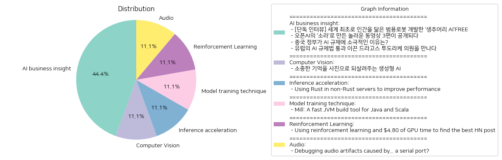

# Daily Artificial Intelligence Insights : News

## 🍋 AI business insight

**요약:**

1. **주요 주제**:

   - AI 기술 개발과 혁신: 생추어리 AI가 개발한 범용 로봇과 오픈AI의 새로운 동영상 생성 모델 소라가 대표적인 사례로, AI 기술의 빠른 발전과 이를 통한 새로운 제품 출현이 강조되고 있다.
   - AI 규제 정책: 중국과 유럽연합의 AI 관련 규제에 대한 서로 다른 접근 방식이 두드러진다. 중국은 산업 성장을 위해 규제를 느슨하게 유지하고 있는 반면, 유럽은 강력한 규제를 통해 산업의 방향성을 조정하고 있다.

2. **주요 사건**:

   - '생추어리 AI'의 범용 로봇 개발: AI 로봇 전문기업인 생추어리 AI가 인간을 닮은 범용 로봇을 개발, 이를 통해 복잡한 일상 상황에 유연하게 대처할 수 있는 미래의 로봇 비전을 제시했다.
   - 오픈AI의 소라로 제작된 동영상 공개: 새로운 AI 동영상 생성 모델 소라를 통해 제작된 혁신적인 영상 작품 3편이 공개되어 기술의 실용성과 창의성을 보여주었다.
   - 중국의 AI 규제 방침: 중국은 AI 산업의 성장을 위해 규제를 제한하는 방향으로 정책을 유지하고 있어 그 배경에 대한 관심이 집중되고 있다.
   - 유럽의 AI 규제법 통과: 드라고스 투도라케 의원의 노력으로 유럽의회에서 AI 규제법이 통과되었으며, 이를 통해 AI 산업의 윤리적 기준이 강제화되고 있다.

3. **영향 분석**:

   - 경제: AI 기술의 발전은 새로운 시장 기회를 창출하고, 혁신적인 제품과 서비스를 통해 경제에 긍정적인 영향을 미칠 것으로 보인다. 동시에 AI 규제는 산업의 방향성을 설정하고 기업들의 대응을 요구할 것이다.
   - 정치와 정책: 각 나라의 AI 규제 정책은 AI 기술의 안전성과 윤리성 확보를 중요시하며, 글로벌 AI 경쟁에서의 입지 설정에도 중요한 역할을 할 것이다.
   - 사회: AI의 발전은 일상생활의 변화를 초래할 가능성이 있으며, 특히 인공지능 기술이 결합된 새로운 형태의 콘텐츠와 서비스는 사회적 수용성을 시험할 것이다.

4. **최종 요약**:

   최근 뉴스는 AI 기술의 고속 발전과 이에 따른 새로운 제품 및 콘텐츠의 출현을 조망하며, 또한 각 지역의 규제 정책이 AI 산업에 미치는 영향을 탐색하고 있다. 이러한 발전과 변화를 통해 AI 기술이 경제 및 사회에 긍정적 영향을 미칠 것으로 예상되며, 동시에 규제의 방향성에 따라 산업 내 안정성과 윤리적 표준이 강조될 가능성이 크다. 앞으로 AI 기술과 규제 간의 균형, 그리고 이에 따른 글로벌 경쟁 및 협력이 주목해야 할 부분으로 떠오르고 있다.

**출처:**

 - [단독 인터뷰] 세계 최초로 인간을 닮은 범용로봇 개발한 ‘생추어리 AI’FREE (https://www.technologyreview.kr/%ec%9d%b8%ed%84%b0%eb%b7%b0-%ec%83%9d%ec%b6%94%ec%96%b4%eb%a6%ac-ai%ea%b0%80-%ea%b7%b8%eb%a6%ac%eb%8a%94-%eb%af%b8%eb%9e%98%ec%9d%98-%eb%a1%9c%eb%b4%87%ec%9d%80-%ec%8b%a4%ec%b2%b4%ed%99%94/)
 - 오픈AI의 ‘소라’로 만든 놀라운 동영상 3편이 공개되다 (https://www.technologyreview.kr/%ec%98%81%ec%83%81-%ec%83%9d%ec%84%b1-%eb%aa%a8%eb%8d%b8-%ec%86%8c%eb%9d%bc%eb%a1%9c-%eb%a7%8c%eb%93%a0-%eb%86%80%eb%9d%bc%ec%9a%b4-%ec%98%81%ed%99%94-3%ed%8e%b8%ec%9d%b4-%ea%b3%b5%ea%b0%9c%eb%90%98/)
 - 중국 정부가 AI 규제에 소극적인 이유는? (https://www.technologyreview.kr/%ec%a4%91%ea%b5%ad-%ec%a0%95%eb%b6%80%ea%b0%80-%ed%98%84%ec%9e%ac%eb%a1%9c%ec%84%9c%eb%8a%94-ai-%eb%b6%84%ec%95%bc%eb%a5%bc-%ea%b0%80%ed%98%b9%ed%95%98%ea%b2%8c-%ea%b7%9c%ec%a0%9c%ed%95%98%ec%a7%80/)
 - 유럽의 AI 규제법 통과 이끈 드라고스 투도라케 의원을 만나다 (https://www.technologyreview.kr/ai-%ea%b7%9c%ec%a0%9c%eb%b2%95-%ed%86%b5%ea%b3%bc-%ec%9d%b4%eb%81%88-%eb%93%9c%eb%9d%bc%ea%b3%a0%ec%8a%a4-%ed%88%ac%eb%8f%84%eb%9d%bc%ec%bc%80-%ec%9d%98%ec%9b%90%ec%9d%84-%eb%a7%8c%eb%82%98%eb%8b%a4/)

## 🌅 Computer Vision

**요약:**

**1. 주요 주제**:
   - 생성형 AI 기술의 발전과 응용: 생성형 AI를 활용하여 다양한 분야에서의 응용 가능성을 탐색하고 과거의 기억이나 이미지를 되살리는 프로젝트의 등장.
   - '합성 기억' 프로젝트: 과거의 추억을 되살리는 기술을 통한 감성적 및 정서적 충족감 제공.

**2. 주요 사건**:
   - '합성 기억' 프로젝트의 추진: 생성형 AI를 이용해 전 세계적으로 카메라에 담지 못했던 과거의 기억이나 추억을 이미지로 재현하는 프로젝트가 진행 중이며, 이는 많은 가족들에게 잃어버린 소중한 순간들을 되찾을 기회를 제공.

**3. 영향 분석**:
   - 경제적 영향: 생성형 AI의 발전은 관련 기술 및 서비스 시장의 확대를 가져올 수 있으며, AI 기술에 대한 투자와 연구개발이 촉진될 가능성.
   - 사회적 영향: 개인 및 가족에게 정서적 안정감 및 만족감을 제공할 수 있으며, 디지털 아카이브의 중요성 및 기술 의존도가 증가할 수 있음.
   - 문화적 영향: 과거의 기억과 문화를 새로운 방법으로 보존함으로써 문화 유산의 디지털화와 접근성을 증진할 수 있음.

**4. 최종 요약**:
   생성형 AI를 이용한 '합성 기억' 프로젝트는 기술을 통해 과거의 소중한 순간을 되살리고 이를 통해 감성적 가치를 제공하는 데 중점을 두고 있습니다. 이는 개인 및 가족 단위에서의 정서적 만족감을 증가시키고 있으며, 동시에 해당 기술의 상업적 및 사회적 잠재력에 대한 관심을 높이고 있습니다. 앞으로 AI 기술의 발전과 더불어, 이러한 개인화된 서비스에 대한 수요가 증가할 가능성이 있으며, 이는 디지털 유산의 보존 및 활용 방법에 대한 새로운 지평을 열어줄 것입니다. 향후 이와 관련된 기술 발전 및 사회적 수용 여부를 주의 깊게 지켜볼 필요가 있습니다.

**출처:**

 - 소중한 기억을 사진으로 되살려주는 생성형 AI (https://www.technologyreview.kr/%ec%83%9d%ec%84%b1%ed%98%95-ai%eb%a1%9c-%ea%b0%80%ec%9e%a5-%ec%86%8c%ec%a4%91%ed%95%9c-%ea%b8%b0%ec%96%b5%ec%9d%84-%ec%82%ac%ec%a7%84%ec%9c%bc%eb%a1%9c-%eb%a7%8c%eb%93%a0%eb%8b%a4/)

## 🥳 Inference acceleration

**요약:**

**Key Themes**:
최근 기술 분야에서 성능 향상을 위해 기존 서버에 Rust 언어를 점진적으로 도입하는 전략이 강조되고 있습니다. Rust는 메모리 안전성과 성능 최적화를 제공하여 다른 언어로 작성된 서버의 특정 기능을 개선할 수 있는 가능성이 있습니다. 일반적인 경향으로는, 작은 단위로 시작해 전체 시스템에 Rust를 적용하는 방법론이 주요하게 논의되고 있습니다.

**Major Events**:
이 기사에서는 기존 서버에서 성능을 개선하기 위한 초기 단계로 "가장 많이 사용되는 함수"를 Rust로 다시 작성하고, 이를 CLI 도구로 컴파일하는 방법을 제안합니다. 또한, WebAssembly를 활용하여 성능을 높이고, 궁극적으로 모든 서버를 Rust로 재작성하는 일이 논의되고 있습니다. 특히, 기존 함수를 Rust로 재작성할 때, 상용화된 바인딩 생성기 라이브러리를 사용한 네이티브 함수 재작성 접근법이 추천되고 있습니다.

**Impact Analysis**:
기술 산업에서 Rust의 채택은 성능 최적화와 코드 안정성을 증대시키며, 장기적으로 개발 비용 절감과 운영 효율성 향상을 가져올 수 있습니다. 이는 소프트웨어 개발 부문에서 경쟁력을 높이며 경제적 이점을 창출할 수 있습니다. 또한, 개발자가 더 안정되고 예측 가능한 시스템을 구축할 수 있어 사용자 경험이 향상될 가능성도 큽니다.

**Final Summary**:
Rust 언어의 도입은 기술 업계에서 자주 논의되는 주제로, 특히 성능 최적화가 필요한 프로젝트에서 효과적인 해결책으로 여겨지고 있습니다. 이 뉴스는 Rust의 점진적인 통합이 기존 시스템의 성능을 어떻게 향상시킬 수 있는지를 다루며, 앞으로도 이러한 트렌드는 더욱 주목받을 것으로 예상됩니다. 특히, Rust를 이용한 성능 최적화는 경제적 측면 외에도 시스템의 안전성과 효율성을 고려하는 차원에서 계속 주목할 가치가 있습니다. 향후 개발자 커뮤니티와 기업들이 Rust 도입에 어떤 방식으로 접근하는지 지켜볼 필요가 있습니다.

**출처:**

 - Using Rust in non-Rust servers to improve performance (https://github.com/pretzelhammer/rust-blog/blob/master/posts/rust-in-non-rust-servers.md)

## 🧸 Model training technique

**요약:**

**요약 보고서**

1. **주요 주제**:
   - 주요 테마는 웹사이트와 관련된 장소 변경 및 사용된 툴, 소프트웨어에 대한 정보 알림입니다.
   - Java와 Scala 같은 프로그래밍 언어에 대한 개발 도구의 업데이트 및 릴리스 정보가 핵심 주제로 다루어졌습니다.

2. **주요 사건**:
   - Mill이라는 이름의 JVM 빌드 툴이 Java와 Scala 개발자들 사이에서 사용되고 있으며, 해당 툴의 내용이 업데이트되어 새로운 URL로 이전되었습니다.
   - 이 주제는 소프트웨어 개발 및 도구 효율성 향상과 관련이 있다고 볼 수 있습니다.

3. **영향 분석**:
   - 경제적 측면에서는 소프트웨어 개발 효율성 개선을 통해 개발 비용 절감 효과를 기대할 수 있습니다.
   - 사회적으로는 개발자 커뮤니티에서 이러한 업데이트 정보 공유를 통해 최신 기술과 도구에 대한 접근성을 높일 수 있습니다.
   - 정치적, 환경적 영향을 직접적으로 다루고 있지 않지만, 기술 발전에 따른 산업 변화는 시간에 따라 간접적으로 영향을 미칠 수 있습니다.

4. **최종 요약**:
   - 이 뉴스는 Java와 Scala 개발에 있어 중요한 도구 중 하나인 Mill의 변경 사항에 대한 정보를 제공했습니다. 
   - 개발자들은 이러한 정보를 통해 최신 기술 트렌드를 따라갈 수 있으며, 기술 커뮤니티 내에서의 지식 공유가 더욱 촉진될 수 있습니다.
   - 앞으로 이러한 소프트웨어 도구들의 발전이 더 많은 개발 효율성 향상 및 비용 절감을 이끌어낼 것으로 기대됩니다.
   - 계속해서 개별 툴 업데이트 및 프로그래밍 언어 생태계의 발전 추세를 주시하는 것이 중요할 것입니다.

**출처:**

 - Mill: A fast JVM build tool for Java and Scala (https://mill-build.org/)

## 🌿 Reinforcement Learning

**요약:**

1. **주요 테마**:
   주요 테마는 강화 학습, 인공지능 및 모델링 기술의 발전입니다. 또한, 인간 피드백을 활용한 강화 학습의 실질적인 응용 사례와 AI 예측의 정확성에 관한 논의가 포함됩니다.

2. **주요 사건**:
   OpenPipe의 창립자인 Kyle가 강화 학습을 이용하여 특정 HN 게시물의 업보트 수를 예측할 수 있는 보상 모델을 구축한 사례가 중요합니다. 그는 Llama 3.1 8B를 사용하여 모델을 훈련하였으며, RMSE 1.11을 달성하여 평균 예측 점수가 3배 정도 벗어나는 결과를 얻었습니다.

3. **영향 분석**:
   이러한 연구와 기술 발전은 사회 및 경제 부문에 영향을 미칠 수 있습니다. 사회적으로는 AI 모델을 활용한 예측 기술이 향상되면서 데이터 분석의 정확성이 높아질 것으로 기대됩니다. 경제적으로는 이러한 기술이 업계에서 데이터 분석 및 의사결정 과정에 통합됨으로써 새로운 비즈니스 기회를 창출할 수 있을 것입니다.

4. **최종 요약**:
   이 기사에서 강조된 바와 같이 강화 학습과 인간 피드백을 결합한 기술은 AI 예측의 정확성을 높이는 데 기여할 수 있습니다. 이로 인해, 다양한 분야에서 데이터 기반 의사결정의 신뢰성이 강화될 것으로 예상됩니다. 앞으로 강화 학습 기술의 활용 범위가 넓어지면서 이는 경제 및 사회 부문에서 중요한 역할을 할 것으로 보이며, 지속적인 기술 발전을 주의 깊게 관찰할 필요가 있습니다.

**출처:**

 - Using reinforcement learning and $4.80 of GPU time to find the best HN post (https://openpipe.ai/blog/hacker-news-rlhf-part-1)

## 🎇 Audio

**요약:**

1. **주요 테마**:
   이 뉴스 기사의 주요 테마는 기술 문제 해결, 클라우드 인프라 전환, 그리고 시스템 최적화입니다. 이슈의 원인을 규명하고 이를 해결하는 과정에서 발생하는 기술적 도전과 프로세스 개선이 반복되는 주제입니다.

2. **주요 사건**:
   팀은 쿠버네티스에서 맞춤형 클러스터 스케일러로 마이그레이션하는 과정 중에 오디오 녹음 시 잡음이 발생하는 문제를 경험했습니다. 처음에는 CPU 스파이크가 원인일 것이라고 추측했으나, 나중에 'nice' 값 설정이 잘못되어 있었다는 것을 발견했습니다. 실제 근본 원인은 stdout을 점유하는 cloud-init 로그 때문이었으며, 이로 인해 오디오 인코딩 프로세스가 잠시 멈추면서 오디오 아티팩트가 생겼습니다.

3. **영향 분석**:
   이 이벤트는 주로 기업의 IT 인프라 최적화와 관련된 문제로, 조직 내부의 기술적인 불일치 및 문제 해결 과정에서 나타날 수 있는 위험성을 보여줍니다. 이러한 기술적 이슈는 생산성에 직접적인 영향을 미치며, 특히 미디어 및 콘텐츠 제작 분야에서 중요한 품질이 떨어질 수 있음을 시사합니다.

4. **최종 요약**:
   이번 사례는 클라우드 및 IT 인프라 이동 시 발생할 수 있는 예기치 않한 기술적 문제를 조명하며, 이러한 문제를 해결하기 위해서는 각종 설정과 로깅 프로세스를 철저히 검토해야 함을 보여줍니다. 앞으로 클라우드로의 이동과 같은 기술 변화가 계속 이루어질 때, 이러한 문제 해결 능력이 더욱 중요해질 것입니다. 회사들은 시스템 전환 시 잠재적인 문제를 미리 감지하고 대처하는 능력을 키워야 할 것입니다.

**출처:**

 - Debugging audio artifacts caused by... a serial port? (https://www.recall.ai/post/debugging-audio-artifacts-caused-by-a-serial-port)

