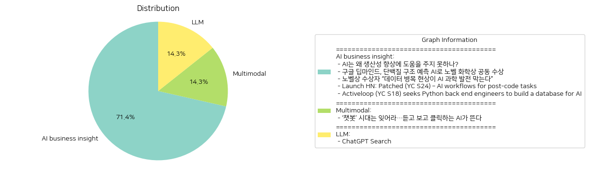

# Daily Artificial Intelligence Insights : News

## 🪸 AI business insight

**요약:**

1. **주요 테마**:
   - 인공지능(AI)의 발전과 응용
   - 생산성 향상 및 과학적 발견에서의 AI의 역할
   - AI 개발을 위한 기술적 기반 및 인재 요구

2. **주요 사건**:
   - AI의 생산성 향상을 위한 개선 필요: 현재 AI는 경제 발전을 이끌어갈 잠재력이 있으나, 실질적인 생산성 개선을 위해서는 몇 가지 개선이 필요한 점이 강조됨.
   - 노벨 화학상 공동 수상: 구글 딥마인드의 데미스 허사비스와 존 점퍼가 단백질 구조 예측 AI로 노벨 화학상을 공동 수상, 이는 AI의 과학적 활용 가능성을 보여줌.
   - 데이터 병목 현상 문제: AI의 과학 발전을 위해 고품질 데이터의 중요성이 언급됨.
   - Patched의 AI 워크플로우 솔루션: 소프트웨어 개발 라이프사이클을 자동화하기 위한 맞춤형 워크플로우 제공.
   - Activeloop의 AI 데이터베이스 구축 노력: AI 응용을 위한 확장 가능한 플랫폼 구축을 위해 고급 백엔드 엔지니어 채용 중.

3. **영향 분석**:
   - 경제: AI 기술의 발전은 생산성을 크게 향상시킬 수 있지만, 이는 기술적 개선과 인재 양성에 의존하며, 산업 전반의 변화를 야기할 수 있음.
   - 사회: AI의 발전은 사회적으로 중대한 변화를 가져올 가능성이 있으며, 과학적 발견의 가속화와 새로운 문제 해결 방법을 제공할 수 있음.
   - 과학: 고품질 데이터 확보의 중요성이 부각되면서 데이터 인프라 및 과학적 연구 방법론의 변화가 요구됨.

4. **최종 요약**:
   최근 뉴스들은 AI가 경제 및 과학적 발견에서의 큰 잠재력을 가지고 있음을 보여주고 있다. 그러나 생산성 향상 등의 실질적인 효과를 위해서는 기술적 저해 요소 해결이 필요하며, 고품질 데이터의 중요성이 더욱 부각되고 있다. 또한, AI 개발을 위한 기술적 기반 확장과 인재 양성이 절실히 요구된다. 향후 AI의 과학적, 경제적 발전이 어떻게 진행될지 주목해야 하며, 이를 가속화하기 위한 데이터 인프라 개발과 AI 기술 혁신을 주의 깊게 살펴볼 필요가 있다.

**출처:**

 - AI는 왜 생산성 향상에 도움을 주지 못하나? (https://www.technologyreview.kr/ai%eb%8a%94-%ec%99%9c-%ec%83%9d%ec%82%b0%ec%84%b1-%ed%96%a5%ec%83%81%ec%97%90-%eb%8f%84%ec%9b%80%ec%9d%84-%ec%a3%bc%ec%a7%80-%eb%aa%bb%ed%95%98%eb%82%98/)
 - 구글 딥마인드, 단백질 구조 예측 AI로 노벨 화학상 공동 수상 (https://www.technologyreview.kr/%ea%b5%ac%ea%b8%80-%eb%94%a5%eb%a7%88%ec%9d%b8%eb%93%9c-%eb%8b%a8%eb%b0%b1%ec%a7%88-%ea%b5%ac%ec%a1%b0-%ec%98%88%ec%b8%a1-ai%eb%a1%9c-%eb%85%b8%eb%b2%a8-%ed%99%94%ed%95%99%ec%83%81-%ea%b3%b5%eb%8f%99/)
 - 노벨상 수상자 “데이터 병목 현상이 AI 과학 발전 막는다” (https://www.technologyreview.kr/%eb%85%b8%eb%b2%a8%ec%83%81-%ec%88%98%ec%83%81%ec%9e%90-%eb%8d%b0%ec%9d%b4%ed%84%b0-%eb%b3%91%eb%aa%a9-%ed%98%84%ec%83%81%ec%9d%b4-ai-%ea%b3%bc%ed%95%99-%eb%b0%9c%ec%a0%84-%eb%a7%89%eb%8a%94/)
 - Launch HN: Patched (YC S24) – AI workflows for post-code tasks (https://news.ycombinator.com/item?id=42009089)
 - Activeloop (YC S18) seeks Python back end engineers to build a database for AI (https://www.ycombinator.com/companies/activeloop/jobs/kCU6ZNq-python-backend-engineer)

## 💙 Multimodal

**요약:**

1. **주요 주제**:
   AI 기술의 진화와 변화가 주요 주제로 다루어지고 있습니다. 특히, 기존 텍스트 기반의 챗봇에서 벗어나 좀 더 발전된 형태인 음성과 영상 생성 기능을 갖춘 AI의 등장이 강조되고 있습니다.

2. **주요 사건**:
   뉴스 기사에서는 AI 기술의 발전에 따른 변화를 강조하고 있습니다. 이전의 텍스트 챗봇 시대가 막을 내리고, 음성 및 영상 생성 기능을 갖춘 새로운 AI 시대가 도래하고 있다는 점이 주요 스토리로 언급되고 있습니다.

3. **영향 분석**:
   이러한 AI 기술의 발전은 여러 분야에 광범위한 영향을 미칠 것입니다. 경제적으로는 새로운 AI 기술을 활용한 서비스와 제품이 시장에 출시되어 새로운 비즈니스 기회를 창출할 것으로 예상됩니다. 사회적으로는 AI 기술이 개인의 생활 전반에 침투하여 일상적인 상호작용 방식에 변화를 초래할 것입니다. 더 나아가, 정보 전달 및 미디어 소비 방식 등이 변화하면서, 관련 산업 전반에 혁신이 가속화될 것으로 보입니다.

4. **최종 요약**:
   AI 기술이 단순한 텍스트 처리 단계를 넘어서 음성과 영상 생성 기능을 포함하는 방향으로 진화하고 있는 것은 명백한 사실입니다. 이러한 변화는 다양한 산업 분야에서 기존의 비즈니스 모델에 도전과 기회를 동시에 제공할 것입니다. 앞으로 이러한 AI 기술의 발전이 가져올 법적, 윤리적 문제들에 대한 논의가 지속적으로 이루어질 것으로 예상되며, 기술의 발전 방향과 사회적 수용 가능성에 대한 지속적인 관심이 필요합니다. AI의 발전 추세를 주목해야 하며, 이러한 변화가 미래 사회와 산업에 미칠 영향에 대한 기대와 준비가 필요합니다.

**출처:**

 - ‘챗봇’ 시대는 잊어라…듣고 보고 클릭하는 AI가 뜬다 (https://www.technologyreview.kr/%ec%b1%97%eb%b4%87-%ec%8b%9c%eb%8c%80%eb%8a%94-%ec%9e%8a%ec%96%b4%eb%9d%bc-%eb%93%a3%ea%b3%a0-%eb%b3%b4%ea%b3%a0-%ed%81%b4%eb%a6%ad%ed%95%98%eb%8a%94-ai%ea%b0%80-%eb%9c%ac%eb%8b%a4/)

## 🎉 LLM

**요약:**

**요약 보고서**

1. **주요 주제**:
   최근 뉴스 기사에서 반복적으로 나타나는 주요 주제는 인공지능 기술의 발전, 특히 ChatGPT의 새로운 기능과 그에 따른 사용자 경험의 개선입니다. 'ChatGPT 검색' 기능은 웹 검색과 관련된 소스 링크 제공을 통해 사용자들에게 보다 풍부하고 정확한 정보를 제공합니다. 이는 인공지능의 자연어 처리 능력과 최신 정보의 통합이 주요 테마로 다뤄지고 있습니다.

2. **주요 사건**:
   - 'ChatGPT 검색' 기능의 출시: 이 기능은 사용자가 스포츠, 뉴스 등과 같은 최신 정보를 자연어 인터페이스를 통해 쉽게 접근할 수 있도록 합니다. 이는 ChatGPT 웹사이트와 데스크톱 및 모바일 앱에서 모두 이용 가능하며, 사용자 경험을 한층 더 개선하고 있습니다.

3. **영향 분석**:
   - **경제적 영향**: ChatGPT 검색 기능은 다양한 산업 분야에서의 정보 탐색 방식을 변화시킬 가능성이 높습니다. 특히 정보 검색 플랫폼과의 경쟁이 심화될 수 있으며, 인공지닌 기술을 활용한 서비스의 중요성이 더욱 부각될 것입니다.
   - **사회적 영향**: 사용자들이 보다 쉽게 접근 가능한 정보와 그에 대한 신뢰도가 증가하면서, 정보 격차 해소에 기여할 수 있습니다. 이는 개인의 정보 소비 방식과 사회 전반의 지식 공유 방식에 긍정적인 영향을 미칠 것으로 예상됩니다.

4. **최종 요약**:
   ChatGPT의 새로운 검색 기능 출시는 인공지능 기술 발전의 또 다른 이정표로 볼 수 있습니다. 자연어 처리와 최신 정보를 융합한 이 기능은 사용자 경험을 크게 향상시키며, 정보 접근성을 증대시킬 잠재력을 가지고 있습니다. 앞으로의 관건은 이러한 기술 발전이 정보의 질을 어떻게 높이고, 다양한 산업 분야에서 어떠한 혁신을 불러일으킬지에 주목하는 것입니다. 미래에는 인공지능 기반의 더 많은 서비스 통합과 그에 따른 시장 변화가 예상됩니다.

**출처:**

 - ChatGPT Search (https://openai.com/index/introducing-chatgpt-search/)

