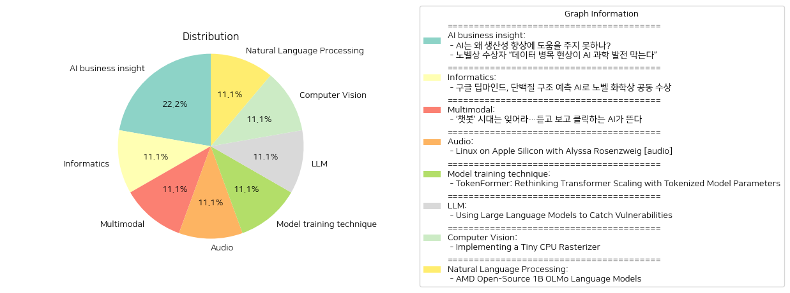

# Daily Artificial Intelligence Insights : News

## 🎇 AI business insight

**요약:**

**1. 주요 주제:**
   이 뉴스 기사들에서는 인공지능(AI)의 발전과 관련된 몇 가지 주요 주제가 반복되고 있습니다. 첫 번째 주제는 AI가 생산성 향상에 기대되는 역할과 이에 필요한 개선 사항에 관한 문제입니다. 두 번째로는 AI 발전을 저해하는 요소로 데이터 병목 현상과 고품질 데이터의 필요성이 언급됩니다.

**2. 주요 사건:**
   첫 번째 기사에서는 AI가 경제 발전을 위한 유망한 기술로 기대되지만, 실제로 생산성 개선에 기여하려면 중대한 개선이 필요함을 강조하고 있습니다. 두 번째 기사에서는 노벨상 수상자가 데이터 병목 현상이 AI의 과학적 발견을 막고 있다고 지적하며, 이를 해결하기 위해서는 고품질 데이터가 필요하다고 주장하고 있습니다.

**3. 영향 분석:**
   - **경제**: 첫 번째 기사에서 AI가 생산성 향상에 주는 효과가 제한적이라고 지목되어, AI의 잠재력을 실제로 경제 성장에 반영하기 위해서는 추가적인 노력이 필요함을 암시합니다.
   - **사회**: 데이터의 질이 AI 발전의 병목 현상으로 작용한다는 점은, 기술 발전이 사회 전반에 미치는 영향과 관련하여 데이터의 관리 및 가공의 중요성을 나타냅니다.

**4. 최종 요약:**
   AI의 잠재력은 인정되지만 현실에서는 생산성 향상에 즉각적인 기여를 하지 못하고 있습니다. 이는 AI 시스템 개발에 필요한 중대한 개선과 고품질 데이터의 중요성 때문으로 해석됩니다. 앞으로 AI가 경제와 사회에 더 큰 영향을 미치기 위해서는 데이터 관리 개선 및 기술적 발전이 필요합니다. 향후 AI가 실제 경제 발전에 어떻게 기여할지를 주목해야 하며, 데이터 품질 향상과 병목 현상 해결이 중요한 과제로 남아있습니다.

**출처:**

 - AI는 왜 생산성 향상에 도움을 주지 못하나? (https://www.technologyreview.kr/ai%eb%8a%94-%ec%99%9c-%ec%83%9d%ec%82%b0%ec%84%b1-%ed%96%a5%ec%83%81%ec%97%90-%eb%8f%84%ec%9b%80%ec%9d%84-%ec%a3%bc%ec%a7%80-%eb%aa%bb%ed%95%98%eb%82%98/)
 - 노벨상 수상자 “데이터 병목 현상이 AI 과학 발전 막는다” (https://www.technologyreview.kr/%eb%85%b8%eb%b2%a8%ec%83%81-%ec%88%98%ec%83%81%ec%9e%90-%eb%8d%b0%ec%9d%b4%ed%84%b0-%eb%b3%91%eb%aa%a9-%ed%98%84%ec%83%81%ec%9d%b4-ai-%ea%b3%bc%ed%95%99-%eb%b0%9c%ec%a0%84-%eb%a7%89%eb%8a%94/)

## 🪸 Informatics

**요약:**

**키 주제**:
이번 뉴스 아티클은 인공지능(AI)과 과학적 혁신에 관한 주제를 다루고 있습니다. 특히 AI 기술을 활용한 단백질 구조 예측이 주요 트렌드로 부각되었습니다. 이는 AI의 생명과학 분야에서의 응용 및 영향력을 보여줍니다. 또한, 노벨 화학상에서 두 개의 다른 연구 분파가 수상한 점에서도 혁신적 연구의 중요성이 강조됩니다.

**주요 사건**:
구글 딥마인드의 연구진인 데미스 허사비스와 존 점퍼는 AI 기술을 활용하여 단백질 접힘 예측 문제를 해결한 공로로 노벨 화학상의 절반을 수상했습니다. 이와 함께, 데이비드 베이커는 혁신적인 새로운 단백질을 만드는 데 성공하여 나머지 절반의 상을 받았습니다. 이는 AI가 생명과학에서 실제적이며 혁신적인 도구로 자리잡고 있음을 보여주는 사건입니다.

**영향 분석**:
이번 수상은 생명과학 및 의학 분야에서 AI의 가능성을 넓혔습니다. 이는 신약 개발과 같은 분야에서 연구와 응용의 새로운 가능성을 열어줌으로써 경제적인 측면에서도 중요한 영향을 미칠 것으로 보입니다. 또한, 이러한 연구들은 과학 기술 발전을 통해 더 나은 사회적 결과를 가져올 수 있으며, AI의 윤리적 사용 및 개발 방향에 대한 사회적 논의를 촉진할 수 있습니다.

**최종 요약**:
구글 딥마인드의 AI 기술을 활용한 단백질 접힘 예측이 중요한 과학적 성과로 인정받아 노벨 화학상을 수상한 사건은 AI의 미래 가능성을 여실히 보여줍니다. 특히, 생명과학 분야에서 AI 연구의 중요성과 가치에 대해 다시 한 번 주목받는 계기가 되었습니다. 앞으로 AI가 어떻게 생명과학을 포함한 다양한 분야에 통합될 것인지, 그리고 그 과정에서 발생할 수 있는 윤리적 문제나 사회적 도전에 대해 주목할 필요가 있습니다. 또한, 이러한 혁신이 경제와 사회에 미칠 장기적인 영향을 지속적으로 모니터링해야 할 것입니다.

**출처:**

 - 구글 딥마인드, 단백질 구조 예측 AI로 노벨 화학상 공동 수상 (https://www.technologyreview.kr/%ea%b5%ac%ea%b8%80-%eb%94%a5%eb%a7%88%ec%9d%b8%eb%93%9c-%eb%8b%a8%eb%b0%b1%ec%a7%88-%ea%b5%ac%ec%a1%b0-%ec%98%88%ec%b8%a1-ai%eb%a1%9c-%eb%85%b8%eb%b2%a8-%ed%99%94%ed%95%99%ec%83%81-%ea%b3%b5%eb%8f%99/)

## 🪸 Multimodal

**요약:**

**요약 보고서**

1. **핵심 주제**:
   - AI 기술의 진화와 변화: 텍스트 기반 챗봇에서 음성 및 영상 생성 기능을 갖춘 AI로의 전환이 주목받고 있음.
   - 기술 발전에 따른 새로운 시대의 도래: AI의 기능 확장이 기술의 새로운 패러다임을 열고 있음.

2. **주요 사건**:
   - 챗봇 기술의 변화: 전통적인 텍스트 기반 챗봇의 시대가 저물고, 음성 및 영상 처리 능력을 높인 AI가 등장했다는 소식이 주요 변화로 제시되고 있음.

3. **영향 분석**:
   - **경제적 영향**: 새로운 AI 기술의 부상은 관련 산업에 광범위한 혁신을 필요로 하며, 기술 발전은 경쟁력을 강화시키고 새로운 비즈니스 모델을 창출할 가능성이 큼.
   - **사회적 영향**: AI 기술의 진화는 사용자 인터페이스와 상호작용 방식을 변화시킴으로써 일상생활에 직접적인 영향을 미칠 수 있음. 이는 개인 맞춤화 서비스와 같은 다양한 형태로 나타날 것임.
   - **정치적/규제적 영향**: AI의 발전은 데이터 프라이버시 및 보안과 관련된 새로운 규제 요구를 초래할 수 있음.

4. **최종 요약**:
   AI 기술의 발전은 더 이상 챗봇에 국한되지 않고 보다 포괄적인 음성과 영상 기반의 AI로 확장되어 가고 있는 것으로 관찰됨. 이는 사용자 경험의 혁신을 촉진하고 다양한 산업에 영향을 미칠 것으로 예상됨. 미래 발전 사항으로는 이러한 기술이 사회 전반에 걸쳐 더욱 보편화되는 것을 주목할 필요가 있으며, 이에 따라 발생할 기술적, 경제적, 사회적 변화에 대한 대비가 필요함.

**출처:**

 - ‘챗봇’ 시대는 잊어라…듣고 보고 클릭하는 AI가 뜬다 (https://www.technologyreview.kr/%ec%b1%97%eb%b4%87-%ec%8b%9c%eb%8c%80%eb%8a%94-%ec%9e%8a%ec%96%b4%eb%9d%bc-%eb%93%a3%ea%b3%a0-%eb%b3%b4%ea%b3%a0-%ed%81%b4%eb%a6%ad%ed%95%98%eb%8a%94-ai%ea%b0%80-%eb%9c%ac%eb%8b%a4/)

## ⭐ Audio

**요약:**

**종합 요약 보고서 - 뉴스 기사 요약**

1. **주요 주제**:
   - 첫 번째 뉴스 기사는 하드웨어 역공학과 Linux 게임의 발전이라는 두 가지 주요 주제를 다루고 있습니다. 이들은 전반적인 기술 발전과 오픈 소스 소프트웨어의 역할에 대한 토론을 나타냅니다. 또한, Linux가 Apple Silicon 기기에서 실행되는 잠재력에 대해 탐구합니다.

2. **주요 사건**:
   - Alyssa Rosenzweig가 Asahi Linux 프로젝트에 기여하며 Apple M1 GPU를 역공학하고 있다는 점이 큰 사건입니다. 이는 사용자들이 Apple의 새로운 칩에서 Linux를 실행할 수 있도록 지원하는 중요한 단계로, Valve의 후원을 받아 복잡한 하드웨어의 이해를 심화하고자 하는 시도로 보입니다.

3. **영향 분석**:
   - **경제적 영향**: Asahi Linux 프로젝트는 Intel, AMD와 같은 기존 칩 공급업체들과 경쟁하는 Apple Silicon의 시장 확장을 지원하며, 더 넓은 하드웨어 호환성을 가능하게 함으로써 소비자 선택을 확대할 수 있습니다.
   - **사회적 영향**: 오픈 소스 소프트웨어의 발전은 개발자 커뮤니티에 긍정적인 영향을 미치며, 사용자들이 더 많은 커스터마이즈 가능성을 가질 수 있도록 합니다. 또한 기술 전환에 따라 사용자들이 환경이나 시스템 전반을 변화시키는데 있어서 새로운 기회를 제공합니다.

4. **최종 요약**:
   - 이 뉴스는 기술 업계에서의 혁신적 진전을 강조하며, 특히 Apple Silicon과의 호환성을 통해 Linux의 활용도를 넓히는 중요한 진전을 다루고 있습니다. Alyssa Rosenzweig의 연구와 역공학 노력이 주목할 만하며, 이는 미래의 컴퓨터 하드웨어 개발과 소프트웨어 호환성에 중요한 역할을 할 것으로 보입니다. 앞으로는 더 많은 개발자들이 이 프로젝트에 참여하여 결과적으로 더욱 포괄적인 오픈 소스 환경을 조성하게 될 가능성이 높습니다. 이러한 움직임은 더 많은 하드웨어 제조업체들이 오픈 소스 생태계에 참여하도록 장려할 수 있는 기회로 작용할 것입니다.

**출처:**

 - Linux on Apple Silicon with Alyssa Rosenzweig [audio] (https://softwareengineeringdaily.com/2024/10/15/linux-apple-silicon-alyssa-rosenzweig/)

## 🪐 Model training technique

**요약:**

**요약 보고서: TokenFormer 뉴스 기사 기반**

1. **핵심 주제**:
   'TokenFormer: Rethinking Transformer Scaling with Tokenized Model Parameters' 기사의 주요 주제는 크게 두 가지로 요약할 수 있습니다: 트랜스포머 기술의 확장 가능성과 효율성 향상입니다. 이 기사는 TokenFormer 아키텍처가 토큰-파라미터 간 상호작용을 위해 주의를 사용한다는 점과 이를 통해 재훈련 없이 점진적으로 규모를 확장할 수 있다는 점을 강조합니다. 이러한 점에서 비용 절감과 성능 유지라는 두 가지 중요한 트렌드를 발견할 수 있습니다.

2. **주요 사건**:
   해당 기사에서는 주요 혁신으로 TokenFormer라는 새로운 트랜스포머 구조를 소개합니다. 이 모델은 새로운 파라미터 쌍을 점진적으로 추가함으로써 기존의 스크래치 훈련된 트랜스포머와 비슷한 성능을 유지 가능하게 한다고 설명합니다. 이는 훈련 비용을 절감할 수 있는 방법으로 주목받고 있습니다.

3. **영향 분석**:
   이 기술 혁신은 AI 관련 사회와 경제 분야에 긍정적인 영향을 미칠 가능성이 큽니다. 경제적으로는 훈련 비용 절감으로 인공지능 연구 및 개발 프로젝트의 자금 분배가 효율적으로 이루어질 수 있으며, 이는 궁극적으로 새로운 혁신적 기술 개발을 가속할 수 있습니다. 사회적으로는 AI 모델의 접근성이 높아지며 인공지능의 보급과 활용이 증가할 전망입니다.

4. **최종 요약**:
   TokenFormer는 트랜스포머 모델의 비용 효율성을 높이면서도 성능을 유지할 수 있는 혁신적인 접근법을 제시하고 있습니다. 이 기술은 특히 인공지능 산업에서 연구 개발비를 절감하여 보다 폭넓은 응용 가능성을 열어줄 것입니다. 앞으로 인공지능 모델들이 어떻게 더 확장하고 적용될지를 주목해야 할 것이며, TokenFormer의 접근법이 새로운 표준이 될 가능성도 배제할 수 없습니다. 앞으로의 동향을 지속적으로 관찰하며 기술의 발전을 모니터링하는 것이 중요할 것입니다.

**출처:**

 - TokenFormer: Rethinking Transformer Scaling with Tokenized Model Parameters (https://arxiv.org/abs/2410.23168)

## ☀️ LLM

**요약:**

1. **주요 주제**:
   - 인공지능(AI) 및 대형 언어 모델의 활용.
   - 사이버 보안 및 취약점 탐지.
   - 오픈 소스 소프트웨어의 개선과 그에 따른 안정성 강화.

2. **주요 사건**:
   - 구글 프로세트 제로(Google Project Zero)와 구글 딥마인드(Google DeepMind)의 연구자들이 대형 언어 모델을 활용하여 SQLite에서 이전에 알려지지 않았던 취약점을 발견.
   - 이 취약점을 발견한 당일 개발자에게 보고하여 신속히 수정됨.
   - 실제로 널리 사용되는 소프트웨어에서 AI 에이전트가 처음으로 신규 익스플로잇 가능한 메모리 안전 문제를 발견한 공개적인 사례로 주목됨.

3. **영향 분석**:
   - **경제**: 오픈 소스 소프트웨어의 안전성이 향상됨으로써 산업 전반에 걸친 신뢰도 상승 및 비즈니스 연속성이 확보됨.
   - **기술**: 인공지능의 활용이 더욱 다각화됨에 따라 기존의 보안 문제에 대한 새로운 접근 방법이 제시될 가능성 증가.
   - **사회**: 일반 사용자의 소프트웨어 사용에 대한 안전성이 강화되어 소비자 신뢰도 증대.
   - **정치**: 국가 간 사이버 보안 문제 대응 방안과 AI 기술 활용에 대한 정책 논의 활성화 가능성.

4. **최종 요약**:
   - 이번 연구는 인공지능과 대형 언어 모델이 실질적인 사이버 보안 문제를 해결할 수 있음을 보여주는 중요한 사례로 평가됨. 이는 AI의 적용 범위를 확장시키고 다양한 산업에서 AI를 활용한 해결 방법을 모색하는 계기가 될 것임.
   - 앞으로 AI를 통한 사이버 보안 강화가 더욱 활발하게 이루어질 전망이며, 기술 혁신과 함께 보안 체계가 더욱 복잡해질 것이 예상됨.
   - AI의 역할 증대에 따른 윤리적, 법적 논의가 더욱 촉발될 가능성이 있어 이를 대비한 정책적 준비가 필요할 것임.

**출처:**

 - Using Large Language Models to Catch Vulnerabilities (https://googleprojectzero.blogspot.com/2024/10/from-naptime-to-big-sleep.html)

## 🥳 Computer Vision

**요약:**

1. **주요 주제**:
   - CPU 기반의 래스터화 엔진 개발
   - C++를 이용한 기초 컴퓨팅 기술 학습
   - GPU 없이 소프트웨어 수준에서 화면에 픽셀을 그리는 기술
   - 오픈소스 및 협업 프로그래밍의 중요성

2. **주요 사건**:
   - 'Implementing a Tiny CPU Rasterizer'라는 제목의 프로젝트가 진행 중이며, 기초 CPU 래스터화 엔진을 개발하는 일련의 튜토리얼 시리즈가 진행되고 있다. 이 시리즈는 12개의 파트로 나뉘어 있으며, 픽셀을 그리는 기본 작업부터 고급 최적화 기술까지를 다룬다. 현재 프로젝트 관련 코드가 GitHub에 공개되어 있다.

3. **영향 분석**:
   - **경제**: 특정 직업군에서 오픈소스 프로젝트 참여를 통해 기술력 향상 및 새로운 기회 창출 가능성
   - **사회**: 컴퓨터 프로그래밍과 기술 개발 분야에 대한 관심 증가, 교육적 자원으로서의 가치
   - **기술**: GPU 없이 CPU만으로 고품질 그래픽을 구현할 수 있는 기술적 가능성 탐색

4. **최종 요약**:
   - 본 프로젝트는 컴퓨팅 기술의 기초를 깊이 있게 탐구하며, C++ 프로그래밍을 통해 CPU에서 픽셀을 그리는 과정을 배우는 과정의 중요성을 강조하고 있다. 이는 비전문가 및 개발자에게 학습의 기회를 제공하며, 오픈소스를 통해 공유되는 지식의 힘을 보여준다. 향후 이러한 프로젝트를 통해 소프트웨어 기술에 대한 이해도와 활용도가 높아질 것으로 예상된다. 지속적인 학습과 발전을 도모하는 이러한 오픈소스 프로젝트가 기술 분야 전반에 걸친 혁신을 계속해서 촉진할 것으로 기대된다.

**출처:**

 - Implementing a Tiny CPU Rasterizer (https://lisyarus.github.io/blog/posts/implementing-a-tiny-cpu-rasterizer.html)

## 🫧 Natural Language Processing

**요약:**

**한국어 요약 보고서**

1. **주요 주제:**
   - 기계 학습 및 인공지능 기술의 발전
   - 오픈소스 커뮤니티에 대한 기여와 그 영향
   - 인공지능 모델의 성능 비교 및 발전
   - 대형 데이터셋을 활용한 자연어 처리 기술의 향상

2. **주요 사건:**
   - AMD는 10억 개의 파라미터를 갖춘 오픈소스 언어 모델인 'AMD OLMo' 시리즈를 최초로 출시했다. 이 모델들은 1.3조 개의 토큰으로 훈련되었으며, 일반적인 추론, 지침 따르기, 채팅 능력에서 다른 동일 크기의 오픈소스 모델들보다 뛰어난 성능을 보여준다.

3. **영향 분석:**
   - **경제적 측면:** AMD의 오픈소스 언어 모델 출시는 기술 기업들 간의 경쟁을 촉진하고 더 많은 개발자들이 AI 연구 및 개발에 참여할 수 있도록 독려할 것이다. 이는 생산성과 혁신성 향상을 통해 경제적 이익으로 이어질 수 있다.
   - **사회적 측면:** 이러한 고성능 언어 모델은 더욱 개인화된 고객 서비스 및 지원 시스템을 가능하게 하여 사회 전반에 걸쳐 인공지능의 활용도를 증대시킬 수 있다.
   - **기술적 측면:** 오픈소스 접근 방식의 사용은 언어 모델의 투명성과 확장 가능성을 높이는 동시에 더 많은 연구자들이 다양한 용도로 AI를 적용할 수 있도록 지원할 것이다.

4. **최종 요약:**
   - AMD의 OLMo 시리즈 출시는 오픈소스 AI 모델 개발의 새 시대를 열고, 자연어 처리 분야에서 성능을 우선시하는 흐름을 강화하고 있다. 이러한 움직임은 기술 발전과 같은 맥락에서 다양한 산업 분야에 긍정적인 영향력을 미칠 것으로 예상되며, AI 연구의 투명성과 접근성을 높이고 있다. 미래에는 이와 같이 발전된 AI 모델들이 사회 전반에 걸쳐 더욱 다양하게 적용되며, 인공지능의 활용과 영향력이 더욱 확대될 것으로 전망된다. 지속적으로 주목해야 할 개발은 오픈소스 커뮤니티와의 협업 및 혁신적인 AI 솔루션의 확대이다.

**출처:**

 - AMD Open-Source 1B OLMo Language Models (https://www.amd.com/en/developer/resources/technical-articles/introducing-the-first-amd-1b-language-model.html)

