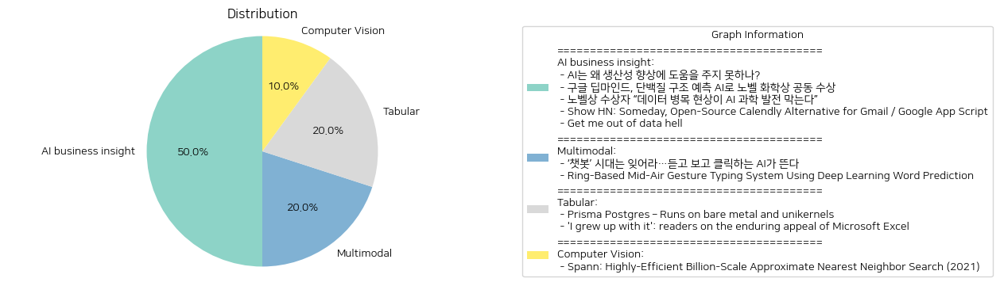

# Daily Artificial Intelligence Insights : News

## 🎇 AI business insight

**요약:**

1. **주요 테마**:
   각 뉴스 기사에서 공통적으로 나타나는 주요 테마는 기술 발전과 그에 따른 생산성, 데이터 품질 및 활용, 그리고 AI 기술의 사회적 차원에서의 역할입니다. 특히, AI 기술의 잠재적 효과와 실제 활용 가치를 중심으로 논의되고 있으며, 데이터의 질과 이용 방식이 AI 과학 발전 및 생산성 향상에 있어 중요한 요소로 다루어지고 있습니다.

2. **주요 사건**:
   - 'AI는 왜 생산성 향상에 도움을 주지 못하나?': AI가 생산성 개선에 큰 기여를 하기 위해 필요한 중대한 개선점이 필요함을 설명합니다.
   - '구글 딥마인드, 단백질 구조 예측 AI로 노벨 화학상 공동 수상': 구글 딥마인드가 AI를 활용한 단백질 접힘 예측 문제 해결로 노벨 화학상을 수상하였다는 쾌거를 전합니다.
   - '노벨상 수상자 "데이터 병목 현상이 AI 과학 발전 막는다"': 과학적 발견 도구로서 AI의 활용을 위해서는 고품질 데이터가 필요하다는 주장을 제기합니다.
   - 'Show HN: Someday, Open-Source Calendly Alternative for Gmail / Google App Script': 오픈소스 기반의 일정 관리 툴인 Someday가 Gmail 사용자들에게 제공하는 통합 및 개인화 기능을 강조합니다.
   - 'Get me out of data hell': 복잡성과 부실한 설계로 인해 고통스러운 데이터 플랫폼을 다루는 엔지니어가 기술적, 문화적 문제로 직장을 떠나는 이야기를 다룹니다.

3. **영향 분석**:
   - 경제 분야에서는 AI 기술의 생산성 개선 가능성에 대한 논의가 중심이며, 보다 나은 데이터 활용이 필요한 상황입니다.
   - 사회적으로는 AI의 과학적 발견 기여와 관련된 긍정적 영향과 개인 정보 보호 및 기술 문화와 관련된 우려가 공존합니다.
   - 기술적 발전에서는 구글 딥마인드의 성과처럼 AI가 혁신적 문제 해결에 실질적인 기여를 할 수 있음을 보여줍니다.

4. **최종 요약**:
   이번 뉴스들은 AI 기술의 잠재력과 실용성에 대한 다양한 시각을 제공합니다. 생산성 향상에 있어 AI가 아직 나아가야 할 점이 많고, 고품질 데이터 확보의 중요성이 대두되고 있습니다. 또한, 기술적 발전에서 AI가 이루어낸 성과는 주목할만하며, 이는 앞으로도 더 많은 연구와 응용의 장을 열 것으로 기대됩니다. 개인정보 보호에 대한 요구와 복잡한 기술 문화 속에서의 인간적 문제를 해결할 필요성도 높아지고 있습니다. 향후 AI 기술이 더욱 실질적인 경제적, 사회적 가치를 창출할 수 있도록 지속적인 발전과 개선이 필요합니다.

**출처:**

 - AI는 왜 생산성 향상에 도움을 주지 못하나? (https://www.technologyreview.kr/ai%eb%8a%94-%ec%99%9c-%ec%83%9d%ec%82%b0%ec%84%b1-%ed%96%a5%ec%83%81%ec%97%90-%eb%8f%84%ec%9b%80%ec%9d%84-%ec%a3%bc%ec%a7%80-%eb%aa%bb%ed%95%98%eb%82%98/)
 - 구글 딥마인드, 단백질 구조 예측 AI로 노벨 화학상 공동 수상 (https://www.technologyreview.kr/%ea%b5%ac%ea%b8%80-%eb%94%a5%eb%a7%88%ec%9d%b8%eb%93%9c-%eb%8b%a8%eb%b0%b1%ec%a7%88-%ea%b5%ac%ec%a1%b0-%ec%98%88%ec%b8%a1-ai%eb%a1%9c-%eb%85%b8%eb%b2%a8-%ed%99%94%ed%95%99%ec%83%81-%ea%b3%b5%eb%8f%99/)
 - 노벨상 수상자 “데이터 병목 현상이 AI 과학 발전 막는다” (https://www.technologyreview.kr/%eb%85%b8%eb%b2%a8%ec%83%81-%ec%88%98%ec%83%81%ec%9e%90-%eb%8d%b0%ec%9d%b4%ed%84%b0-%eb%b3%91%eb%aa%a9-%ed%98%84%ec%83%81%ec%9d%b4-ai-%ea%b3%bc%ed%95%99-%eb%b0%9c%ec%a0%84-%eb%a7%89%eb%8a%94/)
 - Show HN: Someday, Open-Source Calendly Alternative for Gmail / Google App Script (https://github.com/rbbydotdev/someday)
 - Get me out of data hell (https://ludic.mataroa.blog/blog/get-me-out-of-data-hell/)

## 🎇 Multimodal

**요약:**

1. **주요 테마**:
   - AI 기술의 발전: 기존의 텍스트 기반 AI 챗봇을 넘어서 음성 및 영상 생성 기능을 갖춘 AI 기술이 진화하고 있다는 점이 주요 테마입니다.
   - 인간-기계 상호작용의 향상: 중간 공중 제스처 입력 시스템과 같은 기술을 통해 인간과 기계 간의 상호작용 방식이 새롭게 발전하고 있습니다.

2. **주요 사건**:
   - '챗봇' 시대에서 새로운 AI 기술로의 전환: 음성과 영상 생성이 가능한 AI 시대가 도래하고 있다는 내용이 강조되었습니다.
   - 중간 공중 제스처 입력 기술의 발전: RingGesture라 불리는 이 기술은 딥러닝을 이용하여 경량 AR 안경에서 직관적인 텍스트 입력을 가능하게 하며, 이는 텍스트 입력 속도를 크게 향상시켰습니다.

3. **영향 분석**:
   - 경제: AI 기술의 진보는 다양한 산업 영역에서 효율성을 크게 개선하여 경쟁력을 높일 가능성이 있습니다. 특히, AI 기술의 발전은 자동화 및 새로운 서비스 개발을 통해 기업의 비용 절감과 수익성을 증대시킬 수 있습니다.
   - 사회: 인간과 기계의 상호작용이 보다 자연스러워짐에 따라 생활의 질이 향상될 것으로 기대됩니다. 예를 들어, 고령자나 장애인을 위한 새로운 상호작용 도구 개발 등이 가능해질 것입니다.
   - 기술 및 연구: AI 및 딥러닝 기술의 발전이 다양한 응용 분야를 개발하는 데 기초가 되어, 앞으로도 지속적인 연구와 혁신이 기대됩니다.

4. **최종 요약**:
   - 최근 AI 기술은 텍스트 기반에서 음성과 영상 중심으로 혁신을 이루고 있으며, 이는 인간과 기계 간의 상호작용을 새롭게 정의하고 있습니다. 이러한 발전은 경제와 사회 전반에 걸쳐 긍정적인 영향을 미칠 것이며, 특히 다양한 산업에서 효율성을 극대화할 수 있는 기회로 작용할 것입니다. 미래에는 이러한 기술이 더욱 발전하고 확산됨에 따라 AI와 인간의 상호작용이 더욱 직관적이고 자연스러워질 것으로 보입니다. 이에 따라 AI 기술의 발전 방향과 그로 인한 사회적 변화에 주의를 기울일 필요가 있습니다.

**출처:**

 - ‘챗봇’ 시대는 잊어라…듣고 보고 클릭하는 AI가 뜬다 (https://www.technologyreview.kr/%ec%b1%97%eb%b4%87-%ec%8b%9c%eb%8c%80%eb%8a%94-%ec%9e%8a%ec%96%b4%eb%9d%bc-%eb%93%a3%ea%b3%a0-%eb%b3%b4%ea%b3%a0-%ed%81%b4%eb%a6%ad%ed%95%98%eb%8a%94-ai%ea%b0%80-%eb%9c%ac%eb%8b%a4/)
 - Ring-Based Mid-Air Gesture Typing System Using Deep Learning Word Prediction (https://arxiv.org/abs/2410.18100)

## 🎈 Tabular

**요약:**

1. **주요 테마**:
   - 기술 혁신 및 응용: 기사 전반에서 기술이 어떻게 효율성과 창의성을 통해 다양한 분야에 응용되고 있는지를 다루고 있습니다.
   - 비용 및 자원 효율성: Prisma Postgres의 사례에서 보듯이, 비용 절감과 자원의 최적화가 중요한 테마로 나타나고 있습니다.
   - 개인화된 도구의 활용: Microsoft Excel의 사례를 통해 개인의 필요에 맞춘 다채로운 도구 활용이 강조되고 있습니다.

2. **주요 사건**:
   - Prisma Postgres는 관리형 PostgreSQL 서비스를 제공하며, 고유한 아키텍처를 통해 빠른 부팅 시간 및 낮은 자원 소모를 실현하고 있습니다. 이는 고정 비용 없이 사용량에 따라 요금을 지불하는 모델입니다.
   - Microsoft Excel은 사용자가 재정, 의료, 행사 등 다양한 개인적 및 전문적 목적을 위해 창의적으로 사용하고 있습니다. 이는 Excel의 장기적인 인기를 반영합니다.

3. **영향 분석**:
   - 경제적 영향: Prisma Postgres와 같은 서비스는 기업이 IT 인프라 비용을 줄이면서도 효율적인 데이터베이스 관리를 가능하게 하여 비용 절감에 기여할 수 있습니다.
   - 사회적 영향: Microsoft Excel의 다양한 활용 사례는 창의적 사고와 자원 활용의 중요성을 보여주며, 이는 개인의 생산성 증대와 조직 운영 방식 개선에 긍정적인 영향을 미칠 수 있습니다.

4. **최종 요약**:
   기술은 경제 및 사회 전반에 걸쳐 변화를 유도하고 있으며, Prisma Postgres와 Microsoft Excel 사례를 통해 이를 확인할 수 있습니다. Prisma Postgres는 효율적으로 관리 가능한 데이터베이스 솔루션을 제공함으로써 기업의 운영 비용을 절감하고, Microsoft Excel은 다양한 일상적 및 전문적 과제를 해결하는 데 중요한 역할을 하고 있습니다. 앞으로도 기술의 혁신과 개인화된 도구의 발전이 계속될 것이며, 이러한 트렌드가 어떻게 발전할지를 주의 깊게 관찰해야 할 것입니다.

**출처:**

 - Prisma Postgres – Runs on bare metal and unikernels (https://www.prisma.io/blog/announcing-prisma-postgres-early-access)
 - 'I grew up with it': readers on the enduring appeal of Microsoft Excel (https://www.theguardian.com/technology/2024/oct/28/microsoft-excel-spreadsheet-program-40-years)

## 🍊 Computer Vision

**요약:**

**1. 주요 주제**:
각 뉴스 기사에서 공통적으로 나타나는 주요 주제는 기술 혁신과 성능 향상입니다. 특히, 대규모의 근사 최근접 탐색(ANN, Approximate Nearest Neighbor) 시스템의 성능과 효율성을 높이기 위한 연구와 개발이 중심입니다. 이러한 주제는 데이터 관리와 검색 효율성을 중시하는 현대 사회에서 중요성이 부각되고 있습니다.

**2. 주요 사건**:
'Spann: Highly-Efficient Billion-Scale Approximate Nearest Neighbor Search (2021)'라는 제목의 기사에서는 연구자들이 SPANN이라는 새로운 하이브리드 ANNS 시스템을 개발했음을 소개하고 있습니다. 이 시스템은 메모리와 디스크 사용을 최적화하여 고속의 높은 리콜 품질을 제공하며, 기존의 DiskANN보다 2배 더 빠르게 90%의 리콜 품질을 달성할 수 있는 것으로 평가됩니다.

**3. 영향 분석**:
이러한 기술 발전은 다양한 분야에 영향을 미칠 것으로 예상됩니다. 특히, 데이터 중심 산업에서는 검색 속도와 효율성이 비즈니스 운영에 직접적인 영향을 미치므로, SPANN 시스템의 성능 향상은 경제 분야에서 커다란 이점을 가져올 수 있습니다. 또한, 사회적으로는 이러한 기술이 더욱 널리 응용됨에 따라 더 정교하고 빠른 데이터 분석이 가능해져 정보 접근성 및 활용성이 증대될 것입니다.

**4. 최종 요약**:
이 기사를 통해 볼 수 있는 주요 결론은 SPANN과 같은 신기술이 대량 데이터 처리 및 검색의 효율성을 획기적으로 향상시킬 수 있다는 것입니다. 앞으로 이러한 기술 혁신은 데이터 기반 산업 분야의 경쟁력을 높이고, 더 나아가 다양한 사회적 요구에 부응할 수 있는 시스템 개발로 이어질 가능성이 큽니다. 미래에는 이러한 고효율 시스템이 다양한 분야에 어떻게 적용될지, 그리고 그로 인해 발생할 수 있는 새로운 비즈니스 기회 및 사회적 변화에 주목해야 할 것입니다.

**출처:**

 - Spann: Highly-Efficient Billion-Scale Approximate Nearest Neighbor Search (2021) (https://arxiv.org/abs/2111.08566)

