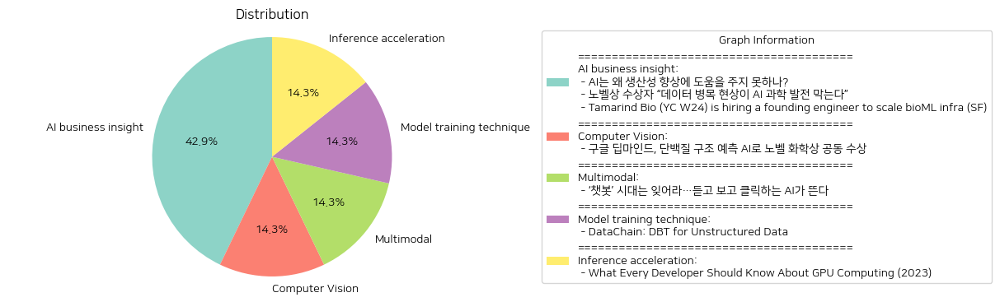

# Daily Artificial Intelligence Insights : News

## 🫧 AI business insight

**요약:**

**주요 주제**:   
이번 뉴스 기사에서 일관되게 발견되는 주제는 'AI와 데이터', '생산성 개선', '과학 발전' 입니다. 이 기사들은 AI의 능력과 한계, 데이터의 중요성, 그리고 AI와 생물학의 융합에 대한 논의를 담고 있습니다.

**주요 사건**:  
1. **AI와 생산성**: AI는 경제 발전을 이끌 수 있는 기술로 인식되지만, 생산성 개선을 위해 넘어야 할 중대한 문제가 존재합니다.  
2. **데이터 병목 현상**: 한 노벨상 수상자가 AI 과학 발전의 차질 원인으로 데이터 병목 현상을 지목하였습니다. 고품질 데이터의 중요성을 강조하고 있습니다.  
3. **Tamarind Bio에서의 채용**: Y Combinator의 지원을 받는 Tamarind Bio가 생물정보학 인프라를 확장하기 위한 엔지니어를 채용 중입니다. 이는 생명공학과 AI의 밀접한 협력 가능성을 시사합니다.

**영향 분석**:  
- **경제**: AI의 생산성 개선은 기술 발전의 주요 목표이며, 데이터 관리의 개선과 AI 기술 발전은 경제에 긍정적인 영향을 미칠 수 있습니다.  
- **과학과 기술**: 데이터 병목 현상의 해결 관리와 고품질 데이터의 확보는 AI를 활용한 과학적 발견을 촉진할 수 있습니다.  
- **사회**: AI와 바이오 기술의 융합은 건강과 의학적 조치, 맞춤형 치료의 발전에 기여할 것으로 기대됩니다.

**최종 요약**:  
이 뉴스들은 AI 기술이 생산성 향상과 과학 발전에 있어 직면한 과제들을 조명합니다. 데이터의 품질과 양은 AI 발전에 중요하며, 이를 처리할 인프라가 필요합니다. AI와 생명공학의 결합도 이와 관련된 새로운 직업 기회를 창출하고 있습니다. 향후 데이터 관리 기술의 발전, AI 사용 분야의 다변화 등이 중요한 발전 방향이 될 것입니다.

**출처:**

 - AI는 왜 생산성 향상에 도움을 주지 못하나? (https://www.technologyreview.kr/ai%eb%8a%94-%ec%99%9c-%ec%83%9d%ec%82%b0%ec%84%b1-%ed%96%a5%ec%83%81%ec%97%90-%eb%8f%84%ec%9b%80%ec%9d%84-%ec%a3%bc%ec%a7%80-%eb%aa%bb%ed%95%98%eb%82%98/)
 - 노벨상 수상자 “데이터 병목 현상이 AI 과학 발전 막는다” (https://www.technologyreview.kr/%eb%85%b8%eb%b2%a8%ec%83%81-%ec%88%98%ec%83%81%ec%9e%90-%eb%8d%b0%ec%9d%b4%ed%84%b0-%eb%b3%91%eb%aa%a9-%ed%98%84%ec%83%81%ec%9d%b4-ai-%ea%b3%bc%ed%95%99-%eb%b0%9c%ec%a0%84-%eb%a7%89%eb%8a%94/)
 - Tamarind Bio (YC W24) is hiring a founding engineer to scale bioML infra (SF) (https://www.ycombinator.com/companies/tamarind-bio/jobs/OEkMxsJ-founding-software-engineer)

## ✈️ Computer Vision

**요약:**

**1. 주요 주제**:  
- 인공지능과 과학의 교차점: 구글 딥마인드의 AI 기술이 단백질 구조 예측에 성공하여 노벨 화학상을 수상한 것이 주요 테마 중 하나입니다.

**2. 주요 사건**:  
- 구글 딥마인드의 데미스 허사비스와 존 점퍼는 AI를 사용하여 복잡한 단백질 접힘 문제를 해결한 공로로 노벨 화학상을 절반 수상했습니다.
- 나머지 절반의 화학상은 새로운 단백질을 설계한 데이비드 베이커에게 돌아갔습니다.

**3. 영향 분석**:  
- 경제: AI의 과학 연구 분야 활용이 증가함에 따라 관련 산업과 연구 지원에 긍정적인 영향을 끼칠 것으로 보입니다. 이는 신약 개발과 같은 분야에서 엄청난 경제적 기회를 창출할 수 있습니다.
- 사회: 과학적 발견과 기술 발전이 일반 대중에게 노출되어 AI에 대한 인식이 높아질 것입니다. 이는 AI 기술에 대한 신뢰도를 높일 뿐만 아니라, 기술 개발에 대한 사회적 지원을 활성화할 것입니다.
- 정치: AI 연구 및 활용을 둘러싼 규제와 정책 개발에 영향을 미칠 수 있으며, 각국의 AI 기술 발전 경쟁이 심화될 가능성이 있습니다.

**4. 최종 요약**:  
이번 노벨 화학상 수상은 AI 기술이 과학적 문제 해결에 있어 어떤 혁신적 역할을 할 수 있는지를 잘 보여줍니다. 구글 딥마인드의 성과는 앞으로 AI가 과학 분야 전반에 걸쳐 더욱 많은 응용 가능성을 탐색하게 할 것입니다. 이는 과학 연구의 효율성을 높이고, 더 빠르고 정확한 연구 결과를 가져올 수 있을 것입니다. 향후 AI의 발전이 경제 및 사회 전반에 걸쳐 어떤 변화를 불러일으킬지 주목해야 할 필요가 있습니다.

**출처:**

 - 구글 딥마인드, 단백질 구조 예측 AI로 노벨 화학상 공동 수상 (https://www.technologyreview.kr/%ea%b5%ac%ea%b8%80-%eb%94%a5%eb%a7%88%ec%9d%b8%eb%93%9c-%eb%8b%a8%eb%b0%b1%ec%a7%88-%ea%b5%ac%ec%a1%b0-%ec%98%88%ec%b8%a1-ai%eb%a1%9c-%eb%85%b8%eb%b2%a8-%ed%99%94%ed%95%99%ec%83%81-%ea%b3%b5%eb%8f%99/)

## 💚 Multimodal

**요약:**

1. **주요 주제**:
   - 인공지능(AI)의 진화: 기존의 텍스트 기반 AI 챗봇에서 더 발전된 음성과 영상 생성 기능을 갖춘 AI로의 전환이 이루어지고 있습니다.
   - 기술 혁신: 듣고 보고 클릭할 수 있는 AI 기술이 주목받고 있으며, 이는 다양한 산업 분야에 영향을 미치고 있습니다.

2. **주요 이벤트**:
   - 새로운 AI 시대의 개막: 텍스트 기반 챗봇 시대가 지나고, 음성과 영상 생성이 가능한 AI 기술이 부상하고 있습니다.

3. **영향 분석**:
   - 경제: AI 기술의 발전은 다양한 산업 분야에서 새로운 기회를 창출할 것으로 기대됩니다. 특히, 미디어와 엔터테인먼트 산업에서는 콘텐츠 생성의 혁신이 이뤄질 가능성이 큽니다.
   - 사회: AI의 발전은 사용자 경험을 극대화하며, 개인화된 서비스 제공이 향상될 것입니다. 이는 사회 전반에 걸쳐 편리함과 더 나은 서비스 품질을 제공할 수 있습니다.

4. **최종 요약**:
   - 인공지능 기술은 텍스트 기반 단계에서 벗어나 음성과 영상에서도 두각을 나타내고 있으며, 이는 경제와 사회 전반에 걸쳐 중요한 영향을 미칠 것입니다. 이러한 기술 혁신이 이루어짐에 따라, 전문가들은 AI 기술의 잠재력을 주의 깊게 관찰하고, 향후 발전 방향에 대해 지속적인 관심이 필요합니다. AI의 발전이 가져올 변화와 도전에 대비하는 것이 중요합니다.

**출처:**

 - ‘챗봇’ 시대는 잊어라…듣고 보고 클릭하는 AI가 뜬다 (https://www.technologyreview.kr/%ec%b1%97%eb%b4%87-%ec%8b%9c%eb%8c%80%eb%8a%94-%ec%9e%8a%ec%96%b4%eb%9d%bc-%eb%93%a3%ea%b3%a0-%eb%b3%b4%ea%b3%a0-%ed%81%b4%eb%a6%ad%ed%95%98%eb%8a%94-ai%ea%b0%80-%eb%9c%ac%eb%8b%a4/)

## 👽 Model training technique

**요약:**

**1. 주요 테마**:
   주요 테마는 최신 데이터 관리 기술의 진화와 데이터 체인의 역할입니다. 이러한 기술 발전은 AI 모델과 API 통합, 대규모 데이터 관리 등 데이터 스택을 현대적인 방식으로 혁신하는 것입니다.

**2. 주요 사건**:
   DataChain은 AI와 Python 기반의 데이터프레임 라이브러리로, 비정형 데이터를 대규모로 조직하고 정리하는 중요한 기술적 발전을 이루었습니다. 이는 AI 모델과 API 호출을 통합하여 데이터 처리 및 관리 효율성을 높이는 방법을 제시합니다.

**3. 영향 분석**:
   - **경제**: 데이터 관리 및 처리의 효율성 증가로 데이터 중심 기업의 경쟁력이 강화될 것으로 예상됩니다. 이는 새로운 AI 기술에 기반한 비즈니스 모델과 서비스를 창출할 수 있어 경제에 긍정적인 영향을 미칠 수 있습니다.
   - **정치**: 데이터 관리 기술의 발전은 정책 결정과 행정 프로세스에서 정확하고 신속한 데이터 활용을 가능하게 하여 효율성을 높일 수 있습니다.
   - **사회**: 대량의 비정형 데이터를 효율적으로 관리할 수 있게 되어, 다양한 사회 문제 해결에 필요한 데이터를 보다 쉽게 분석하고 활용할 수 있습니다.

**4. 최종 요약**:
   종합적으로, 높은 수준의 데이터 관리 기술 발전을 이룬 DataChain은 AI와 데이터 사이언스 분야에서 중요한 도약을 이루고 있습니다. 이는 경제 분야에서 데이터 중심의 혁신을 촉진하고, 사회적 문제 해결을 위해 데이터를 더욱 의미 있게 활용할 수 있는 기회를 제공할 것입니다. 앞으로 데이터 처리와 관련한 기술 발전과 AI 통합이 어떻게 더 발전할지 주목할 필요가 있습니다.

**출처:**

 - DataChain: DBT for Unstructured Data (https://github.com/iterative/datachain)

## 🪸 Inference acceleration

**요약:**

**요약 보고서 - 2023년 GPU 컴퓨팅의 이해**

1. **핵심 주제**:
   이 기사에서 다룬 주요 주제는 GPU 컴퓨팅의 주요 특성과 구조입니다. 특히 대규모 병렬 처리 및 높은 처리량을 위한 GPU 설계, 명령 지연 시간 감소와 계산 능력 증가를 목표로 하는 방식을 강조하고 있습니다. 이러한 구조의 핵심 요소는 스트리밍 멀티프로세서, 레지스터, 공유 메모리, 전역 메모리로 구성되며, 이는 커널의 효율적 실행과 높은 점유율을 가능하게 합니다.

2. **주요 사건**:
   이 기사에서는 GPU의 구조와 그 기능적 장점에 대해 설명하며, GPU가 어떻게 컴퓨팅 환경에서 병렬 처리 능력을 증대시키는지에 대한 정보를 제공합니다. GPU의 아키텍처는 고성능 컴퓨팅 작업 수행 시 어떻게 효율성을 높일 수 있는지를 설명하고 있습니다.

3. **영향 분석**:
   - **경제**: GPU 기술의 발달은 인공지능 및 고성능 컴퓨팅 시장의 성장을 더욱 가속화할 것으로 보입니다. 이는 관련 산업의 투자 증가와 함께 더 많은 기술적인 발전을 촉진시킬 것입니다.
   - **사회**: GPU의 발전은 게임 및 미디어 산업의 콘텐츠 품질 증가뿐만 아니라 데이터과학 및 AI 연구에 대한 접근성을 높일 것입니다. 이는 사회 전반의 기술 격차를 줄이는 데 기여할 수 있습니다.
   - **기술 개발**: 데이터 처리 및 해석 속도의 증가로 인해 과학 연구 및 개발 프로세스가 가속화될 것입니다.

4. **최종 요약**:
   전반적으로, GPU 컴퓨팅에 대한 이해는 컴퓨터 과학 및 공학자의 필수 과제로 여겨지며, 이는 향후 기술 발전을 주도할 중요한 요소로 자리 잡을 것입니다. GPU 아키텍처의 지속적인 발전은 다양한 분야에 걸쳐 혁신을 주도할 것이며, 이러한 기술 발전이 경제와 사회에 미치는 긍정적인 영향을 모니터링할 필요가 있습니다. 향후에는 GPU의 에너지 효율성과 비용 효율성을 개선하려는 노력이 더욱 중요해질 것으로 예상됩니다.

**출처:**

 - What Every Developer Should Know About GPU Computing (2023) (https://blog.codingconfessions.com/p/gpu-computing)

