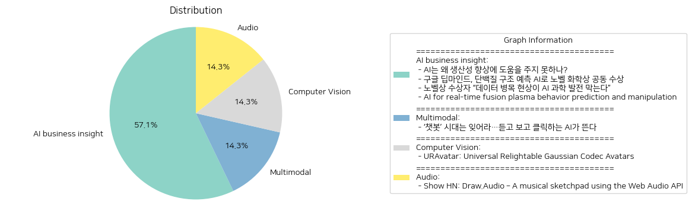

# Daily Artificial Intelligence Insights : News

## 🌿 AI business insight

**요약:**

**주요 주제**:
모든 뉴스 기사에서 공통적으로 나타나는 주제는 인공지능(AI)의 과학적 및 기술적 발전과 그 활용 가능성입니다. 뉴스는 AI가 생산성 향상에 미치는 영향과 그 한계, 과학 발전을 위한 AI의 혁신적 역할, 그리고 AI를 이용한 특정 기술 문제의 혁신적 해결책 제시에 대해 다루고 있습니다.

**주요 사건**:
1. 'AI는 왜 생산성 향상에 도움을 주지 못하나?' 기사에서는 AI가 경제 생산성 개선에 대한 기대에 부응하지 못하는 이유와 필요한 개선 사항을 다룹니다.
2. '구글 딥마인드, 단백질 구조 예측 AI로 노벨 화학상 공동 수상'에서는 구글 딥마인드 팀이 AI를 통해 단백질 접힘 문제를 해결하여 노벨 화학상을 수상한 사실을 보도합니다.
3. '노벨상 수상자 “데이터 병목 현상이 AI 과학 발전 막는다”'에서는 AI를 과학적 발견에 활용하기 위해 필요한 고품질 데이터의 중요성을 강조합니다.
4. 'AI for real-time fusion plasma behavior prediction and manipulation'에서는 AI를 이용하여 복잡한 융합 플라즈마 시스템의 행동을 예측하고 조작하는 기술의 개발을 보도합니다.

**영향 분석**:
- **경제**: AI의 생산성 향상 문제는 경제 전반에 걸친 효율성을 저해할 수 있으며, 이로 인해 기술 도입의 제약 요소로 작용할 수 있습니다.
- **과학 및 기술**: 구글 딥마인드의 업적과 융합 플라즈마 예측 연구는 과학과 기술 혁신의 모범 사례로, 해당 분야의 연구 방향을 안내하고 가속화할 수 있습니다.
- **사회**: AI기술의 발전과 이를 통한 문제 해결은 사회 각 분야에서 원격 작업과 연구의 효율성을 증대시키며, 차세대 학습과 연구 방법론의 변화를 촉진할 것입니다.

**최종 요약**:
이번 뉴스들은 AI의 잠재적 활용과 현재의 제약 조건을 잘 드러냅니다. AI 기술은 노벨상 수상으로 그 혁신적 가능성을 입증했으나, 양질의 데이터 확보와 생산성 제고를 위한 개선이 필요하다는 한계도 지적됩니다. 향후 AI 기술은 고품질 데이터 활용, 특정 산업 적용의 효율 증대 등을 중심으로 발전할 것이며, 융합 플라즈마와 같은 특정 과학 기술 문제 해결에 더욱 집중될 것입니다. 이러한 전개는 다양한 분야에서 AI의 응용 폭을 넓히고, 관련 정책 및 산업 전략에 큰 영향을 미칠 것으로 예상됩니다.

**출처:**

 - AI는 왜 생산성 향상에 도움을 주지 못하나? (https://www.technologyreview.kr/ai%eb%8a%94-%ec%99%9c-%ec%83%9d%ec%82%b0%ec%84%b1-%ed%96%a5%ec%83%81%ec%97%90-%eb%8f%84%ec%9b%80%ec%9d%84-%ec%a3%bc%ec%a7%80-%eb%aa%bb%ed%95%98%eb%82%98/)
 - 구글 딥마인드, 단백질 구조 예측 AI로 노벨 화학상 공동 수상 (https://www.technologyreview.kr/%ea%b5%ac%ea%b8%80-%eb%94%a5%eb%a7%88%ec%9d%b8%eb%93%9c-%eb%8b%a8%eb%b0%b1%ec%a7%88-%ea%b5%ac%ec%a1%b0-%ec%98%88%ec%b8%a1-ai%eb%a1%9c-%eb%85%b8%eb%b2%a8-%ed%99%94%ed%95%99%ec%83%81-%ea%b3%b5%eb%8f%99/)
 - 노벨상 수상자 “데이터 병목 현상이 AI 과학 발전 막는다” (https://www.technologyreview.kr/%eb%85%b8%eb%b2%a8%ec%83%81-%ec%88%98%ec%83%81%ec%9e%90-%eb%8d%b0%ec%9d%b4%ed%84%b0-%eb%b3%91%eb%aa%a9-%ed%98%84%ec%83%81%ec%9d%b4-ai-%ea%b3%bc%ed%95%99-%eb%b0%9c%ec%a0%84-%eb%a7%89%eb%8a%94/)
 - AI for real-time fusion plasma behavior prediction and manipulation (https://control.princeton.edu/machine-learning-for-rt-profile-control-in-tokamaks/)

## 🩵 Multimodal

**요약:**

**1. 주요 주제**:
   이번 뉴스 기사에서 집중적으로 다루는 주제는 인공지능(AI)의 발전과 변화입니다. 특히, 텍스트 기반 AI 챗봇에서 음성과 영상 생성 능력을 갖춘 진보된 AI 기술의 부상에 대한 이야기입니다. 이는 기술 진화의 흐름과 AI가 디지털 인터페이스의 중요한 에이전트로 자리잡고 있는 추세를 반영합니다.

**2. 주요 이벤트**:
   - AI 기술이 텍스트 중심에서 더욱 발전된 음성 및 영상 기반으로 확장되고 있다는 것을 강조한 기사는, 새로운 AI 시대가 시작되고 있음을 시사하고 있습니다. 

**3. 영향 분석**:
   이러한 AI의 발전은 여러 분야에 걸쳐 중요한 영향을 미칠 것으로 보입니다.
   - **경제**: AI 기술이 진화함에 따라 관련 산업들은 더 많은 시장 기회를 창출할 수 있으며, 이는 고용 및 경제 성장에 긍정적인 영향을 줄 수 있습니다.
   - **정치**: 개인화된 AI 도구의 등장으로 인해 정치 캠페인 및 대중과의 소통 방식도 변화할 가능성이 높습니다.
   - **사회**: 사람들과의 상호작용이 강화되면서 AI가 미치는 사회적 영향력도 더 커질 수 있으며, 사생활 보호와 같은 문제로 논의가 필요할 것입니다.

**4. 최종 요약**:
   수집된 뉴스는 AI 기술이 단순한 도구에서 인간과의 상호작용을 위한 능동적 매체로 진화하고 있음을 보여줍니다. 이는 경제와 사회 전반에 걸쳐 변화의 물결을 일으킬 가능성이 높습니다. AI를 통해 사용자 경험이 혁신될 뿐 아니라, 새로운 사회적 규범과 법적 기준이 마련되어야 할 것입니다. 미래에는 AI 기술과 관련된 윤리적이고 법적인 논의가 더욱 활발해질 것이며, 기술 혁신 속도에 대응하기 위한 정책적 대응 또한 중요할 것입니다.

**출처:**

 - ‘챗봇’ 시대는 잊어라…듣고 보고 클릭하는 AI가 뜬다 (https://www.technologyreview.kr/%ec%b1%97%eb%b4%87-%ec%8b%9c%eb%8c%80%eb%8a%94-%ec%9e%8a%ec%96%b4%eb%9d%bc-%eb%93%a3%ea%b3%a0-%eb%b3%b4%ea%b3%a0-%ed%81%b4%eb%a6%ad%ed%95%98%eb%8a%94-ai%ea%b0%80-%eb%9c%ac%eb%8b%a4/)

## 🍊 Computer Vision

**요약:**

1. **주요 테마**:
   URAvatar의 주요 테마는 포토리얼리스틱 헤드 아바타 생성, 모바일 스캔을 통한 현실감 있는 애니메이션 및 리라이팅 기술의 발전입니다. 또한 다각도의 인체 스캔을 훈련하여 정확성과 일반화를 달성하는 보편적 리라이팅 아바타 모델에 중점을 두고 있습니다.

2. **주요 사건**:
   이번 뉴스에서 가장 중요한 이야기는 URAvatar 접근법이 미지의 조명 조건 아래에서도 휴대폰 스캔을 통해 포토리얼리스틱한 머리 아바타를 생성할 수 있다는 것입니다. 이 기술은 실시간 애니메이션과 리라이팅이 가능하며, 다중 뷰 인체 스캔을 활용하여 높은 정확성과 일반화를 이루어냈습니다.

3. **영향 분석**:
   - **경제**: 이 기술의 발달은 게임, 영화 산업뿐만 아니라 소셜 미디어 플랫폼에서도 개인화된 아바타 사용을 증가시켜 관련 시장의 경제적 이익을 높일 것으로 예상됩니다.
   - **사회**: 실제와 같은 아바타의 활성화는 가상 현실(VR) 및 증강 현실(AR) 기술의 사용 확대를 촉진하여 새로운 형태의 사회적 상호작용 및 커뮤니케이션 방식을 발전시킬 수 있습니다.

4. **최종 요약**:
   URAvatar 기술은 디지털 아바타 제작의 새로운 장을 열어 다양한 산업 분야에 걸쳐 경제적, 사회적 변화를 불러올 가능성이 큽니다. 이 기술은 개인화된 콘텐츠 생성의 발전과 새로운 형태의 커뮤니케이션 방식 촉진에 중요한 역할을 할 것으로 보이며, 향후 발전 방향으로는 더 자연스러운 상호작용을 위한 인공지능과의 융합, 보다 정확한 현실 적합성을 위한 지속적 기술 개발 등이 주목받을 것입니다.

**출처:**

 - URAvatar: Universal Relightable Gaussian Codec Avatars (https://junxuan-li.github.io/urgca-website/)

## 🩵 Audio

**요약:**

입력:

- 제목: 'Show HN: Draw.Audio – A musical sketchpad using the Web Audio API'
- 요약: 'Draw.Audio는 소리와 예술 분야에서 아이디어를 탐구하기 위한 무료 음악 스케치 패드입니다. 종합적인 신디사이저, 시퀀서 및 드로잉 도구입니다.'

---

1. **주요 테마**:
   이 뉴스 기사는 디지털 도구 및 기술의 창의적 사용을 강조하고 있습니다. 특히, 웹 오디오 API를 이용한 음향 및 예술 아이디어 탐구를 지원하는 도구 개발이 주요 테마로 나타나고 있습니다.

2. **주요 사건**:
   Draw.Audio라는 무료 음악 스케치 패드의 런칭이 중요한 사건으로 부각됩니다. 이 도구는 신디사이저와 시퀀서, 그리기 도구를 통합하여 사용자가 소리와 시각적 예술의 아이디어를 탐구할 수 있게 합니다.

3. **영향 분석**:
   - **경제**: 이러한 혁신적인 도구의 등장은 디지털 예술 산업과 음악 제작 소프트웨어 분야에 긍정적인 영향을 미칠 수 있습니다. 이는 창작자가 저비용으로 새로운 콘텐츠를 생산할 수 있도록 도와주며, 소프트웨어 도구 시장의 성장을 촉진할 수 있습니다.
   - **사회**: 창의적 탐구를 장려하여 예술과 기술의 융합을 촉진할 수 있습니다. 이는 교육 분야에서도 학생들의 예술적 표현과 기술적 이해를 심화시키는 데 기여할 수 있습니다.

4. **최종 요약**:
   이번 뉴스에서 소개된 Draw.Audio는 음악 및 예술 창작 도구의 혁신을 통해 디지털 예술과 기술 융합에 중요한 발전을 가져올 것으로 보입니다. 이러한 발명은 창작자에게 새로운 기회를 제공하며 예술과 기술의 경계를 확장할 수 있습니다. 앞으로 이러한 도구의 발전이 사회 전반에 걸쳐 창의적 아이디어 개발에 미치는 영향을 주목해볼 필요가 있습니다.

**출처:**

 - Show HN: Draw.Audio – A musical sketchpad using the Web Audio API (https://draw.audio)

