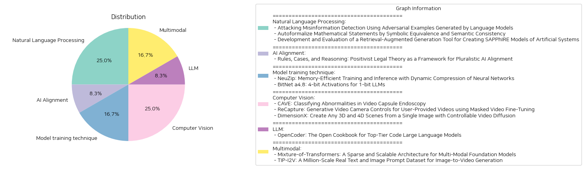

# Daily Artificial Intelligence Insights : Papers

## 🫧 Natural Language Processing

**요약:**

**종합 요약 보고서**

1. **주요 주제 및 테마 추출:**
   - '허위 정보 탐지에 대한 공격: 언어 모델로 생성된 적대적 예제를 사용한 테스트.'
   - '수리적 진술의 자동 형식화: 상징적 등가성과 의미론적 일관성을 통해.'
   - 'SAPPhIRE 모델 생성을 위한 검색 강화 생성 도구 개발 및 평가.'

2. **공통 키워드, 트렌드, 패턴 식별:**
   - 대형 언어 모델(Large Language Models, LLMs)의 사용 증가: 세 가지 논문 모두에서 LLM이 중요한 역할을 하고 있음을 볼 수 있습니다.
   - 자동화 및 알고리즘 개발: 자동 형식화, 적대적 예제 생성, 정보 생성 도구 등 다양한 기술 발전이 이루어지고 있습니다.
   - 의미 보존 및 정확성 향상: 알고리즘 개발의 주요 초점은 의미의 일관성을 유지하면서 정확성을 높이는 것입니다.

3. **논문 별 주요 이벤트 및 핵심 정보 요약:**
   - 첫 번째 논문에서는 텍스트 분류 알고리즘의 견고성을 테스트하기 위해, 허위 정보를 탐지하는 과정에서 적대적 예제를 생성하는 방법을 조사합니다. 제안된 방법(TREPAT)이 긴 입력 텍스트에서 특히 효과적임을 실험으로 확인했습니다.
   - 두 번째 논문은 자연 언어 수학 문제를 형식 언어로 자동 변환하는 자동 형식화의 정확성을 개선하기 위한 프레임워크를 제안합니다. 이 방법은 상징적 등가성과 의미론적 일관성을 기반으로 하여 후보 중 최고의 결과를 선택합니다.
   - 세 번째 논문은 인공 시스템에 대해 SAPPhIRE 모델을 생성하기 위한 검색 강화 생성 도구의 개발과 평가를 다룹니다. 본 연구는 기술 문서에서 필요한 정보를 수집하여 SAPPhIRE 원인 모델에 맞춘 구조적 설명을 효과적으로 생성하는 방법을 탐구합니다.

4. **이벤트들이 다양한 분야에 미치는 영향 분석:**
   - 정보 보안 분야: 허위 정보 탐지의 강화는 정보의 신뢰성을 높이고, 허위 정보의 영향력을 감소시킬 수 있습니다.
   - 교육 및 학문 분야: 수학 문제의 자동 형식화는 교육 기술을 진보시키고, 학습자에게 유용한 도구가 될 수 있습니다.
   - 시스템 설계 및 엔지니어링 분야: SAPPhIRE 모델은 디자인 과정의 효율성을 높이고, 설계 대안을 보다 쉽게 탐색할 수 있게 합니다.

5. **최종 종합 결론과 미래의 발전 방향:**
   - 대형 언어 모델의 활용은 다양한 분야에서 전반적으로 혁신을 가져오고 있으며, 이러한 기술 발전은 앞으로 더 다양한 응용을 가능하게 할 것입니다.
   - 정보의 정확성과 의미 보존을 중점적으로 연구하여, 다양한 알고리즘과 도구의 발전이 예상됩니다.
   - 이러한 연구들의 성과물은 다른 분야와의 연계를 통해 더 많은 혁신적인 솔루션을 제공할 잠재력을 가지고 있으며, 다양한 산업에서 폭넓게 활용될 것으로 기대됩니다.

**출처:**

 - Attacking Misinformation Detection Using Adversarial Examples Generated by Language Models (https://deeplearn.org/arxiv/541784/attacking-misinformation-detection-using-adversarial-examples-generated-by-language-models)
 - Autoformalize Mathematical Statements by Symbolic Equivalence and Semantic Consistency (https://deeplearn.org/arxiv/541786/autoformalize-mathematical-statements-by-symbolic-equivalence-and-semantic-consistency)
 - Development and Evaluation of a Retrieval-Augmented Generation Tool for Creating SAPPhIRE Models of Artificial Systems (https://deeplearn.org/arxiv/542108/development-and-evaluation-of-a-retrieval-augmented-generation-tool-for-creating-sapphire-models-of-artificial-systems)

## 🎠 AI Alignment

**요약:**

1. 핵심 주제 및 테마 추출:
   - 법 이론과 AI 정렬
   - 다원주의와 명시화 문제
   - 법과 AI의 규칙과 사례 적용

2. 공통 키워드, 트렌드, 패턴 식별:
   - 법적 이론과 AI 정렬의 상호작용
   - 다원주의 가치와 관점의 보존
   - AI를 활용한 규칙의 구체적인 내용 파악

3. 주요 사건 및 중요한 정보 요약:
   이 연구는 법적 이론이 AI 정렬의 다원주의와 명시화 문제를 해결하는 데 어떻게 기여할 수 있는지를 탐구한다. 법 체계에서는 민주적 권위에 의해 제정된 일반 규칙이 시간이 지남에 따라 구체적인 적용을 통해 그 내용을 얻으며, 이 과정에서 다양한 가치와 관점의 불일치를 유지한다. 이러한 법적 접근은 AI가 규칙에 구체적인 내용을 제공하는 사례를 생성함으로써 다원주의적인 정렬을 추구하는 데 유용하다.

4. 이러한 사건이 다양한 부문에 미치는 영향 분석:
   - AI 연구 분야에서는 법적 접근을 통해 다원주의적 원칙을 구현하여 보다 공정한 AI 시스템 개발에 기여 가능.
   - 법률 시스템에서는 AI 기술의 활용을 통해 규칙의 구체적인 적용을 향상시키며 민주적 정렬을 촉진.

5. 종합 보고서 및 결론:
   법적 이론의 AI 정렬 적용은 다원주의적인 관점을 보존하면서 일반적인 법률 규칙을 구체화하는 데 기여할 수 있다. 이는 AI 시스템이 민주적 가치와 일치하도록 정렬하는 새로운 블루프린트를 제공한다. 앞으로는 AI 기술을 이용해 법적 규칙의 적용 사례를 생성하고, 이를 통해 더욱 공정하고 포용적인 AI 시스템 개발에 노력할 필요가 있다. 향후 AI와 법률의 상호작용이 더 많은 연구와 적용을 통해 진전될 것으로 기대된다.

**출처:**

 - Rules, Cases, and Reasoning: Positivist Legal Theory as a Framework for Pluralistic AI Alignment (https://deeplearn.org/arxiv/541785/rules,-cases,-and-reasoning:-positivist-legal-theory-as-a-framework-for-pluralistic-ai-alignment)

## 💚 Model training technique

**요약:**

1. 주요 주제 및 테마 추출:
   - 첫 번째 논문: 'NeuZip'는 신경망의 동적 압축을 통해 메모리 효율적인 훈련과 추론을 가능하게 하며, 성능을 유지하면서 메모리 사용량을 크게 줄이는 방법을 소개함.
   - 두 번째 논문: 'BitNet a4.8'는 1비트 대형 언어 모델을 위한 4비트 활성화 방법을 소개하며, 양자화와 희소화 전략을 사용해 추론 속도를 높이고 효율성을 향상시킴.

2. 공통 키워드, 트렌드 및 패턴 식별:
   - 메모리 효율성: 두 논문 모두 메모리 사용량을 절감하면서 성능을 유지할 수 있는 방법을 탐구.
   - 압축 및 양자화: 'NeuZip'와 'BitNet a4.8' 모두 중간 상태의 양자화 및 압축을 통해 성능 저하를 최소화하고 효율성을 높임.
   - 대형 모델의 운영 비용 절감: LLM의 운영 및 추론 비용을 줄이기 위한 다양한 전략을 제시.

3. 각 논문의 주요 사건 및 중요 정보 요약:
   - NeuZip 논문에서는 Llama-3 8B 모델의 메모리 사용량을 31GB에서 16GB 이하로 줄이며, 훈련 동력을 그대로 유지할 수 있는 방법을 소개함.
   - BitNet a4.8 논문은 1비트 LLM에 4비트 활성화 방법을 도입하여 성능을 유지하면서 추론 속도를 높였고, 55%의 매개변수만 활성화하여 대규모 LLM 배포 및 추론의 효율성을 강화함.

4. 이러한 사건이 다양한 분야에 미치는 영향 분석:
   - 인공지능 모델의 운영 비용 절감에 기여: NeuZip과 BitNet a4.8 모두 메모리 사용량 절감과 성능 유지의 균형을 통해 대형 AI 모델의 효율적인 운영이 가능하게 함.
   - 신경망의 접근성 증대: 메모리 효율성과 성능 유지의 균형은 개발자 및 연구자들이 더 다양한 장치에서 AI 모델을 사용할 수 있게 하며, 이는 AI 기술의 확산에 기여할 수 있음.

5. 최종 종합 요약 및 앞으로 주목해야 할 잠재적 발전 사항:
   - NeuZip과 BitNet a4.8의 연구는 메모리 효율성을 극대화하면서 대형 언어 모델의 성능을 유지하는 데 있어 중요한 발전을 이루었음.
   - 이러한 연구는 앞으로 대형 AI 모델을 보다 효율적으로 운영하고 다양한 애플리케이션에 활용될 수 있는 가능성을 제시하며, 이를 통해 AI 기술의 범용성과 접근성을 더욱 높일 수 있을 것으로 기대됨.

**출처:**

 - NeuZip: Memory-Efficient Training and Inference with Dynamic Compression of Neural Networks (https://deeplearn.org/arxiv/541978/neuzip:-memory-efficient-training-and-inference-with-dynamic-compression-of-neural-networks)
 - BitNet a4.8: 4-bit Activations for 1-bit LLMs (http://arxiv.org/abs/2411.04965v1)

## 🪐 Computer Vision

**요약:**

**종합 요약 보고서**

1. **주요 주제 및 테마 추출:**
   - **영상 캡슐 내시경 이상 진단:** 'CAVE' 연구는 복잡한 이미지 데이터 셋에서 분류 정확성을 향상시키기 위한 앙상블 기반 접근 방식을 탐구한다.
   - **사용자 제공 영상의 새로운 카메라 경로 생성:** 'ReCapture' 연구에서는 사용자 제공 비디오의 장면을 보다 다양한 각도와 영화적인 카메라 움직임이 가능한 새로운 비디오로 재생성하는 방법을 제시한다.
   - **단일 이미지에서 3D 및 4D 장면 생성:** 'DimensionX'는 단일 이미지로부터 3D 및 4D 장면을 생성하며, 비디오 확산 모델을 활용해 공간 및 시간적 제어력을 강화한다.

2. **공통 키워드 및 트렌드 식별:**
   - **비디오 확산 및 재생성:** 세 개의 연구는 모두 비디오 생성 및 재생성 기술을 중심으로 하며, 특히 공간과 시간의 요인을 분리하여 보다 정밀하게 제어할 수 있는 방법들을 모색하고 있다.
   - **신경망과 머신러닝 모델:** 연구들에서 다양한 머신러닝 모형(예: DNN, CBAM, 랜덤 포레스트 등)이 활용되며, 복잡한 데이터셋의 해석과 예측 정확성을 높이는 데 사용되고 있다.

3. **각 논문에서의 주요 사건 및 중요 정보 요약:**
   - **CAVE:** CBAM과 DNN을 결합하여 영상 캡슐 내시경 이미지의 분류 정확성을 높임. 추가 모델(랜덤 포레스트, XGBoost, SVM, KNN)을 도입하여 에셈블의 예측력을 높였다.
   - **ReCapture:** 기존의 사용자 제공 비디오에 대해 새로운 카메라 경로를 생성하여 영상 재생성을 가능케 하는 방법을 제시. 이 방법은 보이지 않던 장면도 효과적으로 복원 가능.
   - **DimensionX:** 영상 프레임의 공간적, 시간적 요인을 통제하여 단일 이미지에서 3D 및 4D 장면을 생성함. 실제 세계와 생성된 영상 간의 차이를 줄이는 다양한 전략을 채택.

4. **이벤트가 다양한 분야에 미치는 영향 분석:**
   - **의료 영상 분석 분야:** 'CAVE' 기술은 내시경을 이용한 의료 영상 분석의 정확도를 높이고, 궁극적으로 진단 프로세스의 효율성을 개선할 수 있다.
   - **영상 제작 및 편집 분야:** 'ReCapture'는 영상 제작자들에게 사용자 제공 영상을 다양한 방법으로 재창조할 수 있는 새로운 도구를 제공한다.
   - **컴퓨터 그래픽 및 게임 분야:** 'DimensionX'는 3D 및 4D 장면을 보다 현실적으로 구현하여 게임 및 컴퓨터 그래픽 분야에서 혁신적인 발전을 꾀할 수 있다.

5. **최종 종합 요약 및 결론:**
   - 이들 연구는 모두 첨단 영상 처리 및 재생성 기술의 발전을 탐구하고 있으며, 인공지능과 머신러닝을 활용하여 다양한 분야에서 혁신적인 활용 가능성을 보여준다. 앞으로 이러한 기술이 더 다양한 실제 응용 분야로 확장되어 사용할 것으로 예상되며, 의료, 영상 제작, 컴퓨터 그래픽 분야에서의 발전을 주목할 필요가 있다.

**출처:**

 - CAVE: Classifying Abnormalities in Video Capsule Endoscopy (https://deeplearn.org/arxiv/542258/cave:-classifying-abnormalities-in-video-capsule-endoscopy)
 - ReCapture: Generative Video Camera Controls for User-Provided Videos using Masked Video Fine-Tuning (http://arxiv.org/abs/2411.05003v1)
 - DimensionX: Create Any 3D and 4D Scenes from a Single Image with Controllable Video Diffusion (http://arxiv.org/abs/2411.04928v1)

## 🚀 LLM

**요약:**

보고서 요약:

1. 주요 주제 및 테마:
   - 코드 생성, 논리적 추론 작업, 에이전트 시스템에서의 대형 언어 모델(LLMs)의 중요성.
   - 오픈 코드 LLMs의 성능이 상용 모델과 점점 유사해지고 있으며, 과학적 연구에 적합한 고품질 코드 LLM의 희소성 문제.
   - OpenCoder 프로젝트는 최첨단 코드 LLM의 성능을 제공하며, 재현 가능한 데이터 처리 파이프라인과 투명한 교육 프로토콜을 특징으로 함.

2. 공통 키워드, 트렌드 및 패턴:
   - 고성능 LLMs, 오픈 액세스, 재현성, 데이터 처리, 윤리적 고려 사항.
   - 자원의 제약 및 경쟁적 이점으로 인해 모델의 기술적 진보가 제한됨.
   - 오픈 데이터 및 투명한 교육 프로토콜의 중요성.

3. 주요 이벤트 및 중요한 정보 요약:
   - OpenCoder는 고성능 코드 LLM보다 뛰어난 성능을 목표로 하며, 연구 커뮤니티를 위한 "오픈 요리책" 역할을 함.
   - 모델의 가중치, 추론 코드, 재현 가능한 학습 데이터, 데이터 처리 파이프라인, 실험적 절단 결과 및 상세한 교육 프로토콜 모두 공개.
   - 코드 관련 문자 코퍼스의 회상, 데이터 중복 제거 방법, 고품질 합성 데이터를 만드는 기술의 도입.
   - 오픈 코더는 과학적 연구를 가속화하고 코드 AI의 재현 가능한 발전을 지원하는 기초를 제공.

4. 사건이 다양한 부문에 미치는 영향 분석:
   - 연구자와 개발자는 OpenCoder를 통해 코드 AI에 대한 접근성과 연구 기회를 확대할 수 있음.
   - 오픈 데이터와 투명성이 향상되면 윤리적 문제에 대한 해결책 모색 가능성이 커짐.
   - 오픈 교육 프로토콜은 과학적 발전과 협력을 강조할 것으로 기대됨.

5. 결론 및 주목할 만한 미래 발전:
   - OpenCoder의 출시는 고품질 코드 LLM를 만드는 데 필요한 핵심 요소를 공개하여 연구와 혁신의 범위를 확장함.
   - 투명하고 재현 가능한 연구 환경의 중요성이 강조되면서, 더 많은 연구 커뮤니티가 참여할 것으로 예상됨.
   - 장기적으로는 다양한 분야에서의 코드 AI 발전과 새로운 응용 프로그램의 개발을 촉진할 가능성이 있음.

**출처:**

 - OpenCoder: The Open Cookbook for Top-Tier Code Large Language Models (http://arxiv.org/abs/2411.04905v1)

## 👽 Multimodal

**요약:**

**종합 보고서: 현대 멀티모달 AI 및 데이터셋 발전**

1. **주요 주제 및 테마 추출:**
   - 멀티모달 AI 시스템 개발: 텍스트, 이미지, 음성 데이터를 하나의 모델에서 처리하는 시스템.
   - 대규모 데이터 및 컴퓨팅 자원의 요구 사항 증대.
   - 이미지-비디오 변환 모델 발전: 콘텐츠 생성의 혁신.
   - 대규모 데이터셋의 중요성: 다양한 사용자 제공 텍스트 및 이미지 프롬프트를 포함한 새로운 데이터셋의 개발.

2. **공통 키워드, 트렌드 및 패턴 식별:**
   - '멀티모달': 다양한 데이터 형태(텍스트, 이미지, 음성)를 결합하여 처리하는 방식.
   - '효율성': 계산 비용을 줄이고 성능을 유지 또는 향상시키는 전략.
   - '데이터셋의 중요성': 대규모 데이터셋이 모델 연구 및 평가에 미치는 영향.
   - '프롬프트 기반 생성': 텍스트 및 이미지를 기반으로 한 콘텐츠 생성 및 연구의 중심 위치.

3. **주요 이벤트 및 중요 정보 요약:**
   - **Mixture-of-Transformers (MoT)**: 멀티모달 트랜스포머 아키텍처로, 연산 비용을 크게 줄이면서 성능을 유지하는 데 중점을 둔다. MoT는 텍스트-이미지 생성에서 FLOPs를 55.8%로, 음성 포함시 37.2%로, 그리고 이미지 모달리티 성능을 높은 FLOPs 효율로 달성한다.
   - **TIP-I2V 데이터셋**: 새로운 데이터셋으로, 1.70백만 개 이상의 사용자 제공 텍스트 및 이미지 프롬프트를 포함하여 이미지-비디오 생성 연구를 위한 기반을 제공. 기존 데이터셋과의 차별성을 보여주며 연구자들이 사용자 선호를 분석하고 모델의 안전성을 개선하는 데 중요한 도구가 된다.

4. **이벤트가 다양한 부문에 미치는 영향 분석:**
   - **연구 및 개발 부문**: MoT와 같은 효율적인 모델은 대규모 데이터 처리 및 분석 비용을 줄이며, TIP-I2V는 다양한 연구 및 안전성 평가에 기여한다.
   - **콘텐츠 생성 산업**: 이미지-비디오 변환 모델을 통해 보다 창의적이고 일관된 콘텐츠 생성이 가능해진다.
   - **데이터 과학 및 AI 안전성**: 대규모 데이터셋을 활용하여 모델의 다각적 성능을 평가하고 편향이나 오정보를 줄이는 데 기회가 제공된다.

5. **종합 결론 및 관찰할 향후 발전:**
   - 멀티모달 AI와 관련된 연산 효율성 향상은 지속적으로 중요한 연구 방향이 될 것이다.
   - TIP-I2V와 같은 데이터셋은 이미지-비디오 연구의 견인차 역할을 하며, 이러한 데이터셋의 발전이 미래 모델의 안전성 및 성능 평가에 중요한 역할을 할 것으로 예상된다.
   - 향후 연구에서는 사용자 경험 개선, 에너지 효율성 증대 및 안전성 극대화에 중점을 두고 발전할 가능성이 높다.

**출처:**

 - Mixture-of-Transformers: A Sparse and Scalable Architecture for Multi-Modal Foundation Models (http://arxiv.org/abs/2411.04996v1)
 - TIP-I2V: A Million-Scale Real Text and Image Prompt Dataset for Image-to-Video Generation (http://arxiv.org/abs/2411.04709v1)

