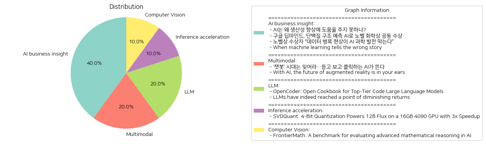

# Daily Artificial Intelligence Insights : News

## 🫧 AI business insight

**요약:**

**주요 테마**:
- 인공지능(AI)의 생산성과 활용에 관한 문제.
- AI의 발전이 과학 기술의 경계 확대에 미치는 영향.
- 데이터의 중요성 및 데이터 품질이 AI 과학 발전에 미치는 장애 요소.
- 머신러닝의 잠재적 위험성과 그로 인한 새로운 발견.

**주요 사건**:
1. 'AI는 왜 생산성 향상에 도움을 주지 못하나?'에서는 AI가 경제 발전에 기여할 가능성은 있으나 생산성 개선에는 더 많은 개선이 필요함을 언급.
2. '구글 딥마인드, 단백질 구조 예측 AI로 노벨 화학상 공동 수상' 기사는 AI를 이용한 과학 혁신의 성과로, 구글 딥마인드의 데미스 허사비스와 존 점퍼가 노벨 화학상을 수상.
3. '노벨상 수상자 “데이터 병목 현상이 AI 과학 발전 막는다”'에서는 AI의 과학적 잠재력을 최대화하기 위해 고품질 데이터의 중요성을 역설.
4. 'When machine learning tells the wrong story'는 머신러닝을 부적절하게 적용하는 것의 위험성을 강조하며, 새로운 보안 위협 발견으로 이어진 케이스를 조명.

**영향 분석**:
- **경제**: AI의 생산성 향상 가능성 부족은 경제 발전에 걸림돌이 될 수 있으며, 높은 성과를 내기 위해 구조적 개선이 필요함.
- **사회**: AI의 발전으로 인한 과학적 혁신은 사회 전반에 긍정적인 영향을 미칠 수 있지만, 잘못된 AI 적용은 보안 및 윤리문제를 초래할 수 있음.
- **정치**: AI 기술 발전에 있어 데이터의 중요성이 증가하며, 정치적 정책에서 데이터의 수집과 품질관리가 초점이 될 가능성이 있음.

**최종 요약**:
이번 뉴스는 AI와 관련된 여러 측면을 다루며, AI 기술의 잠재력과 한계, 그리고 데이터 품질의 중요성을 강조하고 있다. 구글 딥마인드의 노벨상 수상은 AI의 과학적 혁신 가능성을 보여주며, 현대 사회에서 데이터를 정확하게 관리하는 것의 중요성을 환기시킨다. 따라서 앞으로 AI 생산성 향상을 위한 구조적 개선과 데이터 관리는 지속적으로 주의 깊게 관리되어야 할 영역이다. 또한, AI의 잘못된 적용을 방지하기 위한 교육과 연구 중심의 정책 개발이 필요하다. 미래에는 AI에 의해 고도화된 사회 구조가 어떻게 변화할지 지켜볼 필요가 있다.

**출처:**

 - AI는 왜 생산성 향상에 도움을 주지 못하나? (https://www.technologyreview.kr/ai%eb%8a%94-%ec%99%9c-%ec%83%9d%ec%82%b0%ec%84%b1-%ed%96%a5%ec%83%81%ec%97%90-%eb%8f%84%ec%9b%80%ec%9d%84-%ec%a3%bc%ec%a7%80-%eb%aa%bb%ed%95%98%eb%82%98/)
 - 구글 딥마인드, 단백질 구조 예측 AI로 노벨 화학상 공동 수상 (https://www.technologyreview.kr/%ea%b5%ac%ea%b8%80-%eb%94%a5%eb%a7%88%ec%9d%b8%eb%93%9c-%eb%8b%a8%eb%b0%b1%ec%a7%88-%ea%b5%ac%ec%a1%b0-%ec%98%88%ec%b8%a1-ai%eb%a1%9c-%eb%85%b8%eb%b2%a8-%ed%99%94%ed%95%99%ec%83%81-%ea%b3%b5%eb%8f%99/)
 - 노벨상 수상자 “데이터 병목 현상이 AI 과학 발전 막는다” (https://www.technologyreview.kr/%eb%85%b8%eb%b2%a8%ec%83%81-%ec%88%98%ec%83%81%ec%9e%90-%eb%8d%b0%ec%9d%b4%ed%84%b0-%eb%b3%91%eb%aa%a9-%ed%98%84%ec%83%81%ec%9d%b4-ai-%ea%b3%bc%ed%95%99-%eb%b0%9c%ec%a0%84-%eb%a7%89%eb%8a%94/)
 - When machine learning tells the wrong story (https://jackcook.com/2024/11/09/bigger-fish.html)

## 🤩 Multimodal

**요약:**

1. **핵심 주제**:
   모든 뉴스 기사에서 공통적으로 나타나는 핵심 주제는 AI(인공지능)의 발전으로 인해 변화하고 있는 기술의 진화입니다. 특히 AI의 음성 및 영상 생성 기능의 부각과 이에 따른 새로운 사용자 경험 창출, 그리고 증강 현실(AR)과의 융합이 주요 흐름으로 나타납니다.

2. **주요 사건**:
   - 첫 번째 기사에서는 기존의 텍스트 기반 AI 챗봇 시대에서 진화하여, 음성과 영상 생성 기능을 갖춘 AI 시대의 도래에 관한 이야기입니다. 이는 AI 기술의 새로운 도약을 상징합니다.
   - 두 번째 기사는 Foursquare의 창립자 Dennis Crowley가 운영하는 Hopscotch Labs 스타트업에 관한 내용으로, AI와 AirPods를 이용해 사용자가 도시를 걸으며 지역 정보를 청취할 수 있는 기술 개발을 다루었습니다. 이는 스크린 없이 정보에 접근할 수 있는 혁신적 경험 창출을 목표로 하고 있습니다.

3. **영향 분석**:
   이러한 발전은 여러 분야에 큰 영향을 미칠 것으로 보입니다.
   - **경제**: AI 기술의 강화는 새로운 시장과 비즈니스 모델을 창출할 가능성이 큽니다. 음성 및 영상 기반 AI의 발전은 기업들에게 새로운 상업적 기회를 제공할 것입니다.
   - **사회**: 정보 접근 방식의 변화는 사람들의 일상생활에 혁신적인 변화를 가져올 수 있습니다. 보다 직접적이고 자연스러운 인터페이스를 통해 정보가 제공되면서 사용자 경험이 개선될 것입니다.

4. **최종 요약**:
   두 기사는 AI 기술이 단순한 텍스트 기반 서비스에서 벗어나 음성 및 영상 기반으로 진화하고 있음을 보여줍니다. 앞으로 텍스트 화면을 넘어서 청각과 시각을 활용한 사용자 경험이 강화될 것입니다. 이러한 발전은 기술적, 상업적, 사회적 측면에서 광범위한 파급 효과를 미칠 것으로 예상됩니다. 향후 AI의 발전이 어떠한 새로운 서비스와 비즈니스 모델을 창출할 것인지 지켜볼 필요가 있습니다.

**출처:**

 - ‘챗봇’ 시대는 잊어라…듣고 보고 클릭하는 AI가 뜬다 (https://www.technologyreview.kr/%ec%b1%97%eb%b4%87-%ec%8b%9c%eb%8c%80%eb%8a%94-%ec%9e%8a%ec%96%b4%eb%9d%bc-%eb%93%a3%ea%b3%a0-%eb%b3%b4%ea%b3%a0-%ed%81%b4%eb%a6%ad%ed%95%98%eb%8a%94-ai%ea%b0%80-%eb%9c%ac%eb%8b%a4/)
 - With AI, the future of augmented reality is in your ears (https://crazystupidtech.com/archive/with-ai-the-future-of-augmented-reality-is-in/)

## ⭐ LLM

**요약:**

**1. 주요 주제**:
   두 기사 모두 인공지능(AI) 분야와 관련이 있으며, 특히 대규모 언어 모델(LLM)에 초점을 맞추고 있습니다. 이러한 주제는 AI 발전과 관련된 기술적 측면과 그 한계에 관한 논의를 포함합니다. 주요 트렌드로는 LLM의 성능 최적화와 데이터 및 연산 자원의 활용 그리고 건축상의 근본 변화의 필요성이 있습니다.

**2. 주요 사건**:
   - 'OpenCoder: Top-Tier Code Large Language Models': OpenCoder는 1.5B 및 8B 모델을 가진 오픈 소스 코드 LLM으로 2.5조 개의 토큰으로 훈련되어 최고 수준의 성능을 제공합니다. 이는 재현 가능한 데이터와 훈련 프로토콜, 그리고 코드 AI를 발전시키기 위한 분석 결과를 제시합니다.
   - 'LLMs have indeed reached a point of diminishing returns': LLM의 확장이 데이터 및 컴퓨팅 자원을 추가하는 것만으로는 근본적인 성과를 이어나갈 수 없는 한계점에 도달했다는 경고입니다. 이는 AI 구축에 있어 새로운 관점이 필요함을 시사합니다.

**3. 영향 분석**:
   - 경제: AI와 대규모 언어 모델의 발전은 소프트웨어 개발 및 관련 산업의 생산성 향상을 도울 수 있습니다. 그러나 한편으로는 기술적 한계를 넘어서기 위한 새로운 접근 방식이 필요하다는 점에서 연구개발 비용의 증가를 유발할 수 있습니다.
   - 사회: AI의 영향은 사회 전반에 걸쳐 있으며, LLM을 둘러싼 논의는 기술 발전이 가져오는 윤리 및 사회적 고려사항에 대한 지속적인 대화를 촉발합니다.

**4. 최종 요약**:
   인공지능 기술, 특히 대규모 언어 모델(LLM)의 발전은 지속되고 있으며, OpenCoder는 이러한 발전을 지원하기 위한 혁신적인 도구를 제공합니다. 그러나 동시에 LLM의 성능개선에 있어 기술적 한계가 드러나고 있으며, 이는 더 이상 단순한 확장으로는 해결될 수 없는 문제임을 보여줍니다. 이러한 상황에서 AI가 갖는 경제 및 사회적 중요성은 다음 단계의 기술적 도약을 위해 근본적인 변화와 혁신이 필요함을 강조합니다. 앞으로는 LLM의 한계를 극복하고 더욱 발전시키기 위한 새로운 접근법과 기술적 진전을 주목해야 할 것입니다.

**출처:**

 - OpenCoder: Open Cookbook for Top-Tier Code Large Language Models (https://opencoder-llm.github.io/)
 - LLMs have indeed reached a point of diminishing returns (https://garymarcus.substack.com/p/confirmed-llms-have-indeed-reached)

## 🧸 Inference acceleration

**요약:**

1. **주요 주제**:
   - 최신 기술 및 혁신: SVDQuant와 같은 첨단 기술의 발전을 통해 컴퓨팅 효율성이 향상되고 있다.
   - 메모리 및 처리 속도 향상: 4비트 양자화 기술이 메모리 사용을 크게 줄이고 처리 속도를 높이는 데 기여하고 있다.
   - 인공지능 및 머신러닝 기술의 발전: 높은 성능의 모델을 적은 자원으로 구동할 수 있게 되어 AI 연산 효율성이 극대화되었다는 점이 공통적으로 나타난다.

2. **주요 사건**:
   - SVDQuant 기술은 16비트 모델에 비해 최소 3.6배의 메모리 절감과 8.7배의 속도 향상을 제공하는 4비트 양자화 기술로, 12B 플럭스를 16GB 4090 GPU에서 가동하도록 한다. 이는 고성능 컴퓨팅 환경에서의 자원 절약의 사례로 주목된다.

3. **영향 분석**:
   - 경제적 영향: 고성능의 AI 및 머신러닝 시스템을 낮은 비용으로 운영할 수 있게 되어 기업의 IT 비용 절감이 예상된다.
   - 사회적 영향: AI 기술의 재정적 효율성 증가로 인한 다양한 산업 분야에서 응용 및 혁신의 가속화를 기대할 수 있다.
   - 기술 발전도: 더 많은 연구 및 개발이 이러한 기술적 혁신을 통해 이루어질 것으로 보이며, 이는 전반적인 기술 발전을 촉진할 것이다.

4. **최종 요약**:
   - SVDQuant과 같은 첨단 기술의 발전은 AI 및 머신러닝 분야에서의 효율성 향상과 비용 절감을 이끌어내며, 이는 경제적, 사회적 측면에서 긍정적인 영향을 미칠 것으로 보인다. 이러한 기술적 혁신이 지속적으로 이루어질 경우, 다양한 산업 분야에서 더욱 적극적인 AI 기술 도입과 응용이 예상된다. 미래에는 이러한 기술 발전의 지속 가능성 및 그에 따른 산업 패러다임의 변화에 주목해야 할 것이다.

**출처:**

 - SVDQuant: 4-Bit Quantization Powers 12B Flux on a 16GB 4090 GPU with 3x Speedup (https://hanlab.mit.edu/blog/svdquant)

## 🫧 Computer Vision

**요약:**

**1. 주요 테마:**

'프론티어매스(FrontierMath)'는 AI 시스템의 고급 수학적 추론 능력을 평가하기 위한 벤치마크를 다룹니다. 이 데이터셋은 수백 개의 독창적인 수학 문제로 구성되어 있으며, 오늘날의 현대 수학 영역을 포괄합니다. 이 벤치마크는 전통적인 수학적 사고와 문제 해결 능력의 평가를 AI의 가능성으로 확장하려는 시도를 보여줍니다. 

**2. 주요 사건:**

AI 시스템의 수학적 추론 능력을 평가하기 위해 '프론티어매스'라는 새로운 벤치마크가 제시되었습니다. 이 벤치마크에 포함된 문제들은 전문가 수학자에게도 어려워 해결에 몇 시간에서 며칠이 소요될 수 있습니다. 이를 통해 AI의 수학적 추론 능력을 시험할 수 있습니다.

**3. 영향 분석:**

- **경제:** 고급 수학적 추론이 필요한 분야에서 AI가 더욱 발전함으로써 고도로 전문화된 분야에서 혁신을 가속화할 수 있습니다. 금융 분야에서의 복잡한 데이터 분석, 물리학 및 공학 분야의 문제 해결 등 다양한 산업 영역에서 AI의 활용 가능성을 높일 수 있습니다.
  
- **정치:** AI의 발전은 교육 및 연구 정책에 변화를 초래할 수 있습니다. 특히 STEM(과학, 기술, 공학, 수학) 교육에서 AI 활용과 관련한 새로운 정책 및 지원이 필요할 수 있습니다.
  
- **사회:** 수학적 문제 해결을 AI가 대신하게 되면 인적 자원의 필요성이 감소할 수 있으며, 이는 장기적으로 교육과 고용 형태에 변화를 초래할 수 있습니다. AI를 통한 새로운 학습 모델의 필요성도 대두될 것입니다.

**4. 최종 요약:**

프론티어매스는 AI의 수학적 추론 능력을 평가하는 주요 벤치마크로 자리잡고 있습니다. 이로 인해 AI를 통한 수학적 문제 해결 능력이 향상되어 경제 및 기술 발전에 기여할 가능성이 높습니다. 하지만 이는 또한 교육 및 노동 시장에 변화를 줄 수 있으며, 사회 전반에 걸쳐 새로운 학습 방법과 정책적 대응이 요구될 것입니다. 앞으로 이러한 AI의 발전이 경제 및 사회 구조에 미칠 영향을 지속적으로 모니터링하는 것이 중요합니다.

**출처:**

 - FrontierMath: A benchmark for evaluating advanced mathematical reasoning in AI (https://epochai.org/frontiermath/the-benchmark)

