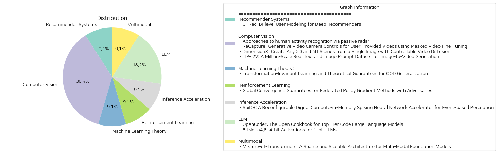

# Daily Artificial Intelligence Insights : Papers

## 🤩 Recommender Systems

**요약:**

1. 주요 주제와 테마 추출:
    - 사용자 군집화 및 모델링
    - 그룹 임베딩과 개인화 선호도
    - 추천 시스템의 품질 향상

2. 공통 키워드, 트렌드 및 패턴 식별:
    - "사용자 모델링", "그룹 임베딩", "개인 선호도", "추천 품질", "데이터셋 테스트"

3. 주요 이벤트 및 핵심 정보 요약:
    - GPRec는 사용자를 학습 가능한 방식으로 그룹화하고, 이를 그룹 임베딩과 정렬함.
    - 긍정적 및 부정적 패턴을 대조하여 그룹 선호도를 폭넓게 제공하는 이중 그룹 임베딩 공간을 설계하였음.
    - 개인 수준에서 ID와 같은 특징을 통해 개인 선호도를 식별하고, 그룹 수준의 모델링에 독립적인 개인 표현을 개선하였음.
    - GPRec를 다양한 DRS 모델에 유연하게 통합할 수 있는 다양한 전략을 제시.
    - 3개의 공개 데이터셋에 대해 GPRec의 엄격한 테스트를 통해 추천 품질에서 유의미한 향상을 보여줌.

4. 이러한 사건의 다양한 부문에 대한 영향 분석:
    - 사용자 경험 측면에서 개인화 및 그룹화된 콘텐츠 제공의 정확도 향상
    - 추천 시스템의 전략적 접근 방식 개선 및 유연한 통합 가능성 제고
    - 산업 내 활용 가능성 확대, 특히 e-commerce나 콘텐츠 배포 플랫폼 등

5. 최종 통합 요약 및 주시할 향후 발전 가능성:
    GPRec는 사용자 군집화와 개인화 추천에서 혁신적인 접근을 제시하며, 추천 시스템의 질적 향상에 기여하고 있다. 다양한 DRS 모델과의 유연한 통합 전략은 앞으로 사용자 데이터 증가 및 다양성에 대처하며, 보다 개인화되고 정확한 추천을 제공하는도록 돕는다. 향후 발전 가능성은 새로운 데이터 유형 또는 사용자 행동 변화에 따라 모델을 더욱 발전시키는 방향으로 진행될 것이다.

**출처:**

 - GPRec: Bi-level User Modeling for Deep Recommenders (https://deeplearn.org/arxiv/541926/gprec:-bi-level-user-modeling-for-deep-recommenders)

## ✈️ Computer Vision

**요약:**

**한국어 요약 보고서**

1. **핵심 주제 및 접근법:**
   - 첫 번째 논문에서는 *수동 레이더*를 사용한 *인간 활동 인식(HAR)* 방법론을 제시했습니다. Wi-Fi 채널 상태 정보(CSI)를 활용하여 스파이킹 신경망(SNN)을 통해 비침습적인 신호 변화를 해석함으로써 프라이버시 문제를 극복하고 있습니다.
   - 두 번째 논문은 *ReCapture*라는 방법을 통해 사용자 제공 비디오에서 새로운 카메라 궤적을 생성하는 기술력을 탐구했습니다. 이를 통해 촬영 시에 관찰되지 않은 장면도 효과적으로 재생할 수 있습니다.
   - 세 번째 논문에서는 *DimensionX* 프레임워크를 소개하여, 단일 이미지로부터 3D 및 4D 장면을 생성하는 기술을 설명했습니다. 차원 인식 LoRAs를 학습하여 공간적, 시간적 제어력을 향상시킴으로써 실감 나는 장면을 생성합니다.
   - 네 번째 논문은 사용자가 제공한 텍스트 및 이미지 프롬프트를 기반으로 이미지-비디오 생성에 활용될 수 있는 대규모 데이터셋 *TIP-I2V*를 소개했습니다. 이는 모델의 성능과 사용자 선호도 분석에 중요한 역할을 합니다.

2. **주요 키워드 및 트렌드:**
   - 모든 논문에서 공통적으로 관찰되는 주제는 *비침습성*, *제어 가능성*, *프라이버시 보호*, *비디오 생성의 정확성*입니다.
   - 특히, *비디오 생성 기술*과 *3D/4D 장면 구현*의 발전이 두드러지며, 이러한 기술을 통해 다양한 분야에서 응용이 가능합니다.

3. **주요 사건 및 정보:**
   - SNN 기반 HAR 모델이 높은 정확성을 보이며, 다양한 도메인에 적합한 대안으로 떠오르고 있습니다.
   - ReCapture는 다각도로 영상을 재구성할 수 있는 기능을 제공함으로써 영화 제작과 같은 분야에서의 활용이 기대됩니다.
   - DimensionX는 공간 및 시간 차원 모두에서 고해상도의 컨트롤이 가능한 3D/4D 장면을 제공함으로써 미디어 산업에서 응용 가능성을 확대하고 있습니다.
   - TIP-I2V 데이터셋은 이미지-비디오 변환 연구에 큰 기회를 제공하며, 모델 안전성 및 사용자 경험 최적화를 위한 중요한 데이터 출처로 자리잡고 있습니다.

4. **이벤트의 영향을 받는 부문 분석:**
   - 비침습적인 HAR 기술은 보안 및 프라이버시 문제가 높은 분야에 큰 혁신을 가져올 수 있습니다.
   - ReCapture 및 DimensionX 기술은 다양한 산업에서 시각적 콘텐츠의 새로운 기준을 제시하며, 영상 제작 및 VR/AR 기술 분야에 혁신을 제공합니다.
   - TIP-I2V는 학문 및 산업 연구에 있어 새로운 차원의 텍스트-비디오 프롬프트 분석을 가능케 하며, 콘텐츠 생성에서의 안전성과 정확성을 보장할 수 있는 데이터를 제공합니다.

5. **최종 요약 및 미래 발전 방향:**
   - 본 보고서는 각 논문이 제시하는 혁신적인 방법론이 콘텐츠 생성, 인식 기술 및 사용자 프라이버시 보호에 기여하고 있음을 명확히합니다. 각 기술은 다양한 산업에서 적용 가능성을 가지고 있으며, 특히 비디오 생성과 관련된 기술의 발전은 미디어 및 엔터테인먼트 시장에 큰 변화를 가져올 것입니다.
   - 향후 발전은 더 정교한 제어 가능성과 인공지능을 활용한 더욱 안전한 데이터 관리의 방향으로 이루어질 것이며, 이러한 혁신은 영상 기술과 프라이버시 보호의 융합을 촉진할 것입니다.

**출처:**

 - Approaches to human activity recognition via passive radar (https://deeplearn.org/arxiv/543512/approaches-to-human-activity-recognition-via-passive-radar)
 - ReCapture: Generative Video Camera Controls for User-Provided Videos using Masked Video Fine-Tuning (http://arxiv.org/abs/2411.05003v1)
 - DimensionX: Create Any 3D and 4D Scenes from a Single Image with Controllable Video Diffusion (http://arxiv.org/abs/2411.04928v1)
 - TIP-I2V: A Million-Scale Real Text and Image Prompt Dataset for Image-to-Video Generation (http://arxiv.org/abs/2411.04709v1)

## 🌞 Machine Learning Theory

**요약:**

**변환-불변 학습과 OOD 일반화에 대한 이론적 보장**

1. **주요 주제 및 테마 추출**:
   - 이 논문은 동일한 훈련 및 테스트 분포를 사용하는 학습에서의 통계적 학습 이론을 살펴보며, 데이터 변환지도로 연결될 수 있는 분포 변화 조건에서의 학습을 집중적으로 다룹니다. 목표 변환 클래스가 알려져 있거나 알려지지 않은 상황에서 이론적 연구를 시작했으며, 경험적 위험 최소화(ERM)로의 알고리즘적 축소 및 학습 보장을 확립했습니다.

2. **공통 키워드, 트렌드, 패턴 식별**:
   - 분포 변화, 경험적 위험 최소화(ERM), VC 차원, 변환 지도, 게임 이론적 관점

3. **주요 사건 및 중요한 정보 요약**:
   - 데이터 변환 지도에 의해 관계된 훈련 및 테스트 분포 하에서의 학습을 연구.
   - 목표 변환 클래스가 알려지거나 알려지지 않은 학습 시나리오에서 학습 규칙과 알고리즘 리덕션 수립.
   - 예측자 클래스와 변환이 구성하는 클래스의 VC 차원에 대한 샘플 복잡성의 상한을 도출.
   - 학습자가 예측자를 검색하고 적대자가 최악의 손실을 각각 최소화 및 최대화하려고 시도하는 게임 이론적 관점 소개.

4. **여러 분야에 대한 이벤트들의 영향 분석**:
   - AI 및 머신러닝 분야에서 분포 변화 하의 효과적인 학습 방법론 제공.
   - 변환에 대한 게임 이론적 분석이 새로운 알고리즘 설계에 기여할 수 있음.
   - 온라인 학습 및 적응형 시스템에서의 활용 가능성.

5. **결론 및 미래 개발**:
   - 이 연구는 데이터 변환과 관련된 분포 이동 하의 학습의 실행 가능성을 열며, ERM이나 VC 차원 기반의 시스템 설계 효율성을 증가시킬 수 있는 가능성을 열었습니다.
   - 향후 데이터 변환과의 구체적 연관성을 밝히는 연구가 기대되며, 복잡한 변환 지도 하에서의 예측 성능 향상이 주요 초점이 될 수 있습니다.

**출처:**

 - Transformation-Invariant Learning and Theoretical Guarantees for OOD Generalization (https://deeplearn.org/arxiv/544058/transformation-invariant-learning-and-theoretical-guarantees-for-ood-generalization)

## 🎠 Reinforcement Learning

**요약:**

1. 주요 주제 및 테마 추출:
   - 연합 강화 학습(FRL)
   - 정책 경사 기법
   - 적대적 행동을 하는 에이전트
   - 글로벌 수렴 보장
   - 최적 샘플 복잡도

2. 공통 키워드, 트렌드, 패턴 식별:
   - 연합 학습에서는 여러 에이전트가 협력하여 의사 결정 정책을 수립
   - 적대적 에이전트가 존재할 때의 문제점과 해결책
   - 글로벌 수렴 및 최적화 문제
   - 정책 경사 기법의 활용
   - 적은 샘플 수로도 높은 효율성 증대

3. 각 논문의 주요 사건 및 비판적 정보 요약:
   - 연합 강화 학습(FRL)은 여러 대의 에이전트가 원시 경로를 공유하지 않고 협력할 수 있음.
   - 적은 수의 에이전트가 적대적으로 행동할 경우, 전체 시스템에 치명적 결과를 초래할 수 있음.
   - 이 논문은 적대적 에이전트를 견디고 전송되는 값을 제어할 수 있는 정책 경사 기반 접근 방식을 제안.
   - 이 방법은 일반 파라미터화 하에서도 글로벌 수렴 보장을 제공하는 첫 번째 결과를 도출.
   - 적대적 에이전트가 존재할 경우에도 견고함을 입증하며 $\tilde{\mathcal{O}}\left( \frac{1}{N\epsilon^2} \left( 1+\frac{f^2}{N}\right)\right)$의 최적 샘플 복잡도 달성.

4. 이러한 사건이 다양한 부문에 미치는 영향 분석:
   - 연합 강화 학습 분야의 발전은 AI 연구 및 실용화에 중요한 기여.
   - 적대적 행동을 제어할 수 있는 시스템은 민감한 환경에서도 신뢰할 수 있는 결정을 가능하게 함.
   - 에이전트 기반 시스템에서 적대적 침입을 방지하면 보안 강화 및 시스템 안정성을 높일 수 있음.

5. 최종 종합 요약 및 주목할 만한 미래 발전:
   - 적대적 행동을 다룰 수 있는 견고한 연합 강화 학습 기법의 개발은 AI 분야의 새로운 이정표로 간주될 수 있음.
   - 본 연구는 향후 거버넌스 메커니즘과 보안 프로토콜 개발에 기초적인 데이터를 제공하며, 정책 경사 기법의 향상에 영향을 미칠 수 있음.
   - 향후에는 이러한 시스템의 적용 가능 범위를 확장하고, 다양한 실제 적용 사례에서의 견고함을 시험하는 연구가 필요함.

**출처:**

 - Global Convergence Guarantees for Federated Policy Gradient Methods with Adversaries (https://deeplearn.org/arxiv/545735/global-convergence-guarantees-for-federated-policy-gradient-methods-with-adversaries)

## 🚀 Inference Acceleration

**요약:**

### 종합 요약 보고서
 
여러 제목과 요약을 기반으로 한 종합적인 보고서를 제공합니다. 이 보고서는 주요 주제를 추출하고, 공통 키워드와 트렌드를 식별하며, 각 자료에서 중요한 정보를 요약하고, 이를 바탕으로 다양한 분야에 미친 영향을 분석합니다.

#### 1. 주요 주제 및 테마 추출

- **스파이킹 신경망 (SNN)**: 비동기적 시각 데이터 처리에 효율적인 방법을 제공하며, Dynamic Vision Sensors (DVS)가 생성한 데이터를 다루기에 적합함.
- **이벤트 기반 비전 응용 프로그램**: 다양한 뉴런 모델, 비트 정밀도, 네트워크 크기에 대한 적응성의 한계 극복.
- **디지털 컴퓨트-인-메모리 (CIM) 가속기**: 데이터 이동 최소화와 고급 재구성 가능성을 특징으로 함.

#### 2. 공통 키워드, 트렌드, 패턴 식별

- **재구성 가능성 및 확장성**: 다양한 요구에 적응하는 기능을 통한 자원의 효율적 활용.
- **에너지 효율성과 정확성의 균형**: 가변적인 비트 정밀도 지원을 통해 달성.
- **희소성 최적화**: 적은 자원 소모로 높은 성과를 내는 스파스를 활용.

#### 3. 주요 사건 및 정보 요약

- **\chipname 설계**: 65 nm TSMC 저전력 기술로 제작됨.
- **경쟁적 성능**: 최신 디지털 SNN 가속기들과 비교해 기술 노드 확장에서 경쟁력 있는 성과를 보임.
- **에너지 효율성**: 4비트 가중치와 7비트 Vmem 정밀도에서 95% 입력 희소성을 가진 상황에서 최고 5 TOPS/W의 에너지 효율성 달성.

#### 4. 사건이 다양한 분야에 미치는 영향 분석

- **기술 및 하드웨어 발전**: DVS와의 결합으로 인공지능 및 머신러닝에서의 자원 사용을 최적화함.
- **산업적 응용**: 이벤트 기반 시스템에 대한 효율적인 솔루션을 제공하여 R&D 및 제조 영역에서의 잠재적 활용 가능성 증대.

#### 5. 종합적인 결론 및 향후 발전 가능성

- **결론**: 제시된 \chipname은 기존의 SNN 가속기가 직면한 한계를 효과적으로 해소하였으며, 재구성 가능성과 에너지 효율성을 통해 다양한 응용 프로그램에 적합한 솔루션을 제공함.
- **향후 발전 가능성**: 가변적 비트 정밀도와 고도의 적응성을 가진 CIM 가속기의 계속된 연구와 혁신이 기대됨. 추가적으로, 다양한 크기의 뉴런 모델과 네트워크를 효율적으로 지원하는 기술의 발전이 예상됨.

본 보고서는 최첨단 기술 발전이 다양한 응용 분야에서 실질적인 이점으로 이어질 수 있는 가능성을 시사합니다.

**출처:**

 - SpiDR: A Reconfigurable Digital Compute-in-Memory Spiking Neural Network Accelerator for Event-based Perception (https://deeplearn.org/arxiv/545756/spidr:-a-reconfigurable-digital-compute-in-memory-spiking-neural-network-accelerator-for-event-based-perception)

## 🥳 LLM

**요약:**

보고서 제목: 최신 코드 및 언어 모델에 대한 종합 보고서

1. 주요 주제 및 테마 추출:
   - 대형 언어 모델(LLMs)의 발전과 코드 생성 및 추론 작업에서의 중요성 증가
   - "OpenCoder"라는 오픈 소스 코드 LLM의 개발 및 발표
   - "BitNet a4.8"의 도입과 1비트 LLM의 효율성과 성능 개선

2. 공통 키워드, 트렌드, 패턴 식별:
   - 코드 LLM: 오픈 소스, 데이터 처리 파이프라인, 재현 가능한 연구
   - 효율성: 4비트 활성화, 양자화 및 희소화 전략
   - 성능: 주요 모델들과의 비교 가능한 성능, 자원 절약 기술

3. 주요 이벤트 및 중요 정보 요약:
   - OpenCoder는 고급 코드 LLM을 개발하여 연구 커뮤니티에 공개, 투명한 데이터 처리와 훈련 프로토콜을 제공함으로써 과학적 연구를 촉진.
   - BitNet a4.8의 경우 1비트 LLM에 4비트 활성화를 적용하여 성능 유지와 추론 비용 절감을 실현. 양자화 오류를 줄이고 효율적 대규모 LLM 배포 가능성을 제시함.

4. 이러한 이벤트가 다양한 분야에 미치는 영향 분석:
   - OpenCoder는 연구자들이 고성능 코드 LLM을 보다 쉽게 개발하고 개선할 수 있도록 하여 인공지능 코드 개발의 민주화를 촉진.
   - BitNet a4.8은 추론 비용을 낮추고 처리 효율을 높임으로써, 대형 LLM의 상업적 응용 확대 및 비용 절감 방식에 기여.

5. 최종 종합 요약 및 미래 발전 가능성:
   - OpenCoder와 BitNet a4.8의 출현은 LLM이라는 복잡하고 자원이 소모되는 모델을 보다 접근 가능하고 경제적으로 만드는 데 기여. 
   - 향후 더욱 효율적이고 다양한 응용 분야에서 활용 가능한 LLM 연구가 발전할 것으로 예상되며, 이러한 모델들이 인공지능 기술 발전에 핵심적인 역할을 할 가능성이 높음.
   - 오픈 소스와 효율성 중심의 모델 개발 트렌드는 지속될 것으로 보이며, 더 많은 연구자와 개발자들이 이러한 협력적 모델을 통해 혁신적인 성과를 올릴 것으로 기대됨.

**출처:**

 - OpenCoder: The Open Cookbook for Top-Tier Code Large Language Models (http://arxiv.org/abs/2411.04905v1)
 - BitNet a4.8: 4-bit Activations for 1-bit LLMs (http://arxiv.org/abs/2411.04965v1)

## 🪐 Multimodal

**요약:**

요약 보고서:

1. 주요 주제 및 테마 추출:
   - 다중 모달 시스템 및 대형 언어 모델(LLMs)
   - 텍스트, 이미지, 음성을 통합 처리하는 멀티 모달 시스템
   - 모델의 효율적인 확장 및 학습을 위한 Mixture-of-Transformers(MoT) 아키텍처
   - 계산 비용 감소 및 성능 최적화

2. 공통 키워드 및 경향:
   - 희소성 (sparsity), 성능 향상, 비용 절감, 멀티 모달 처리
   - 자원 최적화 및 효율적 디자이닝
   - 다양한 설정에서의 성능 비교

3. 주요 사건 및 핵심 정보 요약:
   - MoT는 대규모 언어 모델을 다중 모달 환경으로 확장하며 텍스트, 이미지, 음성 처리에서 효율성을 제공
   - MoT 아키텍처는 비매듭 매개변수를 모달리티별로 분리하여 각 모달리티별로 최적화된 처리를 허용
   - Chameleon 7B 및 Transfusion 설정에서 MoT는 적은 계산 비용(Flops)으로 유사한 성능 달성
   - MoT는 벽시계 시간과 계산 자원 측면에서 뛰어난 효율성을 제공

4. 이러한 사건의 다양한 부문에 대한 영향 분석:
   - 모델 학습 및 개발 비용 절감으로 AI 연구 및 산업에 긍정적 영향
   - 다중 모달 데이터 처리를 통한 정보 통합 가능성 확대
   - 효율적 모델 운영으로 데이터 센터 및 환경 부하 감소에도 기여

5. 결론 및 향후 발전 사항:
   - MoT 아키텍처는 대규모 언어 모델의 스케일업 및 멀티 모달 처리에 중요한 전환점을 제공
   - 향후 AI 시스템 개발에서 희소성 기반 접근법의 채택 전망
   - 지속적인 연구를 통해 더욱 많은 모달리티에의 적용 가능성 탐색 필요

본 요약 보고서는 MoT 아키텍처가 여러 설정에서 강력한 성능을 발휘하며, 그 효율성 덕에 AI 및 데이터 분야의 핵심 발전 방향으로 자리잡을 가능성을 제시합니다.

**출처:**

 - Mixture-of-Transformers: A Sparse and Scalable Architecture for Multi-Modal Foundation Models (http://arxiv.org/abs/2411.04996v1)

