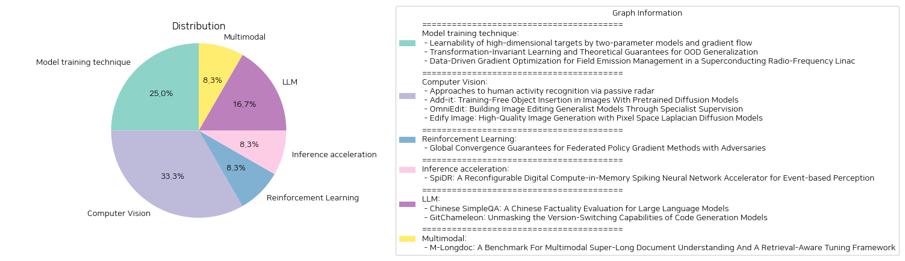

# Daily Artificial Intelligence Insights : Papers

## ✈️ Model training technique

**요약:**

요약 보고서:

1. **주요 주제 및 테마 추출**
    - 첫 번째 논문: 고차원 목표의 학습 가능성, 두 개의 매개변수 모델, 기울기 흐름, 학습 성공 확률, 비학습 가능 대상
    - 두 번째 논문: 변환 불변 학습, OOD 일반화, 분포 이동 설정, 경험적 위험 최소화, 샘플 복잡도, VC 차원
    - 세 번째 논문: 데이터 기반 기울기 최적화, 초전도 라디오 주파수 선형 가속기, 필드 방출 문제, 기계 학습, 불확실성 정량화

2. **공통 키워드, 트렌드 및 패턴 식별**
    - "학습 이론", "기울기 최적화", "분포 이동" 및 "기계 학습"과 같은 키워드가 여러 논문에서 반복적으로 다루어지고 있습니다.
    - 각 논문은 복잡한 시스템 또는 설정 하에서의 학습 방법론과 그 성능에 대해 깊이 있게 다루고 있으며, 수학적 이론 및 데이터 기반 접근 방식을 활용합니다.

3. **각 논문에서의 주요 정보와 사건 요약**
    - 첫 번째 논문은 $d$ 차원 목표를 $W(<d)$ 매개변수로 배우기 위한 이론적 가능성을 다루며, 특정 확률 분포 하에서 두 매개변수 모델의 높은 학습 성공 확률을 제시합니다. 그러나 비학습 가능 목표의 존재도 확인합니다.
    - 두 번째 논문은 변환 맵에 의해 연관된 학습 및 테스트 분포를 사용하는 설정을 제안하며, 이 설정 하에서의 이론적 학습 규칙과 샘플 복잡도에 대한 상한선을 제시합니다.
    - 세 번째 논문은 초전도 라디오 주파수 선형 가속기 내 필드 방출에 의한 문제들을 해결하기 위해 기계 학습 기반 기법을 활용하여 40% 이상의 방사선 감소를 실현합니다.

4. **이러한 사건들이 다양한 부문에 미치는 영향 분석**
    - 첫 번째 논문은 고차원 데이터에 대한 효과적인 학습 방법을 통해 머신러닝 모델의 효율성을 향상시킬 수 있는 가능성을 제공합니다.
    - 두 번째 논문의 이론은 실전 환경에서 변환 불변성 학습의 신뢰성을 강화하여, 실제 애플리케이션에서 보다 일반화된 모델 성능을 보장할 수 있습니다.
    - 세 번째 논문은 물리 실험 환경에서 방사선 감소에 기여하여, 보다 안정적이고 효율적인 실험 프로세스 운영 가능성을 열었습니다.

5. **최종 결론 및 앞으로 주목할 만한 발전**
    - 고차원 데이터, 분포 변환 상황 등의 이해가 머신러닝 연구의 중요한 발전 방향임을 제시하고, 실제 문제 해결에서의 데이터 중심 접근법의 중요성을 강조합니다.
    - 이러한 연구들은 이론적 기초와 실제 적용 간의 연결을 강화하며, 보다 복잡한 환경에서의 학습 문제 해결을 위한 길잡이가 될 것입니다. 향후 연구에서는 더욱 정교한 모델링과 불확실성 관리 등을 통한 추가적인 성과향상이 기대됩니다.

**출처:**

 - Learnability of high-dimensional targets by two-parameter models and gradient flow (https://deeplearn.org/arxiv/547085/learnability-of-high-dimensional-targets-by-two-parameter-models-and-gradient-flow)
 - Transformation-Invariant Learning and Theoretical Guarantees for OOD Generalization (https://deeplearn.org/arxiv/544058/transformation-invariant-learning-and-theoretical-guarantees-for-ood-generalization)
 - Data-Driven Gradient Optimization for Field Emission Management in a Superconducting Radio-Frequency Linac (https://deeplearn.org/arxiv/547416/data-driven-gradient-optimization-for-field-emission-management-in-a-superconducting-radio-frequency-linac)

## 🪐 Computer Vision

**요약:**

**종합 요약 보고서: 최신 기술 및 연구 동향 분석**

1. **주요 주제 및 테마 추출**
   - **비침습적 인간 활동 인식**: 무선 Wi-Fi 채널 상태 정보(CSI)를 활용한 비침입형 인간 활동 인식 방법을 탐구하고, 스파이킹 뉴런 네트워크(SNN) 및 상징적 추론 프레임워크를 적용하여 효율성과 해석 가능성을 강조.
   - **이미지 삽입 및 편집 기술**: 사전 훈련된 확산 모델을 활용한 텍스트 기반 객체 삽입, 다중 과제 이미지 편집, 픽셀 공간 확산 모델을 통한 고품질 이미지 생성.
   
2. **공통 키워드, 트렌드 및 패턴 식별**
   - **확산 모델의 활용**: 여러 논문에서 확산 모델(diffusion models)을 활용하여 이미지 생성 및 편집 하는 점이 두드러짐.
   - **고해상도 이미지 처리**: 4K 업샘플링 및 세부사항 유지 등의 트렌드가 있으며, 노이즈 제거 및 편집 정확도를 강조.
   - **인간 및 자동 평가**: 다양한 논문에서 인간 및 자동 평가 지표를 활용하여 새로운 모델의 성능 검증 및 비교 분석을 수행.

3. **주요 사건 및 중요 정보 요약**
   - **비침입형 인간 활동 인식**: 기존 카메라나 착용형 센서의 프라이버시 문제를 해결하기 위해, 비침입적이며 낮은 전력 소모를 특징으로 하는 SNN 기반 모델이 제안되었음.
   - **텍스트 기반 이미지 객체 삽입**: Add-it 시스템이 훈련 없이도 자연스러운 객체 삽입을 가능하게 하며, 새롭게 구축된 평가 벤치마크에서 뛰어난 성능을 보임.
   - **범용 이미지 편집 모델**: OmniEdit가 전문 모델의 감독을 받아 다양한 이미지 편집 과제를 정확히 수행할 수 있으며, 자동 및 인간 평가에서 기존 모델들보다 우수한 성능 발휘.
   - **고품질 이미지 생성 모델**: Edify Image가 다양한 주파수 대역을 활용한 새로운 라플라시안 확산 프로세스를 통해 사실적인 이미지 생성이 가능하다는 점을 시사.

4. **이벤트의 영향 분석**
   - **보안 및 프라이버시**: 비침입형 활동 인식 방법의 발전이 보안 및 프라이버시를 저해하지 않는 기술 발전 현장에 큰 영향을 미침.
   - **이미지 처리 및 편집 툴의 발전**: 이미지 편집과 생성 기술은 미디어와 콘텐츠 제작에서 창의성과 생산성을 크게 향상시킬 잠재력을 가짐.

5. **결론 및 미래 동향**
   - **결론**: 다양한 기법들이 현재 기술의 한계를 극복하면서 사용자 편의성과 시스템의 효율성을 극대화하고 있음.
   - **미래 발전 경향**: 지속 가능한 인공지능 및 이미지 기술 발전을 위해 프라이버시를 중시하는 시스템 개발과 새로운 평가 지표 구축에 주목할 필요가 있음.

각 연구들이 제시한 기술적 혁신과 강조점들은 차세대 인간-기계 인터페이스, 이미지 처리, 데이터 개인정보보호 등의 다양한 분야에 커다란 시사점을 제공하며, 미래의 발전 방향을 예측하는 데 귀중한 정보로 작용할 것입니다.

**출처:**

 - Approaches to human activity recognition via passive radar (https://deeplearn.org/arxiv/543512/approaches-to-human-activity-recognition-via-passive-radar)
 - Add-it: Training-Free Object Insertion in Images With Pretrained Diffusion Models (http://arxiv.org/abs/2411.07232v1)
 - OmniEdit: Building Image Editing Generalist Models Through Specialist Supervision (http://arxiv.org/abs/2411.07199v1)
 - Edify Image: High-Quality Image Generation with Pixel Space Laplacian Diffusion Models (http://arxiv.org/abs/2411.07126v1)

## 🌞 Reinforcement Learning

**요약:**

요약 보고서:

1. 주요 주제 및 테마 추출:
   - 페더레이션 강화 학습(FRL) 및 정책 변화 방법론
   - 적대적 에이전트의 존재와 그로 인한 문제점
   - 적대적 조건 하에서도 글로벌 수렴 보장 방법론

2. 공통 키워드, 경향 및 패턴:
   - 협력적 의사결정 정책 설계
   - 적대적 에이전트
   - 정책 변화 기반 접근 방식
   - 견고성 및 샘플 복잡도

3. 논문에서의 주요 사건 및 핵심 정보 요약:
   - 여러 에이전트가 원시 데이터를 공유하지 않고 정책을 구축하는 페더레이션 강화 학습 방식을 설명.
   - 소수의 적대적 에이전트가 시스템 결과에 심각한 영향을 미칠 수 있으며 이를 방지하기 위한 정책 변화 알고리즘 제안.
   - 임의의 값을 서버에 전송할 수 있는 적대적 에이전트에 대해 강건성을 보여주는 첫 번째 글로벌 수렴 보장 결과 구축.
   - 최적의 샘플 복잡도를 달성하며 적대적 상황에 대한 저항력을 보이는 결과 제시.

4. 다양한 부문에 대한 영향 분석:
   - FRL의 안전성과 신뢰성을 강화하여 다양한 협력적 AI 시스템 개발에 긍정적 영향을 미칠 수 있음.
   - 적대적 행동을 무력화할 수 있는 정책 변화 메커니즘은 보안 강화 및 데이터 안정성을 증가시킬 가능성이 있음.
   - AI 시스템 적용 분야에서의 리스크 관리 및 완화 전략에 중요한 통찰력을 제공할 수 있음.

5. 최종 요약 및 잠재적 미래 발전:
   FRL 환경에서 적대적 에이전트의 영향을 감소시키고 전반적인 시스템 안정성을 증진시킬 수 있는 정책 변화 기반 솔루션이 개발되었으며, 이는 AI 협력 시스템에 대한 신뢰성을 높일 수 있다. 앞으로는 다양한 실제 응용 환경에서 이 이론을 검증하고, 다양한 적대적 행동 방식에 대한 해결책 개발이 필요할 것이다. 더 나아가 실제 산업 영역에서의 응용 가능성을 고려한 연구가 진행될 것으로 기대된다.

**출처:**

 - Global Convergence Guarantees for Federated Policy Gradient Methods with Adversaries (https://deeplearn.org/arxiv/545735/global-convergence-guarantees-for-federated-policy-gradient-methods-with-adversaries)

## ⭐ Inference acceleration

**요약:**

1. 각 논문에서 주요 주제와 테마 추출:
   - 스파이킹 신경망(SNN), 이벤트 기반 인식, 비동기적 시각 데이터 처리, 동적 비전 센서(DVS), 네트워크 확장성, 재구성 가능한 디지털 컴퓨팅, 메모리 내 연산, 다양한 뉴런 모델 및 비트 정밀도 지원, 희소성 최적화, 에너지 효율성

2. 공통 키워드, 트렌드, 패턴 식별:
   - SNN, CIM(Compute-in-Memory), 적응성, 에너지 효율성, 희소성, 재구성 가능성, 비동기 처리, 동적 비전

3. 각 논문의 주요 사건 및 중요한 정보 요약:
   - SpiDR는 기존 SNN 가속기의 한계를 극복하기 위해 제안된 CIM 기반의 디지털 SNN 가속기이다. 이 가속기는 다양한 뉴런 모델과 비트 정밀도를 지원하며, 데이터 이동을 최소화하는 메모리 내 계산을 활용한다. 재구성 가능한 작업 모드를 통해 다양한 작업 부하에 적응할 수 있다. 또한 희소한 입력에 대한 에너지 사용을 줄이기 위해 제로 건너뛰기 메커니즘을 사용하며, 여러 정밀도를 지원하여 정확도와 에너지 효율성 간의 균형을 맞춘다. 비동기 핸드셰이킹 메커니즘을 통해 다양한 계산 단위의 가변 실행 시간을 처리하며, TSMC 65nm 기술로 제작되었다. 이는 최신 문헌에 소개된 다른 디지털 SNN 가속기와 경쟁할 수 있는 성능을 보이며 고급 재구성 가능성을 지원한다.

4. 이러한 사건들이 다양한 부문에 미치는 영향 분석:
   - 인공지능 및 신경망 처리: SNN의 효율성을 높임으로써 인공지능 애플리케이션의 처리 능력 향상
   - 산업 및 기술 개발: 동적 비전 기술의 발전으로 실시간 처리 및 인식 기술이 강화되어 자율 주행, 산업 자동화 등 분야에 영향을 미칠 수 있음
   - 에너지 효율성: CIM 기술의 활용을 통해 에너지 소비를 줄임으로써 친환경 기술 개발에 기여

5. 최종 통합 요약 및 추후 주목할 발전:
   - 스파이킹 신경망은 이벤트 기반의 비동기 처리에 적합하며, SpiDR와 같은 CIM SNN 가속기는 다양한 뉴런 모델과 애플리케이션에 적응할 수 있는 고급 기능을 제공하여 미래의 인공지능 발전에 큰 기여를 할 것이다. 산업 전반에 걸쳐 효율적이고 에너지 절약적인 SNN 솔루션이 확산될 것으로 예상되며, 향후 다양한 산업 분야에서 동적 비전 적용 사례가 증가될 것으로 보인다. 따라서, 향후 SNN 및 이벤트 기반 처리의 최신 기술 발전을 주시할 필요가 있다.

**출처:**

 - SpiDR: A Reconfigurable Digital Compute-in-Memory Spiking Neural Network Accelerator for Event-based Perception (https://deeplearn.org/arxiv/545756/spidr:-a-reconfigurable-digital-compute-in-memory-spiking-neural-network-accelerator-for-event-based-perception)

## 🎉 LLM

**요약:**

요약 보고서:

1. 주요 주제 및 테마 추출:
   - "Chinese SimpleQA" 논문은 대형 언어 모델(LLM)의 사실성 평가를 위한 중국어 벤치마크를 소개하며, 이는 중국어로 단기 질문에 대한 대답의 사실성을 평가합니다. 이 벤치마크는 다양한 주제와 고품질 질문 및 답변의 특성을 가지고 있습니다.
   - "GitChameleon" 논문은 코드 생성 모델의 버전 전환 능력을 검토합니다. 이 논문은 소프트웨어 라이브러리의 빠른 진화가 코드 생성 모델에 도전과제가 되며, 이와 관련된 문제점을 극복하기 위해 만들어진 데이터셋에 대해 설명합니다. 이 데이터셋은 라이브러리의 특정 버전에서의 코드 생성 및 실행 가능성 테스트를 통해 모델을 평가합니다.

2. 공통 키워드, 경향 및 패턴 분석:
   - 두 논문 모두 대형 언어 모델(LLM)의 평가 및 발전을 주제로 하고 있으며, 모델의 기능성 및 적응 가능성을 향상시키기 위한 목적을 가지고 있습니다. 
   - "Chinese SimpleQA"는 중국어에 중점을 두고 있으며, "GitChameleon"은 코드 생성의 버전 호환성에 중점을 두고 있는 점에서 두 논문은 각각 언어 및 기술 유형에 맞추어 특수화되고 있음을 보입니다.

3. 주요 사건 및 중요한 정보 요약:
   - "Chinese SimpleQA": 중국어를 사용하는 언어 모델의 답변 사실성을 평가하는 포괄적인 벤치마크를 설정하였고, 이를 통해 모델 개발자들은 중국어 모델의 사실적 능력을 더욱 잘 이해할 수 있게 되었습니다.
   - "GitChameleon": 코드 생성 모델이 다중 라이브러리 버전과 호환 가능하도록 설계된 데이터셋을 제공하여 코드의 정확성과 실행 가능성을 평가하여 모델의 발전을 도모합니다.

4. 사건이 다양한 분야에 미친 영향 분석:
   - "Chinese SimpleQA"는 중국어를 주요 언어로 사용하는 장치 및 애플리케이션에 적용할 수 있는 모델의 개선에 기여할 수 있습니다. 이는 특히 중국 시장에서의 성능 향상을 목표로 하는데 중요합니다.
   - "GitChameleon"을 통해 코드 생성 모델은 소프트웨어 개발 분야에서 더 나은 호환성과 실행 가능성을 가지게 될 것입니다. 이는 개발자들이 신속하고 신뢰성 있는 코드 생성을 가능하게 하여 생산성 향상에 기여할 수 있습니다.

5. 최종 통합 요약 및 앞으로의 발전 가능성:
   - 대형 언어 모델의 평가 및 개선을 위한 다양한 벤치마크 및 데이터셋이 발표되고 있습니다. "Chinese SimpleQA"와 "GitChameleon"은 서로 다른 언어 및 기술 분야에서 LLM의 성능 평가와 개선을 목표로 하고 있어, 다양한 영역에서 모델의 적응력을 높일 수 있는 방안을 제공하고 있습니다. 앞으로 이러한 평가 기준이 더 정교해지면서 다양한 분야의 모델 성능 향상을 이끌어낼 것으로 기대됩니다. 특히, 이러한 발전은 AI 기술의 신뢰성과 실용성을 더욱 강화할 것으로 보입니다.

**출처:**

 - Chinese SimpleQA: A Chinese Factuality Evaluation for Large Language Models (http://arxiv.org/abs/2411.07140v1)
 - GitChameleon: Unmasking the Version-Switching Capabilities of Code Generation Models (http://arxiv.org/abs/2411.05830v1)

## 🥳 Multimodal

**요약:**

보고서 요약:

1. 주요 주제 및 테마 추출:
   - 멀티모달 슈퍼-롱 문서 이해
   - 자동화된 평가 및 효율적 문서 읽기 프레임워크
   - 문서의 검색 기반 튜닝 방식

2. 공통 키워드, 트렌드 및 패턴:
   - 멀티모달 콘텐츠 (텍스트, 그림, 표 등)
   - 대규모 모델의 성능 평가
   - 검색 및 튜닝 프레임워크

3. 주요 사건 및 중요한 정보 요약:
   - M-LongDoc는 851개의 샘플을 포함한 멀티모달 문서 이해를 위한 벤치마크이다.
   - 이 벤치마크는 길고 다양한 형태의 문서를 포함하며, 실질적인 검색 인식 튜닝 방식을 포함하고 있다.
   - 새로운 훈련 프레임워크는 멀티모달 장문서에 대한 검색 설정을 직접적으로 다루는 최초의 시도로, 질문 답변 과제를 자동으로 구성된 훈련 코퍼스를 통해 지원한다.

4. 이러한 사건이 다양한 분야에 미치는 영향 분석:
   - 비즈니스 및 실무 응용 분야에서 길고 복잡한 문서를 효율적으로 이해하는 데 도움을 줄 수 있음.
   - 기존의 오픈 소스 모델보다 정확성을 4.6% 향상시킴으로써 AI 기반 문서 처리가 더욱 효과적으로 가능해짐.

5. 최종 요약과 잠재적 미래 발전:
   - M-LongDoc와 같은 벤치마크 및 자동화된 튜닝 프레임워크의 발전은 문서 이해 분야에서 혁신적인 변화를 가져올 수 있다.
   - 향후 발전은 이러한 프레임워크의 적용 범위를 확장하고 다양한 도메인에 활용함으로써 더욱 다양한 형태의 문서 처리에 기여할 것으로 예상된다. 혁신적인 AI 기술의 확대는 기업과 조직의 효율성을 높이고, 사용자 경험을 개선하는 주요 요소로 작용할 것이다.

**출처:**

 - M-Longdoc: A Benchmark For Multimodal Super-Long Document Understanding And A Retrieval-Aware Tuning Framework (http://arxiv.org/abs/2411.06176v1)

