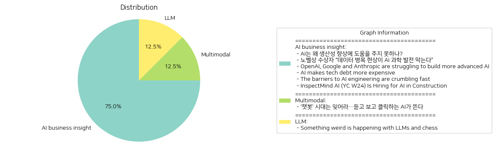

# Daily Artificial Intelligence Insights : News

## 🧸 AI business insight

**요약:**

1. **주요 테마**:
   이번 뉴스 기사 전반에 걸쳐 주목할 수 있는 주요 테마는 인공지능(AI)의 발전과 그 한계, 그리고 기술 채택의 어려움입니다. AI가 생산성을 개선하거나 과학적 도구로 사용되는 데 필요한 고품질 데이터의 중요성과 기술적 부채 증가 문제, AI 공학의 접근성 향상 등이 빈번하게 언급되었습니다.

2. **주요 사건**:
   - AI의 생산성 향상에 필요한 개선점에 대한 논의.
   - AI 과학 발전을 가로막는 '데이터 병목 현상'에 대한 노벨상 수상자의 견해.
   - OpenAI의 새로운 AI 모델인 오리온이 성능 기대로부터 미달되었다는 보고와 기존 모델과의 비교.
   - AI가 코드 복잡성으로 인해 기술적 부채를 증가시키고 있는 상황과 이를 해결하기 위한 모듈화된 아키텍처 필요성.
   - AI 공학이 단순해진 툴과 표준화된 워크플로우로 인해 더 쉽게 접근 가능해지고 있다는 주장.
   - InspectMind AI에서 건설 분야의 AI 자동화 업무를 위한 엔지니어 채용 소식.

3. **영향 분석**:
   - **경제**: AI의 생산성 향상 가능성에 대한 기대감과 그에 따른 기술적 부채 문제는 기업의 AI 도입 결정에 중요한 요소로 작용할 수 있습니다.
   - **사회**: AI 공학의 접근성 개선으로 AI 기술을 더 넓은 분야로 확산 적용할 가능성이 높아져, 다양한 산업에서의 생산성 향상과 자동화 가능성을 제공합니다.
   - **기술**: 고품질 데이터의 중요성이 강조되며, 오픈AI 등 선도 기업들의 AI 모델 개발 과정에서의 한계가 드러남에 따라 기술 개선의 필요성이 부각됩니다.

4. **최종 요약**:
   인공지능은 현대 기술 발전의 핵심이지만, 생산성 향상에 있어서는 아직 많은 과제가 남아 있습니다. 특히 데이터 품질의 중요성과 기술적 복잡성의 이슈, 그리고 이에 대한 해결 방안들이 논의된 바 있습니다. AI 공학의 접근성이 증가하고 있음에도 불구하고, 여전히 특정 기술 요구사항이 있는데, 이는 향후 AI 기술 개발 및 적용의 방향성을 시사합니다. 이러한 문제들이 해결된다면 AI는 다양한 산업에서의 혁신을 선도할 잠재력이 크며, 특히 경제 부문에서의 생산성 향상이 기대됩니다. 앞으로는 AI 기술의 데이터 품질 개선과 복잡성 감소, 그리고 이를 위한 표준화 및 모듈화된 접근 방법이 관건이 될 것입니다.

**출처:**

 - AI는 왜 생산성 향상에 도움을 주지 못하나? (https://www.technologyreview.kr/ai%eb%8a%94-%ec%99%9c-%ec%83%9d%ec%82%b0%ec%84%b1-%ed%96%a5%ec%83%81%ec%97%90-%eb%8f%84%ec%9b%80%ec%9d%84-%ec%a3%bc%ec%a7%80-%eb%aa%bb%ed%95%98%eb%82%98/)
 - 노벨상 수상자 “데이터 병목 현상이 AI 과학 발전 막는다” (https://www.technologyreview.kr/%eb%85%b8%eb%b2%a8%ec%83%81-%ec%88%98%ec%83%81%ec%9e%90-%eb%8d%b0%ec%9d%b4%ed%84%b0-%eb%b3%91%eb%aa%a9-%ed%98%84%ec%83%81%ec%9d%b4-ai-%ea%b3%bc%ed%95%99-%eb%b0%9c%ec%a0%84-%eb%a7%89%eb%8a%94/)
 - OpenAI, Google and Anthropic are struggling to build more advanced AI (https://www.bloomberg.com/news/articles/2024-11-13/openai-google-and-anthropic-are-struggling-to-build-more-advanced-ai)
 - AI makes tech debt more expensive (https://www.gauge.sh/blog/ai-makes-tech-debt-more-expensive)
 - The barriers to AI engineering are crumbling fast (https://blog.helix.ml/p/we-can-all-be-ai-engineers)
 - InspectMind AI (YC W24) Is Hiring for AI in Construction (https://www.ycombinator.com/companies/inspectmind-ai/jobs/rPuRKf1-software-engineer)

## 🚀 Multimodal

**요약:**

1. **주요 주제**:
   - 인공지능 기술의 발전: 텍스트 기반 AI 챗봇에서 벗어나 음성과 영상 생성 기능을 갖춘 차세대 AI 기술로의 전환이 주된 주제로 다루어지고 있습니다.
   - 기술 진화: AI의 발전 방향이 이전 세대의 기능을 넘어 더욱 포괄적이고 다채로운 인터페이스를 제공하는 방향으로 나아가고 있음을 보여줍니다.

2. **주요 사건**:
   - 인공지능 기술의 진화와 전환: 기존의 텍스트 기반 AI 챗봇 시대는 끝나고 보다 발전된 상호작용 방식을 갖춘 AI 시대가 개막되고 있다는 소식을 전달하고 있습니다. 특히, 음성과 영상 생성 기능을 강조하고 있습니다.

3. **영향 분석**:
   - 경제적 측면: 새로운 AI 기술의 등장은 기술 산업의 혁신을 촉진하고 더 많은 투자와 연구 개발을 유도할 수 있습니다. 특히, 음성 및 영상 처리 기술의 발전은 관련 산업에서의 경쟁력을 높일 수 있습니다.
   - 사회적 측면: 사용자의 상호작용 방식이 진화함에 따라, 새로운 사용 경험과 편의성을 제공받을 수 있으며, 이는 대중의 AI 수용도를 더욱 높이는 계기가 될 수 있습니다. 그러나, 데이터 프라이버시 및 윤리적 문제에 대한 고려도 중요할 것입니다.

4. **최종 요약**:
   최근의 뉴스는 인공지능 기술이 텍스트 기반 챗봇을 넘어 음성과 영상을 생성할 수 있는 차세대 AI로 진화하고 있음을 강조합니다. 이러한 기술 발전은 경제와 사회 전반에 걸쳐 막대한 영향을 미칠 수 있으며, 기업과 소비자 모두에게 새로운 기회를 제공합니다. 이러한 변화를 지속적으로 주시하며, 데이터 윤리와 사용자 프라이버시 보호에 대한 대응도 중요할 것입니다. 앞으로의 AI 발전은 더욱 인간 친화적이고 인터랙티브한 방향으로 진행될 것으로 예상됩니다.

**출처:**

 - ‘챗봇’ 시대는 잊어라…듣고 보고 클릭하는 AI가 뜬다 (https://www.technologyreview.kr/%ec%b1%97%eb%b4%87-%ec%8b%9c%eb%8c%80%eb%8a%94-%ec%9e%8a%ec%96%b4%eb%9d%bc-%eb%93%a3%ea%b3%a0-%eb%b3%b4%ea%b3%a0-%ed%81%b4%eb%a6%ad%ed%95%98%eb%8a%94-ai%ea%b0%80-%eb%9c%ac%eb%8b%a4/)

## 🌞 LLM

**요약:**

제목: 'LLM과 체스에 관한 이상한 현상'
요약: 저자는 대형 언어 모델(LLM)을 체스를 수행하는 데 테스트하였으며, 대부분의 모델이 표준 체스 AI에 이기는 데 실패하였습니다. 그러나 gpt-3.5-turbo-instruct 모델은 낮은 난이도의 스톡피시를 꾸준히 이겼습니다.

1. **핵심 주제**:
   - 대형 언어 모델(LLM)의 능력과 한계
   - LLM을 활용한 비즈니스 및 엔터테인먼트 분야의 응용 가능성
   - AI 및 기술 산업 혁신의 흐름

2. **주요 이벤트**:
   - 대형 언어 모델을 통해 체스의 전략적 능력을 분석.
   - gpt-3.5-turbo-instruct 모델이 낮은 난이도에서 스톡피시에 일관되게 승리한 사례.

3. **영향 분석**:
   - **경제**: LLM과 AI 기술은 다양한 산업에서 효율성을 증대시킬 가능성. 특히 엔터테인먼트 및 교육 분야에서 새로운 해법과 제품 개발에 영향을 미칠 것임.
   - **사회**: AI의 지속적인 발전이 노동 시장에 미치는 영향에 대한 논의가 필요. 특히, 인공지능이 수행할 수 있는 작업의 폭이 넓어짐에 따라 반복 작업 직군의 변화 가능성 존재.
   - **기술**: AI의 꾸준한 성장이 더욱 복잡한 문제 해결 가능한 기술 발전을 가져올 것이며, 다양한 AI 모델의 벤치마킹 및 성능 평가가 더욱 중요해질 것.

4. **최종 요약**:
   이번 기사에서 대형 언어 모델이 체스와 같은 복잡한 게임에서 일정 수준의 성능을 발휘하는 모습을 보였다. 이는 AI의 능력이 지속적으로 발전하고 있음을 보여주며, 다양한 분야에서의 응용 가능성을 시사한다. 앞으로 AI가 더욱 발전하여 인간의 삶 전반에 걸쳐 긍정적이고 부정적인 영향을 미칠 가능성을 주시할 필요가 있다. 특히 기술 발전이 경제와 사회에 미치는 영향을 면밀히 관찰하고, 이에 대한 준비가 필요할 것이다.

**출처:**

 - Something weird is happening with LLMs and chess (https://dynomight.substack.com/p/chess)

