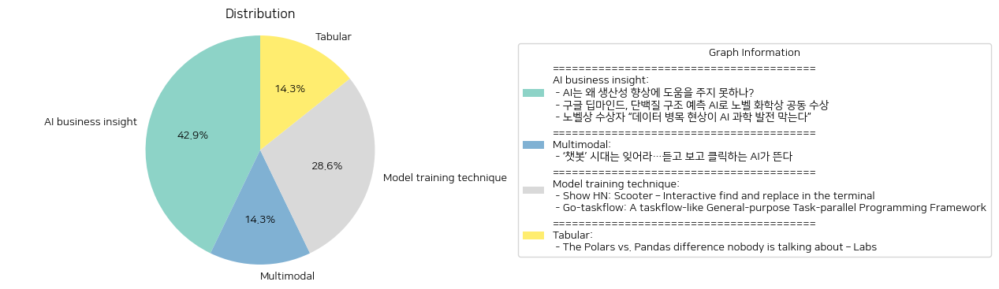

# Daily Artificial Intelligence Insights : News

## ❄️ AI business insight

**요약:**

**주요 주제**:

이번 뉴스 기사에서 공통으로 다루고 있는 주된 주제는 인공지능(AI) 기술의 발전과 그에 따른 사회적, 과학적 영향입니다. 생산성 향상을 위한 AI의 역할, AI의 과학적 응용, 특히 생명 과학 분야에서의 돌파구, 그리고 AI 기술 발전을 막는 데이터의 중요성 등이 논의되고 있습니다.

**주요 사건**:

1. **AI의 생산성 향상 문제**: AI 기술은 경제 발전에 기여할 잠재력이 크지만, 생산성 개선에서 의미 있는 성과를 달성하기 위해서는 여러 개선이 필요하다고 합니다. 

2. **구글 딥마인드와 노벨 화학상**: 구글 딥마인드는 AI를 활용한 단백질 접힘 예측으로 노벨 화학상을 공동 수상했습니다. 이는 AI가 생명 과학 분야에서 중대한 과학적 발견을 할 수 있음을 보여줍니다.

3. **데이터 품질의 중요성**: AI 기술의 과학적 활용을 위해 고품질 데이터의 필요성이 강조되었습니다. 데이터 병목 현상은 AI 기술 발전을 저해하는 주요 요인으로 지목되고 있습니다.

**영향 분석**:

- **경제적 영향**: AI의 생산성 개선이 충분히 이루어지지 않으면 경제적 성장에 대한 기여가 제한적일 수 있습니다. AI 기술 개발을 위해 데이터 품질 향상이 요구되며, 이는 관련 산업의 발전과 투자 기회를 촉진할 수 있습니다.

- **사회 및 과학적 영향**: 단백질 구조 예측에서 AI의 성공은 의약 및 생명과학 연구에 혁신적인 변화를 가져올 것입니다. 새로운 치료법 개발 및 기초 연구에 있어 AI의 활용도가 더욱 높아질 것으로 예상됩니다.

**최종 요약**:

이번 뉴스는 AI 기술의 과학적 발전과 그 한계에 대한 다양한 측면을 조명했습니다. AI는 크게 두 가지 측면에서 주목을 받았습니다: 경제적인 생산성 향상과 생명 과학 등의 실질적 응용. 특히, 데이터 품질은 AI의 잠재력을 극대화하는데 핵심적이며, AI 응용의 지속적인 발전을 위해서는 데이터 관리와 개선이 필수적입니다. 앞으로도 AI의 발전 방향과 그에 따른 사회적 변화를 주시할 필요가 있습니다.

**출처:**

 - AI는 왜 생산성 향상에 도움을 주지 못하나? (https://www.technologyreview.kr/ai%eb%8a%94-%ec%99%9c-%ec%83%9d%ec%82%b0%ec%84%b1-%ed%96%a5%ec%83%81%ec%97%90-%eb%8f%84%ec%9b%80%ec%9d%84-%ec%a3%bc%ec%a7%80-%eb%aa%bb%ed%95%98%eb%82%98/)
 - 구글 딥마인드, 단백질 구조 예측 AI로 노벨 화학상 공동 수상 (https://www.technologyreview.kr/%ea%b5%ac%ea%b8%80-%eb%94%a5%eb%a7%88%ec%9d%b8%eb%93%9c-%eb%8b%a8%eb%b0%b1%ec%a7%88-%ea%b5%ac%ec%a1%b0-%ec%98%88%ec%b8%a1-ai%eb%a1%9c-%eb%85%b8%eb%b2%a8-%ed%99%94%ed%95%99%ec%83%81-%ea%b3%b5%eb%8f%99/)
 - 노벨상 수상자 “데이터 병목 현상이 AI 과학 발전 막는다” (https://www.technologyreview.kr/%eb%85%b8%eb%b2%a8%ec%83%81-%ec%88%98%ec%83%81%ec%9e%90-%eb%8d%b0%ec%9d%b4%ed%84%b0-%eb%b3%91%eb%aa%a9-%ed%98%84%ec%83%81%ec%9d%b4-ai-%ea%b3%bc%ed%95%99-%eb%b0%9c%ec%a0%84-%eb%a7%89%eb%8a%94/)

## ❄️ Multimodal

**요약:**

**1. 주요 주제:**
- AI 기술의 발전: 텍스트 기반의 챗봇 시대가 저물고 더욱 발전된 음성 및 영상 생성 기능을 갖춘 AI 시대가 도래하고 있다는 주제가 핵심입니다. 이는 AI가 텍스트 분석을 넘어 보다 직관적이고 몰입적인 상호작용을 제공할 수 있게 됨을 의미합니다.

**2. 주요 사건:**
- 디지털 트랜스포메이션의 새로운 국면: 음성과 영상을 생성할 수 있는 AI의 등장은 산업 전반에 걸쳐 디지털 트랜스포메이션에 큰 변화를 가져오고 있습니다. AI 기술의 이 같은 진화는 사용자의 편의성과 정보 접근 방식의 혁신을 불러일으키고 있습니다.

**3. 영향 분석:**
- 경제적 영향: AI 기술의 진보는 기업들이 새로운 비즈니스 모델을 모색하고, 고객 경험을 개선하여 경쟁력을 강화할 수 있도록 합니다. 이는 특히 미디어, 엔터테인먼트, 교육 및 고객 서비스 산업에서 큰 영향을 미칠 것으로 예상됩니다.
- 사회적 영향: 사용자가 AI와의 상호작용에서 더 직관적이고 실감나는 경험을 하게 됨에 따라, 개인화된 콘텐츠 및 맞춤형 서비스의 제공이 가능해집니다. 이는 사회 전반에 걸쳐 정보 접근성과 교육의 기회를 확대시킬 수 있습니다.

**4. 종합 요약:**
AI 기술의 비약적인 발전으로 인해 음성과 영상 생성의 새로운 시대가 열리고 있으며, 이는 여러 산업에 걸쳐 디지털 트랜스포메이션을 가속화시키고 있습니다. 이러한 변화는 경제 및 사회 전반에 긍정적인 영향을 미치며, 향후 기술의 발전에 따라 더욱 혁신적인 서비스와 비즈니스 모델이 등장할 것으로 기대됩니다. 앞으로 AI 기술이 어떻게 발전하고, 이를 통해 제공될 수 있는 새롭고 향상된 서비스에 대한 모니터링이 중요할 것입니다.

**출처:**

 - ‘챗봇’ 시대는 잊어라…듣고 보고 클릭하는 AI가 뜬다 (https://www.technologyreview.kr/%ec%b1%97%eb%b4%87-%ec%8b%9c%eb%8c%80%eb%8a%94-%ec%9e%8a%ec%96%b4%eb%9d%bc-%eb%93%a3%ea%b3%a0-%eb%b3%b4%ea%b3%a0-%ed%81%b4%eb%a6%ad%ed%95%98%eb%8a%94-ai%ea%b0%80-%eb%9c%ac%eb%8b%a4/)

## 🫧 Model training technique

**요약:**

1. **주요 테마**:
   두 기사에서 다루고 있는 주요 테마는 소프트웨어 개발과 관련된 새로운 도구 및 프레임워크의 소개입니다. 'Scooter'와 'Go-taskflow' 각각 파일 내 검색 및 치환, 태스크 병렬 프로그래밍을 지원하는 기술을 탐구하고 있습니다. 이들 모두 개발자 생산성을 향상시키기 위한 툴과 프레임워크에 초점을 맞추고 있습니다.

2. **주요 이벤트**:
   - 'Scooter': 터미널에서 파일의 대화형 검색 및 치환을 가능하게 하는 도구의 출시. 정규식 패턴과 캡처 그룹을 활용한 치환이 가능합니다.
   - 'Go-taskflow': 태스크 병렬 프로그래밍을 지원하는 Go 언어 기반의 프레임워크 발표. 시각화 도구와 프로파일러, 복잡한 의존성 관리 및 모듈성을 강화하여 효율적인 디버깅과 최적화를 지원합니다.

3. **영향 분석**:
   - 경제 및 산업: 두 도구 모두 소프트웨어 개발의 생산성을 높임으로써 개발 비용 절감과 효율성 증가를 초래할 수 있습니다. 이를 통해 소프트웨어 시장에서의 경쟁력을 높일 수 있는 기회가 마련될 것입니다.
   - 사회적 영향: 개발자 커뮤니티 내에서 더 나은 도구가 제공됨으로써 작업의 편리함과 생산성이 크게 향상될 수 있으며, 이는 더 나은 소프트웨어 제품을 빠르게 시장에 출시하는 데 기여할 것입니다.

4. **최종 요약**:
   이 두 뉴스는 개발자들에게 새로운 도구 및 프레임워크를 통해 소프트웨어 개발 작업의 효율성을 크게 향상시킬 수 있는 잠재력을 보여줍니다. 'Scooter'와 'Go-taskflow'는 개발 환경 내에서의 자동화와 최적화에 중점을 두고 있으며, 앞으로 이러한 혁신이 더 많은 기술 발전과 도구의 등장으로 이어질 가능성이 큽니다. 개발자들은 이러한 도구를 활용하여 더 복잡한 문제를 빠르게 해결할 수 있으며, 이는 결국 더 나은 소프트웨어 혁신을 촉진할 것입니다.

**출처:**

 - Show HN: Scooter – Interactive find and replace in the terminal (https://github.com/thomasschafer/scooter)
 - Go-taskflow: A taskflow-like General-purpose Task-parallel Programming Framework (https://github.com/noneback/go-taskflow)

## 💙 Tabular

**요약:**

**1. 주요 주제:**
   - 데이터 분석 라이브러리의 발전과 차별화
   - PyData Berlin 2024 컨퍼런스에서 Polars와 pandas의 비교 논의

**2. 주요 사건:**
   - PyData Berlin 2024에 참석한 사용자들이 Polars라는 데이터프레임 라이브러리에 대한 논의를 진행함.
   - Polars가 pandas보다 더 효율적인 기능을 제공함을 강조, 특히 복잡한 연산을 깔끔하게 표현할 수 있는 문법적 장점을 가진다는 점이 부각됨.

**3. 영향 분석:**
   - **경제**: Polars와 같은 새로운 라이브러리의 등장은 데이터 과학 및 분석 분야에서의 생산성 향상에 기여할 가능성이 있음. 더 나은 성능을 통해 데이터 처리 시간과 비용 절감이 예상됨.
   - **사회**: 데이터 분석 도구의 발전은 비즈니스 의사 결정 과정에 긍정적 영향을 미칠 수 있음. 효율적인 데이터 처리 및 분석 가능성은 다양한 산업에 걸쳐 더 나은 통찰력을 제공할 수 있음.

**4. 최종 요약:**
   - PyData Berlin 2024에서 Polars가 데이터 분석 커뮤니티 내에서 주목받고 있으며, pandas와의 차별화된 기능을 통해 효율성을 강조하고 있음. 이러한 기술적 발전은 경제 분야에서의 생산성 증가 및 사회적 의사결정 과정을 개선하는 데 기여할 수 있음. 앞으로 Polars의 채택과 그 확산이 데이터 분석 도구 시장에 미칠 영향을 주목할 필요가 있음.

**출처:**

 - The Polars vs. Pandas difference nobody is talking about – Labs (https://labs.quansight.org/blog/dataframe-group-by)

