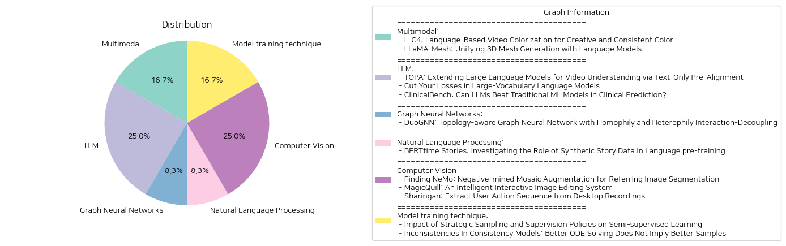

# Daily Artificial Intelligence Insights : Papers

## 🪸 Multimodal

**요약:**

요약 보고서:

1. 주제 및 테마 추출:
   - 'L-C4: Language-Based Video Colorization for Creative and Consistent Color': 비디오 컬러화를 언어 기반으로 유도하여 창의적이고 일관된 컬러 표현을 달성하는 방법을 탐구.
   - 'LLaMA-Mesh: Unifying 3D Mesh Generation with Language Models': 대규모 언어 모델(LLM)을 활용한 3D 메쉬 생성 및 통합 모델 개발을 탐구.

2. 공통 키워드, 트렌드 및 패턴 식별:
   - 공통 키워드: 언어 모델, 창의성, 일관성, 모델 발전.
   - 주요 트렌드: 언어 기반 입력을 통한 시각적 데이터 생성의 발전, 언어 모델을 활용한 다중 모달 통합 및 이해 강화를 통한 혁신적 접근.

3. 주요 이벤트 및 중요한 정보 요약:
   - 'L-C4' 논문에서는 사용자 언어 설명을 기반으로 비디오에 색상을 입히는 모델을 제안하며, 기존 방법의 공간적, 시간적 제한을 해결했습니다. 이 모델은 사전 학습된 크로스 모달리티 생성 모델을 활용하여 창의적인 색상 표현과 시간적 일관성을 캡처합니다.
   - 'LLaMA-Mesh'에서는 언어 모델을 통해 3D 메쉬 데이터도 효과적으로 이해하고 생성할 수 있도록 하는 새로운 접근을 소개합니다. 텍스트 기반 토큰화를 통해 공간적 지식을 향상시키고, 텍스트와 3D 데이터를 통합하여 대화형 3D 생성 및 이해를 가능하게 합니다.

4. 이러한 이벤트의 다양한 부문에 미치는 영향 분석:
   - L-C4는 영상 제작 및 편집 분야에서 사용자 상호작용을 통한 창의적이고 일관적인 색상 디자인을 가능하게 하여 혁신적인 비디오 제작 방식을 제공할 수 있습니다.
   - LLaMA-Mesh는 3D 모델링 및 게임 개발 분야에서 자연어 기반의 직관적 생성 과정과 융합형 작업 흐름을 가능하게 함으로써, 복잡한 모델링 작업을 보다 간단하고 접근 가능하게 만듭니다.

5. 결론 및 향후 주목할 만한 발전:
   - 결론적으로, 언어 모델의 발전은 창의적인 시각적 데이터 생성 및 이해를 새롭게 하고 있으며, 이러한 접근은 향후 다양한 산업 분야에 큰 영향을 미칠 가능성이 큽니다. 특히, 향후 발전할 것으로 기대되는 분야는 비주얼 미디어 관련 창의적 작업과, 자연어에 기반한 대화형 인터페이스를 통한 복합 데이터의 통합 생성 및 이해입니다.

**출처:**

 - L-C4: Language-Based Video Colorization for Creative and Consistent Color (https://deeplearn.org/arxiv/544948/l-c4:-language-based-video-colorization-for-creative-and-consistent-color)
 - LLaMA-Mesh: Unifying 3D Mesh Generation with Language Models (http://arxiv.org/abs/2411.09595v1)

## 🐱 LLM

**요약:**

보고서 요약:

1. 주요 주제 및 핵심 주제:
   - 비디오 이해 및 텍스트 전용 사전 정렬
   - 대규모 언어 모델에서의 손실 계산 최적화
   - 임상 예측에서 대규모 언어 모델과 전통적인 기계 학습 모델의 비교

2. 공통 키워드, 동향 및 패턴:
   - 대규모 언어 모델(LLMs) 활용
   - 클립 모델 및 기능 정렬
   - 메모리 소비 및 계산 최적화
   - 임상 예측 및 의료 텍스트 처리
   - 전통적인 기계 학습 모델(SVM, XGBoost)과의 비교

3. 주요 사건 및 중요한 정보:
   - 첫 번째 논문에서는 기존의 웹 비디오-텍스트 데이터의 복잡성을 강조하며, TOPA라는 새로운 접근 방식을 제안하여 실비디오 데이터의 사전 훈련 없이 언어 모델을 비디오 이해에 확장하는 방법을 소개함. CLIP 모델을 활용하여 텍스트와 비디오 모달리티를 정렬함으로써 성공적인 실험 결과를 나타냄.
   - 두 번째 논문은 대규모 언어 모델의 학습 과정에서 발생하는 메모리 소비 문제를 해결하기 위해 Cut Cross-Entropy(CCE)라는 방법을 제안함. 이 방법은 교차 엔트로피 손실 계산을 개선하여 전체 메모리 사용을 획기적으로 줄이고, 학습 속도나 수렴을 희생하지 않음.
   - 세 번째 논문에서는 대규모 언어 모델이 임상 예측에서 전통적인 기계 학습 모델에 비해 열등할 수 있음을 제시하며, ClinicalBench라는 새로운 벤치마크를 구축하여 대규모 언어 모델의 임상 예측 능력을 평가하고 전통적 모델과 비교함.

4. 이 사건들의 영향 분석:
   - TOPA와 같은 기술의 개발은 비디오 이해 분야에서의 새로운 접근 방법을 제공하며, 향후 비디오 및 텍스트 데이터 통합 작업에 영향을 미칠 수 있음.
   - CCE의 혁신적인 메모리 최적화는 대규모 언어 모델의 실용성을 높이고, 새로운 학습 방법론에 대한 가능성을 열어줌.
   - ClinicalBench의 결과는 의료 분야에서의 대규모 언어 모델의 실용성에 대한 경각심을 주며, 임상 환경에서의 LLM 활용을 신중히 고려해야 함을 시사함.

5. 결론 및 향후 주목할 발전:
   - 비디오 이해에서의 언어 모델 확장은 현재와 미래의 인공지능 시스템 설계에 중요한 기여를 할 것으로 예상됨.
   - 메모리 최적화 기술은 더 많은 데이터와 더 큰 모델을 처리할 능력을 향상시킬 전망임.
   - 임상 예측에서의 LLM과 전통적 ML 모델의 비교 연구는 LLM의 잠재적 한계를 이해하고 그 적용 범위를 보다 명확히 하는 기회가 될 수 있음. 임상 환경에서의 LLM 사용은 여전히 신중한 접근이 필요함.

**출처:**

 - TOPA: Extending Large Language Models for Video Understanding via Text-Only Pre-Alignment (https://deeplearn.org/arxiv/544949/topa:-extending-large-language-models-for-video-understanding-via-text-only-pre-alignment)
 - Cut Your Losses in Large-Vocabulary Language Models (http://arxiv.org/abs/2411.09009v1)
 - ClinicalBench: Can LLMs Beat Traditional ML Models in Clinical Prediction? (http://arxiv.org/abs/2411.06469v1)

## 🍋 Graph Neural Networks

**요약:**

**종합 요약 보고서: DuoGNN 연구**

1. **핵심 주제 및 테마 추출:**
   - 그래프 신경망(GNNs)의 응용 및 한계.
   - 의학 이미징 적용.
   - 호모필리 및 헤테로필리 상호작용의 분리.
   - 메시지 전달 효율성 문제점.
   - DuoGNN 모델 제안 및 개선점.

2. **공통 키워드 및 트렌드 식별:**
   - GNNs의 과다 평활화(Over-Smoothing) 및 과다 압축(Over-Squashing) 현상.
   - 그래프의 토폴로지 인식을 통한 확장성 및 일반화 가능성.
   - 고성능 분별과 효율성 개선을 위한 알고리즘 개발.

3. **주요 이벤트 및 중요 정보 요약:**
   - DuoGNN은 의학 및 비의학 노드 분류 데이터셋에서 일관된 성능 향상을 보임.
   - 호모필리 상호작용을 위한 토폴로지 기반 엣지 필터링 알고리즘 개발.
   - 헤테로필리 상호작용을 위한 그래프 응축 기술 도입.
   - 듀얼 호모필리 및 헤테로필리 집계 파이프라인을 제안하여 GNN의 일반적인 문제점 해결.

4. **이벤트의 다양한 부문에 대한 영향:**
   - 의학 이미징: 자동 질병 진단의 정확도 향상.
   - 컴퓨터 과학 및 네트워크 분석: 큰 그래프에서도 효율적인 데이터 처리 가능성 제고.
   - 알고리즘 개발 및 데이터 과학: 그래프 토폴로지를 활용한 새로운 접근법을 통해 모델 확장성과 일반화 가능성 증대.

5. **최종 종합 요약 및 결론:**
   - DuoGNN은 GNNs의 주요 한계를 극복하는 동시에 다양한 그래프 토폴로지에 효율적으로 적용될 수 있는 새로운 모델이다.
   - 향후 발전 가능성: DuoGNN과 같은 토폴로지 인지형 그래프 신경망 구조가 더욱 복잡한 문제에서도 적용될 수 있을 것으로 기대됨.
   - DuoGNN 모델은 현재 GitHub에서 사용 가능하며, 추가적인 연구 개발에 기반을 제공할 것이다.

**출처:**

 - DuoGNN: Topology-aware Graph Neural Network with Homophily and Heterophily Interaction-Decoupling (https://deeplearn.org/arxiv/544950/duognn:-topology-aware-graph-neural-network-with-homophily-and-heterophily-interaction-decoupling)

## ✈️ Natural Language Processing

**요약:**

요약 보고서:

1. 주요 주제 및 테마:
   - 본 논문은 인간 발달에서 유도된 데이터 제약에 따른 효율적인 사전 훈련을 중심으로 한 BabyLM Challenge의 Strict 및 Strict-Small 트랙에 대한 연구를 다룹니다.
   - 이야기 데이터의 합성 및 그것이 언어 사전 훈련에 미치는 영향을 조사합니다.
   - TinyStories라는 짧은 이야기들로 구성된 데이터셋을 활용하여 이야기를 완성하는 과정에서 머신 러닝 모델의 학습 가능성을 연구합니다.

2. 공통 키워드, 트렌드 및 패턴:
   - 합성 데이터, 스토리 데이터, 언어 모델링, 사전 훈련, 데이터 제약, GPT-Neo, LTG-BERT, BabyLM 데이터셋

3. 주요 사건 및 중요 정보:
   - TinyStories 데이터셋의 일부를 사용하여 GPT-Neo 모델을 훈련하고, 1억 단어 이하의 데이터 접근만으로도 높은 품질의 이야기 완성을 생성할 수 있음을 발견했습니다.
   - LTG-BERT 인코더 모델을 TinyStories의 하위 집합, GPT-Neo에 의해 생성된 이야기 완성, BabyLM 데이터셋의 하위 집합을 결합하여 훈련했습니다.
   - 실험 결과, 합성 데이터는 때때로 약간의 이득을 제공할 수 있지만, 전체적으로는 언어적 이해에 부정적인 영향을 미치는 것으로 나타났습니다.

4. 다양한 분야에 미친 영향:
   - 이야기를 통한 데이터 증강은 데이터가 부족한 상황에서 언어 모델링을 위한 잠재력을 보여줍니다.
   - 연구는 스토리 데이터의 합성이 초기 언어 모델링에서의 데이터 사용 방법을 개선할 수 있음을 보여주며, 교육 및 학습 자료 생성에 새로운 가능성을 제공합니다.

5. 최종 요약 및 결론:
   - 합성 이야기 데이터가 초기 언어 모델링에 미치는 영향을 조사하는 이 연구는 데이터가 제한된 환경에서 언어 모델링에 새로운 길을 제시합니다.
   - 비록 합성 데이터가 언어 이해에 부정적인 영향을 미칠 수 있지만, 데이터 증강의 가능성을 통해 모델의 잠재적 성능 향상을 시사합니다.
   - 향후 이러한 연구는 데이터 제약을 극복하기 위한 방법론 연구와, 교육 및 자연어 처리 응용의 발전과 깊은 관련이 있습니다.

**출처:**

 - BERTtime Stories: Investigating the Role of Synthetic Story Data in Language pre-training (https://deeplearn.org/arxiv/544951/berttime-stories:-investigating-the-role-of-synthetic-story-data-in-language-pre-training)

## ⭐ Computer Vision

**요약:**

보고서 제목: 최신 이미지 편집 및 사용자 행동 분석 방법의 발전

1. 주요 주제 및 테마 추출:
   - 'NeMo: 부정적-모자이크 증가 기법'은 이미지 분할에서 특정 표현식의 복잡성과 유사한 객체의 존재가 작업의 난이도를 결정한다고 설명합니다. 데이터의 병목 현상을 해결하기 위해 새로운 데이터 증강 방법을 제안합니다.
   - 'MagicQuill'은 실시간 편집 의도를 예측하는 지능형 이미지 편집 시스템으로, 사용자가 명확한 명령 입력 없이도 창의적인 아이디어를 빠르게 구현할 수 있도록합니다.
   - 'Sharingan'은 비디오 내 사용자 활동 기록, 특히 데스크톱 녹화에서 사용자 행동 시퀀스를 추출하는 새로운 비전-언어 모델 기반 방법을 제안합니다.

2. 공통 키워드, 트렌드, 패턴 식별:
   - 다중모달 모델, 증강된 데이터, 실시간 예측, 지능형 시스템, 사용자 행동 분석.
   - 이들 논문 모두 사용자와의 상호작용, 데이터 증강 및 분석에 중점을 두고 있습니다.

3. 주요 이벤트 및 중요 정보 요약:
   - NeMo 기법은 텍스트 쿼리로 인해 특정 물체를 인식하는 반복적 이미지 분할 작업의 정확성을 향상시킵니다. 이 접근법은 다양한 데이터 세트 및 모델에서 일관된 개선을 보였습니다.
   - MagicQuill은 사용자의 편집 의도를 실시간으로 예측하고 이에 따라 이미지를 정확하게 편집하는 시스템을 개발하였습니다. 이는 고급 확산 사전 및 이중-브랜치 플러그인 모듈을 활용해 정밀한 제어를 가능케 합니다.
   - Sharingan은 사용자 동작 시퀀스를 정확히 추출할 수 있는 두 가지 방법(직접 프레임 기반 접근법 및 차별 프레임 기반 접근법)을 제안하며, 사용자의 행동을 분석 및 자동화하는 데 기여합니다.

4. 이벤트의 다양한 부문에 대한 영향 분석:
   - NeMo와 같은 증강 기법은 이미지 처리와 컴퓨터 비전 분야에서 데이터의 질을 향상시켜 사진 잡기, 보안, 딥러닝 훈련 등에 긍정적 영향을 미칠 수 있습니다.
   - MagicQuill의 발전은 그래픽 디자인 및 개인 제작 분야의 창의성 구현을 가속할 수 있습니다.
   - Sharingan의 연구는 비디오 데이터 분석 및 사용자 행동 자동화 기술의 발전에 기여하며, 이는 비즈니스 프로세스 자동화 및 사용자 경험 개선에 영향을 줄 수 있습니다.

5. 최종 요약 및 결론:
   - 각 연구는 이미지 처리, 사용자 행동 이해 및 데이터 증강 분야의 혁신을 대표하며, 이들은 기술 발전에 중대한 도약을 제공하고 있습니다.
   - NeMo, MagicQuill, Sharingan과 같은 최신 방법들이 관련 분야의 개발을 촉진하고 있으며, 향후 연구 방향에 중요한 기초를 제공할 것입니다.
   - 미래에는 이러한 기술들이 더 정교한 사용자 상호작용과 데이터 분석으로 이어질 가능성 있음을 전망할 수 있습니다.

**출처:**

 - Finding NeMo: Negative-mined Mosaic Augmentation for Referring Image Segmentation (https://deeplearn.org/arxiv/544952/finding-nemo:-negative-mined-mosaic-augmentation-for-referring-image-segmentation)
 - MagicQuill: An Intelligent Interactive Image Editing System (http://arxiv.org/abs/2411.09703v1)
 - Sharingan: Extract User Action Sequence from Desktop Recordings (http://arxiv.org/abs/2411.08768v1)

## 🤩 Model training technique

**요약:**

요약 보고서:

1. 주요 주제 및 테마 추출:
   - 첫 번째 논문은 준지도 학습에서의 전략적 샘플 선택 및 감독 방침의 영향을 검토하고 있습니다. 특히, 라벨링된 데이터의 수가 매우 제한적일 때 대표성과 질의 중요성을 강조합니다. 여기서 두 가지 질문을 탐구합니다: (1) 어떤 샘플을 라벨링하는 것이 중요한가? (2) 라벨링된 샘플을 학습 과정에서 어떻게 사용하는 것이 중요한가?
   - 두 번째 논문은 일관성 모델(CM)에 대한 논리적 불일치를 다룹니다. ODE 문제를 더 잘 푼다고 해서 샘플 질이 좋아지지는 않는다고 주장하며, CM의 효과적인 사용 방식을 조사합니다.

2. 공통 키워드, 트렌드 및 패턴 식별:
   - 샘플 선택 및 라벨링의 중요성.
   - 확산 모델과 일관성 모델의 샘플링 비용 및 품질.
   - 준지도 학습과 샘플의 대표성.
   - ODE(일반 미분 방정식) 해결의 정확성 및 샘플 품질과의 상관관계.

3. 논문의 주요 이벤트 및 핵심 정보 요약:
   - 첫 번째 논문에서는 무작위 샘플링 대신 대표성을 고려한 샘플 선택이 성능 향상에 기여하며, 특히 매우 적은 라벨의 경우 최대 7.5% 성능 향상을 가져올 수 있다고 주장합니다.
   - 두 번째 논문에서는 Direct CMs를 통해 ODE 해결 오류를 줄일 수 있지만, 오히려 샘플 품질이 저하될 수 있음을 발견하며, 이는 CM이 잘 작동하는 이유에 대한 의문을 제기합니다.

4. 이러한 사건들이 다양한 분야에 미치는 영향 분석:
   - 머신러닝 분야에서 샘플 선택 및 라벨링 전략은 데이터 활용의 효율성과 모델 성능에 직접적인 영향을 미칩니다.
   - 확산 모델 및 일관성 모델 개선은 실질적인 샘플링 비용 절감과 함께 샘플 품질에 대한 추가 연구 필요성을 나타냅니다.

5. 최종 통합 요약 및 향후 개발 감시:
   - 준지도 학습에서 샘플 선택의 중요성과 ODE를 통한 샘플 질 향상의 제한점을 확인하였습니다. 이러한 연구는 점점 대두되고 있는 모델 효율성 및 성능 최적화의 필요성을 강조합니다. 향후 연구는 다양한 데이터셋에 대한 확장성 및 실제 응용 프로그램에서의 유효성을 더 깊이 탐구하는 방향으로 이어질 것으로 예상됩니다.

**출처:**

 - Impact of Strategic Sampling and Supervision Policies on Semi-supervised Learning (https://deeplearn.org/arxiv/544953/impact-of-strategic-sampling-and-supervision-policies-on-semi-supervised-learning)
 - Inconsistencies In Consistency Models: Better ODE Solving Does Not Imply Better Samples (http://arxiv.org/abs/2411.08954v1)

