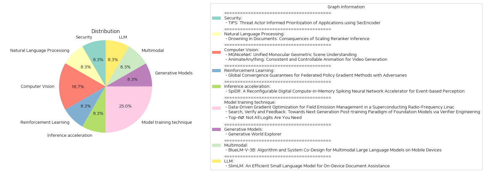

# Daily Artificial Intelligence Insights : Papers

## 🌞 Security

**요약:**

본 보고서는 여러 논문의 제목과 요약을 바탕으로 주요 주제 및 사건들을 종합하여 요약한 것입니다.

1. 주요 주제 및 개념 추출:
   - TIPS: 위협 행위자 정보 기반의 어플리케이션 우선순위 결정 시스템
   - SecEncoder: 보안에 최적화된 특화 언어 모델
   - 언어 모델: 인코더와 디코더의 장점을 결합
   - 위협 행위자 인텔리전스 통합
   - 보안 분석가의 조사 작업량 감소

2. 공통 키워드, 트렌드 및 패턴:
   - 위협 행위자: 위협 행위자로부터의 정보 획득 및 활용
   - 우선순위 결정: 어플리케이션의 위험성에 따라 우선순위를 결정
   - 언어 모델: 인코더 및 디코더를 활용한 언어 퍼포먼스 향상
   - 데이터 기반: 실제 데이터를 활용한 효력 검증
   - 보안 프로세스 개선: 위협 반응 절차의 간소화 및 효율 증대

3. 주요 사건 및 비판적 정보 요약:
   - TIPS는 위협 행위자 정보 기반의 어플리케이션 식별 및 우선순위 결정을 통해 보안 위협을 효과적으로 경감시킴.
   - TIPS는 실제 응용 프로그램 벤치마크 데이터셋 실험에서 높은 정확성을 보였으며, 악성 애플리케이션 식별에 있어 F-1 점수 0.90을 달성.
   - 보안 분석가의 조사 백로그를 87% 감소시켜 위협 반응 프로세스의 효율성을 크게 도왔다.

4. 이 사건들이 다양한 분야에 미친 영향:
   - 보안 분야: 보안 분석가들의 업무 부담 감소 및 보안 위협 대응 속도 증가
   - 기술적 영향: 인코더 및 디코더 언어 모델의 결합을 통한 보안 기술 혁신
   - 데이터 분석: 실제 데이터 기반으로 한 신뢰성 있는 보안 모델의 중요성 부각

5. 종합적인 요약과 향후 발전할 가능성:
   - TIPS는 위협 행위자 정보와 언어 모델 기술의 결합을 통해 보안 업무의 효율성과 정확성을 크게 향상시켰음.
   - 향후 위협 행위자 정보의 더욱 정교한 사용과 AI 기반 프레임워크 확장을 통해 보안 자동화 솔루션이 더 발전할 것으로 기대됨.
   - 보안의 분야는 더욱 빠르고 정확한 위협 대응 체계를 구축하는 것을 목표로 할 것으로 보이며, 여기에는 데이터 기반 결정 모델의 활성화와 인공지능의 향상이 중요한 역할을 할 전망.

**출처:**

 - TIPS: Threat Actor Informed Prioritization of Applications using SecEncoder (https://deeplearn.org/arxiv/548075/tips:-threat-actor-informed-prioritization-of-applications-using-secencoder)

## ☀️ Natural Language Processing

**요약:**

제목: '문서 속에서의 추락: Reranker 추론 확장의 결과'

1. 주요 주제 및 테마 추출: 
이 논문은 재랭커(reranker), 특히 교차 인코더(cross-encoder)를 사용하여 초기 정보 검색 시스템이 가져온 문서를 다시 평가하는 기술을 다루고 있습니다. 

2. 공통 키워드 및 패턴 식별:
논문에서 자주 언급되는 키워드는 "재랭커(reranker)", "교차 인코더(cross-encoder)", "문서 평가", "효과적인 재랭킹", "결과 저하" 등이 있습니다. 논문은 재랭커의 성능 한계와 효과의 감소에 초점을 맞춥니다.

3. 주요 사건 및 중요한 정보 요약:
- 재랭커는 비싸지만 초기 정보 검색 시스템이 가져온 문서를 더 효과적으로 다시 평가하는 것으로 여겨져 왔습니다.
- 실험 결과, 최고 수준의 재랭커가 더 많은 문서를 평가할 때 수익 감소가 발생하며, 일정 한계를 넘어설 경우 품질이 저하된다는 점이 밝혀졌습니다.
- 특히, 쿼리와 어휘적 또는 의미적 중복이 없는 문서에 높은 점수를 부여하는 경향이 확인되었습니다.

4. 이러한 사건의 다양한 부문에 대한 영향 분석:
- 정보 검색 분야에서는 재랭커의 최적 사용량과 그 한계에 대한 이해가 필요하며, 시스템의 성능 개선에 중점을 두어야 합니다.
- 연구 결과는 정보 검색 시스템의 개발 및 향상에 관한 새로운 연구 방향을 제시하며, 효과적인 검색 알고리즘 개발에 영향을 미칠 수 있습니다.

5. 최종 통합 요약:
재랭커의 확장은 그 성능이 반드시 비례적으로 증가하지 않는다는 것을 보여줍니다. 최고 수준의 재랭커조차 일정 한계를 넘어서면 품질 저하를 경험하며, 이로 인해 정보 검색 시스템에서의 최적의 문서 수를 결정하는 연구가 필요합니다. 이러한 연구는 정보 검색 시스템의 개발 방향을 재정립할 수 있으며, 향후에는 재랭커의 효율성을 높일 수 있는 방안에 대한 추가 연구가 활발히 이루어질 것입니다.

**출처:**

 - Drowning in Documents: Consequences of Scaling Reranker Inference (https://deeplearn.org/arxiv/549218/drowning-in-documents:-consequences-of-scaling-reranker-inference)

## 🪸 Computer Vision

**요약:**

### 요약 보고서

#### 1. 주요 주제 및 주제 추출
- **MGNiceNet: Unified Monocular Geometric Scene Understanding**
  - 주제: 단일 카메라 기반 기하학적 장면 이해
  - 핵심 주제: 팬옵틱 세그멘테이션, 자가 지도 학습 깊이 추정, 자율 주행 차량
  - 중점 사항: RT-K-Net을 기반으로 팬옵틱 세그멘테이션 및 자가 지도 학습 단안 깊이 추정을 통합한 MGNiceNet을 제안

- **AnimateAnything: Consistent and Controllable Animation for Video Generation**
  - 주제: 일관되고 제어 가능한 비디오 생성
  - 핵심 주제: 여러 조건에서의 비디오 조작, 광학 흐름, 주파수 기반 안정화
  - 중점 사항: 통일된 다중스케일 제어 기능 융합 네트워크를 사용한 모션 일관성 유지 및 광학 흐름을 활용한 최종 비디오 생성

#### 2. 공통 키워드, 트렌드 및 패턴 식별
- **공통 키워드**: 통합 접근법, 실시간 애플리케이션, 상태-최고의 결과, 네트워크 설계, 주어진 코드 및 모델
- **트렌드**: 자율 주행 및 비디오 생성 분야에서의 실시간 처리 가능성 강조, 자가 지도 학습 및 일관성 있는 비디오 생성을 위한 고급 기술 적용

#### 3. 주요 이벤트 및 중요 정보 요약
- **MGNiceNet**:
  - MGNiceNet은 팬옵틱 경로 정보를 깊이 추정에 사용하여 자가 지도 학습 깊이 예측기를 도입.
  - 운동 마스킹 방법을 팬옵틱 가이드로 도입하여 비디오 주석 없이 깊이 추정 개선.
  - Cityscapes 및 KITTI와 같은 자율 주행 데이터셋에서 평가되어 실시간 방법들과 비교하여 최우수 성과를 보임.

- **AnimateAnything**:
  - 다양한 조건 하에서 일관된 비디오 조작을 위한 통합 제어 가능 비디오 생성 접근법 제안.
  - 프레임마다 컴퓨터 비전 기술을 활용하여 광학 흐름을 모션 가이드로 사용.
  - 주파수 기반 안정화 모듈로 플리커 문제 감소 및 시간적 일관성 향상.

#### 4. 이러한 이벤트가 다양한 부문에 미치는 영향 분석
- **자율 주행 차량 부문**:
  - 실시간 처리 시스템의 발전을 통해 안전성과 효율성이 높아짐.
  - MGNiceNet과 같은 기술은 더 나은 감지 및 환경 인식을 가능하게 하여 자율 주행 기술 향상에 기여할 수 있음.

- **비디오 생성 및 편집 산업**:
  - 일관성 있고 제어 가능한 비디오 생성기술은 영화, 애니메이션 및 기타 미디어 제작에 혁신적인 효과를 가져올 수 있음.
  - AnimateAnything과 같은 기술의 발전은 비디오 콘텐츠 제작의 효율성을 높이고 비용을 절감할 가능성 있음.

#### 5. 결론과 향후 발전 가능성
이러한 연구들은 자가 지도 학습을 통한 실시간 처리와 모션 일관성을 개선한 비디오 생성 기술이 자율 주행 차량과 미디어 제작의 미래를 크게 변화시킬 수 있음을 보여줍니다. 향후 연구는 이러한 기술들이 더 넓은 범위의 환경과 조건에서 활용될 수 있도록 발전시키는 방향으로 진행될 것입니다. 또한, 이러한 기술들의 상업적 응용을 위한 탐구도 더욱 활발해질 것이라 예측됩니다.

**출처:**

 - MGNiceNet: Unified Monocular Geometric Scene Understanding (https://deeplearn.org/arxiv/549352/mgnicenet:-unified-monocular-geometric-scene-understanding)
 - AnimateAnything: Consistent and Controllable Animation for Video Generation (http://arxiv.org/abs/2411.10836v1)

## 💚 Reinforcement Learning

**요약:**

제목: '적대자가 있는 연방 정책 경사 방법을 위한 글로벌 수렴 보장'
요약: 연방 강화 학습(FRL)은 여러 에이전트가 원시 궤적을 공유하지 않고 의사결정 정책을 공동으로 구축할 수 있게 합니다. 그러나 이 에이전트들 중 소수의 적대적 에이전트가 있다면 이는 치명적인 결과를 초래할 수 있습니다. 본 연구는 적대적 에이전트가 서버에 임의의 값을 전송할 수 있는 상황에서도 강건한 정책 경사 기반의 접근법을 제안합니다. 이 설정하에, 본 연구의 결과는 일반적인 매개변수화와 함께 첫 번째 글로벌 수렴 보장을 형성합니다. 이러한 결과는 적대자가 있음에도 불구하고 강력한 복원력을 보여주며, 총 에이전트 수 $N$ 및 적대적 에이전트 수 $f<N/2$일 때 최적의 샘플 복잡도 $\tilde{\mathcal{O}}\left( \frac{1}{N\epsilon^2} \left( 1+\frac{f^2}{N}\right)\right)$을 달성함을 시사합니다.

종합 요약: 연방 강화 학습(FRL) 환경에서 다수의 에이전트가 협업하여 정책을 구축할 수 있습니다. 그러나 일부 에이전트가 적대적일 경우, 이는 설계된 정책에 큰 영향을 미칠 수 있습니다. 이 연구에서 제안한 강건한 정책 경사 기반 방법은 적대적 에이전트가 존재할 때도 글로벌 수렴을 보장하며, 최적의 샘플 복잡도를 달성합니다. 이는 FRL 시스템에서 적대적 에이전트의 존재에도 불구하고 체계의 효율성과 안정성을 유지할 수 있음을 보여줍니다. 앞으로의 연구에서는 더 복잡한 환경 및 다양한 적대적 시나리오에서도 이러한 방법의 유효성을 검증하는 방향으로 발전이 예상됩니다.

**출처:**

 - Global Convergence Guarantees for Federated Policy Gradient Methods with Adversaries (https://deeplearn.org/arxiv/545735/global-convergence-guarantees-for-federated-policy-gradient-methods-with-adversaries)

## 🧸 Inference acceleration

**요약:**

제목: 'SpiDR: 사건 기반 인식을 위한 재구성 가능한 디지털 메모리 내 연산 스파이킹 신경망 가속기'

요약: 스파이킹 신경망(SNN)은 역동적 비전 센서(DVS)가 생성하는 비동기적인 시계열 데이터를 효율적으로 처리할 수 있는 고유의 반복성을 갖추어 사건 기반 비전 애플리케이션에 적합합니다. 그러나 기존 SNN 가속기는 다양한 뉴런 모델, 비트 정밀도, 네트워크 크기에 대한 적응성 부족, 비효율적인 막 전위(Vmem) 처리, 제한된 희소성 최적화 등의 한계를 가지고 있습니다. 이러한 문제를 해결하기 위해 제안된 \chipname는 스케일 가능하고 재구성 가능한 디지털 메모리 내 연산(CIM) SNN 가속기로, 다음과 같은 주요 특성을 가지고 있습니다: 1) 메모리 내 연산 및 재구성 가능한 운영 모드를 사용하여 가중치 및 Vmem 데이터 구조와 관련된 데이터 이동을 최소화하고 다양한 작업량에 효율적으로 적응할 수 있습니다. 2) 여러 가지 가중치/Vmem 비트 정밀도 값을 지원하여 정확성과 에너지 효율성을 균형 있게 조절할 수 있으며 다양한 애플리케이션 요구에 대한 적응성을 향상시킵니다. 3) 희소 입력을 위한 제로 스키핑 메커니즘은 스파이크의 고유한 희소성을 활용하여 에너지 사용을 크게 줄이며, 낮은 희소성에 대한 과도한 오버헤드를 초래하지 않습니다. 4) 비동기 핸드셰이킹 메커니즘은 다양한 연산 유닛의 가변 실행 시간 동안 파이프라인의 계산 효율성을 유지합니다. 대만 반도체 제조 회사(TSMC)의 65nm 저전력(LP) 기술로 제조된 \chipname는 최근 문헌에서 제안된 다른 디지털 SNN 가속기와 기술 노드가 동일 조건에서 경쟁력 있는 성능을 보여주며, 고급 재구성 가능성을 지원합니다. 이는 4비트 가중치와 7비트 Vmem 정밀도로 최대 95% 입력 희소성에서 5 TOPS/W의 에너지 효율성을 달성합니다.

종합 요약 및 결론: 이 연구는 사건 기반 인식을 위한 SNN 가속기의 설계 및 구현에 있어 중요한 발전을 나타냅니다. 특히 다양한 뉴런 모델 및 비트 정밀도에 대한 적응성을 극대화하고, 희소 최적화를 통해 에너지 효율성을 향상시킨 점이 두드러집니다. 미래의 개발에서는 이러한 기술을 바탕으로 더욱 다양한 응용 분야에 확장 가능성이 큰 SNN 시스템의 설계가 기대됩니다.

**출처:**

 - SpiDR: A Reconfigurable Digital Compute-in-Memory Spiking Neural Network Accelerator for Event-based Perception (https://deeplearn.org/arxiv/545756/spidr:-a-reconfigurable-digital-compute-in-memory-spiking-neural-network-accelerator-for-event-based-perception)

## 🌿 Model training technique

**요약:**

1. 주요 주제 및 테마 추출:
   - 첫 번째 논문에서는 초전도 라디오 주파수 선형 가속기의 장 관리에서 기계 학습을 통한 방사선 수준 예측 및 구배 최적화에 대해 다룹니다.
   - 두 번째 논문은 기초 모델의 최신 사후 훈련 패러다임인 "검증기 공학"을 제안하며, 기계 학습에서 새로운 감독 신호의 발전을 강조합니다.
   - 세 번째 논문은 대형 언어 모델의 샘플링 방법을 개선한 "top-$nσ$"를 도입하여 추론 과제에서의 성능 향상을 다룹니다.

2. 공통 키워드, 트렌드 및 패턴 확인:
   - 기계 학습, 최적화, 감독 신호, 모델의 발전 및 향상, 샘플링, 성능 개선

3. 각 논문의 주요 사건 및 중요 정보 요약:
   - 첫 번째 논문은 기계 학습과 불확실성 정량화를 사용하여 선형 가속기의 방사선 수준을 예측하고, 구배 최적화를 통해 중성자 및 감마 방사선을 크게 줄이는 방법을 제안합니다.
   - 두 번째 논문은 "검증기 공학"이라는 새로운 사후 훈련 패러다임을 통해 기초 모델의 감독 신호를 제공하고 인공지능 일반 지능을 향한 중요한 경로를 제시합니다.
   - 세 번째 논문은 대형 언어 모델의 성능을 향상시키기 위해 "top-$nσ$" 샘플링 방법을 도입하며, 기존 방법보다 뛰어난 성능을 보인다는 실험 결과를 제시합니다.

4. 이러한 사건의 다양한 부문에 대한 영향 분석:
   - 초전도 선형 가속기 부문에서 기계 학습의 적용으로 시스템 성능 및 안정성 향상에 기여할 수 있습니다.
   - 기계 학습 분야에서 검증기 공학의 발전은 더 안정적이고 효율적인 인공지능 시스템 개발에 기여할 것으로 보입니다.
   - 대형 언어 모델의 성능 향상은 자연어 처리 및 다른 텍스트 기반 인공지능 응용 프로그램 분야에 긍정적인 영향을 미칠 것입니다.

5. 최종 통합 요약 및 결론, 주목할 미래 발전:
   - 기계 학습 기반의 최적화 기술은 다양한 과학 및 기술 분야에서 강화된 성능과 효율성을 제공할 것입니다.
   - 기초 모델의 발전을 위한 새로운 지도 신호 탐색은 인공지능의 진화를 가속화할 것입니다.
   - "top-$nσ$"와 같은 혁신적인 샘플링 방법은 자연어 처리 분야에서 더 나은 결과를 가져올 수 있으며, 이러한 방법론이 더욱 발전됨에 따라 인공지능 모델들이 더 높은 성능을 달성할 것으로 기대됩니다.

**출처:**

 - Data-Driven Gradient Optimization for Field Emission Management in a Superconducting Radio-Frequency Linac (https://deeplearn.org/arxiv/547416/data-driven-gradient-optimization-for-field-emission-management-in-a-superconducting-radio-frequency-linac)
 - Search, Verify and Feedback: Towards Next Generation Post-training Paradigm of Foundation Models via Verifier Engineering (http://arxiv.org/abs/2411.11504v1)
 - Top-$nσ$: Not All Logits Are You Need (http://arxiv.org/abs/2411.07641v1)

## 🌞 Generative Models

**요약:**

보고서 요약:

1. 주요 주제와 테마 추출:
   - 부분 관찰을 통해 계획 수립
   - 화신 AI의 도전 과제
   - 상상에 의한 정신적 탐색
   - 업데이트된 신념을 통한 정보의사 결정
   - 여객 중심 세계 탐색 프레임워크
   - 큰 규모의 3D 세계 탐색
   - 합성 도시 장면 데이터셋

2. 공통 키워드, 트렌드 및 패턴 식별:
   - 생성적 세계 탐색자(Genex)
   - 가상 물리적 세계
   - 신념 업데이트
   - 결정을 위한 상상된 관찰
   - 장기적 탐색과 의사 결정 모델 활용

3. 각 논문의 주요 이벤트 및 중요 정보 요약:
   - Genex는 인간처럼 물리적 탐색 없이도 상상을 통해 정보를 업데이트하고 상세한 의사 결정을 돕는다.
   - 큰 가상의 물리적 세계를 높은 품질과 일관성을 가지고 장기적으로 탐색할 수 있는 능력
   - Genex-DB라는 합성 도시 장면 데이터셋을 통해 훈련을 성공적으로 시행
   - 기존의 장기 의사 결정 모델들(ex. LLM 에이전트)이 Genex의 관찰을 통해 더 나은 계획을 수립하도록 지원

4. 이러한 사건들의 다양한 부문에 미치는 영향 분석:
   - 화신 AI 분야에서 사람의 상상력을 모방하는 기술 발전
   - 물리적 탐색 필요성을 줄임으로써 시간과 자원 효율성 개선
   - 도시 계획 및 시뮬레이션 분야에서의 발전 가능성
   - 자동화된 의사 결정 프로세스의 향상과 향후 길이 열릴 가능성

5. 결론 및 향후 주시해야 할 발전:
   - 인간의 상상력을 모방하는 AI 모델이 더욱 발전할 가능성이 높음
   - 합성 데이터셋을 활용한 훈련이 더욱 활발히 연구될 것으로 예상
   - 물리적 탐색의 필요성을 줄이는 방향으로 연구가 지속될 것
   - 비즈니스 및 도시 계획에서 AI 기반 의사 결정 모델의 채택이 증가할 것.

**출처:**

 - Generative World Explorer (http://arxiv.org/abs/2411.11844v1)

## 🤩 Multimodal

**요약:**

제목: 'BlueLM-V-3B: 모바일 기기를 위한 다중모달 대형 언어 모델의 알고리즘 및 시스템 공동 설계'

요약: 다중모달 대형 언어 모델(MMLM)의 등장과 인기는 일상생활의 다양한 측면을 강화할 잠재력을 가지고 있습니다. 이러한 모델은 커뮤니케이션 향상, 학습 및 문제 해결을 지원합니다. 특히 모바일 폰은 MMLM의 가장 효과적이고 접근 가능한 배포 플랫폼으로, 일상 업무에 원활하게 통합될 수 있습니다. 그러나 모바일 폰에 MMLM을 배포하는 것은 메모리 크기와 연산 능력의 제한 때문에 실시간 처리에 어려움을 겪습니다. 본 논문에서는 모바일 플랫폼에서 MMLM을 효율적으로 배포하기 위해 BlueLM-V-3B라는 알고리즘과 시스템 공동 설계 접근법을 제안합니다. BlueLM-V-3B는 주류 MMLM의 동적 해상도 체계를 재설계하고 하드웨어 인식 배포를 위한 시스템 최적화를 수행하여 모델 추론을 최적화합니다. 이 모델의 주요 특징은 다음과 같습니다: (1) 작고 경량화된 모델: 2.7B 개의 매개변수를 가진 언어 모델과 400M 개의 매개변수를 가진 비전 인코더로 구성됩니다. (2) 빠른 속도: MediaTek Dimensity 9300 프로세서에서 4비트 LLM 가중치 양자화를 통해 24.4 토큰/초의 생성 속도를 달성합니다. (3) 강력한 성능: OpenCompass 벤치마크에서 $\leq$ 4B 매개변수를 가진 모델 중 가장 높은 평균 점수인 66.1점을 얻었고, 더욱 큰 매개변수를 가진 모델들을 능가했습니다.

결론 및 발전 가능성: BlueLM-V-3B는 모바일 기기에서 MMLM의 현실적인 구현을 위해 중요한 전환점을 제공하며, 메모리 및 연산 제약을 극복하는 효율적인 솔루션으로 주목받고 있습니다. 향후 발전 가능성으로는 모바일 장치 용량 개선에 따른 모델 최적화 연구, 다양한 사용 사례에 대한 적용 확대 등이 주목할 만합니다.

**출처:**

 - BlueLM-V-3B: Algorithm and System Co-Design for Multimodal Large Language Models on Mobile Devices (http://arxiv.org/abs/2411.10640v1)

## 🐱 LLM

**요약:**

**요약 보고서**

**1. 주요 주제 및 테마 추출:**
'SlimLM: On-Device Document Assistance'라는 제목과 요약에서 주요 주제는 소형 언어 모델(SLM)의 스마트폰 적용 가능성, 특히 문서 지원 작업에서의 활용입니다. SlimLM는 모바일 기기에서의 효율적인 문서 처리에 최적화된 SLM 시리즈로 설명됩니다.

**2. 공통 키워드, 트렌드 및 패턴 식별:**
- **효율적인 성능:** SlimLM는 문서 요약, 질문 응답, 제안 작업 같은 문서 지원에 있어 효과적인 성능을 보입니다.
- **모바일 환경 최적화:** 삼성 Galaxy S24에서 최적화된 성능을 발휘하도록 설계되었습니다.
- **모델 크기 및 추론 시간:** 모델 크기(125M ~ 7B 매개변수)와 컨텍스트 길이, 추론 시간 사이의 최적 균형을 찾았습니다.
- **모바일 장치에서의 실행:** 고급 언어 모델을 스마트폰에서 실행함으로써 서버 비용 절감과 개인정보 보호 강화 가능성을 제안합니다.

**3. 주목할 만한 사건 및 주요 정보 요약:**
SlimLM는 Samsung Galaxy S24에서 광범위한 실험을 통해 검증되었으며, 다양한 모델 크기에 따른 성능 평가가 이루어졌습니다. SlimLM는 기존의 소형 언어 모델보다 뛰어난 성능을 보여주는 동시에, 향후 연구에 대한 기준점을 제공합니다. 안드로이드 애플리케이션 형태로 구현되어 실질적인 SLM 배포 통찰력을 제공합니다.

**4. 이러한 사건이 다양한 분야에 미치는 영향 분석:**
- **기술 부문:** 고급 언어 모델을 모바일 환경에 맞게 조정함으로써 기술 발전 가속화 가능성이 있습니다.
- **비용 및 보안 측면:** 서버 의존도를 줄이고, 데이터가 장치 내에서 처리돼 개인정보 보호가 강화될 수 있습니다.
  
**5. 최종 요약 및 미래 발전 가능성:**
SlimLM 프로젝트는 고급 인공지능 기술을 모바일 장치에 직접 적용하여 사용자 경험을 개선할 수 있는 가능성을 제시합니다. 특히, 서버 비용 절감 및 개인정보 보호 측면에서의 장점을 통해 이러한 연구는 계속해서 발전할 것입니다. 앞으로 더 나아진 하드웨어와 함께 향후 개발될 더 효율적인 소형 언어 모델에 대한 기대감이 높습니다.

**출처:**

 - SlimLM: An Efficient Small Language Model for On-Device Document Assistance (http://arxiv.org/abs/2411.09944v1)

