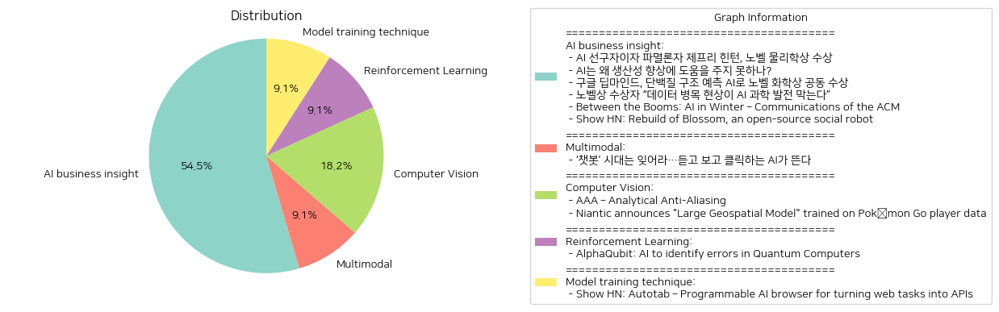

# Daily Artificial Intelligence Insights : News

## ⭐ AI business insight

**요약:**

1. **주요 주제**:
   전체 뉴스 기사에서 공통적으로 나타나는 주요 주제는 '인공지능(AI)'입니다. AI의 발전과 관련된 노벨상 수상 소식, AI의 생산성 향상에 대한 도전, 그리고 AI의 과학적 활용을 위한 데이터 문제 등이 주요 이슈로 부각되고 있습니다.

2. **주요 사건**:
   - 제프리 힌턴 캐나다 토론토 대학교 교수가 노벨 물리학상을 수상하였으며, 이는 현대 AI 기술의 기초가 된 기술에 대한 공로로 인정받은 결과입니다.
   - 구글 딥마인드는 AI를 사용하여 단백질 구조를 예측하는 기술로 노벨 화학상을 공동 수상하였습니다.
   - AI가 경제 발전에 기여하기 위해 필요한 여러 개선점이 강조되었습니다.
   - 노벨상 수상자들이 AI 발전을 저해하는 데이터 병목 현상에 대한 우려를 표명했습니다.
   - 'AI의 겨울'이라는 과거의 부진기를 상기시키며, 현재의 머신 러닝에 대한 관심이 부각되고 있습니다.
   - 오픈 소스 소셜 로봇 플랫폼 "Blossom"의 업그레이드와 그 연구에 대해 소개되었습니다.

3. **영향 분석**:
   - **경제**: AI의 생산성 개선이 필요하다는 지적은 경제적으로 AI 기술이 아직 충분히 활용되지 못하고 있음을 시사합니다. 이는 AI 기술 발전이 경제 전반에 미치는 영향을 극대화할 수 있는 기회의 필요성을 강조합니다.
   - **사회**: AI가 삶의 질을 향상시키는 변혁적 도구로 자리 잡고 있으며, 이는 다양한 사회적 연구와 혁신으로 이어질 가능성이 큽니다.
   - **과학**: AI가 단백질 구조 예측처럼 과학적 발견에 응용되어 노벨상 수상으로 이어진 사례는 과학의 발전에 큰 기여를 하고 있음을 보여줍니다. 그러나 동시에 데이터 품질과 같은 문제가 AI의 과학적 발전을 제한하는 요인으로 작용하고 있습니다.

4. **최종 요약**:
   노벨상 수상 소식을 비롯한 AI 관련 다양한 기사가 AI 기술의 현위치와 도전 과제를 다양한 각도에서 조명하고 있습니다. AI는 여전히 많은 발전 가능성을 가지고 있으며, 과학과 경제, 사회 전반에 걸쳐 혁신을 촉진할 수 있는 잠재력이 있습니다. 그러나 데이터 품질과 같은 실질적 문제와 생산성 향상을 위한 구체적인 개선 요구가 있는 상황입니다. 앞으로는 고품질 데이터 개발과 AI 기술의 효율적 적용이 중요한 과제로 남을 것이며, 사회적·경제적 영향을 고려한 AI 적용 방안이 주목받을 것입니다.

**출처:**

 - AI 선구자이자 파멸론자 제프리 힌턴, 노벨 물리학상 수상 (https://www.technologyreview.kr/ai-%ec%84%a0%ea%b5%ac%ec%9e%90%ec%9d%b4%ec%9e%90-%ed%8c%8c%eb%a9%b8%eb%a1%a0%ec%9e%90-%ec%a0%9c%ed%94%84%eb%a6%ac-%ed%9e%8c%ed%84%b4-%eb%85%b8%eb%b2%a8-%eb%ac%bc%eb%a6%ac%ed%95%99%ec%83%81-%ec%88%98/)
 - AI는 왜 생산성 향상에 도움을 주지 못하나? (https://www.technologyreview.kr/ai%eb%8a%94-%ec%99%9c-%ec%83%9d%ec%82%b0%ec%84%b1-%ed%96%a5%ec%83%81%ec%97%90-%eb%8f%84%ec%9b%80%ec%9d%84-%ec%a3%bc%ec%a7%80-%eb%aa%bb%ed%95%98%eb%82%98/)
 - 구글 딥마인드, 단백질 구조 예측 AI로 노벨 화학상 공동 수상 (https://www.technologyreview.kr/%ea%b5%ac%ea%b8%80-%eb%94%a5%eb%a7%88%ec%9d%b8%eb%93%9c-%eb%8b%a8%eb%b0%b1%ec%a7%88-%ea%b5%ac%ec%a1%b0-%ec%98%88%ec%b8%a1-ai%eb%a1%9c-%eb%85%b8%eb%b2%a8-%ed%99%94%ed%95%99%ec%83%81-%ea%b3%b5%eb%8f%99/)
 - 노벨상 수상자 “데이터 병목 현상이 AI 과학 발전 막는다” (https://www.technologyreview.kr/%eb%85%b8%eb%b2%a8%ec%83%81-%ec%88%98%ec%83%81%ec%9e%90-%eb%8d%b0%ec%9d%b4%ed%84%b0-%eb%b3%91%eb%aa%a9-%ed%98%84%ec%83%81%ec%9d%b4-ai-%ea%b3%bc%ed%95%99-%eb%b0%9c%ec%a0%84-%eb%a7%89%eb%8a%94/)
 - Between the Booms: AI in Winter – Communications of the ACM (https://cacm.acm.org/opinion/between-the-booms-ai-in-winter/)
 - Show HN: Rebuild of Blossom, an open-source social robot (https://msgtn.xyz/rebuild_of_blossom)

## 🫧 Multimodal

**요약:**

1. **주요 테마**:
   뉴스 기사에서 다양한 주제를 볼 수 있지만, 특히 AI(인공지능)의 진화와 기술 발전이 중심 테마로 나타난다. 텍스트 기반의 AI가 이제 음성과 영상으로 확장되는 모습은 기술의 발전과 변화하는 사용자 경험을 반영한다.

2. **주요 사건**:
   - 새로운 유형의 AI 기술이 부상하고 있으며, 음성 인식 및 영상 생성 기능을 갖춘 AI가 떠오르고 있다. 이는 기존의 텍스트 중심 AI 챗봇 시대를 지나 한층 진화된 형태의 AI로의 전환을 의미한다.

3. **영향 분석**:
   - **경제**: AI 기술의 발전은 다양한 산업 분야에서 혁신을 이끌 것으로 예상된다. 특히 음성 및 영상 AI의 활용은 엔터테인먼트, 마케팅, 서비스 산업에 새로운 기회를 제공할 수 있다.
   - **정치**: 데이터 활용 및 개인 정보 보호 문제가 더욱 중요해질 수 있으며, 이를 둘러싼 정책과 규제가 강화될 가능성이 있다.
   - **사회**: AI의 향상된 상호작용 능력은 고객 서비스나 교육 등 사회 여러 영역에 긍정적 영향을 미치며, 사용자 경험을 크게 향상시킬 것이다.

4. **최종 요약**:
   최근의 뉴스는 AI 기술이 텍스트 기반에서 음성과 영상 기반으로 진화하고 있음을 보여준다. 이는 다양한 산업에 걸쳐 큰 변화를 가져올 가능성이 있다. 기업들은 이러한 기술을 적극적으로 도입해 경쟁력을 높이려 할 것이며, 이는 경제적인 기회를 창출할 것이다. 사회적으로는 AI의 확대가 사용자와의 상호작용을 혁신적으로 변화시킬 것이며, 정치적으로는 데이터 정책과 관련해 새로운 논의가 촉발될 것이다. 앞으로 AI 기술의 발전 방향과 그로 인한 경제 및 사회적 변화를 지속적으로 주목할 필요가 있다.

**출처:**

 - ‘챗봇’ 시대는 잊어라…듣고 보고 클릭하는 AI가 뜬다 (https://www.technologyreview.kr/%ec%b1%97%eb%b4%87-%ec%8b%9c%eb%8c%80%eb%8a%94-%ec%9e%8a%ec%96%b4%eb%9d%bc-%eb%93%a3%ea%b3%a0-%eb%b3%b4%ea%b3%a0-%ed%81%b4%eb%a6%ad%ed%95%98%eb%8a%94-ai%ea%b0%80-%eb%9c%ac%eb%8b%a4/)

## ✈️ Computer Vision

**요약:**

**주요 주제**:
최근 뉴스 기사에서는 기술, 특히 그래픽 처리 및 기계 학습과 같은 분야에서 혁신이 주요 주제로 나타납니다. 안티 앨리어싱 기술의 발전과 지리 공간 모델을 통한 물리적 세계 이해가 키워드를 이루며, 이러한 변화가 디지털 기술의 진화를 주도하고 있습니다.

**주요 사건**:
1. 'AAA – Analytic Anti-Aliasing': 이 기술은 그래픽 처리 분야에서 복잡한 안티 앨리어싱 기법을 대신하여 더 간단하고 효과적인 방법을 제시합니다. 낮은 해상도에서도 도형을 보존하면서 추가 버퍼나 하드웨어가 필요없는 이 방법은 그래픽 처리 효율성을 크게 높일 수 있습니다.
   
2. 'Niantic의 포켓몬 고를 활용한 "대형 지리 공간 모델" 발표': Niantic은 포켓몬 고 데이터를 활용하여 장면을 이해하고 전세계적으로 연결할 수 있는 대형 지리 공간 모델을 개발 중입니다. 이는 컴퓨터가 물리적 세계를 감지하고, 이해하며, 탐색할 수 있게 도와주는 기계 학습 모델로 진화하고 있습니다.

**영향 분석**:
- 경제: 그래픽 처리 기술의 발전은 게임 및 시뮬레이션 시장에서 경쟁 우위를 제공하여 새로운 비즈니스 기회를 창출할 수 있습니다. 또한 Niantic의 지리 공간 모델은 AR(증강 현실)과 같은 새로운 시장에서의 발전을 가속화할 것입니다.
  
- 사회: 이러한 기술 발전은 사용자 경험을 개선하고 더 현실적이고 몰입감 있는 인터랙티브 환경을 제공하여 새로운 형태의 사회적 교류와 연결성을 촉진할 수 있습니다.
  
- 환경: 지리 공간 모델의 발전은 환경 모니터링 및 관리에 있어 혁신적인 접근 방식을 제공할 수 있으며, 더 나은 공간 정보 이해는 지속 가능한 개발을 지원할 수 있습니다.

**최종 요약**:
기술 발전은 디지털 및 물리적 세계의 경계를 아우르며, 기능성과 사용자 상호 작용을 혁신적으로 개선하고 있습니다. Analytic Anti-Aliasing과 Niantic의 지리 공간 모델은 각각 그래픽 및 기계 학습 분야에서 주목할만한 진보를 나타내며, 이러한 방향은 미래 기술 발전의 내용하고 많은 가능성을 제공할 것입니다. 지속적인 주의와 발전이 요구되며, 이러한 혁신이 가져올 사회적, 경제적 영향을 면밀히 살펴볼 필요가 있습니다.

**출처:**

 - AAA – Analytical Anti-Aliasing (https://blog.frost.kiwi/analytical-anti-aliasing/)
 - Niantic announces "Large Geospatial Model" trained on Pokémon Go player data (https://nianticlabs.com/news/largegeospatialmodel)

## 🥳 Reinforcement Learning

**요약:**

**요약 보고서: 뉴스 제목 및 요약 기반**

1. **주요 주제**:
   - **양자 컴퓨터와 AI**: 양자 컴퓨터가 직면한 오류 식별 문제를 인공지능(AI)을 통해 해결하는 시도로, 이 주제는 기술 혁신 분야에서 중요한 역할을 하고 있습니다.
   - **기술 발전 및 과학적 돌파구**: AI 기반의 혁신이 과학적 발전을 촉진할 가능성을 보여줍니다.

2. **주요 사건**:
   - **AlphaQubit 개발**: 연구자들은 AlphaQubit이라는 AI 기반 디코더를 개발했으며, 이는 양자 컴퓨터의 오류를 최첨단 정확도로 식별할 수 있습니다. 이러한 기술적 성과는 보다 신뢰할 수 있는 양자 컴퓨팅을 가능하게 하여 복잡한 문제 해결과 과학적 돌파구를 이끌어 낼 수 있습니다.

3. **영향 분석**:
   - **경제적 영향**: 신뢰할 수 있는 양자 컴퓨터의 발전은 금융, 보안, 데이터 처리 등 여러 산업에 혁신적인 변화를 가져올 수 있습니다. 이는 산업의 비용 효율성과 문제 해결 능력을 향상시킬 것으로 예상됩니다.
   - **과학적 발전**: 복잡한 문제 해결 능력이 향상됨에 따라 과학 연구의 새로운 장이 열릴 것입니다. 이는 약물 개발, 기후 모델링 등 다양한 분야에서 중요한 진전을 이끌어 낼 수 있습니다.
   - **사회적 영향**: AI와 양자 컴퓨터의 결합은 기술의 민주화를 가속화하여, 작은 연구 조직과 큰 기업 모두가 복잡한 문제를 해결할 수 있는 더 많은 기회를 제공할 것입니다.

4. **최종 요약**:
   - **결론 및 주요 포인트**: AlphaQubit의 개발은 양자 컴퓨터 오류 식별에 있어 AI의 중요성을 부각시키며, 신뢰성과 효율성을 크게 향상시킬 수 있습니다. 이러한 발전은 다양한 산업과 과학 연구에서 사용될 수 있으며, 이는 장기적으로 사회 전반에 걸친 혁신을 촉진할 수 있습니다.
   - **미래 동향**: 향후 양자 컴퓨팅 기술의 상용화 및 다양한 연구 분야에서의 적용 가능성을 주시할 필요가 있습니다. 또한, 이러한 기술이 어떻게 경제, 과학 및 사회에 커다란 변화를 가져올 수 있는지 지속적으로 모니터링해야 합니다. AI와 양자 컴퓨팅의 융합은 다음 세대의 기술 발전을 주도하는 중요한 요소가 될 것입니다.

**출처:**

 - AlphaQubit: AI to identify errors in Quantum Computers (https://blog.google/technology/google-deepmind/alphaqubit-quantum-error-correction/)

## 🩵 Model training technique

**요약:**

**뉴스 요약 보고서:**

1. **주요 테마**:
   'Show HN: Autotab' 기사는 인공지능(AI) 기반의 브라우저 기술을 활용한 웹 작업 자동화라는 주제를 다루고 있습니다. 최근 AI 기술을 활발히 활용하여 생산성을 높이고, 웹 작업을 효율적으로 관리하려는 경향이 두드러집니다. 특히, 복잡한 작업 자동화 및 인터페이스 개선을 위한 새로운 도구 개발이 화두로 떠오르고 있습니다.

2. **주요 사건**:
   Autotab의 개발자인 Alexi와 Jonas는 크롬 기반 브라우저를 통해 복잡한 웹 작업을 자동화하고자 하며, 이 과정에서 사용자 피드백을 받고 있습니다. 구체적으로는 의도 명세와 제어 흐름을 통해 신뢰성과 성능을 높일 수 있는 전용 저작 도구를 개발했습니다.

3. **영향 분석**:
   이러한 기술 발전은 경제 분야에서 업무 효율성을 개선하고 시간과 자원을 절약하는 데 긍정적인 영향을 미칠 수 있습니다. 또한, 기술 분야에서는 새로운 시장 창출과 경쟁력을 부각시킬 수 있습니다. 사회적으로는 AI 기술의 발전에 따라 일자리의 성격이 변화할 가능성이 제기되며, 교육과 기술 습득이 중요해질 것입니다.

4. **최종 요약**:
   Autotab과 같은 AI 기반 솔루션은 웹 작업의 자동화를 통해 업무 생산성을 대폭 향상시키고, 기업의 운영 방식을 혁신하는 중요한 기술로 자리잡고 있습니다. 향후 발전 추이는 이 기술이 얼마나 널리 채택될지, 그리고 사용자 경험을 어떻게 한층 개선할지에 대한 것입니다. 기술이 발전함에 따라, 관련 법규 및 윤리적 문제에 대한 논의도 필요할 것입니다. 다양한 산업 분야에서 AI를 활용한 자동화 과정이 급속도로 확산할 것으로 예상됩니다.

**출처:**

 - Show HN: Autotab – Programmable AI browser for turning web tasks into APIs (https://news.ycombinator.com/item?id=42197741)

