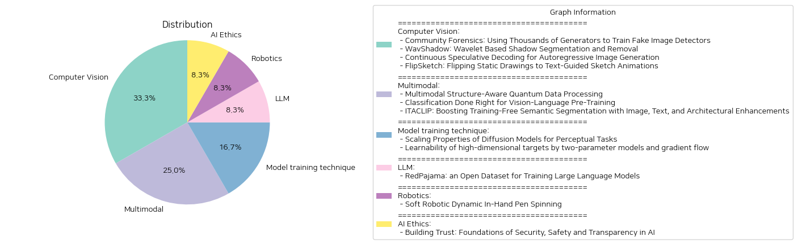

# Daily Artificial Intelligence Insights : Papers

## ✈️ Computer Vision

**요약:**

요약 보고서:

1. **중요 주제 및 테마 추출**:

    - AI와 이미지 생성: 'Community Forensics', 'Continuous Speculative Decoding' 논문은 AI 생성 이미지의 탐지 및 이미지 생성의 효율성에 집중하고 있습니다.
    - 그림자 제거 및 분할: 'WavShadow'는 그림자 분할 및 제거에서의 새로운 방법론을 소개합니다.
    - 스케치 애니메이션: 'FlipSketch'는 정적 이미지를 텍스트 지시를 통해 애니메이션으로 변환하는 시스템을 다룹니다.

2. **공통 키워드 및 경향 식별**:

    - AI/기계학습: AI와 머신러닝 기술이 여러 이미지 처리와 생성에서 핵심적 역할을 하고 있습니다.
    - 데이터셋 다양성: 이미지 탐지 및 생성의 성능 향상을 위해 데이터셋의 다양성 중요성이 강조되고 있습니다.
    - 성능 및 효율성: 각각의 연구는 성능 향상 및 효율성을 강조하며, 핵심 기술의 빠른 수렴력, 향상된 품질을 제공합니다.
    - 혁신적 접근: 모든 논문들에서 기존 문제를 혁신적으로 접근하여 해결책을 제시하고자 합니다.

3. **주요 사건 및 중요한 정보 요약**:

    - 'Community Forensics'는 다양한 AI 모델로부터 2.7백만 이미지의 새로운 대규모 데이터를 수집하여 AI 생성 이미지 탐지 성능의 중요성을 입증하였습니다.
    - 'WavShadow'는 새로운 그림자 제거 및 분할 시스템을 통해 성능과 품질에서 뛰어난 성과를 보여주었습니다.
    - 'Continuous Speculative Decoding'은 연속적인 자동 회귀 이미지 생성 모델의 초석을 다졌으며, 효율성을 두드러지게 향상시켰습니다.
    - 'FlipSketch'는 손쉽게 스케치 애니메이션을 생성할 수 있는 시스템을 통해 스케치의 예술적 본질을 보존합니다.

4. **이벤트의 영향 분석**:

    - 이미지 처리 분야에서는 AI 생성 이미지 탐지의 중요성이 높아짐에 따라 더욱 다양한 데이터셋과 강력한 탐지 모델이 요구됩니다.
    - 그림자 제거 기능은 현실 세계 애플리케이션에서의 이미지 품질 향상을 기대할 수 있습니다.
    - 스케치 애니메이션의 자동화는 예술 및 엔터테인먼트 분야에서 제작 비용을 절감하며 창의적인 콘텐츠 생성에 기여할 수 있습니다.

5. **최종 요약 및 향후 개발**:

    이 연구는 AI 기반 이미지 생성 및 처리의 발전을 서술하며, 점점 더 복잡하고 다양한 데이터에 대한 요구가 커지고 있다는 점을 강조합니다. 이러한 연구들은 이미지 품질을 향상시키고 처리 속도를 증가시키며, 예술 및 상업적 활용에서의 응용 가능성을 넓혀갑니다. 앞으로의 발전 방향은 데이터셋의 더 큰 다양성과 효율적인 모델 훈련 기술 개발이 될 것으로 보이며, 이는 다양한 산업 분야에서 혁신적인 솔루션을 제공하는 데 기여할 것입니다.

**출처:**

 - Community Forensics: Using Thousands of Generators to Train Fake Image Detectors (https://deeplearn.org/arxiv/546034/community-forensics:-using-thousands-of-generators-to-train-fake-image-detectors)
 - WavShadow: Wavelet Based Shadow Segmentation and Removal (https://deeplearn.org/arxiv/546999/wavshadow:-wavelet-based-shadow-segmentation-and-removal)
 - Continuous Speculative Decoding for Autoregressive Image Generation (http://arxiv.org/abs/2411.11925v1)
 - FlipSketch: Flipping Static Drawings to Text-Guided Sketch Animations (http://arxiv.org/abs/2411.10818v1)

## ❄️ Multimodal

**요약:**

요약 보고서:

1. 핵심 주제 및 테마 추출:
   - 양자 데이터 처리와 구조 인식 (Multimodal Structure-Aware Quantum Data Processing)
   - 비전-언어 사전 훈련을 위한 간단한 분류법 (Classification Done Right for Vision-Language Pre-Training)
   - 무훈련 세그먼테이션 성능 향상 (Boosting Training-Free Semantic Segmentation with Image, Text, and Architectural Enhancements)

2. 공통 키워드, 트렌드 및 패턴 식별:
   - 비전-언어 모델(VLMs) 발전
   - 양자 컴퓨팅을 이용한 데이터 처리
   - 텍스트와 이미지를 통합한 멀티모달 접근법
   - 건축적 변화 및 데이터 증대를 통한 성능 향상
   - 개방형 어휘(Open-Vocabulary) 능력

3. 각 논문의 주요 사건 및 핵심 정보 요약:
   - 양자 데이터 처리 논문에서는 자연어 처리의 복잡성을 해결하기 위해 양자 컴퓨터의 텐서를 활용하여 구조적 접근법을 제시하고, 텍스트와 이미지 데이터를 멀티모달로 결합한 MultiQ-NLP 시스템을 설계.
   - 비전-언어 사전 훈련 논문은 SuperClass라는 간단한 분류법을 소개하며, 기존의 CLIP 모델과 비교하여 텍스트 인코더 없이도 뛰어난 성능을 보이는 것으로 입증.
   - 무훈련 세그먼테이션 연구는 ITACLIP이라는 방법을 통해 CLIP 모델을 강화하여, 다양한 세그먼테이션 벤치마크에서 기존의 최첨단 접근법을 능가.

4. 이러한 사건들이 다양한 부문에 미치는 영향 분석:
   - 양자 컴퓨팅을 통한 자연어 처리의 구조 인식 향상은 자연어 처리(NLP) 분야의 새로운 전환점을 제시할 잠재력을 가짐.
   - SuperClass의 간편한 분류법은 더 작은 규모의 워크로드로도 높은 효율을 얻을 수 있어 컴퓨터 비전 및 비전-언어 통합 작업에 혁신적인 변화.
   - ITACLIP의 성능 향상은 컴퓨터 비전의 특정 분야인 세그먼테이션에서 혁신적인 개선을 가져왔고, 이는 자동화 및 AI 시스템의 성능 향상에 기여할 수 있음.

5. 최종 통합 요약 및 향후 개발 전망:
   - 이 연구들은 양자 컴퓨팅, 비전-언어 통합 및 개방형 어휘 능력을 중심으로 한 혁신적인 발전 방향을 제시하고 있으며, 이러한 기술들은 각기 다른 분야에서 실질적인 응용 가능성을 보여줌.
   - 향후에는 멀티모달 데이터의 보다 심화된 활용과 훈련 효율성을 높이는 방법론이 더욱 연구될 것으로 예상됨.
   - 특히 자동화를 통한 효율성 개선과 AI 시스템에서의 활용 사례가 확대되면서, 이러한 기술들이 다양한 산업 영역에 적용될 것으로 전망됨.

**출처:**

 - Multimodal Structure-Aware Quantum Data Processing (https://deeplearn.org/arxiv/547000/multimodal-structure-aware-quantum-data-processing)
 - Classification Done Right for Vision-Language Pre-Training (https://deeplearn.org/arxiv/546013/classification-done-right-for-vision-language-pre-training)
 - ITACLIP: Boosting Training-Free Semantic Segmentation with Image, Text, and Architectural Enhancements (http://arxiv.org/abs/2411.12044v1)

## 👽 Model training technique

**요약:**

요약 보고서:

1. 주요 주제 및 테마 추출:
   - 첫 번째 논문에서는 확산 모델을 시각적 지각 작업에 적용하는 방법에 대해 다룹니다. 이 논문은 깊이 추정, 광학 흐름, 그리고 가시적 분할과 같은 작업을 이미지 간 변환 프레임워크에 통합하여 이러한 지각 작업에서 확산 모델의 확장 가능성을 탐구합니다.
   - 두 번째 논문은 이차원 매개변수 모델과 그래디언트 흐름을 사용하여 고차원 타겟을 학습 가능성에 대해 연구합니다. 특히 매개변수가 적은 경우($W<d$)의 학습 가능성과 제한에 대해 다룹니다.

2. 공통 키워드, 추세 및 패턴:
   - 확산 모델과 학습 모델의 확장 가능성
   - 고차원 데이터와 매개변수 간의 관계
   - 효과적인 학습 방법론 및 모델링 기법

3. 주요 이벤트 및 중요한 정보 요약:
   - 첫 번째 논문에서는 확산 모델이 기존 최첨단 방법과 비교하여 상당히 적은 데이터와 계산 자원을 사용하여 경쟁력 있는 성능을 달성할 수 있음을 입증합니다. 최적의 계산 훈련과 추론 방법 또한 제시됩니다.
   - 두 번째 논문에서는 고차원 타겟을 두 개의 매개변수만으로 매우 성공적으로 학습할 수 있는 이론적 가능성을 제시하며, 특정 조건에서 학습 불가능한 타겟 집합의 존재를 보여줍니다. 또한, 이론적 한계와 복잡한 모델링이 요구되는 점을 강조합니다.

4. 이러한 이벤트가 다양한 분야에 미치는 영향 분석:
   - 확산 모델의 확장 가능성에 대한 연구는 시각적 인공지능 및 컴퓨터 비전 분야에서의 데이터 효율성과 계산 자원 최적화에 큰 영향을 미칠 수 있습니다.
   - 고차원 타겟 학습의 이론은 머신러닝에서 모델 단순화를 통해 학습 가능성을 높일 수 있는 방법을 제안하며, 이는 대규모 데이터셋 활용 및 경제적 모델 설계에 기여할 수 있습니다.

5. 결론 및 향후 주목해야 할 발전:
   - 확산 모델의 스케일링 특성은 시각적 작업에서의 새로운 알고리즘 개발에 필수적인 동력을 제공할 것이며, 실질적인 데이터 및 계산 비용 절감을 이끌어낼 수 있습니다.
   - 고차원 학습 가능성에 대한 새로운 이론적 접근은 머신러닝 기법의 발전에 혁신적 아이디어를 제공하며, 향후 이론 및 실제 적용에서의 모델 단순화와 고효율 학습 방법론에 대한 연구가 더욱 촉발될 것입니다.

**출처:**

 - Scaling Properties of Diffusion Models for Perceptual Tasks (https://deeplearn.org/arxiv/548172/scaling-properties-of-diffusion-models-for-perceptual-tasks)
 - Learnability of high-dimensional targets by two-parameter models and gradient flow (https://deeplearn.org/arxiv/547085/learnability-of-high-dimensional-targets-by-two-parameter-models-and-gradient-flow)

## ✈️ LLM

**요약:**

요약 보고서:

1. 주요 주제 및 테마 추출:
   - 대규모 언어 모델의 투명성 및 데이터셋 구성 전략
   - 개방형 언어 모델 개발을 위한 데이터 관련 과제
   - RedPajama 데이터셋의 개발 및 활용

2. 공통 키워드, 트렌드 및 패턴 식별:
   - 데이터세트 투명성 및 데이터 커레이션 프로세스
   - 대규모 및 고품질 데이터 액세스
   - 데이터세트의 아티팩트 및 메타데이터의 중요성
   - 웹 데이터의 품질 신호 활용

3. 각 논문의 중요 행사 및 핵심 정보 요약:
   - RedPajama-V1은 LLaMA의 훈련 데이터세트를 개방적으로 재현한 것.
   - RedPajama-V2는 대규모 웹 전용 데이터세트로, 원시 데이터를 품질 신호와 메타데이터와 함께 제공.
   - RedPajama 데이터세트는 다양한 새로운 데이터 세트 개발을 자극하고 대량의 토큰을 포함.
   - Snowflake Arctic, Salesforce의 XGen, AI2의 OLMo 훈련에 사용.

4. 이 사건들이 각 부문에 미치는 영향 분석:
   - RedPajama 데이터셋은 대규모, 고품질 언어 모델 연구 및 개발에 기여.
   - 언어 모델의 투명성과 품질 개선을 위한 실질적인 예제 제공.
   - 인공지능, 과학 및 사회 전반에 걸쳐 기술 발전 촉진.

5. 결론 및 잠재적 미래 발전:
   - 데이터 커레이션 및 투명성의 중요성이 강조됨에 따라, 개방형 데이터세트 활용이 증가할 전망.
   - RedPajama와 같은 데이터세트는 AI 모델의 발전에 핵심적인 역할을 할 것이며, 이는 더 높은 성능과 투명성을 갖춘 모델 개발로 이어질 가능성이 높음.
   - 미래에는 RedPajama 데이터셋을 활용한 더욱 다양한 연구 및 개발이 기대됨.

**출처:**

 - RedPajama: an Open Dataset for Training Large Language Models (http://arxiv.org/abs/2411.12372v1)

## 🌅 Robotics

**요약:**

1. 주요 주제 및 테마 추출:
   - 소프트 로봇
   - 동적 조작(manipulation)
   - 인내 물체(펜, 브러쉬, 스크루드라이버) 회전
   - 자가 학습 및 시험 방법
   - 일반화 및 견고성

2. 공통 키워드, 트렌드 및 패턴:
   - 소프트 로봇의 안전한 상호작용
   - 고속 동적 작업의 도전과제
   - 실세계 데이터에 기반한 학습
   - 자가 라벨링 방법으로 조치 파라미터 발견
   - 물체 속성 변화에 대한 적응력
   - 코드 및 데이터 공유를 통한 연구 투명성

3. 논문의 주요 사건 및 핵심 정보 요약:
   - SWIFT 시스템은 소프트 로봇 핸드를 이용하여 펜을 회전시키는 기술을 개발함.
   - 시뮬레이션이나 정적인 행동에 의존하지 않고, 실 데이터 기반으로 물체의 물리적 속성을 사전에 알지 않아도 설계되었음.
   - 130회 샘플 동작 후 세 가지 무게 분포의 펜에 대해 100% 성공률을 달성하였으며, 시스템의 일반화 능력과 변화하는 물체 특성에 대한 강건성을 입증함.
   - 다른 형태와 무게를 가진 물체(브러쉬, 스크루드라이버)에도 일반화되어 각각 10/10, 5/10 성공률로 회전 가능함.

4. 이러한 사건들이 다양한 분야에 미친 영향 분석:
   - 소프트 로봇 기술은 의료, 제조 등에서 안전하고 효율적인 자동화에 기여할 가능성이 있음.
   - 업무의 고속화 및 자동화의 발전을 통해 생산성 향상에 기여할 것임.
   - 다목적 로봇 시스템 개발 가능성 증대, 첨단 제조 공정에서의 잠재력 확대

5. 최종 종합 요약 및 주목할만한 향후 발전:
   - 소프트 로봇의 동적 작업 수행 가능성을 입증하여, 더욱 복잡하거나 빠른 작업을 수행하는 로봇 개발의 기반을 마련.
   - 실세계 데이터에 기반한 로봇 학습의 유망성을 보여주며, 물체의 다양성과 변화에 유연하고 견고한 시스템의 필요성 강조.
   - 소프트 로봇의 일반화 능력을 더욱 발전시켜 다른 복잡한 동적 조작 작업에 적용 가능성을 모색할 필요 있음.

**출처:**

 - Soft Robotic Dynamic In-Hand Pen Spinning (http://arxiv.org/abs/2411.12734v1)

## 🎉 AI Ethics

**요약:**

보고서 요약:

1. 핵심 주제 및 테마:
   - 공개적으로 사용 가능한 AI 모델의 증가와 보안 및 안전에 미치는 잠재적 영향.
   - AI 모델의 리스크와 취약점을 이해하고, 보안 및 안전 시나리오를 검토.
   - AI 모델 생애 주기 및 소유권 프로세스의 부재 문제.
   - 모델 개발자와 최종 사용자 모두를 위한 보안 및 안전 강화 전략 제안.

2. 공통 키워드, 트렌드 및 패턴:
   - AI 모델, 보안, 안전, 투명성, 오픈 생태계, 커뮤니티.
   - AI 관련 보안 및 안전 문제의 점증하는 중요성.
   - 표준화된 보안 절차의 필요성.

3. 주요 사건 및 중요 정보:
   - 현재의 보안 및 안전 시나리오 검토.
   - AI 모델의 관리 및 소유권 부족으로 인한 이슈들 강조.
   - 안전과 보안을 위한 종합적인 전략 제안.

4. 이 사건들이 다양한 부문에 미치는 영향 분석:
   - AI 모델의 증가로 인한 보안 및 안전 접근법의 재평가 필요.
   - 상업, 학술, 기술 분야에서 AI 모델 사용 확대에 따른 새로운 보안 절차 개발 필요.
   - AI 모델 활용에 대한 신뢰 구축이 다양한 산업 및 커뮤니티의 지속성에 핵심적임.

5. 최종 통합 요약 및 향후 발전 가능성:
   이 논문은 AI의 보안, 안전 및 투명성 강화를 위한 기초를 제공하며, AI 모델의 활용 증가에 따라 발생하는 문제들을 해결하고, 보다 표준화된 접근 방식을 개발할 필요성을 강조한다. 향후 AI 생태계가 더욱 확대될 것으로 예상되면서, 보안 및 안전 측면에서의 지속적인 발전이 필수적이다. 이를 위해 AI 모델의 생애 주기와 관련된 소유권 및 관리 프로세스의 개발과 커뮤니티 차원의 협업이 기대된다.

**출처:**

 - Building Trust: Foundations of Security, Safety and Transparency in AI (http://arxiv.org/abs/2411.12275v1)

