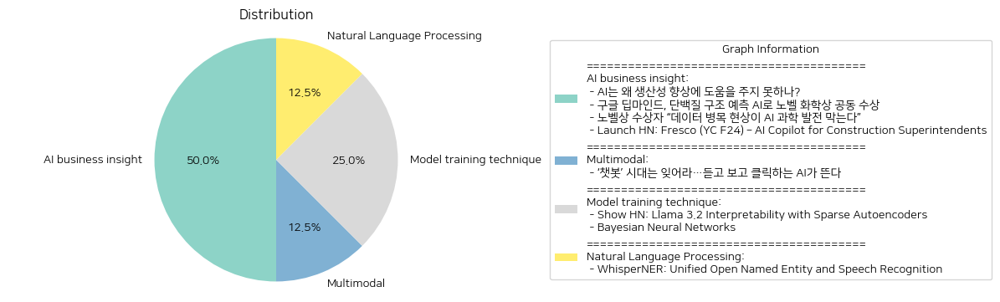

# Daily Artificial Intelligence Insights : News

## ☀️ AI business insight

**요약:**

1. **주요 테마**:
   - 인공지능(AI)의 현재 및 미래 발전 가능성
   - AI를 통한 과학적 발견 및 노벨상 관련 성과
   - 고품질 데이터의 중요성과 AI 발전에 있어서의 데이터 병목 현상 문제
   - 건축 분야에서의 AI 활용 및 문서 관리의 효율성 향상

2. **주요 사건**:
   - AI가 생산성 향상에 기여하지 못하는 이유로 중대한 개선이 필요하다는 점이 지적되고 있음.
   - 구글 딥마인드의 데미스 허사비스와 존 점퍼가 단백질 접힘 예측 문제를 해결한 공로로 노벨 화학상을 공동 수상함.
   - AI 과학 발전의 장애물로 데이터 병목 현상이 지적되며, 이를 극복하기 위한 고품질 데이터의 중요성이 강조됨.
   - Fresco AI는 건설 현장에서 AI를 사용하여 영상 및 사진을 통해 문서화 작업을 관리하는 도구를 개발 중임.

3. **영향 분석**:
   - **경제**: AI 기술의 발전은 생산성 향상을 유도할 수 있지만, 중대한 개선이 필요하다는 점을 감안할 때 단기간 내에는 경제적 성과가 제한적일 수 있음.
   - **과학 및 기술**: AI를 활용한 과학적 발견이 노벨상 수상으로 이어지면서, AI 연구 및 개발에 대한 관심과 투자가 증가할 가능성이 큼.
   - **사회**: AI 발전을 위한 데이터의 중요성과 병목 현상이 해결될 경우, 사회 전반에 걸쳐 AI 활용이 더욱 활성화될 수 있음.
   - **건설 분야**: AI를 통한 문서 관리 효율성이 향상되면 건설 산업의 생산성과 안전성 또한 개선될 수 있음.

4. **최종 요약**:
   이번 뉴스에서는 AI의 발전 가능성과 현재의 한계점에 대한 다양한 관점이 드러났다. AI가 생산성 향상에 기여하기 위해서는 개선이 필요하다는 점과 노벨상 수상 등 과학적 발전의 성과가 두드러진다. 그러나 데이터 문제와 같은 구조적 장애물을 해결하지 않으면 지속적인 발전은 어렵다는 인식이 제기되고 있다. 미래에는 AI 기술을 보다 효과적으로 활용하기 위한 데이터 관리 및 AI 적용 분야의 확산 등이 중요한 과제로 남을 것이다. AI 기술의 발전 추세를 주시하고, 각 분야별로 구체적인 개선 방향을 모색하는 것이 필요하다.

**출처:**

 - AI는 왜 생산성 향상에 도움을 주지 못하나? (https://www.technologyreview.kr/ai%eb%8a%94-%ec%99%9c-%ec%83%9d%ec%82%b0%ec%84%b1-%ed%96%a5%ec%83%81%ec%97%90-%eb%8f%84%ec%9b%80%ec%9d%84-%ec%a3%bc%ec%a7%80-%eb%aa%bb%ed%95%98%eb%82%98/)
 - 구글 딥마인드, 단백질 구조 예측 AI로 노벨 화학상 공동 수상 (https://www.technologyreview.kr/%ea%b5%ac%ea%b8%80-%eb%94%a5%eb%a7%88%ec%9d%b8%eb%93%9c-%eb%8b%a8%eb%b0%b1%ec%a7%88-%ea%b5%ac%ec%a1%b0-%ec%98%88%ec%b8%a1-ai%eb%a1%9c-%eb%85%b8%eb%b2%a8-%ed%99%94%ed%95%99%ec%83%81-%ea%b3%b5%eb%8f%99/)
 - 노벨상 수상자 “데이터 병목 현상이 AI 과학 발전 막는다” (https://www.technologyreview.kr/%eb%85%b8%eb%b2%a8%ec%83%81-%ec%88%98%ec%83%81%ec%9e%90-%eb%8d%b0%ec%9d%b4%ed%84%b0-%eb%b3%91%eb%aa%a9-%ed%98%84%ec%83%81%ec%9d%b4-ai-%ea%b3%bc%ed%95%99-%eb%b0%9c%ec%a0%84-%eb%a7%89%eb%8a%94/)
 - Launch HN: Fresco (YC F24) – AI Copilot for Construction Superintendents (https://news.ycombinator.com/item?id=42204939)

## 🎇 Multimodal

**요약:**

**1. 주요 테마:**
현재 시대의 주요 테마는 AI 기술의 진화입니다. 텍스트 기반 챗봇을 넘어 음성 및 영상 생성 기능을 갖춘 AI로의 전환이 주목받고 있습니다. 이러한 기술 발전이 다양한 분야에서 어떻게 활용될 수 있는지와 그에 따른 사회적 변화가 중요한 테마로 떠오르고 있습니다.

**2. 주요 사건들:**
기사에서는 텍스트 기반 AI의 시대가 저물고, 이를 대체할 수 있는 새로운 형태의 AI가 주목받고 있음을 강조하고 있습니다. 즉, AI의 음성과 시각적 능력이 강화되면서 더 복잡하고 풍부한 대화와 정보 전달이 가능해지는 시대가 열리고 있는 것으로 파악됩니다.

**3. 영향 분석:**
- *경제:* AI 기술의 발전은 경제 전반에 걸쳐 큰 변화를 불러일으킬 수 있습니다. 다양한 산업에서 AI가 생산성 향상 및 비용 절감의 새로운 수단으로 활용될 가능성이 큽니다. 특히, 고객 서비스 및 콘텐츠 제작 분야에서 AI 기반 솔루션의 수요가 증가할 것으로 예상됩니다.
- *정치:* AI의 발전은 정보 확산 및 여론 형성에 큰 영향을 미칠 수 있습니다. AI를 통한 정보 분석과 사전 예측 등이 정책 결정에 활용되면서 정책의 투명성과 효율성이 증가할 수 있습니다.
- *사회:* AI의 도입은 사회적 변화 역시 가져올 것입니다. 특히, 인간과 기계 간의 상호작용 방식이 변화하면서 새로운 윤리적, 사회적 문제가 대두될 수 있습니다. AI의 활용이 늘어날수록 데이터 보호 및 프라이버시 이슈도 강화될 가능성이 있습니다.

**4. 최종 요약:**
최근의 AI 기술 발전은 다양한 영역에 영향을 미칠 전망이며, 음성 및 영상 생성 능력을 갖춘 AI가 산업 전반에 걸쳐 혁신을 이끌 것입니다. 이로 인해 생산성 향상이나 서비스의 질적 향상 등 긍정적인 효과가 있을 것으로 보이나, 동시에 데이터 보호 및 사회적 윤리 문제와 같은 새로운 도전 과제를 가져올 수도 있습니다. 앞으로 AI 기술의 발전을 지속적으로 모니터링하며 그에 따른 변화에 대비하는 것이 중요합니다. AI와 인간 사이의 보다 깊이 있는 협력과 통합이 이루어질 수 있는지, 그리고 관련 정책 및 규제가 어떻게 발전할지 주목할 필요가 있습니다.

**출처:**

 - ‘챗봇’ 시대는 잊어라…듣고 보고 클릭하는 AI가 뜬다 (https://www.technologyreview.kr/%ec%b1%97%eb%b4%87-%ec%8b%9c%eb%8c%80%eb%8a%94-%ec%9e%8a%ec%96%b4%eb%9d%bc-%eb%93%a3%ea%b3%a0-%eb%b3%b4%ea%b3%a0-%ed%81%b4%eb%a6%ad%ed%95%98%eb%8a%94-ai%ea%b0%80-%eb%9c%ac%eb%8b%a4/)

## 🎠 Model training technique

**요약:**

1. **주요 주제**:
   양 기사는 대형 언어 모델(LLM)과 신경망에 관련된 최신 기술 연구와 개발에 중점을 두고 있습니다. LLM의 해석 가능성을 향상하고, 모델의 불확실성을 줄이고자 하는 노력이 주 테마입니다.

2. **주요 사건**:
   - 'Show HN: Llama 3.2 Interpretability with Sparse Autoencoders': 이 프로젝트는 희소 오토인코더(SAE)를 활용하여 LLM의 상위 표현을 해석 가능하게 분리하는 데 초점을 맞추고 있습니다. 이 접근 방식은 훈련 데이터 수집에서부터 SAE 훈련, 학습된 특징 분석, 결과 검증에 이르는 전체 파이프라인을 제공합니다.
   - 'Bayesian Neural Networks': 이 기사는 불확실성 모델링을 통한 과적합 문제를 해결하기 위해 베이지안 신경망이 어떻게 활용되는지를 설명합니다. 확률적 예측과 모델 매개변수 및 예측에 대한 불확실성을 정량화할 수 있게 해줍니다.

3. **영향 분석**:
   - **경제**: LLM과 베이지안 신경망의 발전은 경제분석을 포함한 다양한 산업에 적용될 수 있는 잠재력을 가집니다. 데이터 분석의 정확성을 높이고, 불확실성을 줄여 경제적 의사 결정을 개선할 수 있는 도구가 될 것입니다.
   - **정치/사회**: 기술 발전은 정보 및 데이터 처리와 관련하여 정부 정책에 영향을 미치고, 사회적으로도 다양한 애플리케이션 개발로 인해 사회적 변화에 기여할 수 있습니다. 이는 데이터 기반 정책 결정, 정보의 해석 등에 중요한 역할을 할 수 있습니다.

4. **최종 요약**:
   양 기사는 대형 언어 모델 및 신경망의 해석 가능성과 불확실성 관리라는 공통된 주제를 통해 관련 분야의 최신 연구 동향을 드러내고 있습니다. SAE를 활용한 해석 접근법과 베이지안 신경망을 통한 불확실성 관리 전략은 AI 및 데이터 분석 분야의 발전을 기대하게 합니다. 앞으로 이 기술들이 산업에 적용되어 실질적인 이익을 가져올 수 있을 것으로 예상됩니다. 지속적인 연구와 발전을 통해 이러한 기술이 어떤 식으로 실무에 도입되고, 더 나아가 사회 전반에 긍정적인 영향을 미칠지를 주목해야 합니다.

**출처:**

 - Show HN: Llama 3.2 Interpretability with Sparse Autoencoders (https://github.com/PaulPauls/llama3_interpretability_sae)
 - Bayesian Neural Networks (https://www.cs.toronto.edu/~duvenaud/distill_bayes_net/public/)

## 💙 Natural Language Processing

**요약:**

**종합 요약 보고서**

**1. 주요 주제:**
이번 뉴스 기사에서 다루고 있는 주요 주제는 다음과 같습니다.
- 인공지능 모델의 개발 및 통합: WhisperNER 모델은 이름 인식(NER)과 음성 인식(ASR)을 통합하여 실제 활용 가능한 유용한 정보를 제공하는 새로운 접근방식으로 소개되고 있습니다.
- 정보 처리의 진보: WhisperNER의 등장은 정보 처리의 정확성과 정보성을 동시에 개선할 수 있는 잠재력을 가지고 있음을 시사합니다.

**2. 주요 사건:**
- WhisperNER 모델의 소개: WhisperNER는 개방형 이름 인식과 음성 인식 작업에서 자연적 기준 실적을 능가하며, 지도 학습 기반 미세 조정 작업에서도 우수한 성과를 보이고 있습니다. 이는 정보 처리와 데이터 분석의 효율성을 크게 높일 수 있는 중요한 발전으로 볼 수 있습니다.

**3. 영향 분석:**
- 경제적 영향: WhisperNER의 발전은 기업의 고객 서비스, 금융 데이터 분석 및 기타 비즈니스 환경에서 비즈니스 효율성을 높일 수 있는 긍정적 영향을 줄 수 있습니다. 자동화의 진보로 인해 인력 비용 감소와 더불어 데이터 처리 능률이 향상될 것이라고 기대됩니다.
- 사회적 영향: 더욱 정확한 음성 및 이름 인식 기술은 교육, 의료, 법 집행 분야에서 보다 포괄적이고 접근하기 쉬운 서비스 제공을 가능하게 할 수 있습니다. 특히 비언어적 의사소통 증가로 인해 다양한 분야에서의 접근성이 개선될 수 있습니다.

**4. 결론 및 미래 개발 예측:**
WhisperNER 모델은 NER과 ASR의 통합을 통해 정보 처리의 새 시대를 열고 있습니다. 이 기술은 단순한 기능 향상을 넘어 전반적인 효율성과 생산성을 향상시킬 수 있는 포괄적인 솔루션으로 주목받고 있습니다. 향후 WhisperNER와 같은 통합 모델이 다양한 산업 분야에 더욱 널리 적용될 가능성이 높으며, 이는 AI 기술 발전의 중요한 방향성을 제시하고 있습니다. 지속적인 연구와 개발을 통해 이러한 모델의 성능이 더욱 향상될 것으로 예상됩니다.

**출처:**

 - WhisperNER: Unified Open Named Entity and Speech Recognition (https://arxiv.org/abs/2409.08107)

