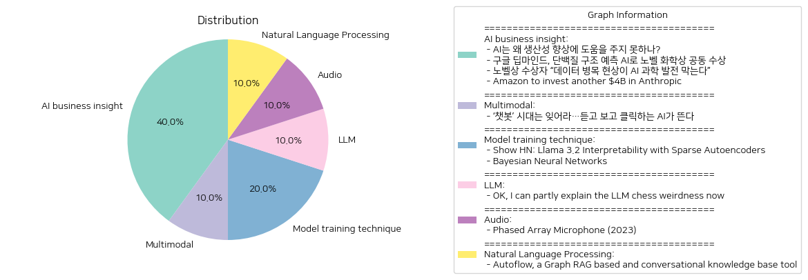

# Daily Artificial Intelligence Insights : News

## 🎠 AI business insight

**요약:**

**주요 테마**:  
여러 기사에서 반복적으로 나타나는 주요 테마는 인공지능(AI)의 발전과 그에 따른 경제적, 과학적 기여 및 도전 과제입니다. 특히 AI가 과학적 발견 및 생산성 향상에 미치는 영향과 관련된 문제가 중심이 되고 있으며, 기업과 기관들이 AI 기술에 대한 투자와 연구 개발을 활발하게 진행하고 있다는 점이 강조됩니다.

**주요 사건**:  
1. 'AI는 왜 생산성 향상에 도움을 주지 못하나?': AI가 생산성 개선에 아직 충분한 성과를 내지 못하고 있으며 이를 개선하기 위해서는 중대한 변화가 필요하다는 평가가 나왔습니다.
2. '구글 딥마인드, 단백질 구조 예측 AI로 노벨 화학상 공동 수상': 구글 딥마인드의 AI 기술이 단백질 구조 예측 문제를 해결하는 데 사용되었고, 이 공로로 노벨 화학상을 수상했습니다.
3. '노벨상 수상자 “데이터 병목 현상이 AI 과학 발전 막는다”': AI의 과학적 활용을 위해 고품질 데이터의 중요성이 강조되며, 데이터 부족이 AI 발전을 저해하는 주요 요인으로 지적되었습니다.
4. 'Amazon to invest another $4B in Anthropic': Amazon이 Anthropic에 40억 달러를 추가 투자하여, 총 투자액이 80억 달러에 이르렀으며, AWS가 Anthropic의 주요 클라우드 및 훈련 파트너로 자리잡았습니다.

**영향 분석**:  
경제적 측면에서는 AI 기술에 대한 대규모 투자가 지속되고 있음을 보여줍니다. 이는 AI 연구 개발의 가속화와 관련 산업의 활발화로 이어질 가능성이 큽니다. 과학적 측면에서는 AI가 해결책을 제공할 가능성이 크지만 데이터의 품질이 이를 제한하고 있음을 볼 수 있습니다. 사회적 측면에서는 AI 기술이 전반적인 생산성 향상에 기여하지 못하고 있다는 비판도 존재하지만, 장기적으로는 긍정적인 효과를 가져올 가능성이 있습니다.

**최종 요약**:  
AI 기술은 다양한 분야에서 여전히 핵심적인 역할을 하고 있으며 지속적인 발전이 예상됩니다. 다만 현재 시점에서는 데이터의 품질 문제가 과학적 발전의 장벽으로 작용하고 있으며, 이로 인한 생산성 저하도 문제로 지적됩니다. 이러한 가운데, 기업들의 AI에 대한 적극적인 투자 및 기술 개발은 앞으로의 발전 가능성을 크게 열어두고 있습니다. 장기적으로 AI 기술이 경제와 사회에 미칠 긍정적인 영향을 지속적으로 모니터링 할 필요가 있으며, 데이터 품질 개선 등의 문제 해결이 병행되어야 할 것입니다.

**출처:**

 - AI는 왜 생산성 향상에 도움을 주지 못하나? (https://www.technologyreview.kr/ai%eb%8a%94-%ec%99%9c-%ec%83%9d%ec%82%b0%ec%84%b1-%ed%96%a5%ec%83%81%ec%97%90-%eb%8f%84%ec%9b%80%ec%9d%84-%ec%a3%bc%ec%a7%80-%eb%aa%bb%ed%95%98%eb%82%98/)
 - 구글 딥마인드, 단백질 구조 예측 AI로 노벨 화학상 공동 수상 (https://www.technologyreview.kr/%ea%b5%ac%ea%b8%80-%eb%94%a5%eb%a7%88%ec%9d%b8%eb%93%9c-%eb%8b%a8%eb%b0%b1%ec%a7%88-%ea%b5%ac%ec%a1%b0-%ec%98%88%ec%b8%a1-ai%eb%a1%9c-%eb%85%b8%eb%b2%a8-%ed%99%94%ed%95%99%ec%83%81-%ea%b3%b5%eb%8f%99/)
 - 노벨상 수상자 “데이터 병목 현상이 AI 과학 발전 막는다” (https://www.technologyreview.kr/%eb%85%b8%eb%b2%a8%ec%83%81-%ec%88%98%ec%83%81%ec%9e%90-%eb%8d%b0%ec%9d%b4%ed%84%b0-%eb%b3%91%eb%aa%a9-%ed%98%84%ec%83%81%ec%9d%b4-ai-%ea%b3%bc%ed%95%99-%eb%b0%9c%ec%a0%84-%eb%a7%89%eb%8a%94/)
 - Amazon to invest another $4B in Anthropic (https://www.cnbc.com/2024/11/22/amazon-to-invest-another-4-billion-in-anthropic-openais-biggest-rival.html)

## 🎇 Multimodal

**요약:**

1. **주요 주제**:
   - AI의 진화: 텍스트 기반의 챗봇에서 음성과 영상 생성이 가능한 AI로의 발전.
   - 기술 발전의 새로운 단계: AI가 어떻게 다양한 형태로 발전하며 사람들과 상호작용하고 있는지에 대한 주목.

2. **주요 사건**:
   - 기존 텍스트 기반 AI 챗봇의 시대가 저물고, 음성과 영상 생성이라는 새로운 기능을 가진 AI의 시대가 도래하고 있다는 소식.

3. **영향 분석**:
   - **경제**: 새로운 AI 기술의 출현은 다양한 산업에 혁신적인 도구를 제공하여 생산성과 효율성을 증가시킬 수 있다. 특히 콘텐츠 생성, 고객 서비스 등 분야에서 AI 활용 가능성이 높아질 것이다.
   - **사회**: 음성과 영상 기반 AI는 사람과의 소통 방식에 큰 변화를 일으키며, 더 자연스럽고 직관적인 상호작용을 가능하게 할 것이다.
   - **기술 및 교육**: 새로운 AI 기술은 기술 개발 및 교육의 주요 과제로 떠오를 것이며, 새로운 직업 기회와 교육 커리큘럼의 변화를 가져올 수 있다.

4. **최종 요약**:
   - AI 기술이 텍스트 기반의 챗봇에서 음성 및 영상 생성 기능을 갖춘 형태로 진화하고 있다. 이러한 발전은 경제, 사회, 그리고 기술 개발 등 다양한 영역에 걸쳐 중요한 영향을 미칠 것으로 보인다. 앞으로 이러한 AI 기술이 더욱 구체화되고 실제 생활에 적용됨에 따라, 보다 직관적이고 효율적인 서비스 및 제품이 나타날 가능성이 크다. 특히 창의적인 콘텐츠 생성과 사람 간의 자연스러운 상호작용을 촉진하는 방향으로 발전할 것이 예상된다. AI 기술 발전의 지속적인 추세를 주시하며 그에 따른 사회적, 경제적 변화를 준비해야 한다.

**출처:**

 - ‘챗봇’ 시대는 잊어라…듣고 보고 클릭하는 AI가 뜬다 (https://www.technologyreview.kr/%ec%b1%97%eb%b4%87-%ec%8b%9c%eb%8c%80%eb%8a%94-%ec%9e%8a%ec%96%b4%eb%9d%bc-%eb%93%a3%ea%b3%a0-%eb%b3%b4%ea%b3%a0-%ed%81%b4%eb%a6%ad%ed%95%98%eb%8a%94-ai%ea%b0%80-%eb%9c%ac%eb%8b%a4/)

## 🎈 Model training technique

**요약:**

1. **핵심 주제**:
   - 최신 인공지능 기술을 사용하여 모델의 해석 가능성을 향상시키는 새로운 접근법이 주요 주제입니다.
   - 대규모 신경망 모델의 효과적인 학습 방법과 불확실성 처리 방법에 대한 연구가 계속되고 있습니다.

2. **주요 사건**:
   - 'Show HN: Llama 3.2 Interpretability with Sparse Autoencoders': Lee 프로젝트는 대형 언어 모델의 해석 가능성을 높이기 위해 드문드문한 오토인코더(SAEs)를 사용하는 방법을 제시합니다. 이 방법론은 학습 데이터를 수집하고, SAEs를 훈련하며, 학습된 특징을 분석하고 결과를 검증하는 전체 파이프라인을 제공합니다.
   - ‘Bayesian Neural Networks’: 베이즈 신경망은 가중치 불확실성을 모델링함으로써 과적합 문제를 해결하고, 알고리즘인 확률적 변분 추론을 통해 훈련될 수 있습니다. 이 접근법은 작은 데이터셋에서 학습할 때 특히 유용합니다.

3. **영향 분석**:
   - **경제**: 보다 해석 가능한 AI 모델이 개발되면, 산업 전반에서 AI 기술의 채택이 가속화될 수 있으며, 이를 통해 여러 산업에서 혁신이 촉진될 것입니다.
   - **사회**: AI 모델의 해석 능력 개선은 AI 결과에 대한 신뢰도를 높이고, AI의 투명성과 윤리성을 강화할 수 있습니다.
   - **기술**: 불확실성 처리 능력을 갖춘 베이즈 신경망과 해석성이 높은 모델은 데이터 과학과 머신러닝의 효율과 정확성을 크게 향상시킬 수 있습니다.

4. **최종 요약**:
   최근의 연구들은 대형 AI 모델의 해석 가능성과 불확실성 모델링에 주목하고 있으며, 이는 AI의 투명성과 사용 신뢰도를 증가시키는 데 중요한 역할을 할 것입니다. 특히, 드문드문한 오토인코더와 베이즈 신경망의 발전은 데이터셋의 크기와 유형에 따라 다양한 문제를 해결할 수 있는 가능성을 열어주고 있습니다. 앞으로 이러한 기술들이 더욱 발전하여, 다양한 분야에서 AI의 잠재력이 발휘될 것으로 기대됩니다. AI의 윤리적 사용과 투명성 확보는 지속적으로 중요하게 다뤄야 할 주제일 것입니다.

**출처:**

 - Show HN: Llama 3.2 Interpretability with Sparse Autoencoders (https://github.com/PaulPauls/llama3_interpretability_sae)
 - Bayesian Neural Networks (https://www.cs.toronto.edu/~duvenaud/distill_bayes_net/public/)

## 🐱 LLM

**요약:**

**종합 요약 보고서**

1. **핵심 주제**
   - 대규모 언어 모델(LLMs)의 작동 방식 및 성능 차이
   - OpenAI의 명령 기반 모델과 채팅 인터페이스의 성능 비교
   - 올바른 프롬프트와 예시 제공 시 인공지능 모델의 기능 향상

2. **주요 사건**
   - 한 사용자가 gpt-3.5-turbo-instruct 모델이 체스를 잘 수행하는 이유를 조사
   - 기존의 대규모 언어 모델들이 체스 수행에 난항을 겪는 현상 분석
   - 체스에서 최근 채팅 모델들도 적절한 프롬프트와 예시를 통해 개선된 성능을 보임
   - OpenAI의 기본 모델이 체스를 잘하지만 채팅 인터페이스와 명령 조정이 성과를 방해한다는 이론 제시

3. **영향 분석**
   - **기술적 영향**: LLMs의 성능 차이에 대한 새로운 접근 방식 제공, 기술 발전 방향 모색.
   - **경제적 영향**: AI 개발 방향과 전략 조정에 따른 산업 경제 활성화 가능성.
   - **사회적 영향**: 인공지능을 통한 전략 게임 이해도 향상, 사용자 경험 개선.

4. **최종 요약**
   LLMs의 체스 수행 능력에 대한 연구는 대규모 언어 모델의 작동 방식과 그 한계점을 이해하는 데 중요한 통찰을 제공합니다. 올바른 프롬프트와 예시를 제공할 때 모델 성능이 크게 향상될 수 있다는 발견은 인공지능 개발의 새로운 가능성을 열어줍니다. 향후 채팅 인터페이스와 명령 조정 최적화와 같은 분야에서 더 많은 연구와 발전이 기대되며, 이러한 연구는 인공지능의 실무적 응용 능력을 높이는 데 기여할 것으로 보입니다. OpenAI 등의 기술 발전이 계속될 것으로 예측되며, 이는 다양한 산업 영역에 변화를 일으킬 수 있을 것으로 판단됩니다.

**출처:**

 - OK, I can partly explain the LLM chess weirdness now (https://dynomight.net/more-chess/)

## 🎈 Audio

**요약:**

### 요약 보고서

1. **주요 주제**:
   - 뉴스 기사에서 발견된 주요 테마는 '음향 기술 혁신'과 '최신 기술의 실용적 적용'입니다. 마이크로폰 어레이 및 FPGA(필드 프로그래머블 게이트 어레이)와 같은 첨단 기술의 발전이 국면을 이루고 있습니다. 이는 특히 음향 수집, 환경 소음 모니터링, 통신 시스템 개선 및 기타 다양한 분야에 응용될 것입니다.

2. **주요 사건**:
   - 192-채널 단계 배열 마이크로폰의 개발: 이 기술은 선형 어레이로 구성된 다수의 마이크로폰을 활용하며, 기하급수적 간격 배열과 FPGA를 사용하여 데이터를 수집하고 기가비트 이더넷을 통해 컴퓨터로 전송합니다. 이 마이크로폰 어레이는 화이트 노이즈 및 구배 하강법을 사용하여 스피커를 통한 보정을 진행하였으며, 빔포밍은 지연-합법과 3D 근야 및 2D 구현을 통해 수행되었습니다.

3. **영향 분석**:
   - **경제**: 이러한 기술 발전은 음향 장비 및 관련 기술시장에서 새로운 제품 개발을 촉진할 것입니다. 또한, 연구 및 개발(R&D)을 중심으로 산업 전반에 걸쳐 신규 투자 및 일자리 창출의 기회를 제공할 수 있습니다.
   - **사회**: 환경 소음 모니터링을 향상시킴으로써 공공 안전과 주거 환경 개선에 기여할 수 있습니다. 또한, 실내외의 소음 문제 해결에도 큰 도움이 될 수 있습니다.
   - **기술**: 이 기술의 발전은 음향 신호 처리 및 잡음 제거 기술 등 다양한 분야에서의 혁신을 촉발할 수 있습니다.

4. **최종 요약**:
   - 이 뉴스는 첨단 음향 기술의 혁신과 실용화를 강조하고 있습니다. 192-채널 단계 배열 마이크로폰의 개발은 음향 기술의 진보를 나타내며, 이는 다양한 산업 및 사회적 응용에 기여할 것으로 기대됩니다. 앞으로 추가적인 기술 발전과 상용화 가능성이 모니터링될 필요가 있습니다. 특히, 음향 기술의 발전이 다른 기술과 융합되어 새로운 형태의 커뮤니케이션 및 환경 모니터링 시스템을 창출하게 될 가능성이 있으므로 이에 대한 주의를 기울일 필요가 있습니다.

**출처:**

 - Phased Array Microphone (2023) (https://benwang.dev/2023/02/26/Phased-Array-Microphone.html)

## 🪄 Natural Language Processing

**요약:**

1. **주요 주제**:
   - 뉴스 기사에서는 주로 "지식 그래프"와 "대화형 탐색"이라는 두 가지 주제가 두드러집니다. 특히, TiDB Vector와 LlamaIndex를 기반으로 한 지식 그래프 및 웹사이트 크롤러, JavaScript 스니펫 삽입 기능이 강조되고 있습니다. 이는 기술 혁신과 사용자 경험 향상을 위한 도구 개발이라는 문맥에서 읽힐 수 있습니다.

2. **주요 사건**:
   - 이 글에서는 'Autoflow'라는 플랫폼의 출시에 주목합니다. 이 플랫폼은 TiDB Vector와 LlamaIndex를 활용한 지식 그래프를 통해 대화형 지식 기반을 구축하고 있으며, 웹사이트 크롤러와 대화 검색 페이지를 통해 포괄적인 정보 접근을 제공합니다. 또한, 즉각적인 제품 관련 질의 응답을 위해 JavaScript 스니펫을 편집 및 임베딩할 수 있는 기능을 포함하고 있습니다.

3. **영향 분석**:
   - **경제**: 기술 혁신을 통해 기업은 고객 질의에 대한 즉각적이고 정확한 대응을 할 수 있는 도구를 갖게 되었으며, 이는 최적의 고객 경험을 제공함으로써 고객 유치 및 유지 측면에서 긍정적인 경제적 영향을 미칠 수 있습니다.
   - **사회**: 대화형 지식 기반의 발전은 사용자가 정보를 더 쉽게 접근하고 활용할 수 있게 함으로써 정보의 민주화를 촉진할 수 있습니다. 이는 정보 접근성의 향상을 의미하며 사회 전반에 걸쳐 정보 불균형을 줄이는 데 기여할 수 있습니다.

4. **최종 요약**:
   - 'Autoflow'의 출시는 지식 관리 및 사용자 상호작용을 혁신하며, 기술 기반의 정보 접근성 향상을 통해 경제적 이점 및 사회적 변화를 가져올 잠재력이 큰 플랫폼으로 평가할 수 있습니다. 앞으로 이러한 기술들이 다른 산업에 어떻게 적용되고 변화를 초래할지 지속적인 관심이 필요합니다. 특히 고객 서비스 및 정보 관리 분야에서의 발전 가능성을 주목할 만합니다.

**출처:**

 - Autoflow, a Graph RAG based and conversational knowledge base tool (https://github.com/pingcap/autoflow)

