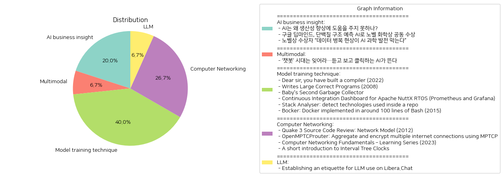

# Daily Artificial Intelligence Insights : News

## ❄️ AI business insight

**요약:**

**주요 주제**:
이번 뉴스 기사에서는 인공지능(AI)의 기술적 발전, 데이터의 중요성, 그리고 AI의 과학적 활용에 대한 논의가 중심을 이루고 있습니다. AI의 실질적 활용 가능성과 미래 전망, 데이터 부족 문제, 그리고 AI의 과학적 기여가 일관적으로 강조되고 있습니다.

**주요 사건**:
1. 첫 번째 기사에서는 AI가 경제 발전에 기여할 잠재력을 가지고 있지만, 생산성 개선을 위해서는 몇 가지 중대한 개선이 필요하다는 점을 지적하고 있습니다.
2. 두 번째 기사에서는 구글 딥마인드의 AI가 단백질 구조 예측 문제를 해결하여 노벨 화학상을 공유한 소식이 전해졌습니다. 이 수상은 AI 기술이 과학 발전에 기여할 수 있음을 입증했습니다.
3. 세 번째 기사에서는 데이터의 품질과 양이 AI 과학 발전을 좌우한다는 점을 노벨상 수상자의 발언을 통해 강조합니다. 데이터 병목 현상이 AI 발전에 장애가 된다는 주장입니다.

**영향 분석**:
- **경제**: AI의 생산성 향상과 경제 기여는 아직 실현되지 않았으나 가능성은 존재합니다. 하지만 데이터 품질과 AI 기술 개선이 필수적이라는 것이 경제적 연구의 도전 과제로 부각되고 있습니다.
- **과학 및 기술**: AI는 단백질 구조 예측과 같은 복잡한 과학적 문제를 해결해 나가고 있으며, 이는 AI의 연구 및 개발 방향에 긍정적인 영향을 미칠 것입니다.
- **사회**: AI 발전으로 인한 기술 혁신 소식은 개별 과학자들 뿐만 아니라 사회 전반에 걸쳐 교육과 인재 개발이 필요하다는 점을 일깨워 줍니다.

**최종 요약**:
AI는 잠재적으로 다양한 분야의 발전을 이끌어낼 수 있는 기술로 여겨지지만, 현재로서는 데이터 품질의 중요성과 AI 기술의 실질적 개선이 필요한 상태입니다. 구글 딥마인드의 노벨 화학상 수상은 AI의 광범위한 과학적 활용 가능성을 시사하며, 앞으로의 AI 연구는 데이터 문제 해결과 기술의 정교화가 중점이 되어야 합니다. 향후 AI와 데이터 기술 분야에서 지속적인 발전과 협력이 필요하며, 이러한 발전이 경제와 사회에 미치는 긍정적 영향을 기대할 수 있습니다. AI의 잠재력을 극대화하기 위해 데이터 품질 개선 및 기술 혁신의 지속적인 모니터링이 중요합니다.

**출처:**

 - AI는 왜 생산성 향상에 도움을 주지 못하나? (https://www.technologyreview.kr/ai%eb%8a%94-%ec%99%9c-%ec%83%9d%ec%82%b0%ec%84%b1-%ed%96%a5%ec%83%81%ec%97%90-%eb%8f%84%ec%9b%80%ec%9d%84-%ec%a3%bc%ec%a7%80-%eb%aa%bb%ed%95%98%eb%82%98/)
 - 구글 딥마인드, 단백질 구조 예측 AI로 노벨 화학상 공동 수상 (https://www.technologyreview.kr/%ea%b5%ac%ea%b8%80-%eb%94%a5%eb%a7%88%ec%9d%b8%eb%93%9c-%eb%8b%a8%eb%b0%b1%ec%a7%88-%ea%b5%ac%ec%a1%b0-%ec%98%88%ec%b8%a1-ai%eb%a1%9c-%eb%85%b8%eb%b2%a8-%ed%99%94%ed%95%99%ec%83%81-%ea%b3%b5%eb%8f%99/)
 - 노벨상 수상자 “데이터 병목 현상이 AI 과학 발전 막는다” (https://www.technologyreview.kr/%eb%85%b8%eb%b2%a8%ec%83%81-%ec%88%98%ec%83%81%ec%9e%90-%eb%8d%b0%ec%9d%b4%ed%84%b0-%eb%b3%91%eb%aa%a9-%ed%98%84%ec%83%81%ec%9d%b4-ai-%ea%b3%bc%ed%95%99-%eb%b0%9c%ec%a0%84-%eb%a7%89%eb%8a%94/)

## 🫧 Multimodal

**요약:**

1. **주요 테마**:
   - AI 기술의 진화: 텍스트 기반 AI에서 음성과 영상 생성 기능을 갖춘 AI로의 진화가 주목받고 있음. 이는 AI 기술이 단순 대화 능력에서 벗어나 다양한 멀티미디어 콘텐츠 생성 능력을 갖추고 있다는 점을 강조한다.
   - 차세대 인터페이스의 등장: 사용자와 AI 간의 상호작용이 청각 및 시각적 요소를 포함하게 되면서 기술적 혁신이 이루어지고 있다.

2. **주요 사건**:
   - 전통적인 텍스트 기반 AI 챗봇 시대가 저물고 있으며, 새로운 형식의 AI가 주류로 부상 중임.
   - 이러한 AI는 음성과 영상 생성 능력을 통해 더욱 자연스러운 사용자 경험을 제공한다.

3. **영향 분석**:
   - 경제적 측면: AI 기술의 진화는 다양한 산업 분야에서 혁신을 가속화할 것으로 예상되며, 특히 콘텐츠 제작, 교육, 고객 서비스 등 분야에서 새로운 비즈니스 모델과 혁신적인 솔루션을 촉진할 수 있다.
   - 사회적 측면: AI의 발전은 인간과 기계의 상호작용 방식을 근본적으로 변화시킬 수 있으며, 이러한 변화를 통해 다양한 사용자 경험을 제고할 것이다. 그러나 기술 의존도가 증가함에 따라 데이터 및 개인 정보 보호에 대한 우려도 존재한다.

4. **최종 요약**:
   - AI 기술의 발전으로 인해 챗봇이 텍스트 중심에서 벗어나 음성과 영상 기능을 포함한 보다 진화된 형태로 변화하고 있다. 이러한 변화는 다양한 산업 분야에서 혁신을 불러일으키며 새로운 사용 사례와 비즈니스 기회를 창출할 것으로 기대된다. 그러나 기술의 발전이 사회적, 경제적 환경에 미치는 파급 효과를 주의 깊게 살피고, 데이터 보안과 프라이버시 보호에 대한 적절한 대응이 필요하다. 앞으로 AI 기술의 진화가 우리 사회에 미칠 잠재적 영향을 모니터링하는 것이 중요하다.

**출처:**

 - ‘챗봇’ 시대는 잊어라…듣고 보고 클릭하는 AI가 뜬다 (https://www.technologyreview.kr/%ec%b1%97%eb%b4%87-%ec%8b%9c%eb%8c%80%eb%8a%94-%ec%9e%8a%ec%96%b4%eb%9d%bc-%eb%93%a3%ea%b3%a0-%eb%b3%b4%ea%b3%a0-%ed%81%b4%eb%a6%ad%ed%95%98%eb%8a%94-ai%ea%b0%80-%eb%9c%ac%eb%8b%a4/)

## 🍊 Model training technique

**요약:**

**주요 테마**

여러 기사에서 나타나는 주요 테마는 '소프트웨어 개발 및 구현 전략', '복잡성 관리', '도구 및 기술 사용'입니다. 컴파일러 개발, 대량 프로그램 작성, 가비지 컬렉터 구현, 지속적 통합을 위한 대시보드 구축, 기술 스택 분석, Docker의 간단한 버전인 Bocker 등 소프트웨어 개발 과정 및 관련 도구에 대한 논의가 중심을 이루고 있습니다.

**주요 사건**

1. 'Dear sir, you have built a compiler (2022)': SSA, AST를 활용하여 고유의 컴파일러 라이브러리를 개발, 점진적으로 복잡성이 증가.
2. 'Writes Large Correct Programs (2008)': 대규모 정확한 프로그램을 작성할 수 있는 프로그래머 고용의 중요성 강조.
3. 'Baby’s Second Garbage Collector': Cheney의 알고리즘을 활용하여 복사 가비지 컬렉터 구현, 메모리 관리의 이점 제공.
4. 'Continuous Integration Dashboard for Apache NuttX RTOS (Prometheus and Grafana)': NuttX 대시보드를 통해 일일 빌드 모니터링, Prometheus 및 Pushgateway로부터 빌드 점수 수집.
5. 'Stack Analyser: detect technologies used inside a repo': @specfy/stack-analyser 라이브러리를 통해 종속성, 언어 및 인프라 추출.
6. 'Bocker: Docker implemented in around 100 lines of Bash (2015)': Bash 스크립트로 구현한 Docker의 간이 버전, 관련 시스템 위험 및 GNU GPL 라이선스를 강조.

**영향 분석**

- 경제적 측면: 이러한 기술 및 도구들은 효율적인 소프트웨어 개발을 가능하게 하여 기업과 개발자들에게 경제적인 장점을 제공합니다.
- 사회적 측면: 소프트웨어 품질 개선과 기술 이해도 증가는 개발자 커뮤니티 및 관련 분야 종사자들에게 긍정적인 영향을 미칠 수 있습니다.
- 기술적 측면: 점점 복잡해지는 시스템 설계 및 통합과 관련된 논의는 최신 기술 및 방법론의 발전에 기여합니다.

**최종 요약**

제시된 기사들은 모두 소프트웨어 개발 및 기술 구현의 중요성, 복잡성 관리, 도구 활용에 관한 정보와 통찰을 제공하고 있습니다. 효율적이고 복잡성을 잘 관리하는 소프트웨어 개발자 및 기술이 강조되고 있습니다. 이러한 트렌드는 앞으로도 지속될 가능성이 높으며, 새로운 기술 및 도구의 개발과 함께 지속적인 개선과 혁신이 기대됩니다.

**출처:**

 - Dear sir, you have built a compiler (2022) (https://rachit.pl/post/you-have-built-a-compiler/)
 - Writes Large Correct Programs (2008) (https://www.johndcook.com/blog/2008/09/19/writes-large-correct-programs/)
 - Baby’s Second Garbage Collector (https://jennyjams.net/blog/copygc/)
 - Continuous Integration Dashboard for Apache NuttX RTOS (Prometheus and Grafana) (https://lupyuen.github.io/articles/ci4)
 - Stack Analyser: detect technologies used inside a repo (https://github.com/specfy/stack-analyser)
 - Bocker: Docker implemented in around 100 lines of Bash (2015) (https://github.com/p8952/bocker)

## 🐱 Computer Networking

**요약:**

### 요약 보고서

1. **주요 주제**:
   전체 뉴스 기사에서 주로 다뤄지는 주제는 컴퓨터 네트워크 기술 및 프로토콜입니다. 특히 네트워크 모델, 다수 인터넷 연결의 통합 및 보안, 네트워킹 기초 지식 습득, 그리고 파일 시스템 복제에서의 버전 관리 등이 반복적으로 나타납니다.

2. **주요 사건**:
   - **'Quake 3 소스 코드 리뷰: 네트워크 모델'**: Quake3의 네트워크 모델은 UDP/IP에 기반하여 빠른 환경에서 작동하며, 메모리 내부탐색을 통해 델타 패킷을 생성하여 스냅샷 시스템으로 UDP 데이터그램 크기를 최소화하는 방법을 사용합니다.
   - **'OpenMPTCProuter: MPTCP를 사용하여 여러 인터넷 연결 통합 및 암호화'**: 최대 8개의 인터넷 연결 대역폭을 통합하여 암호화하고 SIP ALG 옵션을 제공하며, 다음 v0.59 버전에서는 버그 수정을 중점으로 지원합니다.
   - **'컴퓨터 네트워킹 기본 – 학습 시리즈'**: 데이터 링크 계층에 집중하며 iptables, SSH 터널, 브리지 및 스위치 같은 네트워킹 장치를 다루고 있습니다.
   - **'Interval Tree Clocks에 대한 간단한 소개'**: 버전 벡터가 마스터-마스터 파일 시스템 복제에서 유발하는 "액터 폭발" 문제를 Interval Tree Clocks를 통해 해결합니다.

3. **영향 분석**:
   - **경제**: OpenMPTCProuter 및 Quake3 네트워크 모델에 대한 기술적 논의는 미래의 인터넷 연결 및 게임 산업의 효율성을 높여 경제 발전에 기여할 수 있습니다.
   - **사회**: 네트워킹 기본 지식의 확산은 사용자들, 특히 IT 분야 종사자 및 학생들의 기술력 향상에 기여해 사회적 지식 기반을 강화할 수 있습니다.
   - **기술**: Interval Tree Clocks는 분산 시스템 안정성을 높이는 데 기여하며, 빠르게 변화하는 기술 환경에 적응하는 새로운 해결책을 제시합니다.

4. **최종 요약**:
   전반적으로, 이 뉴스 기사들은 현대 네트워크 기술의 발전 및 그 응용 범위에 대해 다루고 있습니다. UDP/IP 기반 네트워크 모델 개선, 다중 연결 통합 기술, 네트워킹 기초 교육, 그리고 분산 시스템 안정성 유지와 같은 문제들은 모든 분야에 걸쳐 중요한 영향을 미칠 것입니다. 앞으로는 이러한 기술이 경제적 성장과 사회적 기술 발전을 어떻게 촉진하는지를 주목할 필요가 있습니다. 또한, 새로운 버전의 룰 개선 및 보안 강화에 대한 추세와 경향도 계속하여 주시할 가치가 있습니다.

**출처:**

 - Quake 3 Source Code Review: Network Model (2012) (https://fabiensanglard.net/quake3/network.php)
 - OpenMPTCProuter: Aggregate and encrypt multiple internet connections using MPTCP (https://www.openmptcprouter.com/)
 - Computer Networking Fundamentals – Learning Series (2023) (https://iximiuz.com/en/series/computer-networking-fundamentals/)
 - A short introduction to Interval Tree Clocks (https://blog.separateconcerns.com/2017-05-07-itc.html)

## 🎇 LLM

**요약:**

**1. 주요 테마**:
   - 인공지능 모델과의 상호작용 규범화
   - 투명성 강화 및 협력 촉진
   - 네트워크 정책 준수와 반사회적 행동 예방

**2. 주요 사건**:
   - Libera.Chat 플랫폼은 LLM(대형 언어 모델) 사용에 관한 지침을 수립하여 사용자들이 LLM과 상호작용할 때 투명성을 유지하고 협력적인 환경을 만드는 것을 목표로 함. 
   - 사용자들에게 LLM과 상호작용 중임을 명확히 하고, 반사회적 행동을 피하기 위한 네트워크 정책 준수를 강조함.

**3. 영향 분석**:
   - **사회적 영향**: LLM 사용에 대한 명확한 가이드라인 제공은 사용자들 간의 신뢰를 구축하고 반사회적 행동을 감소시키는데 기여할 수 있음. 이는 사회적 상호작용의 질을 향상시킬 수 있음.
   - **기술적 영향**: 투명성과 정책 준수는 기술적 발전에 있어서 필수적 요소로, LLM의 보다 안전하고 책임감 있는 채택을 촉진할 수 있음.

**4. 최종 요약**:
   Libera.Chat의 LLM 사용 지침은 사용자 경험을 개선하고 플랫폼의 신뢰성을 높이는 데 기여할 것이다. 이 프로그램은 사용자들이 LLM과의 상호작용 중 생길 수 있는 불확실성을 줄이고, 건전한 온라인 커뮤니티를 조성하는 데 중요하다. 앞으로도 이러한 규범화 현상은 다양한 온라인 플랫폼으로 확장될 가능성이 있으며, LLM과의 사회적 상호작용에 대한 인식 증가 및 규제 강화의 계기가 될 수 있을 것으로 보인다. 이는 장기적으로 온라인 커뮤니티의 안전성을 높이고 긍정적인 상호작용을 촉진할 것이다.

**출처:**

 - Establishing an etiquette for LLM use on Libera.Chat (https://libera.chat/news/llm-etiquette)

