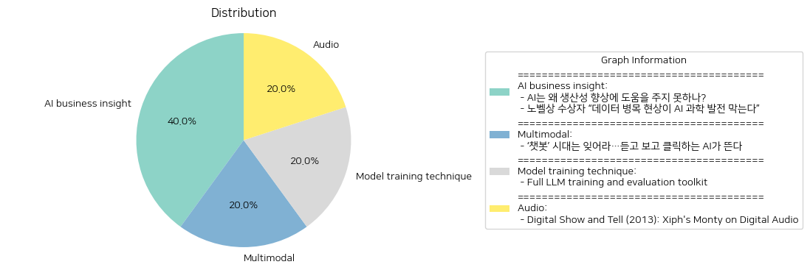

# Daily Artificial Intelligence Insights : News

## ⭐ AI business insight

**요약:**

1. **주요 주제**:
   뉴스 기사에서 공통된 주요 주제는 인공지능(AI)의 발전과 생산성 측면에서의 기여, 그리고 데이터의 역할입니다. 두 기사 모두 AI 기술의 발전과 효과적인 활용을 위한 조건에 대해 논의하고 있으며, '데이터'의 중요성이 강조되고 있습니다.

2. **주요 사건**:
   - 첫 번째 기사에서는 인공지능이 기대했던 만큼 생산성 향상에 기여하지 못하고 있다는 점을 지적하고 있습니다. 이 문제를 해결하기 위해서는 인공지능의 효율성을 높이기 위한 중대한 개선이 필요하다는 점을 강조하고 있습니다.
   - 두 번째 기사에서는 노벨상 수상자가 AI의 과학 발전에 있어 데이터 병목 현상이 주요한 장애물이 되고 있다고 밝히며, 고품질 데이터의 필요성을 강조하고 있습니다.

3. **영향 분석**:
   - **경제**: AI의 생산성 향상 기여 부족은 경제 발전에 예상보다 적은 긍정적 영향을 미치고 있으며, 이는 경제 정책 결정에 있어 중요한 고려 사항이 될 것입니다.
   - **과학과 기술**: 데이터의 질이 AI의 발전을 가로막는다는 점은 과학 및 기술 분야에서의 연구 개발(R&D) 전략을 데이터 관리와 연계하여 보다 효과적으로 진행해야 한다는 지침을 제시합니다.
   - **사회**: 데이터 병목 현상으로 인해 기술적 발전이 제한됨에 따라, AI의 사회적 수용성과 관련된 논의 역시 새로운 국면을 맞이할 가능성이 있습니다. 이는 정보 접근성과 데이터 윤리에 대한 논의를 포함할 수 있습니다.

4. **최종 요약**:
   전체적인 결론으로, 인공지능이 생산성 향상에 유의미하게 기여하기 위해서는 기술 자체의 개선과 더불어 고품질 데이터 사용이 필수적이라는 점이 부각됩니다. 이러한 이슈들의 해결은 경제, 기술 발전에 있어 중요한 기점이 될 수 있으며, 구체적인 데이터 관리 전략과 AI 기술 개선이 향후 중요한 과제로 다가올 것입니다. 앞으로 AI의 효율적 활용과 데이터 관리에 대한 지속적인 관심과 연구가 정책 및 산업 발전에 있어 필요할 것입니다.

**출처:**

 - AI는 왜 생산성 향상에 도움을 주지 못하나? (https://www.technologyreview.kr/ai%eb%8a%94-%ec%99%9c-%ec%83%9d%ec%82%b0%ec%84%b1-%ed%96%a5%ec%83%81%ec%97%90-%eb%8f%84%ec%9b%80%ec%9d%84-%ec%a3%bc%ec%a7%80-%eb%aa%bb%ed%95%98%eb%82%98/)
 - 노벨상 수상자 “데이터 병목 현상이 AI 과학 발전 막는다” (https://www.technologyreview.kr/%eb%85%b8%eb%b2%a8%ec%83%81-%ec%88%98%ec%83%81%ec%9e%90-%eb%8d%b0%ec%9d%b4%ed%84%b0-%eb%b3%91%eb%aa%a9-%ed%98%84%ec%83%81%ec%9d%b4-ai-%ea%b3%bc%ed%95%99-%eb%b0%9c%ec%a0%84-%eb%a7%89%eb%8a%94/)

## 🎉 Multimodal

**요약:**

1. **주요 주제**:
   - 인공지능(AI)의 발전: AI 기술이 텍스트 기반의 챗봇에서 한 단계 진화하여 음성과 영상 생성 기능을 갖춘 형태로 발전하고 있다는 점이 두드러집니다. 이는 기술 분야의 혁신적인 변화와 관련이 있으며, AI가 더 직관적이고 사용하기 쉬운 방향으로 발전하고 있음을 시사합니다.

2. **주요 사건**:
   - 텍스트 기반 AI 챗봇의 퇴조와 그에 따른 음성 및 영상 생성 AI의 부상: 기존에 사용되던 텍스트 중심의 AI 기술에서 벗어나 보다 직관적이고 다양한 입력 방식을 포함하는 AI 기술의 등장이 강조되고 있습니다. 이는 AI 사용에 있어 보다 자연스러운 인간-기계 상호작용을 가능하게 하며, 다양한 산업에서 이를 적용하려는 움직임이 있을 것으로 보입니다.

3. **영향 분석**:
   - 경제: AI 기술의 진화는 관련 산업의 경쟁력을 강화하고 새로운 시장을 창출할 것으로 예상됩니다. 특히 AI에 기반한 서비스와 제품의 다양화는 시장 확대를 촉진할 수 있습니다.
   - 사회: 음성과 영상 기반의 AI는 사용자 경험 개선과 접근성 향상에 기여할 수 있습니다. 이는 다양한 연령층과 기술에 익숙하지 않은 사용자들에게도 AI 활용의 문턱을 낮추게 될 것입니다.
   - 기술: AI의 발전은 기술 혁신의 가속화를 촉진하며, 이와 관련된 연구 및 개발(R&D)의 투자 증가를 이끌 것입니다.

4. **최종 요약**:
   - 이번 뉴스에서 다뤄진 AI 기술의 진화는 텍스트를 넘어서 보다 인간적인 상호작용 방식을 도입함으로써 AI의 응용 분야를 확장시키고 있습니다. 이는 기존의 챗봇 기반 서비스에서 벗어나 보다 직관적이고 접근 가능한 방법으로 변화를 선도하고 있다는 점에서 중요합니다. 따라서 앞으로의 AI 발전은 다양한 산업에서 사용될 가능성이 크며, 이러한 변화는 산업 전반에 걸쳐 혁신과 경쟁력을 강화하는 방향으로 나아갈 것입니다. 사회적으로는 다양한 사용자층의 접근성을 높이고, 경제적으로는 새로운 비즈니스 모델과 시장을 창출할 것으로 예상됩니다. 향후 AI 기술이 어떻게 발전하고 적용될 것인지 주목할 필요가 있습니다.

**출처:**

 - ‘챗봇’ 시대는 잊어라…듣고 보고 클릭하는 AI가 뜬다 (https://www.technologyreview.kr/%ec%b1%97%eb%b4%87-%ec%8b%9c%eb%8c%80%eb%8a%94-%ec%9e%8a%ec%96%b4%eb%9d%bc-%eb%93%a3%ea%b3%a0-%eb%b3%b4%ea%b3%a0-%ed%81%b4%eb%a6%ad%ed%95%98%eb%8a%94-ai%ea%b0%80-%eb%9c%ac%eb%8b%a4/)

## 🍊 Model training technique

**요약:**

1. **핵심 주제**:
   여러 뉴스 기사에서 공통적으로 나타나는 주요 주제는 인공지능과 언어 모델의 발전 및 이의 실용적 적용에 관한 것입니다. 특히, SmolLM2와 같은 소형화된 언어 모델이 기기 내에서 다양한 작업에 활용될 수 있는 가능성이 강조되고 있습니다. 

2. **주요 사건**:
   SmolLM2는 세 가지 크기로 제공되는 컴팩트한 언어 모델 가족으로, 온디바이스 사용 및 다양한 작업에 적합합니다. 이러한 모델은 도우미로 사용되거나 llama.cpp와 Transformers.js와 같은 도구에 통합되어 활용될 수 있습니다. 

3. **영향 분석**:
   이러한 컴팩트한 언어 모델의 등장은 여러 분야에 걸쳐 큰 영향을 미칠 수 있습니다. 경제적으로는, 소형 언어 모델의 발전이 휴대용 기기 및 소프트웨어의 성능을 향상시키고, 다양한 산업에서 인공지능의 적용 범위를 넓힐 수 있습니다. 정치적으로는, 개인정보 보호 및 데이터 관리 측면에서 새로운 법적 및 윤리적 논의가 촉발될 수 있습니다. 사회적으로는, 사용자들이 더 많은 AI 기반 어시스턴트를 일상적으로 사용하는 경향이 증가할 수 있으며, 이는 개인화된 서비스 제공이라는 측면에서 중요성을 가집니다.

4. **최종 요약**:
   전체적인 분석 결과, SmolLM2와 같은 소형 언어 모델의 출현은 인공지능 기술의 현실적 적용을 촉진하며 다양한 이익을 제공할 것입니다. 특히, 기기 내 AI 어시스턴트의 성능 향상, 데이터 처리 효율성 증대, 그리고 개인화 서비스 강화 등 여러 긍정적 측면이 기대됩니다. 앞으로도 이러한 기술의 진화와 더불어 개인정보 보호 및 윤리적 기준에 대한 논의는 지속적으로 이루어질 필요가 있으며, 이에 따른 법적 체계의 변화도 주목해야 할 중요한 요소입니다.

**출처:**

 - Full LLM training and evaluation toolkit (https://github.com/huggingface/smollm)

## 🐱 Audio

**요약:**

## 요약 보고서

### 1. 주요 주제:
- 이 뉴스 기사에서는 디지털 오디오 신호의 여러 측면을 탐구하며, 특히 샘플링, 양자화, 비트 깊이 및 디더링에 관한 설명이 강조되었습니다.
- Xiph.Org의 디지털 미디어에 관한 두 번째 비디오 시리즈로, 디지털 오디오의 실제 행동을 실제 오디오 장비를 통해 현대 디지털 분석과 빈티지 아날로그 벤치 테스팅을 사용하여 설명합니다.

### 2. 주요 사건:
- Xiph.Org는 디지털 오디오 신호의 작동 방식을 보다 심층적으로 이해하기 위해 제작된 비디오 시리즈를 발표했습니다.
- 샘플링, 양자화, 비트 깊이, 디더에 대한 시연을 포함하여, 이론적 개념을 현실 세계의 장치에 적용하여 검증하는 내용이 포함되었습니다.

### 3. 영향 분석:
- **경제적 영향**: 디지털 오디오 기술의 발전은 오디오 장비 산업에 영향을 미치고 있으며, 특히 더 나은 디지털 음질을 제공하는 장비에 대한 수요가 증가할 가능성이 있습니다.
- **사회적 영향**: 고품질의 디지털 미디어 접근성이 향상되어 일반 대중이 더욱 다양한 오디오 콘텐츠를 즐길 수 있게 됩니다.
- **기술적 영향**: 기술 발전은 디지털 미디어 제작 및 소비 방식에 변화를 가져오며, 오디오 기술계의 발전을 촉진합니다.

### 4. 최종 요약:
- 이 비디오는 디지털 오디오의 복잡성을 쉽게 이해할 수 있도록 도와주는 중요한 자료로, 특히 디지털 오디오 처리를 취급하는 전문가 및 아마추어에게 가치가 있습니다.
- Xiph.Org의 접근 방식은 과학적 정확성과 실용적인 설명을 결합하여 디지털 미디어 분야에서 교육 및 이해를 증진시키고 있습니다.
- 앞으로의 개발 사항으로는, 이러한 디지털 오디오 기술의 발전이 보다 넓은 분야로 확장되면서 상업적 오디오 제품 및 서비스의 품질 향상에 기여할 가능성이 높습니다. 이는 또한 관련 산업 전반의 혁신을 촉진할 것입니다.

**출처:**

 - Digital Show and Tell (2013): Xiph's Monty on Digital Audio (https://xiph.org/video/vid2.shtml)

