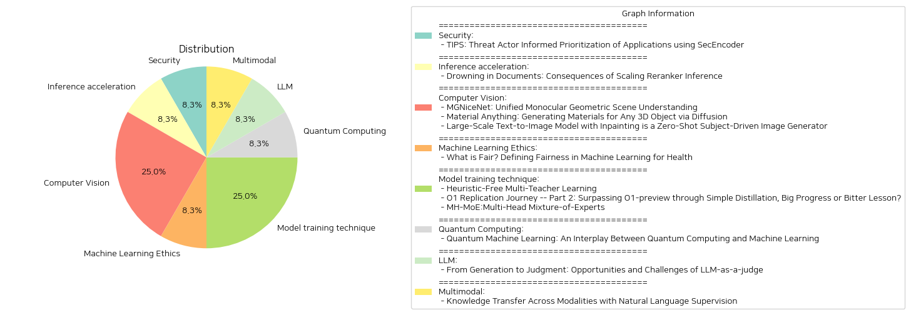

# Daily Artificial Intelligence Insights : Papers

## 🐱 Security

**요약:**

보고서 요약:

1. 주요 주제 및 테마 추출:
- 위협 행위자 정보 기반 우선순위화
- SecEncoder를 사용한 애플리케이션 보안
- 언어 모델의 인코더 및 디코더 기능 통합

2. 공통 키워드 및 트렌드:
- 위협 행위자 정보
- 악성 애플리케이션 탐지 및 우선순위화
- 보안 분석의 효율성 증대

3. 주요 사건 및 중요 정보 요약:
'TIPS: Threat Actor Informed Prioritization using SecEncoder' 논문은 보안 전문 언어 모델을 소개합니다. TIPS는 SecEncoder를 사용하여 위협 행위자 정보를 통합해 손상된 애플리케이션을 탐지하고 우선순위를 지정하며, 인코더 및 디코더 언어 모델의 장점을 결합합니다. 실제 세계 벤치마크 데이터 세트를 사용한 실험에서 TIPS는 악성 애플리케이션을 식별하는 데 있어 F-1 점수 0.90의 높은 효율성을 달성했습니다. 또한, 실제 시나리오에서 보안 분석가의 조사 대기열을 87% 줄여 위협 대응 프로세스를 간소화하고 전반적인 보안 자세를 향상시킵니다.

4. 사건의 다양한 분야에 대한 영향 분석:
TIPS 시스템의 도입으로 보안 분야에서는 악성 애플리케이션의 탐색 및 대응 시간이 크게 단축되었습니다. 보안 분석가의 업무 부담이 경감되어 효율적인 위협 대응이 가능해졌으며, 궁극적으로 조직의 보안 상태가 향상되었습니다.

5. 결론 및 향후 개발 관측:
이 연구는 위협 행위자 정보와 통합된 보안 언어 모델의 강력한 적용 가능성을 입증하며, 향후 더욱 정교한 모델 개발로 보안 효율성을 높일 수 있는 잠재력이 큽니다. 보안 위협이 계속해서 증가함에 따라 이러한 유형의 적응형 우선순위 시스템은 중요한 역할을 할 것이며, 향후 보안 분야의 기술 발전을 주목해야 합니다.

**출처:**

 - TIPS: Threat Actor Informed Prioritization of Applications using SecEncoder (https://deeplearn.org/arxiv/548075/tips:-threat-actor-informed-prioritization-of-applications-using-secencoder)

## ☀️ Inference acceleration

**요약:**

보고서 요약:

1. 주요 주제 및 테마 추출:
   - Rerankers의 확장 및 작동 원리
   - 초기 정보 검색(IR) 시스템
   - Rerankers의 비용 및 성능 평가
   - 정보 검색 문서의 재점수화
   - Rerankers의 성능 저하 이슈

2. 공통 키워드, 트렌드 및 패턴:
   - 'rerankers', 'cross-encoders', '정보 검색', '성능', '점수화', '품질 저하', '문서 중복', '검색 쿼리'
   - Rerankers의 효율성에 대한 재평가 필요성

3. 주요 이벤트 및 중요 정보 요약:
   - Rerankers는 비록 비용이 많이 들지만 일반적으로 초기 정보 검색 시스템이 검색한 문서를 재점수화하기 위해 사용됨.
   - 실험 결과, Rerankers는 일정한 문서 수 이상의 점수화 시 품질 저하가 발생하며, 이는 쿼리와 유의미하게 연관되지 않는 문서에 높은 점수가 할당되는 문제 발생.
   - 이러한 발견을 통해 Reranking 연구의 중요성과 향후 개선 방향 제시 필요성 강조.

4. 이러한 사건들이 다양한 분야에 미치는 영향 분석:
   - 정보 검색 시스템의 효율성 및 비용 대비 효과성의 재검토를 촉발.
   - 데이터 과학 및 검색 기술 분야에서 Rerankers 활용 방식에 대한 새로운 접근법 요구.
   - 검색 정확성 및 관련성에 대한 사용자 경험의 잠재적 영향.

5. 종합 요약 및 잠재적 미래 개발:
   - 이번 연구는 현재 사용되는 Rerankers의 성능 한계와 오류 가능성을 밝혀냄.
   - 미래 연구는 이러한 문제를 해결하기 위한 새로운 Reranking 알고리즘 및 모델 개발을 촉진할 가능성이 있음.
   - 효율적인 정보 검색 모델 구축을 위한 데이터 관리 및 시스템 최적화 연구의 필요성 부각.

결론적으로, Rerankers의 비효율성을 인식하고 개선 방법을 모색함으로써 더 나은 정보 검색 경험을 제공할 수 있는 기회를 제공하고 있음. 앞으로 관련 연구와 기술 개발에 있어 주목할 필요가 있음.

**출처:**

 - Drowning in Documents: Consequences of Scaling Reranker Inference (https://deeplearn.org/arxiv/549218/drowning-in-documents:-consequences-of-scaling-reranker-inference)

## 🪸 Computer Vision

**요약:**

**종합 요약 보고서: 최신 연구 동향 및 기술 발전**

1. **Monocular Geometric Scene Understanding (MGNiceNet)**:
   - **주요 주제**: 단안 기하학적 장면 이해, 파노라믹 세그먼테이션, 자가-지도 심도 추정, 실시간 활용, 자율 주행.
   - **핵심 내용**: MGNiceNet은 파노라믹 세그먼테이션과 자가-지도 심도 추정을 결합한 통합 접근법을 제시합니다. RT-K-Net 아키텍처를 확장하여 실시간 파노라믹 세그먼테이션과 심도 예측을 동시에 수행하며, 비디오 파노라믹 세그먼테이션 주석 없이도 심도 추정을 개선하는 기법을 도입하였습니다. 시티스케이프와 KITTI 데이터 세트에서 평가한 결과, 실시간 방법 중에서 최신 성능을 기록하며, 복잡한 계산을 요구하는 방법과의 격차를 좁혔습니다.
   - **영향**: 자율주행 차량의 실시간 장면 이해를 향상시키며, 주석 부담을 줄이고 기술 적용 가능성을 확대합니다.

2. **Material Anything**:
   - **주요 주제**: 3D 객체 물질 생성, 확산 프레임워크, 다양한 조명 조건.
   - **핵심 내용**: Material Anything은 3D 객체에 적합한 물질을 자동으로 생성하는 통합된 확산 프레임워크로, 복잡한 파이프라인에 의존하지 않는 종단 간 솔루션을 제공합니다. 이미지 확산 모델과 삼중-헤드 아키텍처를 사용하여 물질의 안정성과 품질을 개선합니다. 다양한 조명 조건에서도 일관된 UV-준비 물질 출력을 보장합니다.
   - **영향**: 여러 조명 조건 하에서 물질 생성의 품질을 극대화하며, 3D 모델링 및 렌더링 분야에서 기술적 효율성을 높입니다.

3. **Large-Scale Text-to-Image Model with Inpainting**:
   - **주요 주제**: 주제 기반의 텍스트-이미지 생성, 딥티크 프롬프팅, 이미지 인페인팅.
   - **핵심 내용**: 이 연구는 딥티크 프롬프팅이라는 새로운 제로-샷 접근법을 통해 주제의 정확한 시각적 특성을 캡처하여 이미지를 생성합니다. 이는 큰 규모의 텍스트-이미지 모델을 활용하여 주제 정렬을 개선하며, 이미지 생성 및 편집에 높은 유연성을 제공합니다.
   - **영향**: 사용자에게 시각적인 만족감을 주는 이미지 생성 시대를 열며, 풍부한 시각 효과를 다루는 다양한 응용 분야에서의 적용성을 높입니다.

**종합 결론 및 미래 개발 방향**:
- **공통 키워드**: 통합, 자동화, 실시간, 제로-샷.
- **트렌드**: 기술의 통합적 접근을 통한 효율성 증가, 자동화 수준 향상, 다양한 조건에 대한 적응력 강화.
- **미래 개발 방향**: 이러한 기술의 발전은 자율주행, 3D 모델링, 이미지 생성 등 다양한 산업 분야에 긍정적 영향을 미치며, 더 나아가 이러한 기술을 활용한 새로운 혁신적 서비스와 솔루션의 등장이 기대됩니다. 지속적인 연구와 발전을 통해 기술의 정교함과 적용 가능성을 크게 향상시킬 필요가 있습니다.

**출처:**

 - MGNiceNet: Unified Monocular Geometric Scene Understanding (https://deeplearn.org/arxiv/549352/mgnicenet:-unified-monocular-geometric-scene-understanding)
 - Material Anything: Generating Materials for Any 3D Object via Diffusion (http://arxiv.org/abs/2411.15138v1)
 - Large-Scale Text-to-Image Model with Inpainting is a Zero-Shot Subject-Driven Image Generator (http://arxiv.org/abs/2411.15466v1)

## 🧸 Machine Learning Ethics

**요약:**

1. 주요 주제 및 테마 추출:
   - 공정성: 의료 분야에서의 머신러닝 모델의 안전성, 효과성, 공평성이 주요 주제로 다뤄짐.
   - 건강 불평등: 기존 건강 격차를 방지하기 위한 조치의 중요성에 대한 논의.
   - 공정성 척도: 실제 사례를 통해 공정성을 어떻게 정의하고 계량화했는지에 대한 리뷰.

2. 공통 키워드, 트렌드 및 패턴:
   - 머신러닝, 공정성, 의료 데이터, 건강 격차, 전자 건강 기록(EHR).

3. 주요 사건 및 중요 정보 요약:
   - 의료에서의 머신러닝 모델은 모든 환자 그룹에 대해 안전하고 효과적이며 공정해야 함.
   - 왜 머신러닝 모델이 불공평할 수 있는지를 분석하고, 다양한 실제 사례에서 공정성을 측정한 방법을 리뷰.
   - 공정성을 측정하기 위한 일반적인 척도를 소개하고, EHR 데이터셋을 통한 사례 연구를 제공.
   - 공정성 정의의 기회를 제공하며 다음 연구 방향을 제안.

4. 이러한 사건이 다양한 부문에 미치는 영향 분석:
   - 의료 분야의 의사 결정에 있어 보다 포괄적이고 공정한 모델 개발.
   - 기존 건강 격차를 줄이는 데 긍정적 기여 가능.
   - 의료기관 및 연구자들에게 공정성과 관련된 명확한 가이드라인 제공.

5. 최종 요약 및 미래 발전 방향:
   이 논문은 의료 분야의 머신러닝에서 공정성을 정의하고 측정하는 방법을 제시하며, 그 과정에서 발생하는 도전과 기회를 강조한다. 공정성은 개인 맞춤형 의료 서비스 및 건강 형평성을 높이기 위한 필수적인 요소로 인식되며, 미래에는 보다 많은 데이터를 활용한 더욱 정교한 공정성 척도 개발이 기대된다. 공정한 머신러닝 모델 개발은 정책 입안자와 의료 제공자 사이에서 중요한 관심사가 될 것이다. 이러한 연구는 보다 포괄적이고 평등한 의료 시스템 구축에 중요한 기여를 할 것으로 예상된다.

**출처:**

 - What is Fair? Defining Fairness in Machine Learning for Health (https://deeplearn.org/arxiv/550073/what-is-fair?-defining-fairness-in-machine-learning-for-health)

## 🍋 Model training technique

**요약:**

보고서 요약:

1. **주제와 테마 추출:**
   - **'Heuristic-Free Multi-Teacher Learning'**: 다수의 교사가 참여하는 학습 과정에서 수작업 기반의 집계 방법을 제외한 새로운 프레임워크 'Teacher2Task' 도입. 교사별 입력 토큰 도입과 훈련 데이터의 변형을 통해 특수한 보조 작업과 기본 작업을 생성함으로써 최적의 학습 성능을 달성함.
   - **'O1 Replication Journey -- Part 2: Surpassing O1-preview through Simple Distillation, Big Progress or Bitter Lesson?'**: O1 모델 복제와 성능 향상을 위한 노력을 기술하며, 단순한 증류와 감독 하에 미세 조정된 모델이 O1-preview 성능을 능가할 수 있음을 보여줌. 다양한 과제에 대해 일반화 성능을 검증하고 AI 연구의 투명성 증진을 강조.
   - **'MH-MoE:Multi-Head Mixture-of-Experts'**: 다양한 표현 공간을 다루는 전문가들 간의 정보를 수집하는 다중 헤드 메커니즘을 통해 향상된 성능을 보이는 새로운 구현 방식을 제시함. 특히 최대화된 처리 능력을 강조하면서 품질 개선을 입증.

2. **공통 키워드, 경향, 및 패턴 식별:**
   - 다양한 형태의 학습과 일반화를 통해 AI 모델의 성능을 향상하려는 노력이 지속되고 있으며, 다수의 전문가 참여, 증류 기법 활용, 그리고 학습 투명성에 대한 강조가 두드러짐.
   - AI 연구에서의 기계 학습 모델의 투명성과 신뢰성을 높이기 위한 시도, 그리고 기술적 복잡성을 줄이는 동시에 성능을 향상시키려는 경향이 확인됨.

3. **핵심 정보 요약:**
   - 'Heuristic-Free Multi-Teacher Learning'는 다중 교사 학습 프레임워크에서 수작업 기반 집계 방법의 오류를 최소화하여 최적의 라벨링을 수행함.
   - 'O1 Replication Journey'는 증류 기법을 통해 단순한 데이터로도 복잡한 수학적 추론 문제에서 뛰어난 성능을 달성함을 입증하며, 향후 연구 방향에 대한 투명성을 강조함.
   - 'MH-MoE'는 다중 헤드 메커니즘 활용으로 기존 모델들을 능가하는 성능을 보여주며, 1비트 대형 언어 모델과의 호환성을 입증함.

4. **이 사건들이 다양한 부문에 미치는 영향 분석:**
   - 교육 및 훈련 부문에서 다중 교사 학습과 관련된 효율성 및 성능 개선은 보다 나은 교육 프로그램 개발로 이어질 수 있음.
   - AI 연구의 투명성 증가는 연구 커뮤니티 내에서의 신뢰성을 높이고 기술 개발이 더욱 투명하고 책임 있게 수행되도록 유도할 수 있음.
   - 새로운 기술 구현이 기존 자원을 효율적으로 활용하도록 하여 시장에서 더 많은 응용을 위한 가능성을 제공함.

5. **결론 및 미래 발전 가능성:**
   - 데이터 훈련 및 모델 성능 향상을 위한 지속적인 노력이 필요하며, 이를 위한 다양한 접근 방법의 투명성을 유지하는 것이 중요함.
   - 다중 전문가 시스템 및 증류 방식의 적용은 다양한 분야에서의 성과 향상에 기여할 것으로 예측됨.
   - 향후 연구에서는 AI 모델의 일반화 능력 강화를 위한 다양한 새로운 프레임워크와 기법의 탐색이 계속될 전망임.

**출처:**

 - Heuristic-Free Multi-Teacher Learning (https://deeplearn.org/arxiv/550099/heuristic-free-multi-teacher-learning)
 - O1 Replication Journey -- Part 2: Surpassing O1-preview through Simple Distillation, Big Progress or Bitter Lesson? (http://arxiv.org/abs/2411.16489v1)
 - MH-MoE:Multi-Head Mixture-of-Experts (http://arxiv.org/abs/2411.16205v1)

## 💙 Quantum Computing

**요약:**

### 종합 요약 보고서

#### 1. 핵심 주제 및 테마 추출
- 양자 컴퓨팅과 머신 러닝의 융합
- 양자 머신 러닝(QML)의 발전
- 변동 양자 회로(VQC)를 통한 QML 아키텍처 개발
- 노이즈 중급 규모 양자(NISQ) 장치 적용
- 양자 컴퓨팅에서의 이론적 및 실증적 발견
- QML 연구의 산업적 영향

#### 2. 공통 키워드, 트렌드, 패턴 확인
- 양자 컴퓨팅과 머신 러닝의 조화와 협력
- 첨단 기술의 융합을 통한 새로운 연구 영역의 개척
- QML 연구의 이론적 및 실증적 성과
- 산업 및 연구 방향으로서의 QML 적용 가능성

#### 3. 주요 사건 및 정보 요약
- 변화하는 기술적 환경에서 양자 컴퓨팅이 머신 러닝 분야에 기여하는 방식에 대한 설명
- 기계 학습 기법을 통해 양자 컴퓨팅 연구를 진전시키는 새로운 접근 방식 제시
- 변동 양자 회로를 활용한 QML 아키텍처의 효율적 개발
- 미래의 QML 연구 방향성과 그 산업적 응용 가능성에 대한 탐색

#### 4. 이러한 사건들이 다양한 부문에 미친 영향 분석
- 기술 혁신 분야에서 QML의 신속한 발전은 AI 및 데이터 처리 능력을 강화할 수 있는 가능성을 제공
- 산업 전반에 걸쳐 양자 알고리즘을 통한 문제 해결의 잠재력 증가
- 머신 러닝과 양자 기술이 결합된 새로운 솔루션의 출현으로 인한 다양한 산업의 양자 도입 가속화

#### 5. 최종 종합 요약 및 미래 발전 사항
양자 머신 러닝은 기존의 머신 러닝 프레임워크에 양자 컴퓨팅의 독특한 능력을 결합하여 획기적인 발전을 도모하고 있습니다. 이 기술의 발전은 머신 러닝과 양자 연구 모두에 큰 영향을 미치며, 다양한 산업에 걸쳐 새로운 혁신적 솔루션을 제공합니다. 미래의 양자 머신 러닝 연구와 그것이 여러 산업에 미칠 잠재적 영향을 지속적으로 모니터링하고, 현실화될 QML의 산업적 활용 사례들을 주목해야 할 것입니다. 

앞으로 QML이 신기술 융합의 대표적인 예로 자리 잡을 가능성이 높으며, 새로운 혁신을 주도하는 핵심 기술로 발전할 것으로 기대됩니다.

**출처:**

 - Quantum Machine Learning: An Interplay Between Quantum Computing and Machine Learning (https://deeplearn.org/arxiv/548667/quantum-machine-learning:-an-interplay-between-quantum-computing-and-machine-learning)

## 🎈 LLM

**요약:**

1. 주요 주제 및 테마 추출:
   - 인공지능(AI) 및 자연어 처리(NLP)에서의 평가 및 판단
   - 대형 언어 모델(LLM)의 발전과 'LLM-as-a-judge' 패러다임
   - LLM을 활용한 점수화, 랭킹 및 선택
   - LLM 기반 평가의 정의와 분류
   - LLM-as-a-judge의 벤치마크와 주요 도전 과제

2. 공통 키워드, 트렌드 및 패턴:
   - LLM(대형 언어 모델)
   - 평가 및 판단
   - AI 및 NLP의 발전
   - 점수화, 랭킹, 선택

3. 주요 이벤트 및 중요 정보 요약:
   - 전통적인 평가 방법이 미묘한 특성을 판단하는 데 부족함이 있음
   - 'LLM-as-a-judge' 패러다임이 여러 작업 및 응용 분야에 활용되고 있음
   - LLM 기반의 평가와 판단을 위한 포괄적인 조사 및 분류체계 제공
   - 연구의 주요 방향으로 LLM의 평가 요소와 도전 과제가 제시됨

4. 이러한 사건이 다양한 부문에 미치는 영향 분석:
   - LLM의 활용 증가는 AI 및 NLP 분야의 평가 표준을 변화시킬 수 있음
   - 다양한 산업에서 자동화 평가 시스템의 정확성과 효율성을 향상시킴
   - 연구 및 개발의 새로운 기회를 창출하여 관련 학문 분야를 활성화시킬 수 있음

5. 결론 및 앞으로 주의해야 할 잠재적 발전:
   - 'LLM-as-a-judge' 패러다임이 더 널리 채택될 가능성 있음
   - 평가와 판단의 자동화를 통해 학문적 연구 및 산업적 응용이 가속화될 수 있음
   - 지속적인 연구와 문제 해결이 필요하며, 특히 LLM의 공정성 및 윤리성 관련 이슈에서 발전을 모색해야 함

**출처:**

 - From Generation to Judgment: Opportunities and Challenges of LLM-as-a-judge (http://arxiv.org/abs/2411.16594v1)

## 🎈 Multimodal

**요약:**

주제: 지식 전이, 자연어 감독, 다중 모달 상호작용, 사전 학습된 시각 인코더, 고차원 개념, 제로샷 성능

요약 보고서: 이 논문에서는 텍스트 설명만을 사용하여 새로운 개념을 학습하는 방법인 '지식 전이'를 제안하였습니다. 이 방법은 인간의 인식과 유사하게 다중 모달 상호작용을 활용하여 새로운 개념을 소개합니다. 사전 학습된 시각 인코더는 이미 학습된 저수준의 특징(예: 모양, 외관, 색상)을 가지고 있으며, 이를 활용하여 이전에 알려지지 않은 고차원 개념을 설명할 수 있다고 가정합니다. 제공된 텍스트 설명을 통해, 시각 인코더의 저수준 특징을 고차원의 텍스트 설명에 맞추는 방식으로 작동합니다. 이 방법은 다중 모달 모델에서 새로운 개념을 매우 효율적으로 소개할 수 있으며, 대상 개념의 단일 설명만 필요로 합니다. 이 접근법은 텍스트 인코더와 시각 인코더가 분리된 형태(CLIP 등)와 모달리티 간에 매개변수가 공유되는 상황 모두에 호환 가능합니다. 또한, 동일한 원리를 따라 지식 전이는 이미 모델에 알려진 개념의 개선에도 기여할 수 있습니다. 지식 전이를 활용하여 분류, 세분화, 이미지-텍스트 검색, 캡셔닝 등 다양한 작업에서 제로샷 성능을 향상시킵니다.

분석 및 영향: 이 연구는 지식 전이를 통해 기존에 학습된 저수준 특징을 활용하여 새로운 고차원 개념을 도입함으로써 다중 모달 모델의 학습 방법에 중요한 진전을 이루었습니다. 이는 특히 이미지와 텍스트 간의 상호작용을 필요로 하는 애플리케이션 분야에서 기존 모델이 수행할 수 있는 작업 범위를 확장하며, 효율적인 학습 방법론을 제공합니다. 향후 이러한 접근방식은 더 많은 모달리티를 통합하고, 더욱 복잡한 개념을 다루는 시스템에 응용되어 다중 모달 인공지능 분야의 발전에 기여할 가능성이 있습니다.

**출처:**

 - Knowledge Transfer Across Modalities with Natural Language Supervision (http://arxiv.org/abs/2411.15611v1)

