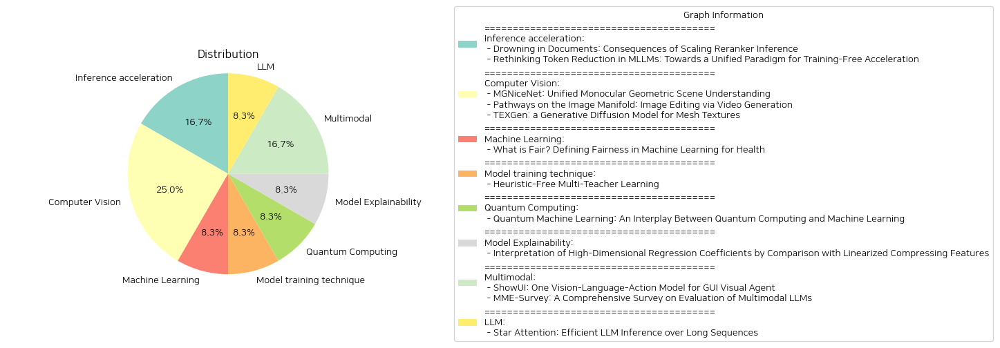

# Daily Artificial Intelligence Insights : Papers

## 💚 Inference acceleration

**요약:**

### 요약 보고서

1. **핵심 주제 및 테마 추출:**
   - 첫 번째 논문은 문서 재정렬기(Re-ranker)의 성능 평가와 그 한계점을 중심으로 다루고 있으며, 더 많은 문서를 점수화할수록 성능이 저하되는 현상을 발견합니다.
   - 두 번째 논문은 다중모드 대형 언어 모델(MLLMs)에서 토큰 감소와 관련된 연구의 현재 상태를 재고하고, 여러 방법을 통합할 수 있는 새로운 패러다임을 제시합니다.

2. **공통 키워드, 트렌드 및 패턴 식별:**
   - 두 논문 모두 현재의 기술적 한계와 그에 대한 도전을 다루고 있으며, 연구 결과에 기반한 새로운 접근 방식과 패러다임을 제안합니다.
   - 재구성 및 가속화의 필요성과, 성능 최적화의 중요성이 두 논문에서 공통적으로 나타납니다.

3. **주요 사건 및 중요 정보 요약:**
   - **'Drowning in Documents' 논문:** 재정렬기는 초기에 반출된 문서들을 다시 점수화함으로써 그 효과를 극대화하려 하나, 실제로는 과도한 문서 처리로 인해 성능이 저하될 수 있다고 주장합니다. 특정 문서에 대해 비문맥적 점수를 매기는 현상이 포착되었으며, 이는 향후 연구의 필요성을 제기합니다.
   - **'Rethinking Token Reduction' 논문:** MLLMs의 추론 속도를 높이기 위해 토큰 감소 전략을 재구성하고, '필터-상관-압축'이라는 통합 패러다임을 제시합니다. 이 방법들은 다양한 벤치마크에서 FLOPs를 약 82.4%까지 감소시키면서도 성능 저하를 최소화하는 데 성공하였다고 보고합니다.

4. **이러한 사건의 다양한 부문에 대한 영향 분석:**
   - 문서 정리 및 재점수화 기술의 발전은 정보 검색 및 데이터 관리 부문에 중요한 영향을 미칠 수 있습니다. 이는 검색 엔진의 효율성을 향상시키고 사용자 경험을 개선할 가능성을 제시합니다.
   - MLLMs의 가속화는 자연어 처리 및 인공지능 관련 분야에 큰 기회를 열어줄 수 있으며, 이는 다양한 산업에서의 AI 적용 가능성을 확대시킵니다.

5. **최종 종합 요약 및 결론, 향후 발전 가능성:**
   - 재정렬기의 한계는 계속해서 학문적 논의와 기술적 발전을 이끌어낼 것이며, 효율적인 문서 처리 전략에 대한 추가 연구가 필요합니다.
   - 통합된 토큰 감소 패러다임은 다양한 모델 적용 가능성을 열어줄 수 있으며, 지속적인 연구와 실험을 통해 더욱 최적화된 기술로 발전할 것입니다.
   - 향후, 이러한 연구가 발전할수록 인공지능 기술의 효율성과 정확성 향상이 기대되며, 이는 특히 정보 처리 및 데이터 분석에서 중대한 기여를 할 것입니다.

**출처:**

 - Drowning in Documents: Consequences of Scaling Reranker Inference (https://deeplearn.org/arxiv/549218/drowning-in-documents:-consequences-of-scaling-reranker-inference)
 - Rethinking Token Reduction in MLLMs: Towards a Unified Paradigm for Training-Free Acceleration (http://arxiv.org/abs/2411.17686v1)

## 🌿 Computer Vision

**요약:**

## 종합 보고서

### 핵심 주제 및 테마 추출

1. **MGNiceNet: Unified Monocular Geometric Scene Understanding**
   - **주제:** 시각적 이해, 단안 기하학적 장면 이해, 자율 주행
   - **방법:** 범용 통합 접근법, 실시간 팬옵틱 세그멘테이션 및 자기 지도학습 깊이 추정
   - **평가:** Cityscapes 및 KITTI 데이터셋에서 최고의 결과 달성
   
2. **Pathways on the Image Manifold: Image Editing via Video Generation**
   - **주제:** 이미지 편집, 영상 생성, 이미지 확산 모델
   - **방법:** 이미지-비디오 모델 사용, 원본 이미지의 핵심 요소 보존
   - **성과:** 텍스트 기반 이미지 편집에서 편집 정확도 및 이미지 보존성을 높임
   
3. **TEXGen: a Generative Diffusion Model for Mesh Textures**
   - **주제:** 3D 자산 렌더링, 질감 지도 생성, 텍스처 공간 학습
   - **방법:** UV 텍스처 공간에서의 학습, 고해상도 질감 지도 생성, 컨볼루션과 주의 레이어 융합
   - **확장 응용:** 텍스트를 통한 질감 보정, 희소 뷰 질감 완성, 텍스트 기반 질감 합성

### 공통 키워드, 트렌드, 패턴 식별

- **공통 키워드:** 실시간 적용, 학습 모델, 이미지 및 영상 처리, 고해상도 결과
- **트렌드:** 학습 모형을 통한 시각적 이해 증대, 자율 주행 또는 3D 렌더링에 적용, 텍스트 기반 편집 기능 확장
- **패턴:** AI 및 머신러닝을 활용한 혁신적 방법론, 효과적이고 정밀한 결과 추구

### 주요 사건 및 중요 정보 요약

- **MGNiceNet**은 자율 주행 시스템의 실시간 시각적 이해를 위해 설계되었으며, 실험 결과 기존 방법들 대비 뛰어난 성능을 보여주었습니다.
- **Pathways on the Image Manifold**는 영상을 통한 이미지 편집 접근법을 새롭게 제안하며, 텍스트 명령을 정교하게 반영한 편집을 가능하게 하였습니다.
- **TEXGen**은 대규모 3D 질감을 효율적으로 생성할 수 있는 모델로, 다양한 응용을 지원하여 3D 자산 제작의 새로운 가능성을 열었습니다.

### 영향 분석 및 관찰된 결과 

- **자율 주행**: MGNiceNet의 발전은 자율 주행 기술의 정확성과 안전성을 높이며, 더 빠르고 실용적인 시스템을 제공합니다.
- **디지털 콘텐츠 제작**: Pathways 피어의 새로운 편집 방식을 통해 이미지 및 영상 콘텐츠의 제작 및 편집이 보다 정밀하고 창의적으로 발전하고 있으며, TEXGen의 발전은 3D 그래픽 품질을 향상시킵니다.

### 결론 및 잠재적 미래 발전

- **결론**: 각 연구는 각각의 목적을 충실히 수행하며 기술 발전의 중심에 있습니다. 이런 혁신은 다양한 산업 분야에서 높은 수준의 자동화 및 정밀성을 제공합니다.
- **미래 발전**: 미래에는 더 발전된 AI 모델들이 더욱 다양한 분야에 적용될 것으로 보이며, 실시간 성능과 고해상도 요구에 대한 해결책이 계속해서 제시될 것입니다.

이 보고서는 시각적 처리 및 자율 시스템의 발전 가능성을 잘 보여주며, 앞으로의 연구와 개발 방향에 유익한 통찰력을 제공합니다.

**출처:**

 - MGNiceNet: Unified Monocular Geometric Scene Understanding (https://deeplearn.org/arxiv/549352/mgnicenet:-unified-monocular-geometric-scene-understanding)
 - Pathways on the Image Manifold: Image Editing via Video Generation (http://arxiv.org/abs/2411.16819v1)
 - TEXGen: a Generative Diffusion Model for Mesh Textures (http://arxiv.org/abs/2411.14740v1)

## 🚀 Machine Learning

**요약:**

제목: 'What is Fair? Defining Fairness in Machine Learning for Health'

1. 핵심 주제 및 테마 추출:
   - 기계 학습(Machine Learning, ML)에서의 공정성
   - 건강 분야의 ML 적용
   - 건강 불균형 예방
   - 공정성 측정 지표

2. 일반적인 키워드, 트렌드 및 패턴 식별:
   - 공정성
   - 임상 의사 결정
   - 기존 건강 불균형
   - 전자 건강 기록(EHR) 데이터셋
   - 연구의 미래 전망

3. 주요 이벤트 및 중요 정보 요약:
   - ML 모델이 모든 환자 그룹에 안전하고 효과적이며 공정해야 함
   - 왜 ML 모델이 공정하지 않을 수 있는지에 대한 분석
   - 공정성의 정량화 방법 및 실제 사례 연구 제시
   - 일반적으로 사용되는 공정성 측정 지표의 개요 제공
   - 공개적으로 이용 가능한 EHR 데이터셋을 통한 사례 연구 논의

4. 이런 이벤트가 다양한 분야에 미치는 영향 분석:
   - 임상 의사 결정 개선과 기존 건강 불균형 해소
   - 의료 데이터 분석의 공정성에 대한 이해 증대
   - 보다 포괄적이고 공정한 의료 서비스 개발에 기여 가능성

5. 최종 종합 요약 및 미래의 발전 가능성:
   - 이 논문은 건강 분야에서 ML 모델의 공정성을 보장하기 위한 현재의 도전 과제와 기회를 강조합니다. 각 환자 그룹에 대해 안전하고 효과적이며 공정한 ML 기술은 임상 의사 결정의 질을 향상시키고, 장기적으로는 사회적 건강 불균형을 해소하는 데 중요한 역할을 할 수 있습니다. 앞으로 연구자들은 보다 정교한 공정성 지표 개발과 실질적인 데이터셋 적용을 통해 이 분야에 기여할 기회를 가지며, 이러한 연구 실패의 사례 및 성공적인 구현 사례를 지속적으로 연구할 필요가 있습니다. 이는 궁극적으로 더 나은 공공 보건 정책과 혁신적인 의료 솔루션 발전에 기여할 수 있습니다.

**출처:**

 - What is Fair? Defining Fairness in Machine Learning for Health (https://deeplearn.org/arxiv/550073/what-is-fair?-defining-fairness-in-machine-learning-for-health)

## 🪄 Model training technique

**요약:**

보고서 요약:

1. 주제 및 테마 추출:

제목과 요약에서 핵심 주제는 '다중 교사 학습'과 'heuristic-free', 즉 휴리스틱 없이 교사 봇을 통해 학습하는 프레임워크인 'Teacher2Task'입니다. 이는 다중 교사 학습에서 수동 집계 휴리스틱을 제거하면서 최적화된 라벨 집계를 제공합니다. 요약에 따르면 이 프레임워크는 각 교사의 고유 라벨링 스타일을 보존하면서도 실제 정답 라벨에 더 집중하는 혁신적인 학습 방법입니다.

2. 주요 트렌드 및 패턴 식별:

공통적으로 나오는 키워드는 'multi-teacher', 'manual aggregation heuristics', 'ground truth labels', 'auxiliary tasks', 'empirical results'입니다. 이는 다중 교사 학습에서 각 교사의 예측 결과를 결합하는 전통적인 방법의 한계점을 개선하려는 방향성을 나타냅니다. 연구에서는 라벨링 오류의 전달을 최소화하고, 교사별 토큰 및 보조 과제로 학습을 혁신적으로 진행하고 있습니다.

3. 주요 사건 및 중요 정보 요약:

Teacher2Task는 교사별 입력 토큰을 도입하여 기존에 의존하던 집계된 라벨 대신, 각각의 교사의 라벨링 스타일을 예측하는 보조 과제(N개)와 진실 라벨에 주목하는 주요 과제(1개)로 변환합니다. 이 혁신적인 접근은 여러 아키텍처, 양식 및 작업에 걸쳐 강력한 실험 결과를 나타냅니다.

4. 이러한 사건들이 여러 부문에 미치는 영향 분석:

이 새로운 프레임워크는 교육 분야와 인공지능 모델링 분야에 큰 영향을 미칠 것으로 예상됩니다. 특히, 교육자 및 AI 연구자들이 교사 봇 학습의 신뢰성과 정확성을 높일 수 있는 방법론을 제공하며, 이는 교육 품질 향상과 AI 모델의 탁월성을 강화할 것입니다.

5. 최종 결론 및 향후 발전 가능성:

Teacher2Task는 다중 교사 학습 분야에서 큰 아이디어 전환을 일으키고 있으며, 휴리스틱 의존도를 줄이는 동시에 각기 다른 교사의 라벨링 스타일을 효과적으로 활용하여 데이터 훈련 프로세스를 최적화하는 잠재력을 갖추고 있습니다. 향후 더욱 다양한 양식과 작업에 대해 이 프레임워크를 확장하여 응용할 수 있을 것이며, 이는 다변화된 교육 및 AI 시스템 발전의 토대를 마련할 것입니다.

**출처:**

 - Heuristic-Free Multi-Teacher Learning (https://deeplearn.org/arxiv/550099/heuristic-free-multi-teacher-learning)

## 🐱 Quantum Computing

**요약:**

종합 요약 보고서:

1. 주요 주제 및 테마 추출:
- 양자 컴퓨팅과 전통적인 기계 학습을 융합한 양자 기계 학습(QML).
- 양자 컴퓨팅의 독특한 능력을 활용하여 기계 학습의 혁신적 발전 시도.
- 변량 양자 회로(VQC)를 사용한 노이즈 중간 규모 양자(NISQ) 장치에서의 QML 아키텍처 개발.
- 양자 컴퓨팅 패러다임을 위한 기계 학습 기술 및 이론적, 경험적 발견 소개.

2. 공통 키워드, 동향 및 패턴 식별:
- 양자 컴퓨팅, 기계 학습, 양자 기계 학습, 변량 양자 회로(VQC), 노이즈 중간 규모 양자(NISQ).
- 산업적 영향 및 미래 방향 탐색.

3. 각 논문의 주요 사건 및 핵심 정보 요약:
- 양자 컴퓨팅 원리와 기계 학습을 결합하여 업계의 혁신적 잠재력을 모색하는 탐구.
- 양자 컴퓨팅 연구의 진전을 위한 기계 학습 기술의 활용.
- 양자 기계 학습 연구의 이론적 및 경험적 발견에 관한 최근 연구 결과 발표.

4. 이러한 사건이 다양한 부문에 미치는 영향 분석:
- 산업에 미치는 잠재적 영향: 양자 컴퓨팅의 혁신적인 능력을 기계 학습에 적용하여 새로운 기술 발전 가능성 열림.
- 연구 및 개발: 양자 기계 학습 연구의 진전이 새로운 알고리즘과 기술 개발을 촉진할 수 있음.
- 기계 학습 및 양자 컴퓨팅 간의 협력 강화로 과학 기술 발전 및 산업 효율성 증대 가능성.

5. 최종 종합 요약 및 결론:
양자 기계 학습은 양자 컴퓨팅의 특별한 능력을 활용하여 전통적 기계 학습을 혁신적으로 발전시킬 수 있는 분야로 주목받고 있습니다. 변량 양자 회로를 사용하여 발전한 QML 아키텍처는 노이즈 중간 규모 양자 장치에서 유용하게 사용될 것으로 예상되며, 이는 다양한 산업에 큰 영향을 미칠 수 있습니다. 앞으로 양자 기계 학습 연구는 기술적 협력을 통해 산업의 효율성을 증가시키고, 새로운 발전을 위한 기회를 제공할 것으로 예상됩니다. 이를 통해 양자 기계 학습의 미래 방향을 주목하며 발전 추세를 지속적으로 관찰할 필요가 있습니다.

**출처:**

 - Quantum Machine Learning: An Interplay Between Quantum Computing and Machine Learning (https://deeplearn.org/arxiv/548667/quantum-machine-learning:-an-interplay-between-quantum-computing-and-machine-learning)

## ⭐ Model Explainability

**요약:**

보고서 요약:

1. 핵심 주제 및 테마 추출:
   - 고차원 회귀 계수의 해석
   - 비선형 응답의 근사
   - 리튬 이온 배터리 사이클 수명 예측
   - 선형화 방법 및 불압축 특징 비교

2. 공통 키워드, 트렌드 및 패턴 확인:
   - 고차원 데이터 해석의 복잡성
   - 선형 회귀와 비선형 응답 사이의 근사성
   - 특징 계수와 회귀 계수의 관계 탐구
   - 높은 규제된 영역에서의 회귀 계수 변형

3. 각 논문의 주요 사건 및 중요 정보 요약:
   - 고차원 함수 데이터에서 비선형 응답을 근사하는 데 있어 고차원 회귀의 해석.
   - 리튬 이온 배터리의 사이클 수명을 예측하기 위한 선형화 방법 개발.
   - 단일 비선형 압축 특징을 사용하여 인공 응답을 구성하는 방법론 사례 연구.
   - 회귀 솔루션 경로의 가장 가까운 회귀 계수와의 비교를 통해 선형화된 특징 계수 도출.

4. 다양한 분야에 대한 사건의 영향 분석:
   - 전기 화학 및 에너지 저장 산업에서의 배터리 수명 예측 개선 가능성.
   - 데이터 과학 및 분석 분야에서의 고차원 데이터 처리 효율성 향상.
   - 고차원 데이터 모델링에 있어 선형 회귀의 역할 및 응용 확대.

5. 종합 요약 및 미래 발전 가능성:
   고차원 회귀 해석을 위한 새로운 선형화 방법은 비선형 응답을 근사하고 데이터의 국부적 구조를 활용하는 데 있어 중요한 통찰력을 제공합니다. 이는 배터리 수명 예측 등 다양한 실제 적용 가능성을 제공하며, 고차원 데이터 해석을 더 넓은 분야에 적용할 수 있는 기틀을 마련합니다. 향후 연구에서는 이러한 접근법의 확장 가능성과 더 복잡한 데이터 구조에 대한 적용을 지속적으로 탐구해야 할 것입니다.

**출처:**

 - Interpretation of High-Dimensional Regression Coefficients by Comparison with Linearized Compressing Features (https://deeplearn.org/arxiv/550410/interpretation-of-high-dimensional-regression-coefficients-by-comparison-with-linearized-compressing-features)

## 👽 Multimodal

**요약:**

**보고서 요약: 최신 연구 동향 및 결과 분석**

1. **주요 주제 및 테마:** 
   - 'ShowUI: One Vision-Language-Action Model for GUI Visual Agent'에서는 GUI(그래픽 사용자 인터페이스) 보조 장치를 개발하기 위한 비전-언어-행동 모델인 ShowUI를 제안합니다. 주된 목표는 인간의 작업 흐름을 향상시키는 것입니다.
   - 'MME-Survey: A Comprehensive Survey on Evaluation of Multimodal LLMs'는 인공지능 일반 지능(AGI) 분야에서 멀티모달 대형 언어 모델(MLLM)의 평가에 대한 포괄적인 조사 연구를 제공합니다.

2. **공통 키워드, 트렌드 및 패턴:**
   - 두 논문 모두 인공지능 분야에서의 발전, 특히 다중 모달성과 관련된 주제를 다루고 있습니다.
   - 데이터 평가와 학습 효율성을 개선하기 위한 새로운 방법론 개발이 강조되고 있습니다.

3. **주요 사건 및 주요 정보 요약:**
   - **ShowUI 모델:** ShowUI는 UI 시각토큰 선택을 통해 스크린샷을 초연결 그래프로 형성하고, 중복 관계를 분석하여 학습 시 주의를 기울여야 할 토큰을 선택합니다. 또한, 다양한 GUI 작업 내 요구를 충족할 수 있도록 시각-언어-행동 스트리밍을 통합하여 네비게이션 및 복잡한 쿼리-행동 시퀀스의 효율적 관리를 가능하게 했습니다. ShowUI는 75.1%의 정확도를 기록하며, 학습 중 중복 시각토큰을 33% 줄여 학습 속도를 1.4배 향상시켰습니다.
   - **MME-Survey:** MLLM의 평가를 위한 네 가지 주요 측면을 조사합니다. 이는 기초 능력, 모델 자기 분석, 확장된 응용 등을 포함한 벤치마크 유형, 데이터 수집 및 주의사항을 포함한 벤치마크 구축 과정, 심사, 메트릭 및 툴킷으로 구성된 체계적 평가 방식, 차기 벤치마크 전망 등이 포함됩니다. 

4. **이 사건들이 여러 분야에 미치는 영향 분석:**
   - **기술 향상:** ShowUI 모델은 인간의 시각적 인식을 모방하여 GUI 보조 장치의 효율성을 크게 증가시켰습니다. 이는 웹, 모바일, 온라인 환경에서의 네비게이션과 작업 수행에 광범위한 적용 가능성을 가지고 있습니다.
   - **연구 촉진:** MME-Survey는 MLLM 연구의 발전을 가속화하기 위한 평가 방법 생산에 유용한 자료를 제공합니다. 이는 인공지능 연구 및 응용 분야의 발전에 기여할 것입니다.

5. **최종 종합 요약 및 향후 개발 가능성:**
   - ShowUI는 GUI 시각 보조 장치 분야에서의 혁신적인 접근 방식을 제시하며, 인간과 컴퓨터 인터페이스의 발전을 가속화할 것입니다. 앞으로 더 많은 실제 어플리케이션에서 채택될 가능성이 있습니다.
   - MME-Survey는 다양한 평가 방법론을 통해 MLLM의 다분야 응용을 촉진할 것입니다. 이로 인해 보다 고급의 인공지능 시스템 개발이 가속화될 것입니다. 앞으로 더욱 정교화된 평가 기술이 연구될 필요성이 있으며, 이러한 과정은 MLLM 발전의 필수적인 요소로 작용할 것입니다.

**출처:**

 - ShowUI: One Vision-Language-Action Model for GUI Visual Agent (http://arxiv.org/abs/2411.17465v1)
 - MME-Survey: A Comprehensive Survey on Evaluation of Multimodal LLMs (http://arxiv.org/abs/2411.15296v1)

## 🚀 LLM

**요약:**

**종합 요약 보고서: 효율적인 LLM 추론 및 승리를 향한 기술 혁신**

1. **주요 주제 및 테마 추출**
   - 논문 제목: 'Star Attention: Efficient LLM Inference over Long Sequences'
   - 주제: 대형 언어 모델(LLMs)의 효율적 추론, Star Attention 메커니즘, 긴 시퀀스의 비용 및 속도 최적화

2. **공통 키워드, 트렌드 및 패턴 식별**
   - 공통 키워드: LLM, Transformer, self-attention, Star Attention, 블록 스파스 근사(block-sparse approximation), 효율성, 메모리 감소
   - 주요 패턴: 기존의 Transformer 기반 LLM들의 비효율성을 극복하기 위한 새로운 메커니즘 도입

3. **주요 사건 및 핵심 정보 요약**
   - Star Attention은 긴 시퀀스에서 Transformer 기반의 LLM 추론 비용과 속도를 개선하기 위해 도입됨.
   - 자기 주의 메커니즘의 복잡성을 해결하기 위해 2단계 블록 스파스 근사를 사용하여 효과적인 계산을 수행.
   - 1단계에서는 블록 단위의 로컬 주의를 통해 여러 호스트에서 병렬로 문맥을 처리하고, 2단계에서는 시퀀스 전체의 글로벌 주의를 통해 쿼리와 응답 토큰이 이전 캐시된 모든 토큰에 주의하도록 설계됨.
   - 이 방법은 메모리 요구량과 추론 시간을 최대 11배까지 감소시키며, 정확성을 95-100%로 유지.

4. **이 사건들이 다양한 분야에 미치는 영향 분석**
   - 기술 및 컴퓨팅 분야: LLM의 효율성 증가는 대규모 데이터 처리 및 실시간 응용 분야에서 중요한 발전을 의미하며, 이는 웹 검색, 자연어 처리, 실시간 번역 및 기타 AI 기반 서비스에 큰 영향을 미침.
   - 경제적 측면: 처리 시간과 비용 절감은 클라우드 서비스 제공자 및 기업에게 직접적인 운영비 절감을 가져올 수 있음.
   - 사회적 측면: 더 나은 성능을 가진 AI 모델은 사용자 경험을 향상시키고 개인정보 보호 강화 가능성을 높임.

5. **최종 통합 요약 및 미래 발전 가능성**
   - Star Attention은 Transformer 기반 LLM의 효율성을 혁신적으로 향상시키는 기술로, 긴 시퀀스 처리 문제의 고질적인 비효율성을 해결하는 데 기여함.
   - 향후 발전: 이러한 기술 발전은 AI 모델의 지속적인 최적화 및 확장을 위한 새로운 연구 방향을 제시하며, 다양한 산업의 데이터 활용 방식에 근본적인 변화를 가져올 가능성이 있음. 보다 진보된 주의 메커니즘이 등장하여, 더욱 복잡하고 다양한 AI 응용 프로그램에 대한 수요를 충족시킬 가능성 높음.

**출처:**

 - Star Attention: Efficient LLM Inference over Long Sequences (http://arxiv.org/abs/2411.17116v1)

