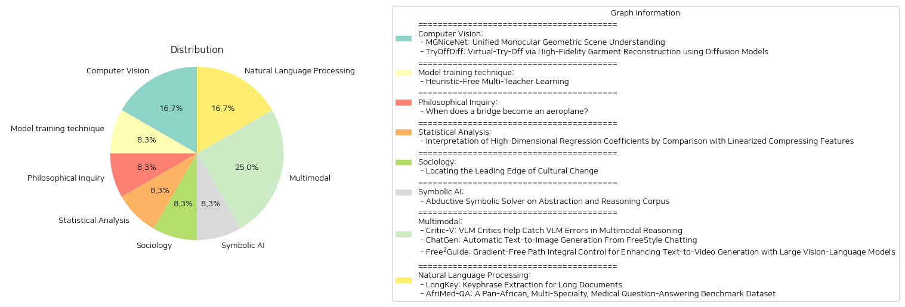

# Daily Artificial Intelligence Insights : Papers

## 💙 Computer Vision

**요약:**

**종합 보고서: 2023년 최신 기술 동향**

**1. 단안 기하학적 장면 이해를 위한 통합적 접근 - MGNiceNet**

- **주요 주제 및 테마**: MGNiceNet 모델은 단일 카메라를 사용한 기하학적 장면 이해를 목표로 하는 모델로, 파노픽 세그먼트와 자가 지도 심도 추정의 결합을 중심으로 합니다. 이는 특히 자율주행 차량에서 실시간 적용을 목적으로 개발되었습니다.
  
- **핵심 정보 요약**: MGNiceNet은 RT-K-Net을 기반으로, 파노픽 세그먼트와 자가 지도 단안 심도 추정을 아울러 처리할 수 있는 아키텍처로 확장되었습니다. 깊이 예측에는 파노픽 경로의 정보를 활용한 자가 지도 방식의 깊이 추정기가 도입되었으며, 비디오 파노픽 세그멘테이션 주석 없이도 깊이 추정을 개선할 수 있는 모션 마스킹 방법이 제안되었습니다. Cityscapes와 KITTI 두 가지 자율주행 데이터셋에서 검증된 결과, 다른 실시간 방법들에 비해 탁월한 성능을 보여주며, 높은 연산 요구를 가진 방법들과의 성능 격차를 좁혔습니다.

- **영향 분석**: 이 기술은 자율주행 차량 기술 발전에 크게 기여할 수 있으며, 실시간 오브젝트 인식 및 환경 이해력 향상에 긍정적인 영향을 미칠 것입니다.

**2. 고충실도 의류 재구성을 통한 가상 체험 'TryOffDiff'**

- **주요 주제 및 테마**: 가상 체험(VTOFF) 과제는 개인의 사진으로부터 표준화된 의류 이미지를 생성하는 것을 목표로 하며, 의상의 모양, 질감 및 복잡한 패턴을 포착하는 데 독특한 도전 과제를 제공합니다.

- **핵심 정보 요약**: TryOffDiff 모델은 안정적인 확산 모델과 SigLIP 기반의 시각적 조건화를 적용하여 고충실도와 세부 정보를 유지하도록 설계되었습니다. VITON-HD 데이터셋을 변형한 실험을 통해 자세 이전 및 전통적 가상 체험 기반의 방법들과 비교해 전통적 이미지 생성 메트릭이 재구성 품질을 충분히 평가하지 못한다는 한계를 극복하였음을 확인했습니다.

- **영향 분석**: 이 기술은 전자상거래에서 제품 이미지를 개선하고, 생성 모델 평가를 향상시키며, 고충실도 재구성 연구의 발전에 영감을 줄 가능성이 있습니다.

**결론 및 향후 전망**

두 논문 모두 최신 기술을 기반으로 한 혁신적인 접근 방식을 통해 특정 산업 분야에 직접적인 적용 가능성을 시사하고 있습니다. MGNiceNet은 자율주행 기술의 장벽을 낮추고 즉각적인 환경 인식을 강화할 수 있으며, TryOffDiff는 전자상거래 분야에서의 제품 이미지 향상에 큰 기여를 할 수 있을 것으로 보입니다. 미래에는 이러한 기술들의 결합 혹은 확장된 응용이 예상되며, 이를 통한 다양한 산업에서의 적용 가능성도 탐색될 것입니다.

**출처:**

 - MGNiceNet: Unified Monocular Geometric Scene Understanding (https://deeplearn.org/arxiv/549352/mgnicenet:-unified-monocular-geometric-scene-understanding)
 - TryOffDiff: Virtual-Try-Off via High-Fidelity Garment Reconstruction using Diffusion Models (http://arxiv.org/abs/2411.18350v1)

## 🤩 Model training technique

**요약:**

보고서:

1. 핵심 주제 및 주제 추출:
   - 다수의 교사 학습 방법에서의 휴리스틱 의존성 제거
   - Teacher2Task 프레임워크
   - 수작업 통합 휴리스틱의 단점 극복
   - 교사별 입력 토큰 도입
   - 학습 데이터의 변환 및 다중 작업 접근

2. 공통 키워드, 동향 및 패턴 식별:
   - 다수의 교사 예측 집계
   - 집계 오류의 전파 문제 해결
   - 주어진 명확한 학습 패러다임에 따른 성능 향상

3. 주요 이벤트 및 핵심 정보 요약:
   - Teacher2Task는 N명의 교사로부터 주어지는 주석과 실제 레이블을 N+1개의 개별적 작업으로 변환합니다.
   - N개의 보조 작업은 각 교사의 레이블링 스타일을 예측하고, 주 작업은 실제 레이블에 초점을 맞추는 방식입니다.
   - 다양한 구조, 방식, 작업에 대한 강력한 실증 결과 시현

4. 다양한 분야에 대한 이러한 이벤트의 영향 분석:
   - 기존 다수의 교사 학습 방법보다 더 나은 예측 정확성 제공
   - 다양한 인공지능 분야에서의 효율성 및 성능 개선
   - 수작업 휴리스틱 의존성 감소로 인해 프로세스 자동화 촉진

5. 결론 및 향후 주목할만한 발전:
   - Teacher2Task 접근은 현존하는 멀티-티처 방식의 주요 한계를 극복하며 이 분야의 연구에 새로운 방향성을 제시합니다.
   - 향후 교사별 입력 토큰의 최적화 가능성 및 다양한 응용 분야에의 확장 가능성 주목
   - 다중 학습 패러다임에서 보다 자동화된 통합 및 성능 개선 가능성 제시

이 보고서는 Teacher2Task의 혁신적 접근법이 멀티-티처 학습 방법의 전환점이 될 수 있으며, 이를 통해 인공지능 개발 분야에 다각도의 긍정적인 파급 효과를 기대할 수 있음을 강조합니다.

**출처:**

 - Heuristic-Free Multi-Teacher Learning (https://deeplearn.org/arxiv/550099/heuristic-free-multi-teacher-learning)

## 👽 Philosophical Inquiry

**요약:**

1. **주요 주제 및 테마 추출:**
   - 인구 기반 구조 건강 모니터링(PBSHM)
   - 이질적 구조들 간의 지식 전이
   - 중재 구조를 통한 정보 격차 해소
   - 매개변수 변화에 따른 구조적 상호 변환

2. **공통 키워드, 트렌드 및 패턴:**
   - 구조적 유사성에 기초한 긍정적 전이
   - 매개변수화 및 전환
   - 이질적 시스템 간 전이의 가능성

3. **주요 사건 및 중요 정보 요약:**
   - 인구 기반 구조 건강 모니터링 분야의 최근 발전에도 불구하고 서로 다른 구조들 간의 지식 전이는 여전히 과제로 남아있다.
   - 중재 구조물이 정보 격차를 해소할 수 있는 가능성을 제안하고, 이를 통해 긍정적 전이를 달성할 수 있는 사례를 시연하였다.
   - '다리'와 '비행기'를 예로, 매개변수를 조정함으로써 한 구조가 다른 구조로 점진적으로 변형될 수 있음을 보여주었다.

4. **이 사건들이 다양한 부문에 미친 영향 분석:**
   - 구조 건강 모니터링 및 유지보수 분야에서 이질적 구조들 간 정보를 공유하고 활용할 수 있는 가능성을 열었다.
   - 엔지니어링 및 설계에서 더 효율적이고 통합된 접근법 개발에 기여할 수 있다.

5. **최종 종합 요약 및 향후 전개 가능성:**
   - 본 연구는 매개변수 변화를 통해 서로 다른 구조들 간의 정보를 전이하는 새로운 방법을 제시하였다. 이는 구조 건강 모니터링의 범위를 확장하고 복잡한 시스템 간의 연결성을 향상시킬 수 있는 잠재력을 가진다.
   - 향후 이러한 연구가 더 많은 실제 구조와의 실증적 연구로 이어질 가능성이 있으며, 다양한 공학 분야에서 혁신적인 설계 및 분석 기술로 발전할 수 있다.

**출처:**

 - When does a bridge become an aeroplane? (https://deeplearn.org/arxiv/553087/when-does-a-bridge-become-an-aeroplane?)

## 🤩 Statistical Analysis

**요약:**

제목: '고차원 회귀 계수 해석: 선형화 압축 특징과의 비교'

이 논문은 선형 회귀가 본래 해석 가능하다고 여겨지지만, 고차원 데이터에서의 도전과제를 탐구합니다. 리튬 이온 배터리의 수명 예측을 통해 고차원 함수 데이터의 비선형 응답을 선형 회귀가 어떻게 근사하는지 더 잘 이해하기 위해 고안된 연구입니다. 저자들은 선형화 방법을 개발하여 피쳐 계수를 도출하고, 이를 회귀 솔루션 경로의 가장 가까운 회귀 계수와 비교합니다. 배터리 데이터 사례 연구에서는 단일 비선형 압축 특성을 이용한 합성 반응을 통해 방법론을 시연합니다. 이 연구는 고차원 함수 데이터를 위한 선형 회귀 및 압축 특성의 통합적 관점을 제공하며, (1) 강하게 규제된 도메인에서 회귀 계수의 형성 방법과 선형화된 피쳐 계수와의 관계, (2) 국부 구조를 활용하여 비선형 응답을 근사하기 위한 규제의 함수로서 회귀 계수의 형성 변화 양상의 이해를 돕습니다.

논문의 주요 주제는 고차원 데이터에서 선형 회귀의 해석 가능성 문제, 비선형 응답 근사, 리튬 이온 배터리 수명 예측을 위한 실용적 접근입니다. 또한, 선형화 방법과 회귀 솔루션의 비교를 통해 고차원 함수 데이터에서의 회귀 분석을 새로운 시각에서 조망합니다.

이 연구의 임팩트는 주로 데이터 과학 및 회귀 분석 분야에 중점을 두고 있으며, 고차원의 복잡한 데이터를 다룰 때 선형 회귀가 갖는 한계를 보완하는 방법론적 기여를 제공합니다. 추가로, 이 연구는 다양한 산업 분야에서 데이터 분석 방법론의 개선을 촉진할 가능성을 지니고 있습니다. 

끝으로, 고차원 데이터에서의 해석 가능성을 높이기 위한 미래 연구의 방향으로는 비선형 특성을 보다 효과적으로 조합할 수 있는 추가적인 모델 개발, 다양한 고차원 데이터 집합에 대한 적용성 확장 등이 있습니다.

**출처:**

 - Interpretation of High-Dimensional Regression Coefficients by Comparison with Linearized Compressing Features (https://deeplearn.org/arxiv/550410/interpretation-of-high-dimensional-regression-coefficients-by-comparison-with-linearized-compressing-features)

## 🎇 Sociology

**요약:**

제목: '문화 변화의 선두 찾기'

요약: 텍스트 유사성과 발산 측정은 문화 변화를 연구하는 데 점점 더 많이 사용되고 있습니다. 그러나 이러한 측정이 사회적 증거와 얼마나 부합하는지에 대한 연구는 미진합니다. 본 연구는 문학 연구, 경제학, 허구라는 세 가지 다른 코퍼스에 대해 주제 모델, 문서 임베딩, 단어 수준 퍼플렉시티라는 세 가지 텍스트 표현을 적용했습니다. 모든 경우에서, 많이 인용되는 작가와 젊은 작가의 작품이 문서적으로 변화의 선두에 있습니다. 특정 텍스트 표현이 다른 표현보다 우수하다는 명확한 증거는 없지만, 사회적 증거와의 정렬은 텍스트가 가장 첨단적인 구절 상위 사분위수로 표현될 때 가장 강합니다. 이는 텍스트의 영향력이 지속적으로 높은 수준의 혁신을 유지하는 것보다 가장 앞서가는 순간에 더 의존할 수 있음을 시사합니다.

주요 주제 및 테마:
- 문화 변화의 측정 도구
- 텍스트 유사성 및 발산
- 사회적 증거와의 부합성
- 주제 모델, 문서 임베딩, 단어 수준 퍼플렉시티

공통 키워드, 트렌드 및 패턴:
- 텍스트 유사성, 혁신, 문화 변화
- 인용 작가와 젊은 작가의 주도적 역할
- 첨단적인 표현의 중요성

핵심 정보와 주요 사건 요약:
- 변화의 기본 방법으로 다양한 텍스트 표현이 사용되며, 이 중 어느 하나가 다른 것보다 우수하지 않음.
- 사회적 증거와의 일치가 텍스트의 가장 미래지향적인 순간에 의해 촉진.

영향 분석:
- 문학, 경제학, 허구 분야에서 변화를 주도할 수 있는 방식으로 텍스트가 표현되는 방식의 중요성.
- 주요 작가들의 혁신적 요소가 문화 변화에 미치는 중요성.

최종 결론 및 향후 발전 가능성:
- 텍스트 표현의 다양성을 인정하면서도, 가장 혁신적이고 미래지향적인 순간의 중요성을 강조할 필요.
- 문화 변화 연구에서 사회적 증거와 부합하는 텍스트 분석 방법론의 발전 기대.

**출처:**

 - Locating the Leading Edge of Cultural Change (https://deeplearn.org/arxiv/551310/locating-the-leading-edge-of-cultural-change)

## 🧸 Symbolic AI

**요약:**

제목: '추론과 추상적 사고 해결을 위한 상징적 솔버 개발'

논문 요약: 이 논문은 인공지능의 추론 능력을 강화하는 문제를 다루며, 특히 Abstraction and Reasoning Corpus(ARC) 내에서의 논리성에 중점을 둡니다. 사람들은 관찰과 가설을 바탕으로 시각적 추론 작업을 해결하며, 적절한 이유를 들어 그들의 해결 과정을 설명할 수 있습니다. 그러나 많은 이전 연구들은 그리드 전환에만 집중하였고, 이는 AI가 합리적이고 인간적인 해결책을 제공하기 위해 충분하지 않습니다. 우리는 인간의 시각적 추론 문제 해결 과정을 고려하여, 사고 과정이 가설적 추론 과정일 가능성이 높다고 결론지었습니다. 따라서 우리는 관찰된 데이터를 상징적으로 지식 그래프로 표현하고 해결책 생성에 사용할 핵심 지식을 추출하는 새로운 프레임워크를 제안합니다. 이 정보는 해결책 탐색 공간을 제한하고 합리적인 중간 과정을 제공하는 데 도움을 줍니다. 우리의 접근 방식은 ARC 작업에서 AI 성능을 효과적으로 향상시킬 가능성이 있으며, 핵심 지식 추출에 기반한 논리적 해결책을 제공하는 데 기여합니다. 

핵심 주제 및 테마: 인공지능 향상, 추론 능력, 시각적 추론, 가설적 추론, 지식 그래프, 해결책 생성

주요 키워드 및 트렌드: AI, 논리성, 지식 추출, 해결책 탐색, 시각적 추론, 가설적 추론

주요 사건 및 정보 요약: 이전 연구들이 그리드 전환에 집중한 것의 한계를 극복하기 위해, 인간의 사고 과정을 모방한 가설적 추론 프로세스 활용이 추진되었으며, 이를 통해 데이터에서 핵심 지식을 추출하고 이를 기반으로 논리적인 해결책을 제시하는 프레임워크가 개발되었습니다.

이 사건들의 영향 분석: 시각적 추론 과제에서 AI의 성능 향상을 도모함으로써 추후 다양한 분야에서 더 논리적이고 인간적인 해결책을 제공할 수 있는 가능성이 열렸습니다.

최종 요약 및 결론: 이 연구는 AI가 더 논리적이고 인간적인 해결책을 제공할 수 있도록 도움을 주며, 추후 시각적 및 다양한 유형의 추론 과제에서의 성과 향상 가능성을 기대하게 합니다. 이를 기반으로 한 미래의 발전 가능성도 주목할 만합니다.

**출처:**

 - Abductive Symbolic Solver on Abstraction and Reasoning Corpus (https://deeplearn.org/arxiv/553225/abductive-symbolic-solver-on-abstraction-and-reasoning-corpus)

## 🌞 Multimodal

**요약:**

보고서 요약:

1. **주요 주제 및 테마 추출**:
   - 다중모드 추론에서의 비전-언어 모델(VLM)의 발전과 한계
   - 텍스트-이미지(T2I) 및 텍스트-비디오(T2V) 생성 모델에서의 자동화 및 정렬 문제
   - 대규모 비전-언어 모델(LVLM)과의 통합을 통한 생성 모델 개선

2. **공통 키워드, 경향 및 패턴 식별**:
   - 비전-언어 모델의 추론 능력 향상
   - 텍스트-이미지 및 텍스트-비디오 생성의 자동화와 효율성 향상
   - 강화 학습 및 비차별적인 보상 모델의 활용
   - 대규모 모델 통합과 정렬 문제 해결

3. **각 논문의 주요 사건 및 핵심 정보 요약**:
   - 'Critic-V'는 Actor-Critic 패러다임을 기반으로 VLM의 추론 능력을 향상시키기 위한 새로운 프레임워크로, 강화 학습을 통해 자연어 비판을 제공, VLM의 신뢰성과 성능을 향상.
   - 'ChatGen'은 텍스트-이미지 생성의 과정 자동화를 목표로 하여, 사용자가 단순하게 채팅으로 원하는 것을 묘사하면 자동으로 이미지를 생성하는 자동화 시스템을 제안, 다양한 데이터셋을 통한 평가에서 성능 향상.
   - 'Free$^2$Guide'는 텍스트-비디오 생성에서의 텍스트 정렬 문제를 해결하기 위한 경사 없는 프레임워크 제안, 프레임 간 복잡한 시간 의존성을 해결하며 대규모 비전-언어 모델의 통합 가능성을 보여줌.

4. **이벤트가 다양한 분야에 미친 영향 분석**:
   - 'Critic-V'의 제안은 자율주행, 내장형 지능체와 같은 다중모드 애플리케이션에서의 추론 능력과 정확성을 크게 향상시킬 수 있을 것으로 기대.
   - 'ChatGen'의 자동화 접근은 콘텐츠 생성 및 미디어 산업에서의 효율성과 생산성을 크게 개선할 수 있는 잠재력을 가지고 있음.
   - 'Free$^2$Guide'는 미디어 및 엔터테인먼트 산업에서 텍스트-비디오 생성의 정렬과 품질을 개선하는 데 기여할 수 있음.

5. **최종 결론 및 향후 개발 주목점**:
   - 이들 연구는 비전-언어 모델의 추론 능력과 생성 모델의 자동화 및 정렬 문제를 해결하기 위한 다양한 접근을 제시하며, 각각의 기술은 서로 보완적으로 적용될 수 있음.
   - 향후 연구에서는 더욱 복잡하고 세밀한 피드백 메커니즘의 개발과 대규모 모델의 통합 및 효율화에 초점을 맞출 필요가 있음.
   - 이러한 발전은 다양한 산업 분야에서 지능형 시스템의 성능을 한층 더 향상시킬 수 있는 기회를 제공할 것으로 기대됨.

**출처:**

 - Critic-V: VLM Critics Help Catch VLM Errors in Multimodal Reasoning (http://arxiv.org/abs/2411.18203v1)
 - ChatGen: Automatic Text-to-Image Generation From FreeStyle Chatting (http://arxiv.org/abs/2411.17176v1)
 - Free$^2$Guide: Gradient-Free Path Integral Control for Enhancing Text-to-Video Generation with Large Vision-Language Models (http://arxiv.org/abs/2411.17041v1)

## 🍊 Natural Language Processing

**요약:**

보고서 요약:

1. 주요 주제 및 테마 추출:
   - 문서 및 논문의 키프레이즈 추출 자동화와 관련한 'LongKey'의 개발.
   - 대규모 의료 질문응답 데이터셋 'AfriMed-QA' 개발 및 평가.

2. 공통 키워드, 트렌드 및 패턴:
   - 정보 과부하 문제 해결을 위한 자동화된 데이터 처리 기술의 중요성.
   - 의료 분야에서의 대규모 데이터셋 및 인공지능 모델 적용을 통한 접근성 향상.
   - 길이가 긴 문맥에서도 효과적인 키프레이즈 추출 및 다분야 의료 질문응답 성능의 다양성.

3. 주요 이벤트 및 핵심 정보 요약:
   - LongKey는 긴 문서에서도 효과적으로 키프레이즈를 추출할 수 있는 새로운 프레임워크로, 높은 성능을 입증하며 다양한 분야의 문서에 적용 가능성을 보여준다.
   - AfriMed-QA는 아프리카 대륙의 의료 질문응답을 위한 첫 번째 대규모 데이터셋으로, 16개국의 60개 이상의 의과대학에서 15,000개의 질문을 수집하였다. 여러 분야의 성능 평가 결과, 지역 및 특성에 따른 성능 편차가 나타났으며, 특정 모델들은 기대에 미치지 못한다는 것이 밝혀졌다.

4. 각 사건이 다양한 분야에 미치는 영향 분석:
   - LongKey의 개발은 학술 및 비즈니스 문서를 포함한 다양한 분야에서 중요한 정보를 쉽게 추출하고 분석할 수 있도록 하여 데이터 처리 효율성을 증대시킬 수 있다.
   - AfriMed-QA는 아프리카의 제한된 의료 자원과 의료 서비스 접근성을 개선하는 기반을 마련하였으며, 특히 저소득 및 중소득 국가에서의 건강 데이터를 더욱 효율적으로 관리할 수 있게 했다. 이는 장기적으로 의료 인프라 개선 및 비용 절감에 기여할 수 있을 것이다.

5. 결론 및 향후 주목할 개발 방향:
   - LongKey는 정보 처리에서 문서의 길이에 구애받지 않는 키프레이즈 추출의 발전을 도모하였으며, 이는 연구 및 사업 분야의 데이터 분석을 혁신할 가능성이 있다.
   - AfriMed-QA의 적용을 통해 향후 아프리카 대륙의 디지털 헬스케어 혁신을 촉진하고, 더욱 맞춤화된 의료 서비스를 제공하기 위한 인공지능 모델의 개발이 지속적으로 이루어질 필요성이 있다.
   - 전반적인 AI 및 LLM 성능의 지역 및 분야별 차이를 최소화하기 위한 지속적인 연구와 개선이 요구된다.

**출처:**

 - LongKey: Keyphrase Extraction for Long Documents (http://arxiv.org/abs/2411.17863v1)
 - AfriMed-QA: A Pan-African, Multi-Specialty, Medical Question-Answering Benchmark Dataset (http://arxiv.org/abs/2411.15640v2)

