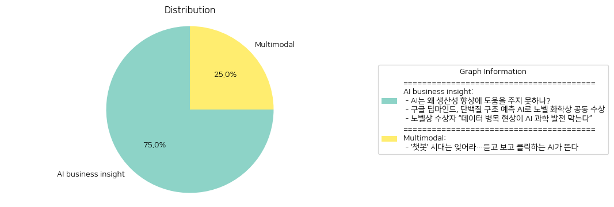

# Daily Artificial Intelligence Insights : News

## 🪸 AI business insight

**요약:**

**주요 테마**:
- 인공지능(AI)의 발전과 그 응용: 모든 기사는 인공지능의 역할, 잠재력 및 한계에 대해 다루고 있습니다.
- AI의 실질적인 기여와 장애물: AI가 기술적으로는 진보했지만, 생산성 향상과 과학 발전에 좀 더 효과적으로 기여하기 위한 개선점이 필요하다는 공통된 인식을 확인할 수 있습니다.
- 노벨상 수상과 AI의 응용: 구글 딥마인드의 연구가 AI의 실제적 응용 성공 사례로 강조되고 있습니다.

**주요 사건**:
- 인공지능이 생산성 향상에 현재 충분히 기여하지 못하고 있다는 문제 제기가 있습니다. 이는 AI 기술의 현재 한계점과 발전이 필요한 분야에 대해 논의하고 있습니다.
- 구글 딥마인의 데미스 허사비스와 존 점퍼가 AI를 통해 단백질 구조 예측 문제를 해결해 노벨 화학상을 수상하며, AI 기술이 과학 분야에서 큰 성과를 거두고 있음을 보여줍니다.
- 노벨상 수상자들이 데이터의 품질과 부족함이 AI를 활용한 과학 발전을 제한한다고 강조했습니다.

**영향 분석**:
- **경제**: AI의 잠재력을 극대화하는 데 있어 데이터와 기술적 개선이 필수적이라는 점에서, 이는 경제적 생산성 향상에 대한 전략적 투자 방향을 시사합니다.
- **과학**: AI 기반 단백질 구조 예측 기술은 생물학 및 의학 연구에 큰 영향을 미치며, 새로운 치료제 개발 가속화에 기여할 수 있습니다.
- **사회**: AI의 효율적 활용과 발전 과정에서 데이터 품질 문제 해결이 중요한데, 이는 프라이버시와 데이터 보안 이슈로 사회적 논의를 촉발할 수 있습니다.

**최종 요약**:
기사는 AI의 현재와 미래에 대한 복합적 이해를 제공합니다. AI는 연구와 산업계에서 중요한 도구로 자리잡고 있지만, 생산성 면에서 더 이상 발전하려면 데이터 품질 및 기술 개발의 필요성이 제기되고 있습니다. 특히 노벨상을 통해 강조된 AI의 과학적 기여는 미래 연구 및 개발 방향에 큰 영향을 미칠 것으로 보이며, AI의 실효성을 높이기 위한 데이터 관리 및 혁신적인 방식의 모색이 중요할 것입니다. 이를 통해 지속 가능한 기술 발전과 사회적 이익을 추구하는 방향성을 지속적으로 주목할 필요가 있습니다.

**출처:**

 - AI는 왜 생산성 향상에 도움을 주지 못하나? (https://www.technologyreview.kr/ai%eb%8a%94-%ec%99%9c-%ec%83%9d%ec%82%b0%ec%84%b1-%ed%96%a5%ec%83%81%ec%97%90-%eb%8f%84%ec%9b%80%ec%9d%84-%ec%a3%bc%ec%a7%80-%eb%aa%bb%ed%95%98%eb%82%98/)
 - 구글 딥마인드, 단백질 구조 예측 AI로 노벨 화학상 공동 수상 (https://www.technologyreview.kr/%ea%b5%ac%ea%b8%80-%eb%94%a5%eb%a7%88%ec%9d%b8%eb%93%9c-%eb%8b%a8%eb%b0%b1%ec%a7%88-%ea%b5%ac%ec%a1%b0-%ec%98%88%ec%b8%a1-ai%eb%a1%9c-%eb%85%b8%eb%b2%a8-%ed%99%94%ed%95%99%ec%83%81-%ea%b3%b5%eb%8f%99/)
 - 노벨상 수상자 “데이터 병목 현상이 AI 과학 발전 막는다” (https://www.technologyreview.kr/%eb%85%b8%eb%b2%a8%ec%83%81-%ec%88%98%ec%83%81%ec%9e%90-%eb%8d%b0%ec%9d%b4%ed%84%b0-%eb%b3%91%eb%aa%a9-%ed%98%84%ec%83%81%ec%9d%b4-ai-%ea%b3%bc%ed%95%99-%eb%b0%9c%ec%a0%84-%eb%a7%89%eb%8a%94/)

## 🫧 Multimodal

**요약:**

**1. 주요 주제:**
   - AI 기술의 진화: 텍스트 기반 챗봇에서 벗어나 음성과 영상 생성 기능을 갖춘 AI로의 발전.
   - 기술 혁신과 그 역할: 기술의 진화가 어떻게 다른 방식의 상호작용(청각, 시각, 클릭)을 가능하게 하는지에 대한 논의.

**2. 주요 사건:**
   - AI의 발전: 텍스트 기반 AI 챗봇에서 음성과 영상 생성 기능을 포함하는 새로운 AI 기술의 개화.
   - AI의 활용 방식 변화: 사용자가 단순히 문자를 입력하는 방식에서, 듣고 보고 클릭하는 방식으로의 변화.

**3. 영향 분석:**
   - 경제적 영향: 음성과 영상 생성 기능을 갖춘 AI 발전은 다양한 산업에서의 혁신 제품과 서비스 개발을 촉진할 가능성이 있다. 특히, 미디어와 엔터테인먼트 산업에서 새로운 콘텐츠 생성 방식의 변화를 예상할 수 있다.
   - 사회적 영향: AI의 청각 및 시각 기능은 정보 접근성을 확장하고, 사람과 기계 간의 상호작용을 보다 자연스럽게 만들어 평등한 정보 전달과 학습에 기여할 수 있다.

**4. 최종 요약:**
   AI 기술은 텍스트 기반 챗봇에서 한층 진화하여 음성과 영상 생성 기능을 갖춘 형태로 발전하고 있다. 이러한 기술 혁신은 사용자가 AI와 상호작용하는 방식을 변화시키며, 다양한 산업에 새로운 성장 기회를 제공할 것으로 기대된다. 앞으로 AI 기술이 경제 및 사회 전반에 미칠 영향에 주목할 필요가 있으며, 지속적인 혁신이 어떤 새로운 경로를 열어갈지 지켜보아야 할 것이다.

**출처:**

 - ‘챗봇’ 시대는 잊어라…듣고 보고 클릭하는 AI가 뜬다 (https://www.technologyreview.kr/%ec%b1%97%eb%b4%87-%ec%8b%9c%eb%8c%80%eb%8a%94-%ec%9e%8a%ec%96%b4%eb%9d%bc-%eb%93%a3%ea%b3%a0-%eb%b3%b4%ea%b3%a0-%ed%81%b4%eb%a6%ad%ed%95%98%eb%8a%94-ai%ea%b0%80-%eb%9c%ac%eb%8b%a4/)

