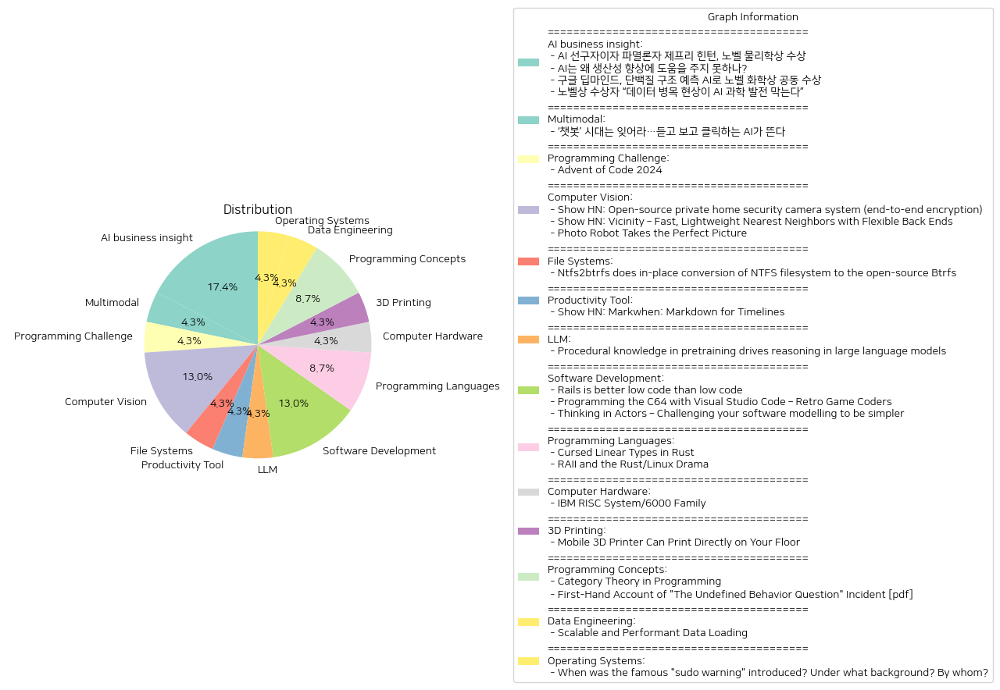

# Daily Artificial Intelligence Insights : News

## 💙 AI business insight

**요약:**

1. **주요 테마**:
   - 인공지능(AI)의 발전과 그에 따른 사회적, 과학적 기여.
   - AI 기술이 과학 분야에서 노벨상을 수상하며 중요한 연구 도구로 부상.
   - 생산성 향상 및 데이터의 중요성과 관련된 AI의 한계와 개선 필요성.

2. **주요 사건 요약**:
   - 제프리 힌턴, 현대 AI 기술의 기초를 개발한 공로로 노벨 물리학상을 공동 수상.
   - AI 관련한 힌턴 교수와 존 홉필드 교수의 수상이 주목됨.
   - 구글 딥마인드, AI를 통해 단백질 구조 예측 문제를 해결하여 노벨 화학상을 공동 수상.
   - AI 발전을 위한 고품질 데이터의 필요성에 대한 언급과 데이터 병목 현상이 AI 발전을 제한하는 요소로 지적됨.

3. **영향 분석**:
   - **경제**: AI가 생산성 향상에 기여하지 못한다는 점에서 기술적 개선과 추가적인 연구가 필요하며, 이는 경제 발전에도 중요한 영향을 미칠 것.
   - **과학**: AI 기술이 노벨상 수상으로 검증되면서 과학적 연구와 발견의 새로운 도구로 자리매김.
   - **사회**: AI 분야의 혁신이 증가하면서 인공지능에 대한 교육 및 윤리적 문제에 대한 관심 필요.

4. **최종 요약**:
   AI 기술이 다양한 분야에서 상당한 진전을 이루며 과학의 중요한 도구로 자리잡고 있다는 것이 확인됐다. 그러나 AI가 실제로 생산성 향상을 위해 더 많은 개선이 필요하며 고품질 데이터의 확보가 중요하다는 점이 강조되었다. 앞으로 AI의 발전과 활용에 따른 경제 효과를 주의 깊게 살펴볼 필요가 있다. AI의 사회적 기여 및 관련 도전과제가 계속해서 논의될 것으로 보이며, 특히 데이터 관리 및 윤리적 문제에 대한 주의가 필요하다.

**출처:**

 - AI 선구자이자 파멸론자 제프리 힌턴, 노벨 물리학상 수상 (https://www.technologyreview.kr/ai-%ec%84%a0%ea%b5%ac%ec%9e%90%ec%9d%b4%ec%9e%90-%ed%8c%8c%eb%a9%b8%eb%a1%a0%ec%9e%90-%ec%a0%9c%ed%94%84%eb%a6%ac-%ed%9e%8c%ed%84%b4-%eb%85%b8%eb%b2%a8-%eb%ac%bc%eb%a6%ac%ed%95%99%ec%83%81-%ec%88%98/)
 - AI는 왜 생산성 향상에 도움을 주지 못하나? (https://www.technologyreview.kr/ai%eb%8a%94-%ec%99%9c-%ec%83%9d%ec%82%b0%ec%84%b1-%ed%96%a5%ec%83%81%ec%97%90-%eb%8f%84%ec%9b%80%ec%9d%84-%ec%a3%bc%ec%a7%80-%eb%aa%bb%ed%95%98%eb%82%98/)
 - 구글 딥마인드, 단백질 구조 예측 AI로 노벨 화학상 공동 수상 (https://www.technologyreview.kr/%ea%b5%ac%ea%b8%80-%eb%94%a5%eb%a7%88%ec%9d%b8%eb%93%9c-%eb%8b%a8%eb%b0%b1%ec%a7%88-%ea%b5%ac%ec%a1%b0-%ec%98%88%ec%b8%a1-ai%eb%a1%9c-%eb%85%b8%eb%b2%a8-%ed%99%94%ed%95%99%ec%83%81-%ea%b3%b5%eb%8f%99/)
 - 노벨상 수상자 “데이터 병목 현상이 AI 과학 발전 막는다” (https://www.technologyreview.kr/%eb%85%b8%eb%b2%a8%ec%83%81-%ec%88%98%ec%83%81%ec%9e%90-%eb%8d%b0%ec%9d%b4%ed%84%b0-%eb%b3%91%eb%aa%a9-%ed%98%84%ec%83%81%ec%9d%b4-ai-%ea%b3%bc%ed%95%99-%eb%b0%9c%ec%a0%84-%eb%a7%89%eb%8a%94/)

## ⭐ Multimodal

**요약:**

1. **주요 테마**:
   - AI 기술의 진화: 이전의 텍스트 기반 챗봇 시대를 넘어 음성과 영상을 생성할 수 있는 AI 기술이 주목받고 있습니다.
   - 기술 발전과 혁신: AI 분야에서 새로운 기술이 도입되며, 보다 직관적이고 다양한 방식의 상호작용이 가능해지고 있습니다.

2. **주요 사건**:
   - 텍스트 기반 AI 챗봇의 하락: 텍스트만을 활용한 전통적인 AI 챗봇은 이제 뒤로하고 새로운 형태의 AI가 등장하고 있습니다. 이러한 AI는 더 발전된 음성과 영상 생성 기능을 통해 사용자 경험을 크게 향상시킬 것으로 예상됩니다.

3. **영향 분석**:
   - 경제적 영향: AI 기술의 진화는 다양한 산업에서 자동화를 가속화하고, 새로운 제품과 서비스의 개발을 촉진할 수 있습니다. 이는 기업의 효율성을 높이고 생산성을 증가시킬 가능성이 있습니다.
   - 사회적 영향: 사람과 기계 간의 상호작용이 한층 자연스러워지며, 사회 전반에 걸쳐 AI 기술에 대한 접근성과 수용이 확대될 것입니다. 이는 새로운 직업 창출과 함께 기술 격차에 대한 논의를 불러일으킬 수 있습니다.

4. **최종 요약**:
   - AI 기술이 점점 더 발전하고 있으며, 특히 음성과 영상 처리 기능의 향상은 미래의 디지털 상호작용에 큰 변화를 가져올 것입니다. 이러한 기술 발달에 따라 경제에서는 생산성이 증가하고, 사회에서는 새로운 형태의 일과 인간-기계 관계가 형성될 가능성이 큽니다. 앞으로의 추세로는 이러한 AI 기능들이 더 많은 부분에서 도입됨에 따라 개인화된 경험 제공과 데이터 민감성 관리가 중요한 과제로 부상할 것입니다.

**출처:**

 - ‘챗봇’ 시대는 잊어라…듣고 보고 클릭하는 AI가 뜬다 (https://www.technologyreview.kr/%ec%b1%97%eb%b4%87-%ec%8b%9c%eb%8c%80%eb%8a%94-%ec%9e%8a%ec%96%b4%eb%9d%bc-%eb%93%a3%ea%b3%a0-%eb%b3%b4%ea%b3%a0-%ed%81%b4%eb%a6%ad%ed%95%98%eb%8a%94-ai%ea%b0%80-%eb%9c%ac%eb%8b%a4/)

## 🥳 Programming Challenge

**요약:**

**종합 요약 보고서**

1. **주요 테마**:
   - 이번 뉴스 기사의 주요 주제 중 하나는 사람들이 프로그래밍 기술을 향상시키고 도전할 수 있는 기회인 'Advent of Code' 이벤트입니다. 이 행사는 참가자들이 매일 새로운 프로그래밍 퍼즐을 해결하면서 창의적 사고를 촉진하고 기술을 향상시킬 수 있는 플랫폼을 제공합니다.
   - 아울러, 무료로 사용할 수 있으나 내용을 무단 복제하거나 재배포하는 것은 금지되어 있다는 점도 강조됩니다.

2. **주요 사건**:
   - 이벤트의 창시자인 Eric Wastl는 다양한 기술 수준에 맞춘 프로그래밍 퍼즐로 구성된 'Advent of Code'를 만들어, 개인이 자신의 기술 수준에 맞는 퍼즐을 선택하여 참여할 수 있도록 하였습니다.

3. **영향 분석**:
   - **사회**: 'Advent of Code'는 개발자 커뮤니티를 활성화하고 서로 협력하는 환경을 촉진하여 사회적 기술 및 연결성을 향상시킵니다. 특히, 학습과 경력을 발전시키려는 학생이나 프로그래머들이 유용한 경험을 쌓을 수 있는 기회가 됩니다.
   - **교육**: 프로그래밍 교육 및 학습 동기를 강화시키며, 교육기관과 학습자가 이를 활용하여 교육 효과를 극대화할 수 있는 사례로 쓰일 수 있습니다.
   - **기술 혁신**: 지속적으로 개인이 기술을 향상시키도록 자극하여, 장기적으로 프로그래밍 및 기술 혁신에 기여할 가능성이 있습니다.

4. **최종 요약**:
   - 'Advent of Code'는 프로그래밍 퍼즐을 통해 개인의 창의성을 북돋고, 프로그래밍 커뮤니티와 교육 부문에 긍정적인 영향을 미치는 중요한 행사로 자리 잡았습니다. 이러한 행사들은 단순한 퍼즐 풀이를 넘어, 적극적인 문제 해결사로서의 개발자 육성에 기여할 수 있습니다.
   - 앞으로의 발전 방향으로는 이벤트의 지속적인 확장과 다양한 커뮤니티와의 협력 강화가 기대됩니다. 특히 기술 발전과 함께 이와 같은 이벤트들이 향후 새로운 교육 방식이나 기술 혁신의 촉매제가 될 가능성이 있습니다.

**출처:**

 - Advent of Code 2024 (https://adventofcode.com/2024/about)

## 🌞 Computer Vision

**요약:**

**주요 테마**:
세 가지 뉴스 기사에서 공통적으로 나타나는 주제는 기술 혁신과 보안, 사용 편의성 및 실용성입니다. 각 기술 솔루션은 특정 문제를 해결하거나 사용자 경험을 향상시키고 있음을 알 수 있습니다. 또한, 프라이버시 보호와 사용자 요구에 맞춘 맞춤화 가능성 또한 중요한 테마로 드러납니다.

**주요 사건**:
1. *Privastead*는 사설 홈 보안 카메라 시스템을 소개하며, 종단 간 암호화를 통해 사용자의 사생활을 보호합니다. 이 솔루션은 서버와 IP 카메라가 신뢰할 수 없다고 가정하면서도 안전한 로컬 머신과 스마트폰을 기반으로 합니다.

2. *Vicinity*는 다양한 백엔드를 위한 통합 인터페이스를 제공하는 경량 벡터 저장소로, 최근의 근접 이웃 검색 문제를 해결합니다. 사용자에게 다양한 인덱싱 방법과 거리 메트릭의 실험 및 평가를 간소화합니다.

3. *PhotoBot*은 사용자 설명 및 참조 이미지를 기반으로 사진을 찍는 로봇으로, 대형 언어 모델 및 컴퓨터 비전을 활용하여 로봇 팔의 위치를 조정하고 미적 감각을 갖춘 사진을 촬영합니다.

**영향 분석**:
- *Privastead*의 경우 사생활 보호 기술에 대한 사람들의 요구가 증가하면서 홈 보안 시장에서 프라이버시 이슈에 대한 새로운 표준을 설정할 수 있습니다. 이는 사용자 및 보안 기술 업계에서 보다 강화된 암호화 및 데이터 보호에 대한 인식을 높일 것입니다.
- *Vicinity*는 데이터베이스 관리 및 AI 개발에서의 효율성을 증대시키며, 연구 및 기업에서의 배포 가능성을 높입니다. 이는 비용 효율성과 개발 시간 단축에 긍정적인 영향을 미칠 것으로 보입니다.
- *PhotoBot*은 사진 촬영의 자동화와 인공지능의 창의적 활용을 제고시킵니다. 이는 사진 및 미디어 산업에서 새로운 서비스 및 제품 개발에 영향을 줄 수 있으며, 개인 사용자에게는 새로운 경험을 제공할 수 있습니다.

**최종 요약**:
이 세 개의 기술은 각기 다른 분야에서 혁신을 이루고 있으며, 사용자 경험 개선, 데이터 보호 강화 및 AI 활용 등의 주제를 중심으로 발전하고 있습니다. 이러한 기술의 발전은 향후 IoT, AI 응용 프로그램 및 사생활 보호에 대한 중요성이 더욱 커질 것을 시사합니다. 각 시장에서의 기술 도입과 발전을 지속적으로 주시할 필요가 있으며, 특히 보안과 사용자 경험 향상에 관한 새로운 지평을 여는 잠재성을 가지고 있습니다. 이러한 혁신은 지속 가능한 기술 발전과 관련 산업의 성장에 중요한 밑거름이 될 것입니다.

**출처:**

 - Show HN: Open-source private home security camera system (end-to-end encryption) (https://github.com/privastead/privastead)
 - Show HN: Vicinity – Fast, Lightweight Nearest Neighbors with Flexible Back Ends (https://github.com/MinishLab/vicinity)
 - Photo Robot Takes the Perfect Picture (https://spectrum.ieee.org/photo-robot)

## ❄️ File Systems

**요약:**

**1. 주요 테마:**
   - 오픈 소스 파일 시스템 변환
   - NTFS에서 Btrfs로의 데이터 전환
   - 데이터 압축 필요성 및 활용

**2. 주요 사건:**
   - Ntfs2btrfs는 NTFS 파일 시스템을 Btrfs로 직접 변환하는 도구입니다.
   - 원본 이미지를 리플링크 복사본으로 저장하여 변환 과정에서 데이터를 손실하지 않습니다.
   - 이 도구는 부팅 드라이브나 활성 상태의 페이지 파일이 있는 드라이브에서는 작동하지 않으며, 데이터 압축을 위해 zlib, lzo, zstd와 같은 압축 라이브러리를 요구합니다.

**3. 영향 분석:**
   - **기술 및 IT 분야**: NTFS에서 Btrfs로의 변환은 기업과 개인 사용자에게 파일 시스템의 효율성을 증가시키고 데이터 관리의 유연성을 제공할 수 있습니다. 오픈 소스 파일 시스템의 활용은 사용자들에게 비용 절감 및 커스터마이징 가능성을 제공합니다.
   - **경제**: 파일 시스템 변환 기술의 개발은 디지털 인프라의 효율성을 높이고 저장 비용을 절감하여 기업의 IT 비용 구조에 긍정적인 영향을 줄 수 있습니다.
   - **사회**: 기술적인 지식이 있는 사용자들은 데이터 보존 방법에 대한 새로운 선택지를 가질 수 있으며, 이는 정보와 데이터의 민주화를 촉진할 수 있습니다.

**4. 최종 요약:**
   - 최근 Ntfs2btrfs의 등장으로, NTFS에서 Btrfs로 데이터를 변환할 수 있는 새로운 도구가 제공되었습니다. 이는 기업과 IT 전문가들에게 데이터 관리의 새로운 가능성을 열어줄 것으로 보입니다. 이 도구는 압축 기술을 활용하여 데이터 보존의 효율성을 높이며, 오픈 소스 솔루션의 장점을 살리고자 합니다. 앞으로 이와 같은 파일 시스템 변환 및 관리 기술의 발전을 주시하며, 관련된 오픈 소스 커뮤니티의 동향 역시 중요한 모니터링 대상으로 삼아야 할 것입니다.

**출처:**

 - Ntfs2btrfs does in-place conversion of NTFS filesystem to the open-source Btrfs (https://github.com/maharmstone/ntfs2btrfs)

## 💙 Productivity Tool

**요약:**

1. **주요 주제**:
   - 타임라인을 위한 마크다운 언어 소개
   - 다양한 날짜 형식 및 지속 시간 관리
   - 기술 발전과 생산성 도구 개선

2. **주요 사건**:
   - 'Show HN: Markwhen'이라는 새로운 마크다운 언어 출시
   - 2025년 1월부터 12월까지의 다양한 이벤트 데이터 제공

3. **영향 분석**:
   - **IT 및 기술 분야**: 새로운 마크다운 언어 소개는 타임라인 생성 및 관리에서 사용자 경험을 개선하고 더 많은 사람들이 손쉽게 사용할 수 있도록 함.
   - **생산성 및 효율성**: 타임라인 데이터 관리를 간소화하여 프로젝트 관리, 일정 계획 등의 분야에서 생산성을 높일 수 있음.
   - **교육 및 학습**: 쉽고 직관적인 방법으로 정보를 시각화할 수 있어 교육 자료 및 학습 도구로 사용 가능성 존재.

4. **최종 요약**:
   - Markwhen의 출시는 타임라인 생성과 관련된 새로운 가능성을 열어주며 사용자 친화적인 접근 방식을 제공함. 이러한 도구의 개발은 향후 프로젝트 관리 소프트웨어 시장에서의 혁신적인 변화를 가져올 수 있으며, 더 많은 산업과 분야에서 데이터 시각화와 관련된 새로운 응용 프로그램이 등장할 가능성이 높음. Markwhen의 발전과 이에 대한 사용자 반응이 향후 기술 개발의 중요한 지표로 작용할 수 있음.

**출처:**

 - Show HN: Markwhen: Markdown for Timelines (https://markwhen.com)

## ✈️ LLM

**요약:**

1. **주요 주제**:
   - 대형 언어 모델(LLM)의 문제 해결 능력과 추론 능력의 개발
   - 문서에서의 절차적 지식의 활용 및 일반화된 전략의 개발

2. **주요 사건**:
   - 대형 언어 모델이 일반적인 문제 해결 능력을 보이지만 인간에 비해 추론 능력이 부족함이 밝혀짐.
   - 대형 언어 모델이 정보를 검색하는 대신 문서에서 얻은 절차적 지식을 사용하여 추론함.

3. **영향 분석**:
   - **경제**: 대형 언어 모델의 발전은 자연어 처리 분야에서 새로운 기술 혁신을 촉진해 관련 기업 및 산업에 긍정적인 영향을 미칠 수 있음.
   - **정치**: AI의 활용이 정책 결정에 미치는 영향 증가 가능성, 정보 해석 및 분석의 효율성 향상
   - **사회**: 대형 언어 모델의 활용 확대로 인해 교육, 법률, 의료 등 다양한 분야에서의 업무 효율성이 증가할 수 있음.
   - **기술**: AI 기술 발전의 가속화로 언어 모델의 활용 범위 확대 및 다양한 애플리케이션에서의 신뢰성 향상

4. **최종 요약**:
   대형 언어 모델은 절차적 지식을 활용하여 문제 해결과 추론 능력을 향상시키며, 이는 AI 기술의 발전과 적용 가능성을 확대시키고 있다. 그러나 인간 수준의 추론 능력 확보에는 여전히 한계가 존재하여 지속적인 연구와 발전이 필요하다. 향후 AI의 발전은 다양한 산업 분야에 긍정적인 영향을 미칠 가능성이 크고, 이를 통해 사회 전반에 걸쳐 효율성과 혁신을 촉진할 수 있을 것으로 기대된다. AI 기술의 신뢰성 및 윤리적 사용에 대한 논의와 규제가 중요해질 전망이다.

**출처:**

 - Procedural knowledge in pretraining drives reasoning in large language models (https://arxiv.org/abs/2411.12580)

## 🎈 Software Development

**요약:**

1. **주요 테마**:
   여러 기사에서 공통적으로 드러나는 주요 테마는 다음과 같습니다. 첫째, 기술 및 소프트웨어 개발에 있어 코드 구현 방식에 대한 논의가 있습니다. 'Rails is better low code than low code' 기사에서는 루비 온 레일스를 사용하는 것이 로우 코드 도구를 사용하는 것보다 효율적이라는 점을 논하고 있습니다. 둘째, 레트로 게임 코딩과 관련된 프로그래밍 환경에 대한 선호도가 나타났으며, 'Programming the C64 with Visual Studio Code' 기사에서는 새로운 도구(VS64 extension)를 통해 C64 프로그래밍을 쉽게 수행할 수 있음을 강조하고 있습니다. 셋째, 소프트웨어 모델링에 있어 배우자 모델(Actor Model)이라는 새로운 접근 방식을 소개하고 있는 'Thinking in Actors' 기사가 있습니다.

2. **주요 사건**:
   - 'Rails is better low code than low code': 루비 온 레일스를 사용하여 예약 관리 앱을 제작한 사례로서, 빠르고 효율적으로 작업을 완료했으나, 사용자 정의 기능 추가 시 일부 문제점이 발생한 것을 보였습니다.
   - 'Programming the C64 with Visual Studio Code – Retro Game Coders': VS64 확장 프로그램이 비주얼 스튜디오 코드에서 Commodore 64를 위한 프로그래밍에 활용되며, 다양한 운영체제에서 유용하다는 점을 소개하고 있습니다.
   - 'Thinking in Actors': 배우자 모델에 대한 관심이 높아지며, 소프트웨어 모델링을 단순화하는 방법으로서의 가능성을 탐색하는 내용이 담겼습니다.

3. **영향 분석**:
   - 경제: 소프트웨어 개발 방식의 선택이 업무 효율성에 직접적인 영향을 미칠 수 있습니다. 이는 기업이보다 빠르게 시장에 제품을 출시할 수 있는 능력과 연결됩니다. 
   - 사회: 새로운 프로그래밍 도구와 방법론의 등장은 개발자 커뮤니티 내에서의 기술 교류와 학습을 촉진하는 역할을 합니다. 특히, 레트로 게임 코딩과 관련된 흥미는 특정 커뮤니티 내에서 부흥을 가져올 수 있습니다.
   - 기술: 배우자 모델과 같은 새로운 소프트웨어 모델링 접근 방식은 장차 소프트웨어 개발의 패러다임에 변화를 줄 수 있는 가능성을 내포하고 있습니다.

4. **최종 요약**:
   이 기사들을 종합하면, 소프트웨어 개발 및 프로그래밍 커뮤니티에서 나타나는 다채로운 변화 및 발전을 알 수 있습니다. 로우 코드 도구에 비해 전통적인 개발 환경의 효율성이 다시금 조명받고 있는 한편, 새로운 프로그래밍 도구(VS64)와 접근 방식(Actor Model)이 미래에 개발자들에게 더 나은 방법론으로 자리잡을 가능성도 엿보입니다. 이러한 변화를 통해 향후 소프트웨어 개발이 보다 효율적이면서도 창의적인 방향으로 나아갈 것임을 예상하게 됩니다. 앞으로의 발전 상황을 주의 깊게 살펴보는 것이 중요합니다.

**출처:**

 - Rails is better low code than low code (https://radanskoric.com/articles/rails-is-better-low-code-than-low-code)
 - Programming the C64 with Visual Studio Code – Retro Game Coders (https://retrogamecoders.com/c64-visual-studio-code/)
 - Thinking in Actors – Challenging your software modelling to be simpler (https://jeremycarterau.substack.com/p/thinking-in-actors-part-1)

## 🎠 Programming Languages

**요약:**

**주요 주제**:

두 기사 모두 프로그래밍 언어 Rust와 그 활용 방안을 중심으로 한 논의를 담고 있습니다. 첫 번째 기사는 Rust의 특수한 코드 구현 방식에 대한 제약과 부작용을 다루고 있으며, 두 번째 기사는 Rust와 Linux 커널 개발자 간의 갈등을 조명하고 있습니다.

**주요 사건**:

1. 'Cursed Linear Types in Rust':
   - Rust 언어에서 UseOnce라는 구조체를 구현하려는 시도가 있었으나, 이를 정확히 한 번만 쓸 수 있게 하는 것에 한계가 있다는 사실이 드러남.
   - 컴파일러의 명시적 코딩 또는 트릭을 통해 이러한 제약을 우회할 수 있음.
   - 컴파일러의 비정상적인 동작 및 차용 검사기(borrow checker)와 최적화 문제로 인해 문제 발생.

2. 'RAII and the Rust/Linux Drama':
   - Rust 개발자들이 Linux 커널에 더 많은 Rust 언어 활용을 추진하고 있으나, C 개발자들로부터 기술적 작업과 코드 스타일에 대한 반발 직면.
   - 이번 논쟁의 중심은 메모리 안전성을 확보하기 위한 Rust의 기능인 RAII(RAII)를 두고 Linux 커널에 적합하지 않다는 주장이 있음.

**영향 분석**:

- 경제적 측면: Rust 언어의 인기가 높아지고 있으며, 더 많은 개발자들이 Rust를 배울 가능성이 있어 개발자들의 교육 및 채용 시장 변화 가능성.
- 정치적 및 사회적 측면: Rust와 C 언어 개발자 간의 갈등은 오픈 소스 커뮤니티 내 권력 구조와 리더십 변화의 요인으로 작용할 수 있음.
- 기술적 측면: Rust의 안전성 기능이 커널과 같은 핵심 시스템에도 확대될 경우 전반적인 소프트웨어 안정성 증가 가능.

**최종 요약**:

Rust 언어는 강력한 메모리 안전성 기능을 제공하지만, 그 구현 방식에는 아직 해결해야 할 문제들이 존재합니다. 특히, 컴파일러의 행동 및 최적화 측면에서 예상치 못한 문제가 발생할 수 있습니다. 한편, Linux 커널 내 Rust의 활용을 두고 발생한 논쟁은 기술 커뮤니티 내에서 코드 품질과 스타일에 대한 새로운 토론을 촉발할 가능성이 있습니다. 미래에는 Rust의 기술적 장점을 보다 다양한 플랫폼에서 활용하기 위한 노력이 지속될 것이며 이에 따라 소프트웨어 안정성 및 보안성에서 긍정적인 영향이 기대됩니다. 그러나 동시에, 이러한 변화가 개발자 커뮤니티 내 갈등을 심화시킬 수 있는 여지도 있으므로 지속적인 관찰이 필요합니다.

**출처:**

 - Cursed Linear Types in Rust (https://geo-ant.github.io/blog/2024/rust-linear-types-use-once/)
 - RAII and the Rust/Linux Drama (https://kristoff.it/blog/raii-rust-linux/)

## 🚀 Computer Hardware

**요약:**

**1. 주요 주제:**
   - 뉴스 기사에서 반복적으로 등장하는 주요 주제는 IT 기술 발전, RISC 아키텍처, 프로세서 진화, 하드웨어 시장 변화 등입니다. IBM의 RISC System/6000 라인은 이러한 주제들이 결집된 결과물로 볼 수 있습니다.

**2. 주요 이벤트:**
   - 1990년에 IBM은 RISC System/6000 제품군을 POWER 및 PowerPC 프로세서와 함께 출시했습니다. 이 제품군은 서버, 워크스테이션, 슈퍼컴퓨터 등으로 구성되었으며, 그 후 eServer pSeries로 대체된 후 2002년에 단종되었습니다.

**3. 영향 분석:**
   - 경제: RISC System/6000의 출시는 당시 하드웨어 및 컴퓨팅 서버 시장에 혁신적인 영향을 끼쳤습니다. 이는 이후 IT 산업 전반에 걸쳐 프로세서 기술 발전을 촉진했습니다.
   - 사회: 고성능 컴퓨팅의 도입으로 인해 데이터 처리와 분석이 증가했으며, 이는 기업과 연구기관에서의 생산성을 향상시켰습니다. IBM의 기술 발전은 많은 산업에서 기술적인 도약을 가능케 했으며, 과학 연구 및 기타 고성능 계산이 필요한 분야에 큰 영향을 미쳤습니다.

**4. 최종 요약:**
   - IBM의 RISC System/6000 제품군은 1990년대 초반 IT 산업의 획기적인 변화를 이끌었던 제품군으로 평가됩니다. 이 혁신적인 시도는 해당 기술의 확장과 발전을 견인했으며, IT 하드웨어와 소프트웨어 개발에 있어 기념비적인 역할을 했습니다. 미래에는 CPU 아키텍처 및 컴퓨팅 기술의 지속적인 성장이 예상되며, 향후 등장할 기술 혁신이 기존 하드웨어 환경 및 새로운 응용 프로그램에 어떤 영향을 미칠지 주목할 필요가 있습니다.

**출처:**

 - IBM RISC System/6000 Family (https://computeradsfromthepast.substack.com/p/ibm-risc-system6000-family)

## 🍋 3D Printing

**요약:**

1. **주요 주제**:
   - 로봇 기술과 3D 프린팅의 융합
   - 현실 환경에서의 직접 출력 기술 발전
   - 혁신적 기술의 실용적 응용 가능성

2. **주요 사건**:
   - MobiPrint라는 이름의 3D 프린팅 로봇이 등장했습니다. 이 로봇은 공간을 스캔하여 설계를 바닥에 직접 인쇄할 수 있는 능력을 가지고 있습니다. 이는 로봇 기술과 3D 프린팅을 결합하여 현실 세계에서 물체를 출력할 수 있게 해주는 것입니다.

3. **영향 분석**:
   - **경제 분야**: MobiPrint 기술은 건축, 인테리어 디자인 및 제조 산업에 새로운 가능성을 열어 주며, 생산성 증가와 비용 절감을 통해 경제적 이점을 가져올 수 있습니다.
   - **사회 분야**: 기술 발전을 통해 다양한 창작 활동이 가능해짐으로써 교육 및 예술 분야에서의 활용 또한 기대됩니다.
   - **환경 분야**: 현장에서의 직접 제작을 통해 물자 낭비를 줄이고, 긴 운송 과정을 생략함으로써 탄소 발자국을 줄일 수 있습니다.

4. **최종 요약**:
   MobiPrint를 중심으로 3D 프린팅과 로봇 기술의 융합이 현실 세계에서의 활용성을 극대화하고 있습니다. 이는 여러 산업 분야에서 생산성을 높이고 비용을 절감하며, 사회적으로 창의적 활동의 폭을 넓히는 기회를 제공합니다. 또한 환경적 측면에서도 긍정적인 영향을 미칠 것으로 보입니다. 앞으로 이러한 기술이 어떻게 발전하고 또 다른 혁신적인 응용 사례가 등장할지 주목할 필요가 있습니다.

**출처:**

 - Mobile 3D Printer Can Print Directly on Your Floor (https://spectrum.ieee.org/mobile-3d-printer)

## 🎉 Programming Concepts

**요약:**

1. **주요 주제**:
   - 기사 전반에 걸쳐 공통적으로 나타나는 주요 주제는 프로그래밍과 관련된 이론적 접근과 표준 규격 논쟁입니다. 특히, 카테고리 이론의 프로그래밍 적용과 C++ 표준 위원회 내부의 불협화음에 관련된 사건이 눈에 띕니다.

2. **주요 사건**:
   - 첫 번째 기사는 프로그래밍에서 카테고리 이론을 적용하여 새로운 사고 방법과 문제 해결 능력을 제공하려는 교육적 시도를 다루고 있습니다.
   - 두 번째 기사는 'The Undefined Behavior Question'이라는 논문과 관련된 논쟁으로 인해 한 개발자가 C++ 표준 위원회에서 축출된 사건을 다루고 있습니다. 이는 표준 위원회 내 상반된 의견에 따른 불협화음을 드러내고 있습니다.

3. **영향 분석**:
   - **경제**: 직접적인 경제적 영향은 크지 않으나, 프로그래밍 커뮤니티의 지식 확장 및 효율적인 코드 작성 등 장기적으로 개발자 역량 강화에 기여하고, 새로운 이론의 적용으로 인한 기술 발전이 가능할 것입니다.
   - **정치**: 두 번째 기사의 경우, 표준 위원회와 같은 기술적 커뮤니티 내의 논쟁과 의사결정 방식에 대한 논의가 이뤄질 가능성이 있습니다.
   - **사회**: 프로그래밍 이론의 확장과 표준 규격 논쟁은 개발자 커뮤니티 내 학습 및 협업 방법에 영향을 줄 가능성이 있습니다. 특히, 표준화 리뷰 프로세스에 대한 투명성 요구와 전문성 강화를 촉구하는 목소리가 높아질 수 있습니다.

4. **최종 요약**:
   - 두 기사 모두 최신 프로그래밍 트렌드와 표준화 과정에서의 갈등을 조명하고 있으며, 이는 개발자 커뮤니티 내에서의 지식 공유와 협력의 중요성을 환기시키고 있습니다. 카테고리 이론의 프로그래밍 도입은 사고를 확장시키며, 표준 위원회 내에서의 논쟁은 보다 체계적이고 투명한 절차와 의사결정을 요구하는 목소리를 높일 것입니다. 향후 발전 사항으로는 새로운 이론의 응용 문제와 표준화 프로세스의 개선 움직임을 주목해야 할 것입니다.

**출처:**

 - Category Theory in Programming (https://docs.racket-lang.org/ctp/index.html)
 - First-Hand Account of "The Undefined Behavior Question" Incident [pdf] (http://tomazos.com/ub_question_incident.pdf)

## 🐱 Data Engineering

**요약:**

**요약 보고서**

1. **주요 테마**:
   - 데이터 로딩 및 성능 개선: 관련 기사에서는 효율적이고 확장 가능한 데이터 로딩 중요성을 다루며, 기술적 오류 해결에 관한 내용을 다루려는 시도를 볼 수 있습니다.

2. **주요 사건**:
   - 'Scalable and Performant Data Loading'라는 제목의 기사는 기술적 문제로 인한 데이터 로딩 장애를 언급했으며, 문제를 신속히 해결하려는 노력을 암시합니다.

3. **영향 분석**:
   - 경제적 영향: 데이터 로딩과 관련된 기술적 문제가 해결되지 않을 경우, 관련 산업에서는 생산성 저하와 비용 증가 등의 경제적 손실이 발생할 수 있습니다.
   - 사회적 영향: 데이터 기반 서비스의 장애는 사용자 경험에 부정적인 영향을 미칠 수 있으며, 데이터 의존도가 높은 사회에서는 큰 불편을 초래할 수 있습니다.

4. **최종 요약**:
   - 데이터 로딩과 관련된 기술적 문제는 산업 전반에 걸쳐 영향을 미칠 수 있으며, 신속한 해결이 필요합니다. 이러한 문제의 근본 원인을 규명하고, 향후 비슷한 문제를 방지할 수 있는 시스템적 개선이 필요할 것입니다. 앞으로도 기술적 성과 및 안정성 향상을 위해 어떤 발전이 있을지 주목할 필요가 있습니다.

**출처:**

 - Scalable and Performant Data Loading (https://ai.meta.com/blog/spdl-faster-ai-model-training-with-thread-based-data-loading-reality-labs/?_fb_noscript=1)

## 🪐 Operating Systems

**요약:**

1. **주요 테마**:
   주어진 기사에서 다루고 있는 주요 테마는 Unix와 같은 운영 체제에서 사용되는 'sudo'라는 명령어와 관련된 이야기입니다. 특히 "sudo warning"이라는 경고 메시지가 어떻게, 어떤 배경에서, 누구에 의해 도입되었는지를 중심으로 전개됩니다. 이는 시스템 보안 및 관리자 권한 관리와 관련된 주제로 이어집니다.

2. **주요 이벤트**:
   기사에서는 최초로 사용자에 의해 'sudo' 명령어가 실행될 때 발생하는 경고 메시지의 역사적 배경과 도입 과정을 설명합니다. UNIX 계열 운영 체제에서 표준 패키지로 제공되는 이 'sudo warning'은 사용자가 시스템 관리자에게서 받은 강의에 대한 신뢰를 강조하며 주요하게 설명됩니다.

3. **영향 분석**:
   'sudo warning'과 같은 경고 시스템은 IT 및 보안 분야에서 사용자 행위와 권한 관리에 직접적인 영향을 미칩니다. 이러한 시스템은 사용자에게 관리자 권한 사용의 중요성과 책임감을 상기시키는 역할을 하며, 시스템 보안 관점에서 중요한 점으로 작용합니다. 이는 특히 시스템 무결성 보장과 관련된 사회적 신뢰 구축에 기여할 수 있습니다.

4. **최종 요약**:
   이번 기사를 통해 'sudo warning'의 도입 배경과 그 중요성을 이해할 수 있었습니다. 향후 시스템 보안과 관련하여 이러한 경고 체계의 발전과 변화가 주목될 수 있으며, 다양한 운영 체제에서 권한 관리와 사용자 교육 부분에서의 지속적인 개선이 예상됩니다. 이는 보안 업계와 사용자 간의 신뢰 구축에 기여할 가능성이 높습니다. 앞으로의 발전 상황을 계속해서 주의 깊게 살펴볼 필요가 있습니다.

**출처:**

 - When was the famous "sudo warning" introduced? Under what background? By whom? (https://retrocomputing.stackexchange.com/questions/12521/when-was-the-famous-sudo-warning-introduced-under-what-background-by-whom)

