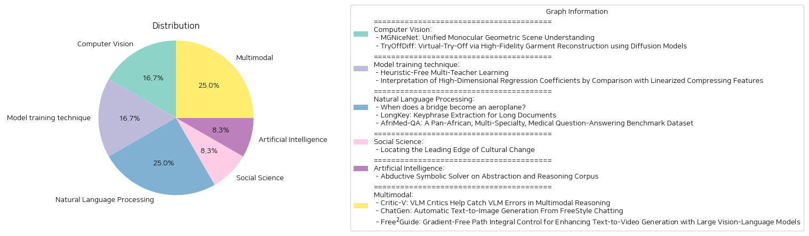

# Daily Artificial Intelligence Insights : Papers

## ❄️ Computer Vision

**요약:**

**요약 보고서:**

1. **MGNiceNet: 통합적인 단안기하학적 장면 이해**
   - **주요 주제 및 테마:** 단일 카메라에서의 기하학적 장면 이해, 파노픽 세그멘테이션, 자율주행 차의 실시간 응용에서 자가 지도 학습을 통한 깊이 추정.
   - **주요 사건 및 정보 요약:** MGNiceNet은 RT-K-Net 기반의 최첨단 실시간 파노픽 세그멘테이션 기술을 확장하여 파노픽 세그멘테이션과 자가 지도 단안 깊이 추정을 모두 포괄하는 통합 접근 방식을 제안한다. 심도 예측을 위해 파노픽 경로의 정보를 명시적으로 사용하는 자가 지도 학습 깊이 예측기를 도입하며, 비디오 파노픽 세그멘테이션 주석에 의존하지 않으면서 깊이 추정을 개선하는 파노픽 유도 운동 마스킹 방법도 소개하였다.
   - **영향 분석:** 이 방법은 Cityscapes와 KITTI 자율주행 데이터셋에서 테스트되어 다른 실시간 방법에 비해 최첨단 결과를 보여주었으며, 계산적으로 복잡한 방법과의 격차를 줄이는 결과를 나타냈다. 이는 자율주행차의 실시간 장면 이해 및 객체 인식의 정확성을 높이는 데 기여한다.

2. **TryOffDiff: 확산 모델을 이용한 고충실도 의류 재구성**
   - **주요 주제 및 테마:** 가상테입(VTOFF), 의류의 표준화 이미지 생성, 확산 모델을 이용한 고충실도 재구성.
   - **주요 사건 및 정보 요약:** VTOFF는 개인의 사진으로부터 의류를 추출하여 새로운 의류 이미지를 생성하는 새로운 과제를 도입했다. TryOffDiff 모델은 기하학적 형태, 질감, 복잡한 패턴을 정확히 포착하여 고충실도 재구성 작업을 수행함으로써, 기존 포즈 변경이나 가상테입 기술보다는 효율적임을 보였다.
   - **영향 분석:** 이 연구는 전자상거래 응용에서 제품 이미지를 향상시키고, 고충실도 생성 모델 평가를 진전시킬 수 있는 가능성을 입증하였다. 이는 제품 홍보와 온라인 판매에서의 이미지 품질을 개선함으로써 사용자 경험을 더욱 향상시킬 수 있다.

**통합 결론 및 미래 발전 가능성:**
이 보고서는 각각의 새로운 기술들이 어떻게 실시간 객체 인식(자동차)과 전자상거래(의류 산업)와 같은 다양한 분야에 영향을 미칠 수 있는지를 보여준다. MGNiceNet과 TryOffDiff는 둘 다 높은 정확도와 효율성의 향상을 목표로 새로운 방법론을 제시하였으며, 이는 관련 산업의 기술 발전에 기여할 수 있는 잠재성을 가지고 있다. 향후 연구는 이러한 모델들을 산업 현장에 실질적으로 적용하면서 발생할 수 있는 문제점의 해결과 함께, 거의 실시간 처리의 가능성을 탐구할 것으로 예상된다.

**출처:**

 - MGNiceNet: Unified Monocular Geometric Scene Understanding (https://deeplearn.org/arxiv/549352/mgnicenet:-unified-monocular-geometric-scene-understanding)
 - TryOffDiff: Virtual-Try-Off via High-Fidelity Garment Reconstruction using Diffusion Models (http://arxiv.org/abs/2411.18350v1)

## 🐱 Model training technique

**요약:**

보고서 요약:

1. 주요 주제 및 테마 추출:
   - 첫 번째 논문 제목 'Heuristic-Free Multi-Teacher Learning'은 다중 교사 학습에서의 휴리스틱 제거를 다루고 있으며, Teacher2Task라는 새로운 프레임워크를 소개합니다. 
   - 두 번째 논문 제목 'Interpretation of High-Dimensional Regression Coefficients by Comparison with Linearized Compressing Features'은 고차원 회귀 계수 해석을 목표로 하고, 특히 리튬 이온 배터리 수명 예측을 위한 비선형 반응을 다룹니다.

2. 공통 키워드 및 패턴:
   - 두 논문 모두 학습 방법을 개선하기 위한 새로운 방법론을 제시합니다. 
   - 데이터의 변환 및 해석적 접근을 통해 정확도를 높이려는 공통 목표를 가지고 있습니다.
   - 학습과 예측을 위한 다양한 알고리즘 및 수학적 프레임워크의 사용이 강조됩니다.

3. 주요 사건 및 주요 정보 요약:
   - 'Heuristic-Free Multi-Teacher Learning' 논문은 기존의 다중 교사 학습 방식에서 사용되는 휴리스틱 문제를 해결하기 위해, 교사-특정 입력 토큰을 도입하고 훈련 데이터를 N+1 개의 개별 작업으로 변환하는 방법론을 제안합니다.
   - 'Interpretation of High-Dimensional Regression Coefficients' 논문은 고차원 데이터에서의 비선형 반응을 예측하기 위해 선형화된 방법을 개발하고, 이를 회귀 솔루션 경로의 계수와 비교합니다.

4. 이러한 사건들이 다양한 부문에 미치는 영향 분석:
   - 'Heuristic-Free Multi-Teacher Learning'의 프레임워크는 교육 및 머신러닝 분야에서 예측 정확도를 향상시키고 오차 전파를 최소화할 수 있는 가능성을 제시합니다. 이는 다양한 AI 응용 프로그램에서의 효율성을 높일 수 있습니다.
   - 'Interpretation of High-Dimensional Regression Coefficients'의 방법론은 특히 배터리 수명 예측과 같은 고차원 데이터 분석 분야에서 실질적인 응용 가능성을 가지며, 복잡한 데이터 세트에서의 비선형성 처리에서 새로운 통찰력을 제공합니다.

5. 최종 요약 및 결론:
   - 두 논문은 각기 다른 분야에서 학습 및 예측 효율성을 높이기 위한 방법론적 접근을 제시하며, 기술적 도전에 대한 해결책을 연구했습니다.
   - 미래 개발의 가능성으로는, 'Heuristic-Free Multi-Teacher Learning'의 프레임워크 확장이 다양한 의사결정 시스템에 도입될 수 있으며, 'Interpretation of High-Dimensional Regression Coefficients'의 방법론은 보다 복잡한 데이터 세트를 다루는 데 기여할 수 있을 것입니다. 지속적인 연구를 통해 이들 방법론의 실용적 적용 가능성을 더욱 확대하는 것이 중요합니다.

**출처:**

 - Heuristic-Free Multi-Teacher Learning (https://deeplearn.org/arxiv/550099/heuristic-free-multi-teacher-learning)
 - Interpretation of High-Dimensional Regression Coefficients by Comparison with Linearized Compressing Features (https://deeplearn.org/arxiv/550410/interpretation-of-high-dimensional-regression-coefficients-by-comparison-with-linearized-compressing-features)

## ☀️ Natural Language Processing

**요약:**

**종합 요약 보고서**

1. **주요 주제 및 테마 추출:**
   - **다양한 구조체 간의 지식 전이:** "When does a bridge become an aeroplane?" 논문에서는 구조적 건강 모니터링 기술의 발전에도 불구하고 이질적인 구조체 간의 지식 전이가 여전히 도전 과제임을 언급하고 있습니다. 이 논문은 중재 구조체를 통해 정보의 격차를 해소하는 기법을 탐색합니다.
   - **장문 문서의 키프레이즈 추출:** "LongKey: Keyphrase Extraction for Long Documents" 논문에서는 현재 정보 과부하 시대에 자동 키프레이즈 추출 기법의 필요성을 강조하며, 장문 문서에 최적화된 새로운 프레임워크 LongKey를 소개하고 있습니다.
   - **범아프리카 의학 QA 벤치마크 데이터세트:** "AfriMed-QA: A Pan-African, Multi-Specialty, Medical Question-Answering Benchmark Dataset"에서는 아프리카 대륙의 의료 접근성을 향상시키기 위한 대규모 의학 QA 데이터세트인 AfriMed-QA를 소개하며, 다양한 LLM의 성능을 평가합니다.

2. **공통 키워드, 경향 및 패턴 식별:**
   - **지식 전이 및 성능 최적화:** 세 논문 모두 기술을 통해 성능을 최적화하고 정보를 더 효과적으로 전이하려는 공통 목표를 가지고 있습니다.
   - **데이터셋 및 처리 개선:** 각 연구는 서로 다른 분야에서의 데이터셋 및 정보 처리 방법의 한계와 이를 극복하기 위한 새로운 접근 방식을 제안합니다.

3. **주요 사건 및 중요 정보 요약:**
   - **구조적 변형 기법 제안:** 첫 번째 논문은 이질적인 구조체 간의 지식 전이를 위한 중재 구조체의 개발 가능성을 보여줍니다.
   - **장문 문서 처리 혁신:** LongKey는 장문 문서의 키프레이즈 추출에서 기존 방법론보다 높은 성능을 입증하고 있습니다.
   - **의료 QA 성능 평가:** AfriMed-QA는 다양한 LLM의 의료 질문-응답 성능을 평가하며, 특히 아프리카 대륙 내에서의 변동 사항을 지적합니다.

4. **이벤트들이 여러 부문에 미치는 영향 분석:**
   - **구조적 건강 모니터링:** 구조체 간 지식 전이는 다양한 건축 및 공학 프로젝트에서 새로운 가능성을 열 수 있습니다.
   - **정보 처리 및 검색:** 키프레이즈 추출의 발전은 다양한 문서 형식 및 정보 검색 효율성을 향상시킬 수 있습니다.
   - **의료 접근성과 효율성:** AfriMed-QA는 아프리카 대륙의 낮은 의료 접근성을 극복할 수 있는 가능성을 보이며, 의료 교육과 서비스 전달 방식에 영향을 줄 수 있습니다.

**결론 및 미래 발전 방향:**
향후 연구는 구조체 간 변환 기술의 실제 적용 가능성을 더욱 탐구하고, LongKey 같은 키프레이즈 추출 기법을 다양한 자연어 처리 문제에 적용하는 것을 고려해야 합니다. 또한, AfriMed-QA 데이터셋을 통해 아프리카 대륙에서의 의료 AI 응용 발전을 가속화하고, LLM의 공정성과 정확성을 지속적으로 개선하는 것이 중요합니다. 이러한 연구들은 다양한 분야에서 지식 전이와 데이터 처리의 효율성을 크게 증대시킬 것으로 기대됩니다.

**출처:**

 - When does a bridge become an aeroplane? (https://deeplearn.org/arxiv/553087/when-does-a-bridge-become-an-aeroplane?)
 - LongKey: Keyphrase Extraction for Long Documents (http://arxiv.org/abs/2411.17863v1)
 - AfriMed-QA: A Pan-African, Multi-Specialty, Medical Question-Answering Benchmark Dataset (http://arxiv.org/abs/2411.15640v2)

## ✈️ Social Science

**요약:**

1. **주요 주제 및 테마 추출:**
   - 문화 변화의 선두 탐색
   - 텍스트 유사성과 발산 측정
   - 사회적 증거와의 정렬

2. **공통 키워드, 트렌드 및 패턴 식별:**
   - 텍스트적 표현의 다양한 방법론 (주제 모델, 문서 임베딩, 단어 수준 복잡도)
   - 문학, 경제, 소설 영역의 코퍼스 활용
   - 영향력 있는 저자와 젊은 저자의 혁신적 경향성과 그 텍스트적 앞서감

3. **주요 사건 및 핵심 정보 요약:**
   - 텍스트적 유사성과 발산 측정을 통해 문화 변화를 연구하는 방법론적 접근
   - 특정 텍스트 표현 방법론이 사회적 증거와의 정렬에 있어 우월하지 않음
   - 텍스트의 영향력은 연속적인 혁신의 유지보다는 가장 혁신적인 순간에 의존함

4. **이벤트가 다양한 부문에 미치는 영향 분석:**
   - 문화 연구: 텍스트 분석을 통한 문화 변화의 탐색은 문학 연구에 새로운 인사이트를 제공
   - 경제학: 혁신적 사고를 가진 경제학자들이 경제적 담론에 주도적 역할을 하고 있음을 지적
   - 문학: 젊은 작가들의 혁신적 관점이 문학계에 더욱 강조됨

5. **최종 요약 및 향후 주목할 사항:**
   - 이번 연구는 텍스트 분석을 통한 문화 변화의 이해에 기여하며, 텍스트의 특정 혁신적 요소가 최종적인 영향력에 큰 역할을 함을 발견함.
   - 향후 연구는 다양한 텍스트적 표현방법과 사회적 결과 간의 관계를 더욱 명료하게 이해하여, 문화적 변화의 다음 단계를 예측하는 데 기여할 필요가 있다.

**출처:**

 - Locating the Leading Edge of Cultural Change (https://deeplearn.org/arxiv/551310/locating-the-leading-edge-of-cultural-change)

## 🍋 Artificial Intelligence

**요약:**

제목: '추상 및 추론 코퍼스에서의 귀납적 상징적 솔버'

이 논문은 추상 및 추론 코퍼스(ARC) 내에서 인공지능의 추론 능력을 향상시키는 도전을 다루고 있습니다. 앞서 수행된 많은 접근법들은 주로 그리드 전환에만 집중했으나, 이는 AI가 합리적이고 인간과 유사한 해결책을 제공하기에 충분하지 않았습니다. 인간은 시각적 추론 작업을 관찰과 가설을 기반으로 해결하며, 그들은 해결책을 올바른 이유로 설명할 수 있습니다. 따라서 인간의 시각적 추론 작업 해결 프로세스가 귀납적 추론 과정임을 고려하여, 관찰된 데이터를 지식 그래프로 상징적으로 표현하고 해결책 생성에 사용할 핵심 지식을 추출하는 새로운 프레임워크를 제안합니다. 이 정보는 해결책 탐색 공간을 제한하고 논리적인 중간 과정을 제공하는 데 도움을 줍니다. 우리의 접근법은 ARC 작업에 대한 AI의 성능을 개선할 가능성을 가지고 있으며, 효과적으로 해결 공간을 좁히고 핵심 지식 추출에 기반한 논리적인 해결책을 제공할 수 있습니다.

종합적으로, 이 논문은 AI의 시각적 추론 능력을 강화하기 위한 귀납적 추론 방법론의 중요성을 강조합니다. 심볼릭 지식 표현 및 추출을 통한 이 접근법은 AI의 논리적 문제 해결 능력을 향상시킬 중요한 방법으로 주목받고 있습니다. 이는 특히 인간과 유사한 추론 능력 개발에 중점을 두고 있으며, AI의 다양한 분야에서의 적용 가능성을 확대할 잠재력을 지니고 있습니다. 향후 연구에서는 이 모델을 다른 AI 추론 작업에 확장하여 그 효과성을 평가하고 다양한 적용 방안을 모색하는 것이 중요할 것입니다.

**출처:**

 - Abductive Symbolic Solver on Abstraction and Reasoning Corpus (https://deeplearn.org/arxiv/553225/abductive-symbolic-solver-on-abstraction-and-reasoning-corpus)

## 🤩 Multimodal

**요약:**

보고서 요약:

1. 주요 주제 및 주제 추출: 
- 여러 논문에서 다루는 핵심 주제는 멀티모달 추론, 텍스트-이미지 생성, 텍스트-비디오 생성 등입니다. 각 논문은 주로 비전-언어 모델(VLM)의 개선과 새로운 방법론을 제안하여 복잡한 추론 작업을 지원하는 것을 목표로 하고 있습니다.

2. 공통 키워드, 트렌드, 패턴 식별: 
- 추론의 정확성과 효율성, 자동화, 사용자 편의성 및 품질 향상 등에 중점을 두고 있습니다. 
- 멀티모달 추론 정확성과 유연성을 개선하기 위한 강화학습 및 비차별화 보상 함수와 같은 혁신적인 접근 방식이 공통적으로 주목받고 있습니다.

3. 각 논문에서의 주요 사건 및 중요한 정보 요약: 
- 'Critic-V' 논문에서는 비전-언어 모델의 추론 능력을 향상시키기 위해 'Reasoner'와 'Critic' 모듈을 결합하여 보다 신뢰성 있고 상황에 맞는 멀티모달 추론 프로세스를 제공하는 새로운 프레임워크를 제안합니다.
- 'ChatGen' 논문은 자동 텍스트-이미지(T2I) 생성을 목표로 하여, 사용자에게 보다 직관적인 채팅 기반 프롬프트로 원하는 이미지를 얻을 수 있는 시스템을 개발하고 다양한 단계의 자동화를 통해 성능 개선을 달성합니다.
- 'Free²Guide' 논문은 텍스트-비디오(T2V) 생성에서의 텍스트 정렬 문제를 해결하기 위해 경사 없는 보상 함수 및 대규모 비전-언어 모델을 활용한 새로운 프레임워크를 도입합니다.

4. 이러한 사건들이 다양한 부문에 미치는 영향 분석: 
- 멀티모달 인공지능 시스템의 향상된 추론 능력과 자동화는 자율 주행, 로봇 공학 분야에서의 적용 가능성을 높입니다. 
- 사용자 친화적인 이미지 및 비디오 생성 기술은 콘텐츠 생성 산업 및 엔터테인먼트 분야에서 혁신적 발전을 촉진할 수 있습니다.
- 강화학습 및 비차별화 보상 함수의 활용은 다양한 AI 시스템의 확장성과 확장성을 지원할 수 있습니다.

5. 결론 및 잠재적 미래 개발 사항: 
- 현재 연구들은 멀티모달 VLM의 신뢰성과 효율성을 크게 개선하고 있으며, 사용자 경험을 향상시키는 방향으로 발전하고 있습니다. 
- 자유로운 사용자 입력을 바탕으로 텍스트에서 이미지/비디오를 생성하는 기술은 앞으로 더욱 발전하여 직관적이고 자연스러운 인터페이스를 제공할 것입니다.
- 향후 개발로는 강력한 대규모 모델의 통합과 모델 간의 상호작용을 통한 추가적인 성능 향상이 기대됩니다.

**출처:**

 - Critic-V: VLM Critics Help Catch VLM Errors in Multimodal Reasoning (http://arxiv.org/abs/2411.18203v1)
 - ChatGen: Automatic Text-to-Image Generation From FreeStyle Chatting (http://arxiv.org/abs/2411.17176v1)
 - Free$^2$Guide: Gradient-Free Path Integral Control for Enhancing Text-to-Video Generation with Large Vision-Language Models (http://arxiv.org/abs/2411.17041v1)

