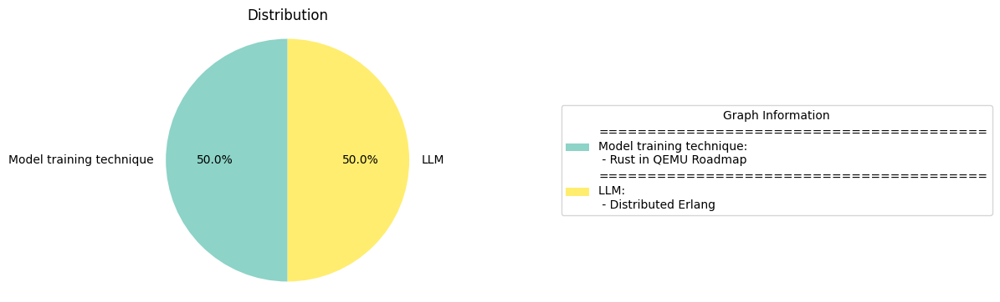

# Daily Artificial Intelligence Insights : News

## Model training technique

**요약:**

**1. 주요 테마 (Key Themes)**

다음은 여러 뉴스 기사에서 추출한 주요 테마입니다.

* 프로그래밍 언어 및 기술 개발 (Programming Language and Technology Development)
* 분산 시스템 및 병렬 처리 (Distributed Systems and Parallel Processing)
* 소프트웨어 개발 및 설계 (Software Development and Design)

**2. 주요 사건 (Major Events)**

다음은 각 뉴스 기사에서 추출한 주요 사건입니다.

* QEMU 10.0에서 러스트(Rust) 언어를 기본적으로 활성화하는 로드맵이 논의되었습니다. 이는 러스트 언어의 안정성과 성능을 높이는 데 중요한 단계입니다.
* 에를랭(Erlang) 언어는 내재적으로 동시성, 고장 허용, 분산 처리를 지원하여 고장 허용성과 확장성이 높은 시스템을 구축할 수 있습니다. 그러나 에를랭을 사용한 분산 시스템을 구축하는 것은 복잡하며, 확장성 문제, 네트워크 분할, 단일 지점 병목 현상 등 여러 함정에 주의해야 합니다.

**3. 영향 분석 (Impact Analysis)**

다음은 각 뉴스 기사에서 추출한 사건의 영향 분석입니다.

* QEMU 10.0에서 러스트 언어를 기본적으로 활성화하는 것은 소프트웨어 개발 및 설계 분야에 큰 영향을 미칠 수 있습니다. 이는 러스트 언어의 안정성과 성능을 높여서 더 많은 개발자가 러스트 언어를 사용하도록 유도할 수 있습니다.
* 에를랭 언어를 사용한 분산 시스템의 구축은 확장성과 고장 허용성 높은 시스템을 구축할 수 있는 기회를 제공합니다. 그러나 이러한 시스템을 구축하는 것은 복잡하며, 여러 함정에 주의해야 합니다. 따라서 에를랭 언어를 사용한 분산 시스템의 구축은 소프트웨어 개발 및 설계 분야에 큰 영향을 미칠 수 있습니다.

**4. 최종 요약 (Final Summary)**

다음은 뉴스 기사에서 추출한 정보를 바탕으로 한 최종 요약입니다.

최근 프로그래밍 언어 및 기술 개발 분야에서 러스트 언어와 에를랭 언어가 주목받고 있습니다. QEMU 10.0에서 러스트 언어를 기본적으로 활성화하는 로드맵이 논의되었습니다. 또한 에를랭 언어는 내재적으로 동시성, 고장 허용, 분산 처리를 지원하여 고장 허용성과 확장성이 높은 시스템을 구축할 수 있습니다. 그러나 이러한 시스템을 구축하는 것은 복잡하며, 여러 함정에 주의해야 합니다. 따라서 이러한 언어와 기술의 개발은 소프트웨어 개발 및 설계 분야에 큰 영향을 미칠 수 있습니다. 향후 이러한 언어와 기술의 발전을 주시해야 합니다.

**출처:**

 - Rust in QEMU Roadmap (https://lore.kernel.org/all/cc40943e-dec1-4890-a1d9-579350ce296f@pbonzini.local/)
 - Distributed Erlang (https://vereis.com/posts/disterl_inbox)

