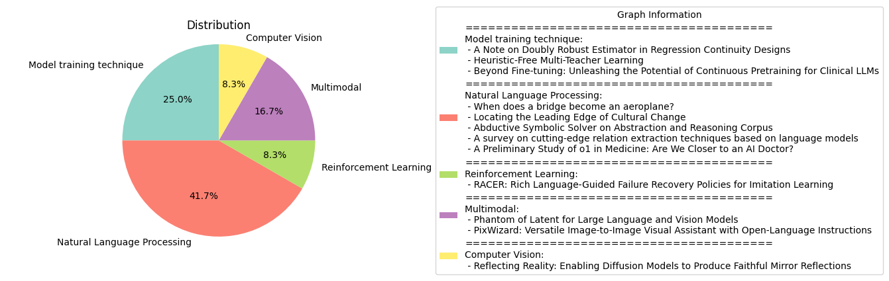

# Daily Artificial Intelligence Insights : Papers

## Model training technique

**요약:**

**요약 보고서**

**제목:** 연구 요약 및 분석 보고서

**요약:**

본 보고서는 두 개의 연구 논문에 대한 요약 및 분석을 제공합니다. 첫 번째 논문은 회귀 불연속성 설계에서 이중 강건 추정기를 제안하며, 두 번째 논문은 수동 집계 휴리스틱이 없는 다중 교사 학습 프레임워크를 소개합니다.

**주요 주제 및 패턴:**

* 회귀 불연속성 설계
* 이중 강건 추정기
* 다중 교사 학습
* 수동 집계 휴리스틱
* 강건성

**주요 사건 및 정보:**

* 첫 번째 논문에서는 회귀 불연속성 설계에서 이중 강건 추정기를 제안합니다. 이 추정기는 두 개의 조건부 기대값 추정기를 결합하여 처리 효과 추정의 강건성을 향상시킵니다.
* 두 번째 논문에서는 수동 집계 휴리스틱이 없는 다중 교사 학습 프레임워크를 소개합니다. 이 프레임워크는 교사별 입력 토큰을 도입하고 훈련 과정을 재구성하여 집계 오류를 줄입니다.

**영향 분석:**

* 첫 번째 논문에서 제안된 이중 강건 추정기는 회귀 불연속성 설계에서 처리 효과 추정의 강건성을 향상시킵니다. 이는 정책 평가 및 의사 결정에 중요한 영향을 미칠 수 있습니다.
* 두 번째 논문에서 소개된 다중 교사 학습 프레임워크는 기계 학습 모델의 성능을 향상시키고, 집계 오류를 줄일 수 있습니다. 이는 다양한 분야에서 기계 학습 모델을 사용하는 데 중요한 영향을 미칠 수 있습니다.

**결론 및 향후 발전:**

* 본 보고서에서 요약된 두 개의 연구 논문은 회귀 불연속성 설계와 다중 교사 학습에 대한 새로운 접근 방식을 제안합니다. 이러한 접근 방식은 정책 평가, 의사 결정, 기계 학습 모델의 성능 향상에 중요한 영향을 미칠 수 있습니다.
* 향후 연구에서는 이러한 접근 방식을 다양한 분야에 적용하고, 추가적인 연구를 통해 더 나은 성능을 달성할 수 있습니다.

**키워드:**

* 회귀 불연속성 설계
* 이중 강건 추정기
* 다중 교사 학습
* 수동 집계 휴리스틱
* 강건성
* 정책 평가
* 기계 학습 모델

**출처:**

 - A Note on Doubly Robust Estimator in Regression Continuity Designs (https://deeplearn.org/arxiv/554135/a-note-on-doubly-robust-estimator-in-regression-continuity-designs)
 - Heuristic-Free Multi-Teacher Learning (https://deeplearn.org/arxiv/550099/heuristic-free-multi-teacher-learning)

## None

**요약:**

**요약 보고서**

**제목:** 구조 건강 모니터링과 문화 변화의 선구자

**요약:**

이 보고서는 두 개의 논문에 대한 요약을 제공합니다. 첫 번째 논문은 구조 건강 모니터링(PBSHM)에서 구조 간 정보 전달의 어려움을 해결하기 위한 새로운 접근 방식을 제시합니다. 두 번째 논문은 문화 변화의 선구자를 찾기 위한 새로운 방법을 제시합니다.

**주요 주제와 키워드:**

* 구조 건강 모니터링(PBSHM)
* 정보 전달
* 구조 간 유사성
* 문화 변화
* 텍스트 유사성
* 선구자

**첫 번째 논문 요약:**

첫 번째 논문은 구조 건강 모니터링(PBSHM)에서 구조 간 정보 전달의 어려움을 해결하기 위한 새로운 접근 방식을 제시합니다. 이 접근 방식은 중간 구조를 사용하여 구조 간 정보 전달을 가능하게 합니다. 이 중간 구조는 두 구조 간의 정보 전달을 가능하게 하는 매개체 역할을 합니다. 이 논문은 이 접근 방식의 가능성을 보여주기 위해 두 개의 구조, 즉 다리와 비행기를 사용하여 실험을 수행했습니다.

**두 번째 논문 요약:**

두 번째 논문은 문화 변화의 선구자를 찾기 위한 새로운 방법을 제시합니다. 이 방법은 텍스트 유사성과 발산을 측정하여 문화 변화의 선구자를 찾는 것입니다. 이 논문은 세 개의 다른 텍스트 표현 방법을 사용하여 세 개의 다른 데이터셋을 분석했습니다. 결과는 텍스트의 선구자적인 부분이 문화 변화의 선구자와 관련이 있음을 보여주었습니다.

**결론:**

이 두 개의 논문은 구조 건강 모니터링과 문화 변화의 선구자에 대한 새로운 접근 방식을 제시합니다. 첫 번째 논문은 구조 간 정보 전달의 어려움을 해결하기 위한 새로운 접근 방식을 제시합니다. 두 번째 논문은 문화 변화의 선구자를 찾기 위한 새로운 방법을 제시합니다. 이 두 개의 논문은 구조 건강 모니터링과 문화 변화의 선구자에 대한 새로운 이해를 제공합니다.

**미래 연구 방향:**

* 구조 건강 모니터링에서 중간 구조를 사용하여 구조 간 정보 전달을 가능하게 하는 방법을 더 연구할 필요가 있습니다.
* 문화 변화의 선구자를 찾기 위한 새로운 방법을 더 연구할 필요가 있습니다.
* 구조 건강 모니터링과 문화 변화의 선구자에 대한 새로운 이해를 제공하기 위한 더 많은 연구가 필요합니다.

**출처:**

 - When does a bridge become an aeroplane? (https://deeplearn.org/arxiv/553087/when-does-a-bridge-become-an-aeroplane?)
 - Locating the Leading Edge of Cultural Change (https://deeplearn.org/arxiv/551310/locating-the-leading-edge-of-cultural-change)

## Natural Language Processing

**요약:**

**요약 보고서**

**인공지능 및 자연어 처리 분야의 최근 동향**

최근 인공지능 및 자연어 처리 분야에서 두 가지 중요한 연구가 발표되었습니다. 첫 번째 연구는 "Abductive Symbolic Solver on Abstraction and Reasoning Corpus"라는 제목의 논문으로, 인공지능의 추론 능력을 향상시키는 방법을 제시하고 있습니다. 두 번째 연구는 "A survey on cutting-edge relation extraction techniques based on language models"라는 제목의 논문으로, 자연어 처리 분야에서 관계 추출 기술의 최근 동향을 분석하고 있습니다.

**추론 능력 향상을 위한 새로운 프레임워크**

첫 번째 논문에서는 인공지능의 추론 능력을 향상시키기 위한 새로운 프레임워크를 제시하고 있습니다. 이 프레임워크는 인간의 추론 과정을 모방하여, 시각적 추론 과제를 해결하는 데 필요한 논리적 추론 능력을 제공합니다. 이 프레임워크는 관찰 데이터를 지식 그래프로 변환하고, 핵심 지식을 추출하여, 솔루션을 생성하는 데 사용합니다. 이 방법은 인공지능의 성능을 향상시키고, 논리적이고 인간과 같은 솔루션을 제공할 수 있습니다.

**관계 추출 기술의 최근 동향**

두 번째 논문에서는 자연어 처리 분야에서 관계 추출 기술의 최근 동향을 분석하고 있습니다. 이 연구에서는 137편의 논문을 분석하여, 언어 모델을 기반으로 하는 관계 추출 기술의 발전과 현재 상태를 파악하고 있습니다. 연구 결과, BERT 기반 방법이 관계 추출에서 최고의 성능을 보이는 것으로 나타났습니다. 또한, 대규모 언어 모델(T5 등)이 특히 적은 데이터로 학습된 경우에 관계 추출에서 우수한 성능을 보이는 것으로 나타났습니다.

**결론 및 향후 전망**

두 논문은 인공지능 및 자연어 처리 분야에서 최근의 중요한 연구를 보여주고 있습니다. 추론 능력 향상을 위한 새로운 프레임워크와 관계 추출 기술의 최근 동향은 인공지능의 성능을 향상시키고, 다양한 분야에서 응용할 수 있는 기술을 제공할 수 있습니다. 향후, 이러한 기술의 발전과 응용을 지속적으로 모니터링하고, 새로운 연구를 통해 인공지능의 성능을 더욱 향상시키는 데 기여할 수 있을 것입니다.

**출처:**

 - Abductive Symbolic Solver on Abstraction and Reasoning Corpus (https://deeplearn.org/arxiv/553225/abductive-symbolic-solver-on-abstraction-and-reasoning-corpus)
 - A survey on cutting-edge relation extraction techniques based on language models (https://deeplearn.org/arxiv/553226/a-survey-on-cutting-edge-relation-extraction-techniques-based-on-language-models)

## Reinforcement Learning

**요약:**

제목: "RACER: 풍부한 언어 지침이 있는 모방 학습을 위한 실패 복구 정책"

요약:
로봇 조작을 위한 강건하고 수정 가능한 시각-운동 정책을 개발하는 것은 실패로부터의 자기 복구 메커니즘의 부족과 단순한 언어 지침이 로봇 동작을 지시하는 데 한계가 있기 때문에 어려운 도전이다. 이러한 문제를 해결하기 위해, 우리는 전문가 데모에 실패 복구 궤적과 세부적인 언어 주석을 자동으로 추가하는 확장 가능한 데이터 생성 파이프라인을 제안한다. 그런 다음, 우리는 실패 복구 데이터와 풍부한 언어 설명을 결합하여 로봇 제어를 향상시키는 Rich languAge-guided failure reCovERy (RACER)라는 감독자-액터 프레임워크를 소개한다. RACER는 오류 수정과 작업 실행을 위한 세부적인 언어 지침을 제공하는 온라인 감독자로서의 시각-언어 모델(VLM)과 언어 조건부 시각-운동 정책을 액터로서의 다음 동작을 예측하는 것을 특징으로 한다. 실험 결과는 RACER가 다양한 평가 설정에서 표준 장기 지평 작업, 동적 목표 변경 작업 및 제로샷 미시작 작업을 포함하여 RLbench에서 최첨단 Robotic View Transformer (RVT)를 능가한다는 것을 보여주며, 시뮬레이션 환경과 실제 환경 모두에서 우수한 성능을 달성한다.

주요 특징:

* 실패 복구 데이터와 풍부한 언어 설명을 결합하여 로봇 제어를 향상시키는 RACER 프레임워크
* 온라인 감독자로서의 시각-언어 모델(VLM)과 언어 조건부 시각-운동 정책을 액터로서의 다음 동작을 예측하는 것
* 다양한 평가 설정에서 표준 장기 지평 작업, 동적 목표 변경 작업 및 제로샷 미시작 작업을 포함하여 RLbench에서 최첨단 Robotic View Transformer (RVT)를 능가하는 성능

향후 연구 방향:

* RACER 프레임워크를 다양한 로봇 조작 작업에 적용하여 성능을 평가하고 개선하는 것
* 실패 복구 데이터와 풍부한 언어 설명을 결합하여 로봇 제어를 향상시키는 다른 방법을 탐색하는 것
* RACER 프레임워크를 실제 환경에서 적용하여 로봇 조작 작업의 성능을 개선하는 것

**출처:**

 - RACER: Rich Language-Guided Failure Recovery Policies for Imitation Learning (http://arxiv.org/abs/2409.14674v1)

## LLM

**요약:**

**요약 보고서**

최근에 발표된 두 개의 논문은 의료 분야에서 대규모 언어 모델(LLM)의 잠재력을 탐구하고 있습니다. 이 보고서는 두 논문의 주요 내용을 요약하고, 의료 분야에서 LLM의 발전 방향을 제시합니다.

**첫 번째 논문: "의료 분야에서 o1의 잠재력"**

첫 번째 논문은 OpenAI의 o1 모델을 의료 분야에서 평가합니다. o1 모델은 내부화된 사고 체인 기법을 사용하여 강화 학습 전략을 구현한 최초의 LLM입니다. 이 모델은 일반 언어 작업에서 놀라운 성능을 보여주었지만, 의료 분야에서의 성능은 알려져 있지 않았습니다. 이 논문은 o1 모델을 다양한 의료 상황에서 평가하고, 이해, 추론, 및 다국어 능력에 대한 3가지 측면을 조사합니다. 평가에는 37개의 의료 데이터셋을 사용하였으며, 그 중 2개는 전문 의료 퀴즈를 기반으로 한 새로운 질문-응답(QA) 작업입니다. 이 데이터셋은 표준 의료 QA 벤치마크보다 더 높은 임상적 관련성을 제공합니다. 분석 결과, o1 모델은 이전의 GPT-4 모델보다 평균 6.2% 및 6.6%의 정확도를 높였습니다. 그러나 모델의 약점과 평가 프로토콜의 한계도 발견되었습니다.

**두 번째 논문: "의료 분야에서 지속적인 사전 훈련의 잠재력"**

두 번째 논문은 의료 분야에서 LLM을 적응시키는 4가지 기법을 조사합니다. 이 논문은 지속적인 사전 훈련, 지시적 미세 조정, NEFTune, 및 프롬프트 엔지니어링을 Mistral 7B 및 Mixtral 8x7B 모델에 적용합니다. 평가 결과, 지속적인 사전 훈련은 250억 토큰 이상에서 마진적인 개선만 제공하지만, 지시적 미세 조정을 위한 강력한 기반을 제공합니다. 또한, NEFTune은 생성 품질을 향상시키기 위해 설계되었지만, 벤치마크에서 추가적인 이득을 제공합니다. 복잡한 프롬프트 엔지니어링 방법은 성능을 더욱 향상시킵니다. 이 결과는 의료 분야에서 LLM의 성능을 최적화하기 위해 미세 조정 전략을 조정하고 새로운 기법을 탐색하는 것이 중요함을 보여줍니다.

**결론**

두 논문은 의료 분야에서 LLM의 잠재력을 탐구하고 있습니다. o1 모델은 의료 분야에서 강력한 성능을 보여주었지만, 약점과 한계도 발견되었습니다. 지속적인 사전 훈련과 미세 조정 전략은 LLM의 성능을 최적화하기 위해 중요합니다. 의료 분야에서 LLM의 발전 방향은 다음과 같습니다.

* 의료 분야에서 LLM의 성능을 최적화하기 위해 미세 조정 전략을 조정하고 새로운 기법을 탐색합니다.
* LLM의 약점과 한계를 해결하기 위해 모델의 개선이 필요합니다.
* 의료 분야에서 LLM의 적용을 확대하기 위해 데이터셋과 평가 프로토콜의 개발이 필요합니다.

이 보고서는 의료 분야에서 LLM의 잠재력을 탐구하고, 발전 방향을 제시합니다. 향후 연구는 의료 분야에서 LLM의 성능을 최적화하고, 약점과 한계를 해결하기 위해 노력해야 합니다.

**출처:**

 - A Preliminary Study of o1 in Medicine: Are We Closer to an AI Doctor? (http://arxiv.org/abs/2409.15277v1)
 - Beyond Fine-tuning: Unleashing the Potential of Continuous Pretraining for Clinical LLMs (http://arxiv.org/abs/2409.14988v1)

## Multimodal

**요약:**

**요약 보고서**

최근 대규모 언어 및 비전 모델(LLVMs)의 발전은 시각적 지침 조정을 통해 가속화되었습니다. 이러한 모델의 크기는 26B, 34B, 80B 파라미터에 이르기까지 크게 증가했으며, 이는 상당한 성능 향상을 가져왔습니다. 그러나 이러한 모델의 크기는 하드웨어 자원에 대한 요구를 크게 증가시켰습니다. 따라서 효율적인 LLVMs의 필요성이 대두되었습니다.

이러한 필요성을 충족하기 위해 Phantom이라는 새로운 효율적인 LLVM 패밀리를 제시했습니다. Phantom은 0.5B, 1.8B, 3.8B, 7B 파라미터 크기로 구성되며, 이는 기존 모델보다 작은 크기에도 불구하고 상당한 성능 향상을 보여줍니다. Phantom은 잠재적인 은닉 차원을 일시적으로 증가시켜 비전-언어 지식을 학습할 수 있습니다. 또한 Phantom 최적화(PO)를 통해 오토레그레시브 감독된 미세조정(SFT)과 직접적 선호도 최적화(DPO)를 사용하여 모델의 성능을 향상시켰습니다.

또한 PixWizard라는 이미지-이미지 비주얼 어시스턴트를 제시했습니다. PixWizard는 자유로운 언어 지침에 따라 이미지 생성, 조작 및 번역을 수행할 수 있습니다. 이를 위해 다양한 비전 작업을 통합된 이미지-텍스트-이미지 생성 프레임워크로 구축하고 Omni Pixel-to-Pixel Instruction-Tuning Dataset을 구축했습니다. 또한 Diffusion Transformers(DiT)를 기반 모델로 사용하고, 유연한 해상도 메커니즘을 추가하여 모델이 입력 이미지의 비율에 따라 동적으로 처리할 수 있도록 했습니다.

이러한 모델들은 대규모 언어 및 비전 모델의 효율성을 향상시키고, 다양한 비전 작업을 수행할 수 있는 능력을 보여주었습니다. 이러한 기술의 발전은 미래의 컴퓨터 비전 및 자연어 처리 분야에 큰 영향을 미칠 것으로 예상됩니다.

**결론**

대규모 언어 및 비전 모델(LLVMs)의 발전은 컴퓨터 비전 및 자연어 처리 분야에 큰 영향을 미치고 있습니다. Phantom과 PixWizard와 같은 효율적인 LLVM 패밀리는 기존 모델보다 작은 크기에도 불구하고 상당한 성능 향상을 보여주었습니다. 이러한 기술의 발전은 미래의 컴퓨터 비전 및 자연어 처리 분야에 큰 영향을 미칠 것으로 예상됩니다.

**향후 연구 방향**

* 대규모 언어 및 비전 모델(LLVMs)의 효율성을 향상시키기 위한 새로운 방법론 개발
* 다양한 비전 작업을 수행할 수 있는 능력을 가진 모델 개발
* 컴퓨터 비전 및 자연어 처리 분야에 LLVMs를 적용하기 위한 연구 진행

**출처:**

 - Phantom of Latent for Large Language and Vision Models (http://arxiv.org/abs/2409.14713v1)
 - PixWizard: Versatile Image-to-Image Visual Assistant with Open-Language Instructions (http://arxiv.org/abs/2409.15278v2)

## Computer Vision

**요약:**

**요약 보고서**

**제목:** 반사 현실: 확산 모델을 통한忠實한 거울 반사 생성

**요약:**

본 논문은 확산 기반 생성 모델을 사용하여 매우 현실적이고 가능성 있는 거울 반사를 생성하는 문제를 해결하고자 한다. 이를 위해 이미지 인페인팅 작업으로 문제를 정의하고, 사용자가 생성 과정에서 거울의 위치를 제어할 수 있도록 한다. 이를 위해, 66,000개의 고유한 3D 객체를 사용하여 렌더링된 약 198,000개의 샘플을 포함하는 대규모 데이터셋인 SynMirror를 생성하였다. SynMirror에는 관련된 기하학적 속성을 캡처하기 위한 깊이 맵, 노멀 맵 및 인스턴스별 분할 마스크가 포함되어 있다. 이 데이터셋을 사용하여, 입력 이미지와 거울 영역을 표시하는 마스크가 주어졌을 때, 높은 품질의 기하학적으로 일관되고 사진 현실적인 거울 반사를 생성하는 새로운 깊이 조건부 인페인팅 방법인 MirrorFusion을 제안하였다. MirrorFusion은 SynMirror에서 최첨단 방법을 능가하는 것으로 나타났으며, 광범위한 정량적 및 정성적 분석을 통해 입증되었다. 우리의 지식에 따르면, 우리는 확산 기반 모델을 사용하여 장면 내 객체의 제어된忠實한 거울 반사를 성공적으로 해결한 최초의 연구자이다. SynMirror와 MirrorFusion은 실무자와 연구자 모두를 위한 이미지 편집 및 증강 현실 애플리케이션에 새로운 길을 열어주고 있다.

**주요 키워드:**

* 확산 모델
* 거울 반사
* 이미지 인페인팅
* SynMirror 데이터셋
* MirrorFusion 방법

**추세 및 패턴:**

* 컴퓨터 비전 및 그래픽스 분야에서 확산 모델의 적용이 증가하고 있다.
* 이미지 편집 및 증강 현실 애플리케이션에서忠實한 거울 반사의 중요성이 증가하고 있다.
* 대규모 데이터셋의 생성 및 활용이 연구 및 실무에서 중요해지고 있다.

**향후 발전:**

* 확산 모델을 사용하여忠實한 거울 반사를 생성하는 방법의 개선 및 확장
* SynMirror 데이터셋의 확장 및 활용
* 이미지 편집 및 증강 현실 애플리케이션에서 MirrorFusion 방법의 적용 및 확장

**출처:**

 - Reflecting Reality: Enabling Diffusion Models to Produce Faithful Mirror Reflections (http://arxiv.org/abs/2409.14677v1)

