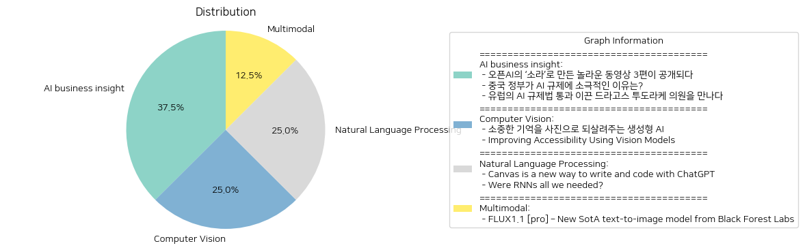

# Daily Artificial Intelligence Insights : News

## Robotics

**요약:**

1. **핵심 주제**:
   이번 뉴스에서는 인공지능(AI) 로봇 개발이 주요 주제로 다루어지고 있습니다. 특히, 인간을 닮은 범용 로봇의 개발을 앞두고 있는 AI 기업의 혁신적인 접근과 앞으로의 방향이 집중적으로 언급되고 있습니다. 

2. **주요 사건**:
   캐나다의 AI 로봇 전문기업인 생추어리 AI(Sanctuary AI)가 세계 최초로 인간을 닮은 범용 로봇 개발에 성공한 사실이 주목받고 있습니다. 생추어리 AI의 조르디 로즈 CEO와의 인터뷰를 통해 미래의 로봇에 대한 비전을 확인할 수 있으며, 그들이 추구하는 것은 복잡하고 예측 불가능한 일상 상황에서도 유연하게 대응할 수 있는 로봇 개발입니다.

3. **영향 분석**:
   **경제적 영향**: 범용 로봇의 발전은 산업 전반에 큰 변화를 가져올 전망입니다. 로봇의 상용화가 이루어질 경우 노동 시장에서의 일자리 변화, 새로운 직종의 탄생, 생산성 향상이 예상됩니다.
   
   **사회적 영향**: 사회적으로는 인간과 로봇 간의 상호작용이 증가하면서 놀이 및 교육, 노인 돌봄 등의 영역에서 로봇의 활용이 확대될 것으로 보입니다. 이는 기술 발전에 따른 윤리적 논의 및 사회적 수용성에 대한 새로운 과제를 제시할 것입니다.

4. **최종 요약**:
   생추어리 AI의 범용 로봇 개발은 AI와 로봇 기술의 첨단을 대표하는 사건으로, 향후 이 분야의 발전 방향을 가늠할 수 있는 중요한 이정표입니다. 다양한 산업 및 사회적 분야에서 로봇 활용이 확산됨에 따라 기술에 대한 규제 및 윤리적 고민도 깊어질 것입니다. 미래에는 로봇과 인간이 더 긴밀히 협력하며 공존할 수 있는 환경 구축을 위해 다양한 논의와 준비가 필요할 것입니다. 이를 위해 정부, 기업, 사회 전반이 함께 발전 전략을 모색해 나가야 할 것입니다.

**출처:**

 - [단독 인터뷰] 세계 최초로 인간을 닮은 범용로봇 개발한 ‘생추어리 AI’FREE (https://www.technologyreview.kr/%ec%9d%b8%ed%84%b0%eb%b7%b0-%ec%83%9d%ec%b6%94%ec%96%b4%eb%a6%ac-ai%ea%b0%80-%ea%b7%b8%eb%a6%ac%eb%8a%94-%eb%af%b8%eb%9e%98%ec%9d%98-%eb%a1%9c%eb%b4%87%ec%9d%80-%ec%8b%a4%ec%b2%b4%ed%99%94/)

## AI applications

**요약:**

1. **주요 테마**:
   - 오픈AI의 혁신적인 기술 발전
   - AI를 활용한 콘텐츠 창작의 증가
   - AI 기반 툴이 영상 산업에 미치는 영향

2. **주요 사건**:
   - 오픈AI가 최신 동영상 생성 모델인 '소라'를 발표하고 이를 통해 제작된 3편의 영상을 공개함.
   - 다양한 영상 크리에이터들이 소라를 활용하여 새로운 동영상을 제작하여 창작의 목적과 기법을 소개함.

3. **영향 분석**:
   - **경제**: AI 기반 툴의 발전은 콘텐츠 제작의 효율성을 높이고 비용을 절감시켜 경제적 긍정적 영향을 미칠 수 있음. 그러나 자동화된 콘텐츠 제작 증가로 인한 일자리 변화 가능성도 있음.
   - **사회**: 대중들이 AI 기술을 접할 기회가 늘어나면서 AI에 대한 사회적 인식이 향상되고, 기술 활용 여부에 대한 토론이 활성화될 수 있음.
   - **문화**: AI를 활용한 다양한 창작물의 등장은 문화 콘텐츠의 다양성을 높일 수 있으며, 창작자들에게 새로운 영감과 기회를 제공할 수 있음.

4. **최종 요약**:
   최근 오픈AI의 '소라' 모델을 활용한 3편의 동영상 공개는 AI 기술이 미디어 및 콘텐츠 제작 분야에서 얼마나 빠르게 발전하고 있는지를 보여주는 좋은 사례이다. 이는 경제적 효율성 개선뿐 아니라 사회적, 문화적 인식 변화에 기여할 가능성을 제시한다. 특히, AI 기술의 발전이 가져올 수 있는 일자리 변화와 윤리적 문제에 대한 지속적인 논의가 필요하며, 이러한 기술의 발전이 향후에도 지속될 것으로 보인다. 향후 AI와 콘텐츠 창작의 융합이 어떤 형태로 발전할지를 주목할 필요가 있다.

**출처:**

 - 오픈AI의 ‘소라’로 만든 놀라운 동영상 3편이 공개되다 (https://www.technologyreview.kr/%ec%98%81%ec%83%81-%ec%83%9d%ec%84%b1-%eb%aa%a8%eb%8d%b8-%ec%86%8c%eb%9d%bc%eb%a1%9c-%eb%a7%8c%eb%93%a0-%eb%86%80%eb%9d%bc%ec%9a%b4-%ec%98%81%ed%99%94-3%ed%8e%b8%ec%9d%b4-%ea%b3%b5%ea%b0%9c%eb%90%98/)

## AI policy

**요약:**

**1. 주요 주제:**

이 뉴스 기사들은 인공지능(AI) 규제에 관한 주제를 다루고 있습니다. 중국과 유럽이라는 두 주요 지역에서 정부의 AI 규제 접근 방식이 비교되고 있으며, 이는 글로벌 AI 규제 동향 및 이에 대한 정책적 견해의 차이를 드러냅니다. 

**2. 주요 사건:**

첫 번째 기사에서는 중국 정부가 AI 규제에 대한 소극적인 태도를 보이고 있다는 점을 강조합니다. 이는 중국의 AI 산업 성장 촉진을 위한 의도적인 선택으로 보이며, 정부가 소비자 기술 플랫폼에는 강력한 규제를 적용하면서도 AI 분야에는 느슨한 규제를 적용한다고 설명합니다.

두 번째 기사에서는 유럽의회에서 AI 규제법을 통과시키는 데 중요한 역할을 한 드라고스 투도라케 의원에 대해 다룹니다. 그는 유럽의 AI 규제법이 AI 산업의 개선에 기여할 수 있다고 믿으며, 그의 노력은 유럽의 AI 규제 정책에 중요한 영향을 미쳤습니다.

**3. 영향 분석:**

경제적 영역에서, 중국의 느슨한 AI 규제 정책은 자국 산업의 빠른 발전을 촉진시킬 가능성이 높습니다. 이는 AI 분야에서의 전 세계적인 경쟁력 강화에 기여할 수 있습니다. 반면, 유럽의 강력한 규제는 AI 기술의 윤리적 사용과 소비자 보호를 목표로 하며, 장기적으로 산업의 투명성과 신뢰성을 향상시킬 수 있을 것으로 보입니다.

정치적 측면에서는, 이러한 규제 접근 방식의 차이는 각국의 정책 목표와 국제 경쟁력 강화 전략을 반영하고 있습니다. 중국과 유럽은 각자의 방식으로 AI 규제를 통해 글로벌 기술 리더십을 확보하려는 노력을 하고 있습니다.

**4. 최종 요약:**

이 뉴스들은 AI 규제에 대한 서로 다른 두 국가의 접근 방식을 보여줍니다. 중국은 산업 성장을 우선시하며 규제를 최소화하는 반면, 유럽은 윤리적 기준 확립 및 소비자 보호에 중점을 두고 강력한 규제를 추진하고 있습니다. 각각의 접근 방식은 AI 기술 발전과 관련된 다양한 장단점을 가집니다. 미래에는 이러한 정책이 AI 산업에 미칠 장기적인 영향과, 각국의 규제 전략이 어떻게 변화하고 발전할지를 주목할 필요가 있습니다. AI 기술의 글로벌 패러다임에서, 중국과 유럽의 정책 변화가 주는 시사점은 매우 중요합니다.

**출처:**

 - 중국 정부가 AI 규제에 소극적인 이유는? (https://www.technologyreview.kr/%ec%a4%91%ea%b5%ad-%ec%a0%95%eb%b6%80%ea%b0%80-%ed%98%84%ec%9e%ac%eb%a1%9c%ec%84%9c%eb%8a%94-ai-%eb%b6%84%ec%95%bc%eb%a5%bc-%ea%b0%80%ed%98%b9%ed%95%98%ea%b2%8c-%ea%b7%9c%ec%a0%9c%ed%95%98%ec%a7%80/)
 - 유럽의 AI 규제법 통과 이끈 드라고스 투도라케 의원을 만나다 (https://www.technologyreview.kr/ai-%ea%b7%9c%ec%a0%9c%eb%b2%95-%ed%86%b5%ea%b3%bc-%ec%9d%b4%eb%81%88-%eb%93%9c%eb%9d%bc%ea%b3%a0%ec%8a%a4-%ed%88%ac%eb%8f%84%eb%9d%bc%ec%bc%80-%ec%9d%98%ec%9b%90%ec%9d%84-%eb%a7%8c%eb%82%98%eb%8b%a4/)

## Generative AI

**요약:**

1. **주요 주제**:
   - 생성형 AI의 활용과 혁신적 기술
   - '합성 기억' 프로젝트를 통한 잃어버린 추억 복원
   - 가족과 개인의 과거 경험과 감정 부활

2. **주요 사건**:
   - 생성형 AI를 활용하여 개인의 기억을 이미지로 재현하는 '합성 기억' 프로젝트가 진행 중임.
   - 이 혁신적인 프로젝트는 전 세계적으로 다양한 가족들이 과거의 사진으로 남지 않은 추억을 되찾을 수 있도록 도움을 제공하고 있음.

3. **영향 분석**:
   - **사회적 영향**: 이 프로젝트는 개인의 정체성과 가족의 역사에 대한 감성적 연결을 강화하여 사회 전반에 긍정적인 영향을 미칠 수 있음. 개인의 추억 복원은 가족 간의 유대감을 강화하고, 과거를 이해함으로써 현재와 미래의 삶에도 긍정적 영향을 끼칠 수 있음.
   - **경제적 영향**: 생성형 AI 기술의 활용 증가는 AI 관련 산업의 발전과 관련 시장의 확장을 이끌 수 있음. 이는 해당 분야에서의 일자리 창출 및 기술 개발을 촉진할 가능성이 있음.
   
4. **최종 요약**:
   - 생성형 AI를 이용한 '합성 기억' 프로젝트는 사회적, 경제적 영역에 새로운 가능성을 열어가고 있다. 기술 발전을 통한 개인의 감성적 경험 복원은 심리적 만족감을 제공하여 사회의 전반적인 행복 수준 향상에 기여할 수 있다. 앞으로 이러한 AI 기술이 어떻게 발전하고, 어떤 새로운 형태로 개인화된 경험을 제공할 수 있을지 주목할 필요가 있다. 이는 기술 발전과 인간 경험의 융합을 통해 다양한 분야에 새로운 혁신을 가져올 가능성이 있다.

**출처:**

 - 소중한 기억을 사진으로 되살려주는 생성형 AI (https://www.technologyreview.kr/%ec%83%9d%ec%84%b1%ed%98%95-ai%eb%a1%9c-%ea%b0%80%ec%9e%a5-%ec%86%8c%ec%a4%91%ed%95%9c-%ea%b8%b0%ec%96%b5%ec%9d%84-%ec%82%ac%ec%a7%84%ec%9c%bc%eb%a1%9c-%eb%a7%8c%eb%93%a0%eb%8b%a4/)

## Software Development

**요약:**

1. **주요 주제**:
   모든 뉴스 기사에서 공통으로 나타나는 주요 주제는 기술 혁신과 소프트웨어 개발입니다. React 프레임워크 및 컴파일러 버그와 같은 소프트웨어 개발 과정에서의 발전과 문제 해결에 관한 내용이 중심입니다.

2. **주요 사건**:
   - 첫 번째 기사에서는 "One"이라는 이름의 새로운 React 프레임워크에 대해 설명합니다. Vite를 기반으로 하며, 경로 설정과 데이터 관리를 단순화한다고 강조합니다. Zero와의 파트너십을 통해 기본 데이터 솔루션을 제공하고, 서버와 클라이언트 통합을 도모합니다.
   - 두 번째 기사에서는 컴파일러 최적화 과정에서 발생한 버그에 대해 다룹니다. 하드웨어 타이머를 일정 방식으로 읽어 경합 조건을 피하려고 했지만, 이는 컴파일러 최적화 문제를 야기했고 나중에 컴파일러 업그레이드를 통해 수정되었습니다.

3. **영향 분석**:
   - 기술 부문에서는 새로운 React 프레임워크인 "One"의 출현이 웹 및 네이티브 개발을 통합하는 방향으로 발전할 가능성을 시사합니다. 이는 소프트웨어 개발자들이 더욱 효율적으로 앱을 개발할 수 있게 도와줄 것입니다.
   - 컴파일러 버그 사건은 소프트웨어 개발 환경에서 최적화 과정에서 발생할 수 있는 예기치 않은 문제들을 조명합니다. 이러한 문제는 소프트웨어의 안정성과 신뢰성에 영향을 미칠 수 있으며, 이를 통해 컴파일러 및 개발 도구의 지속적인 개선이 필요함을 알립니다.

4. **최종 요약**:
   위 기사들을 종합해 보면, 최신 소프트웨어 개발 도구와 관련한 혁신과 문제 해결이 중요한 주제로 떠오릅니다. React 프레임워크의 새로운 발전은 개발자들이 다양한 플랫폼에서 통합된 솔루션을 적용할 수 있는 가능성을 열어줍니다. 또한, 컴파일러 버그 사례는 소프트웨어 최적화 중 발생할 수 있는 오류에 대한 주의를 환기하며, 향후 도구의 개선과 안전성 강화가 중요함을 시사합니다. 이런 흐름은 소프트웨어 개발의 미래에 큰 영향을 미칠 것이며, 기술 업계의 발전방향을 주의 깊게 관찰할 필요가 있습니다.

**출처:**

 - Show HN: One – A new React framework unifying web, native and local-first (https://onestack.dev)
 - A Compiler Bug (2023) (https://rsaxvc.net/blog/2023/9/29/A_compiler_bug.html)

## Software Tools

**요약:**

1. **주요 주제**:
   본 뉴스 기사는 주로 웹 애플리케이션 및 수학적 기능의 효율적 근사값 계산이라는 기술적 주제에 중점을 두고 있습니다. 이러한 주제는 기술의 진보와 개발자 커뮤니티 내에서 효율성을 향상시키기 위한 창의적 접근 방식에 대한 관심을 나타냅니다.

2. **주요 사건**:
   이 기사에서는 새로운 웹 애플리케이션인 'Chebyshev 근사값 계산기'가 소개되고 있습니다. 이 애플리케이션은 단일 변수 수학 함수의 효율적 근사값을 생성하는 코드를 생성합니다. 이는 개발자들에게 중요한 도구가 될 수 있으며, 복잡한 수학 연산을 간소화할 수 있는 기능을 제공합니다.

3. **영향 분석**:
   - **경제**: 이 도구는 소프트웨어 개발 및 데이터 과학 분야에서의 효율성을 높일 수 있어, 이러한 분야에 종사하는 전문가들에게 비용 절감과 생산성 향상의 기회를 제공할 수 있습니다.
   - **사회**: 수학적 함수를 쉽게 다룰 수 있는 솔루션을 통해 교육 및 학습을 지원할 수 있으며, 관련 기술을 배우고자 하는 사람들에게 더 쉽게 접근할 수 있는 기회를 제공합니다.
   
4. **최종 요약**:
   'Chebyshev 근사값 계산기'는 기술 개발의 방향성을 보여주는 중요한 예시입니다. 이는 개발자와 교육자 모두에게 중요한 영향을 미칠 수 있으며, 복잡한 기능의 더 용이한 접근과 처리를 가능케 합니다. 앞으로 이러한 기술의 발전은 효율성과 접근성을 높여 줄 것이며, 관련 분야의 지속적인 관심과 진보를 촉진할 것입니다. 앞으로 이와 관련된 개발이 어떻게 확장되어 나갈지 주목할 필요가 있습니다.

**출처:**

 - Show HN: Chebyshev approximation calculator (https://stuffmatic.com/chebyshev/)

## Networking

**요약:**

**핵심 주제**:  
모든 뉴스 기사에서 나타나는 주요 주제를 파악하세요. 자주 언급되는 트렌드나 주제를 식별합니다.

1. **주요 주제**:
   - HTTP/3 지원: Mitmproxy 11에서의 새로운 기능으로, 네트워크 프로토콜의 최신 버전인 HTTP/3을 지원하게 되었습니다. 이로 인해 더 나은 성능과 보안을 기대할 수 있습니다.
   - DNS 개선: Hickory DNS 사용을 통한 DNS 구현 개선으로, 더 효율적인 쿼리 처리 능력을 제공합니다.

2. **주요 이벤트**:
   - mitmproxy 11 버전 출시: 새로운 버전의 출시가 네트워크 관리와 보안 분야에 중요한 변화를 가져올 것입니다.
   - 역방향 프록시 모드에서의 HTTP/3 지원: 이는 서버와의 보다 빠르고 안정적인 연결을 가능하게 합니다.

3. **영향 분석**:
   - 경제적 영향: 증가된 네트워크 속도와 안정성은 IT 기업들에게 경쟁력을 제고할 수 있으며, 더 나은 사용자 경험을 제공함에 따라 비즈니스 효율성이 향상됩니다.
   - 사회적 영향: 새로운 프로토콜 지원은 인터넷 사용 경험을 향상시켜, 사용자들이 더욱 원활하게 인터넷 자원을 이용할 수 있게 합니다. 

4. **최종 요약**:
   Mitmproxy 11의 출시는 네트워크 기술 발전의 중요한 단계를 표시하며, 특히 HTTP/3 지원과 DNS 기능 개선은 다양한 분야에서 긍정적인 변화를 이끌어낼 것입니다. 앞으로 이러한 기술적 진보는 더 향상된 사이버 보안과 네트워크 최적화를 촉진할 수 있으며, 차세대 인터넷 서비스에 크게 기여할 것으로 전망됩니다. 지속적인 주의가 요구되는 부분은 새로운 기술 도입에 따른 잠재적 보안 위협입니다. 따라서, 관련 기업과 조직들은 이러한 트렌드를 주시하며, 적절한 대비책을 마련해야 할 것입니다.

**출처:**

 - Mitmproxy 11: Full HTTP/3 Support (https://mitmproxy.org/posts/releases/mitmproxy-11/)

## Graphics

**요약:**

**종합 요약 보고서**

1. **주요 주제**:
   이번 뉴스 기사에서는 기술 혁신과 소프트웨어 개발 도구의 발전이 주요 주제로 다뤄지고 있습니다. 특히, 최신 기술을 활용하여 사용자 경험을 향상시키려는 시도가 돋보입니다.

2. **주요 사건**:
   뉴스에서 다뤄진 가장 중요한 사건은 '炊紙(kashikishi)'라는 텍스트 편집기의 개발입니다. 이 텍스트 편집기는 GPU를 활용하여 3D 공간에서 텍스트를 편집할 수 있는 기능을 제공합니다. 또한, 이 텍스트 편집기는 Visual Studio 2022를 위한 빌드 도구와 함께 배포되어 GitHub에서 다운로드할 수 있습니다.

3. **영향 분석**:
   이와 같은 도구의 개발은 소프트웨어 개발 및 사용자의 생산성에 큰 영향을 미칠 수 있습니다. 3D 공간에서 텍스트를 편집할 수 있는 기능은 다양한 창의적 작업을 가능하게 하고, 개발자들에게 보다 혁신적인 방법으로 소프트웨어를 개발하는 데 기여할 수 있습니다. 이는 궁극적으로 소프트웨어 산업의 발전을 촉진하고, 시장 경쟁력을 강화하는 데 기여할 수 있습니다.

4. **최종 요약**:
   종합적으로 볼 때, '炊紙(kashikishi)'의 등장은 소프트웨어 개발의 혁신을 상징합니다. GPU를 활용한 3D 공간 편집은 앞으로 다른 소프트웨어 개발에도 적용될 수 있는 잠재성을 보여주며, 소프트웨어 편집기 시장에 새로운 바람을 불러일으킬 가능성이 큽니다. 향후 이러한 기술이 얼마나 빠르게 확대 적용될 수 있는지를 주목할 필요가 있습니다. 이는 기술 발전은 물론, 사용자 경험의 향상을 통해 사회 전반에 긍정적인 변화를 가져올 것으로 기대됩니다.

**출처:**

 - 炊紙(kashikishi) is a text editor that utilizes GPU to edit text in a 3D space (https://github.com/mitoma/kashiki2)

## Voice Technology

**요약:**

**1. 주요 주제:**

이 뉴스 기사에서 주요 주제는 AI 기술의 발전과 그 활용입니다. 특히, OpenAI와의 협력으로 AI 기반의 서버 프로그램을 실시간으로 시각, 청각, 언어 처리할 수 있는 멀티모달 에이전트 API를 개발하는 것이 핵심입니다. 추가로, 지연 시간이 적은 전송과 입력 처리 및 출력 생성을 위한 다양한 플러그인을 제공하는 에이전트 프레임워크가 강조됩니다.

**2. 주요 이벤트:**

가장 중요한 사건은 OpenAI와의 파트너십을 통해 새로운 멀티모달 에이전트 API를 개발한다는 발표입니다. 이 API는 AI가 복합적인 감각(시각, 청각, 언어)을 실시간으로 처리하고 반응할 수 있도록 설계되었습니다. 이는 AI의 실제 응용 분야 발전에 중요한 이정표로 볼 수 있습니다.

**3. 영향 분석:**

- **경제적 측면:** AI 기술의 발전으로 다양한 산업에서 자동화 및 효율성이 증가할 전망입니다. 새로운 API는 고객 서비스, 원격 통신, 콘텐츠 제작 등 여러 분야에 혁신적인 변화를 가져올 수 있습니다.
  
- **사회적 측면:** AI 시스템의 능동적 상호작용은 생활의 여러 측면에서 사람들과의 상호작용을 개선하고 새로운 서비스 및 제품의 탄생을 촉진할 수 있습니다. 그러나, 이는 AI의 윤리적 사용에 관한 논의와 규제도 함께 증가시킬 수 있습니다.

**4. 최종 요약:**

이번 뉴스는 OpenAI와의 협력을 통해 실시간 멀티모달 AI 에이전트 API를 개발하는 중요한 진전을 이룬 것을 강조합니다. 이는 AI 기술의 새로운 차원을 열어 줌으로써 다양한 산업과 사회의 전반적인 프로세스를 혁신할 가능성을 내포하고 있습니다. 앞으로 이러한 기술이 사회에 미칠 영향이나 규제적 접근 방식 등에 대한 지속적인 모니터링이 필요할 것입니다. 또한, AI 기술의 윤리적 측면에 관한 논의는 강화될 것이며, AI의 활용 범위가 확장됨에 따라 이러한 논의는 더욱 중요한 역할을 하게 될 것입니다.

**출처:**

 - Show HN: Open source framework OpenAI uses for Advanced Voice (https://github.com/livekit/agents)

## Computer History

**요약:**

**Key Themes**:
70년대 게임 개발, 프로그래머블 컴퓨터 없이 게임 제작 방법

**Major Events**:
70년대에 Pong과 같은 게임이 프로그래머블 컴퓨터 없이 어떻게 만들어졌는지에 대한 탐구

**Impact Analysis**:
기술 발전 초기 단계에 컴퓨팅 자원이 제한되어 있었으나 창의적인 방법으로 게임 개발이 이루어졌다는 점에서, 이 같은 기술 발전의 역사는 오늘날의 게임 산업 발전에 큰 교훈을 준다. 당시의 기술적 한계를 극복하고 게임 산업이 발전해온 과정은 오늘날 기술 연구 및 발전을 장려하는 중요한 배경이 된다.

**Final Summary**:
70년대 게임 개발은 프로그래머블 컴퓨터 없이도 창의적인 기술과 방법을 활용해 이루어졌으며, 이는 현대 기술 발전에 중요한 역사적 기반이 된다. 이러한 과거의 사례는 향후 기술 개발 및 혁신에 대한 인사이트를 제공하며, 지속적인 기술 발전과 창의성이 앞으로도 중요할 것이란 점을 시사한다.

**출처:**

 - How were 70s versions of games like Pong built without a programmable computer? (https://retrocomputing.stackexchange.com/questions/30698/how-were-the-70s-versions-of-pong-and-similar-games-implemented-without-a-progra)

## LLM

**요약:**

1. **주요 주제**:
   - 기사 제목과 요약에서 'LLMs'과 'Theory of Mind', 'Cheryl's Birthday'가 주요 주제로 보입니다.
   - 이와 관련된 트렌드나 주제를 빈번하게 관찰할 수 없지만, 인공지능과 이론의 응용, 복잡한 문제 해결 등이 관련될 가능성이 있습니다.

2. **주요 사건**:
   - 기사에서는 명확하게 특정 사건이나 이야기를 다루고 있지 않은 듯합니다. 이로 인해 구체적인 사건 요약이 어렵습니다.
   - 그러나 'Theory of Mind'와 관련하여 인공지능의 발전과 그 응용에 대한 이야기가 있을 가능성이 있음을 추측할 수 있습니다.

3. **영향 분석**:
   - 경제: 만약 이 뉴스가 인공지능과 이론 응용에 대한 것이라면, AI 기술 발전이 기업과 산업에 미칠 수 있는 영향에 대해 중요한 논의가 될 수 있습니다.
   - 사회: 인공지능의 발달이 사회적으로 가져올 변화, 즉 인간+기계 협업 방법론에 대한 이해와 수용, 교육 패러다임의 변화 등이 예상됩니다.
   - 학문: 'Theory of Mind'의 경우 새로운 학문적 연구 흐름을 만들 가능성도 있습니다.

4. **최종 요약**:
   - 뉴스 제목과 요약에서 명확한 결론을 도출하기는 어렵지만, 인공지능과 이론 기반의 발전에 대한 주제가 중심임을 추측할 수 있습니다.
   - 이에 따라 미래에는 인공지능의 지속적인 발전과 이론의 실용적 응용을 통한 실질적 문제 해결 방안이 제시될 가능성을 주시할 필요가 있습니다.
   - 추가적인 자세한 정보가 공개된다면 보다 구체적인 분석과 결론이 가능할 것입니다.

**출처:**

 - LLMs, Theory of Mind, and Cheryl's Birthday (https://github.com/norvig/pytudes/blob/main/ipynb/CherylMind.ipynb)

## Electronics

**요약:**

**주요 주제**

이 기사들에서 다루고 있는 주요 주제는 기술 발전과 혁신입니다. ESP32와 ESP8266을 활용한 전자 프로젝트가 디지털 신호 처리 및 인터페이스 생성에 어떻게 기여하는지를 설명하고 있으며, 초기 트랜지스터 라디오의 개발 및 제품 출시 과정에서 나타난 도전과 목표를 다루고 있습니다. 각각의 기사에서는 전자 기기의 창의적 사용과 기술 발전이 강조됩니다.

**주요 사건들**

1. **ESP32 프로젝트**: ESP32와 SSD1306 디스플레이를 사용하여 메시지 보드 프로젝트를 만들어내었으며, 이는 시뮬레이터, 데모씬 트래커 통합, 웹 서버를 통한 원격 메시지 업데이트 기능을 포함한 복잡한 시스템으로 발전했습니다. 또한, 웹어셈블리, 루아와 같은 프로그래밍 언어 실험과 CAD 및 레이저 커팅 기술을 학습하여 전면 패널을 커스터마이징하는 작업도 포함되었습니다.

2. **ESP8266 텔레비전 인터페이스**: 사용자는 ESP를 사용하여 I2S 버스와 DMA 버퍼를 통해 80 MHz에서 NTSC TV 신호를 전송하였습니다. 이 시스템은 여러 신호(동기화, 컬러버스트, 시각적 색상)를 위한 비트스트림을 인코딩하는 사전 변조 테이블을 사용하고 있으며, 웹 인터페이스를 통해 사용자 정의 명령어와 데모 화면을 제어할 수 있습니다.

3. **최초의 트랜지스터 라디오**: 한 회사가 준비되지 않은 대량 생산용 부품을 사용하여 새로운 소비자 제품의 개발을 위해 회사 수익의 10%를 투자하고, 6개월 이내에 시장에 출시할 계획인 것을 발표하는 매우 도전적이고 야심 찬 계획을 주요 내용으로 하고 있습니다.

**영향 분석**

- **경제적 영향**: 전자기술 발전은 저비용으로 복잡한 기능을 구현할 수 있는 가능성을 제공하며, 소형 기술 및 부품의 발전은 소비자 전자 제품 시장의 경제적 성장과 다각화를 촉진할 것으로 보입니다. 트랜지스터 라디오의 경우, 이러한 혁신은 대중 시장 제품을 지원하는 데 필수적이었습니다.
  
- **사회적 영향**: 이러한 기술의 발전은 일반 사용자들에게 더 많은 창의적 도구를 제공하고, 기술 교육 및 혁신을 촉진하여 더 많은 사회 계층이 기술에 접근할 수 있게 합니다. 이는 디지털 문해력 향상에 긍정적인 영향을 미칠 수 있습니다.

**최종 요약**

이 뉴스 기사들은 기술 혁신과 전자 기기의 창의적 활용을 중심으로 하고 있으며, 이는 결국 경제와 사회에 긍정적인 영향을 미칩니다. 미래 개발 중 주목해야 할 부분으로는 더 많은 사용자 친화적 기술과 통합 및 상호 운용성을 바탕으로 한 제품의 확산이 될 것입니다. 기술 교육의 중요성 증가와 고급 전자 제품의 혁신 또한 앞으로 지켜봐야 할 영역입니다.

**출처:**

 - ESP32: leaving love notes and entering demoscene territory (2022) (https://theor.xyz/esp32-love-notes-demoscene/)
 - ESP8266 Analog Broadcast Television Interface (https://github.com/cnlohr/channel3)
 - The First Transistor Radio (https://spectrum.ieee.org/transistor-radio-invented)

## Music Technology

**요약:**

**주요 주제**:
이 두 뉴스 기사에서 주요 주제는 음악과 관련된 기술 개발입니다. 첫 번째 기사에서는 음악인들을 위한 코드 차트 생성 도구에 대해 설명하고 있고, 두 번째 기사는 준(Zune)의 고전적인 미학을 복원한 지역 음악 플레이어에 대해 다룹니다. 두 도구 모두 현대 기술과 사용자 경험에 중점을 두고 있습니다.

**주요 사건**:
1. 'Show HN: A tool for creating chord charts on the go': 음악인들을 위해 설계된 코드 차트 메모 도구는 Godot 게임 엔진을 사용하여 개발되었으며, 1.5년 이상의 개발 기간 동안 20명의 음악인들이 피드백을 제공하여 디자인이 개선되었습니다. 이 도구는 코드 입력과 오프라인 저장, 그리고 변조회 같은 기능을 제공합니다.

2. 'Rune: A Local Music Player Reviving Zune's Classic Aesthetic with Modern Tech': 룬 플레이어는 오디오 분석 및 추천 기능을 포함한 음악 관리 앱으로, Zune으로부터 영감을 받았습니다. 현대적인 기술 스택과 UI를 통해 깔끔하고 효율적인 재생 경험을 제공합니다.

**영향 분석**:
이러한 음악 관련 기술 도구들은 음악 산업과 음악인들에게 긍정적인 영향을 미칠 수 있습니다. 음악인들이 새로운 기술 도구를 통해 작업 효율성을 높이고 창작 과정을 더욱 원활하게 진행할 수 있게 됩니다. 사회적으로는 이러한 도구들이 음악을 즐기고 제작하는 방식을 혁신적으로 변화시킬 가능성이 있습니다.

**최종 요약**:
이 두 기사는 음악 분야에서 기술 발전의 중요성을 보여줍니다. 코드 차트 메모 도구는 음악 창작 과정에서의 편리함과 효율성을, 룬 플레이어는 클래식한 디자인과 현대적인 기술의 조화로 향상된 사용자 경험을 강조합니다. 향후 이와 같은 기술 도구들은 음악 창작과 감상의 방식을 더욱 발전시킬 것으로 기대되며, 음악 산업 전반에 걸쳐 새로운 기회를 창출할 것입니다. 또한 이러한 도구들이 어떠한 방식으로 사용자 커뮤니티에서 수용되고 발전될지 주목할 필요가 있습니다.

**출처:**

 - Show HN: A tool for creating chord charts on the go (https://tiniuc.com/chord-chart-memo/)
 - Rune: A Local Music Player Reviving Zune's Classic Aesthetic with Modern Tech (https://github.com/Losses/rune)

## Media Processing

**요약:**

**표제**: 'HN에서 소개: FFmpeg-over-IP – 원격 FFmpeg 서버에 연결'

**요약/요약본**: 'ffmpeg-over-ip는 Node.js와 공유 파일 시스템을 사용하여 원격 ffmpeg 서버에 연결할 수 있습니다. 서버와 클라이언트로 구성되어 JSONC 파일로 구성되며, Node.js가 설치된 도커 컨테이너에서 사용할 수 있습니다.'

---

**1. 주요 테마**:
   - 기술 발전: 원격 서버와의 연결 및 운영을 용이하게 하는 기술 도구.
   - 소프트웨어 개발: Node.js 및 도커 컨테이너 사용.
   - 네트워크 연결: 원격 서버와의 상호 작용 및 파일 시스템 공유.

**2. 주요 사건**:
   - ffmpeg-over-ip의 등장: 원격 FFmpeg 서버에 연결할 수 있는 새로운 방법 제공.
   - 오픈 소스 활용: Node.js 및 도커 컨테이너를 이용한 통합적인 솔루션 개발.

**3. 영향 분석**:
   - 경제적 효과: 개발자들이 원격 서버와의 통합을 용이하게 하여 효율성을 증대시키고, 이에 따른 개발 속도의 증가와 비용 절감 효과 발생.
   - 기술 분야: 웹 개발 및 미디어 처리 업무의 변화 및 향상.
   - 사회적 영향: 이를 통해 개발자 생태계 내의 협력 향상과 소프트웨어 개발의 접근성 증가.

**4. 최종 요약**:
   - ffmpeg-over-ip의 출시는 소프트웨어 통합 및 원격 연결을 보다 용이하게 해주는 기술 발전의 한 예로, Node.js와 도커 컨테이너 환경에서의 활용도를 높입니다.
   - 앞으로 원격 미디어 처리 솔루션의 발전을 주시할 필요가 있으며, 이는 경제적 효율성뿐만 아니라 소프트웨어 개발의 혁신적인 접근 방법을 제공할 것입니다. 또한, 이러한 기술의 확산은 관련 산업 전반에 구조적 변화를 야기할 가능성이 있습니다.

**출처:**

 - Show HN: FFmpeg-over-IP – Connect to remote FFmpeg servers (https://github.com/steelbrain/ffmpeg-over-ip)

## Mathematics

**요약:**

1. **주요 주제**:
   - 정보 기술과 컴퓨터 과학의 발전
   - 수학적 증명의 혁신 및 신뢰성 개선
   - 복잡한 문제 해결을 위한 새로운 방법론의 도입

2. **주요 사건**:
   - 컴퓨터 과학자들이 제로-지식 증명(Zero-Knowledge Proofs)과 확률적으로 검사 가능한 증명(Probabilistically Checkable Proofs)을 결합하여 복잡한 문제 검증을 위한 새로운 증명 방법을 개발했다.
   - 연구자들이 이 두 증명의 이상적인 버전을 활용하여 특정 문제 집합을 효과적으로 검증할 수 있는 방법을 찾았다.

3. **영향 분석**:
   - **경제**: 새로운 증명 방법은 금융과 보안 분야에서 거래의 투명성과 신뢰성을 높여 새로운 기술적 혁신과 산업 발전을 촉진할 가능성이 있다.
   - **정치**: 데이터의 무결성과 보안이 강화됨에 따라 디지털 정보의 신뢰도가 상승할 것으로 예상된다.
   - **사회**: 개인 정보 보호와 보안을 강화해 사용자들의 안전한 디지털 경험에 기여할 수 있다.

4. **최종 요약**:
   이번 연구는 컴퓨터 과학 및 수학 분야에서의 중요한 혁신을 보여주며, 복잡한 문제 해결의 효율성을 크게 향상시킬 수 있다. 이러한 기술의 발전은 다양한 산업과 사회 전반에 걸쳐 긍정적인 영향을 미칠 수 있으며, 앞으로 이 방법론이 실제 적용되는 사례가 증가함에 따라 장기적인 발전 가능성에도 주목할 필요가 있다. 컴퓨터 증명 기술의 발전으로 인해 디지털 시대에서의 안전성 및 효율성 강화가 기대된다.

**출처:**

 - Computer scientists combine two 'beautiful' proof methods (https://www.quantamagazine.org/computer-scientists-combine-two-beautiful-proof-methods-20241004/)

## Operating Systems

**요약:**

1. **주요 테마**:
   - 'Linux from Scratch' 프로젝트를 통해 맞춤형 Linux 시스템을 소스 코드에서 직접 빌드하는 방법을 안내.
   - 관련된 여러 프로젝트(BLFS, ALFS, Hints, Patches)를 통한 시스템 커스터마이징 및 자동화.

2. **주요 사건**:
   - 'Linux From Scratch' 프로젝트의 계열 프로젝트들은 사용자가 라이브러리, 시스템 지원 및 다양한 패키지 설치를 확장하도록 돕고 있음. BLFS(Beyond Linux From Scratch)는 추가적인 소프트웨어를 설치할 수 있도록 지원하고, ALFS(Automated Linux From Scratch)는 자동화를 통해 편리성을 높이고 있음.

3. **영향 분석**:
   - **경제**: 맞춤형 Linux 시스템의 부상은 기업들이 자신들의 필요에 맞는 운영 체제를 설계하고 유지관리 비용을 줄일 수 있도록 함.
   - **정치 및 사회**: 오픈 소스 소프트웨어 개발의 활성화는 정치적으로 개방성과 협업을 촉진하는 새로운 모델로 부상하고 있음.
   - **기술 발전**: 해당 프로젝트는 자유 소프트웨어 및 오픈 소스 커뮤니티의 성장과 지속 가능성에 기여하고 있으며, 개발자 및 시스템 관리자에게 직접적인 시스템 제어 및 깊은 이해를 제공함.

4. **최종 요약**:
   - 'Linux From Scratch'와 관련 프로젝트들은 오픈 소스 소프트웨어 사용자들에게 시스템을 취향에 맞게 맞춤화하고 최적화하는 능력을 제공하여 개인 및 기업의 필요를 충족시키고 있음.
   - 이러한 움직임은 기술적 자아실현을 추구하는 개발자들에게 중요한 도구가 되고 있으며, 이는 각자도생적 디지털 환경을 장려하는 데 기여함.
   - 앞으로도 오픈 소스 소프트웨어의 중요성과 프로젝트의 발전 방향을 주목할 필요가 있으며, 이는 기술 업계의 혁신을 이끄는 중요한 요인이 될 것으로 전망됨.

**출처:**

 - Linux from Scratch (https://www.linuxfromscratch.org/index.html)

## Audio

**요약:**

1. **주요 테마**:
   이번 기사에서는 가짜 콘텐츠 및 그에 대한 탐지 기술이 주요 테마로 다루어졌습니다. 특히, 가짜 팟캐스트 문제와 그것을 해결하기 위한 기술적인 도전이 주목받았으며, 이는 인공지능 기술의 발전과 더불어 가짜 콘텐츠 탐지의 중요성을 강조합니다.

2. **주요 사건**:
   Listen Notes는 스팸 발송자들이 가짜 팟캐스트를 제출하는 문제에 직면했고, 이러한 가짜 콘텐츠를 탐지하기 위한 도구가 필요했습니다. NotebookLM을 통한 탐지가 시급했으나 시간이 지체되자, Listen Notes는 자체적으로 NotebookLM에서 생성된 가짜 오디오를 탐지하는 스크립트를 개발하게 되었습니다.

3. **영향 분석**:
   이러한 사건들은 콘텐츠 생산과 소비 방식에 큰 영향을 미칩니다. 경제적으로는 팟캐스트 플랫폼들이 가짜 콘텐츠를 탐지하고 관리하는 데에 추가적인 자원과 비용을 투입해야 함을 의미합니다. 사회적으로는 청취자들이 소비하는 콘텐츠의 신뢰성을 보장하는 것이 중요해집니다. 인공지능 기술의 발전은 가짜 콘텐츠 식별의 효율성을 높이겠지만, 여전히 도전 과제는 남아있습니다.

4. **최종 요약**:
   최근 뉴스에서는 가짜 콘텐츠 탐지 기술과 관련된 문제가 대두되고 있으며, 이는 콘텐츠 플랫폼이 직면한 중요한 도전 과제입니다. Listen Notes 같은 기업들은 급증하는 가짜 콘텐츠를 다루기 위해 새로운 기술 개발에 힘쓰고 있습니다. 미래에는 인공지능 기술을 활용한 더욱 정교한 탐지 시스템의 발전과, 가짜 콘텐츠 확산을 줄이기 위한 규제 강화가 기대됩니다. 또한, 사용자들은 신뢰할 수 있는 정보를 제공받기 위해 각별한 주의가 요구됩니다.

**출처:**

 - Show HN: Detect if an audio file was generated by NotebookLM (https://github.com/ListenNotes/notebooklm-detector)

## Software Management

**요약:**

**종합 요약 보고서**

1. **핵심 주제**:
   - 기술 지원 모델의 변화와 개발팀의 역할: 기술 지원의 계층 구조가 제품의 질적 하락으로 이어질 수 있으며 직접적인 사용자와의 소통과 지속적인 제공(Continuous Delivery)이 제품 개선에 더 효과적이라는 주장.

2. **주요 사건**:
   - 기술 지원 구조의 비효율성에 대한 비판: 기술 지원을 개발 팀으로부터 분리시키는 계층화된 지원 구조(tiered support)가 개발팀과 제품 간의 단절을 야기하여 비효율적인 결과를 초래할 수 있다는 논지 제시.

3. **영향 분석**:
   - 경제적 영향: 제품의 질적 하락은 고객 만족도 감소를 초래하여 장기적으로는 매출 손실로 이어질 가능성 있음. 효과적인 지원 구조는 고객 유지 및 신규 고객 유치를 통해 경제적 이득을 가져올 수 있음.
   - 사회적 영향: 사용자 경험 개선을 통해 소비자는 제품 사용 시보다 높은 만족도를 경험할 수 있으며, 이는 기업의 신뢰도를 높이는 결과를 초래할 수 있음.

4. **최종 요약**:
   - 기술 지원 구조의 개선 필요성: 계층화된 지원이 아닌 사용자와의 직접적인 소통을 통해 문제를 해결하고 제품을 개선하는 것이 중요하다는 주장이며, 이는 미래의 기술 지원 모델에 중요한 시사점을 제공함. 앞으로는 사용자 중심의 개발 문화와 효율적인 지원 체계 구축이 핵심이 될 것으로 전망되며, 이를 통한 제품 가치 상승과 고객 충성도 강화가 기대됨.
   - 향후 주목할 발전 방향: 사용자 직접 참여 모델의 확대 적용과 그에 따른 조직 구조 변화는 기술 업계 전반에 걸쳐 하나의 트렌드로 자리 잡을 가능성이 있음.

**출처:**

 - Tiered support is an anti-pattern (2013) (https://peter.gillardmoss.me.uk/blog/2013/06/24/tiered-support-is-an-anti-pattern/)

## Cybersecurity

**요약:**

1. **주요 주제**:
   - 보안 취약점과 해킹이 주요 주제로 부각되고 있습니다. 랩톱 DRAM의 전자기 간섭을 이용한 비트 플립 공격이 논의되고 있습니다.

2. **주요 사건**:
   - 한 연구자가 랩톱의 DRAM 데이터 버스에 약 10cm 길이의 "안테나" 와이어를 납땜하여 전자기 간섭에 민감하게 만든 후, 피에조-일렉트릭 아크 라이터를 사용하여 비트 플립을 유도하고, 이를 이용해 루트 셸을 얻는 익스플로잇을 작성함.

3. **영향 분석**:
   - **경제**: IT 및 보안 관련 기업에서 관련 취약점 패치 및 예방 방안을 마련하는 데 추가적인 자원이 필요해질 수 있습니다. 이에 따라 보안 업계의 연구 및 개발 활동이 증가할 가능성이 있습니다.
   - **정치**: 국가적 차원에서 사이버 보안 문제 해결과 관련된 논의가 강화될 수 있으며, 개인정보 보호와 보안 관련 법제화에 영향을 미칠 것으로 예상됩니다.
   - **사회**: 일반 사용자들에게 보안 의식 제고가 요구되며, 데이터 보호에 대한 경각심이 높아질 것입니다. 전자기 간섭이 사용되는 다양한 분야에서의 안정성 문제 제기 및 해결 방안 모색이 필요할 것입니다.

4. **최종 요약 및 결론**:
   - 이번 뉴스는 기술적으로 복잡하면서도 실질적인 보안 위협이 될 수 있는 DRAM 비트 플립 공격의 사례를 제시합니다. 이러한 유형의 공격은 하드웨어 보안의 취약성을 들어내며, 사이버 보안 강화의 필요성을 다시 한번 상기시킵니다. 향후 이러한 보안 취약점에 대한 더 깊이 있는 이해와 효과적인 대응 전략이 필요할 것이며, 보안과 관련한 연구 및 기술 개발이 보다 집중적으로 이루어질 것입니다. 보안 패치를 포함한 정보 시스템의 보호 강화와 새로운 유형의 위협에 대한 대비가 사회 전반에 걸쳐 진행되어야 할 것입니다.

**출처:**

 - Exploiting DRAM bitflips to get a root shell (https://bsky.app/profile/retr0.id/post/3l5qg6z36sp2a)

## Computer Science

**요약:**

**주요 테마**:
- 모든 뉴스 기사에서 나타나는 주요 테마는 '왼쪽에서 오른쪽으로의 계산 가능성'입니다.
- 이 주제를 통해 컴퓨팅 및 논리 회로에서의 연산 방법에 관한 논의가 두드러집니다.
- 특히, 함수의 결과 비트가 각 입력 피연산자의 현재 위치와 오른쪽 위치의 비트에만 의존하는 특성이 강조됩니다.

**주요 사건**:
- 해커의 기쁨으로 알려진 책에서 헨리 S. 워렌 주니어는 단어간 맵핑 함수의 구현에 있어 덧셈, 뺄셈, 논리합, 논리곱, 부정을 사용하는 방식의 논의를 소개하였습니다.
- 이러한 기능들이 오른쪽 비트 의존성을 가진다는 특성을 공통적으로 가지고 있다고 설명합니다.

**영향 분석**:
- **경제**: 이러한 연산 기법의 개선은 더욱 효율적인 알고리즘 개발을 촉진할 수 있습니다. 이는 소프트웨어 최적화 및 새로운 기술 개발에서 중요한 역할을 할 것입니다.
- **정치 및 사회**: 기술 발전은 정보 보안 및 데이터 처리 능력에 대한 사회적 요구를 높일 수 있습니다. 이는 특히 정보 기술 산업에서의 정책 결정에 영향을 줄 수 있습니다.
- **환경**: 컴퓨터 연산의 효율성이 향상됨에 따라 에너지 소비가 줄어들고, 이는 환경 보호에 긍정적인 영향을 미칠 수 있습니다.

**최종 요약**:
이러한 컴퓨팅 방식에서의 새로운 접근은 산업 전반에 걸쳐 효율성을 극대화하고, 기술 개발의 기반을 마련할 수 있는 잠재력을 가지고 있습니다. 특히 효율적인 연산을 통한 성능 향상은 경제적 이점으로 이어질 수 있습니다. 앞으로의 기술 발전과 관련 법 및 정책은 이러한 기술이 사회에 최상의 효과를 가져올 수 있도록 신중하게 설계되어야 합니다. 모니터링해야 할 미래 발전은 이러한 계산 가능성의 실제 응용 사례 및 그로 인한 기술 발전의 성과입니다.

**출처:**

 - Right to Left Computability (2020) (https://rsaxvc.net/blog/2020/11/21/Right_to_Left_Computability.html)

