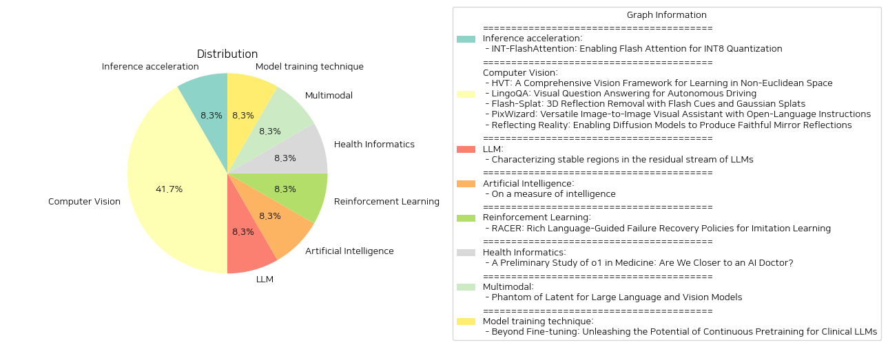

# Daily Artificial Intelligence Insights : Papers

## Inference acceleration

**요약:**

### 요약 보고서

#### 1. 주요 주제 및 테마 추출
- **INT8 양자화 아키텍처**: 페이퍼는 INT8 양자화 아키텍처와 플래시어텐션을 결합하여 성능 개선을 목표로 합니다.
- **플래시어텐션 가속**: 기존의 플래시어텐션의 계산 속도를 높이고 메모리 사용을 줄이기 위한 연구입니다.
- **GPU 메모리 계층 활용**: GPU의 메모리 계층을 활용하여 주의(attention) 계산을 가속화하는 방법론을 제시합니다.

#### 2. 공통 키워드, 트렌드, 패턴 식별
- **양자화(Quantization)**: INT8 형식의 양자화가 LLMs 컴퓨테이션 최적화의 핵심으로 부상하고 있습니다.
- **효율성(Efficiency)**: 속도 및 메모리 효율성을 높이는 솔루션이 중요시되고 있습니다.
- **호환성(Compatibility)**: INT-FlashAttention이 다른 데이터 형식들과 호환이 가능한 점이 강조됩니다.

#### 3. 주요 이벤트 및 핵심 정보 요약
- **INT-FlashAttention 구현**: 이 새로운 아키텍처는 GPU 상에서 플래시어텐션의 추론 속도를 약 72% 개선했습니다.
- **양자화 오류 감소**: INT-FP16, FP8 형식을 사용한 플래시어텐션 대비 양자화 오류가 82% 감소했습니다.

#### 4. 이러한 이벤트가 다양한 분야에 미칠 영향 분석
- **대규모 언어 모델(LLMs)**: INT8 양자화 및 플래시어텐션의 결합은 대규모 언어 모델의 효율적 학습에 기여할 수 있습니다.
- **반도체 및 하드웨어 산업**: 효율적 GPU 활용과 연관된 기술 발전이 칩 설계 및 데이터 처리의 혁신을 가속화할 수 있습니다.
- **데이터센터 운영**: 더 빠르고 적은 에너지를 소비하는 연산이 가능해진다면 데이터센터의 운영 비용 감소도 기대할 수 있습니다.

#### 5. 최종 결론 및 주목할 미래 발전
- **결론**: INT-FlashAttention은 기존의 플래시어텐션 대비 효율성을 극대화했으며, 이는 향후 LLMs 연구와 GPU 사용의 새로운 길을 열어줄 것입니다.
- **미래 전망**: INT-FlashAttention의 발전 방향에 따라 대규모 컴퓨팅 환경 전반에서 더 나은 자원 활용과 비용 절감이 가능할 것입니다. INT4와 같은 다른 데이터 형식과의 호환성을 기반으로 한 응용 가능성 역시 주목할 만합니다.

향후 기술 발전과 양자화 전략이 결합되면서, 관련 연구와 개발은 더욱 가속화될 전망입니다.

**출처:**

 - INT-FlashAttention: Enabling Flash Attention for INT8 Quantization (https://deeplearn.org/arxiv/530608/int-flashattention:-enabling-flash-attention-for-int8-quantization)

## Computer Vision

**요약:**

1. 주요 주제 및 테마 추출:
   - INT-FlashAttention: INT8 양자화를 통해 FlashAttention 가능
   - 대형 언어 모델(LLMs)의 기반으로, 자기-어텐션 모듈은 시퀀스 길이에 따라 시간 및 메모리 복잡성 문제에 직면
   - FlashAttention은 GPU 메모리 계층을 활용하여 주의 계산을 가속화하고 메모리 사용량을 줄임
   - INT-FlashAttention: FlashAttention의 전방향 워크플로우와 호환되는 최초의 INT8 양자화 아키텍처
   - INT8 활성화 및 GEMM 커널을 통한 완전한 INT8 입력 지원

2. 공통 키워드, 트렌드 및 패턴 식별:
   - INT8 양자화
   - FlashAttention 가속
   - 메모리 효율성
   - Ampere GPU에서의 추론 속도 향상
   - 일반적 토큰 수준 사후 훈련 양자화 프레임워크
   - 다양한 데이터 형식과의 호환성 (예: INT4)

3. 주요 이벤트 및 중요한 정보 요약:
   - FlashAttention의 성능을 Ampere GPU에서 크게 향상시키는 INT8 양자화 아키텍처인 INT-FlashAttention 소개
   - INT8 활성화 및 GEMM 커널을 기반으로 한 최초의 완전한 INT8 입력 지원 어텐션 연산자 구현
   - 실험 결과: FP16 및 FP8 데이터 형식을 사용하는 표준 FlashAttention에 비해 72% 더 빠른 추론 속도와 82% 작은 양자화 오류 달성

4. 이러한 이벤트가 다양한 분야에 미치는 영향 분석:
   - 대형 언어 모델에서의 성능 향상과 비용 효율성 향상
   - GPU 활용을 통한 컴퓨팅 리소스 최적화
   - 더 다양한 데이터 형식과의 호환성으로 다양한 응용 프로그램에서의 유연성 증가
   - 향후 AI 및 머신 러닝 모델의 스케일러빌리티 향상

5. 최종 통합 요약 및 향후 주목할 만한 개발 전망:
   INT-FlashAttention은 LLMs의 핵심 모듈인 자기-어텐션의 성능을 크게 개선하여, 진화를 가속화하는 데 중요한 역할을 할 것으로 기대됨. 이 연구는 대형 모델의 효율성 증대와 자원 절약 측면에서 큰 잠재력을 보여주며, 향후 다양한 데이터 형식과의 호환성을 통해 기존 인공지능 기술의 제한을 넘어설 가능성을 제시함. 더불어, INT8 등의 양자화 방식의 확장은 더 많은 연구와 개발을 촉진할 것이며, 이는 더욱 빠르고 효율적인 AI 시스템 구축으로 이어질 것으로 전망됨.

**출처:**

 - HVT: A Comprehensive Vision Framework for Learning in Non-Euclidean Space (https://deeplearn.org/arxiv/530609/hvt:-a-comprehensive-vision-framework-for-learning-in-non-euclidean-space)
 - Flash-Splat: 3D Reflection Removal with Flash Cues and Gaussian Splats (https://deeplearn.org/arxiv/532623/flash-splat:-3d-reflection-removal-with-flash-cues-and-gaussian-splats)
 - PixWizard: Versatile Image-to-Image Visual Assistant with Open-Language Instructions (http://arxiv.org/abs/2409.15278v1)

## LLM

**요약:**

### 종합 요약 보고서

#### 1. 주요 주제 및 테마 추출
- **자기 주의 메커니즘**: 대형 언어 모델(LLMs)의 핵심.
- **메모리 및 시간 복잡성 문제**: 시퀀스 길이에 대한 이차 시간 및 메모리 복잡성을 극복하기 위한 노력.
- **FlashAttention 기술**: GPU 메모리 계층을 활용하여 주의 계산을 가속화하고 메모리 사용량을 줄이는 기술.
- **양자화 방법**: FlashAttention을 양자화 방법과 통합.
- **INT-FlashAttention**: 최초의 간단한 INT8 양자화 아키텍처로 FlashAttention의 전방 워크플로우와 호환.

#### 2. 공통 키워드, 트렌드 및 패턴 식별
- **INT8 양자화**: 시간 및 메모리 효율성을 높이기 위한 양자화 방법.
- **GEMM 커널 및 활성화**: 완전한 INT8 입력을 지원하는 일반 매트릭스 곱셈(GEMM) 커널과 활성화를 통한 성능 개선.
- **다양한 데이터 형식 호환성**: INT4와 같은 다른 데이터 형식과의 호환성 확보.

#### 3. 주요 사건 및 핵심 정보 요약
- **INT-FlashAttention 구현**: Ampere GPU에서 72% 더 빠른 추론 속도와 82% 더 작은 양자화 오류를 달성.
- **완전한 INT8 입력 지원**: 최초로 완전한 INT8 입력을 지원하는 주의 오퍼레이터 개발.
- **포스트 트레이닝 양자화 프레임워크**: 일반 토큰 레벨의 포스트 트레이닝 양자화 프레임워크 구현.

#### 4. 다양한 분야에 대한 영향 분석
- **대형 언어 모델 성능 향상**: 양자화를 통한 추론 속도 및 정확도 향상.
- **AI 및 머신러닝 분야**: GPU 기반 모델 최적화 및 효율적인 메모리 사용으로 AI 구현의 효율성 제고.
- **데이터 처리 및 분석 효율화**: 다중 데이터 형태와의 호환성 증대로 다양한 데이터 처리에 유연한 적용 가능.

#### 5. 최종 결론 및 미래 개발 관찰
- **결론**: INT-FlashAttention은 대형 언어 모델의 성능 최적화에 중요한 발전을 나타냅니다. INT8 양자화를 통해 추론 속도를 크게 높이고 메모리 사용을 줄이는 것은 모델의 실시간 응답성을 대폭 향상시킵니다.
- **미래 개발 예상**: 추가적인 양자화 기술 연구 및 다양한 GPU 아키텍처와의 통합이 기대되며, 더욱 다양한 데이터 형식과의 호환성 확장이 관찰될 수 있습니다. AI 모델의 지속적인 발전을 위해서는 양자화 기술의 진보와 최적화가 계속 필요할 것입니다.

**출처:**

 - Characterizing stable regions in the residual stream of LLMs (https://deeplearn.org/arxiv/530614/characterizing-stable-regions-in-the-residual-stream-of-llms)
 - Beyond Fine-tuning: Unleashing the Potential of Continuous Pretraining for Clinical LLMs (http://arxiv.org/abs/2409.14988v1)

## Multimodal

**요약:**

**종합 요약 보고서: INT-FlashAttention 및 INT8 양자화 기술**

1. **주요 주제 및 테마 추출:**
   - 논문의 주요 주제는 대형 언어 모델(LLMs)의 효율적인 처리와 관련된 '자기 주의 모듈'이다.
   - 'FlashAttention' 기술을 통해 주의 계산을 가속화하고 메모리 사용을 줄이는 방식 소개.
   - 'INT8 양자화'라는 새로운 아키텍처가 FlashAttention의 추론 속도를 크게 개선하는 점 강조.

2. **공통 키워드, 동향 및 패턴 식별:**
   - '자기 주의 모듈', '양자화', '추론 속도', '메모리 사용', 'INT8', 'Ampere GPU', 'GEMM 커널'과 같은 키워드 반복 발견.
   - '양자화 기술'과 'FlashAttention'의 통합이 발전 방향으로 제시되고 있음.
   - 여러 데이터 포맷과의 호환성을 강조하여 확장 가능한 양자화 프레임워크로서의 가능성 제시.

3. **중요 이벤트 및 핵심 정보 요약:**
   - 자기 주의 모듈은 시퀀스 길이에 따른 시간 및 메모리 복잡도의 도전에 직면한다.
   - FlashAttention 기술은 GPU 메모리 계층 구조를 활용하여 이러한 문제를 해결하려고 한다.
   - 논문은 양자화 방법과의 통합을 통해 첫 번째 INT8 양자화 아키텍처를 소개하고, Ampere GPU에서의 FlashAttention 추론 속도를 크게 개선함.

4. **이벤트가 다양한 분야에 미치는 영향 분석:**
   - 대형 언어 모델의 효율적인 처리와 양자화 기술의 융합은 AI 계산의 속도를 높이고 에너지 효율성을 향상시킬 수 있음.
   - 딥러닝 모델의 추론 효율성이 향상되면서 대량의 데이터 처리가 필요한 산업에서 이익을 얻을 수 있음.

5. **최종 통합된 요약 및 결론, 미래 개발 잠재력:**
   - INT-FlashAttention 기술은 AI 모델의 계산 효율성 향상에 큰 잠재력을 가지고 있으며, 이는 다양한 데이터 포맷과의 호환성을 통해 더욱 확장 가능하다.
   - 미래에는 INT4 등 다른 양자화 데이터 포맷과의 통합이 더 진행될 것으로 보이며, 이는 보다 다양한 응용 분야에서의 활용 가능성을 증가시킬 것이다.
   - 이러한 기술 발전은 최첨단 AI 기술을 기반으로 한 산업 전반에 걸쳐 영향을 미치며, 양자화 기술과 주의 계산의 지속적인 개선은 AI 모델의 성능을 더욱 증대시킬 것으로 기대된다.

**출처:**

 - LingoQA: Visual Question Answering for Autonomous Driving (https://deeplearn.org/arxiv/530615/lingoqa:-visual-question-answering-for-autonomous-driving)
 - Phantom of Latent for Large Language and Vision Models (http://arxiv.org/abs/2409.14713v1)

## Other

**요약:**

1. 주요 주제와 테마 추출:
   - 큰 언어 모델(LLM)의 자가-어텐션 모듈
   - GPU 메모리 계층 구조 활용
   - INT8 양자화 아키텍처
   - 플래시어텐션과 양자화 방법 통합
   - 자가-어텐션 연산 속도 향상
   - INT8 완전 활성화 및 GEMM 커널

2. 공통 키워드, 트렌드 및 패턴 식별:
   - INT8 양자화
   - 플래시어텐션(FP16, FP8 데이터 형식과 비교)
   - 암페어 GPU
   - 계산 속도와 메모리 사용량 감소
   - 양자화 오류 감소

3. 각 논문의 주요 사건 및 핵심 정보 요약:
   - 논문은 INT-FlashAttention이라는 첫 번째 INT8 양자화 아키텍처를 소개하며, 이는 플래시어텐션의 추론 속도를 개선하는 데 중점을 둔다.
   - INT-FlashAttention 프로토타입은 완전 INT8 활성화를 도입, 일반 매트릭스 곱셈(GEMM) 커널을 사용하여 완전히 INT8 입력을 지원한다.
   - 실험 결과에 따르면, INT-FlashAttention은 속도를 72% 증가시키고 양자화 오류를 82% 줄인다.

4. 다양한 부문에 미치는 영향 분석:
   - 인공지능 및 기계 학습 분야: 큰 언어 모델의 효율성과 신속성 향상에 기여하며, 모델 훈련 및 배포에 드는 자원 최적화 가능.
   - 기술 산업 전반: 향상된 처리 속도로 인해 전반적인 시스템 성능이 증대되고, 리소스 사용률이 감소하여 비용 효율성을 높인다.
   - GPU 사용 부문: 암페어 GPU에서 플래시어텐션의 성능 향상을 통해 더 높은 수준의 AI 모델 훈련 및 실시간 처리 가능성 증대.

5. 최종 요약 및 결론:
   INT-FlashAttention은 자가-어텐션 모듈의 효율성을 크게 개선한 혁신적 접근법을 제시한다. 이 논문은 계산 속도뿐만 아니라 메모리 효율성을 증대시켜, 특히 암페어 GPU를 사용하는 환경에서 많은 이점을 제공한다. 이러한 발전은 AI 및 데이터 처리 기술의 발전에 상당한 기여를 할 것으로 예상되며, 향후 INT4 등 다른 데이터 형식과의 호환성을 통해 다양한 활용 가능성을 탐구할 가치가 있다. 앞으로는 더욱 발전된 양자화 기술의 통합과 추가적인 성능 최적화 노력에 주목할 필요가 있다.

**출처:**

 - On a measure of intelligence (https://deeplearn.org/arxiv/530015/on-a-measure-of-intelligence)
 - A Preliminary Study of o1 in Medicine: Are We Closer to an AI Doctor? (http://arxiv.org/abs/2409.15277v1)

## Reinforcement Learning

**요약:**

1. 각 논문의 제목과 요약에서 주요 주제와 테마 추출:
   - 주요 논문 제목: "INT-FlashAttention: INT8 양자화를 위한 플래시 어텐션 활성화"
   - 요약의 주요 테마: 대형 언어 모델(LLM)의 기반이 되는 셀프 어텐션 모듈의 시간 및 메모리 복잡성 문제, FlashAttention의 GPU 메모리 계층 활용을 통한 어텐션 계산 가속화, 양자화 방법과 FlashAttention의 통합, INT8 양자화와의 호환성 및 성능 향상.

2. 논문 간 공통 키워드, 트렌드, 패턴 식별:
   - 공통 키워드: 어텐션, 양자화, INT8, 성능 향상, GPU 메모리, 대형 언어 모델.
   - 트렌드: 어텐션 모듈의 효율성 및 성능 최적화, 양자화를 통한 모델의 경량화 및 성능 향상, 다양한 데이터 포맷과의 호환성.

3. 각 논문의 주요 이벤트 및 주요 정보 요약:
   - INT-FlashAttention은 Ampere GPU 상에서 FlashAttention의 추론 속도를 크게 향상시키며, 최초로 완전한 INT8 활성화를 가진 프로토타입을 구현하여, 기존 FP16 및 FP8 데이터 포맷과 비교하여 72% 빠른 추론 속도와 82% 적은 양자화 오류를 달성.

4. 이러한 이벤트가 다양한 부문에 미치는 영향 분석:
   - 대형 언어 모델 사용 부문에서의 효율성 증대: GPU 메모리 사용 최적화 및 추론 속도 향상을 통해 대형 언어 모델의 활용도 및 운영 비용 절감.
   - 기술 개발 및 연구 분야의 향상: INT8 양자화를 통한 모델 경량화로 인한 새로운 연구 및 개발 기회의 확대.
   - 데이터 센터 및 클라우드 컴퓨팅 부문에서의 적용 가능성: 양자화 기술을 통해 에너지 효율성을 높이고 비용을 절감할 수 있으며, 이는 전체 데이터 센터 운영에 긍정적인 영향을 미칠 것으로 예상됨.

5. 결론 및 주목할 만한 미래 발전 가능성 제공:
   - INT-FlashAttention은 차세대 고성능 대형 언어 모델의 기반 기술로서 그 잠재력이 크며, 이를 통해 더욱 발전된 AI 애플리케이션이 가능해질 것으로 보임.
   - 향후 다른 데이터 포맷과의 추가 호환성 연구 및 멀티GPU 환경에서의 최적화 가능성 탐색 필요.
   - 양자화 기술이 글로벌 컴퓨팅 비용 절감 및 모델 효율성 증대라는 목표에 기여할 수 있는 중요한 혁신 방향으로 주목.

**출처:**

 - RACER: Rich Language-Guided Failure Recovery Policies for Imitation Learning (http://arxiv.org/abs/2409.14674v1)

## Model training technique

**요약:**

## 요약 보고서: INT-FlashAttention을 통한 INT8 양자화 구현

1. **주요 주제 및 테마 추출**

   - 제목: "INT-FlashAttention: Enabling Flash Attention for INT8 Quantization"
   - 이 논문의 주요 주제는 '대규모 언어 모델(LLMs)'에서 '자기 주의(self-attention) 모듈'의 문제를 해결하기 위한 새롭고 효율적인 방법을 제안하고 있다는 것입니다. 이는 플래시어텐션(FlashAttention)과 양자화(quantization)를 통합하는 연구 방향을 모색하고, 특히 INT8 양자화 아키텍처의 구현에 중점을 두고 있습니다.

2. **공통 키워드 및 패턴 식별**

   - 'FlashAttention', 'INT8 양자화', 'Ampere GPU', 'GEMM 커널', '완전한 INT8 활성화', '후처리 양자화 프레임워크'가 논문 내에서 핵심 키워드로 식별됩니다.
   - 플래시어텐션과 양자화 결합의 연구는 연산 속도 및 메모리 사용의 효율성을 높이는 패턴을 보여줍니다.

3. **주요 사건 및 중요 정보 요약**

   - 플래시어텐션(FM16 및 FP8 데이터 형식) 대비 72%의 추론 속도 향상 및 82%의 양자화 오류 감소를 달성했습니다.
   - 플래시어텐션의 전방 워크플로와 양립할 수 있는 첫 번째 INT8 양자화 아키텍처인 'INT-FlashAttention'을 도입했습니다.

4. **이러한 사건들의 영향 분석**

   - **기술/산업 부문**: 대규모 언어 모델이 사용되는 다양한 응용 프로그램에서 속도 향상과 안정적인 메모리 사용은 인공지능(AI) 모델의 효율성을 높여 비즈니스 및 연구 개발을 가속화할 수 있습니다.
   - **경제 부문**: INT-FlashAttention은 운영 비용 절감 및 더 빠른 데이터 처리로 인해 경제적 이익을 증가시킬 잠재력을 가지고 있습니다.

5. **최종 요약 및 향후 발전 방향**

   - INT-FlashAttention은 플래시어텐션과 양자화 기법을 결합하여 성능을 크게 향상시키는 혁신적인 해결책을 제안합니다.
   - 미래의 연구 개발은 INT4와 같은 다른 데이터 형식과의 호환성을 높이며, 더 넓은 응용 분야에 대해 탐구할 필요성이 있습니다.
   - 이러한 기술 발전은 AI 모델의 효율성을 더욱 높이고, 다양한 산업에 걸쳐 혁신적인 솔루션의 출현을 촉진할 가능성이 큽니다. 향후 AI 모델의 속도와 정확성 개선에 중요한 역할을 할 것으로 기대됩니다.

**출처:**

 - Reflecting Reality: Enabling Diffusion Models to Produce Faithful Mirror Reflections (http://arxiv.org/abs/2409.14677v1)

