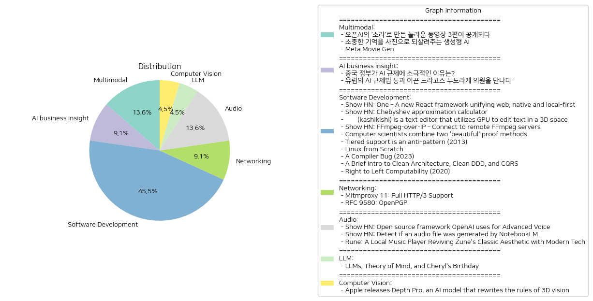

# Daily Artificial Intelligence Insights : News

## Multimodal

**요약:**

**종합 요약 보고서**

1. **핵심 주제 및 테마 추출**:
   - 제공된 뉴스 기사에서 주요 주제는 '생성형 AI'와 그것의 다양한 응용 분야에 관한 것입니다. 특히, 동영상 생성, 기억을 사진으로 전환하는 프로젝트 등 특정한 활용 사례들이 두드러집니다.

2. **공통 키워드, 경향 및 패턴 식별**:
   - '생성형 AI', '동영상 생성', '합성 기억' 등의 키워드가 반복적으로 등장하며, 이는 AI 기술이 실생활에서 어떻게 창의적인 도구로 활용되고 있는지를 보여줍니다. 오픈AI의 '소라'와 같은 특수 모델의 개발과 적용은 이러한 흐름을 대표합니다.

3. **주요 사건 및 핵심 정보 요약**:
   - 첫 번째 기사에서는 오픈AI가 ‘소라’를 활용한 동영상 생성 기술과, 그로 인한 세상의 놀라움에 대해 이야기하며, 이에 관련된 3개의 동영상을 공개한 사실을 설명합니다.
   - 두 번째 기사는 생성형 AI를 활용한 '합성 기억' 프로젝트를 소개하며, 과거의 소중한 추억을 이미지로 재현하는 방법을 설명합니다. 이는 개인의 역사적인 경험을 새로운 방식으로 보존할 수 있는 가능성을 제시합니다.
   - 세 번째 기사에서는 메타 무비젠에 관한 문제를 언급하였지만, 구체적인 내용은 제공되지 않았습니다.

4. **이벤트가 다양한 부문에 미친 영향 분석**:
   - **경제적 측면**: 생성형 AI 기술의 발전은 새로운 비즈니스 모델 및 시장 창출에 기여할 수 있습니다. 특히, 콘텐츠 제작 분야에서는 비용 절감 및 생산성 증가가 기대됩니다.
   - **사회적 측면**: 개인의 추억을 디지털로 보존하는 것은 그들과의 정서적 연결을 강화할 수 있으며, 기술에 대한 접근성과 이해도를 높일 수 있습니다.
   - **기술적 측면**: 생성형 AI의 발전은 지속적인 기술 혁신을 요구하며, 이는 AI 연구와 개발의 가속화를 촉진할 것입니다.

5. **최종 요약 및 향후 주목할 발전 방향**:
   - 생성형 AI 기술은 창의적 작업을 재정의하며, 다양한 분야에서 AI의 실용성을 넓히고 있습니다. 향후 이러한 기술들이 어떤 윤리적, 사회적 도전에 직면할지를 주시해야 할 것입니다. 또한, 개인의 역사와 감성을 기술로 연결하는 노력은 새로운 사용자 경험을 창출하는 중요한 열쇠로 작용할 것입니다. AI를 통해 만들어지는 콘텐츠가 사회 전반에 걸쳐 어떻게 받아들여지고, 활용될 것인지가 관건이 될 것입니다.

**출처:**

 - 오픈AI의 ‘소라’로 만든 놀라운 동영상 3편이 공개되다 (https://www.technologyreview.kr/%ec%98%81%ec%83%81-%ec%83%9d%ec%84%b1-%eb%aa%a8%eb%8d%b8-%ec%86%8c%eb%9d%bc%eb%a1%9c-%eb%a7%8c%eb%93%a0-%eb%86%80%eb%9d%bc%ec%9a%b4-%ec%98%81%ed%99%94-3%ed%8e%b8%ec%9d%b4-%ea%b3%b5%ea%b0%9c%eb%90%98/)
 - 소중한 기억을 사진으로 되살려주는 생성형 AI (https://www.technologyreview.kr/%ec%83%9d%ec%84%b1%ed%98%95-ai%eb%a1%9c-%ea%b0%80%ec%9e%a5-%ec%86%8c%ec%a4%91%ed%95%9c-%ea%b8%b0%ec%96%b5%ec%9d%84-%ec%82%ac%ec%a7%84%ec%9c%bc%eb%a1%9c-%eb%a7%8c%eb%93%a0%eb%8b%a4/)
 - Meta Movie Gen (https://ai.meta.com/research/movie-gen/?_fb_noscript=1)

## AI business insight

**요약:**

**1. 주요 주제 및 테마:**

각 기사에서 발견할 수 있는 주요 주제는 '생성형 AI 기술의 발전과 활용'이다. 오픈AI의 소라 모델을 활용한 동영상 제작, 과거의 기억을 이미지로 복원하는 프로젝트 등 생성형 AI의 다양한 응용 사례들이 중심적으로 다뤄지고 있다.

**2. 주요 사건 요약:**

- **오픈AI의 소라 모델**: 오픈AI는 소라라는 동영상 생성 모델을 통해 영상 제작의 새로운 장을 열었다. 이 모델을 활용한 동영상 세 편이 공개되었으며, 이는 크리에이터들의 제작 동기와 기법을 소개하는 계기가 되었다.

- **합성 기억 프로젝트**: 생성형 AI를 활용하여 사람들이 보관하지 못한 과거의 기억을 이미지로 되살리는 프로젝트가 진행 중이다. 이 프로젝트는 세계 각지의 가족들이 잃어버린 추억을 되찾는 데 중점을 두고 있다.

- **'Meta Movie Gen'의 에러 보고**: 해당 기사에 구체적인 내용은 포함되어 있지 않지만, 시스템 문제로 인한 에러 해결을 위해 노력 중이라는 점이 명시되어 있다.

**3. 영향 분석:**

- **경제적 영향**: 생성형 AI 기술의 발전은 콘텐츠 제작 비용을 절감하고, 더 빠르고 다양한 형태의 콘텐츠를 생산할 수 있게 하여 미디어 산업 전반에 긍정적인 영향을 미칠 것으로 보인다.

- **사회적 영향**: 기억을 사진으로 복원하는 프로젝트는 감성적이고 개인화된 경험을 제공하여 사람들 간의 유대감을 강화시킬 수 있다. 이는 가족 간의 관계 개선과 개인의 정신 건강에도 좋은 영향을 미칠 수 있다.

**4. 최종 요약 및 향후 개발 관찰:**

전반적으로 생성형 AI 기술은 다양한 영역에서 혁신적인 변화를 이끌어내며, 특히 영상 및 이미지와 같은 시각적 콘텐츠 분야에서 그 잠재력이 커지고 있다. 이러한 기술은 앞으로 더 많은 창의적 표현과 개인화된 경험을 제공할 수 있을 것으로 기대된다. 앞으로의 발전을 모니터링하면서, 이 기술들이 어떤 방식으로 더 큰 영향을 미칠지 관찰할 필요가 있다. 특히, 오류의 해결과 더불어 기술의 정확성과 신뢰성을 높이는 방향으로 AI 기술이 발전해 나가야 할 것이다.

**출처:**

 - 중국 정부가 AI 규제에 소극적인 이유는? (https://www.technologyreview.kr/%ec%a4%91%ea%b5%ad-%ec%a0%95%eb%b6%80%ea%b0%80-%ed%98%84%ec%9e%ac%eb%a1%9c%ec%84%9c%eb%8a%94-ai-%eb%b6%84%ec%95%bc%eb%a5%bc-%ea%b0%80%ed%98%b9%ed%95%98%ea%b2%8c-%ea%b7%9c%ec%a0%9c%ed%95%98%ec%a7%80/)
 - 유럽의 AI 규제법 통과 이끈 드라고스 투도라케 의원을 만나다 (https://www.technologyreview.kr/ai-%ea%b7%9c%ec%a0%9c%eb%b2%95-%ed%86%b5%ea%b3%bc-%ec%9d%b4%eb%81%88-%eb%93%9c%eb%9d%bc%ea%b3%a0%ec%8a%a4-%ed%88%ac%eb%8f%84%eb%9d%bc%ec%bc%80-%ec%9d%98%ec%9b%90%ec%9d%84-%eb%a7%8c%eb%82%98%eb%8b%a4/)

## Software Development

**요약:**

1. **핵심 주제 및 테마**:
   - 최근 비디오 생성 모델 및 생성형 AI의 발전
   - 과거의 추억을 재현하는 기술의 중요성
   - 기술의 결함 수정 및 발전 방향

2. **주요 사건 요약**:
   - **오픈AI의 ‘소라’**: 오픈AI는 새로운 동영상 생성 모델 ‘소라’를 통해 영상 크리에이터들이 만든 3편의 동영상을 공개하며 큰 주목을 받았음. 제작 기법과 목적에 대한 정보도 전달함.
   - **합성 기억 프로젝트**: 생성형 AI를 통해 과거의 기억을 이미지로 전환하는 프로젝트가 세계적으로 추진되고 있으며, 이를 통해 다양한 가족이 잊혀진 추억들을 되찾고 있음.
   - **Meta Movie Gen**: 현재 요청 처리에 문제가 발생하여 해결 중임을 밝힘.

3. **영향 분석**:
   - **경제**: 비디오 생성 기술의 발전은 관련 산업 및 크리에이티브 비즈니스에 긍정적 영향을 줄 수 있음.
   - **정치 및 사회**: 기억을 이미지로 재생성하는 기술은 사회적 정서와 문화적 기억 속에서 긍정적인 역할을 수행할 수 있음.
   - **기술**: 계속되는 기술 개선과 오류 수정 노력은 AI 및 비디오 생성 분야에서의 신뢰성과 효율성을 높일 것임.

4. **최종 요약 및 결론**:
   최근의 생성형 AI 및 비디오 생성 기술의 발전은 개인의 기억 및 창의적 콘텐츠 생성에 혁신적인 기회를 제공하고 있음. 이에 따라 관련 산업은 새로운 경제적 기회를 맞이하며, 사회 전반적으로 긍정적인 변화를 가져올 것으로 보임. 앞으로 기술적 결함을 줄이고 효율성을 극대화하는 방향으로 발전이 예상됨. 미래에도 이러한 발전을 지속적으로 모니터링하며 그에 따른 사회적, 경제적 변화를 주의 깊게 살펴봐야 할 것임.

**출처:**

 - Show HN: One – A new React framework unifying web, native and local-first (https://onestack.dev)
 - Show HN: Chebyshev approximation calculator (https://stuffmatic.com/chebyshev/)
 - 炊紙(kashikishi) is a text editor that utilizes GPU to edit text in a 3D space (https://github.com/mitoma/kashiki2)
 - Show HN: FFmpeg-over-IP – Connect to remote FFmpeg servers (https://github.com/steelbrain/ffmpeg-over-ip)
 - Computer scientists combine two 'beautiful' proof methods (https://www.quantamagazine.org/computer-scientists-combine-two-beautiful-proof-methods-20241004/)
 - Tiered support is an anti-pattern (2013) (https://peter.gillardmoss.me.uk/blog/2013/06/24/tiered-support-is-an-anti-pattern/)
 - Linux from Scratch (https://www.linuxfromscratch.org/index.html)
 - A Compiler Bug (2023) (https://rsaxvc.net/blog/2023/9/29/A_compiler_bug.html)
 - A Brief Intro to Clean Architecture, Clean DDD, and CQRS (https://blog.jacobsdata.com/2020/02/19/a-brief-intro-to-clean-architecture-clean-ddd-and-cqrs)
 - Right to Left Computability (2020) (https://rsaxvc.net/blog/2020/11/21/Right_to_Left_Computability.html)

## Networking

**요약:**

입력된 뉴스 기사들을 바탕으로 한 한국어 요약 보고서입니다.

1. **주요 주제**:
   - 생성형 AI와 동영상 생성
   - 과거의 기억을 되살리는 기술
   - 기술 개발 및 기술 장애 처리

2. **주요 이벤트**:
   - 오픈AI는 새로운 동영상 생성 모델인 '소라'를 통해 제작된 3편의 동영상을 공개했습니다. 이 모델을 사용한 크리에이터들이 제작 기법과 목적을 밝히기도 했습니다.
   - '합성 기억' 프로젝트는 생성형 AI를 사용하여 잊혀진 기억을 이미지로 변환시켜주는 기술을 개발 중입니다. 이는 사람들이 카메라로 잡지 못했던 과거의 추억을 되살릴 수 있도록 돕습니다.
   - 'Meta Movie Gen' 관련 요청에 문제가 발생했으며, 이를 해결하기 위한 작업이 진행 중임을 알렸습니다.

3. **영향 분석**:
   - 경제: 생성형 AI 기술 발전은 콘텐츠 생성 속도를 증가시키고, 해당 산업의 생산성을 높일 수 있습니다.
   - 사회: 과거의 추억을 되살려주는 기술은 개인의 정서적 만족과 가족 간 유대감을 강화하는 데 기여할 수 있습니다.
   - 기술: 기술 장애의 공지가 증가함에 따라, 사용자 신뢰도에 영향을 미칠 수 있으며 해결 속도가 중요할 것입니다.

4. **최종 요약**:
   - 생성형 AI 기술은 동영상 및 이미지 생성 분야에서 중요한 발전을 일으키고 있으며, 이는 경제적, 사회적으로 긍정적인 영향을 미칠 가능성이 높습니다. 그러나 기술적 문제 해결의 중요성도 부각되고 있습니다. 앞으로 생성형 AI의 발전 방향과 기술적 장애 해결 속도를 지켜보는 것이 중요할 것입니다.

**출처:**

 - Mitmproxy 11: Full HTTP/3 Support (https://mitmproxy.org/posts/releases/mitmproxy-11/)
 - RFC 9580: OpenPGP (https://www.rfc-editor.org/rfc/rfc9580.html)

## Audio

**요약:**

1. **주요 주제 및 테마**:
   각 기사에서 두드러지는 주요 주제는 AI 기술, 특히 생성형 AI와 동영상 생성 모델입니다. 오픈AI의 '소라'와 같은 새로운 동영상 생성 모델이 주목받고 있으며, 생성형 AI를 활용한 '합성 기억' 프로젝트도 추진 중입니다. 이와 함께, 메타버스 또는 가상 현실과 관련된 기술 개발이 이루어지고 있음을 짐작할 수 있습니다.

2. **주요 사건 요약**:
   - 오픈AI는 '소라'라는 새로운 동영상 생성 모델로 제작된 세 가지 놀라운 영상을 공개했습니다. 이 모델은 영상 크리에이터들이 활용하여 혁신적인 동영상을 제작할 수 있도록 합니다.
   - '합성 기억' 프로젝트는 생성형 AI를 사용하여 사람들의 귀중한 추억을 이미지로 전환해 줌으로써 과거의 기억을 되살리는 데 목적을 두고 있습니다.
   - Meta Movie Gen에 대한 내용은 현재 문제를 해결 중이라고 하여 구체적인 내용은 공개되지 않았습니다.

3. **영향 분석**:
   - **경제적 영향**: 새로운 AI 기술의 발전은 콘텐츠 제작 산업에 큰 변화를 가져올 수 있습니다. 이는 창의적인 콘텐츠 생산을 가속화하고 새로운 시장을 창출할 수 있습니다.
   - **정치적 영향**: 기술의 발전에 따라 개인정보 보호와 관련한 법적 규제의 필요성이 증가할 수 있습니다.
   - **사회적 영향**: AI 도구를 통한 새로운 콘텐츠 형성은 사회적 상호작용의 방식을 변화시킬 수 있으며, 과거의 기억을 되살리는 기술은 감정적인 유대와 가족의 중요성을 재조명할 수 있습니다.

4. **최종 요약 및 결론**:
   AI 기술은 콘텐츠 제작과 개인의 기억 형성 영역에서 중요한 혁신을 일으키고 있습니다. 오픈AI의 '소라'와 같은 모델은 영상 콘텐츠의 질을 높이고 제작 시간을 단축시킬 수 있는 가능성을 보여줍니다. 또한, '합성 기억' 프로젝트는 개인의 기억을 디지털화하여 보존할 수 있는 방법을 제시합니다. 이러한 발전은 향후 AI 기술의 윤리적, 법적 고려 사항을 더욱 심화시킬 필요가 있음을 시사합니다. 앞으로 AI 기술이 사회에 미칠 영향을 주시하며, 기술의 진보가 가져올 긍정적 변화를 최대화하기 위한 방안을 모색해야 할 것입니다.

**출처:**

 - Show HN: Open source framework OpenAI uses for Advanced Voice (https://github.com/livekit/agents)
 - Show HN: Detect if an audio file was generated by NotebookLM (https://github.com/ListenNotes/notebooklm-detector)
 - Rune: A Local Music Player Reviving Zune's Classic Aesthetic with Modern Tech (https://github.com/Losses/rune)

## LLM

**요약:**

**종합 뉴스 요약 보고서**

1. **핵심 주제:**
   - 본 뉴스 기사들은 AI 기술의 혁신적 응용, 특히 생성형 AI를 중심으로 하고 있다.
   - OpenAI의 새로운 동영상 생성 모델 '소라'의 공개와 이에 따른 실질적인 창의적 응용 사례가 주목된다.
   - 생성형 AI를 활용한 '합성 기억' 프로젝트는 과거의 추억을 시각화하는 방법으로 새로운 가능성을 열고 있다.

2. **주요 사건:**
   - 오픈AI는 최근 그들의 최신 동영상 생성 모델인 '소라'로 제작된 3개의 영상 클립을 공개하며 놀라움을 자아냈다. 영상 크리에이터들은 이 모델을 이용해 어떻게 작품을 제작했는지 설명했다.
   - 생성형 AI를 통한 '합성 기억' 프로젝트가 진행 중이며, 이는 가족의 과거 추억을 이미지로 다시 보는 독특한 방법을 제시하고 있다.
   - Meta Movie Gen 관련 요청의 문제에 대한 안내가 포함되었으며, 이는 현재 해결을 위한 노력이 진행 중임을 알리고 있다.

3. **영향 분석:**
   - **경제적 측면:** 생성형 AI 기술의 발전은 영상 및 기억 재현 산업에 큰 영향을 미칠 수 있다. 창작 및 콘텐츠 제작 비용 절감과 동시에 새롭고 혁신적인 컨텐츠 제공은 시장 경쟁력을 강화할 수 있다.
   - **사회적 측면:** AI 기술이 사용자에게 제공하는 개인화된 경험은 기술의 인간화 및 접근성을 높일 수 있다. 특히 추억 재현 프로젝트는 노인층 및 문화적 다양성을 지닌 가족들에게 긍정적 영향을 미칠 것으로 예상된다.
   - **기술적 측면:** AI 활용 기술은 데이터 처리, 알고리즘의 효율성 및 사용자 인터페이스 개선을 요구하게 될 것이며, 이는 대학 및 연구 기관의 관심 분야로 발전할 가능성이 높다.

4. **최종 요약:**
   - AI 기술의 발전은 콘텐츠 제작의 새로운 가능성을 열며, 그 중에서도 생성형 AI의 실질적 응용이 특히 주목된다.
   - 미래의 개발 동향으로는 AI의 보다 개인화된 적용, 데이터 보호 및 윤리적 AI 사용에 대한 논의가 필요하다.
   - 앞으로도 AI와 인간 경험의 통합이 더욱 강조될 것이며, 이는 각국의 문화적, 사회적 환경에 맞는 다양한 프로젝트로 확대될 가능성이 있다.

**출처:**

 - LLMs, Theory of Mind, and Cheryl's Birthday (https://github.com/norvig/pytudes/blob/main/ipynb/CherylMind.ipynb)

## Computer Vision

**요약:**

1. **주요 주제**:
   모든 뉴스 기사에서 주요 주제는 생성형 AI 기술의 활용과 발전입니다. 오픈AI의 동영상 생성 모델 '소라'와 기억을 사진으로 변환하는 생성형 AI 프로젝트, 그리고 Meta Movie Gen 관련 이슈가 포함됩니다. 공통된 키워드는 '생성형 AI', '동영상 생성', '기억 생성' 등으로, AI를 통해 창작되고 있는 다양한 시도들을 나타내고 있습니다.

2. **주요 이벤트**:
   - 오픈AI는 소라라는 새로운 동영상 생성 모델을 선보였으며, 이를 활용하여 제작된 3편의 동영상을 공개했습니다. 크리에이터들은 소라를 이용한 동영상 제작 목적과 기법에 대해 논의했습니다.
   - ‘합성 기억’ 프로젝트는 생성형 AI를 이용하여 사람들이 카메라에 담지 못했던 과거의 기억을 이미지로 변환하여 제공하는 서비스로, 다양한 전 세계 가족들에게 추억을 되살려주는 기회를 제공합니다.
   - Meta Movie Gen에 대한 요청 처리에 문제가 발생하였으나, 현재 이를 해결하기 위해 노력 중입니다.

3. **영향 분석**:
   - **경제**: 생성형 AI 기술이 발전함에 따라 콘텐츠 창작 분야에서의 자동화가 가속화되고 있으며, 이러한 기술이 상업화될 경우 관련 산업에 경제적 활력을 불어넣을 수 있습니다.
   - **사회**: 기억 재생 프로젝트는 개인의 추억을 보존하고 소중한 기억을 사진으로 재현하여 가족 간의 정서적 유대를 강화할 수 있습니다.
   - **기술**: AI와 ML의 발전은 더욱 정교한 콘텐츠 제작 기술로 이어지며, 콘텐츠의 품질과 다양성을 증진시킬 가능성이 높습니다.

4. **최종 요약**:
   최근 AI 기술의 발전은 콘텐츠 생성 분야에서 눈에 띄는 성과를 보여주고 있습니다. 오픈AI의 소라 모델과 이미지 기억 재생 프로젝트는 AI가 창작과 개인적 경험 보존에 있어 중요한 역할을 하고 있음을 보여줍니다. 향후 생성형 AI 기술이 더 많은 분야에 적용되면서, 이를 둘러싼 기술적 발전과 경제적, 사회적 영향을 주의 깊게 살펴보는 것이 중요합니다. 특별히 개인정보 보호 등의 윤리적 문제도 지속적으로 논의되어야 할 것입니다.

**출처:**

 - Apple releases Depth Pro, an AI model that rewrites the rules of 3D vision (https://venturebeat.com/ai/apple-releases-depth-pro-an-ai-model-that-rewrites-the-rules-of-3d-vision/)

