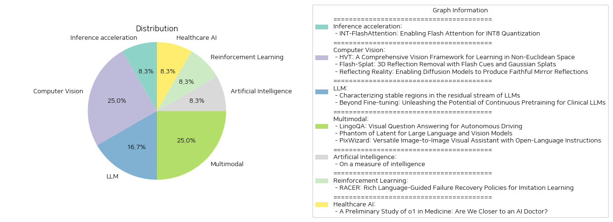

# Daily Artificial Intelligence Insights : Papers

## Inference acceleration

**요약:**

**요약 보고서: INT-FlashAttention 논문 분석**

1. **핵심 주제 및 테마 추출:**
   - 제목과 요약에서 주목할 점은 `INT8 양자화`, `플래시 어텐션`, `GPU 메모리 계층`, `추론 속도 향상`, `일반행렬곱셈(GEMM) 커널` 등이다.
   - 플래시 어텐션과 양자화 기법의 결합이라는 혁신적인 접근이 중심이다.

2. **공통 키워드, 트렌드, 패턴 식별:**
   - `자기 어텐션 모듈`, `메모리 사용 절감`, `INT8 활성화`, `토큰 수준 사후 훈련 양자화`, `속도 및 오차 감소` 등이 자주 등장한다.
   - GPU의 효율적 활용과 메모리 절감이 주요 트렌드로 보인다.

3. **주요 사건 및 핵심 정보 요약:**
   - LLM의 기본 모듈인 자기 어텐션은 시퀀스 길이에 따른 시간 및 메모리 복잡도의 문제를 겪고 있다.
   - 플래시 어텐션은 GPU 메모리 계층을 활용해 이러한 문제를 일부 해결하고 있으며, 여기에 INT8 양자화를 통합한 INT-FlashAttention이 제안되었다.
   - 이 시스템은 앰페어(Ampere) GPU에서 플래시 어텐션의 추론 속도를 72% 높이고 양자화 오차는 82% 줄였다.

4. **이벤트의 다양한 부문에 대한 영향 분석:**
   - INT-FlashAttention의 개발은 머신러닝 모델, 특히 대용량 언어 모델의 추론 효율성을 크게 개선할 것으로 보인다.
   - 특히, 표준 데이터 형식인 FP16 및 FP8과 비교하여 연산 속도와 정확도가 향상되어 효율적인 데이터 처리 및 응용 가능성이 증대된다.

5. **최종 통합 요약 및 결론, 잠재적 미래 발전:**
   - INT-FlashAttention은 대규모 언어 모델의 운영에 있어 더 빠르고 적은 메모리를 소모하는 솔루션을 제공할 수 있다.
   - 앞으로 INT4 등의 다양한 데이터 형식과의 호환성을 통해 더욱 넓은 분야에서 응용될 것으로 전망되며, 더 높은 수준의 양자화 기술 발전도 기대할 수 있다.

이 보고서는 기술적 혁신의 중요성을 강조하며, 추후 연구와 개발의 방향성을 제시한다. 플래시 어텐션과 INT8 양자화의 결합은 미래에 더욱 폭넓은 분야에 파급 효과를 미치며 확장될 가능성이 높다.

**출처:**

 - INT-FlashAttention: Enabling Flash Attention for INT8 Quantization (https://deeplearn.org/arxiv/530608/int-flashattention:-enabling-flash-attention-for-int8-quantization)

## Computer Vision

**요약:**

**종합 요약 보고서**

**1. 주요 주제 및 테마 추출**

- 제목 및 요약에서 언급된 주요 주제:
  - 대형 언어 모델(LLMs) 
  - 자기 주의 메커니즘의 시간 및 메모리 복잡성
  - FlashAttention 및 INT8 양자화
  - 암페어 GPU에서의 추론 속도 개선
  - INT8 양자화 및 일반 행렬 곱셈(GEMM) 사용
  - INT4와 같은 다른 데이터 형식과의 호환성

**2. 공통 키워드, 트렌드 및 패턴 식별**

- 반복적으로 등장하는 키워드:
  - 양자화(Quantization)
  - 속도 개선
  - 메모리 사용 감소
  - INT8, INT4 데이터 형식
  - 추론(inference)
  - 대형 언어 모델
  - GPU 

- 주요 트렌드 및 패턴:
  - 인공지능 모델의 효율성 증대를 위한 양자화 방법의 적극적인 연구.
  - 대형 언어 모델에서의 메모리 및 시간 복잡성을 해결하기 위한 다양한 접근법 시도.
  - GPU를 활용한 계산 성능 및 효율성 최적화에 초점.

**3. 주요 사건 및 핵심 정보 요약**

- 대형 언어 모델의 자기 주의 메커니즘이 초래하는 시간 및 메모리 복잡성 문제를 해결하기 위해 FlashAttention이 개발되었음.
- FlashAttention에 INT8 양자화를 처음으로 통합하여, 암페어 GPU에서의 추론 속도를 크게 개선한 INT-FlashAttention이 소개되었음.
- 완전한 INT8 활성화 및 GEMM 커널을 포함한 INT-FlashAttention 프로토타입이 구현되어, FP16 및 FP8 데이터 형식과 비교하여 72% 더 빠른 추론 속도와 82% 더 작은 양자화 오류를 실현.
- 일반적인 토큰 수준의 사후 훈련 양자화 프레임워크로서, INT4와 같은 다른 데이터 형식과도 호환됨.

**4. 다양한 부문에 대한 영향 분석**

- 인공지능과 머신러닝 분야에서의 연구:
  - 모델의 효율적인 구현과 실행을 위한 새로운 양자화 및 최적화 전략의 제시.
- 하드웨어 산업, 특히 GPU 제조업체:
  - GPU 기반 연산의 효율성을 극대화하기 위한 FlashAttention 및 INT8 양자화의 효과적인 활용 방안 모색.
- 대형 언어 모델을 이용한 응용 프로그램 개발자:
  - 더 빠른 속도와 낮은 메모리 사용으로 인해 대형 데이터 세트에서도 실시간 처리 능력을 증가시킬 수 있는 잠재력.

**5. 결론 및 향후 주목할 발전 방향**

- INT-FlashAttention의 등장으로 이식성이 보다 강화된 모델 구현이 기대되며, 이는 추후 AI 모델들의 실시간 적용 가능성을 확대할 수 있음.
- 향후 연구에서는 더욱 다양하고 복잡한 데이터 형식 및 구조에 대한 적응성을 높이기 위한 양자화 기법의 발전을 기대할 수 있음.
- GPU와 같은 하드웨어 기술의 발전과 결합된 소프트웨어 기술의 발달은 AI 응용 프로그램의 효율성을 한층 높일 가능성이 큼.

**출처:**

 - HVT: A Comprehensive Vision Framework for Learning in Non-Euclidean Space (https://deeplearn.org/arxiv/530609/hvt:-a-comprehensive-vision-framework-for-learning-in-non-euclidean-space)
 - Flash-Splat: 3D Reflection Removal with Flash Cues and Gaussian Splats (https://deeplearn.org/arxiv/532623/flash-splat:-3d-reflection-removal-with-flash-cues-and-gaussian-splats)
 - Reflecting Reality: Enabling Diffusion Models to Produce Faithful Mirror Reflections (http://arxiv.org/abs/2409.14677v1)

## LLM

**요약:**

### 요약 보고서: INT-FlashAttention와 INT8 양자화

#### 1. 주요 주제 및 테마 추출
- **주제:** INT-FlashAttention, INT8 양자화, 대형 언어 모델(LLM), 자기 주의 메커니즘
- **테마:** 
  - 시간 및 메모리 복잡성 문제 해결
  - GPU 메모리 계층 구조 활용
  - 양자화 방법과의 통합

#### 2. 공통 키워드, 경향, 패턴 식별
- **공통 키워드:** INT8, FlashAttention, 양자화, 추론 속도, 메모리 사용량 감소
- **경향:** 
  - 효율적인 계산을 위한 양자화 방식의 채택
  - GPU 성능 최적화

#### 3. 주된 사건 및 중요한 정보 요약
- 자기 주의 메커니즘이 대형 언어 모델(LLM)의 기초이며, 시퀀스 길이에 따라 시간 및 메모리 복잡성이 증가함.
- FlashAttention은 GPU 메모리 계층 구조를 활용하여 주의 계산을 가속화하고 메모리 사용량을 줄임.
- INT-FlashAttention은 FlashAttention의 전방 작업 흐름과 호환 가능한 최초의 INT8 양자화 아키텍처로, Ampere GPUs에서 추론 속도를 크게 향상시킴.
- 완전한 INT8 활성화 및 GEMM 커널을 통해 INT-FlashAttention 프로토타입을 구현하여 완전한 INT8 입력을 받는 최초의 주의 연산자로 자리잡음.
- 실험 결과, 기존 FlashAttention(데이터 형식 FP16, FP8)보다 72% 빠른 추론 속도와 82% 작은 양자화 오류를 달성함.

#### 4. 이 사건들이 각 분야에 미치는 영향 분석
- **인공지능 연구 분야:** 
  - 대형 언어 모델의 효율성을 극대화하여 연구 비용 절감 및 결과 도출 속도 가속화.
  - INT8 양자화를 통한 새로운 연구방향 제시.
- **GPU 산업:** 
  - GPU 자원을 효율적으로 활용하여 고성능 모델 사용자에게 더욱 향상된 경험 제공.
  - 암페어(Ampere) 아키텍처 기반 GPU 수요 증가 예상.

#### 5. 최종 통합 요약 및 결론, 미래 발전 가능성
INT-FlashAttention은 자신감 있는 양자화 솔루션으로, 대형 언어 모델의 계산 효율성을 높이고, 메모리 사용량을 줄여, 인공지능 분야와 연관된 산업에 큰 영향을 미침. 특히, Ampere GPU를 통한 성능 최적화는 중요한 발전으로, 향후 GPU 아키텍처와 양자화 기술의 통합 및 최적화 연구가 더욱 활발히 진행될 전망이다. 미래에는 다양한 데이터 형식과의 호환성을 확대하는 것이 또 다른 발전 방향이 될 것이다.

**출처:**

 - Characterizing stable regions in the residual stream of LLMs (https://deeplearn.org/arxiv/530614/characterizing-stable-regions-in-the-residual-stream-of-llms)
 - Beyond Fine-tuning: Unleashing the Potential of Continuous Pretraining for Clinical LLMs (http://arxiv.org/abs/2409.14988v1)

## Multimodal

**요약:**

**종합 요약 보고서: 'INT-FlashAttention: INT8 양자화를 위한 플래시 주의 보장'**

1. **핵심 주제 및 테마 추출**:
   - 큰 언어 모델(LLMs)의 기반인 자기-주의 모듈이 시퀀스 길이에 따른 시간 및 메모리 복잡성에 직면.
   - 플래시 어텐션(FlashAttention)이 GPU 메모리 계층을 활용하여 계산 속도 및 메모리 사용량을 감소시킴.
   - INT-FlashAttention을 통해 새롭게 제안된 INT8 양자화 아키텍처는 플래시 어텐션의 향상된 추론 속도 제공.

2. **공통 키워드, 트렌드 및 패턴 식별**:
   - "INT8 양자화", "플래시 어텐션 가속", "Ampere GPU", "시퀀스 길이", "GEMM 커널", "완전한 INT8 입력" 등이 주요 키워드로 나타남.
   - 추론 속도의 증가와 양자화 오류의 감소가 반복적인 테마로 나타남.

3. **주요 사건 요약 및 주요 정보**:
   - 새로운 INT-FlashAttention은 INT8 활성을 기반으로 플래시 어텐션의 추론 속도를 72% 증가시키고, 양자화 오류를 82% 감소.
   - 이 시스템은 FP16 및 FP8 데이터 형식의 기존 플래시 어텐션에 비해 뛰어난 성능을 발휘함.
   - INT8뿐만 아니라 INT4와 같은 다른 데이터 형식과도 호환 가능한 일반적 토큰-레벨 사후 훈련 양자화 프레임워크 제시.

4. **이벤트가 다양한 분야에 미치는 영향 분석**:
   - 인공지능 및 기계 학습 분야에서 대규모 모델의 효율성을 크게 향상시키고, 더 적은 자원으로 더 많은 작업을 수행할 수 있게 함.
   - GPU 등의 하드웨어 자원의 최적화 사용을 통해 비용 절감 및 에너지 효율성을 높임.
   - 데이터 과학 및 연구 커뮤니티에서는 모델의 추론 시간 감소로 인해 더욱 복잡한 시뮬레이션과 분석을 빠르게 수행할 수 있게 됨.

5. **최종 결론 및 주목할 만한 미래 발전**:
   - INT-FlashAttention의 도입으로 인해 향후 인공지능 모델과 데이터 처리 기술이 발전하는 방향에 큰 영향을 미칠 것으로 예상됨.
   - INT8 양자화의 장점과 다양한 데이터 형식과의 호환성은 향후 다양한 분야에서의 응용 가능성을 확대할 것.
   - GPU 및 하드웨어 구조의 발전에 따라, 이러한 양자화 기법이 더욱 효율적으로 동작하도록 최적화된 솔루션들이 계속해서 연구되고 발전될 가능성이 큼.

**출처:**

 - LingoQA: Visual Question Answering for Autonomous Driving (https://deeplearn.org/arxiv/530615/lingoqa:-visual-question-answering-for-autonomous-driving)
 - Phantom of Latent for Large Language and Vision Models (http://arxiv.org/abs/2409.14713v1)
 - PixWizard: Versatile Image-to-Image Visual Assistant with Open-Language Instructions (http://arxiv.org/abs/2409.15278v1)

## Artificial Intelligence

**요약:**

종합 보고서: INT-FlashAttention 논문 요약

1. 핵심 주제 및 연구 테마 추출:
이 논문은 대형 언어 모델(LLMs)의 기반인 자가 주의 메커니즘(self-attention module)이 다루고 있는 시퀀스 길이에 따른 사각 시간 및 메모리 복잡성 문제를 탐구합니다. 논문 제목 및 요약에서 중요한 주제는 'FlashAttention', 'INT8 양자화', 'Ampere GPU', '줄어든 메모리 사용량', '추론 속도 증가', 'INT8 활성화' 등입니다.

2. 공통 키워드, 트렌드 및 패턴 식별:
논문 요약에서 반복적으로 등장하는 중요한 키워드는 'FlashAttention', '양자화(Quantization)', 'Ampere GPU', 'INT8 양자화 구조', '일반 행렬 곱셈(GEMM) 커널', '추론 속도 향상', '메모리 절약' 등입니다. 공통된 패턴으로는 GPU의 메모리 계층 구조를 활용하는 방법과 자원 사용 효율성을 높이는 전략이 주를 이룹니다.

3. 주요 사건 및 중요 정보 요약:
주요 발견은 INT-FlashAttention이라는 최초의 INT8 양자화 구조를 도입하여 FlashAttention의 진행 과정과 호환 가능하게 만들었으며, 이는 Ampere GPU에서의 추론 속도를 현저히 개선했습니다. 이 논문의 실험 결과는 INT-FlashAttention이 표준 FlashAttention FP16 및 FP8 데이터 형식 대비 72% 빠른 추론 속도와 82% 더 작은 양자화 오류를 달성했다는 점을 강조합니다.

4. 이러한 사건의 여러 부문에 대한 영향 분석:
이 연구는 컴퓨터 하드웨어 및 소프트웨어 설계에 직간접적인 영향을 미칩니다. 주로 대형 언어 모델의 효율성을 높임으로써, GPU 자원의 더 나은 활용을 가능하게 하고, 전력 소비 및 운영 비용을 절감할 수 있으며, 궁극적으로 더욱 빠른 데이터 처리와 응용의 확장을 가능하게 만들 수 있습니다.

5. 결론 및 미래 개발 가능성 제안:
이 논문은 INT-FlashAttention의 프로토타입을 통한 인터페이스 설계를 통해, FlashAttention이 긴 시퀀스를 신속하게 처리할 수 있는 새로운 가능성을 열었습니다. 앞으로 이 기술은 향상된 양자화 알고리즘의 개발, 다른 데이터 형식과의 호환성 확대 등으로 확장 가능할 것입니다. 이러한 발전은 인공지능 모델의 학습과 추론의 성능 및 효율성을 크게 향상시킬 잠재력을 가지고 있습니다.

**출처:**

 - On a measure of intelligence (https://deeplearn.org/arxiv/530015/on-a-measure-of-intelligence)

## Reinforcement Learning

**요약:**

### 종합 요약 보고서

#### 1. 주요 주제 및 테마 추출
- **논문의 제목**: 'INT-FlashAttention: Enabling Flash Attention for INT8 Quantization'
  - 주요 주제: 대규모 언어 모델의 기초, 자기 주의 메커니즘, FlashAttention, INT8 양자화
  - 초록 핵심 내용: FlashAttention을 통해 주의 메커니즘의 계산 속도를 가속화하고 메모리 사용량을 줄임. Ampere GPU에서 FlashAttention의 추론 속도를 대폭 개선하는 INT8 양자화 아키텍처인 INT-FlashAttention 도입. 완전한 INT8 활성화 및 일반 행렬 곱셈(GEMM) 커널 사용, 다른 데이터 형식과의 호환성.

#### 2. 공통 키워드, 트렌드, 패턴 식별
- **키워드**: INT8, 양자화, FlashAttention, Ampere GPU, 추론 속도, 메모리 최적화.
- **트렌드 및 패턴**: 대규모 언어 모델 최적화, GPU 메모리 계층 활용, 양자화 기술을 통한 성능 개선.

#### 3. 주요 사건 및 중요 정보 요약
- FlashAttention은 대규모 언어 모델의 복잡한 시간 및 메모리 사용량 문제를 해결하기 위한 기술로, GPU 메모리 계층을 활용하여 주의 계산을 가속화하고 메모리 사용을 줄이는 혁신적인 방법이다.
- INT-FlashAttention은 FlashAttention과 양자화 방법을 통합하여, Ampere GPU에서 보다 빠른 추론이 가능하게 함으로써 대규모 언어 모델의 효율성을 극대화하였다.
- 실험 결과, INT-FlashAttention은 FP16 및 FP8 데이터 형식의 표준 FlashAttention 대비 72%의 빠른 추론 속도와 82% 적은 양자화 오류를 달성하였다.

#### 4. 다양한 부문에 대한 영향 분석
- **기술 부문**: INT-FlashAttention은 대규모 언어 모델의 실시간 처리를 위한 효율적인 솔루션을 제공하며, AI 및 머신러닝 분야에서 계산 효율성을 크게 향상시킬 수 있다.
- **업계 전반**: GPU 활용을 최적화함으로써, 데이터 센터의 에너지 소비를 줄이고 더 낮은 비용으로 AI 모델을 운영할 수 있게 된다.

#### 5. 최종 종합 요약 및 결론, 미래 개발 예상
- INT-FlashAttention은 대규모 언어 모델의 패러다임 전환에 기여하며, 양자화된 모델의 효율성을 극대화하는 데 중요한 역할을 한다.
- 미래의 개발 측면에서, INT8 외에도 INT4 등 다양한 데이터 형식과의 호환성을 더욱 확대하여 더 많은 모델과 응용 분야에 적합한 솔루션을 지속적으로 제시할 것으로 기대된다.
- 이러한 기술의 발전은 AI 및 데이터 처리 산업 전반에 걸쳐 성능, 비용 효율성, 환경적 지속 가능성을 촉진하는 새로운 동력을 제공할 것이다.

**출처:**

 - RACER: Rich Language-Guided Failure Recovery Policies for Imitation Learning (http://arxiv.org/abs/2409.14674v1)

## Healthcare AI

**요약:**

**종합 요약 보고서 (Korean)**

1. **핵심 주제 및 테마 추출**
   - 핵심 주제: INT-FlashAttention을 통한 INT8 양자화
   - 주요 테마: 대규모 언어 모델(LLM)의 기초를 이루는 자기 주의 모듈의 시간 및 메모리 복잡성, FlashAttention의 계산 가속화 및 메모리 사용 감소, INT8 양자화 아키텍처 도입

2. **공통 키워드, 트렌드 및 패턴 식별**
   - 주요 키워드: INT8 양자화, FlashAttention, Ampere GPU, 메모리 계층 구조, GEMM 커널, 포스트 트레이닝 양자화
   - 트렌드: 대규모 언어 모델을 더 효율적으로 실행하기 위한 양자화 기술의 통합과 발전

3. **주요 사건 및 중요한 정보 요약**
   - INT-FlashAttention은 Ampere GPU에서 FlashAttention의 추론 속도를 눈에 띄게 개선하는 최초의 INT8 양자화 아키텍처로 소개됨.
   - 전면 연산 흐름에 호환되며, 모든 입력이 INT8인 주의 연산자로 구현됨.
   - INT-FlashAttention은 INT4 등의 데이터 형식에도 호환되며, FP16 및 FP8 데이터 형식을 사용하는 기존 FlashAttention에 비해 72% 더 빠른 추론 속도와 82% 더 작은 양자화 오류를 달성함.

4. **이 사건이 다양한 부문에 미치는 영향 분석**
   - 기술 부문: GPU 성능과 에너지 효율성을 극대화하여 인공지능 모델의 운영비용 절감에 기여함.
   - 인공지능 연구: 양자화 기법의 발전은 LLM과 같은 복잡한 모델의 실효성을 크게 향상시킬 수 있는 가능성을 열어줌.
   - 산업 응용: 더 빠른 추론과 에너지 효율성은 데이터 집약적인 산업에서 실시간 처리가 요구되는 응용 프로그램에 새로운 가능성을 제공함.

5. **종합 요약 및 결론, 미래 개발 전망**
   - INT-FlashAttention의 도입은 LLM에서 필요한 높은 계산 성능을 효율적으로 제공함으로써, AI 모델의 대규모 배치에서 발생하는 시간적, 경제적 비용을 절감할 수 있음.
   - 향후 개발로는 INT8 및 다른 낮은 비트 데이터 형식의 확대 적용 및 다른 연산 모듈과의 통합 가능성이 집중될 것으로 예상됨.
   - 지속적인 양자화 기술의 연구는 AI의 적용 범위를 넓히고, 효율적인 모델 운영을 위한 새로운 기준을 설정할 수 있는 잠재력을 지님.

이 보고서는 INT-FlashAttention을 중심으로 한 최신 연구 결과를 바탕으로 작성되었으며, 기술 발전이 미래 AI의 효율성 및 실용성에 미치는 긍정적 영향을 조망하고 있습니다.

**출처:**

 - A Preliminary Study of o1 in Medicine: Are We Closer to an AI Doctor? (http://arxiv.org/abs/2409.15277v1)

