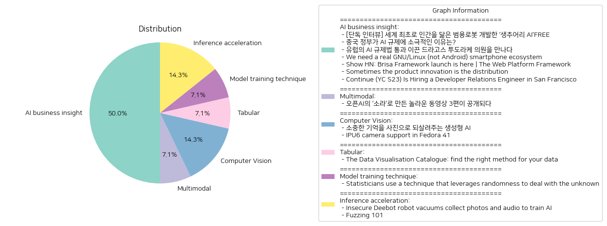

# Daily Artificial Intelligence Insights : News

## 🫧 AI business insight

**요약:**

1. **주요 테마**:
   - 인공지능(AI) 기술 발전과 규제: 여러 뉴스에서 AI가 주요 주제로 다뤄지고 있으며, 이는 특히 AI 로봇 개발, 규제, 산업 성장과 관련 있음.
   - 기술 생태계의 혁신과 발전: Brisa 프레임워크 출시에 대한 이야기와 GNU/Linux 스마트폰 생태계 필요성에 관한 논의가 진행 중임.
   - 배포 및 유통의 혁신: 제품 혁신과 연계된 유통 전략의 혁신에 따른 사업 모델 변화에 대한 고찰.
   
2. **주요 이벤트 요약**:
   - '생추어리 AI'의 조르디 로즈 CEO가 인간을 닮은 범용 로봇 개발에 대한 인터뷰.
   - 중국 정부가 AI에 대해 규제를 완화하는 이유와 그 배경.
   - 유럽 의회에서 AI 규제법 통과를 주도한 드라고스 투도라케 의원과의 인터뷰.
   - Brisa 프레임워크 출시를 통한 웹 플랫폼의 서버 및 클라이언트 통합.
   - 책과 디자인 스튜디오의 유통 혁신 전략.
   - 샌프란시스코에서 Developer Relations Engineer 채용 중인 Continue 회사.
   
3. **영향 분석**:
   - **경제적 측면**: AI 로봇의 개발 및 AI 규제 완화는 산업 성장 및 경제 발전에 긍정적 영향을 미칠 것으로 보임. 또한, 웹 개발 및 유통 혁신은 다양한 산업의 비용 절감과 효율성을 제공.
   - **정치적 측면**: 유럽의 AI 규제 강화는 AI 산업에 대한 정책적 경계를 형성할 가능성이 높으며, 이는 글로벌 AI 개발의 방향에 영향을 미칠 수 있음.
   - **사회적 측면**: 인간을 닮은 로봇의 개발은 사회적, 윤리적 논의를 촉발할 수 있으며, AI의 확산은 생활양식에 상당한 변화를 가져올 것임.
   
4. **최종 요약**:
   현재 AI 산업은 기술 발전과 규제의 균형 속에서 발전하고 있으며, 이는 경제적 발전과 지속 가능한 기술 발전의 토대가 되고 있음. 미래의 경제 구조와 사회 변화에 큰 영향을 미칠 수 있는 이러한 추세는 주목할 만한 발전을 가져올 것이며, 이에 대한 지속적인 관찰과 준비가 필요함. 특히, 새로이 개발되는 기술 및 서비스의 유통 및 생태계 변화에 따른 방식이 향후 산업 전반에 걸쳐 중요한 과제로 대두될 가능성이 큼.

**출처:**

 - [단독 인터뷰] 세계 최초로 인간을 닮은 범용로봇 개발한 ‘생추어리 AI’FREE (https://www.technologyreview.kr/%ec%9d%b8%ed%84%b0%eb%b7%b0-%ec%83%9d%ec%b6%94%ec%96%b4%eb%a6%ac-ai%ea%b0%80-%ea%b7%b8%eb%a6%ac%eb%8a%94-%eb%af%b8%eb%9e%98%ec%9d%98-%eb%a1%9c%eb%b4%87%ec%9d%80-%ec%8b%a4%ec%b2%b4%ed%99%94/)
 - 중국 정부가 AI 규제에 소극적인 이유는? (https://www.technologyreview.kr/%ec%a4%91%ea%b5%ad-%ec%a0%95%eb%b6%80%ea%b0%80-%ed%98%84%ec%9e%ac%eb%a1%9c%ec%84%9c%eb%8a%94-ai-%eb%b6%84%ec%95%bc%eb%a5%bc-%ea%b0%80%ed%98%b9%ed%95%98%ea%b2%8c-%ea%b7%9c%ec%a0%9c%ed%95%98%ec%a7%80/)
 - 유럽의 AI 규제법 통과 이끈 드라고스 투도라케 의원을 만나다 (https://www.technologyreview.kr/ai-%ea%b7%9c%ec%a0%9c%eb%b2%95-%ed%86%b5%ea%b3%bc-%ec%9d%b4%eb%81%88-%eb%93%9c%eb%9d%bc%ea%b3%a0%ec%8a%a4-%ed%88%ac%eb%8f%84%eb%9d%bc%ec%bc%80-%ec%9d%98%ec%9b%90%ec%9d%84-%eb%a7%8c%eb%82%98%eb%8b%a4/)
 - We need a real GNU/Linux (not Android) smartphone ecosystem (https://old.reddit.com/r/linux/comments/1fx5fq0/we_need_a_real_gnulinux_not_android_smartphone/)
 - Show HN: Brisa Framework launch is here | The Web Platform Framework (https://brisa.build/)
 - Sometimes the product innovation is the distribution (https://interconnected.org/home/2024/09/27/distribution)
 - Continue (YC S23) Is Hiring a Developer Relations Engineer in San Francisco (https://www.ycombinator.com/companies/continue/jobs/il3YrJC-developer-relations-engineer)

## 🎉 Multimodal

**요약:**

1. **핵심 주제들**:
   - 인공지능 및 기술 혁신: 오픈AI의 새로운 동영상 생성 모델 '소라'의 발표 및 관련 혁신적 기술 활용.
   - 영상 제작과 크리에이터 활동: 소라를 이용한 크리에이티브 작업과 그 과정에서의 기술적 접근.

2. **주요 사건들**:
   - 오픈AI가 동영상 생성 모델 '소라'로 만든 3편의 영상을 공개함. 
   - 이 영상들은 크리에이터들이 소라를 이용하여 제작했으며, 제작 목적과 기법에 대한 크리에이터들의 인터뷰로 이목을 끌었다.

3. **영향 분석**:
   - 경제적 측면: '소라'와 같은 동영상 생성 기술은 크리에이티브 산업에 혁신을 일으켜 관련 업계에 새로운 시장과 고용 기회를 창출할 가능성이 있다.
   - 사회적 측면: 창작의 접근성이 높아짐에 따라 더 다양한 콘텐츠 제공이 가능해지며, 그로 인해 소비자 선택의 다양성이 증가할 것으로 예상된다.
   - 기술 발전: 새로운 AI 모델의 등장은 더 많은 연구와 발전을 자극할 것이며, 미래의 AI 기술 개발 방향에 중요한 역할을 할 것이다.

4. **최종 요약**:
   오픈AI의 '소라' 동영상 생성 모델은 AI 기술의 최신 혁신을 상징하며, 크리에이티브 기술 활용의 새로운 장을 열었다. 이번에 공개된 영상과 관련한 크리에이터의 피드백은 향후 기술 발전에 있어 중요한 인사이트를 제공한다. 이러한 기술 발전은 경제와 사회 전반에 걸쳐 긍정적인 영향을 미칠 것으로 예상되며, 특히 크리에이티브 산업의 미래에 큰 변화를 가져올 수 있다. 향후 이러한 AI 기술이 실생활에 어떤 방식으로 통합될지, 그리고 그로 인해 발생할 잠재적인 윤리적 문제점 등도 주목할 필요가 있다.

**출처:**

 - 오픈AI의 ‘소라’로 만든 놀라운 동영상 3편이 공개되다 (https://www.technologyreview.kr/%ec%98%81%ec%83%81-%ec%83%9d%ec%84%b1-%eb%aa%a8%eb%8d%b8-%ec%86%8c%eb%9d%bc%eb%a1%9c-%eb%a7%8c%eb%93%a0-%eb%86%80%eb%9d%bc%ec%9a%b4-%ec%98%81%ed%99%94-3%ed%8e%b8%ec%9d%b4-%ea%b3%b5%ea%b0%9c%eb%90%98/)

## 🌞 Computer Vision

**요약:**

1. **주요 주제**:
   - 생성형 AI의 활용과 기술 발전
   - IT 기술, 특히 소프트웨어 및 하드웨어의 발전 (IPU6 카메라 지원 포함)

2. **중요 사건**:
   - '합성 기억' 프로젝트는 생성형 AI를 활용하여 전 세계 가족들이 카메라에 담지 못했던 과거의 추억을 이미지로 만들 수 있도록 돕고 있다. 이는 인간의 기억을 디지털로 재현하여, 기술을 통해 소중한 순간들을 복원할 수 있는 실험적인 시도로 평가된다.
   - Fedora 41에 IPU6 카메라 지원 추가와 관련된 업데이트 소식은 IT 분야에서 하드웨어와 소프트웨어의 통합 및 최적화가 진행 중임을 보여준다.

3. **영향 분석**:
   - **경제적 영향**: 생성형 AI 기술의 발전은 다양한 산업 분야에 혁신적인 변화를 가져올 수 있다. 특히, 사진 및 영상 관련 산업에서는 새로운 시장의 창출 및 기존 기술의 업그레이드를 통해 경제적 활성화가 기대된다.
   - **사회적 영향**: '합성 기억' 프로젝트를 통해 개인과 가족의 소중한 기억이 디지털로 복원됨에 따라, 과거 경험의 보존과 공유가 더 많은 사람들에게 가능해진다. 이는 사회적 연결이 강화되는 긍정적인 결과를 낳을 수 있다.
   - **기술적 발전**: Fedora 41의 IPU6 카메라 지원은 소프트웨어 개발과 하드웨어 지원 분야의 지속적인 진보를 나타낸다. 이는 기술 사용자들에게 더 나은 성능과 사용성을 제공할 가능성이 있다.

4. **최종 요약**:
   이번 뉴스 기사들은 생성형 AI 및 하드웨어 지원 발전을 통해 새로운 기술 혁신의 물결을 보여주고 있다. 생성형 AI의 활용은 개인과 가족의 기억을 보존하고 재현함으로써 사회문화적 연결을 강화할 수 있으며, IT 기술의 발전은 다양한 디지털 환경에서 사용자의 경험을 향상시킨다. 미래에는 이러한 기술들이 더욱 통합되고 실생활에 적용되어, 경제적 기회와 사회적 변화를 계속해서 가져올 것으로 예상된다.

**출처:**

 - 소중한 기억을 사진으로 되살려주는 생성형 AI (https://www.technologyreview.kr/%ec%83%9d%ec%84%b1%ed%98%95-ai%eb%a1%9c-%ea%b0%80%ec%9e%a5-%ec%86%8c%ec%a4%91%ed%95%9c-%ea%b8%b0%ec%96%b5%ec%9d%84-%ec%82%ac%ec%a7%84%ec%9c%bc%eb%a1%9c-%eb%a7%8c%eb%93%a0%eb%8b%a4/)
 - IPU6 camera support in Fedora 41 (https://hansdegoede.dreamwidth.org/28841.html)

## 🎉 Tabular

**요약:**

**종합 요약 보고서**

1. **핵심 주제**:
   여러 뉴스 기사에서 공통적으로 등장하는 주요 주제는 데이터 시각화 및 데이터를 효과적으로 전달하는 방법에 대한 것입니다. 데이터 시각화 도구의 선택이 어떻게 분석 또는 커뮤니케이션 요구 사항을 충족시키는지에 대한 논의가 중심을 이루고 있습니다.

2. **주요 사건**:
   이번 기사에서는 '데이터 시각화 카탈로그'라는 자료 모음에 대한 소개가 담겨 있습니다. 이 카탈로그는 데이터 시각화 기능이나 원하는 메시지를 전달하는 차트 목록으로 구성되어 있으며, 각 차트를 필요한 분석 또는 커뮤니케이션 요구에 맞춰 선택할 수 있도록 안내합니다.

3. **영향 분석**:
   데이터 시각화의 중요성이 강조됨에 따라 경제 및 사회, 특히 데이터 중심의 의사 결정이 중시되는 분야에서 큰 영향을 미칠 수 있습니다. 효과적인 데이터 전달을 통해 더 나은 데이터 기반 의사 결정을 내릴 수 있어 경제적 효율성을 향상시키고, 사회적으로도 개인 및 조직의 데이터 활용에 대한 이해도가 높아질 것으로 예상됩니다.

4. **최종 요약**:
   데이터 시각화는 현대 사회에서 필수적인 요소로 자리 잡고 있으며, '데이터 시각화 카탈로그'는 이를 보다 효율적으로 활용할 수 있는 가이드 역할을 합니다. 앞으로 더 많은 조직 및 개인이 이러한 툴과 가이드를 통해 더욱 정교한 데이터 해석과 커뮤니케이션을 시도할 것으로 보입니다. 이러한 방식은 다양한 산업 분야에서 데이터 활용을 최적화하는데 기여할 것이며, 이에 따라 관련 기술 및 플랫폼의 발전 추세를 주목할 필요가 있습니다.

**출처:**

 - The Data Visualisation Catalogue: find the right method for your data (https://datavizcatalogue.com/search.html)

## ✈️ Model training technique

**요약:**

**키 테마**:
- 통계학 및 데이터 분석
- 데이터 불완전성 처리 방법
- 불확실성을 다루는 혁신적 기법

**주요 사건**:
- 통계학자 도널드 루빈(Donald Rubin)이 1970년대에 제시한 다중 대치법은 데이터 누락 문제를 해결하기 위해 등장하였으며, 이는 단일 대치보다 더 정확하고 일반화된 방법입니다. 다중 대치법은 누락된 데이터를 예측하기 위해 여러 번의 추정을 수행한 후, 각 완료된 데이터 세트를 분석하여 더 신뢰할 수 있는 예측과 불확실성 추정을 제공합니다.

**영향 분석**:
- 경제: 보다 정확한 데이터 분석 기법은 경제 예측의 신뢰도를 높여 더 나은 결정과 정책 수립에 기여할 수 있습니다.
- 정치: 정책 결정자들은 신뢰할 수 있는 데이터 분석을 통해 효과적인 전략을 개발할 수 있으며, 이는 사회적 인프라와 자원 분배에 중요한 역할을 할 수 있습니다.
- 사회: 이와 같은 분석 기법은 의료, 교육 등 다양한 분야에서 의사 결정의 질을 높일 수 있어, 사회 전반에 긍정적인 영향을 미칠 수 있습니다.

**최종 요약**:
통계학 및 데이터 분석에 있어 다중 대치법의 도입은 데이터 누락과 불확실성을 효과적으로 처리할 수 있는 혁신적 방법으로 자리잡고 있습니다. 이는 보다 정확한 예상과 추정을 가능케 하여 경제, 정치, 사회 등 다양한 분야에 걸쳐 긍정적인 영향을 미치고 있습니다. 앞으로 이러한 기법이 더욱 발전하여, 신뢰할 수 있는 데이터 기반의 의사 결정을 통해 다양한 영역에서의 혁신을 지원할 것으로 기대됩니다.

**출처:**

 - Statisticians use a technique that leverages randomness to deal with the unknown (https://www.quantamagazine.org/when-data-is-missing-scientists-guess-then-guess-again-20241002/)

## 🌿 Inference acceleration

**요약:**

1. **주요 테마**:
   이번 뉴스 기사에서 다루는 주요 테마는 데이터 프라이버시와 사이버 보안입니다. 특히, 가정 내에서의 로봇 청소기 사용과 이것이 개인 정보에 미치는 영향, 그리고 소프트웨어 보안 테스트인 '퍼징(fuzzing)'에 대한 소개가 중심 주제로 등장합니다.

2. **주요 사건**:
   - Ecovacs 로봇 청소기가 사용자 집에서 사진, 비디오, 음성 녹음을 수집해 AI 모델을 훈련시키는 과정에서 명확한 동의 없이 민감한 사용자 정보를 보호하는 데 있어 큰 사이버 보안 취약점이 드러났습니다.
   - '퍼징 101' 코스는 소프트웨어 테스트 기술 중 하나인 퍼징을 배우고자 하는 사람들을 대상으로 합니다. 이 과정은 인터넷 연결이 가능한 리눅스 시스템과 Ubuntu 20.04.2 LTS에서 테스트된 VMware 이미지를 활용하여 학습을 진행합니다.

3. **영향 분석**:
   - **경제 및 기술 분야**: 로봇 청소기의 보안 문제는 기업의 신뢰도에 부정적인 영향을 미칠 수 있으며, 프라이버시 문제는 소비자들이 관련 제품 구매를 꺼리게 될 가능성이 있습니다. 이는 로봇 및 AI 관련 산업의 발전에 지연을 초래할 수도 있습니다.
   - **사회적 영향**: 개인 정보 무단 수집에 대한 사회적 불안감이 커질 수 있으며, 이는 개인 정보 보호법 및 규제 강화를 요구하는 사회적 움직임을 촉발시킬 수도 있습니다.

4. **최종 요약**:
   이번 기사들을 통해 데이터 프라이버시와 사이버 보안의 중요성이 재부각되고 있음을 알 수 있습니다. 특히, 스마트 디바이스에서의 개인정보 수집과 이를 보호하기 위한 적절한 동의 절차의 필요성이 강조되고 있습니다. 향후에는 이러한 문제를 해결하기 위한 기술적 개선 및 강력한 법적 규제가 요구될 것으로 보이며, 소프트웨어 개발자들에게는 보안성을 높이기 위한 새로운 기술 습득의 필요성이 커질 것입니다. 또한, 소비자들은 제품의 개인정보 처리 방침에 대해 보다 심층적인 검토를 해야 할 것입니다.

**출처:**

 - Insecure Deebot robot vacuums collect photos and audio to train AI (https://www.abc.net.au/news/2024-10-05/robot-vacuum-deebot-ecovacs-photos-ai/104416632)
 - Fuzzing 101 (https://github.com/antonio-morales/Fuzzing101)

