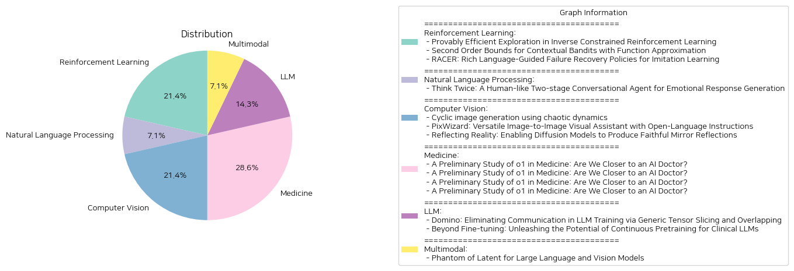

# Daily Artificial Intelligence Insights : Papers

## 🫧 Reinforcement Learning

**요약:**

보고서 요약:

1. **주요 주제 및 테마 추출**:
   - **역제약 강화 학습(ICRL)**: 전문가의 데모를 통해 최적의 제약 조건을 찾고자 하는 알고리즘.
   - **맥락적 밴딧 문제에서의 함수 근사**: 함수 클래스에 속하는 맥락-행동 쌍에 대한 평균 보상을 다루는 알고리즘 연구.
   - **로봇 모방 학습에서의 실패 복구 정책(RACER)**: 로봇 조작에서의 비전-언어 모델을 활용한 실패 복구와 자세한 언어 지침을 통한 제어 강화.

2. **공통 키워드, 트렌드 및 패턴 식별**:
   - **효율성 및 최적화**: 모든 논문에서 효율적인 탐색 및 학습 방법론이 강조됨.
   - **언어와 비전의 통합**: 로봇 학습에서 언어적 가이드를 통한 향상된 성능.
   - **이론적 기반**: 각 알고리즘들은 견고한 이론적 근거와 샘플 복잡성을 기반으로 함.

3. **주요 사건 및 중요 정보 요약**:
   - 첫 번째 논문은 복잡한 환경에서 효율적으로 제약 조건을 도출하는 새로운 탐색 프레임워크와 두 가지 새로운 알고리즘을 제안함.
   - 두 번째 논문은 맥락적 밴딧 문제에서 함수 근사로써 제곱근 시간 수평선 대신 측정 분산의 합으로 스케일링 되는 새로운 후회 제한 알고리즘을 개발함.
   - 세 번째 논문은 로봇 조작에서 비전-언어 통합 모델을 활용한 향상된 실패 복구 정책을 제안하며, RACER 모델이 기존의 방법보다 탁월한 성능을 보임.

4. **이벤트가 여러 분야에 미치는 영향 분석**:
   - **강화 학습**: 더 효율적이고 실용적인 알고리즘 개발로 인해 다양한 복잡한 환경에서의 적용 가능성 확대.
   - **함수 근사 밴딧 문제 해결**: 보다 정교한 통계적 방법을 통해 예측의 정확성과 효율성 향상.
   - **로봇 공학**: 언어 지침을 통한 향상된 자동화 및 제어, 실패 복구 능력으로 현실적 적용 확장.

5. **결론 및 미래 발전 전망**:
   - **결론**: 이 연구들은 다른 분야와의 융합을 통해 강화 학습과 모방 학습의 효율성을 크게 개선하고 있음.
   - **미래 발전**: 데이터 수집 및 처리의 자동화, 언어와 비전의 더 긴밀한 통합 및 효율적인 샘플링 방법의 진보는 향후 연구에 주요한 초점을 이루며 이러한 연구 방향이 다양한 산업 및 연구 도메인에 실질적 기여를 할 것으로 예상됨.

**출처:**

 - Provably Efficient Exploration in Inverse Constrained Reinforcement Learning (https://deeplearn.org/arxiv/529317/provably-efficient-exploration-in-inverse-constrained-reinforcement-learning)
 - Second Order Bounds for Contextual Bandits with Function Approximation (https://deeplearn.org/arxiv/529202/second-order-bounds-for-contextual-bandits-with-function-approximation)
 - RACER: Rich Language-Guided Failure Recovery Policies for Imitation Learning (http://arxiv.org/abs/2409.14674v1)

## ⭐ Natural Language Processing

**요약:**

보고서 요약:

1. 주요 주제 및 테마 추출:
   - 감정 반응 생성 대화 시스템: 인간다운 대화 시스템을 위해 감정과 의미를 통합적으로 모델링하는 방법. 감정과 의미 사이의 상호 제한으로 인해 안전한 반응을 생성하는 경향이 있으며, 대규모 감정 주석된 대화 코퍼스가 요구됨.
   - 임상 분야를 위한 대규모 언어 모델(LLM)의 잠재력 강화: LLM를 임상 용도에 맞추기 위한 네 가지 기술(연속적 사전 학습, 지시 기반 미세 조정, NEFTune, 프롬프트 엔지니어링)의 효율성 평가.

2. 공통 키워드, 트렌드 및 패턴:
   - 두 논문 모두 개선된 대화 시스템 개발에 초점을 맞추고 있으며, 응답 생성의 질을 높이기 위한 새로운 기술을 도입하고 있음.
   - 모델의 성능 최적화를 위한 데이터 세트 활용의 중요성 강조.
   - 인간의 대화 및 임상 데이터의 의미심장한 역할을 나타냄.

3. 주요 이벤트 및 주요 정보 요약:
   - 첫 번째 논문은 '두 번 생각하기'라는 인간의 행동에 영감을 받아 감정 대화 생성을 위한 2단계 대화 요원을 제안. 대화 모델은 감정 주석 없이 훈련되어 맥락적 의미에 맞는 프로토타입 응답을 생성하고, 감정을 조절하는 리파이너가 이를 수정.
   - 두 번째 논문은 대규모 언어 모델을 임상 작업에 맞게 조정하기 위해 다양한 기법을 조사. 특히 NEFTune이 생성 품질을 향상시키며 프롬프트 엔지니어링이 성능을 더욱 높임.

4. 이러한 사건들이 다양한 분야에 미치는 영향 분석:
   - 감정 반응 생성 시스템은 고객 서비스 및 사용자와의 상호작용 개선에 기여할 수 있음.
   - 임상 LLM의 발전은 의료 분야에서 데이터 기반의 진단 및 환자 치료의 정확도를 향상시킬 가능성을 보임.

5. 결론 및 향후 주목할 발전 사항:
   - 대화 시스템과 LLM의 발전은 자연어 처리(NLP) 분야에서 혁신을 촉진하며 다양한 분야의 실질적인 애플리케이션에 기여할 수 있음.
   - 향후 연구에서는 대화 및 임상 데이터의 품질과 다양성을 강조하여 새로운 사전 학습 및 미세 조정 기술을 탐색해야 할 필요가 있음.
   - 이러한 발전이 대화 시스템 및 임상 응용 프로그램에서 인간적이고 공감적인 상호작용을 구현하는 데 긍정적인 영향을 미칠 것으로 기대됨.

**출처:**

 - Think Twice: A Human-like Two-stage Conversational Agent for Emotional Response Generation (https://deeplearn.org/arxiv/532279/think-twice:-a-human-like-two-stage-conversational-agent-for-emotional-response-generation)
 - Beyond Fine-tuning: Unleashing the Potential of Continuous Pretraining for Clinical LLMs (http://arxiv.org/abs/2409.14988v1)

## ❄️ Computer Vision

**요약:**

보고서 요약:

1. 주요 주제 및 테마 추출:
   - 'Cyclic image generation using chaotic dynamics'는 이미지 생성에 있어 사이클 변환을 통한 새로운 접근법을 제안하며, 혼돈 동역학의 개념을 도입하여 이미지 다양성을 향상시키고자 합니다. 
   - 'Reflecting Reality: Enabling Diffusion Models to Produce Faithful Mirror Reflections'는 현실적인 거울 반사를 생성하기 위한 확산 모델을 연구하며, 이미지 인페인팅 작업을 통해 사용자가 거울 배치를 더 제어할 수 있도록 합니다.

2. 공통 키워드 및 트렌드:
   - 이미지 생성, 강화된 현실감, 다이나믹 시스템, 혼돈 이론, 딥러닝 모델, 데이터셋, 이미지 인페인팅, 반사 생성, 확산 모델. 

3. 각 논문의 주요 이벤트 및 중요 정보 요약:
   - 첫 번째 논문에서는 CycleGAN 모델을 확장하여 세 가지 이미지 카테고리 사이에 변환을 수행하는 사이클 이미지 생성의 가능성을 보여주며, 생성 이미지의 품질은 높지만 다변성은 줄어드는 경향을 보입니다. 발생하는 이미지 시퀀스에서 긍정적인 리아푸노프 지수를 통해 혼돈 동역학의 존재를 확인하였습니다.
   - 두 번째 논문에서는 SynMirror라는 새로운 대규모 데이터셋을 기반으로, 깊이 조건부 인페인팅 기법 MirrorFusion을 제안합니다. 이는 입력 이미지와 거울 영역을 나타내는 마스크를 사용하여 높은 품질과 기하학적으로 일관된 거울 반사를 생성합니다.

4. 이러한 이벤트가 다양한 분야에 미친 영향 분석:
   - 첫 번째 논문의 경우, 임의의 이미지 변환 및 생성에 혼돈 이론을 적용하여 다항목 이미지를 생성할 수 있는 새로운 가능성을 열었습니다. 이는 이미지 처리, 필터링 및 편집 기술의 향상에 기여할 수 있습니다.
   - 두 번째 논문은 현실적 거울 반사를 생성하는 기술을 통해 가상 현실(VR) 및 증강 현실(AR) 분야에서 현실감을 높이고, 다양한 이미지 편집 응용 프로그램에 활용될 수 있는 기회를 제공합니다.

5. 최종 통합 요약 및 결론:
   - 두 논문의 연구는 모두 딥러닝과 이미지 생성 기술의 새로운 지평을 열고 있습니다. 혼돈 동역학을 활용한 다중 클래스 이미지 생성과 거울 반사 구현 기술은 각각 이미지 다양성 및 현실감을 크게 개선할 수 있습니다. 미래에는 이러한 기술이 이미지 생성, 편집 및 VR/AR 분야에서 더욱 발전되고 응용 범위가 넓어질 것으로 예상됩니다.

**출처:**

 - Cyclic image generation using chaotic dynamics (https://deeplearn.org/arxiv/529529/cyclic-image-generation-using-chaotic-dynamics)
 - Reflecting Reality: Enabling Diffusion Models to Produce Faithful Mirror Reflections (http://arxiv.org/abs/2409.14677v1)

## 🎈 Healthcare AI

**요약:**

보고서 요약:

최근의 AI 연구가 집중되고 있는 분야 중 하나는 의료 분야에서의 대규모 언어 모델(LLM)의 응용입니다. OpenAI의 o1 모델은 강화 학습 전략을 사용한 내부화된 사고 체계를 갖춘 최초의 대규모 언어 모델로, 일반 언어 작업에서 뛰어난 능력을 발휘하고 있습니다. 이 연구는 o1 모델이 의학 분야에서 어떤 성과를 보일 수 있을지를 탐색합니다. 

주요 연구 결과로는 o1 모델이 6개의 다른 의료 시나리오에서 37개의 의료 데이터 세트를 사용하여 이해력, 추론 능력, 다국어 처리 능력을 평가한 점이 있습니다. 특히, New England Journal of Medicine (NEJM)와 The Lancet의 전문가 의료 퀴즈를 기반으로 구성된 새롭고 복잡한 문제 해결(QA) 태스크에서 기존의 표준적 의료 QA 벤치마크보다 임상적 유용성을 높였다는 점에서 의미 있는 해석을 제공합니다. 

분석 결과, o1 모델은 기존의 GPT-4와 비교하여 정확도가 6.2%에서 6.6% 향상되었으며, 이는 다양한 의료 지침을 이해하고 복잡한 임상 시나리오를 추론하는 데 있어 LLM의 강화된 추론 능력이 큰 역할을 한다고 나타났습니다. 그러나 모델의 발전의 반대편에서 여전히 몇 가지 한계가 발견되었습니다. 여기에는 환각 현상, 일관되지 않은 다국어 처리 능력 및 평가 메트릭의 불일치 등이 포함됩니다. 

이 연구는 AI가 의료 분야에서도 실질적인 도움을 줄 수 있다는 가능성을 제시하지만, 현재는 평가 프로토콜의 개선과 모델 능력의 강화가 필요함을 입증합니다. 향후 연구에서는 이러한 문제를 해결하는 데 집중할 필요가 있습니다. 연구 데이터와 모델 출력은 후속 연구를 위해 공개되었습니다(https://ucsc-vlaa.github.io/o1_medicine/ 참조). 

앞으로의 전망으로는 의료 AI 모델이 의료 지식 및 임상 적용에서 신뢰할 수 있는 도구로 자리 잡기 위한 다양한 연구 및 개발 노력이 더욱 중요해질 것입니다.

**출처:**

 - A Preliminary Study of o1 in Medicine: Are We Closer to an AI Doctor? (https://deeplearn.org/arxiv/529609/a-preliminary-study-of-o1-in-medicine:-are-we-closer-to-an-ai-doctor?)
 - A Preliminary Study of o1 in Medicine: Are We Closer to an AI Doctor? (http://arxiv.org/abs/2409.15277v1)

## ❄️ Model training technique

**요약:**

### 종합 요약 보고서

#### 1. 주요 주제 및 테마
각 논문에서 도출된 주요 주제는 "대규모 언어 모델(LLM) 훈련"과 "통신 오버헤드를 제거하는 방법"입니다. 특히, 대규모 언어 모델의 병렬 처리와 가속화 과정에서 발생하는 통신 오버헤드를 해결하기 위한 솔루션을 제시합니다. 여기에 사용된 방법은 일반적인 텐서 슬라이싱과 계산 과정을 중첩시키는 기법입니다.

#### 2. 공통 키워드, 트렌드 및 패턴
논문 전반에 걸쳐 공통적으로 언급된 키워드는 "LLM", "통신 오버헤드", "병렬 처리", "가속화", 그리고 "속도 향상"입니다. 이러한 요소들은 대규모 GPU 환경에서 효율적인 데이터를 처리하기 위한 공통의 관심사로 나타납니다. 통신을 숨기면서 계산을 병행하는 방법이 거론되며, 이것이 중요한 발전 트렌드로 작용하고 있습니다.

#### 3. 주요 이벤트 및 중요 정보 요약
Domino라는 솔루션은 Megatron-LM과 비교했을 때 LLM 훈련의 속도를 1.3배까지 향상시키는 결과를 보였습니다. 이는 Nvidia DGX-H100 GPUs 환경에서 달성된 결과로, 하나의 배치 훈련 과정의 데이터 의존성을 여러 독립된 작은 조각으로 나누어 이를 효율적으로 파이프라인화함으로써 이루어졌습니다. 이 방식은 미세한 수준의 통신 및 계산 중첩을 제공하여 훈련 속도 최적화를 이끕니다.

#### 4. 다양한 분야에 대한 영향 분석
이러한 기술적 발전은 AI 연구 및 개발 분야의 효율성을 크게 향상시킬 것으로 기대됩니다. 특히, 데이터 중심의 작업에서 처리 속도를 높임으로써 연구 시간과 리소스 절감 효과를 가져올 수 있습니다. 또한, 저비용으로 더 많은 실험을 실행할 수 있어, AI 모델의 정확성과 정밀성을 높이는 데 기여할 것입니다.

#### 5. 최종 결론과 미래 발전 방향
Domino의 발전은 대규모 언어 모델 훈련의 패러다임을 변화시킬 수 있는 잠재력을 갖고 있으며, 이러한 방식의 통신-계산 중첩 전략은 다양한 형태로 응용될 수 있을 것입니다. 향후 연구에서는 이러한 전략의 범용성을 높이고, 다양한 AI 모델 훈련의 성능을 극대화하는 연구가 지속될 것으로 예상됩니다. 또한, GPU 이외의 하드웨어 환경에서도 성능 최적화를 이룰 수 있는 기술적 진보가 주목받을 것입니다.

**출처:**

 - Domino: Eliminating Communication in LLM Training via Generic Tensor Slicing and Overlapping (https://deeplearn.org/arxiv/529630/domino:-eliminating-communication-in-llm-training-via-generic-tensor-slicing-and-overlapping)

## 🥳 Multimodal

**요약:**

보고서 요약:

1. 주요 주제 및 테마 추출:
   - "Phantom of Latent for Large Language and Vision Models": 대형 언어 및 비전 모델의 성공과 발전, 특히 LLVM의 효율성을 높이는 새로운 모델 'Phantom'의 개발 및 최적화.
   - "PixWizard: Versatile Image-to-Image Visual Assistant with Open-Language Instructions": 개방형 언어 지시를 통한 이미지 생성 및 조작, 통합된 이미지-텍스트-이미지 생성 프레임워크, 다재다능한 이미지 비서 'PixWizard'.

2. 공통 키워드, 경향, 패턴:
   - 대형 모델의 효율성 및 성능 향상.
   - 언어와 비전의 통합.
   - 지시 기반의 이미지 생성 및 처리.
   - 모델 사이즈의 증가 및 그에 따른 자원 소모 문제와 이를 해결하기 위한 효율성 개선 시도.

3. 주요 이벤트 및 핵심 정보 요약:
   - 'Phantom': 기존 대형 모델의 성능을 뛰어넘으면서도 물리적 모델 크기를 줄여 개발된 새로운 LLVM 군, 세련된 학습 능력과 정확한 결과 도출을 통한 성능 향상.
   - 'PixWizard': 다양한 영상 과제를 자유로운 언어 지시로 해결할 수 있는 다목적 비주얼 도우미, 다양한 해상도와 비율의 이미지를 효과적으로 처리할 수 있는 능력.

4. 사건들의 영향 분석:
   - 기술 분야의 모델 설계 및 최적화에 큰 혁신을 가져다주며, 적은 자원으로도 높은 성능의 모델 구현 가능.
   - 비전 및 언어 처리의 융합을 통한 새로운 데이터 처리 및 분석 기술 향상.
   - 다양한 분야에서 이미지 생성 및 처리의 혁신적인 변화를 기대할 수 있어, 인공지능 및 머신러닝 분야에 큰 변화를 야기할 수 있음.

5. 통합된 요약 및 결론, 미래 발전 가능성:
   - 두 연구 모두 대형 모델의 성능과 효율성을 향상시키기 위한 새로운 접근 방식을 제안하고 있으며, 이는 인공지능 분야의 지속적인 발전과 혁신의 가능성을 열어주고 있다.
   - 'Phantom'은 물리적 크기의 증가 없이도 향상된 성능을 제공함으로써, 확장성 있는 모델 개발의 새로운 기준을 제시하고 있다.
   - 'PixWizard'는 자유로운 언어 지시를 활용한 포괄적인 이미지 처리 능력으로, 실질적인 활용도를 높이고 새로운 응용 가능성을 열어주고 있으며, 특히 다양한 산업에서 맞춤형 솔루션 개발을 도모할 수 있을 것이다.
   - 앞으로 이러한 기술들은 더욱 정교한 인간-기계 상호 작용을 가능하게 하며, 광범위한 분야에서의 활용도를 넓힐 것으로 기대된다.

**출처:**

 - Phantom of Latent for Large Language and Vision Models (http://arxiv.org/abs/2409.14713v1)
 - PixWizard: Versatile Image-to-Image Visual Assistant with Open-Language Instructions (http://arxiv.org/abs/2409.15278v1)

