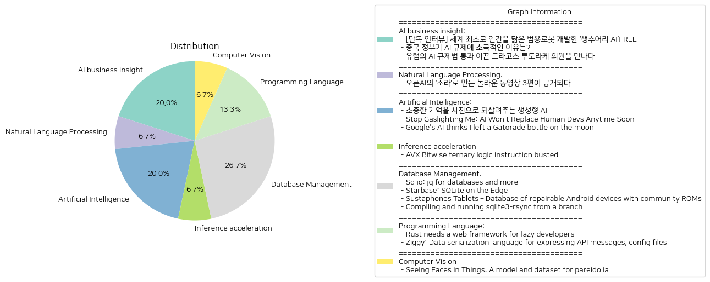

# Daily Artificial Intelligence Insights : News

## 🌿 AI business insight

**요약:**

1. **주요 테마**:
   - AI 기술 발전과 규제: 모든 기사에서 AI 기술과 관련된 발전이나 규제 문제가 다뤄지고 있음.
   - 각국의 AI 정책: 캐나다, 중국, 유럽의 AI 정책에 관한 관점이 소개됨.
   - AI 산업의 미래: AI의 발전 방향과 이에 따른 산업적 국면 변화가 주요 주제로 떠오름.

2. **주요 사건**:
   - [단독 인터뷰] 세계 최초로 인간을 닮은 범용로봇 개발한 ‘생추어리 AI’: 캐나다의 AI 로봇 전문기업 생추어리 AI가 인간을 닮은 범용 로봇을 개발하고 있으며, CEO 조르디 로즈가 미래의 로봇 비전을 설명함.
   - 중국 정부가 AI 규제에 소극적인 이유: 중국 정부가 소비자 기술 플랫폼에는 강경하지만 AI 규제는 느슨한 태도를 유지하며, 이는 자국 AI 산업 성장을 목적으로 함.
   - 유럽의 AI 규제법 통과: 드라고스 투도라케 의원이 AI 규제법 제정에 주요한 역할을 하였으며, 이 법이 AI 산업 개선에 기여할 수 있다고 밝힘.

3. **영향 분석**:
   - 경제: AI 기술 발전과 규제는 국가별로 다르게 경제에 영향을 미칠 가능성이 있음. 캐나다와 유럽은 규제와 발전의 균형을 찾고 있는 반면, 중국은 성장을 중시하는 입장.
   - 정치: 각국의 AI 정책이 국가별로 다른 정치적 메시지를 내포하고 있으며, 이는 국제 관계에도 영향을 미칠 수 있음.
   - 사회: AI 기술은 일상 속 문제 해결과 생활의 질 향상에 기여할 수 있어 사회적 기대가 증대됨.

4. **최종 요약**:
   AI 기술과 관련된 규제 및 발전 방향이 주요 이슈로 부상하고 있으며, 이는 경제적, 정치적, 사회적으로 다양한 영향을 미치고 있음. 캐나다의 AI 로봇 혁신, 중국의 느슨한 규제 태도, 유럽의 엄격한 AI 규제법 등은 모두 AI의 발전 방향에 중요한 변수로 작용하고 있음. 앞으로 이들 국가의 정책 변화와 AI 기술 발전이 글로벌 시장에 어떤 변화를 가져올지 주목할 필요가 있음.

**출처:**

 - [단독 인터뷰] 세계 최초로 인간을 닮은 범용로봇 개발한 ‘생추어리 AI’FREE (https://www.technologyreview.kr/%ec%9d%b8%ed%84%b0%eb%b7%b0-%ec%83%9d%ec%b6%94%ec%96%b4%eb%a6%ac-ai%ea%b0%80-%ea%b7%b8%eb%a6%ac%eb%8a%94-%eb%af%b8%eb%9e%98%ec%9d%98-%eb%a1%9c%eb%b4%87%ec%9d%80-%ec%8b%a4%ec%b2%b4%ed%99%94/)
 - 중국 정부가 AI 규제에 소극적인 이유는? (https://www.technologyreview.kr/%ec%a4%91%ea%b5%ad-%ec%a0%95%eb%b6%80%ea%b0%80-%ed%98%84%ec%9e%ac%eb%a1%9c%ec%84%9c%eb%8a%94-ai-%eb%b6%84%ec%95%bc%eb%a5%bc-%ea%b0%80%ed%98%b9%ed%95%98%ea%b2%8c-%ea%b7%9c%ec%a0%9c%ed%95%98%ec%a7%80/)
 - 유럽의 AI 규제법 통과 이끈 드라고스 투도라케 의원을 만나다 (https://www.technologyreview.kr/ai-%ea%b7%9c%ec%a0%9c%eb%b2%95-%ed%86%b5%ea%b3%bc-%ec%9d%b4%eb%81%88-%eb%93%9c%eb%9d%bc%ea%b3%a0%ec%8a%a4-%ed%88%ac%eb%8f%84%eb%9d%bc%ec%bc%80-%ec%9d%98%ec%9b%90%ec%9d%84-%eb%a7%8c%eb%82%98%eb%8b%a4/)

## 💚 Natural Language Processing

**요약:**

1. **주요 주제**:
   - 인공지능 기술 발전: 오픈AI가 새로운 동영상 생성 모델 '소라'를 선보이며 인공지능 기술의 진보를 보여주고 있음.
   - 크리에이티브 콘텐츠 생성: 기술의 활용을 통해 새로운 형태의 창작물을 제작하고 있는 영상 크리에이터들의 활동.

2. **주요 사건**:
   - 오픈AI가 새로운 동영상 생성 모델 ‘소라’를 개발하여 이를 이용한 동영상 3편이 공개됨. 공개된 영상들은 크리에이터가 '소라'를 통해 제작한 결과물로, 제작 목적과 기법에 대한 크리에이터들의 의견이 소개됨.

3. **영향 분석**:
   - **경제**: 기술 발전에 따라 콘텐츠 제작 비용과 시간 절약이 가능해지면서 미디어 및 엔터테인먼트 산업의 생산성과 창의성이 증가할 수 있음.
   - **정치**: 인공지능 기술의 발전이 정책적 규제와 윤리적 관점에서의 논의를 불러일으킬 가능성이 있음.
   - **사회**: 이러한 발전이 고용 패턴을 변화시키고, 작품의 진위 여부에 대한 대중의 신뢰를 시험할 수 있음. 사람들이 새로운 기술을 어떻게 수용하고 활용할지 주목해야 함.

4. **최종 요약**:
   오픈AI의 ‘소라’는 인공지능을 활용한 새로운 창작의 가능성을 보여주고 있으며, 기술적 혁신이 미디어 및 콘텐츠 분야에 미치는 긍정적인 영향을 주목할 필요가 있음. 또한, 이러한 기술 발전이 가져올 사회적 변화와 윤리적 문제를 고려하여 지속 가능한 발전을 이루기 위한 논의와 정책 마련이 필요함. 앞으로 AI 기반 콘텐츠 생성의 확산이 어떻게 이루어질 것인지, 그리고 그에 따른 사회적 변화가 어떤 형태로 나타날지 주목해야 할 필요가 있음.

**출처:**

 - 오픈AI의 ‘소라’로 만든 놀라운 동영상 3편이 공개되다 (https://www.technologyreview.kr/%ec%98%81%ec%83%81-%ec%83%9d%ec%84%b1-%eb%aa%a8%eb%8d%b8-%ec%86%8c%eb%9d%bc%eb%a1%9c-%eb%a7%8c%eb%93%a0-%eb%86%80%eb%9d%bc%ec%9a%b4-%ec%98%81%ed%99%94-3%ed%8e%b8%ec%9d%b4-%ea%b3%b5%ea%b0%9c%eb%90%98/)

## 🪄 Artificial Intelligence

**요약:**

1. **주요 테마**:
   세 뉴스 기사에서 공통적으로 등장하는 주요 테마는 AI(인공지능)의 역할과 한계입니다. '합성 기억' 프로젝트에서는 생성형 AI의 새로운 가능성을 제시하고 있으며, 다른 두 기사에서는 AI의 한계와 오류를 지적하고 있습니다. 첫 기사에서는 AI가 사람들의 과거 기억을 이미지로 되살려주는 긍정적인 도구로 묘사되고 있습니다. 반면 두 번째와 세 번째 기사에서는 AI가 가지는 한계점과 그것이 일으킬 수 있는 부작용에 집중하고 있습니다.

2. **주요 사건**:
   - '합성 기억' 프로젝트는 생성형 AI를 사용하여 과거 추억을 시각화하는 기술 개발을 목표로 하고 있습니다. 이는 사람들이 사진으로 남기지 못한 기억을 되살려주는 데 도움을 주고 있습니다.
   - 두 번째 기사는 인공지능이 인간 소프트웨어 개발자의 역할을 대체할 수 없다는 논의로, 실제 PR 작업에서 AI가 능동적으로 하지 못한 일을 예로 들며 인간의 전문성을 확인하고 있습니다.
   - 세 번째 기사는 Google의 AI가 잘못된 정보를 토대로 편파적인 답변을 할 수 있음을 보여주고 있습니다, 이는 가짜 정보를 입력함으로써 AI의 신뢰성을 의심할 만한 결과를 초래했습니다.

3. **영향 분석**:
   - 경제적으로, '합성 기억' 프로젝트는 AI를 이용한 새로운 서비스 및 제품 개발에 기회와 가능성을 제공하며, 관련 산업 발전에 기여할 수 있습니다.
   - 사회적으로는, AI가 인간의 창의적 및 정서적 경험에 어떻게 기여할 수 있을지를 보여주는 긍정적인 사례가 될 수 있습니다. 그러나 두 번째와 세 번째 기사에서 논의된 AI의 한계와 오류는 AI의 의존성이 높은 분야에서 신뢰성 문제가 대두될 수 있으며, 이는 사회 전반에 걸쳐 AI에 대한 경각심과 비판적 접근을 유발할 수 있습니다.
   - 정치적으로는 AI 오용 또는 편향된 정보 생성의 가능성이 부각되어 규제와 제어에 대한 논의를 촉진할 수 있습니다.

4. **최종 요약**:
   이번 뉴스 요약에서는 AI의 가능성과 한계가 뚜렷이 부각되었습니다. 생성형 AI는 새로운 사용자 경험을 제공할 수 있는 긍정적인 잠재력을 보여주고 있지만, 동시에 기술의 한계로 인해 발생할 수 있는 실수나 오판에 대한 논의도 중요합니다. 앞으로 AI 기술의 발전과 함께 윤리적 가이드라인 마련 및 신뢰성 높이기에 대한 필요성이 계속해서 대두될 수 있으며, 다양한 분야에서 AI의 실용적 적용에 대한 판단과 조율이 필요합니다. 더 나아가 AI가 사회 및 경제에 미칠 긴급한 영향에 대해서도 지속적인 모니터링이 필요합니다.

**출처:**

 - 소중한 기억을 사진으로 되살려주는 생성형 AI (https://www.technologyreview.kr/%ec%83%9d%ec%84%b1%ed%98%95-ai%eb%a1%9c-%ea%b0%80%ec%9e%a5-%ec%86%8c%ec%a4%91%ed%95%9c-%ea%b8%b0%ec%96%b5%ec%9d%84-%ec%82%ac%ec%a7%84%ec%9c%bc%eb%a1%9c-%eb%a7%8c%eb%93%a0%eb%8b%a4/)
 - Stop Gaslighting Me: AI Won't Replace Human Devs Anytime Soon (https://twitter.com/skeptrune/status/1843060221494895058)
 - Google's AI thinks I left a Gatorade bottle on the moon (https://edwardbenson.com/2024/10/google-ai-thinks-i-left-gatorade-on-the-moon)

## 🌅 Inference acceleration

**요약:**

**1. 주요 테마:**
- 기사 제목과 요약에서의 주요 테마는 고급 프로세서 명령어 및 그들의 비트 연산 수행 능력입니다. 
- 새로운 프로세서 명령어의 기능과 그와 유사한 구형 기술의 관계에 초점이 맞춰져 있습니다.

**2. 주요 사건:**
- 'AVX Bitwise ternary logic instruction busted'라는 제목의 기사는 AVX vpternlogd 명령어가 복잡한 비트 연산을 수행하는 방법에 대해 설명합니다.
- 이 명령어는 3개의 입력 소스를 사용하여 8비트 즉시 값을 통해 복잡한 논리 연산을 수행합니다. 유사점으로 Amiga 블리터의 논리 연산 제어 방식을 언급하고 있습니다.

**3. 영향 분석:**
- **기술 영향:** 새로운 명령어 집합의 발견은 프로세서 제조 및 프로그램 최적화에 있어 중요한 발전을 의미합니다. 이는 향후 실리콘 설계 최적화 및 고성능 연산에 긍정적인 영향을 미칠 수 있습니다.
- **사회적 영향:** 컴퓨터 및 소프트웨어 엔지니어는 이와 같은 기술적 혁신을 통해 더 나은 시스템을 설계할 가능성이 크므로 관련 업계의 혁신과 생산성 증대에 기여할 수 있습니다.

**4. 최종 요약:**
- AVX vpternlogd의 설명은 현대적인 프로세서 기술이 어떻게 기존의 논리 연산 제어 방식을 업데이트하고 있는지를 보여줍니다. 
- 기술 발전은 특히 하드웨어 최적화 및 소프트웨어 효율성을 높이는 데 큰 기여를 할 수 있으며, 이는 나아가 경제적으로도 중요한 영향을 미칠 수 있습니다.
- 향후 관련 기술 발전에 따라 고성능 컴퓨팅 시장에서의 경쟁이 더욱 치열할 것으로 예상됩니다. 이는 기술 기업들이 신제품 개발에 더 많은 투자를 할 가능성을 높일 수 있습니다.

**출처:**

 - AVX Bitwise ternary logic instruction busted (https://arnaud-carre.github.io/2024-10-06-vpternlogd/)

## 🎈 Database Management

**요약:**

**요약 보고서:**

1. **주요 주제:**
   - 데이터베이스 기술 및 활용: 주로 SQLite와 관련된 주제들이 두드러지며, 이를 통해 데이터 관리 및 활용의 효율성을 높이는 방법들이 탐색되고 있다.
   - 오픈 소스 및 커뮤니티 주도: 여러 기사에서 자유 소프트웨어 및 커뮤니티 기반의 혁신, 특히 수리 가능한 스마트폰과 커스텀 ROM의 지원에 중점을 두고 있다.
   - 데이터 중심의 도구 및 기능성 발전: 다양한 데이터 형식 및 데이터베이스와 관련된 작업 흐름 개선에 초점을 맞춘 도구들이 개발되고 있다.

2. **주요 사건:**
   - 'Sq.io'는 다양한 데이터베이스 및 형식을 지원하는 오픈 소스 데이터 처리 도구로 소개되고 있다. 이는 데이터 관리의 새로운 가능성을 제시한다.
   - 'Starbase'는 Cloudflare의 Durable Objects 위에 구축된 SQLite 데이터베이스로, 특정 환경에서의 활용성을 강조하고 있다.
   - 'Sustaphones Tablets'는 커스텀 Android ROM을 지원하는 수리 가능한 스마트폰 데이터베이스로, 사용자 친화적인 기술 환경 조성에 기여한다.
   - 'sqlite3-rsync'는 SQLite 데이터베이스의 복제 및 관리 방식을 시연하며 사용자에게 실용적인 데이터베이스 관리 수단을 제공하고 있다.

3. **영향 분석:**
   - 경제적 측면에서, 데이터베이스 관리 및 오픈 소스 도구의 발전은 기업의 데이터 관리 효율성을 증가시켜 운영 비용 절감에 기여할 수 있다.
   - 사회적 측면에서는, 수리 가능한 스마트폰과 커뮤니티 ROM의 활성화로 지속 가능한 소비와 기술 혁신을 촉진하게 된다.
   - 기술적 발전은 정보 기술 산업 전반의 역량을 강화하며, 특히 클라우드 기반 솔루션의 활용이 증가하는 추세를 반영한다.

4. **최종 요약:**
   최근의 기술 기사들은 데이터베이스와 관련된 혁신적인 발전과 오픈 소스 커뮤니티의 중요성을 강조하고 있다. SQLite와 같은 경량 데이터베이스의 활용이 증가하면서, 관리 및 활용 측면에서의 기술적 발전이 기대된다. 또한, 수리 가능한 기술 제품과 커스텀 운영 체제 지원은 지속 가능한 정보 기술 환경 조성에 중요한 역할을 할 것으로 보인다. 앞으로 데이터 관리 도구와 커뮤니티 기반 기술의 상호작용이 언제 어디서나 접근 가능한 정보 환경 구축에 어떻게 기여할지를 주목할 필요가 있다.

**출처:**

 - Sq.io: jq for databases and more (https://sq.io)
 - Starbase: SQLite on the Edge (https://starbasedb.com/)
 - Sustaphones Tablets – Database of repairable Android devices with community ROMs (https://www.sustaphones.com/tablets)
 - Compiling and running sqlite3-rsync from a branch (https://til.simonwillison.net/sqlite/compile-sqlite3-rsync)

## 🫧 Programming Language

**요약:**

**주요 주제:**
두 기사에서 공통으로 나타나는 주제는 프로그래밍 언어와 그에 관련된 도구 개발입니다. 럭스틱과 Ziggy 모두 개발자에게 편리한 개발 환경을 제공하려는 노력을 보여줍니다. 이는 개발자 생산성을 높이기 위한 기능 도입과 프레임워크 또는 언어의 사용 편의성을 중점적으로 다루고 있습니다.

**주요 사건:**
첫 번째 기사에서는 러스트에서 웹 개발을 간편하게 할 수 있도록 일반적인 기능을 번들로 제공하는 웹 프레임워크가 필요하다는 요구를 다루고 있습니다. 이를 위해 'newt'라는 자체 프레임워크 개발이 진행 중입니다. 두 번째 기사는 API 메시지와 구성 파일을 표현할 수 있는 데이터 직렬화 언어인 'Ziggy'를 소개하고 있으며, 이는 키-값 쌍을 위한 다양한 표기법을 사용하고 데이터 레이아웃을 정의하고 검증할 수 있는 스키마 기능을 제공합니다.

**영향 분석:**
이러한 개발들은 소프트웨어 개발의 생산성과 효율성을 향상시키는 데 중대한 영향을 줄 수 있습니다. 러스트의 'newt' 프레임워크는 특히 복잡한 웹 개발 프로세스를 간소화하고, 더 많은 개발자가 러스트를 채택하도록 장려할 것입니다. 반면, 'Ziggy'는 데이터 직렬화 및 API 관리의 복잡성을 줄여 보다 매끄러운 데이터 처리 솔루션을 제공할 수 있습니다.

**최종 요약:**
이 두 기사는 프로그래밍 언어와 관련 도구의 발전이 개발자들의 작업 환경을 개선하고자 하는 경향을 보여줍니다. 러스트와 Ziggy 모두 새로운 기능과 도구를 통해 개발자들이 보다 효율적으로 작업할 수 있도록 돕고자 하며, 이는 개발 커뮤니티 내에서의 생산성과 창의성을 높이는 데 기여할 것입니다. 향후에는 이러한 개인 및 소규모 팀에 의한 도구 혁신이 널리 사용되면서 더 많은 프레임워크와 언어 개선이 예상됩니다.

**출처:**

 - Rust needs a web framework for lazy developers (https://ntietz.com/blog/rust-needs-a-web-framework-for-lazy-developers/)
 - Ziggy: Data serialization language for expressing API messages, config files (https://ziggy-lang.io)

## 👽 Computer Vision

**요약:**

**1. 주요 주제:**
   - Pareidolia 현상: 비인간 물체에서 얼굴을 알아보는 현상을 컴퓨터에 적용
   - 진화학적 요소: 인간이 생존과 내비게이션을 위해 동물을 빠르게 인식하도록 진화했을 가능성

**2. 주요 사건:**
   - 연구진이 동물 이미지로 훈련된 컴퓨터 모델이 비인간 물체에서 더욱 자주 환상의 얼굴을 인식할 수 있음을 발견함.

**3. 영향 분석:**
   - **사회적 영향**: 인간의 인지 과정을 이해하는 데 있어 진화학적 관점을 제공하며, 심리 및 신경과학 연구에 새로운 통찰을 제공함.
   - **기술적 발전**: 머신러닝과 컴퓨터 비전 기술 발전에 기여, 특히 인공지능(AI) 분야에 응용 가능성 확대.
   - **문화적 이해**: 문화 및 예술 분야에서 예시로 활용 가능, 특히 인간이 관계를 맺는 방식과 시각적 착각을 다양하게 연구할 수 있음.

**4. 최종 요약:**
   최근 연구는 컴퓨터 비전에서 사람처럼 물체에서 얼굴을 인식하는 능력을 탐구하며, 인류의 진화 과정에서 동물을 인식하는 능력이 중요할 가능성을 제기했다. 이러한 연구는 인공지능과 신경과학 분야에 새로운 통찰을 제공하고, 차후 인식 알고리즘 개발에 지대한 영향을 미칠 수 있다. 나아가, 이는 우리 사회가 인공지능 및 자율 기술에 대한 기대와 인간 인지의 본질 이해에 지속해 관심을 기울여야 함을 시사한다. 향후 이러한 기술의 문화적, 사회적 영향력을 지속적으로 모니터링해야 할 필요가 있다.

**출처:**

 - Seeing Faces in Things: A model and dataset for pareidolia (https://www.science.org/content/article/imagining-faces-tree-trunks-and-your-morning-eggs-ai-can-see-them-too)

