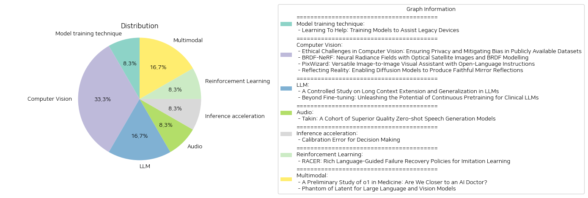

# Daily Artificial Intelligence Insights : Papers

## 👽 Model training technique

**요약:**

보고서 요약:

1. 주요 주제 및 테마 추출:
   - 하드웨어에 구현된 머신러닝 모델
   - 오래된 기기의 보조를 위한 훈련
   - 기기의 계산 능력의 한계
   - 새로운 개선 기능과의 차이
   - 일부 계산의 오프로드를 통한 성능 향상
   - 거부 규칙 사용 및 비용 고려

2. 공통 키워드 및 트렌드 확인:
   - '레거시 기기', '엣지 클라우드', 'LWA(learning with abstention)', '거부 규칙', '베이지안 규칙', '서로게이트 손실 함수'
   - 레거시 기기 보조를 위한 엣지 컴퓨팅 활용
   - 기기와 엣지 간의 상호작용 최적화

3. 주요 사건 및 중요한 정보 요약:
   - 머신러닝 모델의 물리적 기기 구현에 따른 장기적 사용
   - 기계의 성능 제한을 극복하기 위한 엣지 클라우드 활용 방안 제안
   - LWA 프레임워크 내에서 역방향 문제 형식화
   - 클라이언트가 엣지로 데이터를 넘길 지 여부를 결정하기 위한 거부 규칙 제안
   - 베이지안 최적 규칙 및 일반화 경계를 통한 문제 해결
   - 경험적 결과에서 제안된 프레임워크의 우수성 입증

4. 이러한 사건이 다양한 부문에 미치는 영향 분석:
   - 기술적 발전으로 인해 구형 기기에서의 머신러닝 모델의 효율성이 증가
   - 엣지 컴퓨팅 활성화로 인한 IoT 분야의 발전과 기회의 확대
   - 새로운 컴퓨팅 프레임워크의 등장으로 인한 IT 인프라 구축 전략 변화

5. 결론 및 미래 발전:
   - 레거시 기기를 위한 추가적인 머신러닝 지원 전략 개발 필요
   - 엣지 컴퓨팅의 중요성이 증가하며, 기기와 엣지 간의 상호작용 최적화 필요
   - LWA와 같은 프레임워크는 다양한 분야에서 효율성 개선에 기여할 가능성
   - 미래에는 이러한 프레임워크들이 더 나은 성능과 비용 효율성을 제공하도록 발전할 것으로 예상됨. 

더 나아가 AI와 엣지 컴퓨팅의 발전이 가져올 기술적, 경제적 변화를 주목해야 함.

**출처:**

 - Learning To Help: Training Models to Assist Legacy Devices (https://deeplearn.org/arxiv/529161/learning-to-help:-training-models-to-assist-legacy-devices)

## 🌅 Computer Vision

**요약:**

보고서 요약:

1. 핵심 주제 및 테마:
   - 윤리적 도전과제: 컴퓨터 비전 기술에서의 프라이버시 보장과 편견 완화 문제
   - 브라세 반사 분포 함수(BRDF) 모델링과 원격 감지로의 확장 관련 연구
   - 오픈 언어 지시사항 기반 이미지 생성 및 조작을 다루는 다목적 시각 보조 도구 'PixWizard'
   - 확산 모델을 통한 현실적인 거울 반사 생성

2. 공통된 키워드, 트렌드, 패턴:
   - 데이터 윤리 및 편견 문제: 컴퓨터 비전 및 AI의 발전 과정에서 프라이버시와 편견 문제가 지속적으로 대두되고 있음.
   - 모델링 기술의 확장: 신경 방사 필드(NeRF)와 같은 머신러닝 기술이 원격 감지 분야로 확장되고 있음.
   - 이미지 생성을 위한 확산 모델 사용: 이미지의 현실적이고 세부적인 표현이 가능해졌으며 이를 지원하는 데이터셋 및 메서드가 개발되고 있음.

3. 주요 사건 및 핵심 정보:
   - 컴퓨터 비전 기술의 광범위한 사용으로 인한 윤리적 문제와 해결을 위한 포괄적 프레임워크를 제안.
   - BRDF-NeRF의 개발로 위성 이미지의 반사율 패턴을 모델링하는 새로운 방법론 제시, Djibouti와 Lanzhou의 두 데이터셋을 통한 평가 결과 기재.
   - PixWizard를 통해 다양한 해상도와 과제를 처리할 수 있는 이미지-텍스트-이미지 변환 프레임워크 구성.
   - SynMirror 데이터셋을 사용하여 현실적인 거울 반사 생성 기술을 발전시켜 이미지 편집 및 증강현실에 새로운 가능성 제시.

4. 이러한 사건이 여러 분야에 미치는 영향:
   - 기술적 측면에서는 데이터 윤리와 관련된 규제를 강화하고, 새로운 모델링 기술과 데이터셋은 원격 감지와 증강현실 같은 분야에 널리 활용될 수 있음.
   - 이미지 생성 및 편집 도구의 발전은 시각적 콘텐츠 제작의 효율성을 높이고 새로운 형태의 창작을 가능케 함.

5. 최종 종합 요약 및 결론:
   이 연구들은 모두 컴퓨터 비전과 머신러닝의 발전이 다양한 분야에서 혁신을 일으키고 있음을 보여준다. 데이터 윤리와 프라이버시 보장은 여전히 중요한 과제로 남아 있으므로, 법적 및 사회적 측면에서 심도 있는 논의가 필요하다. 동시에, 새로운 기술 발전은 원격 감지, 이미지 생성, 편집과 같은 분야에서 새로운 응용 가능성을 열어주고 있어 주목할 만하다. 향후에는 윤리적 기준과 기술 발전 간의 균형을 찾는 노력이 더욱 중요해질 것이며, 이러한 노력이 AI의 지속 가능하고 안전한 발전에 필수적이다.

**출처:**

 - Ethical Challenges in Computer Vision: Ensuring Privacy and Mitigating Bias in Publicly Available Datasets (https://deeplearn.org/arxiv/529140/ethical-challenges-in-computer-vision:-ensuring-privacy-and-mitigating-bias-in-publicly-available-datasets)
 - BRDF-NeRF: Neural Radiance Fields with Optical Satellite Images and BRDF Modelling (https://deeplearn.org/arxiv/529138/brdf-nerf:-neural-radiance-fields-with-optical-satellite-images-and-brdf-modelling)
 - PixWizard: Versatile Image-to-Image Visual Assistant with Open-Language Instructions (http://arxiv.org/abs/2409.15278v1)
 - Reflecting Reality: Enabling Diffusion Models to Produce Faithful Mirror Reflections (http://arxiv.org/abs/2409.14677v1)

## 🤩 LLM

**요약:**

**종합 요약 보고서:**

**1. 주요 주제 및 주제 추출:**
첫 번째 논문은 '롱 콘텍스트 확장 및 일반화'에 대한 연구로, 확장 모델의 비교와 평가 방법에 초점을 맞추고 있습니다. 두 번째 논문은 '임상 대형 언어 모델(LLM) 최적화를 위한 연속 사전 훈련의 잠재력'에 대해 다루며, 임상 응용을 위한 대형 언어 모델의 다양한 적응 기술의 효능에 집중하고 있습니다.

**2. 공통 키워드, 트렌드, 패턴 확인:**
두 논문 모두 대형 언어 모델의 확장 및 최적화라는 주제 아래 고성능을 위한 방법론 개발을 공통적으로 다루고 있습니다. 특히 '롱 콘텍스트', '사전 훈련', '미세 조정(fine-tuning)', '퍼포먼스 평가', '임상 영역 적응' 등이 공통적으로 강조됩니다.

**3. 주요 사건 및 중요한 정보 요약:**
첫 번째 논문에서는 롱 콘텍스트 모델의 퍼포먼스를 평가하기 위한 표준화된 프로토콜을 제시하며, 기존의 근사주의 기반 주의(attention) 방법이 롱 콘텍스트 작업에서 체계적으로 저조함을 밝히고 있습니다. 두 번째 논문은 연속 사전 훈련, 미세 조정, NEFTune, 그리고 프롬프트 엔지니어링 기법들이 임상 LLM의 성능에 미치는 영향을 분석하며, 이러한 기술들이 성능 최적화에 미치는 중요성을 강조합니다.

**4. 이러한 사건이 다양한 부문에 미치는 영향 분석:**
롱 콘텍스트 모델 개선은 자연어 처리 분야에서 문맥 이해 능력을 향상시켜 다양한 텍스트 분석 및 이해 관련 작업에서의 정확성을 높일 수 있습니다. 임상 분야에서는 대형 언어 모델이 의료 정보 처리 및 진단 지원에 더욱 효율적으로 사용될 수 있음을 시사합니다. 이는 제약 및 의료 서비스 산업의 혁신적인 성장에 기여할 것으로 예상됩니다.

**5. 최종 결론 및 미래 발전 가능성:**
두 연구는 대형 언어 모델의 발전 방향에 대한 통찰을 제공합니다. 롱 콘텍스트 확장 연구는 정확한 퍼포먼스 평가 기준을 제공함으로써 관련 연구의 진척에 기여할 것입니다. 임상 LLM 최적화 연구는 의료 산업의 디지털 트랜스포메이션을 가속화시키는 중요한 역할을 할 것입니다. 향후에는 더 많은 데이터와 새로운 기법을 활용한 보다 개선된 모델 개발이 기대되며, 이러한 발전은 AI 기술의 전방위적인 응용 확대를 촉진할 것입니다.

**출처:**

 - A Controlled Study on Long Context Extension and Generalization in LLMs (https://deeplearn.org/arxiv/529141/a-controlled-study-on-long-context-extension-and-generalization-in-llms)
 - Beyond Fine-tuning: Unleashing the Potential of Continuous Pretraining for Clinical LLMs (http://arxiv.org/abs/2409.14988v1)

## 👽 Audio

**요약:**

1. 주요 주제 및 테마 추출:
   - 무표본 개인화된 신속 맞춤화
   - 고품질 음성 생성 모델
   - 오디오북 제작
   - 자연스러운 음성 생성
   - 화자 유사성 및 자연스러움 향상

2. 공통 키워드, 트렌드, 패턴:
   - 빅데이터와 대규모 언어 모델 시대
   - 무표본(Zero-shot) 기술
   - 음성 사용자 맞춤화
   - 자연스러운 멀티플 음성 생성

3. 주요 사건 및 핵심 정보 요약:
   - Takin AudioLLM은 오디오북 제작을 위해 설계된 일련의 모델과 기술로, 고품질의 무표본 음성 생성을 통해 실제 인간의 음성과 유사한 음성을 생성할 수 있음.
   - Takin TTS는 향상된 신경 음성 코덱과 다중 과제 훈련 프레임워크를 기반으로 하는 신경 코드 언어 모델.
   - Takin VC는 화자 유사성을 개선하기 위해 콘텐츠와 음색을 공동으로 모델링하고 자연스러움과 표현력을 증대시키기 위해 조건부 흐름 매칭 기반 디코더를 채택.
   - Takin Morphing은 개인이 자신의 선호도에 맞는 음색과 운율로 음성 생성을 정밀하게 제어할 수 있는 고도 분리 및 고급 음색과 운율 모델링 접근을 제공.

4. 다양한 분야에 대한 영향 분석:
   - 오디오북 및 엔터테인먼트 산업에서의 맞춤형 콘텐츠 생성으로 인한 사용자 경험 향상.
   - AI 기반 개인화 및 커스터마이징 기술의 확대 가능성 증대.
   - 무표본 학습 및 음성을 통한 사용자 인터페이스의 발전.

5. 결론 및 미래 발전 전망:
   Takin AudioLLM 모델 시리즈는 음성 생성 모델의 새로운 발전을 보여주며, 개인화된 콘텐츠 제작의 가능성을 크게 향상시켰습니다. 향후 다양한 분야에서 이러한 기술이 적용되어 사용자 경험과 효율성을 개선할 수 있을 것으로 예상됩니다. 특히, 무표본 학습을 통한 모델 발전은 개인화된 사용자 경험을 확대하는 주요 원동력이 될 것입니다.

**출처:**

 - Takin: A Cohort of Superior Quality Zero-shot Speech Generation Models (https://deeplearn.org/arxiv/529142/takin:-a-cohort-of-superior-quality-zero-shot-speech-generation-models)

## 💚 Inference acceleration

**요약:**

제목: '결정에 대한 보정 오류'

논문 요약: 본 논문은 결정자들이 예측을 확률로 신뢰할 수 있도록 해주는 보정의 중요성을 다루고 있습니다. 저자들은 예측을 보정하여 얻는 최대한의 결정 수익 향상을 '보정 결정 손실(CDL)'이라고 정의하며, 이는 모든 수익이 제한된 결정 과제에 대해 최대화를 이룰 때의 수익 향상을 뜻합니다. 보정이 이루어지지 않은 예측으로 인해 발생하는 수익 손실을 최소화하기 위해 CDL의 중요성을 강조합니다. 저자들은 CDL과 기존 보정 오류 메트릭, 특히 가장 잘 연구된 '기대 보정 오류(ECE)' 간의 차이에 대해 논의합니다. 주요 기술적 기여는 온라인 보정을 위한 새로운 효율적인 알고리즘으로, 기대 CDL을 가까운 최적가 $O(\frac{\log T}{\sqrt{T}})$에 도달하게 하여, Qiao와 Valiant(2021)가 제안한 ECE의 하한 $\Omega(T^{-0.472})$을 뛰어넘습니다.

종합 보고서:

1. 주요 주제와 주제 추출: 이 논문은 예측 보정, CDL 및 ECE와 같은 보정 오류 메트릭에 중점을 두고 있습니다. 주로 의사결정 과정에서 보정의 중요성과 구체적인 수학적 방법론에 대해 설명합니다.

2. 공통 키워드, 트렌드 및 패턴: 보정, 의사결정, CDL, ECE, 수익 손실, 알고리즘 등이 공통 키워드로 나타납니다. 특히, 보정에 따른 수익 향상의 최대화와 효율적인 알고리즘 개발이 중심적인 트렌드입니다.

3. 주요 사건 및 중요 정보 요약: CDL의 개념 및 중요성이 설명되며, CDL이 ECE와 다른 점, 그리고 새로운 알고리즘을 통해 ECE의 하한을 넘는 성과에 대해 설명합니다.

4. 사건의 영향에 대한 분석: 이러한 보정 기술은 특히 의사결정 관련 분야에서 예측의 신뢰성을 높이고 관련 수익의 최대화를 이루는 데 중요한 영향을 미칠 수 있습니다. 이는 금융, 의료, 안전 등 다양한 산업에 걸쳐 결정의 품질을 높일 수 있습니다.

5. 최종 종합 요약 및 미래 발전 방향: CDL을 통한 보정 오류 최소화는 의사결정의 정확성을 개선하며, 향후 보정 알고리즘의 지속적인 발전이 기대됩니다. 이러한 발전은 다양한 분야에서 예측의 질을 향상시켜, 더 나은 결정을 내릴 수 있도록 도와줄 것입니다. 향후 더 강력하고 효율적인 보정 기법이 개발되어 각 산업에 적용될 가능성이 높습니다.

**출처:**

 - Calibration Error for Decision Making (https://deeplearn.org/arxiv/529143/calibration-error-for-decision-making)

## 🐱 Reinforcement Learning

**요약:**

1. 주요 주제 및 테마 추출:
   - 로봇 조작에서의 실패 복구 메커니즘
   - 시각적-언어적 모델을 통한 로봇 제어
   - 전문가 시연을 통한 데이터 증강 및 세부 언어 주석
   - 언어 조건에 따른 비주모터 정책

2. 공통 키워드, 경향 및 패턴:
   - 실패 복구
   - 언어 지침
   - 실험적 성능 개선
   - 로봇 제어의 강화

3. 주요 사건 및 중요한 정보 요약:
   - RACER는 로봇 조작에서 발생하는 실패를 수정하고 자세한 언어 지침을 제공하는 비전-언어 모델을 도입.
   - 데이터 생성 파이프라인을 통해 전문가 시연 자료를 보강하고, 실패 복구 경로와 세밀한 언어 주석을 추가하여 학습 데이터로 사용.
   - 실험 결과, RACER는 RLbench 표준 및 여러 평가 환경에서 기존의 최첨단 로봇 제어 기술인 Robotic View Transformer (RVT)를 능가함.

4. 이러한 사건의 여러 분야에 대한 영향 분석:
   - 로봇공학: 로봇이 인간의 언어를 통해 더욱 정교하고 정확하게 조작할 수 있도록 지원, 자가 실패 복구 메커니즘의 중요성 부각.
   - 자동화 및 인공지능(AI): 언어적 지침을 통한 로봇의 적응력 강화 및 데이터 강화 방법론을 통한 학습 효율성 증대.
   - 산업 응용: 복잡한 작업 환경에서 로봇의 자율성과 정확성을 개선하여 다양한 산업 분야에 응용 가능.

5. 최종 요약 및 잠재적 미래 발전:
   - RACER는 로봇 조작의 실패 복구 기능을 언어 지침과 결합하여 개선함으로써, 기존 로봇 제어 시스템의 한계를 극복함.
   - 향후 발전은 언어 및 시각적 피드백의 통합을 통해 더욱 다각화되고 고도화된 로봇 제어가 기대됨.
   - 풍부한 언어 데이터 및 실시간 수정 능력을 로봇에 적용함으로써, 보다 정교하고 적응력 있는 로봇 시스템을 구축할 수 있을 전망.

**출처:**

 - RACER: Rich Language-Guided Failure Recovery Policies for Imitation Learning (http://arxiv.org/abs/2409.14674v1)

## 🎉 Multimodal

**요약:**

**요약 보고서**

1. **주요 주제 및 테마 추출:**
   - 첫 번째 논문은 **의료 분야 인공지능(AI) 모델 o1**의 연구를 다루며, 주로 인공지능의 이해, 추론, 그리고 다국어 능력에서의 성과를 평가합니다.
   - 두 번째 논문은 **대규모 언어 및 비전 모델(LLVMs)의 발전**을 기반으로 효율성을 중시하여 개발된 **Phantom**이라는 새로운 모델군을 소개합니다.

2. **공통 키워드, 트렌드 및 패턴 식별:**
   - 두 논문 모두 **대규모 언어 모델(LLMs)**의 발전과 이에 따른 **성능 향상**에 초점을 맞추고 있습니다.
   - **모델의 효율성**과 **정확성**을 향상시키기 위한 **기술적 접근법(내부화된 사고 과정 및 Phantom 최적화)**에 관한 내용을 다루고 있습니다.
   - 기술 발전이 **의료 분야**와 **언어-비전 통합 모델**에서 어떻게 **실용성**을 높이는지 설명합니다.

3. **중요한 사건 및 주요 정보 요약:**
   - **o1 모델**은 기존 GPT-4를 능가하는 **의료 질문 답변 정확도**를 보였으나, **허위 정보 생성(hallucination)**, **다국어 능력 불일치**, **평가 기준 차이**와 같은 문제점을 드러냈습니다.
   - **Phantom** 모델은 상대적으로 작은 크기로도 **대규모 모델의 성능**을 구현하며, **학습 가능성**을 극대화하여 효율적인 **LLM과 LLVM** 설계에 기여합니다.

4. **이벤트가 다양한 분야에 미치는 영향 분석:**
   - **o1 모델의 발전**은 특히 **의료 분야의 의사결정 지원** 체계에서 **AI 활용 가능성**을 높이며, 의료 업무의 효율성을 제공합니다.
   - **Phantom 모델의 효율성**은 **자원 절감** 측면에서 **대규모 모델 사용**의 **경제적 부담**을 줄여, 다양한 산업에서 AI 활용의 **확장성**을 도모합니다.

5. **최종 종합 요약 및 결론:**
   - 두 연구는 **대규모 언어 모델**의 잠재력을 극대화하는 다양한 **최적화 기법**을 탐구하며, AI가 **전문 분야**를 포함한 다양한 도메인에서 **적용 가능성**을 넓히고 있음을 보여줍니다.
   - **o1과 Phantom**의 발전은 각각 **의료 AI 시스템**과 **효율적인 모델 설계**의 새로운 가능성을 열어주며, 특히 **의료** 및 **멀티모달 AI 적용**에서 **미래 연구와 개발**의 방향을 제시합니다.
   - 향후 **평가 프로토콜 개선**, **허위 정보 방지** 기술 개발, 그리고 **더 나은 다국어 지원** 시스템의 발전이 필요할 것입니다.

**출처:**

 - A Preliminary Study of o1 in Medicine: Are We Closer to an AI Doctor? (http://arxiv.org/abs/2409.15277v1)
 - Phantom of Latent for Large Language and Vision Models (http://arxiv.org/abs/2409.14713v1)

