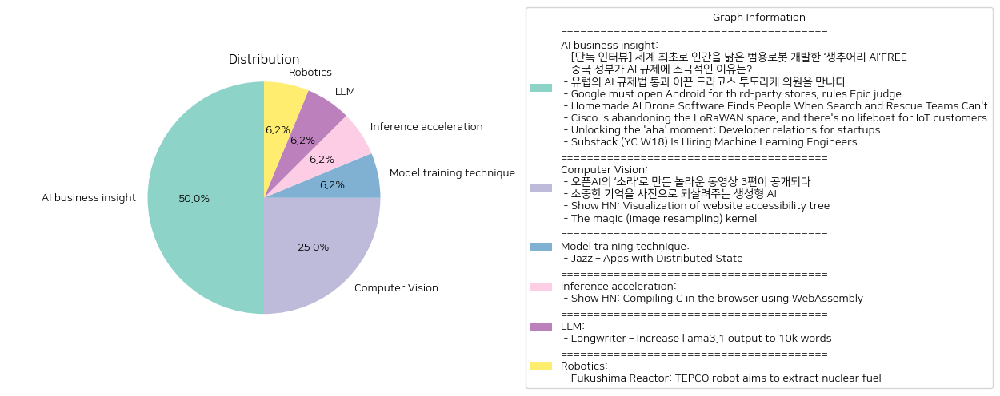

# Daily Artificial Intelligence Insights : News

## 🪐 AI business insight

**요약:**

1. **주요 테마**:
   - `AI 및 로봇 기술`: 인간을 닮은 범용 로봇과 AI 드론 소프트웨어 개발 사례가 언급되었습니다.
   - `AI 규제`: 중국과 유럽의 AI 규제 접근법에 대한 대조적인 설명이 주목되었습니다.
   - `기술 플랫폼 및 생태계 변화`: Google의 안드로이드 개방성과 Cisco의 LoRaWAN 시장 철수 등이 기술 플랫폼 시장의 변화를 보여주고 있습니다.
   - `스타트업 및 기술 혁신`: 개발자 경험 개선과 머신러닝 전문가 채용을 통한 스타트업 성장 전략이 강조되었습니다.

2. **주요 사건**:
   - 세계 최초로 인간을 닮은 범용 로봇 개발을 추진 중인 생추어리 AI와의 인터뷰.
   - 중국의 AI 규제에 대한 느슨한 태도와 유럽의 AI 규제법 통과 이야기.
   - Google이 경쟁 앱스토어에 대해 개방하도록 명령받은 사건.
   - 혁신적인 AI 드론 소프트웨어가 실종자를 찾아낸 사례.
   - Cisco의 LoRaWAN 시장 철수 소식.
   - 스타트업의 개발자와의 관계 강화 전략 및 Substack의 머신러닝 엔지니어 채용.

3. **영향 분석**:
   - **경제**: AI 기술 및 로봇 개발이 경제를 활성화할 잠재력을 갖고 있으며, Google의 시장 개방은 모바일 앱 생태계에 긍정적 영향을 미칠 것으로 보입니다. Cisco의 철수는 관련 산업에 부정적 영향을 줄 수 있습니다.
   - **정치**: 유럽의 AI 규제법은 기술 산업 내 규제 접근 방식에서 중요한 이정표가 될 수 있으며, 중국의 반응도 주목할 부분입니다.
   - **사회**: AI 및 드론 기술의 발전은 실종자 탐색과 같은 사회적 문제 해결에 긍정적으로 작용할 수 있습니다.
   - **기술**: 스타트업의 개발자 관계 강화 노력은 기술 혁신과 커뮤니티 형성에 기여할 것입니다.

4. **최종 요약**:
   이번 기사를 통해 AI와 로봇 기술이 경제와 사회에 미치는 혁신적인 영향력을 보여주었습니다. 또한, AI 규제에 대한 각국의 상이한 태도는 기술 발전에 대한 정치적 관점의 중요성을 강조하고 있습니다. Google과 Cisco의 사례는 기술 생태계의 변화 방향성을 시사하며, 스타트업의 혁신과 성장 전략은 미래에 커다란 파급 효과를 미칠 것입니다. 향후 AI 및 기술 규제의 방향성과 기술 플랫폼의 진화가 주목할 만한 발전 방안으로 생각됩니다.

**출처:**

 - [단독 인터뷰] 세계 최초로 인간을 닮은 범용로봇 개발한 ‘생추어리 AI’FREE (https://www.technologyreview.kr/%ec%9d%b8%ed%84%b0%eb%b7%b0-%ec%83%9d%ec%b6%94%ec%96%b4%eb%a6%ac-ai%ea%b0%80-%ea%b7%b8%eb%a6%ac%eb%8a%94-%eb%af%b8%eb%9e%98%ec%9d%98-%eb%a1%9c%eb%b4%87%ec%9d%80-%ec%8b%a4%ec%b2%b4%ed%99%94/)
 - 중국 정부가 AI 규제에 소극적인 이유는? (https://www.technologyreview.kr/%ec%a4%91%ea%b5%ad-%ec%a0%95%eb%b6%80%ea%b0%80-%ed%98%84%ec%9e%ac%eb%a1%9c%ec%84%9c%eb%8a%94-ai-%eb%b6%84%ec%95%bc%eb%a5%bc-%ea%b0%80%ed%98%b9%ed%95%98%ea%b2%8c-%ea%b7%9c%ec%a0%9c%ed%95%98%ec%a7%80/)
 - 유럽의 AI 규제법 통과 이끈 드라고스 투도라케 의원을 만나다 (https://www.technologyreview.kr/ai-%ea%b7%9c%ec%a0%9c%eb%b2%95-%ed%86%b5%ea%b3%bc-%ec%9d%b4%eb%81%88-%eb%93%9c%eb%9d%bc%ea%b3%a0%ec%8a%a4-%ed%88%ac%eb%8f%84%eb%9d%bc%ec%bc%80-%ec%9d%98%ec%9b%90%ec%9d%84-%eb%a7%8c%eb%82%98%eb%8b%a4/)
 - Google must open Android for third-party stores, rules Epic judge (https://www.theverge.com/policy/2024/10/7/24243316/epic-google-permanent-injunction-ruling-third-party-stores)
 - Homemade AI Drone Software Finds People When Search and Rescue Teams Can't (https://www.wired.com/story/this-homemade-ai-drone-software-finds-bodies-when-search-and-rescue-teams-cant/)
 - Cisco is abandoning the LoRaWAN space, and there's no lifeboat for IoT customers (https://www.theregister.com/2024/10/02/cisco_exiting_lorawan/)
 - Unlocking the 'aha' moment: Developer relations for startups (https://www.signalfire.com/blog/devrel-for-startups)
 - Substack (YC W18) Is Hiring Machine Learning Engineers (https://grnh.se/d034f1ba5us)

## 🪸 Computer Vision

**요약:**

1. **주요 테마**:
   모든 뉴스 기사에서 두드러지는 주요 테마는 '생성형 AI'와 '이미지 및 동영상 처리 기술'입니다. 오픈AI의 최신 동영상 생성 모델 개발, AI를 활용한 기억 회상 및 사진 복원 프로젝트, 웹 접근성 시각화, 그리고 이미지 리사이징 알고리즘 등 기술 혁신과 관련된 주제가 공통적으로 나타납니다. 

2. **주요 사건**:
   - '오픈AI의 소라': 오픈AI는 새로운 동영상 생성 모델 '소라'를 활용하여 놀라운 3편의 영상을 공개했습니다. 이 프로젝트는 동영상 제작 크리에이터들이 참여하여 어떻게 창의적으로 기술을 응용하는지를 보여주었습니다.
   - '생성형 AI를 통한 기억 복원': '합성 기억' 프로젝트가 진행 중이며, 이를 통해 전 세계 다양한 가족들이 카메라에 담기지 못한 과거의 소중한 추억들을 이미지로 재현할 수 있도록 지원하고 있습니다.
   - '웹사이트 접근성 시각화': ARIA DevTools는 웹 애플리케이션의 접근성 문제를 파악하고 ARIA 역할, 중첩 구조, 초점 관리 등을 시각화함으로써 개발자들이 개선할 수 있도록 돕습니다.
   - '마법의 이미지 리사이징 커널': Magic Kernel Sharp 알고리즘은 Facebook과 Instagram이 이미지를 고품질로 리사이징하여 선명도를 개선하는 데 사용되고 있는 혁신적인 기술입니다.

3. **영향 분석**:
   - **경제적 영향**: 오픈AI와 AI 기반의 새로운 기술들은 디지털 콘텐트 제작에서 효율성을 높이며 미디어 산업에 새로운 기회를 창출할 가능성이 높습니다. '마법의 이미지 커널'같은 기술은 관련 시장에서 향상된 경쟁력을 제공할 수 있습니다.
   - **사회적 영향**: 생성형 AI를 활용한 기억 복원 기술은 가족 및 개인의 과거 기억을 재현할 수 있는 새로운 방법을 제시하며, 사회적으로 정서적 가치를 제공합니다.
   - **기술적 발전**: 웹 접근성을 개선하고 사용자 경험을 증진시키는 도구들은 웹 개발 환경에서 중요한 진전으로, 기술 산업의 표준을 높이는 데 기여할 수 있습니다.

4. **최종 요약**:
   이 뉴스 기사들은 AI 기술이 영상 제작과 이미지 처리 분야에서 어떻게 혁신을 주도하고 있는지를 보여줍니다. 이러한 발전들이 경제 및 사회에 미치는 긍정적인 영향과 기술적 진전을 감안할 때, AI와 이미지 처리 기술에 대한 지속적인 연구개발을 지켜보는 것이 중요합니다. 향후 AI 기반 개인화 서비스와 웹 접근성 기술의 발전은 더욱 확장될 것으로 예상됩니다.

**출처:**

 - 오픈AI의 ‘소라’로 만든 놀라운 동영상 3편이 공개되다 (https://www.technologyreview.kr/%ec%98%81%ec%83%81-%ec%83%9d%ec%84%b1-%eb%aa%a8%eb%8d%b8-%ec%86%8c%eb%9d%bc%eb%a1%9c-%eb%a7%8c%eb%93%a0-%eb%86%80%eb%9d%bc%ec%9a%b4-%ec%98%81%ed%99%94-3%ed%8e%b8%ec%9d%b4-%ea%b3%b5%ea%b0%9c%eb%90%98/)
 - 소중한 기억을 사진으로 되살려주는 생성형 AI (https://www.technologyreview.kr/%ec%83%9d%ec%84%b1%ed%98%95-ai%eb%a1%9c-%ea%b0%80%ec%9e%a5-%ec%86%8c%ec%a4%91%ed%95%9c-%ea%b8%b0%ec%96%b5%ec%9d%84-%ec%82%ac%ec%a7%84%ec%9c%bc%eb%a1%9c-%eb%a7%8c%eb%93%a0%eb%8b%a4/)
 - Show HN: Visualization of website accessibility tree (https://chromewebstore.google.com/detail/aria-devtools/dneemiigcbbgbdjlcdjjnianlikimpck)
 - The magic (image resampling) kernel (https://johncostella.com/magic/)

## 🚀 Model training technique

**요약:**

**종합 뉴스 요약**

1. **주요 테마**:
   여러 기사에서 반복되는 주제는 기술 혁신 및 오픈 소스 소프트웨어의 확산입니다. 특히 데이터 관리의 간소화와 글로벌 동기화 및 저장소의 중요성이 강조되고 있습니다. 이는 현대 애플리케이션에서의 데이터 관리 복잡성을 해결하려는 노력의 일환으로 보입니다.

2. **주요 사건**:
   'Jazz – Apps with Distributed State'라는 기사에서는 Jazz라는 오픈 소스 툴킷의 등장이 주요 사건으로 다루어집니다. Jazz는 단일 추상화를 통해 데이터 관리를 간소화하며, Jazz Mesh를 통해 별도의 설정이나 백엔드 없이도 무료로 글로벌 규모의 동기화와 저장소를 제공합니다. 이는 개발자와 기업이 데이터 관리에 투입해야 하는 자원을 크게 줄여줄 수 있는 중요한 발전입니다.

3. **영향 분석**:
   Jazz와 같은 기술의 발전은 여러 분야에 다양한 영향을 미칠 수 있습니다. 
   - **경제**: 개발자와 기업에 데이터 관리에 소요되는 비용을 대폭 줄일 수 있는 가능성을 제공합니다. 이는 스타트업 및 중소기업들이 더 쉽게 글로벌 시장에 진출할 수 있는 기회를 열어줄 것입니다.
   - **사회**: 오픈 소스 소프트웨어의 발전은 기술의 민주화를 촉진하며, 더 많은 사람들이 첨단 기술에 접근할 수 있는 환경을 조성합니다. 이는 교육 및 디지털 격차 해소에도 긍정적인 영향을 미칠 수 있습니다.
   - **기술 혁신**: 데이터 관리의 복잡성을 해결함으로써, 개발자들은 더욱 혁신적인 애플리케이션 개발에 집중할 수 있게 되어 기술 발전이 가속화될 수 있습니다.

4. **최종 요약**:
   이번 뉴스들은 기술 혁신과 오픈 소스의 중요성을 강조하고 있으며, 특히 데이터 관리의 혁신적인 방법들이 앞으로 다양한 산업에 큰 변화를 가져올 것으로 예상됩니다. Jazz와 같은 툴킷은 경제적 효율성을 높이고, 글로벌 협업 및 접근성을 개선하는 등 다방면으로 긍정적인 영향을 미칠 것입니다. 앞으로 이러한 기술들이 얼마나 빠르게 채택되고 적용될 것인지 주목할 필요가 있으며, 이는 전반적인 사회의 디지털 혁신에도 큰 기여를 할 것입니다.

**출처:**

 - Jazz – Apps with Distributed State (https://jazz.tools/)

## 💚 Inference acceleration

**요약:**

1. **주요 테마**:
   웹어셈블리를 사용하여 브라우저에서 C를 컴파일할 수 있는 기술 혁신이 주요 테마입니다. 기술 발전, 컴파일러 기술의 진보, 개발 환경의 유연성이 강조되고 있습니다.

2. **주요 사건**:
   Wasmer의 최신 릴리스는 클랭을 Wasmer가 실행되는 어떤 환경에서도 실행할 수 있게 하여, 별도의 도구 체인이나 설치 없이 어디서나 C 프로그램을 컴파일할 수 있도록 합니다. 이는 웹 어셈블리와 브라우저 상에서의 컴파일 가능성을 확장시켰습니다.

3. **영향 분석**:
   이러한 발전은 다양한 분야에 영향을 줄 수 있습니다. 경제적으로, 개발 환경의 단순화와 비용 절감이 예상되며, 기술적 장벽이 낮아집니다. 또한, 웹 어셈블리의 활용이 확대되면서 다양한 분야에서의 응용이 가능해집니다. 사회적으로는 개발자 커뮤니티의 접근성을 높여 다양한 인재 유입이 늘어날 수 있습니다.

4. **최종 요약**:
   Wasmer의 새로운 기능은 기술 생태계의 큰 전환점을 나타내며, 웹 어셈블리의 역할과 웹 기반 기술의 중요성을 부각시킵니다. 앞으로도 웹 어셈블리를 활용한 다른 혁신적인 개발이 예상되며, 기술 접근성이 더욱 향상될 것으로 기대됩니다. 이러한 흐름 속에서 개발자와 기업들은 변화에 대한 적응과 새로운 기회를 모색할 필요가 있습니다.

**출처:**

 - Show HN: Compiling C in the browser using WebAssembly (https://wasmer.io/posts/clang-in-browser)

## 🍋 LLM

**요약:**

**종합 요약 보고서**

1. **주요 테마**:
   각 뉴스 기사에서 나타나는 주요 테마는 금지된 사랑, 사회적 규범과 기대, 격차의 극복 등을 다루고 있습니다. 사랑 이야기와 사회적 장벽을 뛰어넘는 노력이라는 트렌드가 반복되고 있습니다.

2. **주요 사건**:
   'Longwriter – Increase llama3.1 output to 10k words' 기사에서는 애쉬우드 가문의 귀족 딸 엘리자 애쉬우드와 하인 토마스 간의 비극적인 사랑 이야기를 중심으로 전개됩니다. 두 사람은 사회적 규범과 기대에 반하여 사랑에 빠졌고, 이들의 관계는 금기시되었습니다. 

3. **영향 분석**:
   이러한 사건은 사회에 대한 이해를 높이고 개인의 감정과 의지를 강조하며, 특히 사회적 계급과 규범이 어떻게 개인 삶에 영향을 미치는지를 고찰하게 만듭니다. 경제적 분야보다는 사회적 영향을 더 많이 미치며, 사회적 계급 간의 장벽을 재조명하고 새로운 시각으로 바라보는 계기를 제공합니다.

4. **최종 요약**:
   뉴스에서 수집된 정보에 따르면, 전통적 규범에 대한 도전과 개인적 신념의 중요성에 대한 인식이 증가할 것으로 기대됩니다. 또한, 앞으로 사회적 장벽을 극복하는 다양한 사례가 더욱 주목받을 수 있으며, 이는 장기적으로 사회적 발전과 변화를 촉진할 가능성을 시사합니다. 사회 구조의 유연함과 변화를 포용할 수 있는 새로운 관점이 요구될 것으로 예상됩니다.

**출처:**

 - Longwriter – Increase llama3.1 output to 10k words (https://github.com/THUDM/LongWriter)

## 💚 Robotics

**요약:**

**요약 보고서: 후쿠시마 원자로 및 TEPCO 로봇 관련 뉴스**

1. **주요 테마**:
   - 원자력 에너지 및 탈핵 과정: 이번 뉴스는 후쿠시마 다이이치 원자력 발전소의 폐연료 추출을 위한 TEPCO 로봇의 사용을 다루며, 원자력 발전소의 해체 및 안전성 문제를 주요 테마로 삼고 있습니다.
   - 첨단 기술 활용: 로봇 공학을 활용하여 위험한 환경에서 작업을 수행하는 점에서 첨단 기술의 활용이 또 다른 주제입니다.
   
2. **주요 사건**:
   - TEPCO는 후쿠시마 다이이치 원자력 발전소의 용융 연료를 추출하기 위해 특수 원격 조종 로봇 장치를 사용하고 있습니다. 이 장치는 소량의 연료 잔해를 회수하여 그 특성을 분석하고, 원자력 발전소의 안전한 해체를 돕기 위해 개발되었습니다.
   
3. **영향 분석**:
   - 경제적 영향: 원자력 발전소의 해체 작업은 지방 경제에 고용 기회를 제공할 수 있으며, 안전한 해체를 위한 기술 발전은 관련 산업의 성장 가능성을 높입니다.
   - 정치적 영향: 원자력 안전 및 정책에 대한 관심을 높이며, 정부 및 관련 기관의 규제와 책임이 더욱 강화될 수 있습니다.
   - 환경적 영향: 안전한 연료 추출은 방사능 오염을 줄이는 데 기여하여 환경 보호에 긍정적인 영향을 미칠 수 있습니다.
   - 사회적 영향: 지역 주민의 안전 및 신뢰를 회복하는 데 중요한 역할을 할 수 있습니다.

4. **최종 요약**:
   이번 뉴스는 후쿠시마 원전 사고 이후 오랜 기간이 흐른 지금도 지속되고 있는 원자력 발전소 해체의 복잡성과 위험성을 잘 보여줍니다. 첨단 로봇 기술의 도입은 이러한 복잡한 문제 해결에 있어 중요한 한 걸음이 될 수 있으며, 향후 더 많은 기술 발전과 안전 관리 방안이 논의될 가능성이 큽니다. 향후 발전소 해체 및 환경 복구 과정에서의 기술 혁신과 규제 강화 동향을 주목해야 할 것입니다.

**출처:**

 - Fukushima Reactor: TEPCO robot aims to extract nuclear fuel (https://spectrum.ieee.org/fukushima-reactor)

