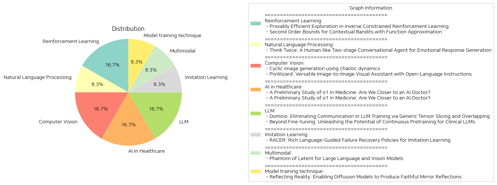

# Daily Artificial Intelligence Insights : Papers

## 🎉 Reinforcement Learning

**요약:**

보고서: 연구 논문 요약 및 분석

1. 주요 주제 및 테마 추출:
   - 첫 번째 논문: 'Provably Efficient Exploration in Inverse Constrained Reinforcement Learning'에서는 역 제한 강화 학습(ICRL)의 효율적인 탐색 방법에 대해 다룹니다. 이 논문은 전문가 시연에서 제한 조건을 복구하는 데이터 기반 접근 방식을 설명하며, 최적의 제한 조건을 얻기 위한 전략적 탐색 프레임워크를 제안합니다.
   - 두 번째 논문: 'Second Order Bounds for Contextual Bandits with Function Approximation'에서는 함수 근사와 맥락적 밴딧(contextual bandits)에서의 후회(regret) 경계에 대해 논의합니다. 기존의 낙관적 접근법을 바탕으로 시간 수평을 기준으로 한 후회 스케일 문제가 해결되며, 함수 클래스의 복잡성과 측정 변화도를 고려한 새로운 경계를 제시합니다.

2. 공통 키워드, 트렌드, 패턴:
   - 강화 학습과 맥락적 밴딧에서의 효율적인 탐색 및 후회 경계 최적화
   - 데이터 기반 접근과 알고리즘의 이론적 근거
   - 환경 및 함수 클래스의 복잡성에 대한 이해와 활용

3. 주요 이벤트 및 정보 요약:
   - 첫 번째 논문은 ICRL 문제에서 필요한 제약 조건을 효과적으로 추론하기 위한 두 가지 탐색 알고리즘을 제안하고 검증합니다. 절약된 샘플 복잡성을 통해 다양한 환경에서 알고리즘의 성능을 증명합니다.
   - 두 번째 논문에서는 기존의 낙관적 방법론에 대한 한계를 언급하고, 맥락적 밴딧 문제에서 측정 변화도를 활용한 새로운 후회 경계 설정 방법을 개발합니다.

4. 이벤트의 영향 분석:
   - 인공지능 및 강화 학습 분야에서의 알고리즘 효율성 향상
   - 복잡한 환경에서 강화 학습 적용 가능성 증대
   - 편차가 큰 데이터로부터 역할을 최소화하는 전략 개발

5. 최종 요약 및 결론:
   - 두 논문은 강화 학습과 맥락적 밴딧의 효율적인 탐색과 후회 경계 최적화를 다루며, 이론적 근거를 바탕으로 실질적인 성과를 증명합니다. 특히, 제약 조건의 최적화를 위한 전략적 방법론과 기존 알고리즘의 한계를 극복할 수 있는 새로운 전술을 제시하여, 인공지능 알고리즘의 성능을 한층 더 높일 잠재력을 보여줍니다.
   - 미래 연구에서는 대규모 데이터 환경에서의 실시간 적용 가능성 및 더 다양한 함수 클래스의 통합을 고려하여 추가적인 발전이 기대됩니다.

**출처:**

 - Provably Efficient Exploration in Inverse Constrained Reinforcement Learning (https://deeplearn.org/arxiv/529317/provably-efficient-exploration-in-inverse-constrained-reinforcement-learning)
 - Second Order Bounds for Contextual Bandits with Function Approximation (https://deeplearn.org/arxiv/529202/second-order-bounds-for-contextual-bandits-with-function-approximation)

## 🎉 Natural Language Processing

**요약:**

요약 보고서:

1. 핵심 주제 및 테마 추출:
   - 인간과 유사한 감성 대화 시스템의 개발
   - 감성 및 의미를 통합하여 대화 생성
   - 인간의 "한 번 더 생각하기" 행동에서 영감 얻음

2. 공통 키워드, 동향, 패턴 식별:
   - 감정과 의미의 상호 제한
   - 희귀한 감정 주석 대화 데이터의 필요성
   - 감성 대화를 위한 두 단계 접근법

3. 주요 사건 및 중요한 정보 요약:
   - 감정 주석이 없는 대화 모델로 초기 프로토타입 응답 생성
   - 첫 단계 프로토타입을 감정 추정 이론을 통해 조정
   - DailyDialog와 EmpatheticDialogues 데이터셋에서 실험 결과 우수성 입증

4. 이러한 사건들이 다양한 부문에 미치는 영향 분석:
   - 인간과 상호작용할 수 있는 보다 자연스러운 대화 시스템의 발전
   - 감정 이해 향상으로 고객 서비스 및 상담 등의 분야에 긍정적 변화 기대
   - 자동화된 감성 대화 시스템의 상업적 가치 증대 가능성

5. 결론 및 미래 개발 관측:
   - 두 단계 접근법이 인간과의 자연스러운 감정적 참여를 촉진할 수 있음
   - 데이터 주석 없이 의미있는 감성 대화 생성 가능성 확인
   - 감성 및 의미 통합 모형의 발전에 따라 더 발전된 대화 시스템의 출현 기대

위 내용을 토대로 감성 대화 시스템의 미래 발전 방향을 주시하고, 이러한 기술이 다양한 산업에 미칠 긍정적 영향을 고려할 필요가 있습니다.

**출처:**

 - Think Twice: A Human-like Two-stage Conversational Agent for Emotional Response Generation (https://deeplearn.org/arxiv/532279/think-twice:-a-human-like-two-stage-conversational-agent-for-emotional-response-generation)

## 🌿 Computer Vision

**요약:**

요약 보고서:

1. 주요 주제와 테마 추출:
   - 첫 번째 논문 'Cyclic image generation using chaotic dynamics'는 주기적인 이미지 생성과 혼돈 역학을 활용하여 다중 범주 이미지 변환을 설명합니다. CycleGAN 모델을 확장하여 훈련된 생성기를 반복 적용함으로써 이미지의 다중 범주간 전환을 구현하며, 생성된 이미지가 훈련 데이터 집합보다 제한된 이미지 공간에 위치하도록 합니다. 이미지의 고유한 다양성은 감소하지만 품질은 높다고 평가됩니다.
   - 두 번째 논문 'PixWizard: Versatile Image-to-Image Visual Assistant with Open-Language Instructions'는 다양한 이미지 생성, 수정, 번역을 수행할 수 있는 다재다능한 이미지-텍스트-이미지 변환 도우미 PixWizard를 소개합니다. 자연어를 통한 다양한 시각적 과제 수행이 가능하며, Diffusion Transformers(DiT)를 기반으로 다양한 해상도의 이미지를 동적으로 처리합니다.

2. 공통 키워드, 트렌드 및 패턴 식별:
   - 두 논문 모두 이미지 생성 및 변환의 다재다능성을 강조하며, 각각의 방법론을 통해 이미지를 다중 범주로 변환하거나, 다양한 해상도와 분야에서 적용 가능한 능력을 보입니다. 특히, 생성된 이미지의 다양성에 대한 평가가 공통적인 테마입니다.

3. 주요 사건 및 중요한 정보 요약:
   - 첫 번째 논문은 chaotical dynamics를 활용하여 이미지 생성의 새로운 접근법을 제시하며, 양의 Lyapunov 지수를 통해 이러한 혼돈 역학의 존재를 입증합니다. 두 번째 논문은 다양한 시각 과제를 하나의 통합 프레임워크로 묶어 광범위한 이미지 처리 능력을 보여주며, 자연어 지침을 통해 다기능적인 이미지 변환을 실현합니다.

4. 이러한 사건의 여러 부문에 대한 영향 분석:
   - 첫 번째 논문은 새로운 이미지 생성 방법론으로서 혼돈 역학을 제시함으로써 인공지능 기반 이미지 생성 기술의 발전을 도모합니다. 두 번째 논문에서는 다양하고 복잡한 이미지 처리 작업을 단일 도구로 해결할 수 있는 가능성을 보여주어, 다양한 비주얼 작업에 걸친 응용 가능성을 제시합니다.

5. 최종 통합 요약 및 결론:
   - 두 논문은 모두 이미지 생성 및 변환에 관련된 최신 연구를 바탕으로 고급 기계 학습 기법을 적용하여 향후 인공지능 기반 비주얼 처리 기술 발전에 기여하고 있습니다. 혼돈 역학을 통한 이미지 생성과 자연어 기반 이미지 작업 수행의 결합은 이미지 처리의 다양한 가능성을 열어주며, 이러한 발전이 미래에 어떻게 응용될 것인지 주목할 필요가 있습니다. 다가오는 기술 동향은 이러한 다분야 이미지 처리 도구의 활용 방법과 정확한 효과 측정에 중점을 두어야 할 것입니다.

**출처:**

 - Cyclic image generation using chaotic dynamics (https://deeplearn.org/arxiv/529529/cyclic-image-generation-using-chaotic-dynamics)
 - PixWizard: Versatile Image-to-Image Visual Assistant with Open-Language Instructions (http://arxiv.org/abs/2409.15278v2)

## ☀️ AI in Healthcare

**요약:**

요약 보고서:

1. 주요 주제 및 테마 추출:
이 연구는 대형 언어 모델(LLMs)이 다양한 분야에서 보여준 뛰어난 성과를 탐구하며, 특히 OpenAI의 최신 모델 o1을 중심으로 한다. o1은 강화 학습 전략을 이용한 내부화된 사고 전개 기법을 갖춘 첫 번째 LLM으로, 일반 언어 과제에서 상당히 강력한 능력을 입증했지만 의학같은 특정 분야에서는 그 성능이 아직 알려지지 않았다. 연구는 o1의 의학적 시나리오에서의 이해력, 추론 능력 및 다국어 처리 능력을 평가한다.

2. 공통 키워드, 트렌드 및 패턴:
- 대형 언어 모델(LLM)
- OpenAI의 o1 모델
- 강화 학습
- 의학적 이해 및 추론
- 다국어 능력
- NEJM 및 The Lancet의 전문가 의료 퀴즈 기반 QA 과제
- 임상적 유용성

3. 주요 이벤트 및 중요 정보 요약:
o1 모델은 37개 의학 데이터셋을 사용하여 6개의 다양한 과제를 평가하였으며, NEJM과 The Lancet의 의료 퀴즈에 기반한 두 개의 새로운 QA 과제를 통해 더 높은 임상적 관련성을 제공했다. o1은 이전 모델인 GPT-4보다 19개 데이터셋과 두 개의 복잡한 QA 시나리오에서 평균 6.2%, 6.6% 높은 정확도를 보였다. 그러나 모델의 능력과 평가 프로토콜에서는 환각, 불일치한 다국어 능력, 일관성 없는 평가 지표와 같은 여러 약점도 발견되었다.

4. 이러한 사건이 여러 분야에 미친 영향 분석:
o1 모델의 향상된 추론 능력은 복잡한 임상적 시나리오에서 의료 지시를 이해하고 추론하는 데 유의미한 이점을 제공할 것으로 보인다. 이는 향후 AI 기반 의료 진단 및 치료 지원에 중요한 역할을 할 잠재력이 있다.

5. 종합적인 요약 및 결론:
o1 모델은 대형 언어 모델의 의학적 응용범위를 넓힐 수 있는 가능성을 보여주었지만, 여전히 개선이 필요한 여러 부분이 식별되었다. 현재는 평가 프로토콜의 개선과 모델의 환각 및 언어 능력 불일치를 해결하는 것이 필요하다. 앞으로의 연구에서는 이러한 발견된 문제점을 해결하고, AI 모델이 실제 임상 환경에서 더 효과적으로 활용될 수 있도록 하는 것이 중요할 것이다. 이러한 발전은 AI 기반 의료 환경의 효율성과 정확성을 크게 높일 수 있을 것으로 기대된다.

**출처:**

 - A Preliminary Study of o1 in Medicine: Are We Closer to an AI Doctor? (https://deeplearn.org/arxiv/529609/a-preliminary-study-of-o1-in-medicine:-are-we-closer-to-an-ai-doctor?)
 - A Preliminary Study of o1 in Medicine: Are We Closer to an AI Doctor? (http://arxiv.org/abs/2409.15277v1)

## ❄️ LLM

**요약:**

보고서 요약:

1. 주요 주제 및 테마 추출:
    - 첫 번째 논문은 LLM(대형 언어 모델) 훈련 중 통신 장애를 줄이기 위한 방법으로, 'Generic Tensor Slicing' 및 'Overlapping'을 통해 통신을 제거하는 Domino를 소개합니다.
    - 두 번째 논문은 임상 분야에서 LLM을 최적화하기 위한 다양한 기법을 탐구하며, 지속적 사전 훈련과 네 가지 기술(지속적 사전 훈련, 지시 미세 조정, NEFTune, 프롬프트 엔지니어링)의 효과를 논의합니다.

2. 공통 키워드, 트렌드 및 패턴:
    - 두 논문 모두 LLM의 훈련 및 최적화에 중점을 두고 있으며, 성능 향상을 위한 전략 및 기법을 모색하고 있습니다.
    - 대규모 데이터 세트와 구체적인 모델(Mistral 7B, Mixtral 8x7B)에 대한 실험과 평가가 수행되었습니다.

3. 주요 사건 및 중요 정보 요약:
    - Domino 방법은 LLM 훈련의 통신 부담을 줄여 GPU 활용을 최적화하며, Nvidia DGX-H100 GPU의 LLM 훈련 속도를 1.3배 가속화할 수 있음을 보여줍니다.
    - 두 번째 논문에서는 지속적 사전 훈련이 지시 미세 조정의 강력한 기초를 제공하며, NEFTune이 생성 품질을 향상시키며 프롬프트 엔지니어링이 추가 성능 향상을 가능하게 함을 강조합니다.

4. 이러한 사건이 다양한 부문에 미치는 영향:
    - 첫 번째 연구의 기술은 LLM 훈련 과정에서의 비용과 시간 절감을 초래할 수 있으며, 대형 모델의 개발 및 활용을 보다 효과적으로 진행할 수 있게 합니다.
    - 두 번째 연구는 임상 분야의 LLM 활용 가능성을 높이고, 임상 응용 프로그램의 효율성을 크게 향상시킬 것으로 기대됩니다.

5. 종합된 결론 및 잠재적 미래 개발:
    - Domino 같은 솔루션은 LLM 훈련의 효율성을 높이며, 대규모 모델의 확장을 지원할 수 있는 방향을 제시합니다.
    - 임상 분야의 LLM 최적화 연구는 미세 조정 전략의 중요성을 상기시키며, 임상 데이터를 활용한 새로운 기술 개발의 가능성을 시사합니다.
    - 앞으로도 LLM의 효율적 훈련과 구체적인 분야 응용을 고려한 지속적인 연구가 필요하며, 이러한 연구는 더 넓은 응용 가능성과 혁신적인 발전을 추진할 것으로 보입니다.

**출처:**

 - Domino: Eliminating Communication in LLM Training via Generic Tensor Slicing and Overlapping (https://deeplearn.org/arxiv/529630/domino:-eliminating-communication-in-llm-training-via-generic-tensor-slicing-and-overlapping)
 - Beyond Fine-tuning: Unleashing the Potential of Continuous Pretraining for Clinical LLMs (http://arxiv.org/abs/2409.14988v1)

## 🎈 Imitation Learning

**요약:**

요약 보고서:

1. 주요 주제 및 테마:
   'RACER: Rich Language-Guided Failure Recovery Policies for Imitation Learning'라는 제목에서 '언어로 안내되는 오류 복구 정책' 및 '모방 학습'이라는 핵심 주제를 추출할 수 있습니다. 이와 관련하여 논문은 로봇 조작의 견고성과 수정 가능성을 개선하기 위한 새로운 접근 방식을 소개합니다.

2. 공통 키워드 및 패턴 식별:
   - 로봇 조작
   - 실패 복구 메커니즘
   - 언어 안내
   - 데이터 생성 파이프라인
   - 비주얼-모터 정책

3. 주요 이벤트 및 정보 요약:
   - 로봇이 실패에서 스스로 회복할 수 있는 메커니즘과 단순한 언어 지시의 한계를 극복하기 위한 새로운 데이터 생성 파이프라인 개발.
   - 자동화된 전문가 시연 증강과 세밀한 언어 주석을 포함하여 실패 복구 궤적을 훈련 데이터에 추가함.
   - 'RACER'라는 감독자-행위자 프레임워크 도입, 이는 실패 복구 데이터와 풍부한 언어 설명을 결합하여 로봇 제어를 향상.
   - 비전-언어 모델(VLM)이 온라인 감독자로 작용하여 오류 수정 및 작업 실행을 위한 세부 언어 안내를 제공.
   - 언어-조건 비주얼-모터 정책이 행동 예측자로 작용.

4. 이러한 이벤트의 다양한 부문에 대한 영향 분석:
   - 로봇 공학: RACER 시스템은 실제 및 시뮬레이션 환경 모두에서 보다 향상된 로봇 조작 성능을 보여줌으로써 이 분야에 큰 기여를 할 것으로 기대됩니다.
   - 인공지능: 언어와 비전 시스템의 통합은 보다 인간적인 상호작용 메커니즘을 개발하는 데 중요한 발전을 이룹니다.
   - 학문적 연구: 데이터 증강 및 언어 안내가 포함된 새로운 실패 복구 접근 방식은 관련 연구에 있어 큰 전환점을 제공할 것입니다.

5. 종합된 결론 및 미래 개발 방향:
   RACER는 실패 복구를 강화하여 로봇 제어에 새로운 표준을 설정할 수 있는 잠재력을 보여주었습니다. 향후 로봇의 상황 적응 및 자율성 향상을 위한 다양한 환경에서의 추가 평가와 연구가 기대됩니다. 또한, 이러한 접근 방식은 다른 자율 시스템으로의 확장 가능성도 가지고 있으며, 복잡한 언어 기반 인터페이스의 발전을 통해 인간-로봇 상호작용의 새로운 패러다임을 제시할 수 있을 것입니다.

**출처:**

 - RACER: Rich Language-Guided Failure Recovery Policies for Imitation Learning (http://arxiv.org/abs/2409.14674v1)

## 🎇 Multimodal

**요약:**

보고서 요약:

1. 주요 주제 및 테마 추출:
   - 제목에서 'Phantom of Latent for Large Language and Vision Models'는 시각 지시 설정의 성공이 대형 언어 및 비전 모델(LLVM)의 발전을 가속화했다는 것을 언급하고 있습니다.
   - 요약에서는 대규모 언어 및 비전 모델(LLVM)의 크기 증가와 그로 인한 성능 향상, 그리고 이를 구현하기 위한 하드웨어 자원의 필요성에 대해 설명합니다. 

2. 공통 키워드, 트렌드 및 패턴 식별:
   - '스케일링 법칙', '모델 크기 증가', '효율적인 LLVM', '잠재적 숨겨진 차원', '멀티헤드 자기 주의력(MHSA)', 'Phantom Optimization (PO)', '자동적 회귀 감독 튜닝(SFT)', '선호도 최적화(DPO)' 등의 키워드가 주로 등장합니다.
   - 대형 모델의 뛰어난 성능과 이를 작은 크기의 모델에서 구현하려는 노력이 주요한 경향으로 나타나고 있습니다.

3. 각 논문의 주요 사건 및 중요 정보 요약:
   - 최근 대형 언어 및 비전 모델의 규모는 26B, 34B, 80B 파라미터로 커졌으며, 성능 향상을 가져왔지만 이에 따른 하드웨어 자원 부담이 커졌습니다.
   - 이러한 배경에서, Phantom이라는 새로운 효율적인 LLVM 시리즈가 소개되었습니다. Phantom은 모델 크기가 0.5B, 1.8B, 3.8B, 7B 파라미터에 이르며 제한적인 구조 내에서도 학습 능력을 크게 향상시킬 수 있도록 설계되었습니다.
   - 특히, 다중 머리 자기 주의력에서 잠재적 숨겨진 차원을 일시적으로 증가시킴으로써 물리적 모델 크기를 크게 키우지 않고도 더 많은 비전-언어 지식을 준비할 수 있도록 합니다.

4. 이러한 사건의 다양한 분야 충격 분석:
   - 비전 및 언어 모델 분야에서의 효율성과 성능의 균형을 맞추는 데 있어 중요한 진전이며, 하드웨어 자원의 부담을 줄이면서 성능을 향상시키는 방향으로 기술이 발전하고 있습니다.
   - 더 작은 크기의 효율적인 모델은 교육, 비즈니스, 자동 번역 등 다양한 분야에서도 적용 가능성을 넓히며 새로운 가능성을 제시합니다.

5. 결론 및 향후 주목해야 할 발전:
   - Phantom은 많은 대형 오픈 및 폐쇄 소스 LLVM보다 뛰어난 성능을 발휘하여, 효율적인 LLVM의 선두주자로 자리매김했습니다.
   - 향후에는 이러한 모델이 더욱 발전하여 다양한 산업 분야에 활용되며, 자원을 절약하면서도 높은 성능을 발휘할 수 있는 방향으로 기술 진화가 지속될 것으로 예상됩니다.
   
이러한 개발은 한정된 자원에서 최대의 성능을 발휘할 수 있는 방법을 지속적으로 모색해야 하는 다양한 산업 및 학문 분야에 큰 영향을 미칠 것으로 보입니다. 효율적인 모델의 활용은 앞으로도 중요한 연구 주제로 남을 것입니다.

**출처:**

 - Phantom of Latent for Large Language and Vision Models (http://arxiv.org/abs/2409.14713v1)

## ❄️ Model training technique

**요약:**

**종합 보고서: 거울 반사 현실 반영을 위한 확산 모델**

**주제 및 테마 추출:**

1. **주요 문제:** 현실적이고 그럴듯한 거울 반사를 생성하는 문제 해결
2. **사용된 기술:** 확산 기반 생성 모델, 이미지 인페인팅(영역 보완) 작업
3. **데이터 세트:** SynMirror - 다양한 합성 장면의 대규모 데이터 세트
4. **제안 방법:** MirrorFusion - 깊이 조건에 따른 인페인팅 방법
5. **수행 결과:** 현존하는 최신 방법론에 비해 우수한 성능

**공통 키워드, 트렌드 및 패턴 식별:**

- **혁신적인 이미지 처리:** SynMirror 데이터 세트와 함께 도입된 MirrorFusion은 최신의 고품질 이미지 처리 기술을 반영하고 있으며, 이미지 편집 및 증강 현실 분야의 발전을 나타냄
- **사용자 제어 강화:** 사용자가 제어할 수 있는 이미지 인페인팅을 통해 원하는 대로 거울을 배치할 수 있는 기능 제공
- **데이터 세트의 개방성:** SynMirror 데이터 세트는 연구와 실무자들에게 새로운 가능성 제공

**각 논문의 주요 이벤트 및 중요 정보 요약:**

'Reflecting Reality' 논문에서는 SynMirror라는 대규모 데이터 세트를 소개하며, 이를 통해 깊이 조건을 만족하는 새로운 인페인팅 방법인 MirrorFusion을 제안하였다. 이 방법은 거울 영역에 대한 마스크와 입력 이미지를 통해 높은 품질의 기하학적으로 일관된 그리고 사진처럼 현실적인 거울 반사를 생성한다. SynMirror와 MirrorFusion은 기존의 방법들을 능가하는 성능을 보이며 실무자와 연구자에게 새로운 이미지 편집 및 증강 현실 애플리케이션을 위한 가능성을 열어 주고 있다.

**이 이벤트들의 다양한 부문에 대한 영향 분석:**

- **이미지 편집:** SynMirror와 MirrorFusion은 사용자에게 보다 높은 제어 가능성과 정밀도를 제공하여, 보다 자연스러운 편집이 가능하게 하였다.
- **증강 현실:** 현실성과 정확도를 높인 거울 반사는 더 실감나는 증강 현실 경험 제공에 기여할 것으로 예상
- **게임 및 엔터테인먼트 산업:** 사실적인 거울 반사가 요구되는 분야에서의 적용 가능성 확대

**결론 및 향후 개발 관찰:**

SynMirror와 MirrorFusion의 도입은 거울 반사의 현실적 재현에 대한 새로운 지평을 열었으며, 다양한 산업 분야에서의 응용 가능성을 제시하였다. 이는 더 나은 사용자 경험을 위한 이미지 처리 및 증강 현실 기술의 발전에 중요한 밑거름이 될 것으로 예상된다. 향후, 이러한 기술은 더욱 발전되어 실제 환경에서의 반사 구현의 정확도를 넘어서는 창의적인 활용 방안이 모색될 것으로 기대된다.

**출처:**

 - Reflecting Reality: Enabling Diffusion Models to Produce Faithful Mirror Reflections (http://arxiv.org/abs/2409.14677v1)

