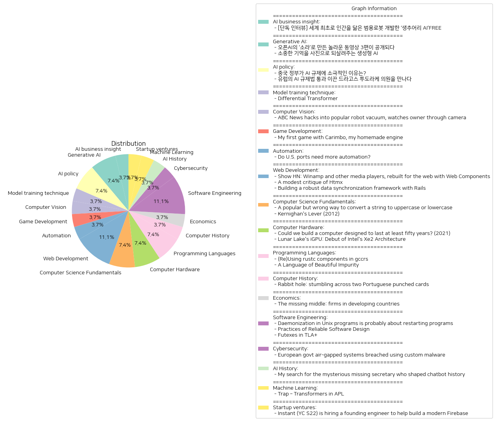

# Daily Artificial Intelligence Insights : News

## 💙 AI business insight

**요약:**

**요약 보고서**

1. **주요 테마**:
   - 인공지능(AI) 기술 발전: AI를 활용한 범용 로봇 개발이 주를 이루며, 인간과 유사한 행동을 실행할 수 있는 로봇의 등장.
   - 로봇 및 기술 혁신: 복잡한 일상 상황 속에서의 유연한 대응 능력을 갖춘 로봇 개발 추구.
   
2. **주요 사건**:
   - 캐나다 AI 로봇 전문기업 ‘생추어리 AI’가 세계 최초로 인간을 닮은 범용 로봇을 개발에 관한 독점 인터뷰. 이로 인해 AI와 로봇공학의 새로운 지평이 열렸음을 보여줌.
   
3. **영향 분석**:
   - **경제**: 로봇 공학의 발전은 다양한 산업에서의 효율성을 높이고 비용 절감 가능성을 제시. 그러나, 일부 직업군에서는 자동화로 인한 일자리 축소 우려.
   - **사회**: 인간과 유사한 로봇의 등장은 사회적, 윤리적 논쟁을 불러일으킬 수 있으며, 새로운 규제와 법적 문제를 제기할 가능성이 큼.
   - **정치**: 정부 차원에서 기술 발전을 위한 지원 및 규제 방안 논의 필요. 국가 간 AI 및 로봇 기술 경쟁 심화 가능성.
   
4. **최종 요약**:
   - 최근 AI와 로봇공학 분야에서의 혁신은 인간을 닮은 범용 로봇 개발로 이어지고 있으며, 이는 일상생활과 산업 전반에 걸쳐 큰 변화를 가져올 가능성이 있다. 이러한 기술의 발전은 긍정적인 경제적 효과를 기대할 수 있지만, 그에 따른 사회적 및 윤리적 도전 과제도 제기될 것이다. 앞으로 관련 분야의 발전과 이로 인한 사회적 변화에 주목할 필요가 있으며, 규제 및 정책 마련을 통한 균형 잡힌 접근이 요구된다.

**출처:**

 - [단독 인터뷰] 세계 최초로 인간을 닮은 범용로봇 개발한 ‘생추어리 AI’FREE (https://www.technologyreview.kr/%ec%9d%b8%ed%84%b0%eb%b7%b0-%ec%83%9d%ec%b6%94%ec%96%b4%eb%a6%ac-ai%ea%b0%80-%ea%b7%b8%eb%a6%ac%eb%8a%94-%eb%af%b8%eb%9e%98%ec%9d%98-%eb%a1%9c%eb%b4%87%ec%9d%80-%ec%8b%a4%ec%b2%b4%ed%99%94/)

## 🌅 Generative AI

**요약:**

1. **주요 주제**:
   - 인공지능(AI) 기술 발전: '소라'라는 새로운 동영상 생성 모델과 '합성 기억' 프로젝트를 통해 인공지능의 활용이 강조되고 있습니다.
   - 창의성 및 혁신: AI를 활용한 창의적 콘텐츠의 생성과 제작 과정이 중심 주제로 떠오르고 있으며, 과거의 추억을 회복하는 새로운 방법에 대한 논의가 이루어지고 있습니다.

2. **주요 사건**:
   - 오픈AI는 '소라'라는 동영상 생성 모델을 통해 세 명의 영상 크리에이터가 제작한 세 편의 동영상을 공개하며, 이들의 제작 목적과 기법에 대해 소개했습니다.
   - '합성 기억' 프로젝트는 생성형 AI를 이용해 저장되지 못한 가족의 추억을 이미지로 변환하는 방식을 통해 기억을 되살려주고 있으며, 이는 전 세계적으로 추진되고 있습니다.

3. **영향 분석**:
   - 경제: 이러한 AI 기술 발전은 미디어 및 콘텐츠 제작 산업에 새로운 혁신을 가져와 관련 기술 시장을 확대할 것으로 예상됩니다.
   - 사회: '합성 기억' 프로젝트는 가족과 개인의 과거 기억을 되살려 새로운 형태의 추억을 창출하며, 사회적으로 감정적 회복과 역사적인 가치 회복에 기여할 수 있습니다.

4. **최종 요약**:
   - 인공지능 기술의 진보는 영상 및 이미지 생성 분야에서 놀라운 혁신을 계속 이끌고 있습니다. 오픈AI의 '소라'와 생성형 AI를 통한 '합성 기억' 프로젝트는 창의적이며 뜻깊은 콘텐츠 제작에 기여하며, 사회적인 감정적 연결을 강화하고 있습니다. 이러한 기술 발전이 가져올 경제적 성장과 사회적 변화에 주목하면서, 앞으로의 AI 개발 방향성과 그에 따른 윤리 및 활용 방안에 대한 논의가 심화될 것으로 예상됩니다.

**출처:**

 - 오픈AI의 ‘소라’로 만든 놀라운 동영상 3편이 공개되다 (https://www.technologyreview.kr/%ec%98%81%ec%83%81-%ec%83%9d%ec%84%b1-%eb%aa%a8%eb%8d%b8-%ec%86%8c%eb%9d%bc%eb%a1%9c-%eb%a7%8c%eb%93%a0-%eb%86%80%eb%9d%bc%ec%9a%b4-%ec%98%81%ed%99%94-3%ed%8e%b8%ec%9d%b4-%ea%b3%b5%ea%b0%9c%eb%90%98/)
 - 소중한 기억을 사진으로 되살려주는 생성형 AI (https://www.technologyreview.kr/%ec%83%9d%ec%84%b1%ed%98%95-ai%eb%a1%9c-%ea%b0%80%ec%9e%a5-%ec%86%8c%ec%a4%91%ed%95%9c-%ea%b8%b0%ec%96%b5%ec%9d%84-%ec%82%ac%ec%a7%84%ec%9c%bc%eb%a1%9c-%eb%a7%8c%eb%93%a0%eb%8b%a4/)

## 🎇 AI policy

**요약:**

1. **주요 주제**:
   - AI(인공지능)에 대한 규제 문제
   - 각 국가와 지역의 AI 정책 차이
   - AI 규제가 산업 및 사회에 미치는 영향

2. **주요 이벤트**:
   - 중국 정부는 소비자 기술 플랫폼에 대해 강경한 규제를 실시하고 있지만, AI 분야에서는 자국 산업의 성장을 위해 규제를 느슨히 하고 있음.
   - 드라고스 투도라케 의원은 유럽 의회에서 AI 규제법 통과를 주도했으며, 이 법이 AI 산업을 개선할 수 있는 가능성을 확신하고 있다.

3. **영향 분석**:
   - **경제**: 중국의 느슨한 AI 규제는 AI 기술 개발과 산업 확대에 긍정적인 영향을 미칠 수 있지만, 글로벌 시장에서의 신뢰도 문제를 유발할 가능성도 있음. 반면, 유럽의 강력한 AI 규제 법안은 기술 혁신을 제한할 수 있지만 장기적으로 소비자 및 사회적 안정성을 향상시킬 수 있음.
   - **정치**: 각국의 AI 규제 정책은 국가 간의 정치적, 경제적 경쟁을 심화시키며, 국가별 AI 산업 주도의 전략적 접근 차이를 보여줌.
   - **사회**: AI 기술의 발전은 생활 편의성을 증대시킬 수 있지만, 충분한 규제가 없을 경우 개인정보 침해 및 사회적 문제를 야기할 수 있으며, 이에 대한 사회적 논의와 합의가 필요함.

4. **최종 요약**:
   - 현재 AI 규제에 대한 세계 각국의 태도는 상이하며, 이는 지역별 산업 전략 및 사회 안전의 중요성에 대한 차이에서 비롯됨. 중국은 AI 산업의 성장을 도모하고 있는 반면, 유럽은 규제를 통해 잠재적인 위험을 방지하고자 함. 이러한 규제의 차이는 장기적으로 AI 산업의 글로벌 경쟁력 및 사회적 신뢰에 영향을 미칠 것이며, 각국은 이에 대한 지속적인 평가와 정책 조정이 필요할 것이다. 미래에는 기술 발전과 규제의 조화로운 발달이 중요하게 다루어져야 할 것이다.

**출처:**

 - 중국 정부가 AI 규제에 소극적인 이유는? (https://www.technologyreview.kr/%ec%a4%91%ea%b5%ad-%ec%a0%95%eb%b6%80%ea%b0%80-%ed%98%84%ec%9e%ac%eb%a1%9c%ec%84%9c%eb%8a%94-ai-%eb%b6%84%ec%95%bc%eb%a5%bc-%ea%b0%80%ed%98%b9%ed%95%98%ea%b2%8c-%ea%b7%9c%ec%a0%9c%ed%95%98%ec%a7%80/)
 - 유럽의 AI 규제법 통과 이끈 드라고스 투도라케 의원을 만나다 (https://www.technologyreview.kr/ai-%ea%b7%9c%ec%a0%9c%eb%b2%95-%ed%86%b5%ea%b3%bc-%ec%9d%b4%eb%81%88-%eb%93%9c%eb%9d%bc%ea%b3%a0%ec%8a%a4-%ed%88%ac%eb%8f%84%eb%9d%bc%ec%bc%80-%ec%9d%98%ec%9b%90%ec%9d%84-%eb%a7%8c%eb%82%98%eb%8b%a4/)

## 🪄 Model training technique

**요약:**

1. **주요 테마**:
   - '차동 변압기(Differential Transformer)'는 인공지능 및 자연어 처리 분야에서 큰 관심을 받고 있습니다. 소프트맥스(attention maps) 두 개를 빼서 잡음을 줄이고 유효한 문맥을 증폭시키는 기술로, 기존의 트랜스포머(Transformer) 기법을 능가하는 성능을 보이고 있습니다. 특히, 긴 문맥 처리, 핵심 정보 검색, 착각 완화(hallucination mitigation)에서 이점을 제공합니다.

2. **주요 사건**:
   - '차동 변압기'는 자연어 처리에서 중요한 돌파구로 평가받고 있으며, 이는 언어 모델링의 효율성을 높이고, 긴 문맥에서의 처리 능력을 강화하는 새로운 방법을 제시합니다. 이 기술은 기존 트랜스포머 기술보다 우수함을 입증하며, 자연어 처리 효율성을 크게 개선하는 데 기여하고 있습니다.

3. **영향 분석**:
   - 경제: 차동 변압기의 발전은 인공지능 기반 서비스 및 제품의 효율성을 향상시켜, AI 기술을 활용하는 기업들의 경쟁력을 증대시킬 수 있습니다. 이는 AI 관련 산업과 기술 개발에 긍정적인 경제적 효과를 미칠 것으로 예상됩니다.
   - 사회: 인간과 기계 간의 상호작용을 보다 자연스럽게 하고 커뮤니케이션의 정확성과 효율성을 증대시키며, 이로 인해 다양한 분야에서 자동화 및 AI 활용이 증가할 가능성이 높습니다.

4. **최종 요약**:
   - 요약하면, '차동 변압기' 기술은 자연어 처리의 새로운 시대를 열 수 있는 잠재력을 가지고 있으며, 관련 연구 및 산업에 큰 변화를 가져올 것으로 기대됩니다. 향후 이 기술의 발전과 적용 범위를 주목할 필요가 있습니다. 특히, AI와 관련된 자동화 및 정보 처리를 요구하는 분야에서의 혁신적 발전을 지속적으로 관찰해야 할 것입니다.

**출처:**

 - Differential Transformer (https://arxiv.org/abs/2410.05258)

## 💙 Computer Vision

**요약:**

1. **주요 테마**:
   - 사이버 보안 위협
   - 사물 인터넷(IoT) 기기의 보안 취약성
   - 기업의 보안 관리 실패와 책임

2. **주요 사건**:
   - Ecovacs 로봇 청소기에서 해커들이 카메라와 마이크에 원격으로 접근할 수 있는 보안 결함이 발견되었다.
   - 해당 회사는 경고에도 불구하고 이 문제를 해결하지 않았으며, 이로 인해 수천 명의 사용자가 해킹에 노출될 위험에 처하게 되었다.

3. **영향 분석**:
   - **경제적 영향**: 소비자들이 IoT 기기에 대한 신뢰를 잃으면서 판매 감소 및 시장 위축 가능성이 있다. 또한, 보안 문제로 인해 추가 비용이 발생할 수 있다.
   - **사회적 영향**: 개인의 사생활 침해에 대한 우려가 커지며, 이러한 사건은 개인 정보 보호에 대한 경각심을 불러일으킨다.
   - **정치적 영향**: 정부나 규제 기관에서 IoT 기기에 대한 보안 강화 법안이나 규제를 추진할 가능성이 있다.

4. **최종 요약**:
   이번 Ecovacs 로봇 청소기 보안 결함 사건은 IoT 기기의 보안 취약성과 기업의 보안 책임에 대한 경각심을 다시 한 번 일깨웠다. 이러한 사건들은 소비자들의 신뢰를 떨어뜨리고 개인 정보 보호에 대한 우려를 증대시키며, 관련 법률 및 규제 강화의 필요성을 부각한다. 향후 IoT 기기의 보안 강화 조치와 관련 정책 변화를 주의 깊게 살펴볼 필요가 있다.

**출처:**

 - ABC News hacks into popular robot vacuum, watches owner through camera (https://www.abc.net.au/news/2024-10-04/robot-vacuum-hacked-photos-camera-audio/104414020)

## 🎠 Game Development

**요약:**

**요약 리포트**

1. **주요 테마**:
   - 카림보(Carimbo)라는 자체 개발 엔진과 함께한 첫 게임 개발
   - C++17과 Lua를 사용하여 게임을 처음부터 개발함
   - 게임 조정의 루아 VM에 프리미티브를 노출
   - 자원 관리, 객체 풀링, 엔터티 메시징을 위한 우편 서비스 기능

2. **주요 사건**:
   카림보라는 자체 개발 엔진을 사용하여 처음으로 게임을 개발하고, 이는 C++17 및 Lua를 활용하여 제작되었습니다. 게임 시스템에서는 자원 관리, 객체 풀링, 메시징 우편 서비스를 구현하여 엔터티 간의 메시지 전달을 효과적으로 처리할 수 있도록 구성된 것이 주요 특징입니다.

3. **영향 분석**:
   기술 분야에서는 이러한 개발이 사용자 정의 엔진을 통한 새로운 게임 디자인과 구현을 위해 다양한 프로그래밍 언어와 기법을 활용하는 방법을 새롭게 제시합니다. 이는 독립 개발자들에게 새로운 영감을 제공할 수 있을 뿐만 아니라, 게임 개발 산업의 기술적 진보에 기여할 수 있습니다. 사회적으로는 DIY(Do It Yourself) 정신을 장려하여 개인 개발자의 창작 역량을 강화할 수 있는 기회가 될 것입니다.

4. **최종 요약**:
   이 기사는 독립 게임 개발 환경과 기술 향상을 도모하는 개인 개발자들의 지속적인 노력을 조명합니다. 특히, C++17과 Lua scripting의 융합을 통해 자원 관리 및 게임 내 메시지 시스템 같은 복잡한 기능을 효과적으로 구현한 사례로 주목받을 만합니다. 미래에는 이러한 기술적 통합이 보다 많은 개인 개발자와 소규모 스튜디오에 의해 채택되면서 새로운 유형의 창의적인 게임들이 다수 출현할 가능성이 큽니다. 기술적 진보와 커뮤니티 기반 개발의 확산 속도를 주목해야 합니다.

**출처:**

 - My first game with Carimbo, my homemade engine (https://nullonerror.org/2024/10/08/my-first-game-with-carimbo/)

## 🚀 Automation

**요약:**

1. **주요 주제**:
   - 미국 항만 자동화 논쟁의 복잡성
   - 생산성 향상과 자동화의 연관성 문제
   - 노동조합 작업 규칙과 운영 시간 제한
   - 조정 부족과 인프라 투자 문제

2. **주요 사건**:
   - 미국 항만의 자동화가 생산성 향상에 항상 긍정적인 영향을 미치지 않는다는 논의가 진행 중임.
   - 항만 성능 저하의 주요 원인으로 자동화 부족이 아닌 다양한 요소들이 지적됨: 노동조합의 작업 규칙, 제한된 운영 시간, 부족한 조정, 인프라 투자 문제 등.

3. **영향 분석**:
   - **경제**: 항만 자동화 이슈는 물류 및 수출입에 직접적인 영향을 미칩니다. 효율성이 떨어져 운송 지연이 발생할 가능성 증가.
   - **정치**: 노동조합과의 협상 및 정책 결정을 포함하여 항만 운영에 대한 정부 개입이나 혁신에 대한 논의가 필요함.
   - **사회**: 자동화가 사람들의 일자리에 미치는 영향을 고려해야 함. 노동자 권리와 직업 안정성 문제에 대한 사회적 논의 확산.

4. **최종 요약**:
   미국 항만의 자동화에 대한 논쟁은 다차원적인 문제로, 자동화만이 문제가 아니며 여러 복합적인 요소들이 항만의 성능에 영향을 미친다. 경제적으로는 무역과 물류의 효율성에 중요한 영향을 미치며, 정치적으로 노동조합 및 정부 정책과의 관계가 더욱 중요해질 것이다. 사회적으로는 자동화와 인력 문제의 조화로운 해결이 필요하다는 결론을 내릴 수 있다. 이러한 요소들은 앞으로의 항만 운영 정책 결정 및 자동화 적용에 있어 중요한 사항들이며, 향후 이들 문제의 진전에 대한 지속적인 모니터링이 필요하다.

**출처:**

 - Do U.S. ports need more automation? (https://www.construction-physics.com/p/do-us-ports-need-more-automation)

## 🍋 Web Development

**요약:**

**주요 테마**:
세 기사의 주요 테마로는 웹 기술의 발전, 사용자 인터페이스 및 데이터 동기화가 포함됩니다. 특히, 웹 컴포넌트를 이용한 미디어 플레이어의 재구축, Htmx의 문제점 식별 및 개선, 그리고 Rails를 활용한 데이터 동기화 프레임워크 구축 등이 두드러집니다.

**주요 사건**:
1. **Winamp 및 기타 미디어 플레이어의 웹 재구축**: Mux Inc는 소셜 미디어 앱과 유튜브 플레이어에서 영감을 받은 모바일 우선 테마를 개발하였으며, 이는 간단한 재생 제어로 짧은 콘텐츠에 최적화되었습니다.
2. **Htmx에 대한 비판과 개선**: Htmx를 복잡한 사용자 인터페이스에 사용하면서 지역성 주장과 모순되는 암시적 행동과 복잡한 사례가 발생했습니다. 팀은 Htmx 의존성을 제거하고 서버 사이드 언어를 사용해 이 아이디어의 장점을 유지하며 문제를 해결할 계획입니다.
3. **Rails를 이용한 견고한 데이터 동기화 프레임워크 구축**: Zipline의 ZipIO 시스템은 모듈식, 비동기 아키텍처 및 강력한 오류 처리와 로깅을 통해 타사 앱과 통합됩니다. Ruby on Rails와 맞춤형 DSL을 사용하여 데이터 변환 및 워크플로 정의가 가능하여 유지보수와 확장성이 용이합니다.

**영향 분석**:
- **경제**: 웹 기술의 발전은 모바일 애플리케이션 및 웹 페이지의 사용자 경험 향상에 기여하여 디지털 콘텐츠 산업에 긍정적인 영향을 미칠 수 있습니다.
- **사회**: 사용자 인터페이스의 개선과 데이터 동기화 기술의 발전은 사용자 편리성을 증대시키며, 더 복잡한 시스템 관리의 부담을 줄일 수 있습니다.
- **기술**: Htmx에 대한 비판과 개선은 새로운 웹 프레임워크 및 기술에 대한 철저한 평가와 발전의 필요성을 강조합니다.

**최종 요약**:
세 기사는 웹 기술과 사용자 인터페이스의 개선, 그리고 데이터 동기화 프레임워크 구축과 관련된 혁신을 다루고 있습니다. 앞으로 웹 기술 발전과 데이터 관리의 효율성이 중요해질 것으로 보이며, 사용자 경험 향상을 위한 기술적인 도전이 계속될 것으로 예상됩니다. 추가적으로, Htmx와 같은 특정 기술에 대한 피드백은 향후 개발자들이 기술 선택 시 더욱 신중해지고, 더 나은 기술 솔루션을 모색하게 할 것입니다.

**출처:**

 - Show HN: Winamp and other media players, rebuilt for the web with Web Components (https://player.style)
 - A modest critique of Htmx (https://chrisdone.com/posts/htmx-critique/)
 - Building a robust data synchronization framework with Rails (https://pcreux.com/2024/10/07/rails-data-sync-service.html)

## ✈️ Computer Science Fundamentals

**요약:**

1. **주요 테마**:
   - 문자열 변환의 문제점: 문자열을 대문자나 소문자로 변환하는 과정에서 발생할 수 있는 기술적 문제와 해결 방법.
   - 코드 작성과 디버깅의 상관관계: 현명한 코드를 작성하는 것이 디버깅을 어렵게 만든다는 기존의 견해에 대한 반박과 코드 작성 기술 향상의 의미.

2. **주요 사건**:
   - 첫 번째 기사에서는 문자열을 대문자나 소문자로 변환할 때 발생할 수 있는 문제점과 더 나은 해결 방안(LCMapStringEx 또는 ICU 라이브러리 사용)을 제안한다.
   - 두 번째 기사에서는 'Kernighan's Lever'를 인용하여 코드를 현명하게 작성하는 것이 디버깅을 어렵게 할 수 있지만, 이는 필수적인 스킬 향상을 시킬 수 있다는 주장을 제시한다. 또한, 현재 능력을 뛰어넘어 스스로를 계발해야 한다고 설명한다.

3. **영향 분석**:
   - 기술 분야: 문자열 변환 방법의 문제점은 소프트웨어 개발에서 널리 퍼진 문제이며, 적절한 라이브러리를 사용할 경우 버그를 줄이고 성능을 향상시킬 수 있다.
   - 프로그래밍 교육: 코드를 작성하는 데 있어서 현명한 기술 사용은 개발자의 스킬 향상에 긍정적인 영향을 미칠 수 있으며, 이는 더 나은 소프트웨어 개발로 이어질 가능성이 높다.

4. **최종 요약**:
   - 문자열 변환과 관련된 문제는 프로그래밍에서 중요한 이슈이며, 고급 기술과 적절한 도구 사용이 중요하다.
   - 코드를 작성하는 과정에서 현명한 접근 방식은 필수적이며, 개발자들이 자신을 위한 도전을 지속적으로 추구할 필요가 있다. 이러한 발전은 궁극적으로 소프트웨어 개발과 기술 개발을 향상시키는 데 기여한다.향후, 이러한 기술 발전은 더욱 발전된 프로그래밍 방법론과 도구 개발에 영향을 줄 가능성이 높다.

**출처:**

 - A popular but wrong way to convert a string to uppercase or lowercase (https://devblogs.microsoft.com/oldnewthing/20241007-00/?p=110345)
 - Kernighan's Lever (2012) (https://www.linusakesson.net/programming/kernighans-lever/index.php)

## 🪄 Computer Hardware

**요약:**

1. **주요 주제**:
   모든 뉴스 기사에서 반복되는 주요 주제는 기술 발전과 지속 가능성입니다. 'ForeverComputer' 아이디어는 오래 지속되고 유지 관리가 용이한 컴퓨터를 제작하여 현대 컴퓨터의 대안이 되는 것을 목표로 하고 있습니다. 또한, 인텔의 Lunar Lake iGPU는 개선된 그래픽 성능과 에너지 효율성을 제공하여 기술 혁신을 강조합니다.

2. **주요 사건**:
   - 'ForeverComputer'는 오픈 소스 디자인과 쉽게 교체할 수 있는 부품을 사용하여 50년 동안 사용할 수 있는 컴퓨터를 제안합니다. 이는 내구성과 단순함을 중시하여 전통적인 현대 컴퓨터의 한계를 극복하고자 합니다.
   - 인텔의 Lunar Lake iGPU는 Xe2 그래픽 아키텍처를 도입하여 특정 작업에서 더 나은 성능을 제공합니다. 이는 AMD의 Strix Point iGPU와 경쟁 관계에 있으며, 보다 높은 연산 성능을 제공하지만 더 많은 전력을 소모합니다.

3. **영향 분석**:
   - **경제**: ForeverComputer 개념은 사용자의 긴 수명 제품에 대한 수요를 증대시키고, 컴퓨터 구성 요소 및 수리 산업의 발전을 촉진할 수 있습니다. 인텔의 신기술은 그래픽 성능의 향상이 요구되는 산업에 긍정적인 영향을 미칠 것입니다.
   - **사회**: ForeverComputer는 사용자가 기술 수명 연장에 직접 개입할 수 있는 기회를 제공함으로써 지속 가능성과 환경 보호에 기여할 것입니다.
   - **기술**: 인텔과 AMD의 그래픽 유닛 경쟁은 사용자의 선택 폭을 넓히고 전반적인 기술 발전을 가속화할 수 있습니다.

4. **최종 요약**:
   전체적으로 이러한 뉴스에서는 기술의 지속 가능성과 에너지 효율성을 주요 이슈로 보고 있습니다. 'ForeverComputer'는 장기적인 내구성과 환경 친화성을 추구하는 컴퓨터의 새로운 패러다임을 제시하며, 최신 iGPU 기술의 발전은 성능 향상에 초점을 맞추고 있습니다. 앞으로 주목할 점은 사용자 주도의 기술 제품 수명 연장 움직임과 에너지 효율성을 극대화하기 위한 기술 혁신 계속될 가능성입니다.

**출처:**

 - Could we build a computer designed to last at least fifty years? (2021) (https://ploum.net/the-computer-built-to-last-50-years/index.html)
 - Lunar Lake's iGPU: Debut of Intel's Xe2 Architecture (https://chipsandcheese.com/p/lunar-lakes-igpu-debut-of-intels)

## 👽 Programming Languages

**요약:**

**주요 테마**:
1. 기술 및 프로그래밍: gccrs와 rustc 컴파일러 관련 기술적 통합 및 발전에 대한 논의가 중심 테마로 나타납니다.
2. 언어의 역사 및 진화: 영국 역사에서 프랑스 영향이 없었던 대안적 시나리오를 통해 영어의 역사적 진화와 그 영향에 대한 고찰이 두 번째 테마입니다.

**주요 사건**:
1. gccrs가 공식 Rust 컴파일러(rustc)의 구성 요소를 재사용함으로써 개발 속도를 높이고 Rust 표준과 동일한 동작을 보장하려는 노력이 있습니다. 이 과정은 중간 C++ 컴파일러를 사용하여 컴포넌트를 컴파일하고 최종 gccrs 컴파일러에 연결하는 부트스트래핑 과정을 통해 이루어집니다.
2. "아름다운 불순성의 언어"에서는 영국이 헤이스팅스 전투에서 승리하여 프랑스 영향을 받지 않는 영어의 대체 역사가 이루어졌을 경우를 탐구합니다. 이 언어는 독특한 용어를 가졌지만, 저자는 독일어와 라틴어 영향을 조화롭게 받은 영어의 풍부함을 최종적으로 더 높이 평가합니다.

**영향 분석**:
1. 기술적 통합의 측면에서, gccrs와 rustc의 컴포넌트 통합은 컴파일러 기술의 발전과 오픈 소스 소프트웨어 개발에 긍정적인 영향을 미칠 수 있습니다. 이는 개발 시간이 단축되고 성능이 향상될 가능성이 있습니다.
2. 언어의 역사적 발전과 문화적 다원성에 대한 탐구는 사회적으로 언어의 다양성과 발전 과정을 재조명하고, 문화적 정체성의 복합성을 이해하는데 기여할 수 있습니다.

**최종 요약**:
현재의 기술 발전과 역사적 언어 발달에 대한 인식은 각각의 분야에서 중요한 진보와 성찰을 가져옵니다. gccrs와 rustc의 구체적인 통합 과정은 미래의 기술 혁신의 가능성을 열어주는 동시에, 역사적 언어 발달 탐색은 문화적 정체성과 언어의 다층적인 형태를 재평가할 기회를 제공합니다. 앞으로의 발전 방향으로는 다양한 프로그래밍 언어의 상호운영성과 기술 발전, 그리고 언어적 다양성에 대한 지속적인 탐구를 주목할 필요가 있습니다.

**출처:**

 - (Re)Using rustc components in gccrs (https://rust-gcc.github.io/2024/09/20/reusing-rustc-components.html)
 - A Language of Beautiful Impurity (https://www.edwest.co.uk/p/a-language-of-beautiful-impurity)

## 🌿 Computer History

**요약:**

## 요약 보고서

### 1. 주요 테마
이번 뉴스에서는 다음과 같은 주제가 중심을 이루고 있습니다:
- 기술 불신과 디지털 미스터리: 사용자가 디지털 기술에 대한 불신을 표명하는 가운데, 오래된 포르투갈 컴퓨터 서적과 펀치 카드에 얽힌 미스터리를 발견하였습니다.
- 역사적 데이터의 복구: 사용자에 의해 펀치 카드가 해독되며, 역사적인 데이터가 드러났습니다. 이는 과거의 작업 방식 및 데이터 관리에 대한 통찰을 제공합니다.

### 2. 주요 사건
주요 사건은 다음과 같이 요약됩니다:
- 사용자가 오래된 포르투갈 컴퓨터 서적과 관련된 두 개의 펀치 카드를 발견하였습니다. 이 카드는 역사적이고 기술적인 비밀을 포함하고 있었습니다.
- 카드는 해독되었으며, 그 결과 한 사람, João A. Fernandes라는 이름의 직원 데이터와 근무 시간이 담긴 것으로 확인되었습니다.

### 3. 영향 분석
이번 사건은 다음과 같은 영향을 미칠 수 있습니다:
- **기술 및 역사적 연구**: 과거의 데이터 관리 방식과 기술의 진화를 연구하는 데 있어 귀중한 사례가 될 수 있습니다. 이는 기술자와 역사학자들에게 새로운 조사 자료를 제공할 수 있습니다.
- **문화적 가치**: 오래된 기술물의 발굴이 현대 문화에 역사적 가치 및 전통에 대한 새 재조명 기회를 제공합니다.
- **데이터 보존의 중요성**: 역사적 데이터의 보존이 얼마나 중요한지를 다시 한 번 인식하게 됩니다. 이는 데이터 관리 방식에 대한 새로운 방안을 고민하는 계기가 될 수 있습니다.

### 4. 최종 요약
이번 발견은 디지털 기술에 대한 불신과 미스터리의 해결 과정을 보여주며, 과거의 데이터 관리를 연구하는 중요한 사례로 남을 것입니다. 또한, 이러한 이야기는 문화유산에 대한 관심과 보존 활동의 중요성을 고취시킬 것으로 보입니다. 향후에는 이런 발견이 데이터 보존 및 관리에 새로운 기술적 접근이 필요함을 제안할 수 있으며, 역사를 현대 관점에서 탐구하는 데 많은 기회를 제공할 것입니다.

**출처:**

 - Rabbit hole: stumbling across two Portuguese punched cards (https://blog.jgc.org/2024/10/rabbit-hole-stumbling-across-two.html)

## 🫧 Economics

**요약:**

**주요 주제**:
발전 경제학에서 기업 성장이 중요함을 강조하며, 개발도상국에서의 경제 성장과 개인의 번영을 위한 중소기업의 역할이 주요 테마로 나타났다. 기업이 자본과 기술, 경영 기법에 접근할 수 있도록 지원하는 것이 핵심이다.

**주요 사건**:
발전 경제학에서는 전통적 개인 가구 개입에서 벗어나 기업의 성장이 국가 경제 발전의 핵심 요소로 주목받고 있다. 이 기사에서는 개발도상국 기업들이 성장할 수 있도록 지원하는 방법과 그로 인해 실질적인 번영을 선사할 수 있다는 점이 강조되었다.

**영향 분석**:
- *경제*: 기업의 성장은 국가의 경제 성장을 촉진시키며, 특히 개발도상국에서는 개인의 생활 수준 향상에도 큰 기여를 할 수 있다. 중소기업이 자본과 기술, 경영 기법을 통해 성장하면, 국가 경제 전반에 긍정적인 변화를 일으킬 수 있다.
- *사회*: 기업의 성장은 일자리 창출과 소득 증대를 통해 사회 전반의 생활 수준을 향상시킬 수 있다. 이는 궁극적으로 개인의 효용 증대와 생활의 질 향상으로 이어진다.

**최종 요약**:
이번 뉴스에서 강조된 바와 같이, 개발도상국에서 기업 성장의 중요성은 점점 더 커지고 있다. 자본 접근성, 기술 활용, 경영 개선을 통해 기업이 발전함으로써 국가 경제의 성장을 촉진하고 사회적 번영을 이끌어낼 수 있다. 앞으로 기업 성장 지원 정책과 실제 기업 성장의 사례를 통해, 개발도상국의 경제적 및 사회적 변화 추세를 주의 깊게 지켜보는 것이 중요하다.

**출처:**

 - The missing middle: firms in developing countries (https://asteriskmag.com/issues/07/want-growth-kill-small-businesses)

## 🍋 Software Engineering

**요약:**

**요약 보고서**

1. **주요 주제**:
   - UNIX 프로그램에서의 데몬화는 프로그램 재시작과 관련이 있으며, 데몬이 시스템 부팅 중이 아닌 수동으로 재시작되던 시절에 환경으로부터 분리되어 문제를 피하기 위해 시작되었다.
   - 믿을 수 있는 소프트웨어 설계를 위한 관행으로는 기존 솔루션의 사용, 설계 단계의 최소화, 기능의 제한 등이 있으며, 이들을 통해 실행 및 유지보수가 쉬운 메모리 내 캐시를 설계하였다.
   - Futexes는 빠른 뮤텍스 구현을 위한 방법으로, Justine Tunney의 사례를 통해 복잡한 상황에서도 시스템 호출을 피하고 경쟁 조건을 예방하는 방식으로 사용된다.

2. **주요 사건**:
   - UNIX 데몬 프로그램의 데몬화 동작의 기원과 실용적 이유가 전달되었다.
   - 신뢰성 있는 소프트웨어 설계를 위한 8가지 관행을 통해 빠르고 작은 메모리 내 캐시의 실제적인 설계 방법이 소개되었다.
   - Futexes의 구현 사례를 통해 뮤텍스 성능 향상과 관련된 연구가 설명되었다.

3. **영향 분석**:
   - UNIX 데몬화의 관행은 오늘날 시스템 설계의 안정성과 유연성을 높이는 데 기여하고 있다. 이는 소프트웨어 개발에 있어서의 주요 이해를 제공하며, 특히 신뢰성의 중요성을 재확인시켜준다.
   - 소프트웨어 설계 관행은 기업의 소프트웨어 개발 과정에서의 시간과 비용 절감을 가능케 하며, 특히 성능과 신뢰성을 높이는 데 중점을 둔다.
   - Futexes의 민첩한 동작은 운영 체제와 소프트웨어 타이밍의 효율성을 개선할 가능성을 가지고 있으며, 경쟁 조건의 방지로 시스템 전반의 안정성을 강화할 수 있다.

4. **최종 요약**:
   - 이번 뉴스에서는 UNIX 데몬화, 믿을 수 있는 소프트웨어 설계 방법, 그리고 futexes의 효율적인 사용 등 소프트웨어 설계와 실행을 다룬 다양한 측면에서의 혁신이 소개되었다. 이러한 혁신은 각기 경제적 효율성과 시스템 안정성을 강화하는 데 기여하고 있으며, 앞으로 이러한 기술적 발전이 소프트웨어 산업 전반에 어떻게 적용될 수 있을지 주목할 필요가 있다. 향후 기술 발전과 더불어 이러한 관행을 보다 광범위하게 채택할 가능성과 신기술과의 통합이 흥미롭게 전개될 것이다.

**출처:**

 - Daemonization in Unix programs is probably about restarting programs (https://utcc.utoronto.ca/~cks/space/blog/unix/DaemonizationAndRestarts)
 - Practices of Reliable Software Design (https://entropicthoughts.com/practices-of-reliable-software-design)
 - Futexes in TLA+ (https://surfingcomplexity.blog/2024/10/05/futexes-in-tla/)

## 🤩 Cybersecurity

**요약:**

1. **주요 테마**:
   - 유럽 및 남아시아의 격리 시스템을 표적으로 한 사이버 공격.
   - 국가 지원을 받는 고급 지속적 위협(APT) 그룹의 활동.
   - 맞춤형 멀웨어를 사용하여 민감한 정보의 절취 및 유출.
   - GoldenJackal이라는 APT 그룹의 첩보 행위와 정보 수집 기법에서 나타나는 고급 기술.

2. **주요 이벤트**:
   - ESET 연구진은 GoldenJackal이라는 사이버 스파이 그룹이 고립된 네트워크(air-gapped systems)를 대상으로 공격을 가했다는 것을 발견했다.
   - 이 그룹은 GoldenDealer, GoldenHowl, GoldenRobo와 같은 맞춤형 툴을 사용해서 시스템을 침입하고 민감한 정보를 탈취하는데 성공했다.

3. **영향 분석**:
   - **경제적 영향**: 정보 유출로 인해 기업의 기밀 유지 및 경쟁력 손실 위험 증가.
   - **정치적 영향**: 국가 간 사이버 보안 긴장 고조. 특히 국가 보안 관련 시설이 영향을 받을 경우 더욱 심각해질 수 있음.
   - **사회적 영향**: 공공의 프라이버시 보호에 대한 걱정 증가. 사이버 공격에 대한 경각심이 커지면서 보안 시스템 강화 요구.

4. **최종 요약**:
   GoldenJackal의 공격은 사이버 보안의 중요성을 다시 한 번 부각시켰고, 고립된 시스템조차도 완전한 안전을 보장할 수 없다는 것을 보여주었다. 이에 따라 세계의 각 정부 및 기업은 보안 전략을 재검토하고 강화해야 할 필요성이 높아졌으며, 정보 보호를 위한 다각적 접근이 요구된다. 향후 이와 같은 정교한 사이버 공격에 대응하기 위해서는 최신 기술 개발과 보안 인프라의 지속적인 갱신이 필요할 것으로 예상된다.

**출처:**

 - European govt air-gapped systems breached using custom malware (https://www.welivesecurity.com/en/eset-research/mind-air-gap-goldenjackal-gooses-government-guardrails/)

## 🤩 AI History

**요약:**

1. **주요 주제**:
   - 컴퓨터 역사에서 여성의 기여: MIT의 고유 컬렉션에서 연구원이 개발 초기 단계에서 중요한 역할을 했던 비밀스러운 비서의 실종 사건을 조사하면서, 컴퓨터 역사에서 종종 간과되었던 여성들의 기여와 그들의 노동과 전문성의 인식을 강조합니다.
   - 초기 챗봇 개발: 역사적인 챗봇인 Eliza의 발전 과정에서 분명히 중요한 기여가 있었던 인물에 대한 탐색이 이루어지고 있습니다.

2. **주요 사건**:
   - MIT 연구원들이 Eliza라는 초기 챗봇의 발전에 중요 인물로 여겨지는 실종된 비서를 찾기 시작했습니다.
   - 이 비서의 이야기를 통해 컴퓨터 발전의 역사에서 여성의 중요한 기여가 종종 간과되었다는 식견을 얻게 됩니다.

3. **영향 분석**:
   - 사회적 측면: 여성의 이력과 기여를 재조명하게 되면서, 역사적 인식과 현재의 성 평등 디스코스에서 중요한 이야기를 제공합니다. 이는 교육과 연구 방향에 영향을 줄 수 있으며, 다양한 분야에서 인류와 기술의 발전에 대한 이해를 심화시키는 데 기여할 것입니다.

4. **최종 요약**:
   - 컴퓨팅 역사 속에서 여성들의 역할이 묻혀있는 것이 드러나며, 이는 과거의 회고적 분석과 더불어 현재 성별 평등을 논하는 데 중요한 안건이 될 것입니다. 또한 이는 기술의 발전 속에서 다양한 이들이 가지고 있는 잠재적 기여와 그 인식을 재조명함으로써 사회 전반에 긍정적인 영향을 미칠 수 있습니다. 앞으로도 이러한 숨겨진 역사와 이야기를 발굴하고 연구하는 움직임을 계속해서 주목할 필요가 있습니다.

**출처:**

 - My search for the mysterious missing secretary who shaped chatbot history (https://theconversation.com/my-search-for-the-mysterious-missing-secretary-who-shaped-chatbot-history-225602)

## 🚀 Machine Learning

**요약:**

**일반 요약 보고서:**

1. **주요 주제:**
   - 최신 인공지능 기술의 발전: APL에서 자가회귀 변환기(autoregressive transformers)인 트랩(Trap)의 구현이 주목받고 있음.
   - 고수준 라이브러리와 저수준 구현의 결합을 통해 더 간결하고 이동 가능한 소프트웨어 개발 추세.
   - 백프로파게이션과 같은 학습 기법을 지원하여 인공지능 모델의 훈련 효율성 증대에 대한 관심 증가.

2. **주요 사건:**
   - 트랩은 APL에서 GPT2와 같은 자가회귀 변환기를 구현하여 인공지능 모델을 더 효과적으로 훈련할 수 있도록 함.
   - Adam 옵티마이저를 통한 훈련 기법 도입으로 결과적으로 더 나은 성능을 목표.

3. **영향 분석:**
   - **경제:** 인공지능 기술이 계속 발전함에 따라 관련된 소프트웨어와 솔루션의 경제적 가치가 증가할 전망. 특히, 간결하고 이동 가능한 애플리케이션 개발은 기업에서의 채택률 향상에 기여할 수 있음.
   - **정치:** 이러한 발전된 인공지능 기술은 각국의 기술 경쟁력을 좌우할 수 있으며, 기술 정책에 상당한 영향을 미칠 수 있음.
   - **사회:** 인공지능 모델 훈련의 효율성이 증가하면 사회 전반에 걸쳐 인공지능 기반 서비스가 더욱 보편화될 가능성이 있음. 이는 교육, 보건, 금융 등 다양한 분야에 혁신을 불러올 수 있음.

4. **최종 요약:**
   - 트랩과 같은 인공지능 기술의 발전은, 작고 효율적인 코딩 환경에서 고성능의 모델을 구현할 수 있게 함으로써, AI 연구 및 개발의 새로운 가능성을 열어가고 있음.
   - 이러한 발전은 이미 여러 분야에서 널리 사용되는 인공지능의 가속화된 혁신을 이끌 것으로 기대됨.
   - 향후 관찰해야 할 점은, 이 기술이 실제 경제적 및 사회적 비즈니스 모델로 어떻게 통합되어 발전하는지, 그리고 이러한 기술 발전이 정책 및 법적 환경에 미치는 영향력임.

**출처:**

 - Trap – Transformers in APL (https://github.com/BobMcDear/trap)

## ☀️ Startup ventures

**요약:**

**요약 보고서:**

1. **핵심 주제:**
   - 스타트업 고용
   - 소프트웨어 개발
   - Firebase 대체 기술

2. **주요 사건:**
   - Instant이라는 이름의 스타트업이 창립 엔지니어를 채용 중입니다.
   - 이 스타트업은 사용자가 브라우저에서 직접 쿼리를 작성할 수 있는 현대적 Firebase 대안 기술을 개발 중입니다.
   - 본 팀은 현재 샌프란시스코에 위치한 3인 팀으로 구성되어 있으며, 새로운 기술 개발에 나설 해커 인재를 찾고 있습니다.

3. **영향 분석:**
   - **경제:** 스타트업의 이러한 변혁적인 기술 개발은 기술 산업과 개발자 인력 시장에 긍정적인 경제적 영향을 미칠 수 있습니다.
   - **사회:** 개발자가 보다 직관적으로 데이터베이스 쿼리를 작성할 수 있는 도구의 등장은 소프트웨어 개발 문화와 환경을 변화시킬 가능성이 있습니다.
   - **기술:** Firebase 대체 제품의 등장은 클라우드 데이터베이스 시장에 경쟁 요소를 도입하며 기술 발전을 촉진할 수 있습니다.

4. **최종 요약:**
   - Instant이라는 혁신적인 스타트업이 사용자의 편의성을 높인 데이터베이스 관리 도구를 개발하며, 소프트웨어 개발 환경에 큰 변화를 가져올 것으로 기대됩니다. 이러한 기술 발전은 소프트웨어 및 클라우드 서비스 분야에 새로운 경쟁력을 제공하며, 관련 인재 시장에도 다소의 영향을 줄 것으로 보입니다. 향후 이 기술의 시장 반응 및 실질적인 사용 사례의 증가를 주목할 필요가 있습니다.

**출처:**

 - Instant (YC S22) is hiring a founding engineer to help build a modern Firebase (https://news.ycombinator.com/item?id=41781768)

